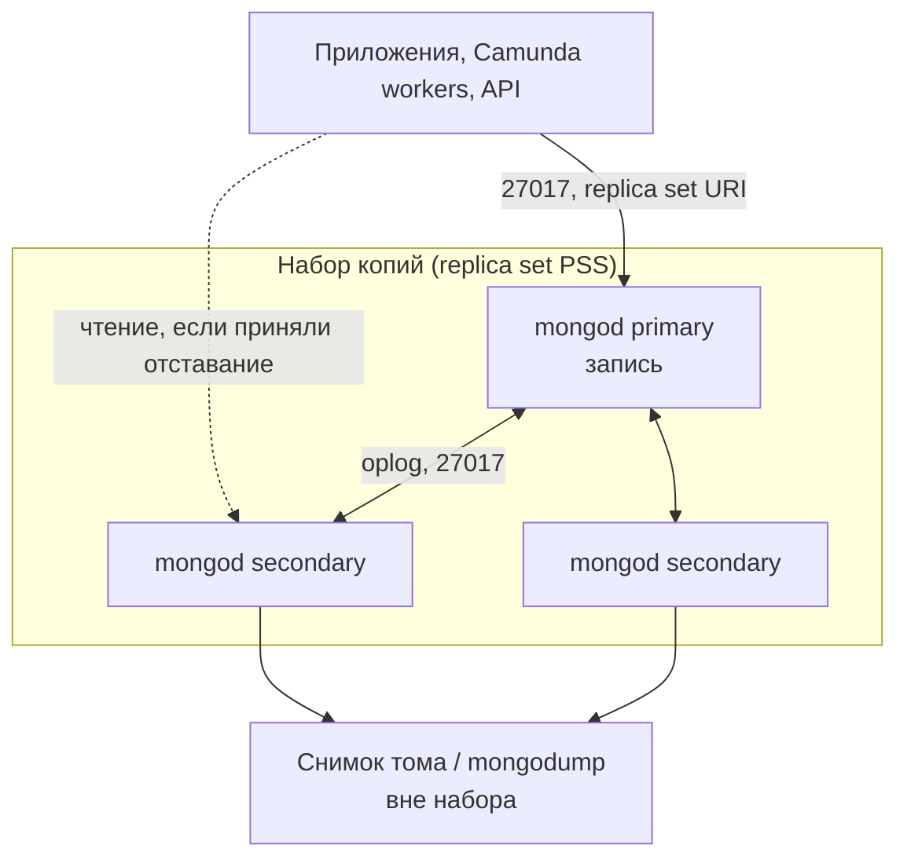

# MongoDB Community Server 7.0.40 — развёртывание и настройка

MongoDB Community Server — документная СУБД: хранит JSON-подобные записи (BSON), ищет по индексам, копирует данные между машинами. Этот документ про **свою установку** версии **7.0.40** (релиз 11 августа 2026; на дату подготовки — последний **опубликованный** патч линии **7.0**). В changelog линии уже есть секция 7.0.41, но страница Release Notes 7.0 и теги официального образа на эту дату заканчиваются на **7.0.40**. Ставить «то, что в changelog, но ещё не в Release Notes / не в образе» нельзя. Это не Atlas, не Enterprise и не Percona Server for MongoDB.

Документация линейки: https://www.mongodb.com/docs/v7.0/  
Release Notes 7.0: https://www.mongodb.com/docs/v7.0/release-notes/7.0/  
Официальный образ: `mongodb/mongodb-community-server:7.0.40-ubi9-slim` (Docker Hub; тег `7.0-ubi9-slim` на эту дату указывает на тот же патч — в бою пинить **полный** `7.0.40-ubi9-slim`, не `7.0` и не `latest`).

Лицензия сервера: **SSPL** (Server Side Public License). Это не BSD/Apache. Юридически это не «просто open source как Kafka». Kubernetes-оператор MCK — отдельно, Apache 2.0; лицензия **сервера** от этого не меняется.

EOL линии 7.0 (on-prem / Enterprise Advanced и Atlas Dedicated): **31 августа 2027**. На дату документа линия живая. Патчи младше 7.0.40, особенно 7.0.0–7.0.15, содержат закрытые позже Critical Advisories — «любой 7.0» в бой не ставят.

Этот текст — не набор команд «скопируй и запусти», а правила, без которых экземпляр не будет одновременно устойчивым к сбоям, масштабируемым и безопасным. Пошаговая установка — в `MongoDB 7.install.md`.

---

## Назначение системы

MongoDB нужен, чтобы **хранить и читать документы** (заявки, проекции для экрана, идемпотентность шага интеграции) с гибкой схемой и индексами под ваши запросы.

События по-прежнему везёт Kafka. Эталон карточек живёт в озере — **если вы не назначили Mongo этим озером сознательно**. Процессы ведёт Camunda. Интеграционное API ходит наружу. MongoDB — **документное хранилище сервиса**, а не шина, не кэш и не процессный движок.

Точечные правки одной записи здесь нормальны. Горизонталь записи сама не появляется: пишет один главный узел набора копий. Если рабочий набор записи не влезает в один такой узел — это шарды **или** другой слой, не «добавим ещё копию».

---

## Перечень функций

Что умеет MongoDB Community Server 7.0:

1. **Хранить документы BSON** в коллекциях и базах. Схема гибкая, индексы проектируете сами. Лимит одного документа — **16 МБ**. Больше — GridFS или другое хранилище, не «увеличить лимит».
2. **Искать по индексам** и гонять агрегации. Запрос без индекса на больших объёмах = полный перебор коллекции.
3. **Держать набор копий (replica set):** один узел принимает запись (primary), остальные копируют журнал операций (oplog). При падении главного остальные голосуют, кто станет новым. Без большинства голосов **записи нет**.
4. **Подтверждать запись** правилом write concern: `{ w: 1 }` — только главный; `{ w: "majority" }` — большинство узлов с данными. Без `wtimeout` клиент может ждать **бесконечно**, если большинство недоступно.
5. **Читать с заданной «свежестью»** (read concern) и **с выбранного узла** (read preference). По умолчанию чтение идёт на главный. Копия может отстать. Поставщик прямо: набор копий **не** для того, чтобы сваливать чтение на запасные «по умолчанию».
6. **Резать коллекцию на шарды** по ключу шардирования, если один главный узел уже мал. Клиенты ходят на процесс-роутер `mongos`, не на шарды напрямую. Метаданные шардов держит отдельный набор config-серверов (CSRS).
7. **Подписываться на изменения** (change stream). Нужен replica set или шардированный кластер. На одиночном процессе этого нет. Это не Kafka: нет долгого хранения как у топика.
8. **Проводить транзакции** на replica set (на шардах — с оговорками стоимости).
9. **Управлять доступом:** SCRAM (пароль, заводской механизм Community) или сертификат X.509; роли на базы. По умолчанию **проверка прав выключена**.
10. **Шифровать канал** TLS. В заводских настройках **выключено**.
11. **Снимать копию** (`mongodump` / `mongorestore`, снимки файловой системы). Копии узлов это **не** заменяют: команду «удали базу» сосед послушно повторит.

Чего система **не** делает и часто путают: она не шина событий, не BPMN, не интеграция с ведомствами, не кэш «как Redis». Нативной шифровки файлов движком, журнала аудита на сервере, LDAP/Kerberos и in-memory движка в Community **нет** — это Enterprise. Непрерывный backup с точкой во времени «из коробки» — Ops Manager / Atlas, не Community. Двух главных писателей в двух дата-центрах эта СУБД не умеет.

---

## Требования к развёртыванию

### Требования к ПО

| Что | Что ставить | Комментарий |
|---|---|---|
| **Формат поставки** | Контейнеры Docker **или** поды Kubernetes | Официальный образ `mongodb/mongodb-community-server:7.0.40-ubi9-slim`. Не устаревший `library/mongo` как единственный ориентир. Для Kubernetes в этом документе — оператор **MCK 1.10.0** (30 июля 2026) и объект `MongoDBCommunity`. |
| **Kubernetes** | Оператор MCK 1.10.0 | CR Community официально умеет тип **только `ReplicaSet`**. Шарды Community Server **умеет**; официальный Community-оператор их **не** описывает. Старый репозиторий Community Operator — EOL (best-effort до ноября 2025): **не** начинать с него. |
| **ОС** | Linux (хост контейнера / нода Kubernetes) | Production notes поставщика — про ядро Linux (THP, NUMA, swappiness). Образ — UBI9. **Боевой mongod на Windows-хосте в схеме с Kubernetes не предполагается.** |
| **Оркестратор боя** | Kubernetes (свой) | StatefulSet + том на каждый узел с данными. Пинить `spec.version` **полной** строкой (`7.0.40`), не `7.0`. Совместимость конкретного Helm-тега с 1.10.0 **сверять** на стенде. |
| **Диск** | Локальный быстрый том (SSD; RAID-10 если аппаратный RAID). XFS для данных **настоятельно** рекомендуется | NFS формально допустим, если POSIX, но поставщик предупреждает: обычно **медленнее**. Не строить бой на NFS «потому что том так проще». |
| **Часы** | NTP между узлами | Особенно важно для шардов. |
| **Лицензия** | SSPL для закрытого контура — решение **юристов** | Этот файл не является разрешением ставить Community 7.0, если юристы SSPL не приняли. |

Лимит документа 16 МБ — жёсткий. Имена хостов в конфиге набора копий — **именем, не сырым IP**: с версии 5.0 узел только с IP в конфиге replica set не стартует.

### Требования к ресурсам

Цифр «сколько ядер на ваши терабайты» у проекта **нет** — нагрузки в исходном запросе не было. Ниже ориентиры поставщика, не смета закупки.

| Роль | CPU | RAM | Диск |
|---|---|---|---|
| **mongod / mongos** | Минимум **два реальных ядра или один многоядерный CPU** на процесс. WiredTiger многопоточен; 1 vCPU на больших объёмах — искусственный потолок | Кэш движка по формуле: **большее из** `50% × (RAM − 1 ГБ)` и **256 МБ**. В контейнере размер кэша **обязан** быть задан явно: иначе процесс считает RAM **хоста**. На учебном стенде ориентир **256–512 МБ** кэша | Столько, сколько данных на **главном** узле, **плюс тот же объём на каждой копии с данными**, плюс oplog, индексы, фрагментация и место под снимок. Пример порядка: 10 ТБ × набор из 3 копий ≈ **10 ТБ × 3** |
| **Учебный один контейнер** | Минимальные | Кэш 256–512 МБ явно, если это Kubernetes | Можно маленький том; на бою так нельзя |

Дополнительно:

- В Kubernetes лимит памяти пода ≠ RAM хоста: задать `storage.wiredTiger.engineConfig.cacheSizeGB` **ниже** лимита контейнера (официальное требование).
- Кэш на диске сжат (завод коллекций — **snappy**), **в памяти — разжат**.
- Readahead тома **8–32**; `vm.swappiness` 0 или 1; Transparent Huge Pages выключить; NUMA — interleave.
- Нагрузки нет — поэтому **нет** цифры «N шардов и M гигабайт cache».

---

## Основные элементы системы и зависимости

Это одно ПО из **нескольких процессов**. Ниже — те, что живут отдельными инстансами, и как они вызывают друг друга.

### Схема инстансов и потоков



Как читать схему:

1. Клиенты ходят на **27017** со строкой подключения, в которой указан **весь набор** (`replicaSet=` в URI), не на один вечный адрес главного. Балансировщик «как у HTTP на все 27017» **ломает** модель: клиент должен сам найти текущего primary.
2. **mongod** — процесс СУБД. В наборе копий один принимает запись, остальные догоняют по журналу операций. Падение главного при живом большинстве → выборы (ориентир поставщика при заводских таймаутах: медиана до нового главного **обычно не больше ~12 с**).
3. Копии общаются **напрямую** на своих портах. Между **всеми** членами — полный обмен, не «клиент ходит только на главного».
4. Снимок тома или `mongodump` — **отдельный** контур. Копия узла спасает от падения **машины**, не от `dropDatabase` и не от шифровальщика.
5. Рядом, если когда-нибудь понадобятся шарды: процесс-роутер **mongos** (клиенты ходят сюда), отдельный набор config-серверов на **27019**, члены шарда на **27018**. Это другая топология и другой установщик, чем CR `MongoDBCommunity`.

Рядом, но это уже другое ПО: драйвер приложения, `mongosh`, Database Tools, экспортёр метрик, Compass (клиент, не кластер). Ops Manager / Atlas — коммерческие или облачные контуры, не Community Server.

### Что входит в состав

| Компонент | Зачем | Как масштабируется |
|---|---|---|
| **mongod standalone** | Тест, один процесс | Вертикаль диска/CPU/RAM одной машины. Автосмена главного **нет**. Change stream **нет** |
| **Replica set PSS** (1 primary + ≥2 копии с данными) | Отказоустойчивость и копии. Официальный минимум боя — **3 члена** | **Нет** горизонтали записи: пишет один primary. Чтение с копии — только если приняли отставание |
| **Replica set PSA** (2 копии + arbiter без данных) | Дешёвый голос | Для боя с `w: majority` **не берут**: при падении одной ноды с данными majority-запись **не проходит**. Заводской write concern для PSA — тихо **`{ w: 1 }`** |
| **mongos** | Роутер шардов | Stateless, несколько штук. Сам данные не хранит |
| **CSRS** | Метаданные шардов | В бою — **3** члена. Упал кворум — кластер не маршрутизирует нормально |
| **Шард** | Кусок данных по ключу | Каждый шард — **свой** replica set. С 3.6 шард **должен** быть replica set, не одиночка |

**Набор копий и шарды не взаимозаменяемы.** Реплики не увеличивают объём записи. Шарды без replica set на каждом шарде — не бой.

### Официальные порты (менять можно, это контракт сети)

| Порт | Назначение |
|---|---|
| **27017/TCP** | Клиенты и члены обычного replica set / `mongos` |
| **27018/TCP** | Заводской порт члена шарда (`mongod --shardsvr`) |
| **27019/TCP** | Заводской порт config-сервера (`mongod --configsvr`) |

UDP нет. У шардов: каждый `mongod`, каждый `mongos` и CSRS должны быть взаимно достижимы. Клиентов на служебные порты шардов **не** пускают — только приложения на 27017 к `mongos` или к replica set.

### Зависимости окружения

- Стабильный DNS (не голый IP) каждой ноды на 27017 (и 27018/27019 для шардов).
- В Kubernetes том с режимом «один под — один диск» на каждый `mongod` с данными. `emptyDir` = каждый рестарт как новая нода (полная начальная синхронизация) или потеря одиночки.
- Идентификация: отдельный пользователь на приложение, не `root` на все сервисы. Сначала администратор пользователей, потом остальные.
- Драйверы с поддержкой replica set / SRV и retryable writes/reads. «Подключились к одному IP 27017 навсегда» переживает только одиночный процесс.

---

## Краткие вводные

### Как устроена отказоустойчивость

Это **большинство голосующих членов** плюс **явное правило, сколько копий подтверждают запись**. Три контейнера без replica set — это три разные базы, не отказоустойчивый кластер.

**1) Один процесс failover не делает**

| Что падает | Что происходит |
|---|---|
| Процесс / диск одиночки | Данные, которые успели в журнал, поднимаются с этим диском. Нет второй копии, нет выборов |
| Primary, большинство жив, есть кто может стать главным | Выборы. Записи `w: 1`, не дошедшие до majority, на старом главном **откатываются** |
| Нет большинства (например 2 из 3 площадок умерли при раскладке по одной ноде) | Primary нет. Запись **стоит**. Чтение с оставшейся копии возможно, это уже не полноценный кластер |
| Secondary | Запись на primary жива, пока большинство есть. `w: majority` может начать таймаутиться |

**2) Набор из трёх копий с данными (PSS)**

Официальный минимум боя — **3 члена**. Arbiter (голос без копии) в бой не ставят: если нода с данными лежит, `w: majority` в схеме «два диска + голос» **не выполняется**, кэш движка копит историю, растёт нагрузка на диск.

**3) Шардированный кластер**

Отказоустойчивость = отказоустойчивость **каждого** replica set (шарды + CSRS) плюс несколько `mongos`. Падение одного шарда ≠ падение всего кластера, но запросы, которым нужен этот шард, падают. Поставщик: в бою CSRS и каждый шард — **3 члена**.

**4) Копии не бэкап**

`drop`, массовый `update`, истёкший TTL, шифровальщик на общем диске — уедут на соседние узлы. Нужен снимок **вне** набора и прогнанное восстановление.

### Как устроено масштабирование

Несколько независимых осей (их нельзя путать):

1. **Больше данных на диске** → больше диск одной ноды **или шарды**. Каждая копия с данными ест тот же объём.
2. **Больше записи** → быстрее primary (CPU, IOPS, рабочий набор в кэше) **или шарды** при удачном ключе. Горячий документ живёт на одном куске — шард его не спасёт.
3. **Больше чтения** → вертикаль primary; чтение с копии только если явно приняли отставание. Для тяжёлого чтения поставщик предлагает **отдельный кластер** (другое ПО).
4. **Индексы.** Запрос без индекса на больших объёмах = инцидент. Индекс ест RAM и диск.
5. **Транзакции и тяжёлая агрегация** — законная возможность 7.0 и законный способ уложить primary.

Ориентиры поставщика, не смета закупки:

- Replica set: до **50** членов, из них голосующих до **7**. Официальный стандарт боя — **3**.
- Запас по голосам: 3 члена → пережить 1 отказ; 5 → 2. Четыре члена **не** дают запас 2.
- `electionTimeoutMillis` **10000**; пульс **2000 мс**.
- Кэш движка **не увеличивать** выше формулы без причины; в контейнере — **уменьшать** под лимит.
- Заводской write concern: `w: majority`, **если нет arbiter**.

Сам по новым машинам данные не раскладывает: сначала увеличивают CPU/RAM/диск одной копии; шарды — когда одна машина уже мала. Перекладка по ключу шардирования — тяжёлая операция, не «поменяли конфиг».

### Безопасность самого MongoDB

Компрометация базы с карточками клиентов или ответами ведомств = компрометация персональных данных и содержимого внешних ответов. Учётка без пароля и открытый 27017 в сеть равносильны ключу от склада.

По умолчанию **проверка прав выключена**, процесс исходит из **доверенной сети**. Нативный пакет слушает **localhost**. Образы часто слушают шире «чтобы завелось».

Официальный checklist Community:

- Включить access control; механизм Community: **SCRAM** или **X.509**.
- Сначала администратор пользователей, потом остальные; приложению — минимум прав, не `root`.
- TLS на **всех** соединениях, включая между членами набора. Без TLS пароль SCRAM всё ещё едет по сети.
- Между членами набора — общий секрет (keyfile) или X.509. Без этого чужой `mongod` можно добавить в набор, если дотянулся до порта.
- Данные на диске: native encryption at rest — **Enterprise**; иначе шифрование тома + права на каталог данных, конфиг, keyfile, логи.
- `bindIp` на внутренний интерфейс, не интернет.
- Не root ОС; отдельная учётка `mongod`.
- Если не используете серверный JavaScript (`$where`, `$function`, `mapReduce`) — `--noscripting`.
- Оставить проверку BSON (`net.wireObjectCheck`).
- Антивирус **исключить** каталог данных и лог: сканер может испортить файлы.
- Аудита действий на сервере в Community **нет**. Если ИБ его ждёт — это требование Enterprise, его надо эскалировать.

«Поднять `docker run -p 27017:27017 mongo` и выдать порт в сеть» — это новая поверхность атаки, не платформенная база. Штатный TLS — библиотека ОС, не отдельная криптография по требованиям КИИ, если ИБ её выдвинет.

---

## Допущения

Ниже то, чего не было в исходном запросе, но без чего нельзя нарисовать конкретную схему. Если допущение неверно — схему надо пересмотреть.

1. Берём **MongoDB Community Server 7.0.40**, не Enterprise, не Atlas, не Percona, не 8.x. Юристы **принимают SSPL** для закрытого контура.
2. Бой крутится в Kubernetes, установщик replica set — **MCK 1.10.0** и CR `MongoDBCommunity` с `spec.version: "7.0.40"`. Прогон на стенде обязателен.
3. Три дата-центра = три независимых отказа. Три зала с общим питанием/SAN эту схему не спасают.
4. Один набор, размазанный на три площадки, принимается **только если** сеть на 27017 достаточно быстрая и стабильная относительно таймаута выборов (**10 с**). Порога задержки у MongoDB **нет**. Пока её не измерили — это гипотеза.
5. Цель отказа: пережить **1** дата-центр, не 2 из 3. И раскладка «по одному голосу на площадку», и «пять членов» два дата-центра **не** переживают без потери записи (нет большинства).
6. Нагрузки нет — поэтому **нет** цифры «N шардов». Есть сигналы (состояние набора, лаг oplog, кэш, медленные запросы, соединения) и рычаги (диск, кэш, индексы, шарды).
7. Формального SLA нет. Живой primary и `w: majority` ≠ «ни один документ не потерян при гибели площадки».
8. Корпоративные сертификаты есть или будут. Самоподписанные — для теста.
9. Люди и сервисы — разные учётки, минимум прав. Camunda worker не имеет права администрировать пользователей.
10. Шифрование канала — TLS сборки MongoDB/ОС. ГОСТ/СКЗИ не озвучены.
11. Учебный стенд изолирован. На нём допустим один процесс без пароля на loopback. В бой их не копируем.
12. Kafka, Camunda, озеро, интеграционное API — клиенты 27017, не часть этого ПО. Контракт: своя база и пользователь, индексы под запросы, `w: majority` + `wtimeout` на факты, которые нельзя откатить.
13. MongoDB в этой схеме — не кэш и не Kafka. Если рабочий набор — горячий кэш с TTL, смотрите Redis/Valkey. Если лог событий — Kafka.
14. Роль «озеро эталона» за Mongo **не закреплена**. Если закрепят — бэкап, персональные данные, шарды и запрет чтения с копии как истины становятся обязательными.
15. Шарды на старте не ставим, пока не доказано, что один набор из трёх копий не держит объём/запись. Community CR шарды всё равно не умеет.
16. Один логический кластер на среду, не «каждый микросервис свой набор в углу» без причины.

---

## Критически важные условия, которых нет в исходном контексте

Их нужно закрыть **до** «поставили StatefulSet и забыли».

| Пробел | Почему это ломает решение |
|---|---|
| **Задержка и потери между дата-центрами** на 27017 (и 27018/27019 при шардах) | Пульс **2 с** и выборы **~10 с** живут этим каналом. Высокая/плавающая задержка → ложные выборы, откат хвоста `w: 1`, таймауты `w: majority` |
| **Один Kubernetes на три площадки или три изолированных** | Набор копий — полный обмен нода↔нода. Нет связи под↔под между площадками → это **не** один набор, а несколько баз |
| **Что именно кладёте в Mongo** (операционка сервисов? эталон клиентов? сырые ответы ведомств?) | Разный бэкап, TTL, индексы, права, 152-ФЗ. «Терабайты» без состава — не смета |
| **Нужна ли запись после падения одной площадки ценой задержки на каждый `w: majority`** | Раскладка «по одной ноде на площадку» всегда ходит за подтверждением в чужой дата-центр |
| **Клиенты используют replica set URI / несколько mongos** | Иначе смена главного в Mongo «успешная», приложение пишет в труп |
| **152-ФЗ / срок хранения персональных данных** | Индексы и бэкапы тоже персональные данные. Community без native at-rest и без аудита — ИБ должна принять компенсирующие меры явно |
| **Лицензия SSPL** | Без решения юристов установка в контур может быть запрещена вне зависимости от отказоустойчивости |
| **Нужны ли шарды** | Community CR их не ставит. Терабайты на одном primary — ставка. Плохой ключ шардирования почти навсегда режет кластер |
| **Класс диска, XFS, THP, cacheSizeGB** | «Mongo быстрый», пока том на общем HDD и кэш съел лимит пода |
| **Нужен ли серверный аудит / LDAP / шифрование файлов движком** | Это Enterprise. Community **не** станет ими после «галочки в Helm» |
| **Окно бэкапа vs размер oplog vs время полной синхронизации** | На больших объёмах `mongodump` поставщик считает инструментом **небольших** установок. Снимок без прогнанного восстановления — не бэкап |

---

## Краткое описание ключевых этапов и элементов развертывания

Общий каркас (и тест, и бой):

1. Зафиксировать **7.0.40** (полный тег образа / `spec.version`). Юристы — SSPL.
2. Решить **роль данных** (операционка / эталон / черновик интеграции) → из этого write concern, бэкап, индексы, TTL.
3. Решить **топологию**: одиночка (только тест) / набор из трёх копий / (позже) шарды. Не «шарды потому что терабайты в слайде».
4. Выставить хостовые THP / NUMA / swappiness / readahead **до** первого пода с боевым объёмом.
5. Включить **права + внутренний секрет между узлами + TLS** в бою **до** боевых клиентов.
6. Задать **размер кэша WiredTiger** под лимит контейнера. Без этого отказоустойчивость не спасает от нехватки памяти.
7. Включить метрики: состояние набора, лаг, кэш, соединения, медленные запросы, диск.
8. Прогнать запись с `{ w: "majority", wtimeout: … }` и чтение. Убедиться, что документ **виден** и что падение одной ноды оставляет ту семантику, на которую подписались.
9. Прогнать **контролируемую смену главного** (`rs.stepDown()`). Без этого у вас нет отказоустойчивости, есть надежда.
10. Снять снимок, прогнать **восстановление** на другой namespace. Только потом — тонкие права и смежные системы.

Боевая схема на несколько дата-центров — в `MongoDB 7.install.md`. Ниже — только учебный стенд.

---

### 1 инстанс: тестовый стенд, 1 площадка, без нагрузки

**Цель стенда:** чтобы разработчики писали документы, смотрели индексы, подключали драйвер из микросервиса. **Не** цель: доказать отказ дата-центра и ёмкость терабайт.

**Путь A — один контейнер** (быстрее понять продукт):

```text
docker run -d --name mongo-dev \
  -p 127.0.0.1:27017:27017 \
  mongodb/mongodb-community-server:7.0.40-ubi9-slim
```

Проверка: `docker exec -it mongo-dev mongosh --eval "db.runCommand({ ping: 1 })"` → `ok: 1`.  
Публиковать `-p 27017:27017` на все интерфейсы рабочей станции **нельзя**: внутри контейнера процесс слушает шире localhost.

**Путь B — Kubernetes:** один объект `MongoDBCommunity` с `members: 1` только если команда понимает, что это **не** отказоустойчивый набор. Для препрода лучше сразу `members: 3` в одной зоне — чтобы драйвер учился URI, а не «в бою включим копии».

#### Что сознательно упрощаем

| Параметр | На тесте | Почему можно |
|---|---|---|
| Число нод | 1 | Нет требования пережить обновление |
| Replica set | можно выкл. или 1 член | Иначе команда утонет в URI раньше, чем в документах |
| Пароль | можно без, **только loopback / изолированная сеть** | Нативный bind localhost спасает пакет; Docker это часто уже обошёл — сеть всё равно закрыть |
| TLS | нет | Иначе сертификаты раньше продукта |
| cacheSizeGB | 256–512 МБ явно | Не цель — ёмкость; в Docker всё равно не считать RAM ноутбука |
| Шарды / mongos | нет | Иначе ключ шардирования раньше предметной модели |
| Бэкап | не обязателен | Потеря стенда терпима |

#### Чего на тесте **не** стоит упрощать

- Версия **7.0.40** (не «какой mongo есть у devops», не 8.x «он новее»).
- **Имена полей и индексы** под реальные запросы. Иначе в бою первый полный перебор коллекции.
- Лимит документа **16 МБ** — поймать до боя.
- Если цель боя — replica set: на препроде драйвер с `replicaSet=` и `retryWrites`.
- Понимание: успешный `insert` на одном процессе **не** доказывает смену главного и **не** доказывает `w: majority` через площадку.

#### Сильные стороны такой схемы

- Поднимается за минуты, совпадает с официальным Community-образом.
- Дешево показывает модель документа и индексы.
- Одиночка официально нормальна для разработки.

#### Слабые стороны (обязательно понимать)

- Нет модели отказа площадки, нет пульса между машинами, нет полной синхронизации больших объёмов.
- Docker без привязки к localhost легко оказывается «торчит в Wi-Fi» **без пароля**.
- Привычка без пароля уедет в бой: завод сервера этому потакает.
- Change stream на чистой одиночке недоступен — сюрприз, если прототип «по событию документа» писали на одном процессе.

Практическая рекомендация: препрод = маленькая **копия боевой топологии** (3 копии с данными, пароль, TLS хотя бы внутри набора, `w: majority` + `wtimeout`, размер кэша, XFS как в бою), даже без боевого трафика. Всё это **в одном** дата-центре.

---

## Сводка: что считать «экземпляр готов»

| Требование | Тест (1 площадка) | Бой |
|---|---|---|
| Отказоустойчивость | Не требуется | Набор из ≥3 копий с данными; права и TLS; прогнанные смена главного и восстановление из снимка. Схема на 2–3 дата-центра — в `MongoDB 7.install.md` |
| Производительность / масштаб | Не требуется | Размер кэша в контейнере задан явно; XFS/SSD; индексы под запросы; горизонталь записи только шардами; не путать копии с масштабом |
| Безопасность | Свои пароли в изоляции; 27017 не в сеть офиса без прав | Права включены; роли с минимумом; TLS на клиентах и между узлами; секрет между членами; не root; JS выкл., если не нужен |

**Не готов к бою**, если: один `mongod` выдают за отказоустойчивость; схема с arbiter и молчаливым `w: 1`; права выключены; клиенты без replica set URI; все голосующие в одной зоне; задержку сети не мерили, а схему уже размазали; размер кэша в Kubernetes не задан; бэкап = «есть соседняя копия»; шарды обещаны через `MongoDBCommunity`; образ `latest` / не 7.0.40; Community поставлен без решения по SSPL; Mongo назначен эталоном, а чтение идёт на копию «для скорости» без принятого лага.

---

## Источники (чтобы не принимать на веру)

- Релиз 7.0.40 (11 Aug 2026) и Critical Advisories линии: https://www.mongodb.com/docs/v7.0/release-notes/7.0/
- Changelog 7.0 (в т.ч. черновик 7.0.41 ≠ опубликованный патч): https://www.mongodb.com/docs/v7.0/release-notes/7.0-changelog/
- Lifecycle / EOL 7.0 = 31 Aug 2027: https://www.mongodb.com/legal/support-policy/lifecycles
- Образ `mongodb/mongodb-community-server`: https://hub.docker.com/r/mongodb/mongodb-community-server
- Production notes (RAM/CPU, кэш, SSD, NUMA, RAID-10, NFS, XFS, THP, swappiness, readahead 8–32, NTP, keepalive 120, права выкл. по умолчанию): https://www.mongodb.com/docs/v7.0/administration/production-notes/
- Архитектуры replica set (3 члена, max 50/7 voting, таблица отказов, имена хостов): https://www.mongodb.com/docs/v7.0/core/replica-set-architectures/
- Гео: раскладки 1-1-1 и 2-2-1, два дата-центра делают read-only при потере большего: https://www.mongodb.com/docs/v7.0/core/replica-set-architecture-geographically-distributed/
- Выборы, ~12 с, `electionTimeoutMillis` 10000, пульс 2 с, change streams: https://www.mongodb.com/docs/v7.0/replication/ и https://www.mongodb.com/docs/v7.0/core/replica-set-elections/
- Заводской write concern и ловушка arbiter → `w: 1`: https://www.mongodb.com/docs/v7.0/reference/mongodb-defaults/
- Давление кэша в схеме PSA: https://www.mongodb.com/docs/v7.0/tutorial/mitigate-psa-performance-issues/
- WiredTiger cache: https://www.mongodb.com/docs/v7.0/core/wiredtiger/
- Шарды: CSRS-3, шард = replica set, mongos: https://www.mongodb.com/docs/v7.0/core/sharded-cluster-components/
- Security checklist (Community vs Enterprise LDAP/audit/at-rest): https://www.mongodb.com/docs/v7.0/administration/security-checklist/
- Bind localhost: https://www.mongodb.com/docs/v7.0/core/security-mongodb-configuration/
- Только Enterprise (in-memory, audit, Kerberos, LDAP, encryption at rest): https://www.mongodb.com/docs/v7.0/administration/upgrade-community-to-enterprise/
- Бэкапы: https://www.mongodb.com/docs/v7.0/core/backups/ ; dump для небольших установок: https://www.mongodb.com/docs/v7.0/tutorial/backup-and-restore-tools/
- MCK / `MongoDBCommunity` только `ReplicaSet`: https://www.mongodb.com/docs/kubernetes/current/reference/k8s-operator-community-specification/
- MCK 1.10.0 (30 Jul 2026): https://www.mongodb.com/docs/kubernetes/current/release-notes/ и https://github.com/mongodb/mongodb-kubernetes
- Порты 27017/27018/27019: https://www.mongodb.com/docs/v7.0/reference/default-mongodb-port/

Утверждения вида «MongoDB переживёт два дата-центра» или «N миллисекунд — можно размазать набор копий» в документации проекта **отсутствуют** — поэтому в этом файле их нет. Задержку на 27017 надо измерить у себя.
