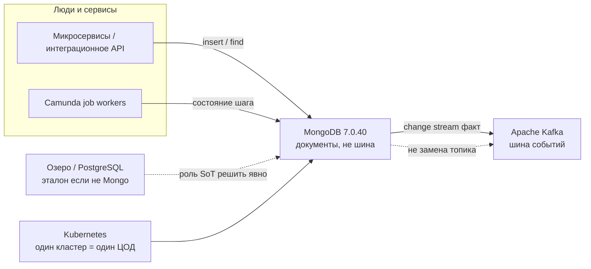
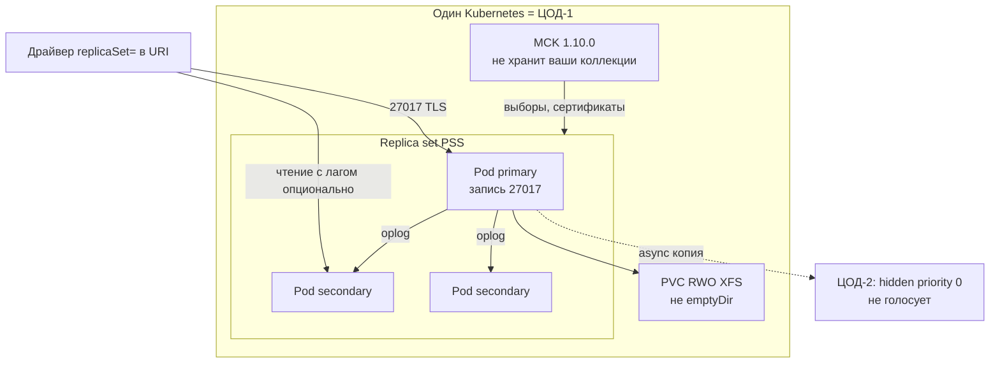
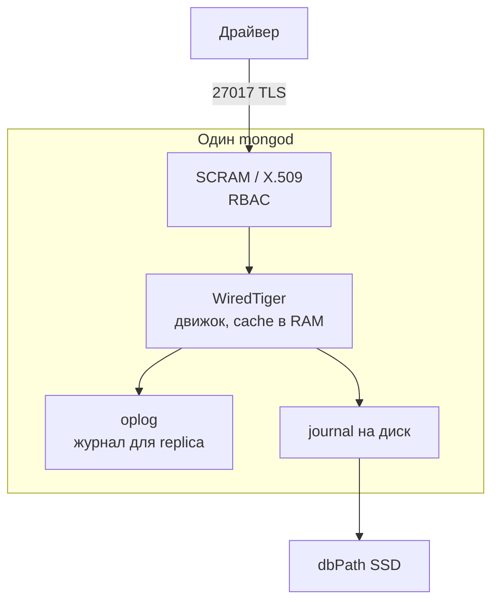
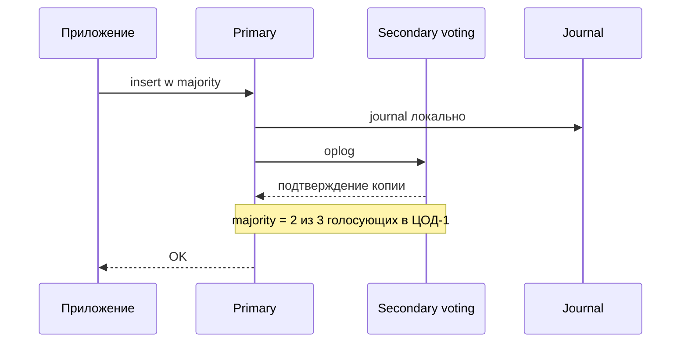
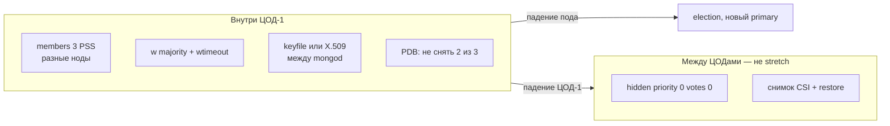
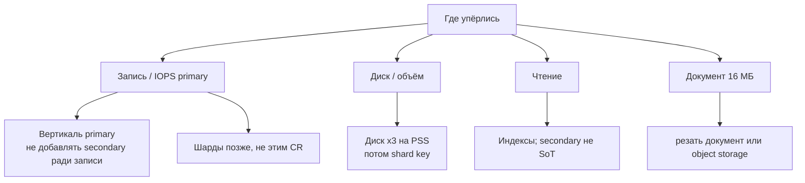
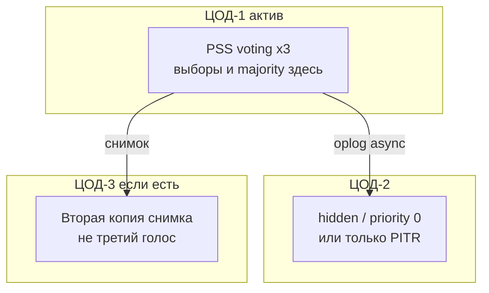

# MongoDB Community Server 7.0.40 — схемы устройства

Связанные документы: правила — `MongoDB 7.md`; установка — `MongoDB 7.install.md`.

Ниже **C4** (четыре уровня: контекст → контейнеры → компоненты → код). В запросе это «D4»: тот же каркас. Уровень кода пропускаем — для эксплуатации важнее роли, порты и ручки HA/масштаба.

Допущения (их не было в исходном ТЗ платформы, без них схема врёт):

1. Stretch одного replica set на 2–3 ЦОДа **нет** (RTT бьёт выборы и `w: majority`). Голосующие члены PSS — **внутри ЦОД-1**. В других ЦОДах — hidden / `priority: 0` (не primary) или только DR.
2. Community **7.0.40**, лицензия **SSPL**. На Kubernetes: **MCK 1.10.0**, CR `MongoDBCommunity` умеет тип **только ReplicaSet**, не шарды.
3. Один документ BSON — максимум **16 МБ**. WiredTiger cache в контейнере задают **явно** (иначе процесс считает RAM хоста).
4. Нагрузки нет — на схемах нет «N шардов». Есть *что крутить*, когда цифры появятся.

---

## 1. Контекст (C4 system context)

MongoDB **не** назван в исходном ТЗ как слой. Он **не** Kafka, **не** Camunda и **не** автоматически озеро эталона.

| Стрелка | Зачем помнить |
|---|---|
| Сервис → Mongo | Операционные документы, проекции UI, идемпотентность шага. Гибкая схема, индексы сами |
| Mongo → Kafka | Публикация «документ изменился». Fan-out и replay — у Kafka |
| Озеро отдельно | Пока роль эталона за Mongo не закрепили — не класть терабайты карточек «потому что JSON» |

**Слабое место контекста:** «три пода = масштаб записи» — это три копии **одного** primary.

---

## 2. Контейнеры (из чего состоит решение)

Прод-минимум: replica set **PSS** (Primary–Secondary–Secondary: 1 писатель + 2 копии с данными). PSA (вместо третьей копии *arbiter* — голос без данных) для прода с majority **не берём**.

Порты: **27017/TCP** — клиенты и члены обычного replica set; **27018** / **27019** — шард и config server (этим CR **не** ставятся). Балансировщик HTTP «на все 27017» без URI набора **ломает** модель: клиент должен идти на текущий primary.

**Сильное:** оператор перекладывает primary после выборов. **Слабое:** `dropDatabase` уедет на все secondary; replica **не** бэкап. Change stream на чистом standalone **нет**.

---

## 3. Компоненты внутри инстанса

| Компонент | Для чего настраивать |
|---|---|
| `cacheSizeGB` | Дефолт от RAM машины. В K8s: **меньше** memory limit пода. Иначе OOM |
| Индексы | Запрос без индекса на большом объёме = collection scan. Индекс ест RAM и диск |
| Write concern | `{ w: "majority" }` + ненулевой `wtimeout`. `{ w: 1 }` допускает rollback после выборов |
| Лимит 16 МБ | Вложение ответа ведомства легко раздувается. Больше — GridFS или object storage |

Нативная шифровка файлов WiredTiger, аудит, LDAP — **Enterprise**, не Community.

---

## 4. Поток записи

Чтение с secondary — отставание; вендор **не** рекомендует это как основной паттерн для SoT. Read concern `"majority"` — то, что уже на большинстве копий.

---

## 5. Что настраивать: отказоустойчивость

| Ручка | Если не настроить |
|---|---|
| 3 голосующих в ЦОД-1 | Один `mongod` = нет выборов. Все voting в трёх ЦОДах = stretch |
| Не PSA | Arbiter тихо ставит дефолт `{ w: 1 }` и ломает majority при падении data-ноды |
| Replica set URI в клиенте | Выборы успешны, приложение пишет в труп |
| Hidden вне кворума | Копия в ЦОД-2 не должна давать голос: иначе выборы ждут чужой RTT |
| Снимок вне набора | Secondary повторит `drop` и ransomware |

Ориентир вендора при дефолтах: медиана до нового primary обычно не больше ~12 с **плюс** ваша сеть. Цифру RTT мы не выдумываем.

---

## 6. Что настраивать: масштабируемость

Горизонтали записи у одного replica set **нет**. Шарды Community Server умеет, MCK Community — **нет**: это отдельный установщик, когда **доказали**, что один primary мал. Горячий документ живёт на одном чанке — шард его не спасёт.

---

## 7. Прод: 2 или 3 ЦОДа без stretch

Клиенты в штате пишут в primary ЦОД-1 (TLS через город — уже ваша сеть). «Три primary» Mongo **не умеет**. Независимый replica set в каждом ЦОДе — три истины, пока приложение/Kafka не склеит.

**Сильное:** `electionTimeoutMillis` (дефолт 10 с) и heartbeat (2 с) не живут межЦОДовым RTT на кворуме. **Слабое:** смерть ЦОД-1 = нет записи до ручного reconfigure/restore; RPO между площадками больше 0.

---

## 8. Безопасность и сильное / слабое

Слои на 27017:

1. NetworkPolicy — кто видит порт. Не LoadBalancer в интернет.
2. Authorization **включена** до боевых клиентов (дефолт сервера — выкл.). SCRAM и/или X.509; keyfile между членами.
3. RBAC: приложению не нужны `dropDatabase` / `userAdmin`. `--noscripting`, если нет нужды в server-side JS.

At-rest в Community — CSI/LUKS, не native WiredTiger encryption. Серверного аудита нет — компенсация логами и SIEM снаружи.

| Сильное | Слабое |
|---|---|
| Документная модель, транзакции на replica set | Один writer; 16 МБ на документ |
| PSS + MCK внутри ЦОДа | SSPL; нет шардов в Community CR |
| `w: majority` защищает от rollback | Hidden в другом ЦОДе — не автоfailover площадки |
| | Нет LDAP/аудита/KMIP в Community |

Источники фактов: `MongoDB 7.md` (PSS, порты, MCK, cache, 16 МБ). Порога RTT у MongoDB **нет** — stretch на схемах не рисуем как целевой.
