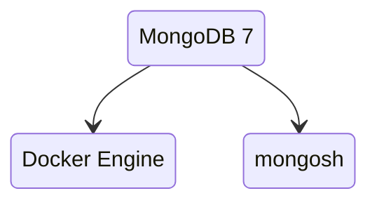
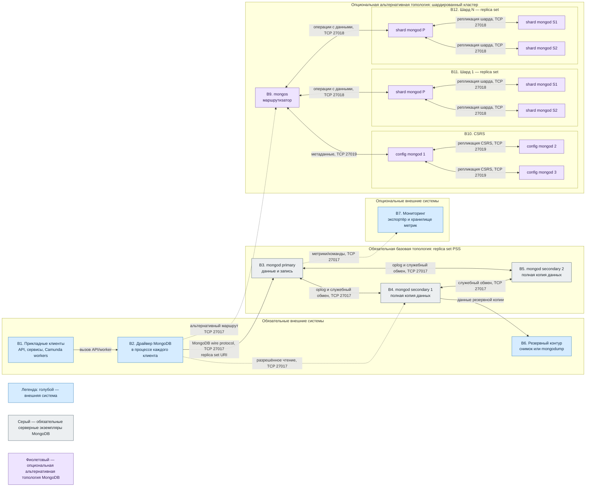

# MongoDB Community Server 7.0.40

MongoDB Community Server — документная СУБД, которая хранит JSON-подобные записи в формате BSON, ищет их по индексам и реплицирует между экземплярами `mongod`. В этом документе описаны назначение, функции, состав, порты и взаимодействие компонентов версии **7.0.40**. Это не Atlas, не Enterprise и не Percona Server for MongoDB.

Документация линейки: https://www.mongodb.com/docs/v7.0/  
Release Notes 7.0: https://www.mongodb.com/docs/v7.0/release-notes/7.0/  
Лицензия сервера: **SSPL**. Kubernetes-оператор MCK распространяется отдельно под Apache 2.0 и не меняет лицензию сервера.

---

## Назначение системы

MongoDB предназначена для **хранения и чтения документов** с гибкой схемой и индексами под запросы приложения. В контексте платформы в ней могут храниться заявки, проекции для экранов и состояние идемпотентного выполнения интеграционных шагов.

MongoDB в этой архитектуре — **документное хранилище сервиса**:

- события между системами передаёт Kafka;
- долгими процессами управляет Camunda;
- внешние ведомства вызываются через интеграционное API;
- эталон карточек остаётся в назначенной для этого СУБД или озере, если отдельным архитектурным решением эта роль не передана MongoDB;
- роль кэша выполняет Redis/Valkey, если нужен именно быстро теряемый кэш.

Точечное изменение одного документа — штатный сценарий. В обычном наборе копий запись принимает один основной экземпляр. Добавление вторичных копий повышает доступность, но не увеличивает пропускную способность записи и не делит объём данных. Для деления данных между независимыми группами экземпляров применяется шардирование.

---

## Перечень функций

MongoDB Community Server 7.0 умеет:

1. **Хранить документы BSON** в коллекциях и базах. Структура документов может различаться, а индексы проектируются под запросы. Максимальный размер одного документа — **16 МБ**; для больших объектов используют GridFS или отдельное объектное хранилище.
2. **Искать по индексам и выполнять агрегации.** Запрос без подходящего индекса на большой коллекции может перейти к полному перебору документов.
3. **Поддерживать replica set.** Один `mongod` является primary и принимает запись, secondary копируют операции из oplog. При недоступности primary голосующие члены с большинством голосов выбирают новый primary.
4. **Подтверждать запись по write concern.** `{ w: 1 }` означает подтверждение текущим primary, `{ w: "majority" }` — подтверждение большинством членов с данными. `wtimeout` ограничивает ожидание подтверждения.
5. **Управлять согласованностью и источником чтения.** Read concern задаёт требуемую видимость данных, read preference — узел, с которого разрешено читать. Чтение с secondary может вернуть отставшие данные.
6. **Шардировать коллекции.** Данные делятся по shard key; клиент подключается к `mongos`, а метаданные размещения хранятся в CSRS.
7. **Выдавать change stream.** Подписка на изменения доступна для replica set и шардированного кластера. Она не заменяет Kafka и её модель длительного хранения событий.
8. **Выполнять транзакции** в replica set и в шардированном кластере с учётом дополнительной стоимости распределённой координации.
9. **Разграничивать доступ.** Community поддерживает SCRAM, X.509 и роли на базы. Проверка прав в исходной конфигурации сервера не включена автоматически.
10. **Шифровать сетевой канал с TLS** между клиентами и сервером, а также между членами кластера.
11. **Создавать резервные копии** через `mongodump`/`mongorestore` или согласованные снимки файловой системы. Реплики не являются резервной копией: логическое удаление также реплицируется.

MongoDB Community Server не является шиной событий, BPMN-движком, интеграционным шлюзом или кэшем. В Community нет серверного аудита, LDAP/Kerberos, встроенного шифрования файлов WiredTiger и in-memory storage engine — это возможности других редакций или продуктов. Два одновременно записывающих primary в разных дата-центрах одной replica set не поддерживаются.

---

## Основные элементы системы и зависимости

### Разделение состава

#### Обязательная базовая топология для отказоустойчивого сервиса

| Элемент | Состав | Роль |
|---|---:|---|
| **Драйвер MongoDB** | По одному экземпляру библиотеки в каждом процессе-клиенте | Находит текущий primary, выбирает допустимый узел чтения, отправляет запросы и обрабатывает смену primary |
| **Replica set PSS** | 1 primary + не менее 2 secondary с данными | Хранение, репликация, выборы primary и подтверждение записи большинством |
| **Внешний резервный контур** | Репозиторий резервных копий и средство создания согласованной копии | Восстановление после логического удаления, повреждения или потери всего набора |

Драйвер и резервный контур обязательны для работоспособной и восстанавливаемой системы, но **не входят в MongoDB Community Server как серверные процессы**.

#### Опциональные и альтернативные элементы

| Элемент | Состав | Когда применяют |
|---|---:|---|
| **Standalone** | 1 процесс `mongod` | Разработка и функциональные эксперименты без автоматического failover |
| **Replica set PSA** | 1 primary, 1 secondary с данными, 1 arbiter без данных | Специальная экономичная схема голосования; не равноценна PSS по сохранности подтверждённых копий |
| **Шардированный кластер** | Несколько `mongos`, CSRS и не менее одного шарда | Когда одной replica set недостаточно по объёму или потоку записи и выбран пригодный shard key |
| **Экспортёр метрик и система мониторинга** | Экспортёр/агент плюс внешнее хранилище метрик | Наблюдение за состоянием, задержкой репликации, запросами, соединениями и ресурсами |
| **Административные клиенты** | `mongosh`, Compass, Database Tools | Диагностика, ручное администрирование, импорт, экспорт и резервное копирование |

Опциональные элементы не являются скрытой частью базовой PSS-топологии. Шардированный кластер — отдельная топология, а не дополнительная реплика.

### Схема инстансов и потоков

Пунктирные линии показывают условный или опциональный поток. Связь драйвера с `mongos` используется **вместо** прямого подключения к базовой replica set, когда выбрана шардированная топология. Она не означает, что один запрос одновременно отправляется в обе топологии.

### Описание именованных блоков

#### Обязательные блоки и внешние зависимости базовой топологии

**B1. Прикладные клиенты**

- **Сущность:** процессы API, микросервисов и Camunda workers, которым требуется документное хранилище.
- **Технологии и варианты топологии:** любой поддерживаемый язык и официальный либо совместимый MongoDB-драйвер; клиентов может быть много.
- **Назначение:** формируют операции чтения, записи, агрегации и транзакции.
- **Принадлежность:** отдельные внешние системы, не часть MongoDB.

**B2. Драйвер MongoDB**

- **Сущность:** библиотека внутри процесса B1, реализующая MongoDB wire protocol.
- **Технологии и варианты топологии:** драйверы Java, C#, Go, Node.js, Python и других поддерживаемых платформ; строка подключения перечисляет членов replica set или адреса `mongos`.
- **Назначение:** обнаруживает topology, находит primary, применяет read preference/write concern, повторяет разрешённые операции и переключает соединение после выборов.
- **Принадлежность:** клиентское ПО экосистемы MongoDB; не сервер MongoDB Community Server.

**B3. `mongod` primary**

- **Сущность:** серверный процесс `mongod` с локальными данными и журналом oplog.
- **Технологии и варианты топологии:** WiredTiger; роль primary внутри PSS назначается выборами и может перейти к B4 или B5.
- **Назначение:** принимает операции записи, читает данные и публикует операции в oplog для secondary.
- **Принадлежность:** часть MongoDB Community Server.

**B4. `mongod` secondary 1**

- **Сущность:** отдельный процесс `mongod` с полной копией данных replica set.
- **Технологии и варианты топологии:** WiredTiger; голосующий secondary с данными, способный стать primary.
- **Назначение:** воспроизводит oplog, участвует в подтверждении majority и выборах; может обслуживать явно разрешённое чтение с учётом возможного отставания.
- **Принадлежность:** часть MongoDB Community Server.

**B5. `mongod` secondary 2**

- **Сущность:** второй отдельный процесс `mongod` с полной копией данных replica set.
- **Технологии и варианты топологии:** тот же PSS и WiredTiger; его роль симметрична B4.
- **Назначение:** создаёт третий голос и третью копию данных, участвует в выборах и может стать primary.
- **Принадлежность:** часть MongoDB Community Server.

**B6. Резервный контур**

- **Сущность:** хранилище копий и механизм их создания/восстановления.
- **Технологии и варианты топологии:** согласованный снимок тома либо `mongodump`/`mongorestore`; конкретное хранилище выбирается отдельно.
- **Назначение:** вернуть данные после ошибочного удаления, повреждения, атаки или потери всей replica set.
- **Принадлежность:** отдельная система. Database Tools относятся к экосистеме MongoDB, но репозиторий копий не является частью сервера.

#### Опциональные блоки

**B7. Мониторинг**

- **Сущность:** агент или экспортёр метрик и внешняя система их хранения/визуализации.
- **Технологии и варианты топологии:** Prometheus-совместимый экспортёр, корпоративная система мониторинга или коммерческие средства MongoDB.
- **Назначение:** наблюдает состояние replica set, lag, соединения, медленные операции и ресурсы.
- **Принадлежность:** отдельная система; не сервер MongoDB Community Server.

**B9. `mongos`**

- **Сущность:** stateless-процесс маршрутизации запросов в шардированном кластере.
- **Технологии и варианты топологии:** несколько экземпляров `mongos` для доступности; локальные пользовательские данные не хранит.
- **Назначение:** принимает клиентские запросы на 27017, читает метаданные CSRS и направляет части операции нужным шардам.
- **Принадлежность:** часть MongoDB Community Server в шардированной топологии.

**B10. CSRS**

- **Сущность:** config server replica set из процессов `mongod`.
- **Технологии и варианты топологии:** в показанной топологии три члена с данными; каждый запущен в режиме config server и обычно слушает 27019.
- **Назначение:** хранит метаданные шардирования, включая соответствие диапазонов данных шардам.
- **Принадлежность:** часть шардированного кластера MongoDB.

**B11. Шард 1**

- **Сущность:** одна независимая replica set, владеющая частью шардированных данных.
- **Технологии и варианты топологии:** PSS из `mongod`, запущенных в роли shard server; заводской порт 27018.
- **Назначение:** хранит и обрабатывает свой диапазон или набор значений shard key.
- **Принадлежность:** часть шардированного кластера MongoDB.

**B12. Шард N**

- **Сущность:** обозначение дополнительных replica set того же типа, а не одного конкретного процесса.
- **Технологии и варианты топологии:** каждый дополнительный шард имеет собственные primary, secondary и oplog.
- **Назначение:** добавляет отдельную область хранения и записи; распределение зависит от shard key.
- **Принадлежность:** часть шардированного кластера MongoDB.

### Подробное объяснение потоков

#### Базовая PSS-топология

1. B1 вызывает библиотеку B2 внутри своего процесса. Приложение не должно самостоятельно выбирать «постоянный IP primary».
2. B2 подключается по TCP 27017, получает описание replica set и определяет текущие роли её членов. В URI указывается имя replica set и несколько начальных адресов, чтобы потеря одного адреса не лишила драйвер возможности обнаружить остальные.
3. Запись направляется на B3. После изменения данных B3 добавляет операцию в oplog.
4. B4 и B5 независимо забирают и воспроизводят операции oplog. Связи между членами двунаправленные: экземпляры обмениваются состоянием, посылают heartbeat и участвуют в выборах.
5. При write concern `majority` успешный ответ означает, что запись достигла требуемого большинства. Это не означает попадание в резервную копию B7.
6. Если B3 недоступен, большинство голосующих членов может выбрать новый primary. Драйвер B2 обновляет представление топологии и направляет последующие записи новому primary.
7. Чтение по умолчанию направляется на primary. Пунктир B2 → B4 показывает отдельный режим чтения с secondary: его включают только тогда, когда потребитель принимает возможный replication lag.
8. B6 получает данные отдельным потоком. Репликация защищает от отказа экземпляра, а резервная копия — от событий, которые уже распространились по всем репликам.

HTTP-балансировщик перед всеми `mongod:27017` не заменяет механизм обнаружения драйвера: он скрывает роли членов и может направить запись на secondary.

#### Опциональная шардированная топология

1. B2 подключается к одному из экземпляров B9 по TCP 27017. Прямое подключение прикладного клиента к отдельному шарду обходит маршрутизацию и не является штатным клиентским потоком.
2. B9 получает от B10 метаданные о размещении диапазонов данных.
3. По shard key маршрутизатор отправляет запрос в B11, B12 или несколько шардов. Запрос без возможности определить нужный шард может быть разослан шире.
4. Внутри каждого шарда запись всё равно принимает только его primary, а secondary повторяют oplog. Поэтому шардирование не отменяет replica set.
5. B10 также является replica set: его экземпляры реплицируют метаданные на 27019. Потеря большинства CSRS нарушает операции, зависящие от метаданных кластера.
6. Несколько B9 можно добавлять независимо, поскольку `mongos` не хранит пользовательские данные. Добавление шарда сложнее: оно меняет распределение данных и требует пригодного shard key.

Шарды увеличивают совокупную ёмкость и потенциальный параллелизм записи только тогда, когда нагрузка распределяется по разным значениям shard key. Один «горячий» документ остаётся на одном шарде.

### Прочие варианты состава

**Standalone.** Один `mongod` хранит данные и принимает все операции. Автоматических выборов и второй копии нет; change stream для чистого standalone недоступен. Это отдельная упрощённая топология, а не PSS с «временно выключенными» secondary.

**PSA.** Два `mongod` хранят данные, arbiter хранит только данные голосования. Arbiter не подтверждает сохранение пользовательских данных. При потере одного члена с данными оставшийся член и arbiter имеют голоса для primary, но запись с требованием большинства копий данных не получает ту же гарантию, что в PSS.

**Административные клиенты.** `mongosh` — интерактивная командная оболочка; Compass — графический клиент; Database Tools включают отдельные утилиты, например `mongodump` и `mongorestore`. Они обращаются к серверу, но не являются членами replica set.

### Официальные порты

| Порт | Протокол | Назначение |
|---:|---|---|
| **27017** | TCP | Клиенты, `mongos` и члены обычной replica set |
| **27018** | TCP | Заводской порт `mongod` в роли shard server |
| **27019** | TCP | Заводской порт `mongod` в роли config server |

Это заводские значения, которые можно изменить конфигурацией. UDP-портов MongoDB для этих взаимодействий нет. В шардированной топологии `mongos`, CSRS и шарды должны обмениваться трафиком на назначенных им TCP-портах; прикладной клиент подключается к `mongos` на 27017, а не к служебным портам отдельных шардов.

---

## Глоссарий

**Aggregation / агрегация** — конвейер обработки документов: фильтрация, группировка, преобразование, объединение и вычисление результатов.

**API (Application Programming Interface)** — программный интерфейс, через который системы вызывают операции друг друга.

**Apache 2.0** — разрешительная лицензия, под которой распространяется MCK; она не заменяет лицензию SSPL самого сервера.

**Arbiter** — голосующий член replica set без пользовательских данных; участвует в выборах, но не может стать primary.

**Atlas** — управляемый облачный сервис MongoDB; не является локально установленным Community Server.

**BSON** — бинарный формат документов MongoDB, поддерживающий типы, которых нет в обычном JSON.

**BPMN** — нотация моделирования бизнес-процессов; выполнение таких процессов относится к Camunda, а не к MongoDB.

**Camunda worker** — внешний процесс, который получает и выполняет работу процесса Camunda и может использовать MongoDB как хранилище своего состояния.

**Change stream** — поток уведомлений MongoDB об изменениях данных, формируемый на основе oplog.

**Collection / коллекция** — набор документов внутри базы MongoDB, близкий по роли к таблице, но без обязательной одинаковой структуры всех записей.

**Community Server** — самостоятельно эксплуатируемая редакция сервера MongoDB под лицензией SSPL.

**Compass** — графическое клиентское приложение для просмотра данных и выполнения запросов MongoDB.

**Config server** — `mongod`, запущенный в специальной роли хранения метаданных шардированного кластера.

**CSRS (Config Server Replica Set)** — replica set config-серверов, хранящая метаданные шардирования.

**Database Tools** — отдельный набор утилит MongoDB для импорта, экспорта, дампа и восстановления.

**Document / документ** — отдельная BSON-запись из пар полей и значений.

**Driver / драйвер** — библиотека приложения, реализующая сетевой протокол MongoDB, обнаружение топологии и выбор сервера.

**Enterprise** — коммерческая редакция MongoDB с дополнительными функциями, отсутствующими в Community.

**Failover** — автоматический переход обслуживающей роли на исправный экземпляр после отказа текущего.

**GridFS** — соглашение MongoDB для хранения файлов крупнее лимита одного BSON-документа частями в нескольких коллекциях.

**Heartbeat** — периодический служебный обмен между членами replica set для определения их доступности и состояния.

**Идемпотентность** — свойство повторного выполнения операции давать тот же итог без нежелательного повторного эффекта.

**Индекс** — дополнительная структура данных, ускоряющая выбранные запросы ценой места и затрат на обновление.

**JSON** — текстовый формат представления объектов из пар полей и значений; BSON является его бинарным расширением для MongoDB.

**Kafka** — внешняя распределённая платформа журнала событий; в описываемой платформе выполняет роль шины, а не хранилища документов MongoDB.

**Kerberos** — протокол сетевой аутентификации; серверная интеграция с ним не входит в MongoDB Community.

**Lag / replication lag** — отставание secondary от состояния primary.

**LDAP** — протокол доступа к каталогу пользователей; серверная интеграция с ним не входит в MongoDB Community.

**Majority / большинство** — число голосующих членов, превышающее половину их общего количества; используется выборами и правилами подтверждения записи.

**MCK (MongoDB Controllers for Kubernetes)** — оператор MongoDB для управления ресурсами MongoDB в Kubernetes; это отдельное ПО, а не процесс базы данных.

**MongoDB wire protocol** — сетевой протокол обмена драйверов и серверных процессов MongoDB поверх TCP.

**`mongod`** — серверный процесс MongoDB, который хранит данные или метаданные и может входить в replica set.

**`mongodump`** — утилита Database Tools для логического экспорта данных MongoDB.

**`mongorestore`** — утилита Database Tools для восстановления логического дампа.

**`mongos`** — stateless-маршрутизатор запросов шардированного кластера; пользовательские данные не хранит.

**`mongosh`** — интерактивная командная оболочка MongoDB.

**Oplog (operations log)** — ограниченная коллекция операций primary, которую secondary воспроизводят для репликации.

**PSS (Primary–Secondary–Secondary)** — replica set из одного текущего primary и как минимум двух secondary с полными копиями данных.

**PSA (Primary–Secondary–Arbiter)** — replica set из двух членов с данными и одного arbiter.

**Primary** — текущий член replica set, принимающий операции записи.

**Read concern** — настройка требуемой согласованности и видимости данных при чтении.

**Read preference** — правило драйвера, определяющее, с каких ролей replica set разрешено читать.

**Redis/Valkey** — отдельные системы хранения в памяти, обычно используемые для кэша; не компоненты MongoDB.

**Replica set / набор копий** — группа `mongod`, поддерживающая одинаковый набор данных, выборы primary и автоматический failover.

**Replica set URI** — строка подключения с именем replica set и начальными адресами нескольких её членов.

**SCRAM** — парольный механизм аутентификации, основанный на доказательстве знания секрета без передачи самого пароля как открытого текста.

**Secondary** — член replica set, который копирует oplog primary и может участвовать в чтении и выборах.

**Shard / шард** — replica set, хранящая часть шардированных пользовательских данных.

**Shard key** — выбранное поле или набор полей, по значениям которого MongoDB распределяет документы между шардами.

**Shard server** — `mongod`, запущенный как член шарда; его заводской порт — 27018.

**Sharding / шардирование** — разделение одной логической коллекции между несколькими шардами.

**Snapshot / снимок** — согласованная копия состояния дискового тома в определённый момент времени.

**SSPL (Server Side Public License)** — лицензия MongoDB Community Server.

**Standalone** — одиночный процесс `mongod`, не входящий в replica set.

**Stateless** — не хранящий локально уникальное пользовательское состояние; экземпляр можно заменить при наличии актуальных внешних источников состояния.

**Storage engine** — подсистема СУБД, которая управляет хранением данных, кэшем и журналированием; в этой схеме используется WiredTiger.

**TCP** — транспортный сетевой протокол с установлением соединения, поверх которого работает MongoDB wire protocol.

**TLS** — протокол шифрования и проверки подлинности сетевого соединения.

**Topology / топология** — состав серверных ролей и схема их сетевых связей.

**Transaction / транзакция** — группа операций, которая фиксируется или отменяется как единое целое.

**UDP** — транспортный сетевой протокол без установления соединения; описанные потоки MongoDB его не используют.

**URI (Uniform Resource Identifier)** — строковое представление адресов и параметров подключения клиента к MongoDB.

**WiredTiger** — основной storage engine MongoDB, управляющий файлами данных, кэшем, журналированием и конкурентным доступом.

**Write concern** — правило, определяющее, сколько и какие участники должны подтвердить запись до успешного ответа клиенту.

**`wtimeout`** — предельное время ожидания выполнения write concern; по истечении клиент получает ошибку ожидания.

**X.509** — стандарт сертификатов, используемых для TLS и сертификатной аутентификации.

---

## Источники

- Релизы MongoDB 7.0: https://www.mongodb.com/docs/v7.0/release-notes/7.0/
- Лицензирование: https://www.mongodb.com/legal/licensing/server-side-public-license
- BSON и лимит документа: https://www.mongodb.com/docs/v7.0/reference/limits/
- Архитектура replica set: https://www.mongodb.com/docs/v7.0/core/replica-set-architectures/
- Репликация, oplog и failover: https://www.mongodb.com/docs/v7.0/replication/
- Write concern: https://www.mongodb.com/docs/v7.0/reference/write-concern/
- Read concern: https://www.mongodb.com/docs/v7.0/reference/read-concern/
- Read preference: https://www.mongodb.com/docs/v7.0/core/read-preference/
- Компоненты шардированного кластера: https://www.mongodb.com/docs/v7.0/core/sharded-cluster-components/
- Change streams: https://www.mongodb.com/docs/v7.0/changeStreams/
- Транзакции: https://www.mongodb.com/docs/v7.0/core/transactions/
- Безопасность Community и Enterprise: https://www.mongodb.com/docs/v7.0/administration/security-checklist/
- Резервное копирование: https://www.mongodb.com/docs/v7.0/core/backups/
- Официальные порты: https://www.mongodb.com/docs/v7.0/reference/default-mongodb-port/
- Спецификация `MongoDBCommunity`: https://www.mongodb.com/docs/kubernetes/current/reference/k8s-operator-community-specification/
