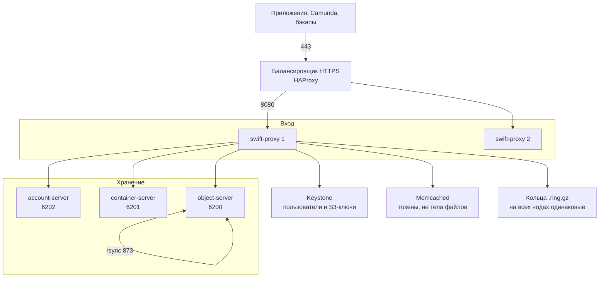

# OpenStack Swift 2.37.3 — развёртывание и настройка

OpenStack Swift — объектное хранилище: кладёте файл по имени в контейнер (бакет). Этот документ про **свою установку** версии **2.37.3**, серия OpenStack **2026.1 (Gazpacho)**. Проверено **26 августа 2026**: в релиз-нотах серии 2026.1 это последний номер линейки. **2.38.x** в current/unreleased — ещё не стабильная серия, в бой не берём. Это не Amazon S3, не MinIO, не Ceph RGW и не Swift 2.29.2 из инсталлятора GeoData.

Документация: https://docs.openstack.org/swift/2026.1/  
Архитектура: https://docs.openstack.org/swift/2026.1/overview_architecture.html  
Развёртывание: https://docs.openstack.org/swift/2026.1/deployment_guide.html  
S3 API (middleware `s3api`): https://docs.openstack.org/swift/2026.1/middleware.html  
Матрица совместимости S3: https://docs.openstack.org/swift/2026.1/s3_compat.html

Лицензия исходников Swift — **Apache 2.0**. Отдельного license-server нет.

В документе по GeoData инсталлятор вендора фиксирует **Swift 2.29.2** и пример колец в **одном** region/zone. Этот файл — про **платформенный** Swift 2.37.3 как S3-хранилище. Склеивать его с GeoData «потому что оба Swift» без письма вендора нельзя.

Этот текст — не набор команд «скопируй и запусти», а правила, без которых экземпляр не будет одновременно устойчивым к сбоям, масштабируемым и безопасным. Пошаговая установка — в `OpenStack Swift.install.md`.

---

## Назначение системы

Swift нужен, чтобы **класть большие и долгоживущие файлы** (вложения интеграций, снимки, бэкапы индексов, выгрузки), не раздувая СУБД и не делая Kafka диском.

Карточки клиентов живут в СУБД/витрине. События везёт Kafka. Процессы ведёт Camunda. Интеграционное API ходит наружу. Swift — **объектный слой**: «положи и забери файл по ключу», а не «дай клиента по ИНН и поправь ФИО».

S3 API включаете middleware `s3api` на **тех же** proxy. Это эмуляция, не AWS. Клиенты с Lifecycle-правилами, тегами и bucket policy **сломаются**.

---

## Перечень функций

Что умеет self-hosted Swift 2.37.3 с включённым S3 API:

1. **Класть и читать объекты** родным REST (`/v1/{account}/{container}/{object}`) и, если включили `s3api`, запросами «как Amazon S3».
2. **Держать несколько копий** каждой части пространства имён по карте размещения (кольцо). Рекомендация вендора: **3 копии** — «это единственное значение, которое тестировали». 3 копии ≈ диск ×3 относительно «один экземпляр файла».
3. **Маршрутизировать запросы stateless proxy:** смотрит в кольцо, стримит данные, не складывает объект целиком на диск proxy. Несколько proxy за балансировщиком — штатный вход.
4. **Хранить файлы на object-серверах**, списки объектов — на container-серверах (SQLite), списки контейнеров — на account-серверах. Клиенту внутренние серверы **не** нужны; proxy ходит к ним сам.
5. **Догонять копии фоном** (replicator, часто через rsync), догонять списки (updater), искать битый файл (auditor). Для erasure coding восстановление идёт другим путём (reconstructor).
6. **Откладывать запись на запасной диск (handoff)**, если основное место из кольца недоступно. Потом replicator догонит «правильное» место. Успех клиенту завязан на **большинство** успешных записей на бэкенд (для 3 копий это **2**). Эту цифру вендор в Deployment Guide отдельной главой не печает — печает «ставьте 3 replica».
7. **Резать большие объекты кусками.** По умолчанию один PUT ≤ **5 ГБ**; больше — сегменты + манифест (SLO). Для полной заявленной S3-совместимости multipart в конвейере proxy должен быть **slo**.
8. **Проверять S3-подпись** через Keystone (`s3token`) в бою. Встроенные учётки в конфиге (`tempauth`) — лаборатория, не identity боя.
9. **Шифровать тело объекта at-rest** опцией middleware (ключ в конфиге или внешний KMS). Шифруется тело, ETag ненулевых объектов, **значения** пользовательских метаданных. **Не** шифруются имена account/container/object, имена метаданных, Content-Type, размер. Это защита от чтения **унесённого диска**, не от того, кто сел на внутреннюю сеть Swift.
10. **Снимать телеметрию** (`swift-recon`): кольца, время репликации, карантин, отложенные обновления.

Чего система **не** делает и часто путают: она не полный AWS S3 (нет bucket lifecycle как в AWS, bucket policy, object tagging, notifications, website hosting, billing, inventory). Не транзакционный эталон карточек, не шина событий, не поиск по содержимому, не BPMN. Кворума метаданных как у etcd нет. RAID 5/6 вендор **не требует и не рекомендует**. Официального оператора «как у OpenSearch» нет. Kolla-Ansible **убрал** роль Swift с 2025.1. Копии бэкап не заменяют: `DELETE` уедет на все три.

---

## Требования к развёртыванию

### Требования к ПО

| Что | Что ставить | Комментарий |
|---|---|---|
| **Формат поставки** | Виртуальные машины или железные серверы с пакетами Linux | Deployment Guide описывает **сервисы на серверах с дисками**, не «StatefulSet из магазина». Proxy можно ближе к Kubernetes; object-server — нет, пока не доказан стабильный IP/диск в кольце. |
| **Kubernetes** | Не штатный инсталлятор ядра Swift | Чарты OpenStack-Helm для Swift существуют, но матрица проекта на 2026.1: Kubernetes **≥ 1.33 и ≤ 1.35**. В платформе зафиксирован **Kubernetes 1.36.4** — это **не** доказанная комбинация. Кольцо содержит **IP:порт/имя диска**: смена IP пода без обновления кольца ломает кластер. |
| **ОС** | Linux с ФС, у которой работают расширенные атрибуты файла (xattr) | Практический стандарт — **XFS**. В лабораторном «всё на одной машине» (SAIO) прямо: Swift требует место на XFS. **Windows как сервер Swift не заявлена.** |
| **Python** | Python 3 | В 2.37.1 явно добавлена поддержка **Python 3.14 (GIL enabled)**. Минимальную minor «навсегда» этим документом не фиксируем — смотреть требования пакета, которым ставите 2.37.3. |
| **Рядом в составе** | rsync, Memcached, Keystone (бой), балансировщик перед proxy | Без rsync object-replicator не сходится штатным путём. Memcached — кэш токенов и факта «контейнер существует», не тел объектов. |
| **Лицензия** | Apache 2.0 | Следить нужно за обвязкой (Keystone, образы дистрибутива), не за «лицензией Swift». |

### Требования к ресурсам

Цифр «сколько дисков на ваши терабайты» у проекта **нет** — нагрузки в исходном запросе не было. Ниже ориентиры вендора, не смета закупки.

| Роль | CPU | RAM | Диск |
|---|---|---|---|
| **Лаборатория SAIO (одна машина)** | Минимальные | Ориентир гайда **≥ 2 ГиБ** — чтобы **вообще завелось**, не бой | Ориентир гайда **≥ 40 ГиБ** места. В примере SAIO loopback-файл **1 ГБ** — учебный диск, не ёмкость боя |
| **Proxy** | Упирается в CPU и сеть (TLS на proxy ещё дороже — часто снимают на балансировщике). Для erasure coding encode/decode тоже на proxy | Несклад объектов | Не складывает объект целиком на свой диск |
| **Object / container / account** | Фон replicator/updater/auditor ест I/O и сеть | Container/account — SQLite; при миллионах объектов в одном контейнере — отдельная дисциплина шардинга | Локальные диски, точки `/srv/node/…`. Вес диска в кольце: ориентир гайда **100.0 × ТБ** ёмкости. Рекомендация: **≥ 100 партиций на диск**. Три копии = утроенный полезный объём плюс запас под перекладку (нельзя забивать диски вплотную) |

Дополнительно:

- Один PUT по умолчанию до **5 ГБ**.
- `min_part_hours = 24` как пример «хорошего значения» в гайде (сколько часов нельзя повторно двигать одну и ту же партицию).
- «Начните с минимум 5 zone» — про **изоляцию внутри region**, не приказ «нарежьте 5 дата-центров».

---

## Основные элементы системы и зависимости

Это одно ПО из **нескольких процессов**. Ниже — те, что живут отдельными инстансами, и как они вызывают друг друга.

### Схема инстансов и потоков

Как читать схему:

1. Человек и сервисы заходят по HTTPS на балансировщик, тот отдаёт на **proxy** (порт **8080**). Клиентам открывают **только proxy**. Порты 6200–6202 и rsync — внутренняя сеть хранения. Выдать object-server в интернет = обойти auth proxy.
2. Proxy смотрит в **кольцо** (словарь «имя → на каких дисках копии») и стримит данные. Без одинаковых `.ring.gz` на всех нодах кластер врёт. Исходник кольца (`.builder`) **бэкапят**: потеряли — следующее изменение топологии станет лотереей.
3. **Object-server** хранит файлы (метаданные в xattr ФС). **Container-server** — список объектов. **Account-server** — список контейнеров.
4. Копии догоняет replicator по **rsync (873)**. Список контейнера может отстать: обновление listing могло уйти в очередь updater. Конфликт версий объекта — **последняя запись по времени побеждает**. Удаление — тоже версия (tombstone).
5. **Keystone** проверяет людей и S3-подпись. **Memcached** кэширует токены: для tempauth упал memcached — «не пускает»; для Keystone промах кэша обычно означает повторный поход в identity.

Рядом, но это уже другое ПО: Keystone, Memcached, rsync, HAProxy, PKI, опционально Barbican/KMIP, StatsD/Prometheus-exporter.

### Что входит в состав

| Компонент | Зачем | Как масштабируется |
|---|---|---|
| **Proxy** | Публичный API (Swift + при включении s3api — S3), маршрутизация, TLS если не вынесен | Горизонтально: больше stateless proxy за балансировщиком |
| **Object server** | Файлы на локальных дисках | Горизонтально: диски и ноды в object-кольце + перекладка |
| **Container server** | Listing объектов, счётчики (SQLite) | Горизонтально; миллионы объектов в одном контейнере — шардинг контейнера |
| **Account server** | Listing контейнеров | Обычно меньше нагрузка, чем object |
| **Replicator / updater / auditor** | Сходимость копий, listing, целостность | Не «ещё один API». Фон: сеть репликации, I/O, время |
| **Кольца** | Карта размещения | Не масштабируются «подами». Меняются осознанной перекладкой и выкладкой `.ring.gz` **на все** ноды |

### Официальные порты (менять можно, это контракт сети)

В sample-конфигах проекта и в примерах Deployment Guide:

| Порт | Назначение |
|---|---|
| **8080/TCP** | Proxy: клиентский Swift API и (если включили) S3 API |
| **6200/TCP** | Object server (в примере «старого» кольца все диски ноды на одном порту; вариант `servers_per_port` — **свой порт на диск**) |
| **6201/TCP** | Container server |
| **6202/TCP** | Account server |
| **873/TCP** | rsync (репликация объектов) |
| **11211/TCP** | Memcached (не Swift, но proxy без него в типичной схеме не аутентифицирует) |

SAIO на одной машине поднимает **несколько** object/container/account на портах вроде 6210/6220/… — это лабораторная схема «много процессов на localhost», не боевые номера.

### Зависимости окружения

- Локальные диски, точки монтирования `/srv/node/…` от **root** (`root:root 755`), иначе при размонтировании диска rsync может начать писать в корневой том.
- Одинаковые кольца на proxy и storage. Расхождение = «пишу не туда» / 404 на живых данных.
- Сеть минимум двух смыслов: клиентская до proxy; внутренняя storage (proxy→620x) и replication (rsync). Их смешивать с клиентской — дыра.
- Identity для боя: Keystone + для S3 ещё `s3token` (и EC2-credentials). tempauth — стенд.
- Балансировщик перед несколькими proxy. Один proxy = точка отказа API, даже если диски живы.

---

## Краткие вводные

### Как устроена отказоустойчивость

Это **несколько копий в кольце** плюс **несколько stateless proxy** плюс фоновые replicator/auditor. Путать SAIO «на одной VM» с отказоустойчивостью — главная ошибка.

**1) Данные (копии + zone/region)**

| Что падает | Что происходит |
|---|---|
| Один диск при 3 копиях на разных устройствах | Чтение с другой копии; replicator/auditor лечит |
| Одна storage-нода, копии разложены по нодам | Тот же принцип. Proxy при PUT идёт на handoff, если основное место мёртво |
| Один дата-центр, если **каждая копия партиции в своём дата-центре** | Остаются 2 копии. Чтение живо. Запись: proxy должен набрать успешные записи на живых копиях/handoff |
| Один дата-центр, если две из трёх копий случайно в нём | Площадка уносит **большинство** копий части данных. Это ошибка карты кольца, не «баг Swift» |
| Все proxy в одном дата-центре | Диски в других местах есть, **API нет** |
| Нет бэкапа `.builder` / колец, кольцо пересобрали «с нуля» | Карта мира уничтожена. Файлы на дисках могут остаться, кластер их не найдёт как раньше |
| `DELETE` контейнера / украли ключ S3 | Три копии послушно удалят. Копия ≠ backup |

Меньше 3 копий на бою = вы сами стали испытательным стендом проекта.

**2) Proxy**

Падение **одного** proxy при двух и более за балансировщиком — клиенты живы. Падение **всех** proxy — кластер глухой, диски целы.

**3) Memcached / Keystone**

Умерли все memcached при **tempauth** — токены не проверить. Умер Keystone при keystoneauth — новые сессии и S3-подпись не пройти. Это точка отказа **доступа**, не байт на диске.

**4) Репликация между площадками**

Без `write_affinity` PUT идёт к тем устройствам, которые кольцо назвало основными — при трёх площадках как трёх zone это **синхронно через город**. Латентность PUT ≈ сеть до чужого дата-центра.

С `write_affinity` (глава Global Clusters): сначала кладут копии **рядом**, replicator развозит «по домам». Быстрее запись, **хуже сохранность в окне до репликации**. Документация прямо: имеет смысл, если **не читаете объект сразу после записи в другом регионе**; типичный пример — бэкапы. Если микросервис сразу GET того, что PUT на другой площадке — affinity навредит.

### Как устроено масштабирование

Несколько независимых осей (их нельзя путать):

1. **Больше гигабайт** → больше **дисков** в object-кольце, вес пропорционален ТБ, затем перекладка. Не «увеличить том одного пода».
2. **Больше запросов API** → больше **proxy** (CPU/сеть).
3. **Больше мелких файлов / тяжёлые listing** → контейнеры, шардинг, лимиты listing.
4. **Холодный архив дешевле по месту** → вторая **политика хранения** с erasure coding, не ломая default 3×. Политика задаётся **при создании** контейнера и на жизни контейнера не меняется.
5. **Один объект > 5 ГБ** → SLO/multipart, не «подкрутили max_file_size на терабайт и забыли».

«Терабайты в озере» сами Swift не наполняют. Наполняет то, что вы **решите туда писать**, ×3 при трёх копиях, плюс запас под перекладку.

### Безопасность самого Swift

Компрометация S3-ключа или неаутентифицированного proxy = доступ к вложениям интеграций, персональным данным в выгрузках, снимкам. tempauth-пароль из SAIO и открытый 8080 в интернет — это ключ от бака.

- Клиенты ходят **только на proxy**. Storage-порты и rsync — непубличны.
- Бой-auth: **Keystone**, не tempauth. Для S3 — `s3api` **перед** auth в конвейере; для Keystone рекомендованный пример: `authtoken` → `s3api` → `s3token` → `keystoneauth`, у authtoken `delay_auth_decision = True` (иначе двойной поход в Keystone).
- В конвейере для заявленной S3-совместимости должны быть ещё **bulk** и **slo**.
- Root-секрет шифрования: ≥ **44** символа base64, **одинаковый на всех proxy**. В бою — Barbican/KMIP, не строка `changeme` в git. Клиентское шифрование до PUT — единственный способ «plaintext не светился на проводе до proxy».
- Релизы 2.37.2 / 2.37.3 закрывают свежие дыры S3 и proxy, в том числе CVE-2026-71190 (DoS через `Accept`), CVE-2026-71191 / 71192 (копирование через S3-заголовки), CVE-2026-50221 (SSRF через container-update), CVE-2026-49017 (DoS aws-chunked). **Не** ставить «какой-нибудь Swift 2.29 с GeoData-инсталлятора» как платформенный S3 без отдельного решения по патчам.
- `s3_acl`: завод проекта исторически `False`; часть CVE-2026-71191 завязана на этот завод. Для большей S3-совместимости SAIO включает `s3_acl` и `check_bucket_owner`. Выбор надо сделать сознательно.

«Поднять SAIO и выдать 8080 наружу» — это новая поверхность атаки, не озеро.

---

## Допущения

Ниже то, чего не было в исходном запросе, но без чего нельзя нарисовать конкретную схему. Если допущение неверно — схему надо пересмотреть.

1. Берём **self-hosted Swift 2.37.3 (2026.1)**, не Amazon S3, не MinIO, не Ceph RGW и не Swift 2.29.2 из инсталлятора GeoData.
2. **S3 API включаем штатным `s3api`** на тех же proxy. Приложения, которым нужен «настоящий AWS», прогоняют матрицу `s3_compat` **до** контракта. Lifecycle/tagging/policy в архитектуре **не** закладываем.
3. **Бой-identity — Keystone**. tempauth — только стенд.
4. **Storage-ноды — выделенные машины с локальным XFS**, не `emptyDir` и не общий NFS как диск object-server. Proxy можно ближе к Kubernetes.
5. Три дата-центра = три независимых отказа. Три зала с общим ИБП эту схему не спасают.
6. Цель отказа: пережить **1** дата-центр, не 2 из 3. При replica=3 и раскладке «по одной копии в дата-центр» два мёртвых оставляют одну копию: чтение части данных ещё может работать, устойчивая запись — нет.
7. Один кластер на три площадки принимается **только если** внутренняя сеть proxy↔object и rsync достаточно быстрая. Порога задержки у проекта **нет**. Пока её не измерили — гипотеза.
8. Нагрузки нет — поэтому **нет** цифры «N дисков и M ТБ».
9. Формального SLA нет. Успешный PUT при 2 из 3 дисков ≠ «файл уже в двух других дата-центрах», если включён write_affinity.
10. Корпоративный PKI и секреты есть или будут. Root-секрет шифрования и S3-ключи не живут в git.
11. Шифрование канала — TLS на входе proxy/балансировщика. ГОСТ/СКЗИ не озвучены.
12. Учебный стенд изолирован. На нём допустимы SAIO, tempauth, HTTP, один диск. В бой их не копируем.
13. Kafka, Camunda, озеро-карточки, интеграционное API — клиенты 8080/S3, не часть этого ПО. Контракт: ключи объектов, идемпотентный PUT, multipart для крупных тел, что делать с listing.
14. Лицензия Apache 2.0.

---

## Критически важные условия, которых нет в исходном контексте

Их нужно закрыть **до** «нарезали кольцо и выдали endpoint разработчикам».

| Пробел | Почему это ломает решение |
|---|---|
| **Задержка, потери, полоса** между дата-центрами на **6200–6202 и rsync** (не ping ICMP) | Без affinity каждый PUT ждёт чужие площадки. С affinity — зависит от replicator. Высокий jitter → таймауты proxy, рост handoff, расхождение listing |
| **Один Kubernetes на три площадки или три** | Proxy в Kubernetes ещё можно. Object-server с кольцом по IP пода — нет, пока нет hostNetwork/стабильного IP и локального диска, который **не** переезжает |
| **Совместимость OpenStack-Helm с Kubernetes 1.36.4** | Матрица чартов 2026.1 — до **1.35**. «Поставим Helm на 1.36» — не сертифицированный путь |
| **Что именно кладёте** (вложения? parquet? snapshot OpenSearch?) | Разный размер объекта, нужна ли SLO, какой шардинг контейнера, какая политика (3× vs erasure coding) |
| **S3 Lifecycle / tagging / bucket policy в требованиях приложений** | В матрице Swift этого **нет**. Либо меняете приложения, либо это не тот продукт |
| **GeoData как клиент этого кластера** | Вендор ждал 2.29.2 и одноzone-пример. Платформенный 2.37.3 — отдельное согласие |
| **Кто Keystone и какой его отказ** | Без identity нет боя S3. Слабый Keystone = «хранилище живо, никто не входит» |
| **Где живёт `.builder` и кто имеет право перекладывать кольцо** | Ошибка кольца бьёт сильнее, чем падение одной ноды |
| **Срок хранения и 152-ФЗ/КИИ** | Имена объектов **не** шифруются at-rest middleware. Персональные данные в ключе и в listing — вопрос ИБ, не «включили encryption» |
| **Нужен ли write_affinity** | Документация: не для нагрузки «записал и сразу читают из другого региона». У микросервисов в трёх площадках — скорее всего **не** бэкапный паттерн |
| **Отдельная сеть репликации** | rsync терабайтов по той же сети, что PUT клиентов, душит API |
| **Квоты** | Без квот аккаунта/контейнера озеро съест диски молча |

---

## Краткое описание ключевых этапов и элементов развертывания

Общий каркас (и тест, и бой):

1. Зафиксировать **Swift 2.37.3** и способ установки (пакеты дистрибутива / свои образы). Не смешивать серии внутри одного кольца.
2. Спланировать **диски XFS**, имена устройств, сети (клиент / storage / replication).
3. Собрать кольца: account, container, object. Сохранить **`.builder`**. Раздать `.ring.gz` всем нодам.
4. Поднять rsync, object/container/account, затем proxy. Memcached — до проверки auth.
5. На стенде — tempauth; на бою — Keystone **до** боевых ключей S3. Включить `s3api` (+ slo, bulk) в конвейере.
6. Выпустить TLS на входе. Storage-сеть не публиковать.
7. Включить **recon** и метрики (хотя бы заполнение дисков, отложенные обновления, время репликации, коды proxy).
8. Прогнать PUT/GET по Swift API и по S3 (один и тот же объект глазами двух API — осознанно: это разные URL и разные подписи).
9. Прогнать отказ **одного** диска/ноды: объект читается, replicator сходится.
10. Только потом — encryption at-rest, erasure coding, шардинг, write_affinity, если они вообще нужны.

Боевая схема на несколько дата-центров — в `OpenStack Swift.install.md`. Ниже — только учебный стенд.

---

### 1 инстанс: тестовый стенд, 1 площадка, без нагрузки

**Цель стенда:** чтобы разработчики клали и забирали объект, подключали AWS SDK/boto, видели разницу Swift API vs S3, ловили «lifecycle не поддерживается» на берегу. **Не** цель: доказать отказ дата-центра и ёмкость терабайт.

Официальный минимальный путь — **SAIO** (https://docs.openstack.org/swift/2026.1/development_saio.html):

- одна машина, XFS (хотя бы loopback-файл, как в гайде), memcached, rsync;
- proxy `127.0.0.1:8080`, tempauth;
- `s3api` в конвейере **перед** tempauth, как в sample; для более полной совместимости в SAIO включают `s3_acl` / `check_bucket_owner`;
- проверка Swift: `curl` на `/auth/v1.0` и `/v1/...` как в SAIO;
- проверка S3: endpoint `http://127.0.0.1:8080`, access key вида `account:user`, secret = пароль tempauth.

Альтернатива «чуть ближе к бою»: 3 VM в одном дата-центре, replica=3, одна zone — уже видны кольца и replicator, но это всё ещё **не** модель трёх площадок.

На Kubernetes для теста: допустим один под/VM с SAIO **в изолированном namespace**. Не копировать этот манифест в бой.

#### Что сознательно упрощаем

| Параметр | На тесте | Почему можно |
|---|---|---|
| Число машин | 1 (SAIO) | Нет требования пережить обновление |
| Zone/region | одна | Не цель — отказ площадки |
| Auth | tempauth | Иначе команда утонет в Keystone раньше, чем в PUT |
| TLS | HTTP на localhost | Стенд изолирован |
| Encryption at-rest | выкл. или demo-секрет **не из git боя** | Сначала протокол, потом ключи |
| CPU/диски | минимальные XFS | Не цель — ёмкость |
| S3 Lifecycle | отсутствует как в бою | Пусть приложение упадёт на тесте, не в бою |
| Бэкап builder | копия на той же машине | На препроде builder уносят **с машины** |

#### Чего на тесте **не** стоит упрощать

- Версия **2.37.3** (не 2.29.2 «как в GeoData», если это платформенный контур).
- Понимание лимита **5 ГБ** и multipart/SLO.
- Клиентский код с **явным ключом** объекта (идемпотентный PUT). Иначе в бою повтор события из Kafka размножит мусор под разными именами.
- Запомнить: SAIO с tempauth **не** есть «почти бой».
- Не открывать 8080 и 6200 с ноутбука в корпоративную сеть без firewall.

#### Сильные стороны такой схемы

- Совпадает с официальным SAIO; поднимается за часы.
- Дешево показывает, какие вызовы AWS SDK **врёт** матрица.
- Один процесс мышления: кольцо → proxy → диск.

#### Слабые стороны (обязательно понимать)

- Нет модели отказа площадки, нет rsync между площадками, нет Keystone.
- Успешный boto на localhost **не** доказывает, что PUT переживёт задержку сети и что копии разложатся по трём zone.
- tempauth приучает хранить секрет в конфиге.

Практическая рекомендация: препрод = маленькая **копия боевой топологии** (несколько дисков, **разные zone внутри одной площадки**, Keystone, TLS, s3api, recon), даже без боевого трафика.

---

## Сводка: что считать «экземпляр готов»

| Требование | Тест (1 площадка) | Бой |
|---|---|---|
| Отказоустойчивость | Не требуется | replica=3; несколько proxy за балансировщиком; `.builder` в бэкапе; rsync сходится; прогон «диск/нода мертва». Схема на 2–3 дата-центра — в `OpenStack Swift.install.md` |
| Производительность / масштаб | Не требуется | Рост дисками в кольце; рост запросов — proxy; 5 ГБ / SLO; квоты; отдельная сеть репликации; erasure coding только как вторая политика |
| Безопасность | tempauth только в изоляции | Нет tempauth; TLS на входе; storage не публичен; Keystone; раздельные S3-ключи; патч 2.37.3+; at-rest по решению ИБ |

**Не готов к бою**, если: SAIO/tempauth; один proxy; все диски в одной zone при рассказе «у нас 3 дата-центра»; replica≠3; NFS/`emptyDir` как диск object-server; кольца не совпадают на нодах; нет бэкапа `.builder`; 6200 открыт клиентам; задержку сети не мерили, а схему уже размазали; приложение требует S3 Lifecycle/bucket policy; кластер общий с GeoData 2.29.2 без вендора; Swift назначен эталоном клиентских карточек.

---

## Источники (чтобы не принимать на веру)

- Релиз-ноты 2.37.3 / серия 2026.1 (CVE и S3-правки): https://docs.openstack.org/releasenotes/swift/2026.1.html
- Нестабильная 2.38.x: https://docs.openstack.org/releasenotes/swift/current.html
- Архитектура (proxy, ring, replica по умолчанию 3, политики, replicator, updater, auditor): https://docs.openstack.org/swift/2026.1/overview_architecture.html
- Deployment Guide (не RAID, HA = несколько proxy + LB, part_power, replica=3 как единственное протестированное, ≥5 zone как оптимум тестов, min_part_hours, weight, порты 6200 в примере, memcached, права на `/srv/node`): https://docs.openstack.org/swift/2026.1/deployment_guide.html
- Global Clusters (`read_affinity` / `write_affinity`, default = один region с низкой задержкой): https://docs.openstack.org/swift/2026.1/overview_global_cluster.html
- SAIO (XFS, memcached, rsync, 8080, tempauth, s3api): https://docs.openstack.org/swift/2026.1/development_saio.html
- s3api / s3token / pipeline: https://docs.openstack.org/swift/2026.1/middleware.html
- Матрица S3 (что Yes/No): https://docs.openstack.org/swift/2026.1/s3_compat.html
- Шифрование at-rest (что шифруется / что нет): https://docs.openstack.org/swift/2026.1/overview_encryption.html
- Большие объекты, дефолт 5 ГБ, SLO: https://docs.openstack.org/swift/2026.1/overview_large_objects.html
- Ограничения API (5 ГБ, длины имён): https://docs.openstack.org/swift/2026.1/api/object_api_v1_overview.html
- Мониторинг recon / StatsD: https://docs.openstack.org/swift/2026.1/admin/objectstorage-monitoring.html
- Снятие Swift из Kolla-Ansible: https://docs.openstack.org/releasenotes/kolla-ansible/2025.1.html
- OpenStack-Helm, матрица Kubernetes: https://docs.openstack.org/openstack-helm/latest/readme.html

Утверждения вида «Swift переживёт два дата-центра» или «N миллисекунд — можно размазать кольцо» в документации проекта **отсутствуют** — поэтому в этом файле их нет. Задержку на storage/rsync надо измерить у себя.
