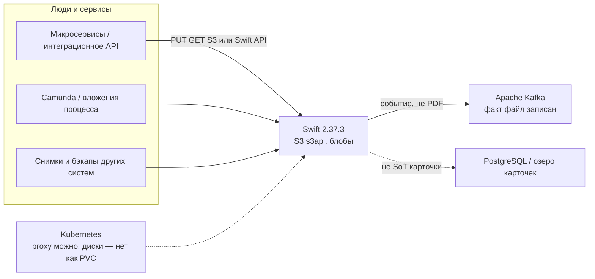
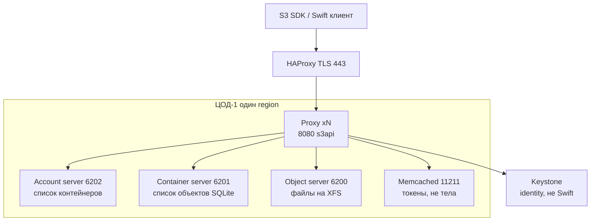
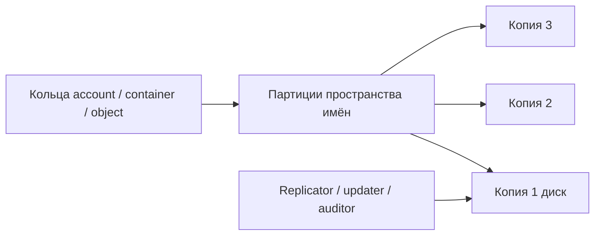
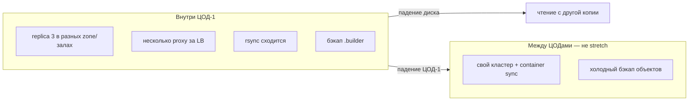
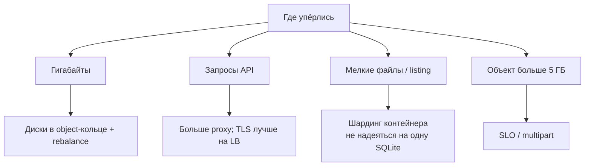
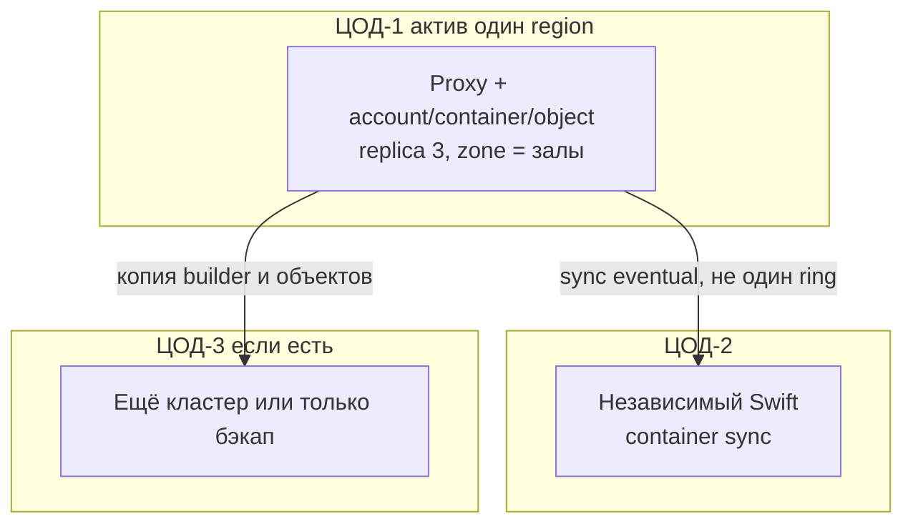

# OpenStack Swift 2.37.3 — схемы устройства

Связанные документы: правила — `OpenStack Swift.md`; установка — `OpenStack Swift.install.md`.

Ниже **C4** (четыре уровня: контекст → контейнеры → компоненты → код). В запросе это «D4»: тот же каркас. Уровень кода пропускаем — для эксплуатации важнее роли, порты и ручки HA/масштаба.

Допущения (их не было в исходном ТЗ платформы, без них схема врёт):

1. Stretch одного кластера на 2–3 ЦОДа (в т.ч. **Global Cluster** на 3 region) **нет**. Целевое: **один region в ЦОД-1** или **независимый** Swift на другой площадке + container sync. Не путать с GeoData **2.29.2**.
2. Swift **2.37.3**, серия OpenStack **2026.1 (Gazpacho)**. S3 — middleware `s3api` на тех же proxy, не AWS.
3. Storage-ноды — машины с локальным **XFS** (нужны xattr), не `emptyDir` и не NFS как диск object-server.
4. Нагрузки нет — на схемах нет «N дисков». Есть *что крутить*, когда цифры появятся.

---

## 1. Контекст (C4 system context)

Swift — **объектное** хранилище (файл по ключу в контейнере/бакете). Он **не** OLTP, **не** Kafka и **не** поиск по содержимому.



| Стрелка | Зачем помнить |
|---|---|
| Сервис → Swift | Вложения интеграций, выгрузки, архив. Listing контейнера может отстать (eventual) |
| Swift → Kafka | Отдельно публикуете факт. Swift не шина и не consumer group |
| Карточки не в бакет | Last-write-wins, нет JOIN. Поиск «по ИНН» строите рядом |

**Слабое место контекста:** клиент, которому нужен AWS Lifecycle / bucket policy / tagging — в матрице `s3_compat` этого **нет**. Срок жизни — нативный expiration Swift.

---

## 2. Контейнеры (из чего состоит решение)

Клиенту видна только **дверь** — proxy. Дальше кольца (ring: карта «имя → на каких дисках копии») ведут на три внутренних сервиса.



Порты внутренние: **6200** object, **6201** container, **6202** account, **873** rsync (догон копий). Выдать их клиентам = обойти auth proxy. Replica в Deployment Guide: **3** — единственное протестированное значение.

**Сильное:** proxy stateless, несколько за LB. **Слабое:** все proxy в одном зале + живые диски = API глухой. Кольца (`.ring.gz`) должны совпадать на всех нодах; `.builder` бэкапят отдельно.

---

## 3. Компоненты данных и фон



| Компонент | Для чего помнить |
|---|---|
| Ring + `.builder` | Потеряли builder — следующее изменение топологии лотерея. Файлы на диске могут остаться, карта — нет |
| Replicator | Догоняет копии (часто rsync). Replica ≠ backup от `DELETE` |
| Updater | Listing аккаунта/контейнера eventual |
| Auditor | Ищет битый файл (bit rot), quarantine |
| Storage policy | Класс контейнера (3 копии vs erasure coding). Задаётся при создании, **не** меняется |

Handoff: если primary-диск мёртв, proxy пишет на запасной из кольца, потом replicator вернёт «домой».

---

## 4. Поток записи (PUT)

```mermaid
sequenceDiagram
  participant App as Приложение
  participant P as Proxy s3api
  participant K as Keystone
  participant O as Object servers

  App->>P: PUT объект / S3
  P->>K: s3token / keystoneauth
  K-->>P: ок
  P->>P: смотрит ring
  P->>O: писать копии
  Note over P,O: успех клиенту при большинстве бэкендов; для replica 3 это 2
  O-->>P: 2 из 3 ок
  P-->>App: 201
```

Сразу после PUT объект по имени обычно читается. **Список** контейнера мог ещё не обновиться. Один PUT по умолчанию до **5 ГБ**; больше — SLO / S3 multipart (`slo` в pipeline).

---

## 5. Что настраивать: отказоустойчивость



| Ручка | Если не настроить |
|---|---|
| replica=3, копии по залам | Две копии в одной стойке = «HA на бумаге» |
| ≥2 proxy | Один proxy = SPOF API |
| Keystone HA | Хранилище живо, новые S3-сессии нет |
| Одинаковые ring.gz | Пишут не туда / 404 на живых данных |
| Global Cluster 3 region | Stretch: PUT или replicator через город. **Не** целевая схема |
| Смешать с GeoData 2.29.2 | Другая серия, другие CVE, другой пример колец |

Падение ЦОД-1 при мозге там же — нет объектного слоя, пока restore или переключение на независимый кластер. Это цена запрета stretch.

---

## 6. Что настраивать: масштабируемость



Не «увеличить PVC одного пода». Вес диска в кольце — от реальной ёмкости (ориентир гайда: 100.0 × ТБ). Вторая policy с erasure coding — **новые** контейнеры, холодный архив. RAID 5/6 вендор не рекомендует: надёжность — replica + auditor.

OpenStack-Helm: матрица 2026.1 — Kubernetes до **1.35**; у вас **1.36.4** — не доказанная комбинация. Kolla-Ansible роль Swift снял с 2025.1.

---

## 7. Прод: 2 или 3 ЦОДа без stretch



Клиенты в штате ходят на VIP proxy ЦОД-1. Три независимых кольца без sync = три правды файла. `write_affinity` / 3 region — глава Global Clusters про другую задержку; для микросервиса «записал и сразу GET с чужой площадки» affinity вредит.

**Сильное:** латентность PUT не прибита межЦОДовым RTT; blast radius кольца = площадка. **Слабое:** смерть ЦОД-1 = простой объектного слоя; container sync eventual, другой IAM/ключи.

---

## 8. Безопасность и сильное / слабое

Слои:

1. Клиентам только 443 → proxy. 6200–6202 и 873 — internal.
2. Прод-auth: **Keystone** + `s3token`, не tempauth (пароли в конфиге — стенд SAIO).
3. Pipeline: `s3api` (+ `bulk`, `slo` для заявленной S3-совместимости). Точный порядок — sample **2.37.3**.

At-rest middleware шифрует тело и значения метаданных, **не** имена account/container/object. Это защита унесённого диска, не админа внутренней сети. Пин **2.37.3**: линейка закрывает CVE S3/proxy (в т.ч. 2026-71190 и соседние).

| Сильное | Слабое |
|---|---|
| Горизонталь дешёвыми дисками, Apache 2.0 | Операционка колец; нет Raft-кворума как у etcd |
| Один кластер — Swift API и S3 | «S3-совместимый» ≠ AWS Lifecycle/policy |
| 3 копии внутри ЦОДа переживают диск/ноду | Нет прозрачного бакета на три ЦОДа без stretch |
| | Имена объектов видны at-rest; Keystone — SPOF входа |

Источники фактов: `OpenStack Swift.md` (роли, порты, ring, s3api, запрет смешивать с 2.29.2). Порога RTT у проекта Swift **нет** — Global Cluster 3 region на схемах не рисуем как целевой.
