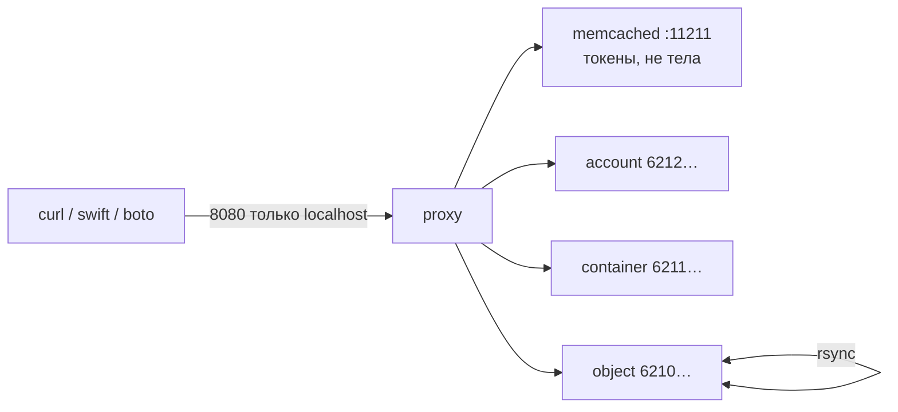

# OpenStack Swift 2.37.3 — установка (учебный контур)

**Допущение:** одна Linux-VM в закрытой сети, официальный SAIO (Swift All In One — все процессы на одной машине), исходники **2.37.3** (серия OpenStack **2026.1 Gazpacho**), identity — tempauth. Это не бой и не кластер.

Официальная страница шагов: https://docs.openstack.org/swift/2026.1/development_saio.html

---

## Куда ставить и сколько ресурсов (учебный контур)

**Куда.** Одна **Linux-машина или VM**. Гайд SAIO перечисляет: Ubuntu 24.04 LTS, CentOS Stream 9, Fedora, openSUSE. Ниже команды — Ubuntu 24.04 (первый образ в гайде). **Windows как сервер Swift в мануале не заявлена.**

Это **не** Docker Compose и **не** Kubernetes. Официального оператора «как CNPG» нет. Kolla-Ansible **убрал** роль Swift с 2025.1. OpenStack-Helm на 2026.1 заявляет Kubernetes **≥ 1.33 и ≤ 1.35**; в платформе **1.36.4** — комбинация **не** доказана. Кольцо хранит IP:порт/имя диска: IP пода без обновления кольца ломает кластер.

**Сколько железа.** Вендор разделяет «чтобы SAIO завелся» и «боевая смета». Боевой сметы в доке **нет** (нет вашей нагрузки). Числа **ядер CPU** для SAIO в гайде **нет**.

| Зачем цифра | CPU | RAM | Диск | Откуда |
|---|---|---|---|---|
| Минимум, чтобы процесс поднялся | **в доке нет** числа ядер | **≥ 2 ГиБ** | **≥ 40 ГиБ** места на машине | SAIO: «at least 2GB of memory and 40GB of storage» |
| Учебный ориентир | то же: отдельной «учебной» сметы ядер нет | те же **≥ 2 ГиБ** | машина **≥ 40 ГиБ**; loopback-файл в примере SAIO — **1 ГБ** (учебный диск, не ёмкость боя) | SAIO, раздел loopback |
| Бой | не эта таблица | не эта таблица | локальный **XFS**, не NFS | Deployment Guide не даёт «N дисков / M ТБ» |

Proxy в Deployment Guide — «CPU and network I/O intensive»; storage — «disk and network I/O intensive». **Цифр ядер и гигабайт на роль нет.**

**Сильная сторона:** совпадает с официальным SAIO; за часы виден PUT/GET и дыры матрицы S3.  
**Слабая сторона:** одна VM ≠ отказоустойчивость. Успешный boto на localhost **не** доказывает отказ зала, rsync между площадками и Keystone.

**Критично, даже если не спрашивали:**

- Клиентам только **proxy :8080** (на стенде — `127.0.0.1`). Порты object/container/account (**6200 / 6201 / 6202** в боевом примере; на SAIO — 6210–6242) и **rsync :873** — внутренняя сеть. Выдать их в интернет = обойти auth proxy.
- Диск object-server — **локальный XFS** (нужны расширенные атрибуты файла, xattr). **NFS как единственный диск object-server не ставить.**
- Не клонировать `master` / не ставить `latest`. Пин — **2.37.3**, не 2.38.x, не GeoData **2.29.2**.
- Живой кластер **не растягивать** на 2–3 дата-центра. Завод: один region с низкой задержкой. Порога RTT в доке **нет**. Между площадками — независимые кластеры (штатный мост — container sync) или бэкап, не одно кольцо.



---

## Установка для новичка

Команды — **на Linux-VM стенда**, не в PowerShell на Windows. Нужен пользователь с `sudo` (так в SAIO: админ входит как обычный пользователь).

**Git** — программа, которая скачивает исходники. **pip** — установщик пакетов Python. **rsync** — копирование файлов между «нодами» (на SAIO они все на localhost). **Memcached** — кэш токенов tempauth, не кэш тел объектов: без него стенд «не пускает».

Полный плейбук не копируем — идём по SAIO **2026.1**, но **пиним тег 2.37.3** (гайд клонирует репозиторий без тега; так получите не ту версию).

### Что должно быть до установки

Есть:

- Linux-VM (Ubuntu 24.04 LTS), закрытая сеть, вход с jump-хоста или VPN.
- Свободен **8080** на localhost.
- **≥ 2 ГиБ RAM**, **≥ 40 ГиБ** свободного места.
- `sudo`, сеть до `opendev.org` / PyPI (или ваше зеркало).

Нет (и не нужно на этом стенде):

- Keystone, балансировщик, Kubernetes, Docker как инсталлятор.
- Публикации 8080 / 873 / 6210–6242 в интернет.
- NFS как диск данных Swift.

### Этап 1. Пакеты ОС

**Что делаем:** ставим компилятор, Memcached, rsync, инструменты XFS и Python 3 — зависимости, без которых исходники не соберутся.

```bash
sudo apt-get update
sudo apt-get install -y curl gcc memcached rsync sqlite3 xfsprogs \
  git-core libffi-dev python3-setuptools \
  liberasurecode-dev libssl-dev
sudo apt-get install -y python3-coverage python3-dev python3-pytest \
  python3-xattr python3-eventlet \
  python3-greenlet python3-pastedeploy \
  python3-pip python3-dnspython
```

Другие ОС — блоки CentOS / Fedora / openSUSE на той же странице SAIO.  
Успех: `memcached` и `rsync` установлены (`dpkg -l memcached rsync`).

### Этап 2. Учебный диск XFS (loopback)

**Что делаем:** Swift кладёт объекты на **XFS**. На стенде это файл 1 ГБ, который ядро монтирует как диск (loopback). Не путать с 40 ГиБ места на VM.

```bash
sudo mkdir -p /srv
sudo truncate -s 1GB /srv/swift-disk
sudo mkfs.xfs /srv/swift-disk
sudo mkdir -p /mnt/sdb1
```

В `/etc/fstab` одна строка (как в SAIO):

```text
/srv/swift-disk /mnt/sdb1 xfs loop,noatime 0 0
```

```bash
sudo mount -a
```

Успех: `findmnt /mnt/sdb1` показывает `xfs`. Размер loopback можно увеличить той же `truncate` — так пишет SAIO; 1 ГБ хватает, чтобы положить учебный объект.

### Этап 3. Каталоги «четырёх нод» на localhost

**Что делаем:** SAIO эмулирует четыре storage-ноды каталогами `/srv/1`…`/srv/4`. Симлинки на `/mnt/sdb1`: если loopback отмонтировали, запись не уйдёт в корневой том.

```bash
sudo mkdir /mnt/sdb1/1 /mnt/sdb1/2 /mnt/sdb1/3 /mnt/sdb1/4
sudo chown "${USER}:${USER}" /mnt/sdb1/*
for x in {1..4}; do sudo ln -s /mnt/sdb1/$x /srv/$x; done
sudo mkdir -p /srv/1/node/sdb1 /srv/1/node/sdb5 \
              /srv/2/node/sdb2 /srv/2/node/sdb6 \
              /srv/3/node/sdb3 /srv/3/node/sdb7 \
              /srv/4/node/sdb4 /srv/4/node/sdb8
sudo mkdir -p /var/run/swift
sudo mkdir -p /var/cache/swift /var/cache/swift2 \
              /var/cache/swift3 /var/cache/swift4
sudo chown -R "${USER}:${USER}" /var/run/swift
sudo chown -R "${USER}:${USER}" /var/cache/swift*
for x in {1..4}; do sudo chown -R "${USER}:${USER}" /srv/$x/; done
```

Успех: `ls -ld /srv/1 /mnt/sdb1/1` — симлинк и каталоги вашего пользователя.

Права после перезагрузки: строки в `/etc/rc.local` или systemd-tmpfiles — как в SAIO («Restore appropriate permissions on reboot»). Без этого после reboot процессы могут не стартовать.

### Этап 4. Исходники 2.37.3

**Что делаем:** ставим CLI `swift` и сам Swift **тега 2.37.3**. Гайд SAIO клонирует GitHub без тега — так делать нельзя.

```bash
cd "$HOME"
git clone https://opendev.org/openstack/python-swiftclient.git
cd "$HOME/python-swiftclient"
sudo python3 setup.py develop

cd "$HOME"
git clone https://opendev.org/openstack/swift.git
cd "$HOME/swift"
git fetch --tags
git checkout 2.37.3
sudo python3 -m pip install --no-binary cryptography -r requirements.txt
sudo python3 setup.py develop
```

На Ubuntu 24.04 команды `python` часто нет — используйте `python3` (смысл тот же, что `python setup.py develop` в SAIO).

Успех: `git -C "$HOME/swift" describe --tags` содержит **2.37.3**. Коммит релиза на https://releases.openstack.org/gazpacho/ — `5104042f12efcaf90c28b656a378da8959004826`.  
**В доке SAIO нет пина версии python-swiftclient** — это только CLI, не сам Swift.

Альтернатива без git: tarball https://tarballs.opendev.org/openstack/swift/swift-2.37.3.tar.gz (дата на индексе tarballs: 2026-08-20). Конфиги SAIO всё равно лежат в дереве исходников (`doc/saio/`).

Зависимости тестов (`test-requirements.txt`) для PUT/GET не обязательны.

### Этап 5. rsync и memcached

**Что делаем:** копируем учебный `rsyncd.conf` из дерева 2.37.3 и включаем демоны.

```bash
sudo cp "$HOME/swift/doc/saio/rsyncd.conf" /etc/
sudo sed -i "s/<your-user-name>/${USER}/" /etc/rsyncd.conf
```

Ubuntu: в `/etc/default/rsync` — `RSYNC_ENABLE=true` (файл можно создать). Затем:

```bash
sudo systemctl enable --now rsync
sudo systemctl enable --now memcached
rsync rsync://pub@localhost/
```

Успех: список модулей `account6212` … `object6240` как в SAIO. Memcached слушает **11211**.

Образец SAIO ставит в rsyncd `address = 0.0.0.0`. На стенде с одним NIC это слушает все интерфейсы. Сеть VM закрытая; **873 не публиковать**.

### Этап 6. Конфиги SAIO + включить S3

**Что делаем:** копируем учебные конфиги в `/etc/swift`. Proxy в образце уже `bind_ip = 127.0.0.1`, `bind_port = 8080`. В конвейере SAIO **нет** `s3api` — его добавляют **перед** tempauth (комментарий в том же файле и https://docs.openstack.org/swift/2026.1/middleware.html).

```bash
sudo rm -rf /etc/swift
cd "$HOME/swift/doc"
sudo cp -r saio/swift /etc/swift
cd -
sudo chown -R "${USER}:${USER}" /etc/swift
find /etc/swift/ -name '*.conf' | xargs sudo sed -i "s/<your-user-name>/${USER}/"
```

В `/etc/swift/proxy-server.conf` в `[pipeline:main]` вставьте `s3api` **сразу перед** `tempauth`. Секция `[filter:s3api]` в SAIO уже есть (`s3_acl = yes`, `check_bucket_owner = yes`). `bulk` и `slo` в конвейере SAIO уже стоят — они нужны заявленной S3-совместимости.

Успех: `grep bind_port /etc/swift/proxy-server.conf` → `8080`; в `pipeline` есть `s3api` перед `tempauth`.

`swift_hash_path_prefix` / `suffix` в образце = `changeme`. Это **стенд**; в бою — свои строки, которые **нельзя** потом менять.

### Этап 7. Скрипты, кольца, старт

**Что делаем:** кладём скрипты SAIO в `$HOME/bin`, собираем учебные кольца, поднимаем процессы. **Кольцо** — словарь «имя → на каких дисках копии». `swift-init` — программа, которая стартует proxy/account/container/object.

```bash
mkdir -p "$HOME/bin"
cp "$HOME/swift/doc/saio/bin/"* "$HOME/bin/"
chmod +x "$HOME/bin/"*
echo "export PATH=${PATH}:$HOME/bin" >> "$HOME/.bashrc"
echo "export SAIO_BLOCK_DEVICE=/srv/swift-disk" >> "$HOME/.bashrc"
. "$HOME/.bashrc"

remakerings
startmain
```

`startmain` = `swift-init main start`. Предупреждение `Unable to increase file descriptor limit. Running as non-root?` в SAIO — ожидаемо.

Успех: процессы proxy/account/container/object живы (`swift-init main status` или список процессов `swift-proxy-server`). Кольца SAIO (`create 10 3 1` и replica 2/6 для политик) — **лаборатория**, не боевой `create <part_power> 3 24`.

### Этап 8. Стенд живой

**Что делаем:** берём токен tempauth и смотрим account. Затем кладём объект.

```bash
curl -v -H 'X-Storage-User: test:tester' -H 'X-Storage-Pass: testing' \
  http://127.0.0.1:8080/auth/v1.0
```

В ответе — заголовки `X-Auth-Token` и `X-Storage-Url`. Дальше:

```bash
swift -A http://127.0.0.1:8080/auth/v1.0 -U test:tester -K testing stat
```

Успех: HTTP 200 на `/auth/v1.0`, `swift stat` без ошибки. Если 401 — memcached не запущен (так в разделе Debugging SAIO).

S3 (после этапа 6): endpoint `http://127.0.0.1:8080`, access key `test:tester`, secret `testing`. Пример клиента в мануале — библиотека **boto** (не boto3): https://docs.openstack.org/swift/2026.1/middleware.html (`OrdinaryCallingFormat` = path-style).

Вызов AWS Lifecycle / bucket policy / object tagging — ожидаемый **отказ** матрицы, не «потом в бою заработает»: https://docs.openstack.org/swift/2026.1/s3_compat.html

Чего этот стенд **ещё не доказывает:** отказ диска/залы, Keystone, несколько proxy за балансировщиком, rsync между площадками, нагрузку, выборы лидера (их в Swift нет), совместимость OpenStack-Helm с Kubernetes 1.36.4, S3 Lifecycle. SAIO с tempauth **не** копировать в бой.

---

## Первый запуск — URL, порт, учётка, смена пароля

Веб-консоли у Swift **нет**. Вход — HTTP API на proxy.

| Что | Значение | Стенд |
|---|---|---|
| URL Swift API | `http://127.0.0.1:8080` | только localhost |
| Auth tempauth | `http://127.0.0.1:8080/auth/v1.0` | заголовки `X-Storage-User` / `X-Storage-Pass` |
| S3 endpoint | `http://127.0.0.1:8080` | path-style |
| Учётка | account `test`, user `tester` → **`test:tester`** | пароль **`testing`** |
| S3 access key | `test:tester` | secret = пароль tempauth **`testing`** |

Строки из образца SAIO `/etc/swift/proxy-server.conf` (`[filter:tempauth]`):

```text
user_admin_admin = admin .admin .reseller_admin
user_test_tester = testing .admin
user_test_tester2 = testing2 .admin
user_test_tester3 = testing3
```

Формат: `user_<account>_<user> = <пароль> [группы]`. Пароли **`testing` / `admin` — только закрытый стенд.** В бой tempauth не берут (https://docs.openstack.org/swift/2026.1/overview_auth.html: «not recommended to use TempAuth in a production system»). Бой — **Keystone** + для S3 EC2-credentials и middleware `s3token`.

**Смена пароля.** Отдельной кнопки нет. Правите ключ в `user_test_tester = …` (это и есть пароль / S3 secret), затем перезапуск proxy: `swift-init proxy restart` (тот же `swift-init`, что в `startmain`). Старые токены живут в memcached, пока не истекут — после смены пароля при сомнении перезапустите memcached на стенде. Новый секрет — не в git.

TLS на стенде нет (HTTP, loopback). В бою — TLS на балансировщике → 8080; storage-порты не публичны.

---

## Подключение к своей системе

| | |
|---|---|
| Протокол | HTTP(S) на **proxy**. Родной REST `/v1/{account}/{container}/{object}` и, если включили `s3api`, запросы «как Amazon S3» на **том же** порту **8080**. Микросервисы платформы — **S3 API** (AWS SDK / boto), не «нативный Swift» как единственный путь. Бакет = контейнер. Path-style на первый контракт. |
| Порт | Клиентам только **8080** (в бою обычно **443** на HAProxy → 8080). **6200–6202** и **873** клиентам не нужны. |
| Кто клиент | Микросервисы, вложения Camunda, снимки/бэкапы других систем. Kafka везёт **факт** «файл записан», не сам блоб. Карточки живут в PostgreSQL / озере, не в бакете. |
| В секрет (не git) | S3 access key + secret (на стенде это tempauth; в бою — EC2-credentials Keystone). Endpoint. В бою ещё: пароль сервиса Swift в Keystone, root-секрет at-rest (≥ 44 символа base64, одинаковый на всех proxy) — не `changeme`. |
| В git | Имена бакетов/префиксы ключей, path-style vs virtual-host, лимит **5 ГБ** на один PUT (больше — SLO / multipart, в конвейере должен быть `slo`). |

**Не путать с**

| Сосед | Чем отличается |
|---|---|
| GeoData / Swift **2.29.2** | Чужой инсталлятор, другие CVE, другой пример колец. Не склеивать без письма вендора GeoData. |
| PostgreSQL | Эталон карточки, не объект. |
| MinIO в чарте GitLab | Стендовый сабчарт, не этот Swift. |
| Amazon S3 | Эмуляция `s3api`. В матрице **нет** bucket lifecycle, bucket policy, object tagging. |

Один PUT по умолчанию ≤ **5 ГБ**. `write_affinity` на этом контуре **не** включать (документация Global Clusters: не для «записал и сразу читаешь из другого региона»).

---

## Ссылки на материал

| Факт | URL |
|---|---|
| SAIO: 2 ГиБ RAM, 40 ГиБ, Ubuntu 24.04, loopback 1 ГБ, порты 8080, tempauth `test:tester` / `testing`, `startmain`, `remakerings` | https://docs.openstack.org/swift/2026.1/development_saio.html |
| Релиз 2.37.3 / CVE (2026-71190, 71191, 71192) | https://docs.openstack.org/releasenotes/swift/2026.1.html |
| Коммит тега 2.37.3 | https://releases.openstack.org/gazpacho/ |
| Tarball 2.37.3 | https://tarballs.opendev.org/openstack/swift/swift-2.37.3.tar.gz |
| PyPI 2.37.3 (Python ≥ 3.7) | https://pypi.org/project/swift/2.37.3/ |
| Deployment Guide: replica=3, ≥100 партиций/диск, `min_part_hours` пример 24, вес 100.0×ТБ, не RAID, HA = несколько proxy, `/srv/node` root:root 755, порты 6200 в примере | https://docs.openstack.org/swift/2026.1/deployment_guide.html |
| Global Clusters: default = один region; `write_affinity` не для GET сразу после PUT | https://docs.openstack.org/swift/2026.1/overview_global_cluster.html |
| Container sync (мост независимых кластеров, не stretch) | https://docs.openstack.org/swift/2026.1/overview_container_sync.html |
| `s3api` перед auth; ключ S3 = `account:user`; boto path-style | https://docs.openstack.org/swift/2026.1/middleware.html |
| Матрица S3: Lifecycle / policy / tagging = No | https://docs.openstack.org/swift/2026.1/s3_compat.html |
| tempauth ≠ бой; Keystone | https://docs.openstack.org/swift/2026.1/overview_auth.html |
| Лимит 5 ГБ на PUT | https://docs.openstack.org/swift/2026.1/api/object_api_v1_overview.html |
| Kolla-Ansible: роль Swift снята с 2025.1 | https://docs.openstack.org/releasenotes/kolla-ansible/2025.1.html |
| OpenStack-Helm 2026.1: Kubernetes ≥ 1.33 и ≤ 1.35 | https://docs.openstack.org/openstack-helm/latest/readme.html |
| Зачем продукт, порты, роль в платформе | `OpenStack Swift.md` |
| Словарь | `OpenStack Swift.info.md` |
| Стыковка с платформой | `OpenStack Swift.shema.md` |
| Роль консультанта (пин 2.37.3, запреты) | `OpenStack Swift.consultant.md` |

**В доке вендора нет (не выдумано):** число ядер CPU для SAIO и для proxy/storage; порог RTT для растяжки кольца; смета «N дисков / M ТБ»; пин версии python-swiftclient в SAIO; официальный Docker/Helm-путь SAIO; сертификация OpenStack-Helm на Kubernetes 1.36.4; веб-UI и мастер смены пароля (пароль — строка в `proxy-server.conf`).
