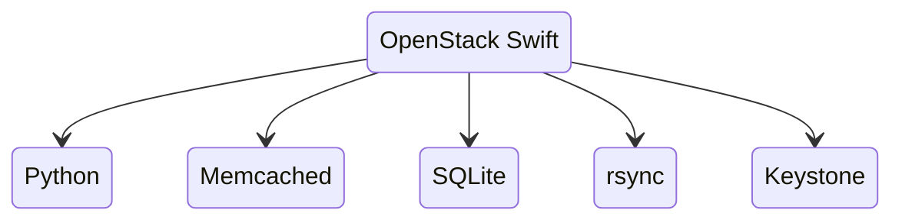
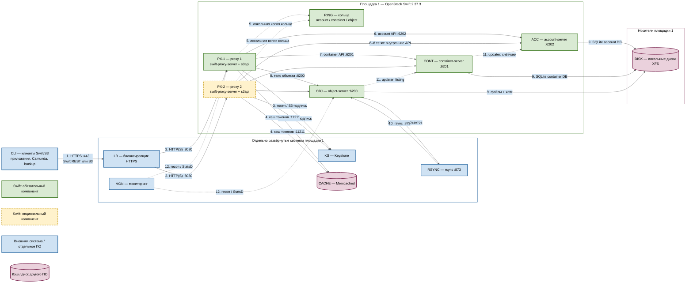

# OpenStack Swift 2.37.3 — назначение и архитектура

OpenStack Swift — объектное хранилище: кладёте файл по имени в контейнер (бакет). Этот документ про **свою установку** версии **2.37.3**, серия OpenStack **2026.1 (Gazpacho)**. Проверено **26 августа 2026**: в релиз-нотах серии 2026.1 это последний номер линейки. **2.38.x** в current/unreleased — ещё не стабильная серия, в бой не берём. Это не Amazon S3, не MinIO, не Ceph RGW и не Swift 2.29.2 из инсталлятора GeoData.

Документация: https://docs.openstack.org/swift/2026.1/  
Архитектура: https://docs.openstack.org/swift/2026.1/overview_architecture.html  
Развёртывание: https://docs.openstack.org/swift/2026.1/deployment_guide.html  
S3 API (middleware `s3api`): https://docs.openstack.org/swift/2026.1/middleware.html  
Матрица совместимости S3: https://docs.openstack.org/swift/2026.1/s3_compat.html

Лицензия исходников Swift — **Apache 2.0**. Отдельного license-server нет.

В документе по GeoData инсталлятор вендора фиксирует **Swift 2.29.2** и пример колец в **одном** region/zone. Этот файл — про **платформенный** Swift 2.37.3 как S3-хранилище. Склеивать его с GeoData «потому что оба Swift» без письма вендора нельзя.

Этот документ описывает назначение, функции, состав и потоки данных. Пошаговая установка вынесена в `OpenStack Swift.install.md`.

---

## Назначение системы

Swift нужен, чтобы **класть большие и долгоживущие файлы** (вложения интеграций, снимки, бэкапы индексов, выгрузки), не раздувая СУБД и не делая Kafka диском.

Карточки клиентов живут в СУБД/витрине. События везёт Kafka. Процессы ведёт Camunda. Интеграционное API ходит наружу. Swift — **объектный слой**: «положи и забери файл по ключу», а не «дай клиента по ИНН и поправь ФИО».

S3 API включаете middleware `s3api` на **тех же** proxy. Это эмуляция, не AWS. Клиенты с Lifecycle-правилами, тегами и bucket policy **сломаются**.

---

## Перечень функций

Что умеет self-hosted Swift 2.37.3 с включённым S3 API:

1. **Класть и читать объекты** родным REST (`/v1/{account}/{container}/{object}`) и, если включили `s3api`, запросами «как Amazon S3».
2. **Держать несколько копий** каждой части пространства имён по карте размещения (кольцо). Рекомендация вендора: **3 копии** — «это единственное значение, которое тестировали». 3 копии ≈ диск ×3 относительно «один экземпляр файла».
3. **Маршрутизировать запросы stateless proxy:** смотрит в кольцо, стримит данные, не складывает объект целиком на диск proxy. Несколько proxy за балансировщиком — штатный вход.
4. **Хранить файлы на object-серверах**, списки объектов — на container-серверах (SQLite), списки контейнеров — на account-серверах. Клиенту внутренние серверы **не** нужны; proxy ходит к ним сам.
5. **Догонять копии фоном** (replicator, часто через rsync), догонять списки (updater), искать битый файл (auditor). Для erasure coding восстановление идёт другим путём (reconstructor).
6. **Откладывать запись на запасной диск (handoff)**, если основное место из кольца недоступно. Потом replicator догонит «правильное» место. Успех клиенту завязан на **большинство** успешных записей на бэкенд (для 3 копий это **2**). Эту цифру вендор в Deployment Guide отдельной главой не печает — печает «ставьте 3 replica».
7. **Резать большие объекты кусками.** По умолчанию один PUT ≤ **5 ГБ**; больше — сегменты + манифест (SLO). Для полной заявленной S3-совместимости multipart в конвейере proxy должен быть **slo**.
8. **Проверять S3-подпись** через Keystone (`s3token`) в бою. Встроенные учётки в конфиге (`tempauth`) — лаборатория, не identity боя.
9. **Шифровать тело объекта at-rest** опцией middleware (ключ в конфиге или внешний KMS). Шифруется тело, ETag ненулевых объектов, **значения** пользовательских метаданных. **Не** шифруются имена account/container/object, имена метаданных, Content-Type, размер. Это защита от чтения **унесённого диска**, не от того, кто сел на внутреннюю сеть Swift.
10. **Снимать телеметрию** (`swift-recon`): кольца, время репликации, карантин, отложенные обновления.

Чего система **не** делает и часто путают: она не полный AWS S3 (нет bucket lifecycle как в AWS, bucket policy, object tagging, notifications, website hosting, billing, inventory). Не транзакционный эталон карточек, не шина событий, не поиск по содержимому, не BPMN. Кворума метаданных как у etcd нет. RAID 5/6 вендор **не требует и не рекомендует**. Официального оператора «как у OpenSearch» нет. Kolla-Ansible **убрал** роль Swift с 2025.1. Копии бэкап не заменяют: `DELETE` уедет на все три.

---

## Основные элементы системы и зависимости

Swift — одно программное решение из нескольких специализированных сервисов. Proxy, account, container и object services нельзя считать взаимозаменяемыми: у них разные данные и роли. Keystone, балансировщик, Memcached, rsync, клиенты и система метрик — отдельные внешние системы. ([Архитектура](https://docs.openstack.org/swift/2026.1/overview_architecture.html), [Deployment Guide](https://docs.openstack.org/swift/2026.1/deployment_guide.html))

**Допущение схемы:** одна площадка, один region, один живой кластер Swift **2.37.3**. Storage-ноды, proxy, Keystone и Memcached этой установки живут в одном дата-центре. Stretch одного кольца на 2–3 зала и Global Cluster на схеме **нет**: порога допустимого RTT у проекта нет, заводской ориентир — один region с низкой задержкой. ([Global Clusters](https://docs.openstack.org/swift/2026.1/overview_global_cluster.html))

**Сильная сторона** одного зала: PUT/GET и rsync не едут через город, blast radius кольца = эта площадка, сразу после записи объект обычно читается с локальных копий. **Слабая:** падение этой площадки вместе с её дисками останавливает объектный слой, даже если в других ЦОДах есть машины. **Критично:** клиентам только вход на proxy; порты **6200–6202** и **873** не публиковать наружу; диск object-server — локальный **XFS**, не NFS; не растягивать это кольцо на второй дата-центр; не склеивать с GeoData Swift **2.29.2**.

### Схема инстансов и потоков

Имена внутри блоков — роли, не обязательные DNS-имена. Сплошная стрелка — рабочий поток показанной схемы одной площадки; пунктир — чтение локальной карты, отложенное обновление, опциональный путь или сбор наблюдаемости. Направление стрелки — кто открывает соединение. Рамки subgraph **без заливки**: цвет задаёт сам квадратик, подложка его не перекрашивает.

**Легенда:**

- ■ **Зелёный** — процессы и файлы Swift, без которых показанный контур PUT/GET не работает (`PX-1`, кольца, account / container / object services).
- ■ **Жёлтый, пунктирная рамка** — тот же продукт, который на одной площадке можно не включать (второй proxy). На закрытом стенде достаточно `PX-1`.
- ■ **Синий** — отдельно развёрнутые системы и участники. Swift их не кластеризует и не заменяет.
- ■ **Розовый цилиндр** — кэш или диск другого ПО. Формат SQLite и xattr — продукт; Memcached и XFS — нет.

### Описание блоков

#### CLI — клиенты Swift/S3

- **Что это:** приложения платформы, задачи Camunda, задания резервного копирования или администраторский клиент, которые кладут и забирают файлы по ключу.
- **Технологии и варианты:** нативный Swift REST-клиент; AWS SDK, boto3 или иной S3-клиент при включённом middleware `s3api`; для объекта больше 5 ГБ — сегменты и манифест SLO / S3 multipart. ([матрица S3](https://docs.openstack.org/swift/2026.1/s3_compat.html), [большие объекты](https://docs.openstack.org/swift/2026.1/overview_large_objects.html))
- **Назначение:** создавать, читать, перечислять и удалять объекты и контейнеры в пределах поддержанной матрицы API. Клиент не ходит на порты 6200–6202 и не читает диски storage-нод.
- **Развёртывание:** внешние участники, не входят в Swift.

#### LB — балансировщик HTTPS

- **Что это:** единая клиентская точка входа площадки 1 перед процессами proxy.
- **Технологии и варианты:** HAProxy либо иной L4/L7-балансировщик; TLS может завершаться здесь или на proxy. Конкретный продукт задаёт платформа, не Swift. ([Deployment Guide](https://docs.openstack.org/swift/2026.1/deployment_guide.html))
- **Назначение:** принять HTTPS на **443/TCP**, проверить, что proxy жив, и распределить запросы на **8080/TCP**. Сам объекты не хранит и кольца не читает.
- **Развёртывание:** отдельно развёрнутая система. На закрытом SAIO-стенде вход может быть `127.0.0.1:8080` без балансировщика; для показанной многоproxy-схемы вход обязателен.

#### KS — Keystone

- **Что это:** служба идентификации пользователей, проектов, токенов и EC2-ключей для S3-подписи.
- **Технологии и варианты:** OpenStack Keystone в бою; на изолированном стенде вместо этого блока в proxy включают middleware `tempauth` (учётки в конфиге, не внешний identity). Middleware `authtoken`, `s3token`, `keystoneauth` работают внутри proxy и не делают Keystone частью Swift. ([middleware](https://docs.openstack.org/swift/2026.1/middleware.html), [SAIO](https://docs.openstack.org/swift/2026.1/development_saio.html))
- **Назначение:** подтвердить, кто клиент и что ему разрешено. Для S3 proxy проверяет подпись через `s3token` у Keystone.
- **Развёртывание:** отдельно развёрнутая система на **этой же** площадке. В боевой схеме обязательна. Учебные пароли `tempauth` в бой не копировать.

#### CACHE — Memcached

- **Что это:** кэш в оперативной памяти для токенов и служебных результатов proxy.
- **Технологии и варианты:** Memcached на **11211/TCP**; обычно несколько доступных экземпляров. Тела объектов туда не кладут. ([Deployment Guide](https://docs.openstack.org/swift/2026.1/deployment_guide.html), [SAIO](https://docs.openstack.org/swift/2026.1/development_saio.html))
- **Назначение:** не ходить в identity на каждый запрос. Без живого Memcached типичный proxy с auth «не пускает».
- **Развёртывание:** отдельно развёрнутое ПО. Ставится рядом со Swift, но это не процесс `swift-*` и не источник истины объектов.

#### RSYNC — rsync

- **Что это:** системная программа и протокол копирования файлов между storage-нодами.
- **Технологии и варианты:** демон rsync на **873/TCP**. Object-replicator передаёт им реплики объектов. Account- и container-replicators этим потоком **не** пользуются: они гоняют записи SQLite по HTTP своих сервисов (**6202** и **6201**). ([Архитектура, Replication](https://docs.openstack.org/swift/2026.1/overview_architecture.html))
- **Назначение:** фоном догнать требуемое размещение после отказа диска, handoff-записи или смены кольца.
- **Развёртывание:** отдельное системное ПО на storage-нодах этой площадки. Процесс `object-replicator` входит в Swift; сам rsync — нет. Порт 873 клиентам не выдавать.

#### MON — мониторинг

- **Что это:** средства наблюдения за кластером, не участник PUT/GET.
- **Технологии и варианты:** `swift-recon` и recon-middleware на storage-нодах; встроенная отправка StatsD (`log_statsd_host`); внешний сборщик (collectd, Prometheus exporter, система метрик площадки). ([мониторинг](https://docs.openstack.org/swift/2026.1/admin/objectstorage-monitoring.html))
- **Назначение:** видеть MD5 колец, время репликации, карантин, отложенные обновления listing (`async_pendings`) и ответы proxy.
- **Развёртывание:** интерфейс recon относится к Swift; хранилище и графики метрик — отдельно развёрнутая система. На схеме **опционален** для рабочего PUT/GET.

#### PX-1 — proxy 1

- **Что это:** процесс `swift-proxy-server`: единственный клиентский API кластера. Не складывает тело объекта целиком на свой диск — стримит байты между клиентом и object-server. ([Proxy Server](https://docs.openstack.org/swift/2026.1/overview_architecture.html))
- **Технологии и варианты:** Python / WSGI-конвейер. Для этой схемы в pipeline: `s3api` (S3), `slo` (большие объекты / multipart), при боевом identity — `authtoken`, `s3token`, `keystoneauth`. Нативный Swift REST и S3 слушают **те же** proxy на **8080/TCP**. ([middleware](https://docs.openstack.org/swift/2026.1/middleware.html))
- **Назначение:** принять запрос, проверить identity, по кольцам выбрать backend, потоково записать или отдать объект, собрать ответы storage services. Если основной диск из кольца недоступен, proxy спрашивает handoff-устройство.
- **Развёртывание:** входит в Swift, ставится на этой площадке. Минимум живого API — один такой процесс. Stateless относительно тел объектов: инстанс можно заменить без переноса файлов.

#### PX-2 — proxy 2

- **Что это:** второй такой же процесс `swift-proxy-server` за тем же входом.
- **Технологии и варианты:** та же поставка **2.37.3**, тот же набор middleware и те же файлы колец, что у `PX-1`. Своего протокола «proxy ↔ proxy» нет. ([Deployment Guide](https://docs.openstack.org/swift/2026.1/deployment_guide.html))
- **Назначение:** горизонтально раздать API и пережить отказ одного proxy. Это не выборы лидера и не кворум метаданных.
- **Развёртывание:** входит в продукт; на одной площадке **опционален**. Учебный SAIO обходится `PX-1`. В бою второй proxy имеет смысл, только если `LB`, кольца и storage-ноды ему доступны. Один proxy = точка отказа входа.

#### RING — кольца

- **Что это:** локальные карты «имя → на каких устройствах лежат копии»: отдельные файлы `account.ring.gz`, `container.ring.gz` и `object.ring.gz` (плюс object ring на каждую storage policy).
- **Технологии и варианты:** согласованное хеширование, партиции, зоны; replica-политика (рекомендация вендора — **3 копии**, «единственное значение, которое тестировали») или erasure coding. Рабочие `.ring.gz` собирают из административных `.builder`. ([The Ring](https://docs.openstack.org/swift/2026.1/overview_architecture.html), [Deployment Guide](https://docs.openstack.org/swift/2026.1/deployment_guide.html))
- **Назначение:** детерминированно указать proxy и фоновым процессам, куда писать и откуда читать, без центрального каталога размещения. Потеряли `.builder` — следующее изменение топологии лотерея: файлы на дисках могут остаться, карту пересобрать будет не из чего.
- **Развёртывание:** часть Swift. Одинаковые версии нужных колец должны лежать у каждого proxy и у соответствующих storage services. Центрального «ring-сервера» на схеме нет: это файлы, которые копируют на ноды.

#### ACC — account-server

- **Что это:** storage service списков контейнеров аккаунта. Процесс `account-server` на **6202/TCP** плюс фон: `account-replicator`, `account-auditor`, `account-reaper`. Это не Keystone и не «учётка пользователя». ([Account Server](https://docs.openstack.org/swift/2026.1/overview_architecture.html))
- **Технологии и варианты:** SQLite-базы account на локальных дисках; репликация баз между нодами по HTTP **6202** (или целиком файлом БД), не через поток rsync объектов.
- **Назначение:** хранить список контейнеров, счётчики и метаданные account. Тело объекта и список объектов контейнера **не** хранит.
- **Развёртывание:** входит в Swift. На схеме один квадрат — роль; в кластере несколько экземпляров на разных storage-нодах по account ring. Клиенту этот порт не нужен.

#### CONT — container-server

- **Что это:** storage service listing объектов в контейнере. Процесс `container-server` на **6201/TCP** плюс `container-replicator`, `container-updater`, `container-auditor`. Для очень больших контейнеров — sharding. ([Container Server](https://docs.openstack.org/swift/2026.1/overview_architecture.html))
- **Технологии и варианты:** SQLite-базы container, container ring, фоновые broker-операции. Байты объектов сюда не пишут.
- **Назначение:** знать, *какие имена* лежат в контейнере, и вести счётчики. Где лежат файлы, знает object ring, не этот сервис.
- **Развёртывание:** входит в Swift, отдельный тип service. Несколько экземпляров на storage-нодах. Listing может отстать от успешного PUT — это ожидаемое окно eventual consistency, пока updater не догонит.

#### OBJ — object-server

- **Что это:** blob-сервер тел объектов. Процесс `object-server` на **6200/TCP** плюс `object-replicator`, `object-updater`, `object-auditor`; для erasure coding вместо replicator — `object-reconstructor`. ([Object Server](https://docs.openstack.org/swift/2026.1/overview_architecture.html))
- **Технологии и варианты:** файл на локальной ФС, метаданные в extended attributes (`xattr`); replica storage policy или erasure coding; SLO-манифест для составного большого объекта. В примере кольца все диски ноды на одном **6200**; вариант `servers_per_port` — свой порт на диск. ([Deployment Guide](https://docs.openstack.org/swift/2026.1/deployment_guide.html))
- **Назначение:** записать и отдать байты объекта, держать файловые метаданные, восстановить размещение, поставить в очередь обновление listing, если container-server не ответил сразу.
- **Развёртывание:** входит в Swift. Только этот уровень хранит байты пользовательского объекта. Несколько экземпляров на разных дисках/нодах по object ring (для replica=3 — три места). NFS как единственный диск object-server не ставить.

#### DISK — локальные диски XFS

- **Что это:** устройства storage-нод, смонтированные как `/srv/node/...`, на которых лежат файлы объектов и SQLite account/container.
- **Технологии и варианты:** **XFS** с включёнными xattr. RAID 5/6 вендор не требует и не рекомендует: надёжность — replica + auditor. Несколько устройств и несколько storage policy. Цифр «N дисков / M ТБ» в мануале нет. ([Deployment Guide](https://docs.openstack.org/swift/2026.1/deployment_guide.html), [SAIO](https://docs.openstack.org/swift/2026.1/development_saio.html))
- **Назначение:** постоянное хранение. Пустой или сетевой диск без xattr ломает object-server.
- **Развёртывание:** инфраструктурный ресурс этой площадки, не процесс Swift. Формат раскладки файлов — продукт; сама файловая система и железо — нет. Диски «чужого» ЦОДа в это кольцо не входят.

#### Рамки EXT / SITE / DATA и блоки легенды

- **Что это:** группировка и пояснение цветов, не runtime-процессы.
- **Технологии и варианты:** служебные блоки Mermaid; заливки у рамок нет, чтобы не перекрашивать квадратики.
- **Назначение:** `SITE` — поставка Swift на площадке 1; `EXT` — чужое ПО той же площадки; `DATA` — носители; легенда повторяет цвета узлов.
- **Развёртывание:** на схему не ставятся.

### Как читать схему

1. **Это одна площадка.** Рамки `Отдельно развёрнутые системы`, `OpenStack Swift` и `Носители` — один дата-центр и один region. Второго и третьего ЦОДа нет: их появление потребовало бы независимого кластера (container sync или холодный бэкап), а не общего кольца через город. Порога RTT у проекта нет. ([Global Clusters](https://docs.openstack.org/swift/2026.1/overview_global_cluster.html))
2. **Сначала смотрите на цвет квадратика, не на рамку.** Зелёный — ядро продукта. Жёлтый пунктир — тот же продукт, но его можно не включать. Синий — чужой жизненный цикл (клиент, балансировщик, Keystone, rsync, мониторинг). Розовый цилиндр — Memcached или диск. Рамки специально без заливки, иначе подложка перекрашивает узлы.
3. **Читайте основной путь записи по номерам 1–2–3–4–5–8–9.** Человек или сервис открывает HTTPS на вход; вход выбирает живой proxy; proxy проверяет identity, смотрит кольцо и сам стримит тело на object-server; object-server пишет файл на локальный XFS. Балансировщик файл не хранит.
4. **Шаг 1.** `CLI` знает одно публичное имя на **443**, не IP storage-ноды. Выдать клиенту **6200–6202** или **873** = обойти auth proxy. На SAIO публичного 443 нет: только `127.0.0.1:8080`. ([SAIO](https://docs.openstack.org/swift/2026.1/development_saio.html))
5. **Шаг 2.** Внутри proxy слушает **8080/TCP** — и Swift REST, и S3, если включили `s3api`. Две стрелки `LB → PX-1` и `LB → PX-2` — балансировка запросов, не репликация объектов между proxy. Между proxy своей стрелки нет: каждый stateless и читает те же кольца. ([Proxy Server](https://docs.openstack.org/swift/2026.1/overview_architecture.html))
6. **Жёлтый `PX-2` можно снять.** На закрытом стенде достаточно `PX-1`. Второй proxy нужен, чтобы отказ процесса не глушил API, пока живы `LB`, кольца и storage-ноды. Один proxy в бою — точка отказа входа.
7. **Шаг 3 — identity, не хранилище.** В бою proxy ходит в Keystone (`s3token` / `authtoken`). На схеме это синий `KS`. На учебном SAIO синего блока нет: работает `tempauth` внутри proxy. Учётки стенда в бой не переносить. ([middleware](https://docs.openstack.org/swift/2026.1/middleware.html))
8. **Шаг 4.** Memcached держит токены и служебный кэш, **не** PDF и не снимки. Розовый цилиндр подчёркивает: это чужое ПО. Упал Memcached — типичный auth-контур перестаёт пускать, диски при этом могут быть живы.
9. **Шаг 5 пунктирный, потому что это чтение файла, не RPC.** Кольцо — локальная копия `.ring.gz` на каждой ноде. Три кольца независимы: account ring ведёт только к `ACC`, container — к `CONT`, object (или ring политики) — к `OBJ`. Нет стрелки «кольцо управляет диском по сети».
10. **Шаги 6 и 7 — списки, не тело файла.** После PUT proxy обновляет SQLite container (список объектов) и при необходимости account (список контейнеров). Это метаданные пространства имён. Успешный `GET` объекта и пустой listing контейнера друг другу не противоречат: listing eventual. ([Updaters](https://docs.openstack.org/swift/2026.1/overview_architecture.html))
11. **Шаг 8 обязателен для тела.** Proxy потоково пишет на object-server **6200/TCP**. Для replica=3 вендор тестировал три копии; успех клиенту на практике завязан на большинство бэкендов (для трёх копий это две), но отдельной главой эту цифру Deployment Guide не печает — печает «ставьте 3 replica». Если primary-диск мёртв, proxy берёт handoff из кольца, потом replicator вернёт данные «домой».
12. **Шаг 9 разделяет формат и носитель.** SQLite и файлы с xattr — раскладка Swift; долговечность даёт локальный XFS. Три копии ≈ тройной объём диска относительно «один экземпляр файла». `DELETE` уедет на все три: replica ≠ backup.
13. **Шаг 10 — фон, не клиентский PUT.** Object-replicator сравнивает партиции и догоняет файлы через rsync **873/TCP**. Account- и container-replicators на этой стрелке отсутствуют: они обмениваются по HTTP **6202** / **6201** между своими экземплярами (на схеме один квадрат роли, несколько процессов на разных нодах). Replicator клиентский API не принимает. ([Replication](https://docs.openstack.org/swift/2026.1/overview_architecture.html))
14. **Шаг 11 пунктирный.** Если container-server не принял обновление сразу, object-updater поставит его в очередь на диске и догонит позже. Container-updater так же догоняет счётчики account. Это окно, в котором объект уже читается, а имени ещё нет в списке.
15. **Шаг 12 только наблюдает.** Мониторинг снимает recon/StatsD. Он не участвует в PUT/GET. Стрелки к `PX-1` и `OBJ` — представители: recon-данные есть и у account/container. Отказ графиков не останавливает хранилище.
16. **Чтение (`GET`) идёт тем же входом 1–2–3–4–5–8.** Proxy выбирает доступную копию по object ring, стримит тело клиенту. `ACC` и `CONT` для GET файла не нужны; они нужны, когда клиент просит *список* контейнеров или объектов.
17. **На схеме не нарисованы** Kafka, Camunda как BPMN, эталон карточек, Barbican/KMS и второй ЦОД. Swift их не заменяет. Интеграции с ведомствами — через своё API платформы. Шифрование at-rest — опция middleware proxy, отдельным квадратом не показано: это защита унесённого диска, не админа внутренней сети. ([шифрование](https://docs.openstack.org/swift/2026.1/overview_encryption.html))
18. **Эту схему нельзя дорисовать «ещё двумя ЦОДами».** Общее кольцо через город — stretch/Global Cluster; `write_affinity` для микросервиса «записал и сразу GET» вредит. Второй зал — свой кластер плюс container sync или бэкап объектов и `.builder`, не второй писатель того же ring.

### Специальные термины схемы

- **Account** — верхний уровень пространства имён Swift (обычно соответствует проекту/tenant); содержит контейнеры, не является учёткой Keystone.
- **Account / container / object service** — три разных внутренних сервера Swift; взаимозаменять их нельзя.
- **Auditor** — фоновый процесс, который ищет битый файл (bit rot) и кладёт его в карантин; replicator подменит копию с живой реплики.
- **Backend** — внутренний account-, container- или object-server, выбранный proxy по кольцу.
- **Blast radius** — область систем, которые задевает один отказ или ошибочное кольцо; здесь это площадка 1.
- **Bucket** — термин S3; middleware `s3api` отображает его на Swift container.
- **Container** — логическая папка объектов внутри account.
- **Container sync** — штатный мост **между независимыми кластерами**, не способ растянуть одно кольцо.
- **EC2 credentials** — пара access key / secret key в Keystone для подписи S3-запроса.
- **Erasure coding (EC)** — политика «нарезать на фрагменты + чётность» вместо полных копий; восстановлением занимается reconstructor, не replicator. На этой схеме replica=3, не EC.
- **Eventual consistency / окно listing** — объект уже можно GET по имени, а список контейнера ещё без этой строки, пока updater не догнал.
- **Global Cluster** — официальная глава про несколько region и affinity; для этой платформы **не** целевая схема.
- **Handoff** — запасное устройство из кольца, куда proxy пишет, если основное недоступно.
- **Listing** — ответ «перечисли контейнеры account» или «перечисли объекты container».
- **Middleware / WSGI pipeline** — цепочка обработчиков внутри proxy (s3api, slo, auth…), через которую проходит HTTP-запрос.
- **Object** — пользовательские байты по имени внутри container.
- **Partition / партиция** — кусок хеш-пространства, который кольцо назначает устройствам; копии партиции разносят по zone.
- **Proxy** — процесс клиентского API; смотрит кольцо и стримит данные, сам объект на диск не складывает.
- **Reaper** — фон account-server: окончательно удаляет данные после удаления account.
- **Replica=3** — три полные копии; единственное значение replica, которое проект называет протестированным.
- **Replicator** — фон, который сравнивает размещение с кольцом и догоняет недостающее.
- **Region / zone** — уровни отказа в кольце. На схеме один region = эта площадка; zone — залы/стойки внутри неё, не «ещё два города».
- **Ring / `.ring.gz` / `.builder`** — рабочая карта размещения и её исходник. Карту кладут на ноды; builder бэкапят отдельно.
- **rsync** — отдельная программа ОС для копирования файлов; object-replicator вызывает её по **873/TCP**.
- **s3api / s3token** — middleware S3-API и проверки S3-подписи через Keystone.
- **SAIO** — Swift All In One: все процессы на одной Linux-машине для учёбы, не боевой кластер.
- **SLO / multipart** — большой объект как набор сегментов плюс манифест; один PUT по умолчанию ≤ 5 ГБ.
- **SQLite** — файловая СУБД списков account и container; это не эталон карточек платформы.
- **Stateless proxy** — у proxy нет постоянной копии пользовательских файлов; его можно перезапустить без миграции объектов.
- **Storage node** — машина с локальными дисками, где крутятся account/container/object services.
- **Storage policy** — класс хранения контейнера (3 копии или EC); задаётся при создании контейнера и **не** меняется.
- **Stretch** — растяжка живого кольца на несколько дата-центров; на этой схеме запрещена.
- **Tempauth** — упрощённый auth в конфиге proxy для стенда; не Keystone.
- **Tombstone** — маркер удаления (файл `.ts`), который реплицируется, чтобы старая копия не «воскресла».
- **Updater** — фон доставки отложенных обновлений listing и счётчиков.
- **xattr** — расширенные атрибуты файла, где object-server хранит метаданные Swift; поэтому нужна ФС вроде XFS.
- **XFS** — файловая система storage-нод в официальном SAIO и типичном боевом контуре.

### Что входит в состав

| Роль | Зачем | Встроенность и опциональность | Как масштабируется |
|---|---|---|---|
| **Proxy service** | Клиентский Swift REST и S3 API, маршрутизация по кольцам | Встроен; минимум один процесс | Несколько stateless proxy за внешним балансировщиком |
| **Account service** | Список контейнеров account (SQLite) | Встроен, отдельный тип | Несколько нод по account ring, replica=3 |
| **Container service** | Listing объектов container (SQLite) | Встроен, отдельный тип | Несколько нод по container ring; крупные контейнеры — sharding |
| **Object service** | Тела объектов на диске | Встроен, отдельный тип | Диски в object ring + rebalance; не «увеличить PVC одного пода» |
| **Кольца и `.builder`** | Карта размещения | Встроены, обязательны | Копии `.ring.gz` на все ноды; builder бэкапят отдельно |
| **Replicator / updater / auditor / reaper** | Сходимость копий, listing, целостность, удаление account | Встроены | Работают на storage-нодах; клиентский API не принимают |
| **Reconstructor** | Восстановление EC-фрагментов | Встроен; нужен **только** при erasure coding | На этой схеме replica=3, блок не рисуется |
| **s3api / slo / auth middleware** | S3, большие объекты, identity | Встроены в proxy; набор задаёт pipeline | Масштабируются вместе с proxy |
| **swift-recon** | Снять состояние кластера | Встроен интерфейс | Внешняя система метрик не входит в Swift |

**Не входят в Swift:** клиентские приложения, HAProxy или другой балансировщик, Keystone, Memcached, rsync как системная программа, PKI, Barbican/KMIP, внешняя система мониторинга. Они могут быть обязательными для выбранной архитектуры, но остаются отдельными продуктами.

### Официальные порты (менять можно, это контракт сети)

В sample-конфигах проекта и в примерах Deployment Guide:

| Порт | Назначение |
|---|---|
| **8080/TCP** | Proxy: клиентский Swift API и (если включили) S3 API. Снаружи обычно **443** на балансировщике |
| **6200/TCP** | Object server (в примере «старого» кольца все диски ноды на одном порту; вариант `servers_per_port` — **свой порт на диск**) |
| **6201/TCP** | Container server |
| **6202/TCP** | Account server |
| **873/TCP** | rsync (репликация объектов). Не Swift, но контракт внутренней сети |
| **11211/TCP** | Memcached (не Swift, но proxy без него в типичной схеме не аутентифицирует) |

SAIO на одной машине поднимает **несколько** object/container/account на портах вроде 6210/6220/… — это лабораторная схема «много процессов на localhost», не боевые номера. UDP для клиентского API Swift нет.

## Глоссарий

- **API (Application Programming Interface)** — договор о формате запросов и ответов между программами.
- **Account** — верхний уровень пространства имён Swift; содержит контейнеры и обычно соответствует проекту/tenant в модели доступа.
- **Account database / broker** — SQLite-база со списком контейнеров, счётчиками и метаданными account.
- **Account service** — отдельный тип Swift storage service, который обслуживает account database; не identity и не пользовательская учётная запись Keystone.
- **At-rest encryption** — шифрование данных в постоянном хранилище, в отличие от шифрования сетевого канала.
- **Authentication / аутентификация** — проверка, кем является клиент; authorization / авторизация — проверка, что ему разрешено.
- **Auditor** — фоновый процесс проверки целостности account-, container- или object-данных.
- **Backend** — внутренний сервис хранения, к которому proxy обращается после выбора размещения.
- **Backup job** — внешнее задание резервного копирования, которое записывает или читает объекты через API.
- **Bucket** — термин S3; в `s3api` отображается на Swift container.
- **Content-Type** — HTTP-метаданные о формате содержимого объекта.
- **Container** — логическая коллекция объектов внутри account.
- **Container database / broker** — SQLite-база со списком объектов, счётчиками и метаданными container.
- **Container service** — отдельный тип Swift storage service для listing объектов; байты объектов не хранит.
- **EC2 credentials** — пара access key/secret key в Keystone, применяемая для S3-подписи.
- **Endpoint** — сетевой адрес API.
- **Erasure coding (EC)** — политика хранения, разбивающая данные на фрагменты данных и чётности; восстановлением занимается reconstructor.
- **ETag** — идентификатор содержимого объекта, обычно используемый клиентом для проверки версии или целостности.
- **Extended attributes (`xattr`)** — дополнительные атрибуты файла в файловой системе, где object service хранит метаданные Swift.
- **GET / PUT / DELETE** — HTTP-методы чтения, записи и удаления ресурса.
- **Handoff** — временное размещение записи на запасном устройстве, когда основное устройство из кольца недоступно.
- **HTTP / HTTPS** — протокол прикладных запросов и его защищённый TLS-вариант.
- **Identity** — внешняя функция установления пользователя/сервиса и его полномочий; в боевой схеме её предоставляет Keystone.
- **KMS (Key Management System)** — внешняя система хранения и выдачи криптографических ключей; возможные варианты интеграции — Barbican или KMIP.
- **L4/L7-балансировщик** — балансировщик транспортного уровня либо уровня HTTP-приложения.
- **Listing** — результат перечисления контейнеров account либо объектов container.
- **Manifest / SLO** — служебный объект, описывающий сегменты Static Large Object.
- **Metadata / метаданные** — служебные свойства account, container или object, не являющиеся телом объекта.
- **Middleware** — компонент WSGI-конвейера proxy, который обрабатывает запрос до или после основного proxy-приложения.
- **Multipart upload** — S3-механизм загрузки объекта частями; в Swift `s3api` опирается на SLO.
- **Object** — пользовательские байты, адресуемые именем внутри container.
- **Object service** — отдельный тип Swift storage service, который хранит и отдаёт тела объектов и файловые метаданные.
- **Partition** — логическая часть хеш-пространства, которую кольцо назначает устройствам.
- **Proxy service** — клиентский API и координатор Swift; выбирает storage services по кольцам и потоково передаёт данные.
- **Reaper** — фоновый процесс окончательного удаления данных удалённого account.
- **Reconstructor** — фоновый процесс восстановления EC-фрагментов; аналог роли replicator для erasure coding.
- **Replica** — полная копия данных; рекомендуемая проектом replica-политика использует три копии.
- **Replicator** — фоновый процесс, который сравнивает размещение и приводит реплики к состоянию, заданному кольцом.
- **Ring / кольцо** — локальная карта «партиция → устройства», рассчитанная отдельно для account, container и каждой object storage policy.
- **rsync** — отдельная системная программа и сетевой протокол, используемые при фоновой передаче реплик.
- **S3 signature / S3-подпись** — криптографическая подпись HTTP-запроса с использованием access key и secret key.
- **S3 API** — HTTP API, совместимый с поддержанным подмножеством Amazon S3; в Swift реализован middleware `s3api`.
- **SAIO** — Swift All In One, учебная конфигурация нескольких сервисов Swift на одной машине.
- **Sharding** — разделение крупной container database на несколько shard-контейнеров.
- **SLO (Static Large Object)** — механизм Swift для представления большого объекта набором сегментов и манифестом.
- **Stateless proxy** — proxy без постоянного локального состояния пользовательских объектов; инстанс можно заменить без переноса тел объектов.
- **Storage node** — узел с дисками, на котором работают account, container и/или object services.
- **Storage policy** — правила хранения объектов container: replica либо erasure coding и соответствующее object ring.
- **TCP port / TCP-порт** — номер сетевой точки приёма соединений конкретным сервисом.
- **TLS (Transport Layer Security)** — защита сетевого канала шифрованием и проверкой сертификата.
- **Swift REST API** — нативный HTTP API Swift с путём вида `/v1/{account}/{container}/{object}`.
- **Tempauth** — упрощённый middleware аутентификации Swift для изолированного стенда; не внешний identity-сервис.
- **Tombstone** — маркер удаления объекта, который реплицируется и предотвращает возврат старой копии.
- **Updater** — фоновый процесс доставки отложенных обновлений listing и счётчиков.
- **WSGI pipeline** — последовательность proxy middleware и приложения, через которую проходит HTTP-запрос.
- **XFS** — Linux-файловая система, используемая storage-узлами Swift и поддерживающая нужные extended attributes.
- **Zone** — домен отказа внутри region, учитываемый кольцом при размещении копий.

## Источники (чтобы не принимать на веру)

- Релиз-ноты 2.37.3 / серия 2026.1 (CVE и S3-правки): https://docs.openstack.org/releasenotes/swift/2026.1.html
- Нестабильная 2.38.x: https://docs.openstack.org/releasenotes/swift/current.html
- Архитектура (proxy, ring, replica по умолчанию 3, политики, replicator, updater, auditor): https://docs.openstack.org/swift/2026.1/overview_architecture.html
- Deployment Guide (не RAID, HA = несколько proxy + LB, part_power, replica=3 как единственное протестированное, ≥5 zone как оптимум тестов, min_part_hours, weight, порты 6200 в примере, memcached, права на `/srv/node`): https://docs.openstack.org/swift/2026.1/deployment_guide.html
- Global Clusters (`read_affinity` / `write_affinity`, default = один region с низкой задержкой): https://docs.openstack.org/swift/2026.1/overview_global_cluster.html
- SAIO (XFS, memcached, rsync, 8080, tempauth, s3api): https://docs.openstack.org/swift/2026.1/development_saio.html
- s3api / s3token / pipeline: https://docs.openstack.org/swift/2026.1/middleware.html
- Матрица S3 (что Yes/No): https://docs.openstack.org/swift/2026.1/s3_compat.html
- Шифрование at-rest (что шифруется / что нет): https://docs.openstack.org/swift/2026.1/overview_encryption.html
- Большие объекты, дефолт 5 ГБ, SLO: https://docs.openstack.org/swift/2026.1/overview_large_objects.html
- Ограничения API (5 ГБ, длины имён): https://docs.openstack.org/swift/2026.1/api/object_api_v1_overview.html
- Мониторинг recon / StatsD: https://docs.openstack.org/swift/2026.1/admin/objectstorage-monitoring.html
- Снятие Swift из Kolla-Ansible: https://docs.openstack.org/releasenotes/kolla-ansible/2025.1.html
- OpenStack-Helm, матрица Kubernetes: https://docs.openstack.org/openstack-helm/latest/readme.html

Утверждения вида «Swift переживёт два дата-центра» или «N миллисекунд — можно размазать кольцо» в документации проекта **отсутствуют** — поэтому в этом файле их нет. Задержку на storage/rsync надо измерить у себя.
