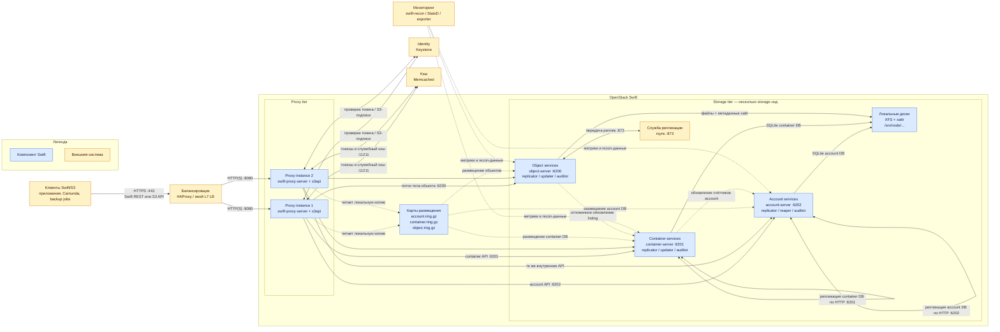

# OpenStack Swift 2.37.3 — назначение и архитектура

OpenStack Swift — объектное хранилище: кладёте файл по имени в контейнер (бакет). Этот документ про **свою установку** версии **2.37.3**, серия OpenStack **2026.1 (Gazpacho)**. Проверено **26 августа 2026**: в релиз-нотах серии 2026.1 это последний номер линейки. **2.38.x** в current/unreleased — ещё не стабильная серия, в бой не берём. Это не Amazon S3, не MinIO, не Ceph RGW и не Swift 2.29.2 из инсталлятора GeoData.

Документация: https://docs.openstack.org/swift/2026.1/  
Архитектура: https://docs.openstack.org/swift/2026.1/overview_architecture.html  
Развёртывание: https://docs.openstack.org/swift/2026.1/deployment_guide.html  
S3 API (middleware `s3api`): https://docs.openstack.org/swift/2026.1/middleware.html  
Матрица совместимости S3: https://docs.openstack.org/swift/2026.1/s3_compat.html

Лицензия исходников Swift — **Apache 2.0**. Отдельного license-server нет.

В документе по GeoData инсталлятор вендора фиксирует **Swift 2.29.2** и пример колец в **одном** region/zone. Этот файл — про **платформенный** Swift 2.37.3 как S3-хранилище. Склеивать его с GeoData «потому что оба Swift» без письма вендора нельзя.

Этот документ описывает назначение, функции, состав и потоки данных. Пошаговая установка вынесена в `OpenStack Swift.install.md`.

---

## Назначение системы

Swift нужен, чтобы **класть большие и долгоживущие файлы** (вложения интеграций, снимки, бэкапы индексов, выгрузки), не раздувая СУБД и не делая Kafka диском.

Карточки клиентов живут в СУБД/витрине. События везёт Kafka. Процессы ведёт Camunda. Интеграционное API ходит наружу. Swift — **объектный слой**: «положи и забери файл по ключу», а не «дай клиента по ИНН и поправь ФИО».

S3 API включаете middleware `s3api` на **тех же** proxy. Это эмуляция, не AWS. Клиенты с Lifecycle-правилами, тегами и bucket policy **сломаются**.

---

## Перечень функций

Что умеет self-hosted Swift 2.37.3 с включённым S3 API:

1. **Класть и читать объекты** родным REST (`/v1/{account}/{container}/{object}`) и, если включили `s3api`, запросами «как Amazon S3».
2. **Держать несколько копий** каждой части пространства имён по карте размещения (кольцо). Рекомендация вендора: **3 копии** — «это единственное значение, которое тестировали». 3 копии ≈ диск ×3 относительно «один экземпляр файла».
3. **Маршрутизировать запросы stateless proxy:** смотрит в кольцо, стримит данные, не складывает объект целиком на диск proxy. Несколько proxy за балансировщиком — штатный вход.
4. **Хранить файлы на object-серверах**, списки объектов — на container-серверах (SQLite), списки контейнеров — на account-серверах. Клиенту внутренние серверы **не** нужны; proxy ходит к ним сам.
5. **Догонять копии фоном** (replicator, часто через rsync), догонять списки (updater), искать битый файл (auditor). Для erasure coding восстановление идёт другим путём (reconstructor).
6. **Откладывать запись на запасной диск (handoff)**, если основное место из кольца недоступно. Потом replicator догонит «правильное» место. Успех клиенту завязан на **большинство** успешных записей на бэкенд (для 3 копий это **2**). Эту цифру вендор в Deployment Guide отдельной главой не печает — печает «ставьте 3 replica».
7. **Резать большие объекты кусками.** По умолчанию один PUT ≤ **5 ГБ**; больше — сегменты + манифест (SLO). Для полной заявленной S3-совместимости multipart в конвейере proxy должен быть **slo**.
8. **Проверять S3-подпись** через Keystone (`s3token`) в бою. Встроенные учётки в конфиге (`tempauth`) — лаборатория, не identity боя.
9. **Шифровать тело объекта at-rest** опцией middleware (ключ в конфиге или внешний KMS). Шифруется тело, ETag ненулевых объектов, **значения** пользовательских метаданных. **Не** шифруются имена account/container/object, имена метаданных, Content-Type, размер. Это защита от чтения **унесённого диска**, не от того, кто сел на внутреннюю сеть Swift.
10. **Снимать телеметрию** (`swift-recon`): кольца, время репликации, карантин, отложенные обновления.

Чего система **не** делает и часто путают: она не полный AWS S3 (нет bucket lifecycle как в AWS, bucket policy, object tagging, notifications, website hosting, billing, inventory). Не транзакционный эталон карточек, не шина событий, не поиск по содержимому, не BPMN. Кворума метаданных как у etcd нет. RAID 5/6 вендор **не требует и не рекомендует**. Официального оператора «как у OpenSearch» нет. Kolla-Ansible **убрал** роль Swift с 2025.1. Копии бэкап не заменяют: `DELETE` уедет на все три.

---

## Основные элементы системы и зависимости

Swift — одно программное решение из нескольких специализированных сервисов. Proxy, account, container и object services нельзя считать взаимозаменяемыми: у них разные данные и роли. Keystone, балансировщик, Memcached, клиенты и система метрик — отдельные внешние системы.

### Схема инстансов и потоков

Жёлтые блоки — системы вне Swift. Синие — компоненты или инфраструктурные части контура Swift. Сплошная стрелка показывает сетевой запрос или перенос данных, пунктир — чтение карты, отложенное обновление либо сбор наблюдаемости. Петли account и container services означают обмен между несколькими экземплярами одного типа, а не вызов процессом самого себя.

### Как читать схему

#### Запись объекта

1. Клиент отправляет `PUT` по Swift REST API или S3 API на HTTPS-адрес балансировщика. Балансировщик выбирает один из независимых proxy-инстансов и передаёт запрос на порт **8080**.
2. Proxy обрабатывает API и middleware. Для S3 запрос сначала разбирает `s3api`; проверка S3-подписи в боевой схеме связана с внешним Keystone через `s3token`. **Keystone не входит в Swift:** это отдельная identity-система. Memcached также внешний и хранит токены и служебный кэш, но не тела объектов.
3. Proxy хеширует путь account/container/object и по трём разным кольцам определяет backend-устройства. Account ring относится только к account service, container ring — к container service, object ring или ring политики хранения — к object service.
4. Тело объекта proxy потоково отправляет object services на **6200/TCP**. Object service пишет байты в файл на локальном диске и сохраняет служебные метаданные в `xattr`.
5. Container service на **6201/TCP** обновляет SQLite-базу со списком объектов контейнера. Account service на **6202/TCP** обновляет SQLite-базу со списком контейнеров аккаунта. Это метаданные пространства имён, а не дополнительные копии тела объекта.
6. Если синхронное обновление listing не прошло, updater повторит его фоном. Replicator сравнивает и догоняет копии; для object service передача обычно идёт через rsync на **873/TCP**.

#### Чтение объекта

1. `GET` проходит тот же путь через балансировщик, proxy, аутентификацию и object ring.
2. Proxy выбирает доступную копию, получает тело от object service по **6200/TCP** и потоково возвращает клиенту. Account и container services не передают тело файла; они нужны для операций со списками и их метаданными.
3. Для запроса списка контейнеров proxy обращается к account service. Для списка объектов в контейнере — к container service. Поэтому успешный `GET` объекта и временно отстающий listing не противоречат друг другу.

#### Фоновые потоки

- **Replicator** обеспечивает сходимость реплик account-, container- и object-данных; он не принимает клиентский API.
- **Updater** доставляет отложенные обновления счётчиков и listing между уровнями object → container → account.
- **Auditor** проверяет целостность данных и помещает повреждённые элементы в карантин.
- **Reaper** удаляет данные аккаунта после подтверждённого удаления аккаунта; это фоновый процесс account service.
- Система мониторинга читает recon-данные и метрики. Она наблюдает Swift, но не участвует в пути `PUT`/`GET`.

### Описание блоков

#### Клиенты Swift/S3

- **Что это:** приложения платформы, Camunda-задачи, сервисы резервного копирования или администраторские клиенты.
- **Технологии и варианты:** Swift REST-клиент; AWS SDK, boto3 или другой S3-клиент при включённом `s3api`; multipart-загрузка через SLO для больших объектов.
- **Назначение:** создавать, читать, перечислять и удалять объекты и контейнеры в пределах поддержанной матрицы API.
- **Принадлежность:** отдельные внешние системы, не часть Swift.

#### Балансировщик

- **Что это:** единая клиентская точка входа перед несколькими proxy-инстансами.
- **Технологии и варианты:** HAProxy либо иной L4/L7-балансировщик; TLS может завершаться здесь или на proxy.
- **Назначение:** принимать HTTPS на **443/TCP**, проверять доступность proxy и распределять запросы на **8080/TCP**.
- **Принадлежность:** отдельная внешняя система, не часть Swift.

#### Proxy instances

- **Что это:** процессы `swift-proxy-server`; каждый proxy stateless относительно тел объектов.
- **Технологии и варианты:** WSGI-конвейер с middleware `s3api`, `slo`, `bulk`, а для Keystone — `authtoken`, `s3token`, `keystoneauth`; нативный Swift API и S3 API работают на тех же proxy.
- **Назначение:** единственный клиентский API Swift, аутентификация и авторизация через middleware, выбор backend по кольцам, потоковая передача данных, сбор ответов от storage services.
- **Принадлежность:** часть Swift. Proxy не является ни account-, ни container-, ни object-service и не хранит постоянную копию тела объекта.

#### Identity / Keystone

- **Что это:** служба идентификации пользователей, проектов, токенов и EC2 credentials для S3.
- **Технологии и варианты:** OpenStack Keystone в бою; `tempauth` возможен как встроенный упрощённый middleware изолированного стенда, но это не внешний Keystone.
- **Назначение:** подтвердить identity и права; при S3 proxy использует `s3token` для проверки подписи через Keystone.
- **Принадлежность:** Keystone — отдельная внешняя система. Middleware `keystoneauth`, `authtoken` и `s3token` исполняются в proxy Swift, но не превращают Keystone в компонент Swift.

#### Memcached

- **Что это:** распределённый кэш в памяти.
- **Технологии и варианты:** Memcached по **11211/TCP**; обычно несколько доступных экземпляров.
- **Назначение:** кэш токенов и служебных результатов, снижение повторных обращений к identity. Тела объектов в нём не хранятся.
- **Принадлежность:** отдельная внешняя система.

#### Карты размещения — rings

- **Что это:** отдельные файлы `account.ring.gz`, `container.ring.gz` и `object.ring.gz` либо object ring для каждой политики хранения.
- **Технологии и варианты:** согласованное хеширование, партиции, replica-политика или erasure coding; рабочие `.ring.gz` строятся из административных `.builder`.
- **Назначение:** детерминированно сопоставить account, container или object с конкретными устройствами и тем самым исключить центральный каталог размещения.
- **Принадлежность:** часть Swift. Одинаковые версии нужных колец должны быть доступны proxy и соответствующим storage services.

#### Account services

- **Что это:** `account-server` на **6202/TCP** и связанные фоновые процессы `account-replicator`, `account-auditor`, `account-reaper`.
- **Технологии и варианты:** SQLite-базы account на локальных дисках; репликация баз между storage-нодами.
- **Назначение:** хранить список контейнеров аккаунта, их счётчики и метаданные аккаунта. Account service не хранит список объектов и не передаёт тело объекта.
- **Принадлежность:** часть Swift, отдельный тип storage service.

#### Container services

- **Что это:** `container-server` на **6201/TCP** и процессы `container-replicator`, `container-updater`, `container-auditor`; для крупных контейнеров применяется sharding.
- **Технологии и варианты:** SQLite-базы container, container ring, фоновые broker-операции и шарды.
- **Назначение:** хранить listing объектов конкретного контейнера, счётчики и метаданные контейнера. Container service не хранит байты объектов и не заменяет account service.
- **Принадлежность:** часть Swift, отдельный тип storage service.

#### Object services

- **Что это:** `object-server` на **6200/TCP** и процессы `object-replicator`, `object-updater`, `object-auditor`; для erasure coding вместо replicator используется `object-reconstructor`.
- **Технологии и варианты:** файлы на локальной файловой системе, метаданные в `xattr`, replica storage policy или erasure coding, SLO-манифесты для составных больших объектов.
- **Назначение:** хранить тело объекта и его файловые метаданные, отдавать доступную копию proxy, восстанавливать размещение и передавать отложенные обновления в container service.
- **Принадлежность:** часть Swift, отдельный тип storage service. Только этот уровень хранит байты пользовательского объекта.

#### Локальные диски

- **Что это:** устройства storage-нод, представленные точками монтирования `/srv/node/...`.
- **Технологии и варианты:** XFS с extended attributes; несколько устройств и storage policies.
- **Назначение:** постоянное хранение object-файлов, SQLite-баз account/container и служебных данных.
- **Принадлежность:** инфраструктурный ресурс кластера Swift, не самостоятельный сетевой сервис.

#### Служба репликации / rsync

- **Что это:** транспорт, через который object-replicator передаёт данные между storage-нодами.
- **Технологии и варианты:** демон rsync на **873/TCP** для object-реплик. Account и container replicators не используют этот поток: они обмениваются SQLite-базами по HTTP через внутренние replication endpoints своих сервисов на **6202/TCP** и **6201/TCP** соответственно.
- **Назначение:** фоновое восстановление требуемого размещения после отказов, handoff-записей или изменения кольца.
- **Принадлежность:** rsync — отдельное системное ПО, используемое внутренними процессами Swift; replicator — часть Swift.

#### Мониторинг

- **Что это:** средства получения состояния и метрик кластера.
- **Технологии и варианты:** `swift-recon`, StatsD, Prometheus exporter и внешняя система мониторинга.
- **Назначение:** видеть заполнение дисков, длительность репликации, карантин, отложенные обновления и ответы proxy.
- **Принадлежность:** `swift-recon` и публикация StatsD-метрик относятся к Swift; хранилище и визуализация метрик — отдельные системы.

### Состав Swift и внешние зависимости

**В Swift входят:** proxy service и его middleware; account, container и object services; их replicator/updater/auditor/reaper/reconstructor; кольца и инструменты управления ими; recon-интерфейс.

**Не входят в Swift:** клиентские приложения, HAProxy или другой балансировщик, Keystone, Memcached, rsync как системная программа, PKI, Barbican/KMIP и внешняя система мониторинга. Они могут быть обязательными или рекомендуемыми для выбранной архитектуры, но остаются отдельными продуктами.

### Официальные порты (менять можно, это контракт сети)

В sample-конфигах проекта и в примерах Deployment Guide:

| Порт | Назначение |
|---|---|
| **8080/TCP** | Proxy: клиентский Swift API и (если включили) S3 API |
| **6200/TCP** | Object server (в примере «старого» кольца все диски ноды на одном порту; вариант `servers_per_port` — **свой порт на диск**) |
| **6201/TCP** | Container server |
| **6202/TCP** | Account server |
| **873/TCP** | rsync (репликация объектов) |
| **11211/TCP** | Memcached (не Swift, но proxy без него в типичной схеме не аутентифицирует) |

SAIO на одной машине поднимает **несколько** object/container/account на портах вроде 6210/6220/… — это лабораторная схема «много процессов на localhost», не боевые номера.

## Глоссарий

- **API (Application Programming Interface)** — договор о формате запросов и ответов между программами.
- **Account** — верхний уровень пространства имён Swift; содержит контейнеры и обычно соответствует проекту/tenant в модели доступа.
- **Account database / broker** — SQLite-база со списком контейнеров, счётчиками и метаданными account.
- **Account service** — отдельный тип Swift storage service, который обслуживает account database; не identity и не пользовательская учётная запись Keystone.
- **At-rest encryption** — шифрование данных в постоянном хранилище, в отличие от шифрования сетевого канала.
- **Authentication / аутентификация** — проверка, кем является клиент; authorization / авторизация — проверка, что ему разрешено.
- **Auditor** — фоновый процесс проверки целостности account-, container- или object-данных.
- **Backend** — внутренний сервис хранения, к которому proxy обращается после выбора размещения.
- **Backup job** — внешнее задание резервного копирования, которое записывает или читает объекты через API.
- **Bucket** — термин S3; в `s3api` отображается на Swift container.
- **Content-Type** — HTTP-метаданные о формате содержимого объекта.
- **Container** — логическая коллекция объектов внутри account.
- **Container database / broker** — SQLite-база со списком объектов, счётчиками и метаданными container.
- **Container service** — отдельный тип Swift storage service для listing объектов; байты объектов не хранит.
- **EC2 credentials** — пара access key/secret key в Keystone, применяемая для S3-подписи.
- **Endpoint** — сетевой адрес API.
- **Erasure coding (EC)** — политика хранения, разбивающая данные на фрагменты данных и чётности; восстановлением занимается reconstructor.
- **ETag** — идентификатор содержимого объекта, обычно используемый клиентом для проверки версии или целостности.
- **Extended attributes (`xattr`)** — дополнительные атрибуты файла в файловой системе, где object service хранит метаданные Swift.
- **GET / PUT / DELETE** — HTTP-методы чтения, записи и удаления ресурса.
- **Handoff** — временное размещение записи на запасном устройстве, когда основное устройство из кольца недоступно.
- **HTTP / HTTPS** — протокол прикладных запросов и его защищённый TLS-вариант.
- **Identity** — внешняя функция установления пользователя/сервиса и его полномочий; в боевой схеме её предоставляет Keystone.
- **KMS (Key Management System)** — внешняя система хранения и выдачи криптографических ключей; возможные варианты интеграции — Barbican или KMIP.
- **L4/L7-балансировщик** — балансировщик транспортного уровня либо уровня HTTP-приложения.
- **Listing** — результат перечисления контейнеров account либо объектов container.
- **Manifest / SLO** — служебный объект, описывающий сегменты Static Large Object.
- **Metadata / метаданные** — служебные свойства account, container или object, не являющиеся телом объекта.
- **Middleware** — компонент WSGI-конвейера proxy, который обрабатывает запрос до или после основного proxy-приложения.
- **Multipart upload** — S3-механизм загрузки объекта частями; в Swift `s3api` опирается на SLO.
- **Object** — пользовательские байты, адресуемые именем внутри container.
- **Object service** — отдельный тип Swift storage service, который хранит и отдаёт тела объектов и файловые метаданные.
- **Partition** — логическая часть хеш-пространства, которую кольцо назначает устройствам.
- **Proxy service** — клиентский API и координатор Swift; выбирает storage services по кольцам и потоково передаёт данные.
- **Reaper** — фоновый процесс окончательного удаления данных удалённого account.
- **Reconstructor** — фоновый процесс восстановления EC-фрагментов; аналог роли replicator для erasure coding.
- **Replica** — полная копия данных; рекомендуемая проектом replica-политика использует три копии.
- **Replicator** — фоновый процесс, который сравнивает размещение и приводит реплики к состоянию, заданному кольцом.
- **Ring / кольцо** — локальная карта «партиция → устройства», рассчитанная отдельно для account, container и каждой object storage policy.
- **rsync** — отдельная системная программа и сетевой протокол, используемые при фоновой передаче реплик.
- **S3 signature / S3-подпись** — криптографическая подпись HTTP-запроса с использованием access key и secret key.
- **S3 API** — HTTP API, совместимый с поддержанным подмножеством Amazon S3; в Swift реализован middleware `s3api`.
- **SAIO** — Swift All In One, учебная конфигурация нескольких сервисов Swift на одной машине.
- **Sharding** — разделение крупной container database на несколько shard-контейнеров.
- **SLO (Static Large Object)** — механизм Swift для представления большого объекта набором сегментов и манифестом.
- **Stateless proxy** — proxy без постоянного локального состояния пользовательских объектов; инстанс можно заменить без переноса тел объектов.
- **Storage node** — узел с дисками, на котором работают account, container и/или object services.
- **Storage policy** — правила хранения объектов container: replica либо erasure coding и соответствующее object ring.
- **TCP port / TCP-порт** — номер сетевой точки приёма соединений конкретным сервисом.
- **TLS (Transport Layer Security)** — защита сетевого канала шифрованием и проверкой сертификата.
- **Swift REST API** — нативный HTTP API Swift с путём вида `/v1/{account}/{container}/{object}`.
- **Tempauth** — упрощённый middleware аутентификации Swift для изолированного стенда; не внешний identity-сервис.
- **Tombstone** — маркер удаления объекта, который реплицируется и предотвращает возврат старой копии.
- **Updater** — фоновый процесс доставки отложенных обновлений listing и счётчиков.
- **WSGI pipeline** — последовательность proxy middleware и приложения, через которую проходит HTTP-запрос.
- **XFS** — Linux-файловая система, используемая storage-узлами Swift и поддерживающая нужные extended attributes.
- **Zone** — домен отказа внутри region, учитываемый кольцом при размещении копий.

## Источники (чтобы не принимать на веру)

- Релиз-ноты 2.37.3 / серия 2026.1 (CVE и S3-правки): https://docs.openstack.org/releasenotes/swift/2026.1.html
- Нестабильная 2.38.x: https://docs.openstack.org/releasenotes/swift/current.html
- Архитектура (proxy, ring, replica по умолчанию 3, политики, replicator, updater, auditor): https://docs.openstack.org/swift/2026.1/overview_architecture.html
- Deployment Guide (не RAID, HA = несколько proxy + LB, part_power, replica=3 как единственное протестированное, ≥5 zone как оптимум тестов, min_part_hours, weight, порты 6200 в примере, memcached, права на `/srv/node`): https://docs.openstack.org/swift/2026.1/deployment_guide.html
- Global Clusters (`read_affinity` / `write_affinity`, default = один region с низкой задержкой): https://docs.openstack.org/swift/2026.1/overview_global_cluster.html
- SAIO (XFS, memcached, rsync, 8080, tempauth, s3api): https://docs.openstack.org/swift/2026.1/development_saio.html
- s3api / s3token / pipeline: https://docs.openstack.org/swift/2026.1/middleware.html
- Матрица S3 (что Yes/No): https://docs.openstack.org/swift/2026.1/s3_compat.html
- Шифрование at-rest (что шифруется / что нет): https://docs.openstack.org/swift/2026.1/overview_encryption.html
- Большие объекты, дефолт 5 ГБ, SLO: https://docs.openstack.org/swift/2026.1/overview_large_objects.html
- Ограничения API (5 ГБ, длины имён): https://docs.openstack.org/swift/2026.1/api/object_api_v1_overview.html
- Мониторинг recon / StatsD: https://docs.openstack.org/swift/2026.1/admin/objectstorage-monitoring.html
- Снятие Swift из Kolla-Ansible: https://docs.openstack.org/releasenotes/kolla-ansible/2025.1.html
- OpenStack-Helm, матрица Kubernetes: https://docs.openstack.org/openstack-helm/latest/readme.html

Утверждения вида «Swift переживёт два дата-центра» или «N миллисекунд — можно размазать кольцо» в документации проекта **отсутствуют** — поэтому в этом файле их нет. Задержку на storage/rsync надо измерить у себя.
