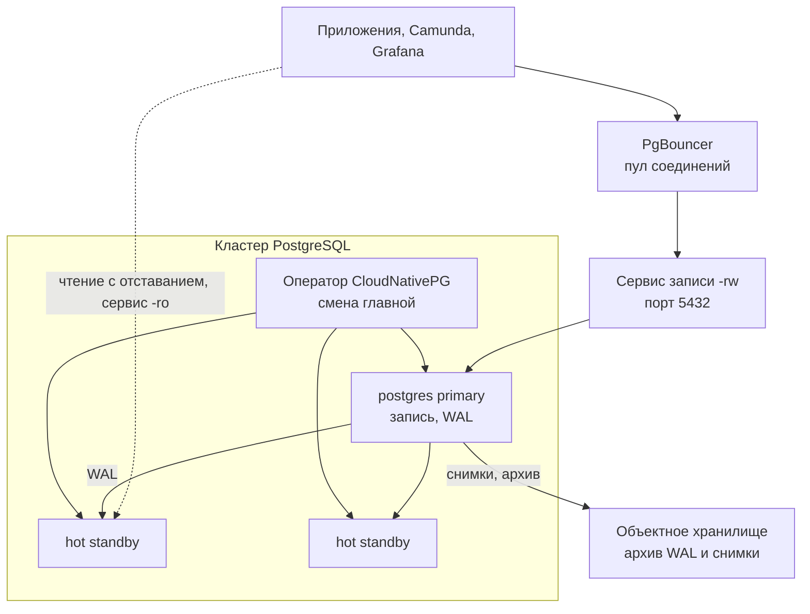

# PostgreSQL 18.6 — развёртывание и настройка

PostgreSQL — реляционная СУБД: таблицы, транзакции, внешние ключи, точка восстановления на момент времени. Этот документ про **свою установку** community-версии **18.6** (релиз 13 августа 2026; на дату подготовки — последний стабильный патч линии **18**). Одновременно вышли 17.11, 16.15, 15.19, 14.24 и **19 Beta 3**. В бой **не** берём бету. Релиз 18.6 закрывает **28 CVE** (в том числе несколько с CVSS 8.8) и 110+ багов; линейка **пропустила 18.5** из‑за регрессии. Оставаться на **18.4** (заводской образ оператора, см. ниже) нельзя: это не «почти то же». Это не Postgres Pro Enterprise, не EDB, не Citus и не Patroni как отдельный продукт.

Документация линейки: https://www.postgresql.org/docs/18/  
Релиз 18.6: https://www.postgresql.org/about/news/postgresql-186-1711-1615-1519-1424-and-19-beta-3-released-3365/  
Официальный Docker-образ (стенд): `postgres:18.6` (теги `18.6`, `18`, `latest` на эту дату указывают на этот патч).  
Лицензия PostgreSQL — своя (BSD-подобная).

На Kubernetes целевой путь: оператор **CloudNativePG 1.30.0** (релиз 29 июня 2026; Apache-2.0).  
Матрица 1.30.0: Kubernetes **1.36 / 1.35 / 1.34**, PostgreSQL **18–14**, заводской образ оператора — **18.4**. Образ кластера **пинить на 18.6** явно (`ghcr.io/cloudnative-pg/postgresql`, тег вида `18.6-…-trixie`, не `latest`).  
Установка оператора: манифест `cnpg-1.30.0.yaml` из ветки `release-1.30`.  
EOL PostgreSQL **14** — **12 ноября 2026**. EOL линии 18 по политике PGDG — **14 ноября 2030**.  
Встроенный Barman Cloud в операторе **устарел**, снятие обещано в **CNPG 1.31.0**. Для боя — плагин Barman Cloud, не встроенный путь.

Этот текст — не набор команд «скопируй и запусти», а правила, без которых экземпляр не будет одновременно устойчивым к сбоям, масштабируемым и безопасным. Пошаговая установка — в `PostgreSQL.install.md`.

---

## Назначение системы

PostgreSQL нужен, чтобы **хранить текущую правду** «этот клиент, эти реквизиты, этот статус»: транзакция, ограничения, точка восстановления. Сервисы меняют строки с `COMMIT`. Это не лог событий и не кэш.

События везёт Kafka. Кэш отвечает быстро. Camunda ведёт процесс. Интеграционное API ходит наружу. PostgreSQL — **транзакционный слой**: «прочитай карточку по ключу и поправь её атомарно», а не «собери истину из лога».

Если эталон задуман как **файловое озеро** (сырые выгрузки, вложения) — PostgreSQL его не заменяет; он хранит **карточку**, файлы — в объектном хранилище. Тяжёлая аналитика по большим сканам — ClickHouse, не этот primary.

---

## Перечень функций

Что умеет community PostgreSQL 18:

1. **Выполнять SQL** с транзакциями, внешними ключами, ограничениями, схемами и несколькими базами на одном каталоге данных.
2. **Писать журнал WAL** до изменения страниц: crash recovery, копирование на запасную машину и восстановление на момент времени живут им.
3. **Копировать весь инстанс** потоковой репликацией: запасная копия непрерывно получает WAL. Писать в неё штатно нельзя; читать можно (с отставанием).
4. **Ждать подтверждения копии** при `COMMIT`, если включили синхронную репликацию. Завод: синхронных копий **нет**. Пока список пуст, `COMMIT` ждёт только **локальный** сброс на диск.
5. **Поднимать запасную копию в главную** — но **сам** PostgreSQL автосмену не делает. Нужен оператор (CloudNativePG) или Patroni.
6. **Бронировать WAL слотом**, чтобы главная не удалила ещё не прочитанный журнал. Без слота отставшую копию клонируют заново.
7. **Копировать отдельные таблицы** логической репликацией (публикация/подписка). Это не замена отказоустойчивости. DDL, последовательности, крупные объекты — с оговорками.
8. **Пулить соединения** через PgBouncer перед сервером: много клиентов делят мало сессий на стороне базы.
9. **Убирать мёртвые версии строк** фоном (autovacuum). Без него таблицы раздуваются, потом кластер может остановить запись из‑за оборота номеров транзакций.
10. **Восстанавливаться на момент времени** из базового снимка + архива WAL. Без архива есть только «снимок на вчера».
11. **Разграничивать доступ:** список `pg_hba.conf` (с какого адреса, в какую базу, каким методом), роли, GRANT, при необходимости ограничение строк. Пароли — SCRAM-SHA-256 (завод с версии 14). **MD5 в 18 устарел**, будет снят в будущем мажоре. TLS на канале завод **выключен**.
12. **Ставить расширения** в этот инстанс (`pg_stat_statements`, `pgcrypto`, PostGIS, …). Совместимость и обновление — отдельный риск.

Чего система **не** делает и часто путают: она не шина событий, не in-memory кэш, не колоночный склад, не мультимастер на три площадки. Горизонтали записи из коробки нет: партиции внутри одной базы помогают уборке, не добавляют второго писателя. Автосмену главного «из коробки» процесс `postgres` не делает.

---

## Требования к развёртыванию

### Требования к ПО

| Что | Что ставить | Комментарий |
|---|---|---|
| **Формат поставки** | Контейнеры Docker **или** поды Kubernetes | Стенд: `postgres:18.6`. Бой: образы оператора `ghcr.io/cloudnative-pg/postgresql` с тегом линии **18.6**, не `postgres:18.6` как есть (оператор подменяет точку входа своим instance manager). |
| **Kubernetes** | Оператор CloudNativePG **1.30.0** | Матрица: Kubernetes **1.36 / 1.35 / 1.34**. Объект `Cluster`. Patroni на тот же датасет **не** ставят — это два разных способа автосмены. Альтернатива VM+Patroni допустима; правила журнала и доступа те же, отличается упаковка. |
| **ОС** | Linux | Это основной контур Kubernetes. **Боевой PostgreSQL на Windows-хосте в схеме с CNPG не предполагается.** |
| **Диск** | Локальный быстрый том (SSD/NVMe) под каталог данных | **Не NFS как единственный диск главной.** Оператор прямо рекомендует репликацию на уровне приложения и **не** рекомендует полагаться на репликацию СХД «вместо» запасной копии. |
| **Бэкап** | S3-совместимое хранилище + плагин Barman Cloud | Встроенный Barman Cloud в операторе устарел, снятие обещано в 1.31.0. Копии узлов бэкап не заменяют. |
| **Сертификаты** | Корпоративный PKI для боя | Оператор по умолчанию закрывает потоковое копирование сертификатами. Самоподписанные — только стенд. |
| **Лицензия** | PostgreSQL License + Apache-2.0 у CNPG | Это не SSPL. |

### Требования к ресурсам

Цифр «сколько ядер на ваши терабайты» у проекта **нет** — нагрузки в исходном запросе не было. Ниже заводские ориентиры, не смета закупки.

| Роль | CPU | RAM | Диск |
|---|---|---|---|
| **Инстанс PostgreSQL** | Один primary = потолок записи. Параллелизм SELECT — отдельные воркеры; запись часто упирается в WAL и индексы, не в «добавим копии» | Кэш страниц внутри PostgreSQL (`shared_buffers`) завод обычно **128 МБ** — для боя этого мало. Остальное — кэш ОС. Плюс `work_mem` × сессии + autovacuum. Потолок сессий завод обычно **100**; каждая сессия — процесс. Раздуть до тысяч «потому что микросервисы» = кончится RAM задолго до запросов в секунду | Каталог данных + WAL. Каждая запасная копия ест **полный** размер. В учебном манифесте оператора встречается том **10 ГиБ**; в боевом примере — заглушка **100 ГиБ**. Это не расчёт вашей нагрузки |
| **Учебный один контейнер** | Минимальные | Заводской `shared_buffers` допустим | Можно маленький том; на бою так нельзя |

Дополнительно:

- Лимит памяти контейнера без запаса → нехватка памяти в VACUUM или отчёте, не «в простой SELECT».
- В Kubernetes том не умеют уменьшить — размер сразу с запасом.
- Нагрузки нет — поэтому **нет** цифры «N CPU и M ТБ».

---

## Основные элементы системы и зависимости

Это одно ПО из **нескольких процессов**. Ниже — те, что живут отдельными инстансами, и как они вызывают друг друга.

### Схема инстансов и потоков



Как читать схему:

1. Клиенты пишут **только на главную** (в операторе — DNS сервиса `-rw`, порт **5432**). Чтение с отставанием — сервис `-ro`. «Любой инстанс» для записи **нельзя**: копия отклонит изменение. Балансировщик «как у HTTP на все 5432» без разделения записи/чтения **ломает** модель.
2. **Primary** принимает запись и пишет WAL. **Hot standby** непрерывно получает этот журнал. Падение главной при живом операторе → повышение наиболее свежей копии, сервис `-rw` переезжает.
3. Отдельного «порта репликации» нет: копирование идёт по тому же **5432**. TLS — тот же порт, если включили `ssl`.
4. **Оператор** делает то, чего нет в самом PostgreSQL: автосмену главной внутри **одного** Kubernetes. Между разными Kubernetes оператор автосмену **не** делает.
5. Снимки и архив WAL уезжают в объектное хранилище. Копия спасает от падения **машины**, не от `DROP TABLE`.

Рядом, но это уже другое ПО: CloudNativePG, PgBouncer (в операторе — объект `Pooler`), плагин Barman Cloud, CSI-диски, Prometheus postgres-exporter. Их отказ проектируется отдельно.

### Что входит в состав

| Компонент | Зачем | Как масштабируется |
|---|---|---|
| **Primary** | Запись, DDL, источник WAL | **Вертикаль** CPU/RAM/диск. Горизонтали записи нет |
| **Hot standby** | Отказоустойчивость и чтение с лагом | Чтение горизонтально (лаг и конфликты с накатом журнала). Запись всё равно в primary |
| **WAL / archive** | Crash recovery, репликация, точка во времени | Архив — на объектное хранилище. Это не «ещё одна replica» |
| **Клиенты** | `libpq`, JDBC, микросервисы, Camunda, Grafana | Пул **в приложении** + PgBouncer. Не `max_connections=5000` |
| **Расширения** | `pg_stat_statements`, `pgcrypto`, PostGIS, … | Ставятся **в этот** инстанс |
| **Утилиты** | `psql`, `pg_dump`/`pg_restore`, `pg_basebackup`, `pg_rewind`, `pg_upgrade` | Операционка, не runtime |

### Официальные порты (менять можно, это контракт сети)

| Порт | Назначение |
|---|---|
| **5432/TCP** | Клиенты, репликация, `psql`. TLS — тот же порт, если `ssl=on` |
| Unix-сокет | Локальные подключения на той же машине/поде. В Docker/Kubernetes приложения почти всегда ходят в TCP |

UDP нет. Клиенты записи — только сервис `-rw`. Копию для записи не использовать.

### Зависимости окружения

- Стабильный DNS сервиса `-rw`, не IP пода в JDBC навсегда.
- В Kubernetes том на каждый инстанс, класс диска с предсказуемым fsync. `emptyDir` как каталог данных = потеря при рестарте.
- Идентификация: отдельная роль на сервис, без суперпользователя. Суперпользователь может читать файлы ОС и запускать программы из сессии.
- Клиенты переживают смену главной: короткий timeout, reconnect, не прилипание к IP пода.

---

## Краткие вводные

### Как устроена отказоустойчивость

Это **один писатель** плюс копии WAL плюс **оператор, который повышает копию**. Три контейнера без оператора — это надежда и ручной `promote`.

**1) Репликация сама по себе смену главной не делает**

| Что падает | Что происходит |
|---|---|
| Primary, копия есть, **нет** оператора | Копия содержит данные (с лагом, если копирование асинхронное). Клиенты на старый адрес **стоят**. Кто-то должен повысить копию руками |
| Replica | Чтение с неё пропадает; запись на primary жива |
| Primary без архива WAL и без слота, копия отстала | Копия может стать бесполезной; нужен новый полный клон |
| `DROP DATABASE` / плохая миграция на primary | Успешно уедет на **все** копии |

**2) Синхронная vs асинхронная**

Пока список синхронных копий пуст, `COMMIT` ждёт только локальный сброс. «Поставили две replica» ≠ «подтверждённая запись уже на второй машине».

Если включили sync: `COMMIT` ждёт копию. Документация PostgreSQL прямо: транзакция **может не завершиться никогда**, если sync-копия упала и её некому заменить. Это цена «не потерять уже подтверждённый COMMIT».

В операторе sync **выключен, пока не задан**. Типичный бой для 3 инстансов: ждать **любую одну** живую копию; если живых sync-копий нет — **запись стоит** (`dataDurability: required`). Вариант «писать всё равно» (`preferred`) даёт окно потери — это **явный** выбор, не завод новой API.

**3) Оператор внутри одного Kubernetes**

| Что падает | Что происходит |
|---|---|
| Под primary, копии живы, оператор жив | Повышение наиболее свежей копии, сервис `-rw` переезжает |
| Нет живой копии и включено «запись только с подтверждением» | Запись стоит. Это защита, не баг |
| Три изолированных Kubernetes | Оператор **не** переносит primary в чужой кластер. Это отдельная копия-кластер + **ручное** переключение |

**4) Бэкап**

Копии не заменяют снимок + **непрерывный** архив WAL. Проверяют **восстановление**, не наличие файла в бакете.

### Как устроено масштабирование

Несколько независимых осей (их нельзя путать):

1. **Больше данных** → диск primary (и каждой копии: полный размер), партиции, архив старого в озеро. Копия **не** уменьшает объём.
2. **Больше чтения** → hot standby + приложения на `-ro` (лаг). Аналитику лучше **не** на OLTP-primary.
3. **Больше записи** → вертикаль primary, меньше лишних индексов, пакеты вместо построчной вставки, разнести **разные** домены по **разным** кластерам (эталон ≠ Grafana). Второй писатель community PostgreSQL не появится.
4. **Больше соединений** → PgBouncer, не раздувание потолка сессий.
5. **Терабайты** → возможны на одном primary при дисциплине vacuum, партиций, архива. Это не доказательство, что **ваш** профиль влезет.

Асинхронный I/O PostgreSQL 18 включать **по замеру** на вашем ядре/диске, не «потому что мажор 18». `fsync` **не** выключать «для скорости».

### Безопасность самого PostgreSQL

Компрометация эталона клиентов = компрометация **содержимого**, не «только схема». Суперпользователь в приложении = чтение файлов и запуск программ из сессии (в 18.6 как раз пачка CVE вокруг расширений).

Завод слушает **localhost**. Образы Docker/Kubernetes почти всегда слушают все интерфейсы — значит список доступа, пароль, TLS и сетевая политика **обязательны**.

- Пароли: SCRAM-SHA-256; MD5 не целевой метод.
- Канал: TLS (`ssl=on`, в списке доступа — только TLS). SCRAM не шифрует **трафик запросов и строк** — только обмен паролем. Строки карточек по городу без TLS — отдельное принятие риска ИБ.
- Не метод `trust` с не-loopback.
- Приложение — не суперпользователь; отдельная база; `CONNECT` + права на схему.
- Расширения ставить сознательно: лишние модули = поверхность атаки, как в 18.6.
- At-rest: шифрование тома. В community нет «галочки encrypt tablespace» как полной замены диску.
- В 18 есть OAuth-аутентификация как опция сервера. Это не завод оператора и не замена ролей на объекты.

«Поднять `docker run -e POSTGRES_HOST_AUTH_METHOD=trust -p 5432:5432 postgres`» — учебный антипаттерн, не платформа.

---

## Допущения

Ниже то, чего не было в исходном запросе, но без чего нельзя нарисовать конкретную схему. Если допущение неверно — схему надо пересмотреть.

1. Берём **community PostgreSQL 18.6**, не Postgres Pro, не EDB, не облачный форк.
2. Бой крутится в Kubernetes, установщик — **CloudNativePG 1.30.0**. Образ инстансов пинить на **18.6**, не завод оператора 18.4.
3. Три дата-центра = три независимых отказа. Три зала с общим питанием эту схему не спасают.
4. Один кластер, размазанный на три площадки, принимается **только если** это **один** Kubernetes и сеть 5432 достаточно быстрая. Порога задержки у PostgreSQL **нет**. Пока её не измерили — гипотеза.
5. Цель отказа: пережить **1** дата-центр, не 2 из 3.
6. Нагрузки нет — поэтому **нет** цифры «N ядер и M терабайт».
7. Формального SLA нет. Для эталона в этом файле целевой смысл боя: подтверждённый `COMMIT` уже на второй машине (sync + «запись стоит без живой копии»), ценой возможной остановки записи. Если приоритет «пишем любой ценой» — это другое обещание.
8. Корпоративные сертификаты есть или будут. `sslmode=disable` в бою между площадками — принятие риска.
9. Люди и сервисы — разные роли, минимум прав.
10. Шифрование канала — TLS сборки PostgreSQL/OpenSSL. ГОСТ/СКЗИ не озвучены.
11. Учебный стенд изолирован. На нём допустим один инстанс без TLS на закрытой сети. В бой их не копируем.
12. Kafka, Camunda, озеро файлов, интеграционное API — клиенты 5432, не часть этого ПО. Контракт: запись в эталон и публикация в Kafka согласованы (транзакция + outbox), кэш не считается истиной.
13. Операционные карточки — PostgreSQL. Сырые пакеты ведомств, вложения, долгая история — объектное хранилище / склад.
14. Несколько кластеров, не одна база на всю платформу. Минимум отделить эталон от метаданных (Camunda Identity/Modeler, Grafana, Superset).
15. Бэкап в объектное хранилище + проверка восстановления входят в определение «бой», не в «фазу 2».
16. Юристы принимают PostgreSQL License и Apache-2.0 CNPG.

---

## Критически важные условия, которых нет в исходном контексте

Их нужно закрыть **до** «поставили Cluster и забыли».

| Пробел | Почему это ломает решение |
|---|---|
| **Задержка и потери на 5432 между дата-центрами** | Sync `COMMIT` не быстрее, чем сброс WAL на копии. Высокая/плавающая задержка → таймауты приложений, «база висит», ложная смена главной |
| **Один Kubernetes на три площадки или три изолированных** | Автосмена оператора работает **внутри одного** Kubernetes. Три острова = копия-кластер и **ручная** авария |
| **Что именно кладёте** (карточка клиента? сырой XML? логи Camunda?) | Разный объём, TTL, ограничение строк, пул, sync. «Терабайты» без состава — не смета |
| **Пик соединений** (сервисы × пул × воркеры Camunda) | Потолок сессий кончится раньше CPU |
| **Нужна ли запись после падения одной площадки ценой возможной потери хвоста** | «Запись стоит без копии» vs «пишем любой ценой». Лозунг «работа беспрерывна» и завод sync **противоречат**, пока это не выбрано явно |
| **152-ФЗ / срок хранения персональных данных** | Ограничение строк, отдельные роли, шифрование томов, архив не в том же бакете что публичные бэкапы без ключа |
| **Профиль нагрузки** | Без этого нельзя сказать CPU, `shared_buffers`, диск WAL |
| **Политика хранения** | Без партиций/архива любой OLTP с «терабайтами навсегда» упрётся в vacuum и диск |
| **Класс диска: локальный vs сеть** | Оператор: лучше local. СХД с синхронной репликацией диска **плюс** sync-копия — двойная задержка |
| **Кто владеет схемой** (миграции vs суперпользователь в CI) | Случайный `DROP` уедет на копии быстрее, чем кто-то нажмёт restore |

---

## Краткое описание ключевых этапов и элементов развертывания

Общий каркас (и тест, и бой):

1. Зафиксировать **PostgreSQL 18.6** и (для Kubernetes) **CNPG 1.30.0**. Образ пинить, не `postgres:18`.
2. Решить **роль данных** (эталон карточек / метаданные платформы / GIS) → из этого отдельный кластер, sync, пул, ограничение строк.
3. Решить **топологию**: 1 инстанс / 1 primary+копии в одной зоне / копия-кластер в другом Kubernetes.
4. Выставить диск (fsync живой, не NFS «чтобы том нашёлся») **до** боевой записи.
5. Включить **аутентификацию и TLS** до боевых клиентов. Не `trust` и не `sslmode=disable` «как в примере».
6. Задать **кэш страниц / потолок сессий / пул**. Без этого отказоустойчивость не спасает от нехватки памяти и «слоты соединений кончились».
7. Включить мониторинг: лаг, слоты, WAL, autovacuum, последняя удача бэкапа, смена главной.
8. Прогнать запись/чтение. Убедиться, что строка **видна** и что падение primary оставляет ту семантику COMMIT, на которую подписались.
9. Прогнать **контролируемое переключение**. Без этого у вас нет отказоустойчивости, есть надежда.
10. Прогнать **восстановление** из бэкапа на стенде. Без этого у вас нет бэкапа, есть файл.

Боевая схема на несколько дата-центров — в `PostgreSQL.install.md`. Ниже — только учебный стенд.

---

### 1 инстанс: тестовый стенд, 1 площадка, без нагрузки

**Цель стенда:** чтобы разработчики создавали таблицы, гоняли миграции, подключали микросервис. **Не** цель: доказать отказ дата-центра и ёмкость терабайт.

**Путь A — один контейнер:**

```text
docker run -d --name pg-dev \
  -e POSTGRES_PASSWORD=dev \
  -p 127.0.0.1:5432:5432 \
  postgres:18.6
```

Проверка: `docker exec -it pg-dev psql -U postgres -c 'SELECT version();'` — в строке должна быть **18.6**.

**Путь B — Kubernetes:** объект `Cluster` с `instances: 1`, маленький том, образ `ghcr.io/cloudnative-pg/postgresql:18.6`. Этот YAML в бой не копировать. Чужой Bitnami-subchart из Helm Camunda/Superset — только чтобы чарт «поднялся», не ваш эталон.

#### Что сознательно упрощаем

| Параметр | На тесте | Почему можно |
|---|---|---|
| Число инстансов | 1 | Нет требования пережить обновление |
| Sync replication | нет | Некому подтверждать |
| Пароль | простой, **только изолированная сеть** | Иначе команда утонет в Vault раньше схемы |
| TLS | нет | Иначе сертификаты раньше продукта |
| `shared_buffers` | завод / сотни МБ | Не цель — ёмкость |
| PgBouncer | можно без | На тесте десяток соединений |
| Архив WAL | можно без на сутки | На препроде включить **тот же** механизм, что в бою |

#### Чего на тесте **не** стоит упрощать

- Версия **18.6** (не «какой postgres есть у devops», не 14 «потому что в чарте Bitnami»).
- **Отдельная база и роль** на сервис, не всё под `postgres`.
- Клиентский код пишет в **имя сервиса**, не в IP пода.
- Метод `POSTGRES_HOST_AUTH_METHOD=trust` **запрещён** даже на тесте.
- Понимание: успешный `INSERT` на одном процессе **не** доказывает смену главной и **не** доказывает sync через площадку.

#### Сильные стороны такой схемы

- Поднимается за минуты, совпадает с официальным Docker-образом.
- Дешево показывает схему карточек и миграции.
- Один инстанс официально нормален для разработки.

#### Слабые стороны (обязательно понимать)

- Нет модели отказа площадки, нет лага копии, нет поведения sync под задержку сети.
- `-p 5432:5432` без адреса легко оказывается «торчит в Wi-Fi».
- Заводские 128 МБ кэша страниц создают ложное чувство «PostgreSQL и так быстрый».

Практическая рекомендация: препрод = маленькая **копия боевой топологии** (3 инстанса, sync как в бою, TLS, архив WAL, хотя бы один пул), даже без боевого трафика. Всё это **в одном** дата-центре.

---

## Сводка: что считать «экземпляр готов»

| Требование | Тест (1 площадка) | Бой |
|---|---|---|
| Отказоустойчивость | Не требуется | 3 инстанса; sync по выбранной политике; архив WAL; прогнанные смена главной и восстановление. Схема на 2–3 дата-центра — в `PostgreSQL.install.md` |
| Производительность / масштаб | Не требуется | Кэш страниц выше завода; пул соединений; не класть терабайты без партиций; тяжёлые отчёты не на primary эталона |
| Безопасность | Свой пароль в изоляции; без `trust` | TLS; SCRAM; приложение не суперпользователь; 5432 не в интернет; секреты не в git |

**Не готов к бою**, если: один инстанс выдают за отказоустойчивость; образ 18.4/`latest`; нет архива WAL; NFS как диск primary; `trust` / `sslmode=disable` между площадками; клиент на IP пода; эталон клиентов живёт только в одной базе вместе с Grafana; ждут второго писателя «как у шардов».

---

## Источники (чтобы не принимать на веру)

- Документация PostgreSQL 18: https://www.postgresql.org/docs/18/
- Релиз 18.6: https://www.postgresql.org/about/news/postgresql-186-1711-1615-1519-1424-and-19-beta-3-released-3365/
- CloudNativePG 1.30: https://cloudnative-pg.io/documentation/1.30/
- Манифест оператора: ветка `release-1.30`, файл `cnpg-1.30.0.yaml`
- Образ стенда `postgres:18.6`: https://hub.docker.com/_/postgres

Утверждения вида «PostgreSQL переживёт два дата-центра» или «N миллисекунд — можно размазать sync» в документации проекта **отсутствуют** — поэтому в этом файле их нет. Задержку на 5432 надо измерить у себя.
