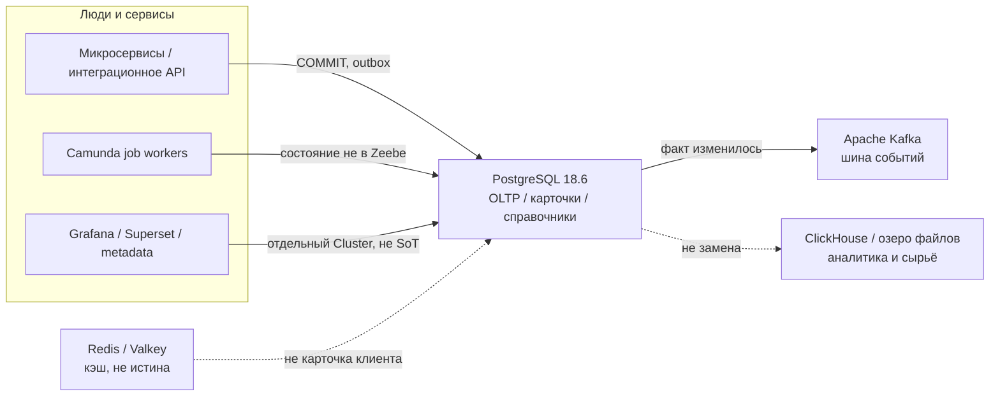
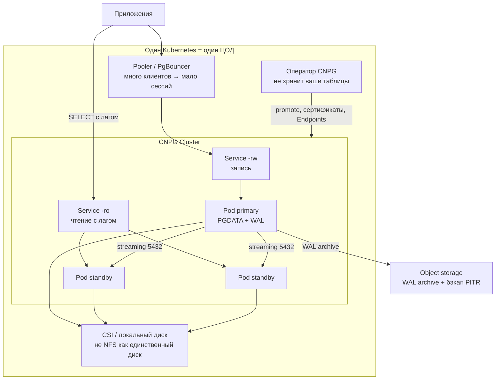
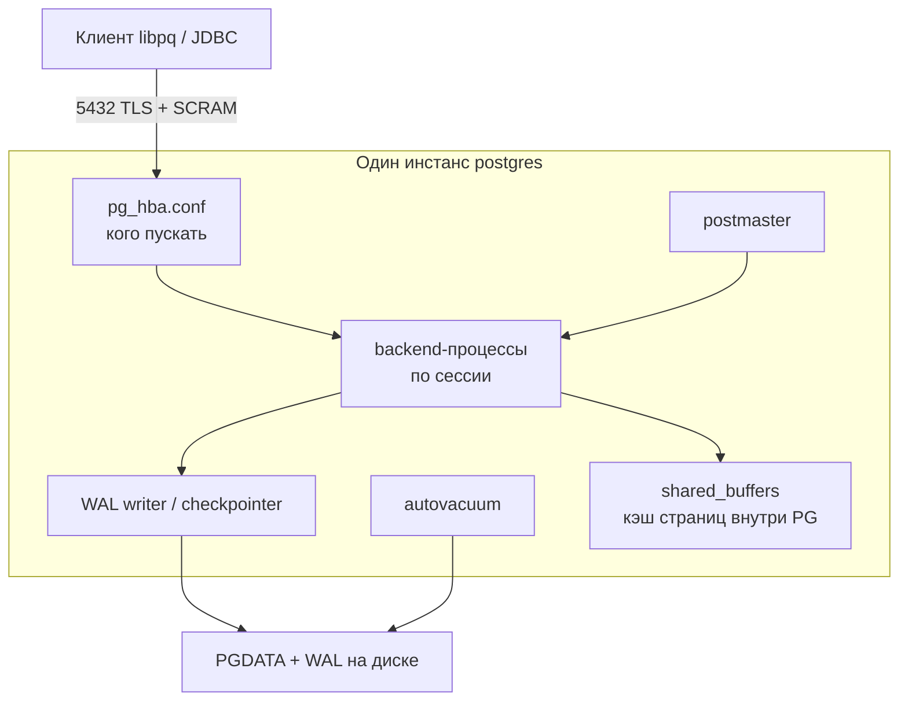
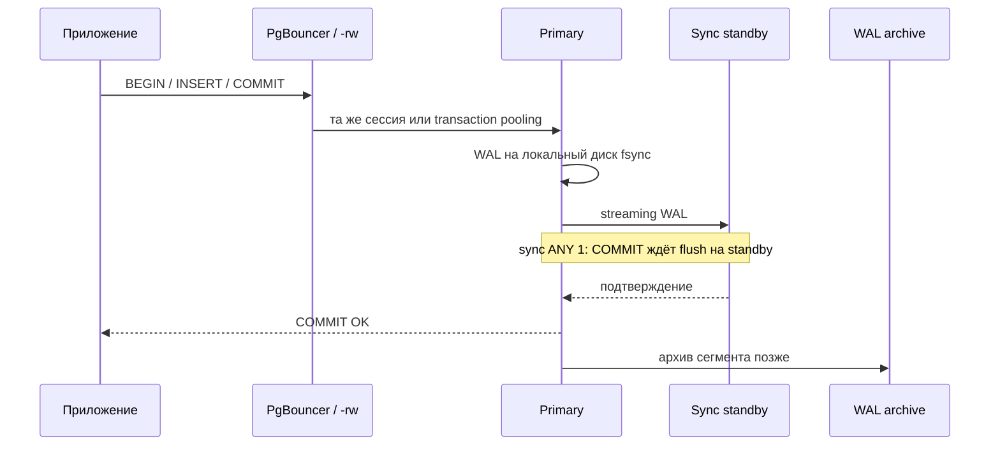
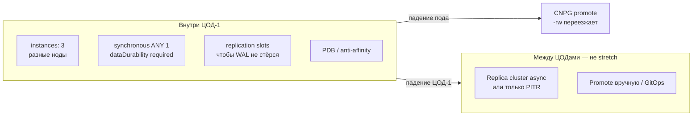
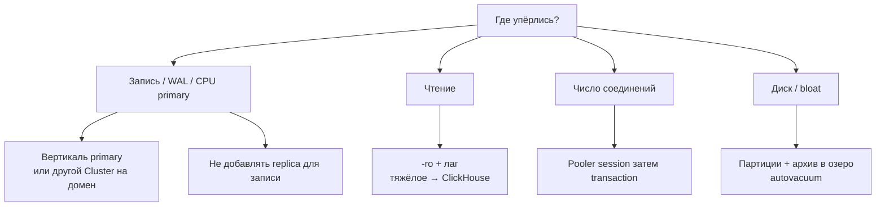
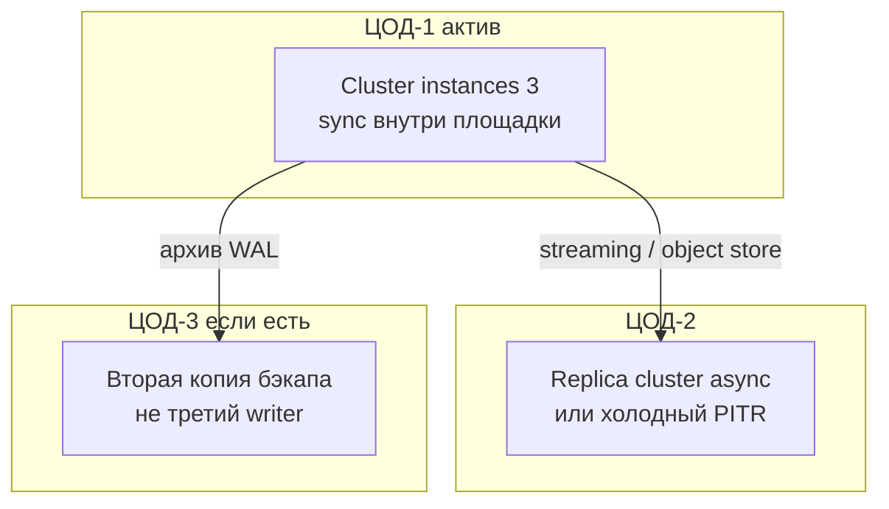

# PostgreSQL 18.6 — схемы устройства

Связанные документы: правила — `PostgreSQL.md`; установка — `PostgreSQL.install.md`.

Ниже **C4** (четыре уровня: контекст → контейнеры → компоненты → код). В запросе это «D4»: тот же каркас. Уровень кода пропускаем — для эксплуатации важнее роли, порты и ручки HA/масштаба.

Допущения (их не было в исходном ТЗ платформы, без них схема врёт):

1. Stretch одного кластера на 2–3 ЦОДа **нет** (RTT не позволяет sync `COMMIT` / Raft). HA — **внутри ЦОД-1**.
2. Community PostgreSQL 18.6 + CloudNativePG 1.30.0. Один writer на кластер.
3. Нагрузки нет — на схемах нет «N ядер». Есть *что крутить*, когда цифры появятся.

---

## 1. Контекст (C4 system context)

Где PostgreSQL в вашей картине. Он **не** шина и **не** аналитический склад.

| Стрелка | Зачем помнить |
|---|---|
| Сервис → PG | Транзакция и внешние ключи. Истина «текущая карточка» |
| PG → Kafka | Событие *после* `COMMIT` (outbox). Иначе БД и шина разъедутся |
| BI → свой Cluster | Падение отчёта не должно валить SoT клиентов |

**Слабое место контекста:** положить сырые XML ведомств и вложения на годы в одну БД — диск и vacuum съедят primary. Файлы — object storage.

---

## 2. Контейнеры (из чего состоит решение)

Один логический кластер = **один primary** + standby + то, что *рядом*, но уже другое ПО.

Порт **5432/TCP** — и клиенты, и репликация. Отдельного «порта кластера» нет. Балансировщик HTTP «на все 5432» без rw/ro **ломает** модель: запись попадёт на replica.

**Сильное:** оператор сам перекладывает `-rw` после failover. **Слабое:** `DROP TABLE` уедет на все standby; replica **не** бэкап.

---

## 3. Компоненты внутри инстанса (что крутится в одном поде)

| Компонент | Для чего настраивать |
|---|---|
| `pg_hba` + роли | Безопасность: не `trust`, не superuser в приложении |
| `shared_buffers` / `work_mem` | Производительность; дефолт ~128MB для прода мал |
| `max_connections` | Потолок процессов. Рост — **PgBouncer**, не 5000 backend |
| autovacuum | Без него bloat и остановка записи (TXID wraparound) |
| `synchronous_*` | RPO≈0 vs «пишем всегда». См. ниже |

---

## 4. Поток записи (как взаимодействуют)

Асинхронная репликация: клиент получает OK **до** догона replica → падение primary = потеря уже «подтверждённого». Это не баг, это выбор RPO.

---

## 5. Что настраивать: отказоустойчивость

| Ручка | Если не настроить |
|---|---|
| 3 инстанса + anti-affinity | Два пода на одной VM = «HA на бумаге» |
| sync `ANY 1` + `required` | Дефолт без блока sync = RPO не 0 |
| `preferred` вместо `required` | Запись жива без replica, окно потери |
| WAL archive + проверка restore | Три replica не вернут «вчера 15:03» |
| Клиент на DNS `-rw`, не IP пода | После failover приложение «висит» |

Падение **двух** ЦОДов при мозге в одном — нет записи, пока restore. Это цена запрета stretch.

---

## 6. Что настраивать: масштабируемость

Горизонтали **записи** у community PostgreSQL нет. Партиции режут vacuum, не дают второго writer.

---

## 7. Прод: 2 или 3 ЦОДа без stretch

Клиенты в штате пишут в `-rw` ЦОД-1 (TLS через город). «Три primary» community PostgreSQL **не умеет**.

**Сильное:** латентность `COMMIT` не прибита межЦОДовым RTT. **Слабое:** смерть ЦОД-1 = простой записи до ручного promote; RPO между площадками > 0, если догон архивом.

---

## 8. Безопасность (ручки на той же схеме)

Не отдельный «кластер ИБ», а слои на 5432:

1. NetworkPolicy — кто видит порт.
2. `hostssl` + SCRAM / cert — кто ты.
3. GRANT / RLS — что можно. Приложение ≠ superuser.

At-rest — шифрование тома CSI, не настройка `ssl`.

---

Источники фактов: `PostgreSQL.md` (роли, порты, CNPG, sync). Порога RTT у проекта PostgreSQL **нет** — stretch на схемах не рисуем как целевой.
