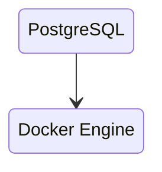
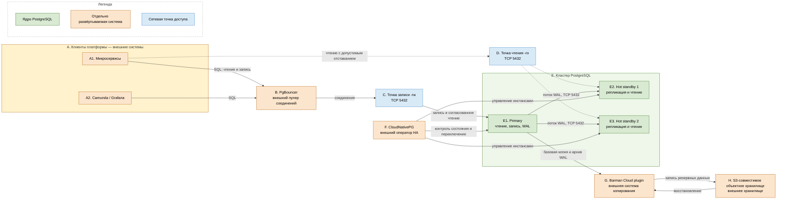

# PostgreSQL 18.6

PostgreSQL — реляционная система управления базами данных (СУБД). В платформе она хранит текущую согласованную версию операционных данных: карточки клиентов, реквизиты, статусы и связи. Целевая редакция — community PostgreSQL **18.6**. Это не Postgres Pro, EDB, Citus или Patroni.

Документация PostgreSQL 18: https://www.postgresql.org/docs/18/
Описание выпуска 18.6: https://www.postgresql.org/about/news/postgresql-186-1711-1615-1519-1424-and-19-beta-3-released-3365/

---

## Назначение системы

PostgreSQL нужен, чтобы **хранить текущую правду** «этот клиент, эти реквизиты, этот статус». Сервисы читают и изменяют строки в транзакциях; успешный `COMMIT` означает, что PostgreSQL зафиксировал изменения в соответствии с настроенным уровнем надёжности.

PostgreSQL в этой платформе — **транзакционный слой**: «прочитай карточку по ключу и измени её атомарно». Он не заменяет соседние системы:

- Kafka переносит события;
- кэш ускоряет повторные чтения, но не считается источником истины;
- Camunda управляет долгими процессами;
- интеграционное API связывается с внешними ведомствами;
- объектное хранилище хранит файлы, снимки и архивы;
- ClickHouse выполняет тяжёлую аналитику по большим объёмам.

Если эталон включает сырые выгрузки или вложения, сами файлы следует хранить в объектном хранилище, а в PostgreSQL — их метаданные и связи с карточками.

---

## Перечень функций

Community PostgreSQL 18 выполняет следующие функции:

1. **Выполняет SQL**: запросы к таблицам, транзакции, внешние ключи, ограничения, схемы и несколько баз в одном инстансе.
2. **Фиксирует изменения в WAL** до изменения страниц данных. WAL используется для восстановления после сбоя, репликации и восстановления на выбранный момент времени.
3. **Передаёт WAL резервным инстансам** потоковой репликацией. Резервный инстанс обычно доступен только для чтения и может отставать от primary.
4. **Поддерживает синхронную репликацию**: при соответствующей настройке `COMMIT` ждёт подтверждения резервного инстанса. По умолчанию синхронные резервные инстансы не заданы.
5. **Позволяет повысить standby до primary** штатной командой. Само ядро PostgreSQL не обнаруживает отказ и не выполняет автоматическое переключение: для автоматизации нужна отдельная система, например CloudNativePG или Patroni.
6. **Удерживает нужный WAL слотами репликации**, чтобы отставший получатель успел его прочитать. Неограниченное удержание WAL может заполнить диск, поэтому слоты контролируют.
7. **Копирует выбранные таблицы логической репликацией** через публикации и подписки. Это средство обмена данными, а не полноценная замена физической HA-репликации.
8. **Принимает клиентские соединения** по протоколу PostgreSQL. Внешний пулер, например PgBouncer, может уменьшить число серверных сессий, но не является функцией ядра PostgreSQL.
9. **Удаляет устаревшие версии строк** процессами `VACUUM` и `autovacuum`, сдерживая разрастание таблиц и оборот идентификаторов транзакций.
10. **Восстанавливает данные на момент времени** из базовой резервной копии и непрерывного архива WAL.
11. **Разграничивает доступ** правилами `pg_hba.conf`, ролями и привилегиями `GRANT`; поддерживает SCRAM-SHA-256 и TLS. В PostgreSQL 18 MD5 объявлен устаревшим, а TLS по умолчанию не включён.
12. **Поддерживает расширения**, например `pg_stat_statements`, `pgcrypto` и PostGIS. Расширения устанавливаются отдельно и имеют собственный жизненный цикл.

PostgreSQL не является шиной событий, in-memory-кэшем, колоночным аналитическим хранилищем или готовой мультимастерной системой. Добавление standby не создаёт второго писателя и не увеличивает производительность записи.

---

## Основные элементы системы и зависимости

### Состав

| Элемент | Назначение | Принадлежность |
|---|---|---|
| **Primary** | Принимает изменения, выполняет DDL, формирует WAL | Ядро PostgreSQL |
| **Hot standby** | Получает WAL, служит резервом и может обслуживать чтение с допустимым отставанием | Ядро PostgreSQL |
| **WAL и архивирование WAL** | Восстановление после сбоя, репликация, восстановление на момент времени | WAL — ядро; удалённое хранилище и средство копирования — отдельные системы |
| **Расширения** | Добавляют типы данных, функции и средства наблюдения | Загружаются в PostgreSQL, но поставляются и обновляются отдельно |
| **Клиентские драйверы** | Подключают приложения по протоколу PostgreSQL | Отдельные библиотеки приложений |
| **PgBouncer** | Делит ограниченное число серверных сессий между большим числом клиентов | Отдельная система |
| **CloudNativePG** | Управляет инстансами PostgreSQL в Kubernetes и автоматизирует переключение primary | Отдельная система |
| **Система резервного копирования** | Создаёт базовые копии, отправляет WAL в объектное хранилище и восстанавливает кластер | Отдельная система |
| **Объектное хранилище** | Хранит резервные копии и архив WAL вне живого кластера | Отдельная система |
| **Утилиты PostgreSQL** | `psql`, `pg_dump`, `pg_restore`, `pg_basebackup`, `pg_rewind`, `pg_upgrade` | Поставляются проектом PostgreSQL, но не являются серверными инстансами |

### Порты и способы подключения

| Порт или канал | Назначение |
|---|---|
| **5432/TCP** | Клиентские запросы, административные подключения и физическая/логическая репликация. TLS работает на этом же порту |
| **Unix-сокет** | Локальное подключение процесса на той же машине или в том же окружении |

Отдельного стандартного «порта репликации» у PostgreSQL нет: репликация использует протокол PostgreSQL и обычно тот же **5432/TCP**. PostgreSQL не требует UDP. Внешние системы управления, мониторинга и объектного хранения могут иметь собственные порты, но они не являются портами PostgreSQL и определяются их отдельными конфигурациями.

### Схема инстансов и потоков

Цветовая легенда схемы: **зелёный** — серверные инстансы ядра PostgreSQL; **оранжевый** — системы, которые разворачиваются и сопровождаются отдельно; **синий** — стабильные сетевые точки доступа. Рамка `E` объединяет инстансы одного PostgreSQL-кластера, но не означает, что оператор, пулер или хранилище входят в сервер PostgreSQL.

### Как читать схему

1. Начинайте слева с блоков `A1` и `A2`. Это потребители данных. Они используют драйвер PostgreSQL — например JDBC, Npgsql, psycopg или `libpq` — и формируют SQL-запросы.
2. Обычный путь записи идёт по сплошным стрелкам: `A → B → C → E1`. PgBouncer принимает клиентское соединение, повторно использует ограниченное число соединений к серверу, а точка `-rw` направляет их на текущий primary.
3. `E1 Primary` — единственный штатный писатель. Он проверяет ограничения, меняет данные в транзакции и сначала записывает описание изменения в WAL. Успешное завершение транзакции обозначается `COMMIT`.
4. Стрелки `E1 → E2/E3` показывают физическую потоковую репликацию. Standby получает последовательность записей WAL и воспроизводит изменения у себя. Поэтому резерв содержит весь кластер, а не только выбранные таблицы.
5. Пунктирный путь `A1 → D → E2/E3` — необязательное чтение с копий. Оно масштабирует часть чтения, но результат может быть старее primary из-за лага репликации. Запрос, который должен немедленно увидеть собственную запись, следует отправлять через `-rw`.
6. Блок `F` наблюдает за состоянием PostgreSQL и в Kubernetes может повысить standby до primary, после чего обновляет назначение точки `-rw`. Это действие CloudNativePG, а не встроенная автоматическая функция процесса `postgres`.
7. Поток `E1 → G → H` не является репликацией для запросов. Система резервного копирования создаёт базовую копию и сохраняет непрерывный архив WAL в отдельном объектном хранилище.
8. Обратный поток `H → G` используется только при восстановлении. Наличие файлов ещё не доказывает работоспособность копии: результат подтверждает пробное восстановление.
9. Реплики и резервные копии решают разные задачи. Реплика помогает при отказе инстанса, но повторит корректно выполненный `DROP TABLE`; резервная копия и архив WAL позволяют вернуться к состоянию до ошибочной операции.
10. На всех стрелках репликации PostgreSQL применяется TCP 5432. Управляющие вызовы оператора и доступ к S3 показаны логически: их конкретные сетевые контракты принадлежат внешним системам.

### Описание блоков

#### A. Клиенты платформы

- **Сущность:** приложения и платформенные продукты, которым нужны транзакционные данные.
- **Технологии и варианты:** JDBC для Java, Npgsql для .NET, psycopg для Python, `libpq` и совместимые драйверы. Клиентский пул драйвера можно сочетать с PgBouncer, не создавая чрезмерное число соединений.
- **Назначение:** формировать SQL-запросы и обрабатывать кратковременный разрыв соединения при переключении primary.
- **Принадлежность:** отдельные системы; в PostgreSQL не входят.

#### B. PgBouncer

- **Сущность:** отдельный лёгкий прокси и пулер соединений.
- **Технологии и варианты:** режимы pooling `session`, `transaction` и `statement`; в CloudNativePG пулер может описываться ресурсом `Pooler`, но работающий PgBouncer остаётся отдельным процессом и ПО.
- **Назначение:** защищать PostgreSQL от тысяч одновременно открытых серверных сессий и повторно использовать соединения.
- **Принадлежность:** отдельная система, не компонент ядра PostgreSQL и не механизм HA.

#### C. Точка записи `-rw`

- **Сущность:** стабильное DNS-имя и сервис, ведущий на текущий primary.
- **Технологии и варианты:** Kubernetes Service у CloudNativePG; вне Kubernetes — VIP, DNS или прокси, управляемый выбранным HA-решением.
- **Назначение:** не привязывать клиентов к IP конкретного инстанса и сохранить адрес после переключения.
- **Принадлежность:** объект сетевого окружения или HA-системы, не ядро PostgreSQL.

#### D. Точка чтения `-ro`

- **Сущность:** отдельная сетевая точка для одного или нескольких standby.
- **Технологии и варианты:** Kubernetes Service, балансировщик или прокси с проверкой роли сервера.
- **Назначение:** распределять только те запросы чтения, для которых допустимо отставание данных.
- **Принадлежность:** отдельный объект сетевого окружения, не ядро PostgreSQL.

#### E1. Primary

- **Сущность:** серверный инстанс PostgreSQL в роли главного.
- **Технологии и варианты HA:** процесс `postgres`, каталог данных, фоновые процессы и WAL. PostgreSQL допускает синхронные и асинхронные standby; автоматический выбор нового primary выполняет внешняя HA-система.
- **Назначение:** единственная штатная точка изменения данных, источник WAL и согласованного чтения.
- **Принадлежность:** ядро PostgreSQL.

#### E2/E3. Hot standby

- **Сущность:** серверные инстансы PostgreSQL, восстанавливающие поток WAL primary.
- **Технологии и варианты HA:** физическая streaming replication, replication slots, асинхронный или синхронный режим. Standby можно повысить вручную; CloudNativePG или Patroni автоматизируют решение, но не входят в ядро.
- **Назначение:** резерв на случай отказа primary и дополнительная мощность чтения с учётом лага и конфликтов восстановления.
- **Принадлежность:** ядро PostgreSQL.

#### F. CloudNativePG

- **Сущность:** Kubernetes-оператор, в целевом контексте — версия **1.30.0**.
- **Технологии и варианты HA:** Custom Resource `Cluster`, контроллер Kubernetes, instance manager, сервисы `-rw`/`-ro`; альтернативой вне этого варианта может быть Patroni, но два независимых HA-менеджера нельзя одновременно назначать владельцами одного набора данных.
- **Назначение:** создавать и контролировать инстансы, обнаруживать отказ, повышать standby и перенаправлять сервис записи внутри управляемого Kubernetes-кластера.
- **Принадлежность:** отдельно устанавливаемая система. Она управляет PostgreSQL, но не является частью его ядра.

Документация CloudNativePG 1.30: https://cloudnative-pg.io/documentation/1.30/

#### G. Система резервного копирования

- **Сущность:** отдельное ПО, которое взаимодействует с PostgreSQL и объектным хранилищем.
- **Технологии и варианты:** Barman Cloud plugin для CloudNativePG; также возможны `pg_basebackup`, `pgBackRest`, WAL-G и другие совместимые решения. Выбор одного решения определяет формат, расписание, хранение и процедуру восстановления.
- **Назначение:** создавать базовые копии, непрерывно сохранять WAL и выполнять восстановление на выбранный момент времени.
- **Принадлежность:** отдельная система. Встроенные серверные механизмы PostgreSQL создают WAL и предоставляют backup API, но не заменяют внешний репозиторий и управление копиями.

#### H. Объектное хранилище

- **Сущность:** S3-совместимое удалённое хранилище резервных данных.
- **Технологии и варианты:** корпоративное S3, облачный S3-совместимый сервис или иной backend, который поддерживает выбранное средство резервного копирования; политики версионирования и неизменяемости задаются на стороне хранилища.
- **Назначение:** держать базовые копии и архив WAL независимо от дисков живых инстансов PostgreSQL.
- **Принадлежность:** отдельная система, не часть PostgreSQL.

---

## Глоссарий

- **СУБД** — программа, которая хранит структурированные данные и выполняет запросы к ним.
- **Инстанс PostgreSQL** — один работающий сервер PostgreSQL с собственным каталогом данных.
- **Кластер PostgreSQL** — в терминологии PostgreSQL один каталог данных с набором баз; в HA-контексте документа — primary и его физические standby, представляющие один набор данных.
- **Primary** — инстанс, который принимает запись и создаёт WAL.
- **Standby / replica** — инстанс, который получает и воспроизводит WAL primary.
- **Hot standby** — standby, на котором во время восстановления разрешены запросы чтения.
- **Транзакция** — группа операций, которая фиксируется целиком или целиком отменяется.
- **`COMMIT`** — команда успешного завершения транзакции; подтверждает фиксацию согласно текущим настройкам надёжности.
- **WAL (Write-Ahead Log)** — последовательный журнал описаний изменений, записываемый раньше соответствующих страниц данных.
- **Физическая репликация** — передача всего потока WAL другому инстансу с копией всего кластера.
- **Логическая репликация** — передача логических изменений выбранных таблиц через публикации и подписки.
- **Лаг репликации** — отставание standby от состояния primary по времени или объёму WAL.
- **Синхронная репликация** — режим, в котором `COMMIT` ждёт заданное подтверждение standby.
- **Асинхронная репликация** — режим, в котором primary может подтвердить `COMMIT`, не дожидаясь применения или получения WAL standby.
- **HA (High Availability)** — набор механизмов высокой доступности: резервные инстансы, обнаружение отказа, выбор primary и стабильная точка подключения.
- **Failover** — аварийное переключение роли primary на standby.
- **Switchover** — запланированное управляемое переключение primary.
- **Пулер соединений** — прокси, который повторно использует небольшое число соединений к PostgreSQL для множества клиентских подключений.
- **Replication slot** — запись состояния получателя WAL, из-за которой primary удерживает ещё не прочитанный журнал.
- **Базовая резервная копия** — согласованная копия файлов кластера, служащая начальной точкой восстановления.
- **Архив WAL** — сохранённая вне живого кластера последовательность сегментов WAL.
- **PITR (Point-in-Time Recovery)** — восстановление к выбранному моменту из базовой копии и архива WAL.
- **RPO** — допустимый объём потери последних данных при аварии.
- **RTO** — допустимое время восстановления работы после аварии.
- **DDL** — SQL-команды изменения структуры объектов, например `CREATE TABLE` и `ALTER TABLE`.
- **`VACUUM` / autovacuum** — ручная и автоматическая очистка устаревших версий строк и обслуживание служебных счётчиков.
- **TLS** — шифрование сетевого канала; в PostgreSQL работает поверх того же TCP-подключения.
- **SCRAM-SHA-256** — современный механизм проверки пароля без передачи самого пароля по сети.
- **`pg_hba.conf`** — правила, определяющие, кто, откуда, к какой базе и каким методом может подключиться.
- **Kubernetes-оператор** — внешний контроллер, который управляет жизненным циклом приложения через объекты Kubernetes.
- **CloudNativePG** — отдельный Kubernetes-оператор для управления кластерами PostgreSQL.
- **Patroni** — отдельная HA-система для PostgreSQL; это не часть ядра и не дополнение, которое ставят параллельно CloudNativePG на тот же кластер.
- **Объектное хранилище** — сервис хранения объектов по ключам, обычно через S3-совместимый API.

---

## Источники

- PostgreSQL 18: https://www.postgresql.org/docs/18/
- Выпуск PostgreSQL 18.6: https://www.postgresql.org/about/news/postgresql-186-1711-1615-1519-1424-and-19-beta-3-released-3365/
- Streaming replication: https://www.postgresql.org/docs/18/warm-standby.html
- Replication slots: https://www.postgresql.org/docs/18/warm-standby.html#STREAMING-REPLICATION-SLOTS
- Continuous archiving и PITR: https://www.postgresql.org/docs/18/continuous-archiving.html
- Аутентификация и `pg_hba.conf`: https://www.postgresql.org/docs/18/client-authentication.html
- SSL/TLS: https://www.postgresql.org/docs/18/ssl-tcp.html
- CloudNativePG 1.30: https://cloudnative-pg.io/documentation/1.30/
