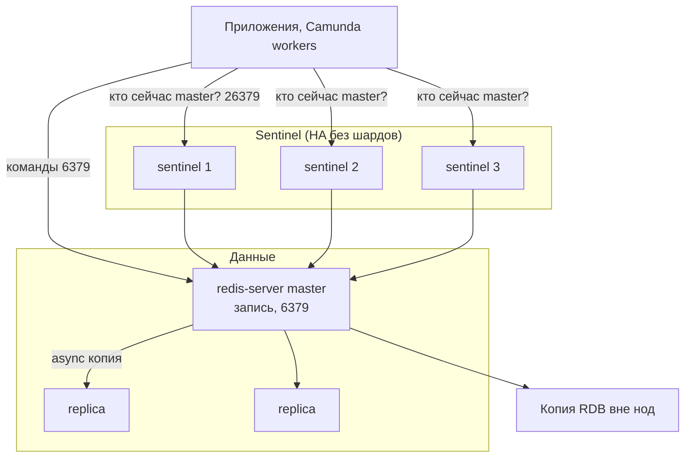

# Redis Community Edition 7.4.11 — развёртывание и настройка

Redis — хранилище ключ–значение в оперативной памяти: кэш, сессии, короткие локи, идемпотентность. Этот документ про **свою установку** Community Edition **7.4.11** (релиз 17 августа 2026; на дату подготовки — последний патч линии **7.4**, urgency `SECURITY`). Это не Redis Software, не Redis Cloud, не Redis Stack как отдельный бандл модулей и не линия 8.x.

Документация OSS/Stack: https://redis.io/docs/latest/operate/oss_and_stack/  
Конфиг-образец (заводы 7.4): https://github.com/redis/redis/blob/7.4/redis.conf  
Официальный образ: `redis:7.4.11` (теги `7.4.11`, `7.4`, `7` на эту дату указывают на этот патч).

Линия **7.2 и старше** — лицензия BSD-3-Clause. Линия **7.4.x** — **RSALv2 или SSPLv1** (это уже не BSD; юридически это не «просто open source как Kafka»). Линия **8.x** на дату документа живая (патч 8.10.1 вышел в тот же день). Этот файл — про **Redis 7**, как запрошено; 8.x сюда не подменяем.

Этот текст — не набор команд «скопируй и запусти», а правила, без которых экземпляр не будет одновременно устойчивым к сбоям, масштабируемым и безопасным. Пошаговая установка — в `Redis 7.install.md`.

---

## Назначение системы

Redis нужен, чтобы **отвечать за микросекунды из RAM**: кэш проекции, сессия, счётчик лимита, короткий лок «этот clientId сейчас обрабатывается». Данные живут в памяти; диск — чтобы пережить рестарт, не чтобы хранить терабайты как СУБД.

События везёт Kafka. Эталон карточек живёт в озере. Процессы ведёт Camunda. Интеграционное API ходит наружу. Redis — **горячее состояние**, не источник истины.

Если рабочий набор не влезает в RAM нескольких нод с копиями — это не «добавим Redis Cluster и будет озеро». Это неверный слой. Лок Redis не консенсус: сеть моргнула — можно получить два лока. Для денег и юридических шагов это слабое место.

---

## Перечень функций

Что умеет Redis Community Edition 7.4:

1. **Хранить ключ–значение** в структурах: строка, hash, list, set, sorted set, stream, bitmap и другие.
2. **Снимать ключ по TTL.** Для кэша это норма; для «единственной копии клиента» — нет.
3. **Копировать данные на replica** асинхронно: главный отвечает клиенту «записано», копия догоняет потом. Это **завод**. Команды `WAIT` / `WAITAOF` (с 7.2) уменьшают окно потери, **не** делают Redis системой с сильной согласованностью.
4. **Менять главного процессами Sentinel** (отдельные процессы, порт **26379**): следят за набором без шардов, голосуют, переключают replica в master. Клиенты спрашивают Sentinel: «кто сейчас master?». Минимум **3** Sentinel. Два официально *DON'T DO THIS*.
5. **Резать ключи на шарды (Redis Cluster):** 16384 слота, несколько master, у каждого свои слота и обычно свои replica. Sentinel с Cluster **не сочетают**. Клиент ходит напрямую на нужный master. Балансировщик «как у HTTP на все 6379» ломает модель.
6. **Снимать снимок на диск (RDB)** и вести журнал записей (AOF, с 7.0 — из нескольких частей). Политика сброса AOF: `always` / `everysec` (типичный смысл AOF) / `no`. Завод AOF **выключен**. При `everysec` можно потерять **около 1 секунды** записей при аварии.
7. **Ограничивать RAM** (`maxmemory`) и решать, что делать при потолке. В заводском конфиге потолок **не задан** — процесс ест память, пока его не убьют. Заводская политика — **не вытеснять** (`noeviction`): запись получает ошибку. Для кэша обычно LRU/LFU.
8. **Разграничивать доступ ACL** (именованные пользователи и права на команды/ключи, с Redis 6). Старый один пароль на всех с файлом ACL несовместим. Protected mode: если слушаем все интерфейсы и нет пароля — отвечает только loopback.
9. **Шифровать канал TLS** (клиент, репликация, отдельно cluster bus). В заводе **выключен**.
10. **Отдавать команды в основном на одном потоке.** Дополнительные потоки (`io-threads`) — на **сеть**, не на исполнение команд. Горячий ключ шарды не спасут.

Чего система **не** делает и часто путают: она не озеро эталона, не шина событий (Pub/Sub — без долгого лога; Streams — не замена вашей Kafka), не BPMN, не мультимастер запись в три площадки (это Redis Software / CRDT). Модулей JSON/Search в ванильном `redis:7.4.11` **нет**, пока сами не загрузите. Официального Kubernetes-оператора Community у Redis Ltd **нет** (их оператор — Enterprise). Копии узлов бэкап не заменяют: `FLUSHALL` уедет на всех.

---

## Требования к развёртыванию

### Требования к ПО

| Что | Что ставить | Комментарий |
|---|---|---|
| **Формат поставки** | Контейнеры Docker **или** поды Kubernetes | Официальный образ `redis:7.4.11`. Не `latest`. |
| **Kubernetes** | StatefulSet + PVC **или** community-оператор (например OT-CONTAINER-KIT, заявляет Redis ≥ 6) | Официального OSS-оператора у Redis Ltd **нет**. Совместимость конкретного релиза оператора с 7.4.11 **прогонять на стенде**. |
| **ОС** | Linux | Это основной контур. **Боевой Redis на Windows-хосте в схеме с Kubernetes не предполагается.** На хосте: Transparent Huge Pages выкл.; `vm.overcommit_memory=1`, чтобы снимок через `fork` не отказывался. |
| **Диск** | Локальный быстрый том (SSD) под RDB/AOF | **Не NFS** как единственный диск под сжатие AOF (задержка fsync). Даже «кэш» на бою обычно оставляют RDB, чтобы рестарт пода не был холодным стартом всей фермы. |
| **Лицензия** | RSALv2 или SSPLv1 для линии 7.4 | Если юристы не приняли — этот файл не разрешение ставить 7.4; смотрят 7.2.16 (BSD) или Valkey. |

NAT/проброс портов Docker для Sentinel официально ломает autodiscovery. В Kubernetes — IP пода / announce, не NodePort «как у веба».

### Требования к ресурсам

Цифр «сколько гигабайт под ваши ключи» у проекта **нет** — нагрузки в исходном запросе не было. Данные живут в **RAM**. Ниже ориентиры поставщика, не смета закупки.

| Роль | CPU | RAM | Диск |
|---|---|---|---|
| **Инстанс данных** | Команды в основном на **одном** потоке. Больше ядер ≠ линейный рост записи одного ключа. `io-threads` в конфиге пример **4**, выключено комментарием | Рабочий набор + структуры + буферы копий + пик снимка (copy-on-write после `fork`). Потолок `maxmemory` **ниже** лимита контейнера. На учебном стенде ориентир **256–512 МБ** | SSD под RDB/AOF. Это не ось ёмкости данных (данные в RAM), ось **как быстро** снимок не бьёт задержку |
| **Sentinel** | Небольшие процессы | Несклад данных | Файл конфига должен быть **записываемый** |
| **Учебный один контейнер** | Минимальные | Можно меньше боевого потолка | Persistence можно выкл.; на бою так нельзя |

Дополнительно:

- Три копии одного датасета занимают RAM **каждого** master/replica, не «один объём на троих».
- Слотов Cluster всегда **16384**; «рекомендуемый максимум нод порядка ~1000», не 16384 master.
- На логическом standalone по умолчанию **16** логических баз (0…15). В Cluster работает **только база 0**.

---

## Основные элементы системы и зависимости

Это одно ПО из **нескольких процессов**. Ниже — те, что живут отдельными инстансами, и как они вызывают друг друга.

### Схема инстансов и потоков



Как читать схему:

1. Клиенты **обязаны** уметь Sentinel: спрашивают несколько адресов на **26379**, узнают текущего master, затем ходят на **6379**. «Подключились к одному IP навсегда» переживает только одиночка.
2. **redis-server** хранит ключи в RAM. Replica по умолчанию только чтение. Падение master при живом большинстве Sentinel → выборы, клиенты узнают новый адрес.
3. Репликация **асинхронная**. Подтверждённая клиенту запись может не доехать до копии.
4. Sentinel и Cluster вместе на один датасет **не ставят**. Cluster — другая схема: клиент держит карту слотов, ходит напрямую; внутренний канал нода↔нода — порт **командный + 10000** (при 6379 это **16379**). Клиентов туда не пускают.
5. Снимок RDB увозят **вне** трёх нод. Копия спасает от падения **машины**, не от `FLUSHALL`.

Рядом, но это уже другое ПО: redis-exporter, RedisInsight, community-оператор Kubernetes. Их отказ проектируется отдельно.

### Что входит в состав

| Компонент | Зачем | Как масштабируется |
|---|---|---|
| **Standalone master** | Один процесс, все ключи | Вертикаль RAM/CPU. Потолок — память **одной** машины и один поток команд |
| **Replica** | Копия для чтения и для смены master | Чтение горизонтально (отставание). Запись всё равно в master |
| **Sentinel** | Смена master **без** шардов | Нечётное число, минимум **3**, в независимых зонах отказа. Не добавляет ёмкость |
| **Cluster master** | Своя доля из 16384 слотов | Горизонталь: больше master → больше RAM и записи *в сумме*, если ключи равномерны |
| **Cluster replica** | Отказоустойчивость слотов | По replica на master как минимум |
| **Утилиты** | `redis-cli`, `redis-benchmark`, `redis-check-aof`, `redis-check-rdb` | Операционка, не runtime |

### Официальные порты (менять можно, это контракт сети)

| Порт | Назначение |
|---|---|
| **6379/TCP** | Командный протокол (клиенты, репликация, `redis-cli`) |
| **16379/TCP** | Cluster bus (если клиентский 6379 и порт bus не задан отдельно: порт+10000) |
| **26379/TCP** | Sentinel |

UDP нет. TLS на тех же ролях — отдельные порты в конфиге (`tls-port` / `tls-replication` / `tls-cluster`).

### Зависимости окружения

- Стабильный IP/DNS до каждой ноды на 6379; для Cluster ещё полный обмен на 16379; для Sentinel — 26379 между Sentinel.
- В Kubernetes том на каждую ноду с persistence. `emptyDir` для AOF/RDB в бою = каждый рестарт как холодный старт или как пустой master (опасный паттерн: replica синхронизируются с пустым и **стирают** свои данные).
- Клиентские библиотеки с нужным режимом (Sentinel **или** Cluster) и с таймаутами после смены master.

---

## Краткие вводные

### Как устроена отказоустойчивость

Это **один писатель на ключ** плюс **асинхронные копии** плюс Sentinel или Cluster. Три контейнера в compose без Sentinel — не отказоустойчивость.

**1) Репликация сама по себе смену master не делает**

| Что падает | Что происходит |
|---|---|
| Master, replica есть, **нет** Sentinel/Cluster | Копии содержат данные (с лагом). Клиенты на старый IP **стоят** |
| Replica | Чтение с неё пропадает; запись на master жива |
| Master **без persistence**, процесс авторестартнулся пустым | Официальный failure mode: replica **синхронизируются с пустым** master и **стирают** свои данные. Persistence на master **и** replica настоятельно рекомендуется |

**2) Sentinel (один датасет, один master)**

| Что падает | Что происходит |
|---|---|
| Master, большинство Sentinel жив, есть годная replica | Выборы, replica → master, клиенты узнают новый адрес через Sentinel |
| Нет большинства Sentinel | Смена master **не стартует** — даже если master реально мёртв |
| Сеть моргнула дольше `down-after-milliseconds` | Риск ложной смены; старый master мог принять записи, которых нет на новом (async) |

Sentinel **не обещает**, что подтверждённая запись сохранится.

**3) Redis Cluster**

Спека: выживает раздел, где доступно **большинство master** и есть replica на каждого недостижимого master. Репликация **async**. Окна потери writes — часть дизайна. Ориентир спеки «обычно 1–2 секунды» на смену **плюс** таймаут ноды (завод **15000** мс). Если часть слотов никому не принадлежит и завод `cluster-require-full-coverage yes` — кластер **отказывается писать**.

**4) Persistence**

Копии не заменяют снимок/AOF. `FLUSHALL`, ошибка приложения, истёкший TTL — реплицируются тоже.

### Как устроено масштабирование

Несколько независимых осей (их нельзя путать):

1. **Больше данных в RAM** → больше `maxmemory` или **больше Cluster master**. Replica **не** увеличивает объём записи.
2. **Больше чтения** → replica. Читатель видит **отставание**.
3. **Больше записи** → быстрее CPU одной ноды или **шарды** Cluster, если разные ключи. Горячий ключ Cluster не спасёт.
4. **Сеть** → `io-threads` по факту насыщения, не «на всякий случай».
5. **Диск** → не ось ёмкости, ось задержки снимка.

Для кэша/идемпотентности/сессий **часто достаточно Sentinel**. Cluster берут, когда **доказали**, что один master упирается в CPU или память, и ключи хорошо режутся. Не включать Cluster «чтобы было как Kafka с партициями»: у Kafka партиция — единица порядка событий, у Redis слот — единица ключа.

### Безопасность самого Redis

Компрометация Redis с сессиями, идемпотентностью интеграций или кэшем ответов ведомств = компрометация **персональных данных и содержимого внешних ответов** (даже если «это же кэш»). Один `FLUSHALL` сносит датасет. `CONFIG` умеет сменить каталог и имя dump — известный класс атак на запись файла.

Официально: Redis рассчитан на **доверенных клиентов в доверенной сети**. Прямой 6379 из интернета — плохая идея.

- Protected mode — страховка, не костыль боя. В бою: явный bind, ACL, сеть. `protected-mode no` + bind все + без пароля = инцидент.
- AUTH без TLS не защищает от сниффера: команда AUTH идёт как остальные.
- ACL — рекомендуемый метод с Redis 6. `rename-command` **устарел**, путь — ACL.
- Запускать **не** от root, отдельный пользователь `redis`.
- Lua/`EVAL`: линия 7.4 регулярно закрывает выполнение кода в Lua (в том числе 7.4.11). Боевым учёткам приложений `EVAL`/`SCRIPT` лучше **запретить ACL**, если Lua не нужен.
- At-rest: шифрование тома. В Community нет «галочки encrypt dataset».
- `hide-user-data-from-log` (7.4), если в логах могут оказаться значения ключей.

«Поднять `docker run -p 6379:6379 redis` и выдать порт в сеть» — это новая поверхность атаки. Образы часто слушают все интерфейсы и снимают protected mode «чтобы завелось».

---

## Допущения

Ниже то, чего не было в исходном запросе, но без чего нельзя нарисовать конкретную схему. Если допущение неверно — схему надо пересмотреть.

1. Берём **Redis Community Edition 7.4.11**, не Enterprise, не Cloud, не Redis Stack, не 8.x. Юристы **принимают RSALv2 или SSPLv1** для закрытого контура.
2. Бой крутится в Kubernetes. Инсталлятор — community operator или Helm StatefulSet с **официальным** образом `redis:7.4.11`. Перед боем — прогон именно 7.4.11.
3. Три дата-центра = три независимых отказа.
4. Один набор, размазанный на три площадки, принимается **только если** сеть 6379/16379/26379 достаточно быстрая. Порога задержки у Redis **нет**. Пока её не измерили — гипотеза.
5. Цель отказа: пережить **1** дата-центр, не 2 из 3.
6. Нагрузки нет — поэтому **нет** цифры «N гигабайт maxmemory».
7. Формального SLA нет. Успешный `PING` ≠ «ни один ключ идемпотентности не потерян при смене master».
8. Корпоративные сертификаты есть или будут.
9. Люди и сервисы — разные ACL, минимум прав (кэш-сервис не делает `FLUSHALL`/`CONFIG`/`DEBUG`/`MODULE`/`EVAL`).
10. Шифрование канала — TLS сборки Redis. ГОСТ/СКЗИ не озвучены.
11. Учебный стенд изолирован. На нём допустима одиночка без пароля на loopback. В бой их не копируем.
12. Kafka, Camunda, озеро, интеграционное API — клиенты 6379, не часть этого ПО. Контракт: ключи с префиксом сервиса, TTL, hash tags если Cluster.
13. Рабочий набор Redis — не терабайты эталона. Эталон остаётся в озере.
14. Один логический Redis на среду, не «каждый микросервис свой redis в углу» без причины. Несколько выделенных инстансов (кэш vs локи vs сессии) допустимы, если политики вытеснения разные — это уже несколько экземпляров, у каждого своя отказоустойчивость.

---

## Критически важные условия, которых нет в исходном контексте

Их нужно закрыть **до** «поставили StatefulSet и забыли».

| Пробел | Почему это ломает решение |
|---|---|
| **Задержка и потери на 6379/16379/26379 между дата-центрами** | Gossip и ping Sentinel живут этими каналами. Высокая/плавающая задержка → ложная смена master, разъезд датасетов |
| **Один Kubernetes на три площадки или три изолированных** | Cluster bus — полный обмен. Нет связи под↔под → это **не** один Cluster |
| **Что именно кладёте** (кэш UI? сессии? локи? идемпотентность интеграций?) | Разная политика вытеснения, persistence, TTL, ACL |
| **Размер рабочего набора** | Не влезает в RAM одной ноды с запасом на снимок → либо Cluster, либо Redis вам не тот слой |
| **Нужна ли запись после падения одной копии ценой возможной потери хвоста async** | `min-replicas-to-write`, `WAIT`, покрытие слотов — ручки доступность vs осторожность. Заводы не совпадают с «работа беспрерывна» |
| **Клиенты умеют Sentinel / Cluster** | Иначе смена master в Redis «успешная», приложение пишет в труп |
| **152-ФЗ / срок хранения персональных данных в кэше** | TTL, запрет класть полный паспорт «на всякий случай», шифрование томов |
| **Лицензия RSALv2/SSPL** | Без решения юристов установка 7.4 может быть запрещена |
| **Нужны ли модули JSON/Search** | Их нет в ванильном 7.4; это другой артефакт |
| **Класс диска и fork** | Медленный том → AOF `everysec` врёт по задержке; огромный датасет → паузы снимка |

---

## Краткое описание ключевых этапов и элементов развертывания

Общий каркас (и тест, и бой):

1. Зафиксировать **7.4.11** (тег образа, не `redis:7`). Юристы — лицензия.
2. Решить **роль данных** (кэш / сессии / локи) → из этого политика вытеснения и persistence.
3. Решить **топологию**: одиночка / Sentinel / Cluster. Не «Cluster потому что звучит продово».
4. Выставить хостовые THP/overcommit **до** первого пода с большим датасетом.
5. Включить **ACL** (и TLS в бою) **до** боевых клиентов.
6. Задать **`maxmemory`** с запасом под репликацию и снимок. Без этого отказоустойчивость не спасает от нехватки памяти.
7. Включить метрики: память, репликация, лаг, Sentinel / Cluster INFO.
8. Прогнать запись/чтение. Убедиться, что ключ **виден** и что падение одной ноды оставляет ту семантику, на которую подписались (кэш можно потерять; лок/идемпотентность — нет).
9. Прогнать **контролируемую смену master**. Без этого у вас нет отказоустойчивости, есть надежда.
10. Только потом — тонкий ACL, `WAIT` в критичных местах приложения, отдельные инстансы под разные политики.

Боевая схема на несколько дата-центров — в `Redis 7.install.md`. Ниже — только учебный стенд.

---

### 1 инстанс: тестовый стенд, 1 площадка, без нагрузки

**Цель стенда:** чтобы разработчики ставили ключи, смотрели TTL, подключали клиент из микросервиса. **Не** цель: доказать отказ дата-центра и ёмкость RAM.

**Путь A — один контейнер:**

```text
docker run -d --name redis-dev \
  -p 127.0.0.1:6379:6379 \
  redis:7.4.11
```

Проверка: `docker exec -it redis-dev redis-cli PING` → `PONG`. Привязка к localhost обязательна.

**Путь B — Kubernetes:** один StatefulSet, 1 replica, маленький том или даже без persistence на сутки. Этот YAML в бой не копировать.

#### Что сознательно упрощаем

| Параметр | На тесте | Почему можно |
|---|---|---|
| Число нод | 1 | Нет требования пережить обновление |
| Sentinel / Cluster | нет | Иначе команда утонет в discovery раньше ключей |
| Пароль | можно без, **только loopback** | Protected mode на дефолтном бинарнике спасает; в Docker это часто уже обойдено — сеть всё равно закрыть |
| TLS | нет | Иначе сертификаты раньше продукта |
| maxmemory | 256–512 МБ | Не цель — ёмкость |
| Persistence | AOF можно выключить | На тесте потеря ключей при рестарте терпима; на препроде включить то, что будет в бою |

#### Чего на тесте **не** стоит упрощать

- Версия **7.4.11** (не «какой redis есть у devops»).
- **Префиксы ключей** и TTL в клиентском коде. Иначе в бою «кэш навсегда» съест RAM.
- Если цель боя — Cluster: на препроде маленький Cluster (3 master можно без replica). Hash tags и запрет `SELECT 1` надо поймать до боя.
- Если цель боя — Sentinel: клиентская библиотека с Sentinel **на препроде**.
- Понимание: успешный `SET/GET` на одном процессе **не** доказывает смену master.

#### Сильные стороны такой схемы

- Поднимается за минуты, совпадает с официальным Docker-образом.
- Дешево показывает паттерн ключей.
- Одиночка официально нормальна для разработки.

#### Слабые стороны (обязательно понимать)

- Нет модели отказа площадки, нет 16379 между машинами, нет вытеснения под давлением.
- Docker без привязки к localhost легко оказывается «торчит в Wi-Fi».
- Привычка без ACL уедет в бой.

Практическая рекомендация: препрод = маленькая **копия боевой топологии** (Sentinel 3 + master+2 replica, ACL, `maxmemory`, persistence как в бою), даже без боевого трафика. Всё это **в одном** дата-центре.

---

## Сводка: что считать «экземпляр готов»

| Требование | Тест (1 площадка) | Бой |
|---|---|---|
| Отказоустойчивость | Не требуется | Sentinel: 3 процесса, ≥2 replica **или** Cluster: 3 master + replica; persistence на master и replica; прогнанные смена master и restore. Схема на 2–3 дата-центра — в `Redis 7.install.md` |
| Производительность / масштаб | Не требуется | `maxmemory` с запасом; политика вытеснения по роли данных; SSD под AOF/RDB; горизонталь только слотами Cluster или отдельным инстансом; не класть эталон |
| Безопасность | Изолированная сеть; 6379 не в LAN офиса | ACL с минимумом прав; нет открытого 6379; TLS на репликации между площадками; не root; Lua ограничен |

**Не готов к бою**, если: один процесс без Sentinel/Cluster и его выдают за отказоустойчивость; `maxmemory` не задан; persistence выключена на master с авторестартом; protected mode снят и bind все без ACL; клиенты не умеют смену master; Cluster без постоянного файла слотов; все Sentinel в одной зоне; задержку сети не мерили, а схему уже размазали; Redis назначен эталоном клиентских данных; образ `latest`; 7.4 поставлен без решения по RSALv2/SSPL.

---

## Источники (чтобы не принимать на веру)

- Релиз 7.4.11 (17 Aug 2026, SECURITY): https://github.com/redis/redis/blob/7.4/00-RELEASENOTES и https://github.com/redis/redis/releases/tag/7.4.11
- Лицензии (7.2 BSD; 7.4 RSALv2/SSPL; 8+ три лицензии): https://redis.io/legal/licenses/
- Образ `redis:7.4.11`: https://hub.docker.com/_/redis
- Репликация, async, WAIT, опасность master без persistence, `min-replicas-to-write`: https://redis.io/docs/latest/operate/oss_and_stack/management/replication/
- Sentinel (минимум 3, majority, не два Sentinel, Docker/NAT): https://redis.io/docs/latest/operate/oss_and_stack/management/sentinel/
- Cluster spec (async, majority masters, 16384 слота, ~1000 нод, окна потери writes, bus): https://redis.io/docs/latest/operate/oss_and_stack/reference/cluster-spec/
- Scaling / replica migration / покрытие слотов: https://redis.io/docs/latest/operate/oss_and_stack/management/scaling/
- Persistence RDB/AOF, multi-part AOF с 7.0, `appendfsync`: https://redis.io/docs/latest/operate/oss_and_stack/management/persistence/
- Security model, protected mode, AUTH без TLS, ACL, TLS, не root: https://redis.io/docs/latest/operate/oss_and_stack/management/security/
- ACL: https://redis.io/docs/latest/operate/oss_and_stack/management/security/acl/
- WAITAOF (с 7.2, не сильная согласованность): https://redis.io/docs/latest/commands/waitaof/
- Заводы 7.4 (`port 6379`, `protected-mode yes`, `appendonly no`, `maxmemory-policy noeviction`, `cluster-node-timeout 15000`, `databases 16`): https://github.com/redis/redis/blob/7.4/redis.conf
- Active-Active — продукт Enterprise/Cloud, не Community: https://redis.io/docs/latest/operate/rc/databases/active-active/
- Community Kubernetes operator (не Redis Ltd; Redis ≥ 6): https://github.com/OT-CONTAINER-KIT/redis-operator
- Kubernetes operator Redis Ltd = Enterprise: https://redis.io/docs/latest/operate/kubernetes/

Утверждения вида «Redis переживёт два дата-центра» или «N миллисекунд — можно размазать Cluster» в документации Community 7.4 **отсутствуют** — поэтому в этом файле их нет. Задержку на 6379/16379/26379 надо измерить у себя.
