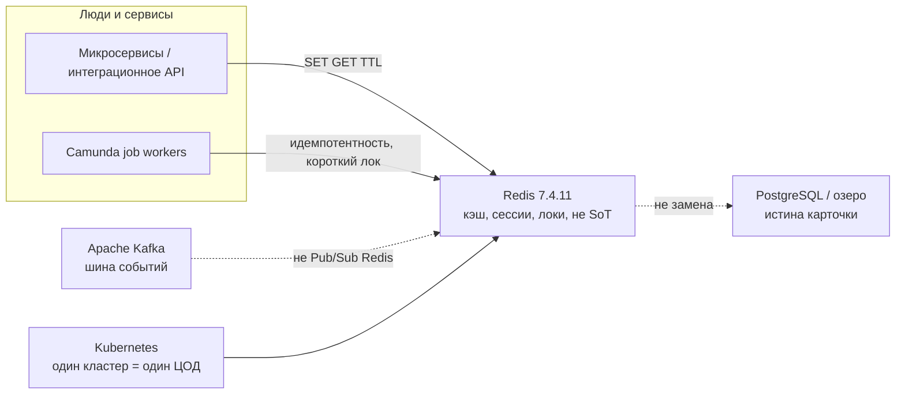
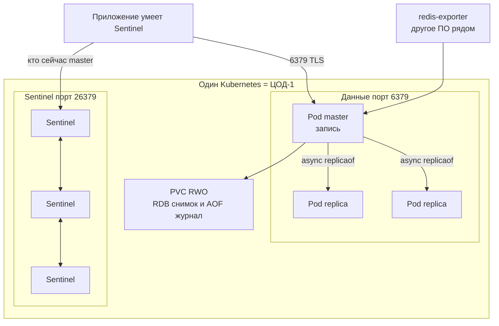
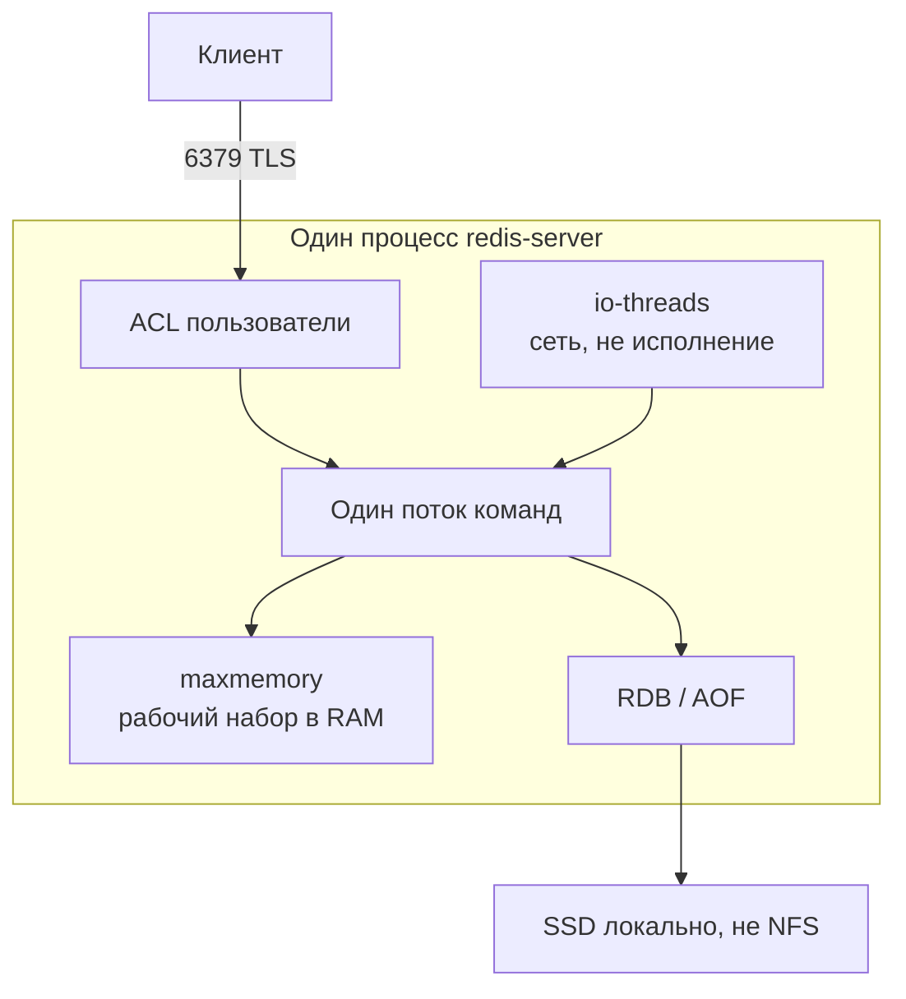
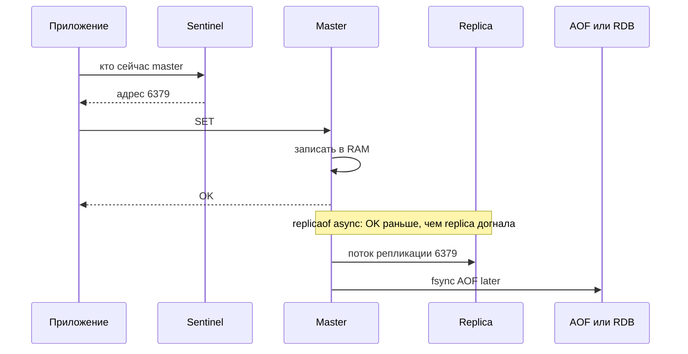
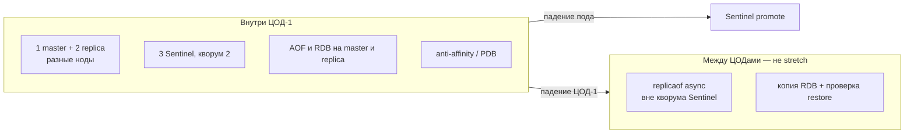
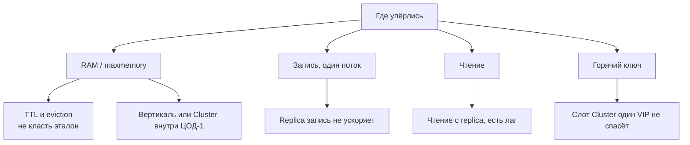
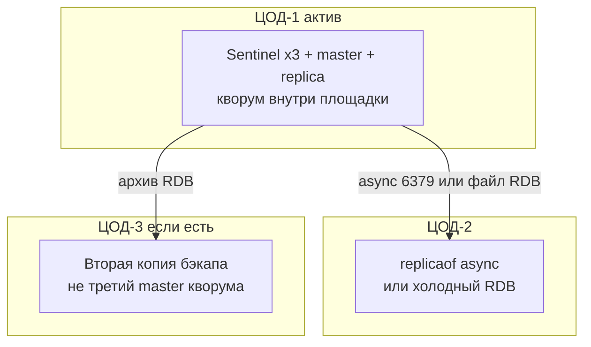

# Redis Community Edition 7.4.11 — схемы устройства

Связанные документы: правила — `Redis 7.md`; установка — `Redis 7.install.md`.

Ниже **C4** (четыре уровня: контекст → контейнеры → компоненты → код). В запросе это «D4»: тот же каркас. Уровень кода пропускаем — для эксплуатации важнее роли, порты и ручки HA/масштаба.

Допущения (их не было в исходном ТЗ платформы, без них схема врёт):

1. Stretch одного Sentinel-набора или Redis Cluster на 2–3 ЦОДа **нет** (RTT не позволяет стабильный gossip и кворум). HA — **внутри ЦОД-1**.
2. Community **7.4.11**, лицензия RSALv2 или SSPL (это уже не BSD как линия 7.2). Официального OSS-оператора у Redis Ltd **нет**.
3. Redis **не** источник истины (SoT). Репликация **асинхронная** (`replicaof`): клиент получает OK до догона replica.
4. Нагрузки нет — на схемах нет «N ядер». Есть *что крутить*, когда цифры появятся.

---

## 1. Контекст (C4 system context)

Где Redis в вашей картине. Он **не** шина, **не** озеро и **не** Camunda.

| Стрелка | Зачем помнить |
|---|---|
| Сервис → Redis | Кэш проекции, rate-limit, ключ идемпотентности с TTL. Не карточка клиента навсегда |
| Redis не озеро | Eviction, `FLUSHALL` или failover с async-хвостом истину не берегут |
| Kafka отдельно | Streams и Pub/Sub Redis не заменяют топик с consumer group |

**Слабое место контекста:** «положим клиентов только в Redis» — RAM × реплики. Эталон остаётся в озере/БД.

---

## 2. Контейнеры (из чего состоит решение)

Один логический набор = **один master** (пишет) + replica (копии) + Sentinel (следят и переключают). Sentinel и Cluster **вместе не ставят**. Cluster, размазанный по ЦОДам, **запрещён**.

Порты: **6379/TCP** — клиенты и репликация; **26379/TCP** — Sentinel; **16379/TCP** — Cluster bus (командный порт + 10000), только если Cluster **целиком** в ЦОД-1. Балансировщик HTTP «на все 6379» без Sentinel/Cluster-aware клиента **ломает** модель: запись попадёт на replica.

**Сильное:** 3 Sentinel в разных залах ЦОД-1 переживают падение пода master. **Слабое:** master без persistence (диск выключен) + авторестарт пустым **стирает** replica — официальный failure mode. Совместимость стороннего оператора с 7.4.11 проверять на стенде.

---

## 3. Компоненты внутри инстанса

| Компонент | Для чего настраивать |
|---|---|
| `maxmemory` + policy | В дефолтном `redis.conf` потолка **нет**, политика `noeviction`. Кэш: `allkeys-lru`. Локи/idem, которые нельзя выкинуть — **другой** инстанс |
| AOF `everysec` + RDB | Дефолт AOF выключен. `everysec`: около 1 с записей можно потерять при аварии (формулировка доки) |
| ACL | Не один `requirepass` на всех. Приложению запретить `FLUSHALL`, `CONFIG`, `EVAL` |
| `replica-read-only` | Дефолт yes. Случайная запись в replica |

Команды в основном однопоточны. В Cluster работает только логическая DB 0: «db=1 кэш, db=2 сессии» туда не переедет.

---

## 4. Поток записи

`WAIT` / `WAITAOF` (с 7.2) сужают окно потери, **не** делают Redis системой с сильной согласованностью. Active-Active (мультимастер в регионах) — Redis Software, не Community 7.4.

---

## 5. Что настраивать: отказоустойчивость

| Ручка | Если не настроить |
|---|---|
| 3 Sentinel, не 2 | Два официально *DON'T DO THIS*. Нет majority — failover не стартует, даже если master мёртв |
| Persistence на master **и** replica | Пустой рестарт master съедает копии |
| Клиент умеет Sentinel | Redis переключил master, приложение пишет в старый IP |
| `min-replicas-to-write` | Дефолт 0: пишем в одиночку. ≥1 — запись встанет без живой replica |
| Cluster на 3 ЦОДа | Stretch **запрещён**: majority master и `cluster-node-timeout` живут межплощадочным RTT |

Падение **двух** ЦОДов при мозге в одном — нет записи, пока restore. Это цена запрета stretch.

---

## 6. Что настраивать: масштабируемость

Горизонталь записи — только шарды Cluster (16384 слота) **внутри ЦОД-1**, когда один master доказанно мал. Новые ноды пустые, пока не reshard. `io-threads` — сеть, не «многоядерный Redis как СУБД». Терабайты озера сюда не кладут.

---

## 7. Прод: 2 или 3 ЦОДа без stretch

Клиенты в штате спрашивают Sentinel ЦОД-1. Replica в ЦОД-2 **не** голосует в Sentinel: иначе сеть моргнула — ложный failover и разъезд датасетов. Раскладку Cluster «по master на ЦОД» **не рисуем**. Несколько независимых Redis (кэш прогревается с озера) — вариант C из `Redis 7.md`, не общий кворум.

**Сильное:** детект Sentinel не прибит межЦОДовым RTT. **Слабое:** смерть ЦОД-1 = простой Redis до ручного DR; RPO между площадками больше 0.

---

## 8. Безопасность и сильное / слабое

Слои на 6379 и 26379:

1. NetworkPolicy — кто видит порт. Не LoadBalancer в интернет.
2. ACL + TLS — кто ты. AUTH без TLS сниффер читает пароль как обычную команду.
3. Категории команд — что можно. Боевым ролям лучше запретить Lua/`EVAL` (линия 7.4 закрывает RCE в скриптах, в том числе 7.4.11).

At-rest — шифрование тома CSI, не «галочка encrypt dataset». Protected mode — страховка дефолта, не модель прода.

| Сильное | Слабое |
|---|---|
| Микролатентность in-memory, простые структуры | Не SoT; async потеря хвоста при failover |
| Sentinel HA без шардов внутри ЦОДа | Один writer; потолок = RAM одной машины |
| ACL из коробки 7.4 | RSALv2/SSPL; нет официального OSS-оператора |
| | Stretch Cluster запрещён — нет «одного Redis на страну» |

Источники фактов: `Redis 7.md` (роли, порты, Sentinel vs Cluster, persistence, лицензия). Порога RTT у проекта Redis **нет** — stretch на схемах не рисуем как целевой.
