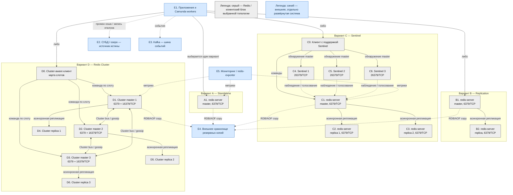

# Redis Community Edition 7.4.11 — назначение и архитектура

Redis — хранилище ключ–значение в оперативной памяти: кэш, сессии, короткие локи, идемпотентность. Этот документ описывает свою установку Community Edition 7.4.11 (релиз 17 августа 2026; на дату подготовки — последний патч линии 7.4, urgency `SECURITY`). Это не Redis Software, не Redis Cloud, не Redis Stack как отдельный бандл модулей и не линия 8.x.

Документация OSS/Stack: https://redis.io/docs/latest/operate/oss_and_stack/  
Конфиг-образец 7.4: https://github.com/redis/redis/blob/7.4/redis.conf
Официальный образ: `redis:7.4.11`.

Линия 7.2 и старше — лицензия BSD-3-Clause. Линия 7.4.x — RSALv2 или SSPLv1; это не BSD. Линия 8.x на дату документа развивается, но данный файл относится только к Redis 7.

---

## Назначение системы

Redis нужен, чтобы **отвечать за микросекунды из RAM**: кэш проекции, сессия, счётчик лимита, короткий лок «этот clientId сейчас обрабатывается». Данные живут в памяти; диск — чтобы пережить рестарт, не чтобы хранить терабайты как СУБД.

События везёт Kafka. Эталон карточек живёт в озере. Процессы ведёт Camunda. Интеграционное API ходит наружу. Redis — **горячее состояние**, не источник истины.

Если рабочий набор не влезает в RAM нескольких нод с копиями — это не «добавим Redis Cluster и будет озеро». Это неверный слой. Лок Redis не консенсус: сеть моргнула — можно получить два лока. Для денег и юридических шагов это слабое место.

---

## Перечень функций

Что умеет Redis Community Edition 7.4:

1. **Хранить ключ–значение** в структурах: строка, hash, list, set, sorted set, stream, bitmap и другие.
2. **Снимать ключ по TTL.** Для кэша это норма; для «единственной копии клиента» — нет.
3. **Копировать данные на replica** асинхронно: главный отвечает клиенту «записано», копия догоняет потом. Это заводское поведение. Команды `WAIT` / `WAITAOF` уменьшают окно потери, но не делают Redis системой с сильной согласованностью.
4. **Менять главного процессами Sentinel** — отдельными процессами на порту **26379**. Они следят за набором без шардов, голосуют и переключают replica в master. Клиенты спрашивают Sentinel, кто сейчас master. Нужно минимум **3** Sentinel; два использовать не следует.
5. **Распределять ключи по шардам в Redis Cluster:** 16384 слота, несколько master, у каждого свои слоты и обычно свои replica. Sentinel с Cluster не сочетают. Клиент ходит напрямую к нужному master. Обычный балансировщик перед всеми портами 6379 ломает эту модель.
6. **Сохранять состояние на диск:** снимать снимок RDB и вести журнал AOF. В Redis 7 AOF состоит из нескольких частей. Политика синхронизации AOF: `always`, `everysec` или `no`; заводская настройка AOF выключена. При `everysec` авария может потерять примерно последнюю секунду записей.
7. **Ограничивать RAM** параметром `maxmemory` и выбирать поведение при достижении потолка. В заводском конфиге потолок не задан, а политика `noeviction` запрещает вытеснение и возвращает ошибку на запись. Для кэша обычно рассматривают LRU или LFU.
8. **Разграничивать доступ через ACL:** задавать именованных пользователей и разрешения на команды и ключи. Protected mode ограничивает доступ, если процесс слушает все интерфейсы и пароль не настроен.
9. **Шифровать соединения TLS:** отдельно для клиентов, репликации и Cluster bus. В заводской конфигурации TLS выключен.
10. **Исполнять команды преимущественно в одном потоке.** Дополнительные `io-threads` обслуживают сеть, а не параллельное исполнение команд. Поэтому один горячий ключ не масштабируется добавлением шардов.

Redis Community Edition 7.4 не является озером эталонных данных, шиной событий, BPMN-движком или мультимастерной системой записи между площадками. Pub/Sub не хранит долговечный журнал; Streams не заменяют платформенную Kafka. Модулей JSON/Search в стандартном образе `redis:7.4.11` нет. Реплики также не заменяют резервную копию: ошибочная команда удаления распространяется на них.

---

## Основные элементы системы и зависимости

Redis — одно серверное ПО, которое может работать как один процесс или как набор взаимодействующих процессов. На схеме ниже четыре **альтернативные** топологии. Для одного набора данных выбирают одну из них: Standalone, replication без автоматического переключения, Sentinel или Cluster.

### Схема инстансов и потоков

### Как подробно читать схему

1. Сначала выберите только одну рамку A, B, C или D. Стрелки от E1 не означают одновременную запись одного набора данных во все четыре варианта; они показывают допустимые альтернативы подключения.
2. Сплошная стрелка обозначает рабочий трафик Redis: клиентскую команду, копирование данных или внутренний обмен Cluster. Пунктир обозначает наблюдение либо интеграцию с системой, которая не входит в Redis.
3. Серые блоки относятся к выбранной топологии Redis или к необходимому для неё режиму клиента. Синие блоки развёртываются и сопровождаются отдельно; их сбой не должен трактоваться как сбой процесса Redis.
4. В A приложение сразу отправляет команды одному master на 6379. Другого процесса с актуальной копией и автоматического переключения нет.
5. В B приложение всё ещё пишет в один master. Master асинхронно передаёт поток изменений replica. Replica может обслуживать чтение, но данные на ней могут отставать. Если master падает, сама репликация не назначает нового master: переключение выполняется внешней операционной процедурой.
6. В C клиент сначала обращается к нескольким Sentinel на 26379 и узнаёт адрес текущего master. После этого команды идут прямо на 6379, а не через Sentinel. Sentinel наблюдают master и replica, достигают кворума и при допустимом большинстве повышают одну replica до master. Клиент должен повторно запросить адрес после переключения.
7. В D клиент знает распределение 16384 слотов между master и направляет ключ к владельцу слота. Cluster master обмениваются служебной информацией через Cluster bus на 16379, если командный порт равен 6379. Replica каждого master хранит только слоты своего master. Sentinel в эту схему не добавляется.
8. Стрелки репликации однонаправленные: запись принимает master, а replica догоняет. Подтверждение клиенту может произойти до доставки записи на replica, поэтому при аварии возможна потеря подтверждённого хвоста.
9. E2 и E3 подчёркивают границу ответственности. При промахе кэша приложение читает эталон из СУБД или озера. События публикуются в Kafka; Redis не становится долговечной шиной только из-за Pub/Sub или Streams.
10. E4 находится вне Redis-нод. RDB/AOF на той же ноде помогают после рестарта, а вынесенная копия нужна против потери ноды или логической ошибки. Реплика не является резервной копией, потому что удаление также реплицируется.
11. E5 получает метрики, но не входит в поставку сервера Redis. `redis-exporter`, RedisInsight и система хранения метрик имеют собственный жизненный цикл и границу отказа.

### Блоки схемы

#### A1. Standalone master

Один процесс `redis-server` хранит весь набор ключей в RAM, принимает чтение и запись на 6379/TCP и при выбранной политике сохраняет RDB/AOF. Это минимальная топология без копии и автоматической смены роли. Её назначение — локальная разработка, краткоживущий стенд либо нагрузка, для которой простой и восстановление из внешнего источника допустимы. Предел данных и производительности задаёт одна нода.

#### B1–B2. Master и replica

B1 принимает все записи. B2 подключается к B1 и асинхронно воспроизводит изменения. Вариант масштабирует чтение и создаёт оперативную копию, но не обеспечивает автоматическое переключение. Чтение с B2 допускает устаревшие данные. Несколько replica — вариант этой же топологии; они не увеличивают объём данных, доступный для записи, потому что каждая хранит копию набора.

#### C0. Клиент с поддержкой Sentinel

Это режим клиентской библиотеки приложения, а не отдельный сервер-посредник. Клиенту задают адреса нескольких Sentinel и имя наблюдаемого master. Он узнаёт актуальный адрес писателя, подключается к нему на 6379 и повторяет обнаружение после смены роли. Клиент, в котором навсегда закреплён IP старого master, сводит пользу Sentinel к минимуму.

#### C1–C3. Набор данных Sentinel

C1 — текущий master, C2 и C3 — его асинхронные replica. Все три процесса являются обычными `redis-server`; «Sentinel-кластер» не шардирует данные. После отказа C1 одна подходящая replica может стать master, а оставшаяся перестраивается на нового писателя. Подтверждённая, но ещё не реплицированная запись может быть потеряна.

#### C4–C6. Sentinel

Sentinel — отдельные процессы обнаружения, наблюдения и координации failover на 26379/TCP. Они не хранят пользовательские ключи и не стоят в пути команд приложения. Минимум три процесса нужен, чтобы решение об отказе принималось большинством; размещение всех Sentinel в одной общей точке отказа не даёт независимого голосования. Sentinel применяется к нешардированному набору master/replica и не используется вместе с Redis Cluster для одного набора данных.

#### D0. Cluster-aware клиент

Это библиотека, понимающая ответы перенаправления Redis Cluster и карту слотов. Она вычисляет слот ключа и соединяется непосредственно с нужным master на 6379. Обычный TCP- или HTTP-подобный балансировщик, случайно выбирающий любую ноду, не заменяет такую библиотеку. Многооперационные действия над разными слотами ограничены; hash tag позволяет намеренно поместить связанные ключи в один слот.

#### D1–D3. Cluster master

Каждый master владеет частью из 16384 слотов и хранит соответствующие ключи. Добавление master увеличивает суммарную RAM и пропускную способность только при равномерном распределении ключей. Один горячий ключ всё равно обрабатывается владельцем одного слота. Между master работает Cluster bus: служебный протокол обнаружения, состояния и голосования, обычно на порту команд плюс 10000.

#### D4–D6. Cluster replica

Каждая replica асинхронно копирует данные своего master и может быть повышена при его отказе. Репликация остаётся асинхронной, поэтому Cluster не гарантирует сохранность каждого подтверждённого изменения. Наличие replica повышает доступность слотов, но не добавляет ёмкость для новых уникальных ключей.

#### E1. Приложения и Camunda workers

Это внешние клиенты Redis: микросервисы, фоновые обработчики и workers. Они выбирают клиентский режим, соответствующий топологии, задают TTL и префиксы ключей и обрабатывают промахи кэша. Они не входят в продукт Redis и развёртываются отдельно.

#### E2. СУБД или озеро

Внешний источник истины хранит эталонные карточки и долговечные данные. Redis может содержать ускоряющую проекцию, но потеря или истечение ключа не означает отсутствие объекта. Восстановление кэша выполняется из этого блока через приложение.

#### E3. Kafka

Внешняя платформа событий отвечает за долговечный журнал, порядок и повторное чтение событий. Redis Pub/Sub подходит для недолговечных уведомлений, а Redis Streams — для локальных сценариев, но в данной платформе не заменяет Kafka.

#### E4. Внешнее хранилище резервных копий

Сюда выносят проверенные копии RDB/AOF или результаты отдельной процедуры резервного копирования. Блок не является частью Redis Community Edition. Он должен иметь независимую границу отказа относительно процессов данных, иначе потеря ноды уничтожит и рабочие файлы, и их копию.

#### E5. Мониторинг

Внешняя система собирает состояние памяти, задержки, ошибки, лаг репликации, состояние Sentinel или покрытие слотов Cluster. Экспортёр и интерфейс RedisInsight — отдельное ПО, а не обязательные процессы Redis Community Edition.

---

## Варианты топологии и область применимости

### Standalone

**Назначение:** простейший одиночный набор данных.
**Сильная сторона:** минимальная сложность и прямое подключение клиента.
**Слабая сторона:** отказ процесса или ноды прекращает обслуживание; объём ограничен одной нодой.
**Граница:** нет реплики, голосования, автоматического failover и шардирования.

### Replication

**Назначение:** копии для чтения и оперативная копия данных при одном писателе.
**Сильная сторона:** чтение можно распределить между replica.
**Слабая сторона:** чтение может отставать, а автоматической смены master нет.
**Граница:** replication — механизм копирования, а не самостоятельная система высокой доступности.

### Sentinel

**Назначение:** высокая доступность одного нешардированного набора данных с одним текущим master.
**Сильная сторона:** автоматическое обнаружение отказа и смена master без распределения ключей по шардам.
**Слабая сторона:** не увеличивает объём набора сверх памяти одного master и не устраняет окно потери при асинхронной репликации.
**Граница:** требует Sentinel-aware клиентов; не объединяется с Cluster и не превращает Redis в систему сильного консенсуса.

### Redis Cluster

**Назначение:** распределение большого набора и суммарной нагрузки между несколькими master.
**Сильная сторона:** горизонтальное увеличение общей RAM и обработки разных ключей.
**Слабая сторона:** сложнее клиентская модель, операции над несколькими слотами и восстановление; горячий ключ остаётся на одной ноде.
**Граница:** Cluster решает шардирование и failover слотов, но не обеспечивает мультимастерную запись одного ключа и не заменяет резервное копирование.

Топологии — альтернативы, а не последовательные «уровни зрелости». Standalone можно дополнить replica и получить replication; добавление Sentinel даёт автоматическую смену master для этого нешардированного набора. Если нужна ёмкость нескольких master, выбирают Cluster как другую клиентскую и операционную модель.

---

## Состав и порты

### Что входит в состав

| Компонент | Назначение | Варианты масштабирования |
|---|---|---|
| **Standalone master** | Один процесс и весь набор ключей | Вертикально по RAM/CPU; предел — одна нода |
| **Replica** | Асинхронная копия для чтения или повышения | Добавляет чтение и копии, но не ёмкость записи |
| **Sentinel** | Обнаружение текущего master и координация failover | Нечётное число, минимум 3; не добавляет ёмкость данных |
| **Cluster master** | Владелец части из 16384 слотов | Больше master — больше суммарной RAM и обработки разных ключей |
| **Cluster replica** | Копия слотов одного Cluster master | Добавляет доступность соответствующих слотов |
| **Утилиты** | `redis-cli`, `redis-benchmark`, `redis-check-aof`, `redis-check-rdb` | Операционные средства, не серверный runtime |

### Порты

| Порт | Назначение |
|---|---|
| **6379/TCP** | Командный протокол: клиенты, репликация и `redis-cli` |
| **16379/TCP** | Cluster bus при клиентском порте 6379 и стандартном правиле «порт + 10000» |
| **26379/TCP** | Sentinel: обнаружение, наблюдение и координация |

UDP не используется. TLS может быть назначен на отдельные порты параметрами `tls-port`, `tls-replication` и `tls-cluster`; конкретные номера определяет конфигурация.

---

## Граница продукта

В границу Redis Community Edition 7.4 входят процесс `redis-server`, режимы master/replica/Cluster, процесс Sentinel, командный протокол, Cluster bus, RDB/AOF, ACL, TLS и поставляемые утилиты командной строки.

За границей находятся:

- код и клиентские библиотеки приложений;
- Kubernetes, Docker, StatefulSet, Helm и community-операторы;
- диски, сеть, DNS, балансировщики и хранилище резервных копий;
- Kafka, Camunda, СУБД и озеро;
- `redis-exporter`, система метрик и RedisInsight;
- Redis Enterprise, Redis Cloud, Active-Active/CRDT и модули, отсутствующие в стандартном образе.

Контракт продукта с приложением — команды Redis по TCP/TLS, модель ключей, TTL, ACL и поведение выбранной топологии. Контракт с платформой хранения — файлы RDB/AOF. Контракт между Cluster-нодами — Cluster bus. Всё, что восстанавливает эталонные данные, маршрутизирует бизнес-события или исполняет бизнес-процесс, остаётся за пределами Redis.

---

## Глоссарий

| Термин | Значение в этом документе |
|---|---|
| **ACL** | Access Control List: именованные пользователи и правила доступа к командам и шаблонам ключей. |
| **AOF** | Append Only File: журнал изменяющих команд для восстановления состояния после перезапуска. |
| **Async / асинхронная репликация** | Master подтверждает запись, не дожидаясь обязательного сохранения на всех replica. |
| **Bitmap** | Набор битов, хранимый внутри строкового значения и изменяемый битовыми командами. |
| **BPMN** | Нотация бизнес-процессов; их исполнение относится к Camunda, а не Redis. |
| **Cache miss / промах кэша** | Искомого ключа нет; приложение должно обратиться к источнику истины, если данные обязательны. |
| **Cluster-aware клиент** | Библиотека, которая понимает карту слотов и перенаправления Redis Cluster. |
| **Cluster bus** | Внутренний бинарный канал обмена состоянием между Cluster-нодами; обычно командный порт плюс 10000. |
| **Community Edition** | Самостоятельно развёртываемая серверная редакция Redis, рассматриваемая в документе. |
| **Copy-on-write** | Механизм ОС, при котором изменяемые во время снимка страницы памяти копируются; повышает пиковое потребление RAM. |
| **CRDT** | Структуры для согласования параллельных изменений; Active-Active на их основе относится к другому продукту. |
| **Docker** | Средство запуска приложения в изолированном контейнере из подготовленного образа. |
| **Failover** | Переключение роли master на replica после признанного отказа. |
| **Gossip** | Обмен сведениями о состоянии нод внутри Redis Cluster. |
| **Hash** | Структура Redis «поле–значение» внутри одного ключа. |
| **Hash tag** | Фрагмент имени ключа в фигурных скобках, определяющий общий Cluster slot для связанных ключей. |
| **HA** | High Availability: способность продолжить обслуживание после части отказов. |
| **Helm** | Внешний менеджер пакетов конфигурации приложений для Kubernetes. |
| **Hot key / горячий ключ** | Один ключ с непропорционально высокой нагрузкой; принадлежит одному слоту и одной ноде. |
| **Идемпотентность** | Повтор операции с тем же идентификатором не создаёт повторный бизнес-эффект; Redis может хранить краткоживущий маркер. |
| **`io-threads`** | Дополнительные потоки сетевого ввода-вывода Redis; они не превращают исполнение команд в полностью многопоточное. |
| **Источник истины / эталон** | Система, чьё значение считается окончательным и из которой можно восстановить кэш. |
| **Клиентская библиотека** | Код внутри приложения, который реализует протокол Redis и поведение Standalone, Sentinel или Cluster. |
| **Контейнер / образ** | Контейнер — изолированный запущенный процесс; образ — неизменяемый пакет программы и её файлов для запуска. |
| **Kubernetes** | Внешняя платформа оркестрации контейнеров; она не входит в Redis Community Edition. |
| **Лок** | Краткоживущий ключ-блокировка; Redis-лок не равен распределённому консенсусу. |
| **List** | Упорядоченная последовательность строк в Redis. |
| **LFU** | Least Frequently Used: вытеснение наименее часто используемых ключей. |
| **LRU** | Least Recently Used: вытеснение ключей, которые давно не использовались. |
| **Master** | Процесс Redis, принимающий запись для своего набора или набора слотов. |
| **`maxmemory`** | Настраиваемый предел памяти, после которого применяется выбранная политика вытеснения или отказ записи. |
| **Мультимастер** | Топология, где один логический объект можно параллельно записывать через несколько активных владельцев; Community Cluster этого не даёт. |
| **Нода / инстанс** | Отдельный запущенный процесс Redis с собственной памятью, сетью и файлами. |
| **`noeviction`** | Политика: не удалять ключи автоматически при достижении `maxmemory`, а отклонять новые изменяющие команды. |
| **Persistence** | Сохранение состояния на диск с помощью RDB, AOF или обоих механизмов. |
| **Protected mode** | Защитное поведение Redis, ограничивающее удалённый доступ при небезопасной базовой конфигурации. |
| **Pub/Sub** | Доставка сообщений активным подписчикам без долговечного журнала для позднего повторного чтения. |
| **Quorum / кворум** | Число Sentinel, которые должны согласиться, что master недоступен, прежде чем возможен failover. |
| **RAM** | Оперативная память, где Redis держит рабочий набор данных. |
| **RDB** | Снимок набора данных на определённый момент времени. |
| **Redis Cluster** | Встроенная топология шардирования ключей по 16384 слотам с несколькими master. |
| **redis-exporter** | Отдельный агент, преобразующий метрики Redis для внешней системы мониторинга. |
| **RedisInsight** | Отдельный графический инструмент просмотра и диагностики Redis. |
| **Redis Sentinel** | Отдельный процесс наблюдения, обнаружения master и координации failover нешардированного набора. |
| **Replica** | Асинхронная копия данных master, обычно доступная только для чтения до повышения. |
| **Replication** | Поток копирования изменений от master к одной или нескольким replica. |
| **RSALv2 / SSPLv1** | Альтернативные лицензии, применимые к Redis 7.4.x; они отличаются от BSD-3-Clause. |
| **Runtime** | Процессы, необходимые во время непосредственной работы системы. |
| **Sentinel-aware клиент** | Библиотека, которая спрашивает Sentinel об актуальном master и переподключается после failover. |
| **Set** | Неупорядоченное множество уникальных строк. |
| **Shard / шард** | Часть общего набора ключей, принадлежащая отдельному Cluster master. |
| **Slot / слот** | Одна из 16384 логических корзин Redis Cluster, в которую по хэшу попадает ключ. |
| **Sorted set** | Множество уникальных элементов с числовым весом и упорядочиванием по нему. |
| **Standalone** | Один процесс Redis без replica, Sentinel и Cluster. |
| **StatefulSet** | Объект Kubernetes для набора подов со стабильной идентичностью и томами. |
| **String / строка** | Базовый тип значения Redis: последовательность байтов, также используемая для чисел и bitmap. |
| **Stream** | Структура Redis с упорядоченными записями и группами потребителей; не равна платформенной Kafka. |
| **Strong consistency / сильная согласованность** | Модель, в которой подтверждённая запись немедленно и однозначно видна как актуальная; async replication Redis её не гарантирует. |
| **TCP** | Транспортный сетевой протокол с установлением соединения; Redis использует его для команд и служебных каналов. |
| **TLS** | Шифрование и аутентификация сетевого соединения сертификатами. |
| **TTL** | Time To Live: срок жизни ключа, после которого Redis удаляет его. |
| **`WAIT` / `WAITAOF`** | Команды ожидания подтверждений replica или AOF; уменьшают окно потери, но не создают сильную согласованность. |
| **Worker** | Процесс приложения, который выполняет фоновую или оркестрируемую работу и выступает клиентом Redis. |

---

## Источники

- Релиз 7.4.11: https://github.com/redis/redis/releases/tag/7.4.11
- Лицензии Redis: https://redis.io/legal/licenses/
- Официальный образ: https://hub.docker.com/_/redis
- Репликация, асинхронность, `WAIT` и поведение replica: https://redis.io/docs/latest/operate/oss_and_stack/management/replication/
- Sentinel, кворум и рекомендация минимум трёх Sentinel: https://redis.io/docs/latest/operate/oss_and_stack/management/sentinel/
- Redis Cluster, 16384 слота и Cluster bus: https://redis.io/docs/latest/operate/oss_and_stack/reference/cluster-spec/
- Масштабирование Cluster: https://redis.io/docs/latest/operate/oss_and_stack/management/scaling/
- RDB и AOF: https://redis.io/docs/latest/operate/oss_and_stack/management/persistence/
- Модель безопасности, protected mode, ACL и TLS: https://redis.io/docs/latest/operate/oss_and_stack/management/security/
- ACL: https://redis.io/docs/latest/operate/oss_and_stack/management/security/acl/
- `WAITAOF`: https://redis.io/docs/latest/commands/waitaof/
- Заводская конфигурация Redis 7.4 и порты: https://github.com/redis/redis/blob/7.4/redis.conf
- Active-Active как отдельный продукт: https://redis.io/docs/latest/operate/rc/databases/active-active/
