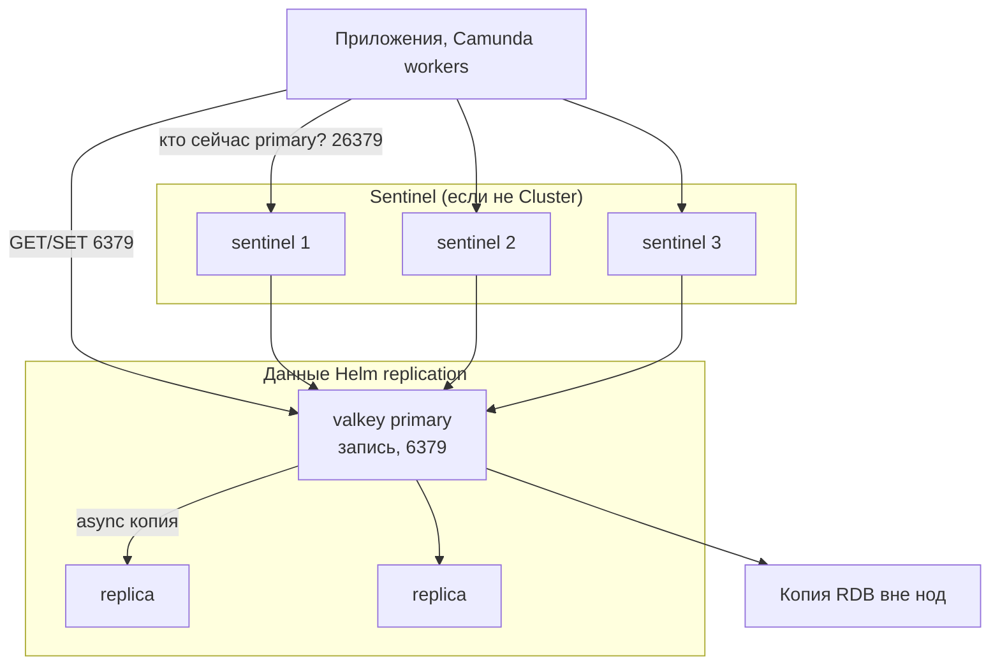

# Valkey 9.1.1 — развёртывание и настройка

Valkey — хранилище ключ–значение в оперативной памяти (форк Redis OSS под Linux Foundation): кэш, сессии, замки, лимиты. Этот документ про **свою установку** версии **9.1.1** (релиз 21 июля 2026; на дату подготовки — последний стабильный патч линии 9.1). Upgrade urgency релиза: **SECURITY**. В 9.1.1 закрыты CVE-2026-56684 (выполнение кода через TLS / `CLIENT KILL` у уже аутентифицированного клиента) и CVE-2026-63639 (выполнение кода через повреждённый stream в RDB). Ставить 9.1.0 «потому что почти то же» нельзя. Это не Redis Stack / Redis Enterprise и не смена лицензии Redis Ltd. 2024 года.

Документация: https://valkey.io/  
Образы: `valkey/valkey:9.1.1`, `valkey/valkey:9.1.1-alpine`, `valkey/valkey:9.1.1-trixie`.  
Лицензия: BSD-3.

На Kubernetes у проекта два официальных пути, и их нельзя путать:

| Путь | Что умеет | Готовность к бою |
|---|---|---|
| Helm-чарт **`valkey-io/valkey-helm`**, чарт `valkey` **0.11.0**, `appVersion` **9.1.1** | Одиночка **или** primary + replica. **Не** Cluster. **Не** Sentinel | Да, как упаковка одиночки/репликации |
| **`valkey-io/valkey-operator`** (релизы до v0.5.0) | Cluster (шарды, слоты, смена primary) | **Нет.** README оператора: *in active development and **not ready for production use***, API `v1alpha1` может сломаться |

Этот текст — не набор команд «скопируй и запусти», а правила, без которых экземпляр не будет одновременно устойчивым к сбоям, масштабируемым и безопасным. Пошаговая установка — в `Valkey.install.md`.

---

## Назначение системы

Valkey нужен, чтобы **ускорять чтение и координировать короткие состояния**: кэш нормализованного ответа API на секунды–минуты, лимит вызовов к внешней службе, замок, идемпотентный ключ консьюмера Kafka, сессия шлюза.

События везёт Kafka. Эталон карточек живёт в озере или СУБД. Процессы ведёт Camunda. Valkey — **слой ускорения**, не слой истины. Если ключ должен пережить падение площадки **без потери** — его место в базе/озере, а Valkey только ускоряет чтение.

Данные живут в **RAM**. Терабайты озера сюда не помещаются: вы упрётесь в память раньше, чем в диск Kafka.

---

## Перечень функций

Что умеет Valkey 9.1.1:

1. **Хранить ключ–значение в RAM** и отдавать GET/SET и структуры вроде Redis.
2. **Копировать данные на replica** асинхронно: primary отвечает клиенту OK, копия догоняет потом. Падение primary до досылки = **потеря уже подтверждённой** записи. Это модель, не баг.
3. **Ждать N replica командой `WAIT`.** Снижает шанс потери, **не** даёт строгую согласованность (это прямо сказано в cluster tutorial).
4. **Менять primary процессами Sentinel** (отдельные процессы, порт **26379**), когда **нет** Cluster. Минимум **3** Sentinel. Два вендор показывает как *DON'T DO THIS*. Чтобы **выполнить** смену, нужна ещё **majority** всех Sentinel.
5. **Резать ключи на шарды (Valkey Cluster):** 16384 слота, минимум **три** primary. Для боя вендор **настоятельно** рекомендует **шесть** узлов (3 primary + 3 replica). Sentinel с Cluster **не сочетают**. Клиентам нужен cluster-aware клиент. Hash tag `{…}` кладёт связанные ключи в один слот (нужно для MULTI/Lua на нескольких ключах).
6. **Снимать снимок (RDB)** и вести журнал (AOF). Политика `everysec` (завод смысла AOF): потерять можно **около 1 секунды**. `always` — очень медленно. Persistence выкл. + авторестарт primary = классический способ **обнулить и primary, и все replica**. Вендор это отдельно запрещает.
7. **Ограничивать RAM** (`maxmemory`) и решать, что вытеснять. Завод политики — **не вытеснять** (`noeviction`): новые записи начинают получать ошибку. Для кэша обычно LRU — это решение, не завод.
8. **Разграничивать доступ ACL.** Старый один пароль (`requirepass`) — совместимость со старым Redis; с файлом ACL он **игнорируется**. Protected mode: если у `default` нет пароля — слушать только localhost.
9. **Шифровать канал TLS.** В документации Valkey при включённом TLS по умолчанию **взаимные сертификаты** клиентов. Cluster bus (порт **клиентский + 10000**, при 6379 это **16379**) по умолчанию **без** прикладной аутентификации: кто дотянулся до порта, тому кластер верит. Закрывать сетью или mTLS (`tls-cluster yes`).
10. **Отдавать команды в основном на одном потоке.** `io-threads` — часть сетевой работы не на одном ядре. Больше CPU ≠ линейный рост без замера.

Чего система **не** делает и часто путают: она не озеро эталона, не шина событий, не BPMN, не строгая согласованность «как синхронный Postgres». Helm replication = копии, **не** смена primary при падении писателя: Sentinel в официальный чарт **не входит**. Cluster из двух primary нет. NAT / проброс портов Docker для Cluster и Sentinel официально не поддерживается. Официального боевого оператора Cluster на Kubernetes нет.

---

## Требования к развёртыванию

### Требования к ПО

| Что | Что ставить | Комментарий |
|---|---|---|
| **Формат поставки** | Контейнеры Docker **или** поды Kubernetes | Официальные образы `valkey/valkey:9.1.1` (также `-alpine`, `-trixie`). |
| **Kubernetes (не Cluster)** | Официальный Helm **`valkey` 0.11.0** | Standalone или primary+replica. **Не** Cluster. **Не** Sentinel. Sentinel ставят отдельными манифестами по `sentinel.conf` из дистрибутива. |
| **Kubernetes (Cluster)** | Официального боевого пути нет | Оператор в README: **not ready for production**. Чарт Cluster **не ставит и не будет ставить**. Третьи чарты (Bitnami и т.п.) — **не** проект Valkey; в этом файле не целевой путь. Cluster на VM по tutorial — отдельное решение **внутри одной площадки**. |
| **ОС** | Linux | Это основной контур. **Боевой Valkey на Windows-хосте в схеме с Kubernetes не предполагается.** |
| **Диск** | Том под RDB/AOF, если persistence включена. Для replication Helm persistence **обязательна** | SSD предпочтителен, чтобы снимок через `fork` не стопорил клиентов. Не NFS. |
| **Лицензия** | BSD-3 | Без RSALv2 как у Redis 7.4. |

Helm 0.11.0 по умолчанию: **нет** persistence на standalone, replica выключены, `minReplicasToWrite: 0`, auth выкл., TLS выкл. Это стенд, не capacity plan.

### Требования к ресурсам

Цифр «сколько гигабайт под ваши ключи» у проекта **нет**. Данные живут в **RAM**. Ниже ориентиры поставщика, не смета закупки.

| Роль | CPU | RAM | Диск |
|---|---|---|---|
| **Primary / replica** | Команды в основном на главном потоке. `io-threads` — опция под замер, не слайд | **Не меньше размера датасета** на каждом primary, плюс запас: репликация, сжатие AOF, `fork()` на больших снимках может задержать клиентов на миллисекунды–секунды (формулировка persistence-документации). `maxmemory` **ниже** лимита контейнера | Диск AOF может быть **больше** датасета. В примере Helm — заглушка **10 ГиБ**. Это не расчёт вашей нагрузки |
| **Sentinel** | Небольшие процессы | Несклад данных | Файл `sentinel.conf` должен быть **записываемый**, иначе Sentinel не стартует |
| **Учебный один контейнер** | Минимальные | Можно не ставить `maxmemory` | Persistence можно выкл.; на бою так нельзя |

Дополнительно:

- Таймаут ноды Cluster в учебнике: **5000** мс. Primary, который **не видит majority других primary** столько же времени, **перестаёт принимать запросы**.
- Пример Sentinel `down-after-milliseconds`: **60000**. Это не «можно любую задержку между площадками».

---

## Основные элементы системы и зависимости

Это одно ПО из **нескольких процессов**. Ниже — те, что живут отдельными инстансами, и как они вызывают друг друга.

### Схема инстансов и потоков



Как читать схему:

1. Клиенты обычным TCP на один Service **не** переживают смену primary. Нужна библиотека Sentinel (спрашивает **26379**) **или** cluster-aware клиент.
2. **valkey** хранит ключи в RAM. Service `valkey` в Helm — это **писатель**. После появления replica запись на `valkey-read` будет ошибкой.
3. Репликация **асинхронная**. `min-replicas-to-write` сужает окно потери, не закрывает его (завод **0**, выкл.).
4. Sentinel в официальный чарт **не входит** — это ваши манифесты. Без Sentinel падение primary = простой записи, пока не `REPLICAOF` руками.
5. Cluster bus (**16379**) — только ноды кластера. Вендор прямо: без изоляции/mTLS чужой узел может перехватить слоты. Firewall: оба порта Cluster обязательны, иначе кластер «не работает как ожидается» (цитата tutorial).
6. Prometheus exporter в официальном Helm: `oliver006/redis_exporter`. Ingress для Valkey как для UI не нужен.

### Что входит в состав

| Топология | Зачем | Запись | Чтение | Автосмена primary |
|---|---|---|---|---|
| **Standalone** | Тест, один процесс | Вертикаль RAM/CPU | Нет отдельной копии | Нет |
| **Replication** (1 primary + N replica) | Копия данных, чтение с replica | **Нет** (один writer) | Да, replica | **Нет само по себе.** Нужен **Sentinel** |
| **Sentinel + replication** | Отказоустойчивость без шардов | Нет | Да | Да, если клиент умеет Sentinel и Sentinel ≥ 3 в независимых зонах |
| **Cluster** (минимум 3 primary) | Шарды + отказоустойчивость шарда | Да (больше primary) | Да (replica слотов) | Да, внутри Cluster. Sentinel **не** используется |

### Официальные порты (менять можно, это контракт сети)

| Порт | Назначение |
|---|---|
| **6379/TCP** | Клиенты и миграция ключей между нодами Cluster |
| **16379/TCP** | Cluster bus (если клиентский порт 6379). Только ноды кластера |
| **26379/TCP** | Sentinel ↔ Sentinel и клиенты, которые спрашивают «кто сейчас primary» |

### Зависимости окружения

- Клиенты, которые понимают выбранную топологию.
- Kubernetes CSI + том «один под — один диск», если PVC зональные. Replica не «переедет» в другой дата-центр со своим диском.
- Сеть 6379 между клиентами и primary; 16379 / 26379 только внутри контура узлов.
- Не проброс портов Docker для Cluster/Sentinel. В Kubernetes — ClusterIP/headless на IP пода.
- Часы относительно нормальные: лаг replica считается по ping/ack.

---

## Краткие вводные

### Как устроена отказоустойчивость

Две **несовместимые** модели. Выбрать одну.

**A) Replication + Sentinel (один набор ключей целиком на каждом узле)**

| Что падает | Что происходит |
|---|---|
| Одна replica | Чтение с неё пропадает; запись на primary жива. Если `min-replicas-to-write ≥ 1` — запись может встать |
| Primary, Sentinel ≥ 3 и majority жива | Смена: replica становится primary. Клиенты **обязаны** спросить Sentinel. Кто продолжает писать в старый IP — пишет в пустоту |
| Majority Sentinel в меньшинстве | Смена **не** стартует (цитата: *never starts a failover if the majority of Sentinel processes are unable to talk*) |
| Два Sentinel | Официально не схема |
| Primary без persistence + Kubernetes сразу перезапустил под | Replica могут **синхронизироваться с пустым** primary и уничтожить данные. Sentinel эту гонку **не лечит**, если primary успевает подняться раньше детекта |

**B) Cluster (данные разрезаны по слотам)**

| Что падает | Что происходит |
|---|---|
| Один primary, у него есть replica | Replica становится primary этого диапазона слотов. Остальные шарды живы |
| Primary **и** его единственная replica | Слоты этого диапазона недоступны. При заводском «нужно полное покрытие» кластер может **отказать в записях вообще** |
| Majority primary недоступна | Кластер недоступен (tutorial: *unavailable when the majority of primaries are unavailable*) |
| Клиент в меньшинстве с одним primary дольше таймаута ноды | Сначала primary ещё принимает записи, потом останавливается; если за это время majority выбрала нового — записи клиента **потеряны** |

Дефолтная схема Cluster для боя: **3 primary + 3 replica**. Падение **одного** узла переживается. Падение узла и его replica «вместе» (один дата-центр, если они в одной зоне) — нет. Replica ≠ backup. `FLUSHALL` копия повторит.

### Как устроено масштабирование

Три разные оси:

1. **Больше RAM / больше ключей** → вертикаль primary **или** шарды Cluster. Озеро «терабайты» сюда не скейлится.
2. **Больше чтений** → replica + клиенты, которые читают с replica и терпят отставание.
3. **Больше записей** → только Cluster (больше primary) **или** несколько **независимых** наборов (кэш сессий отдельно от лимита). Один Sentinel-набор = один писатель.

Сигналы: использованная память, вытесненные ключи, число replica, лаг, отказ записи при `min-replicas-to-write`, состояние кластера, задержка `INFO`.

Горячий набор **влезает в RAM одной машины** (с запасом примерно 2× на снимок/фрагментацию) → Sentinel + 1 primary + ≥2 replica. Не влезает **или** нужна горизонталь записи → Cluster 3+3. На Kubernetes официального боевого оператора Cluster **нет**.

### Безопасность самого Valkey

Компрометация Valkey = компрометация **сессий, токенов, кэша ответов внешних API, замков**. `FLUSHALL` и `CONFIG` опаснее, чем «просто кэш».

| Тема | Факт |
|---|---|
| Bind в `valkey.conf` | `bind 127.0.0.1 -::1`, `protected-mode yes` |
| Helm без `auth.enabled` | Кто достучался до Service 6379 — тот хозяин, если protected-mode снят под Kubernetes |
| Helm + `auth.enabled` | **Обязателен** пользователь `default` в ACL. Иначе, цитата чарта: *anyone can access the database without credentials* |
| Cluster bus | Без сетевой изоляции / mTLS — захват слотов |
| TLS | В доке Valkey при включённом TLS по умолчанию **mTLS** клиентов. Helm: `tls.requireClientCertificate` завод **false** — это уже ослабление относительно документации сервера |
| `rename-command` | Можно спрятать `CONFIG`/`FLUSHALL`; это hardening, не замена ACL |
| 9.1.1 | Без этого патча аутентифицированный TLS-клиент — вектор выполнения кода (CVE-2026-56684) |

«Выставили балансировщик 6379 в интернет без ACL» — это не кэш, это открытая память контура.

---

## Допущения

Ниже то, чего не было в исходном запросе, но без чего нельзя нарисовать конкретную схему. Если допущение неверно — схему надо пересмотреть.

1. **Self-hosted Valkey 9.1.1**, не облачный Redis/Memorystore/ElastiCache и не Redis Enterprise.
2. **Valkey — кэш и координация, не эталон.** В Valkey — TTL-данные, которые можно пересчитать.
3. Бой на Kubernetes, упаковка не-Cluster: официальный Helm **`valkey` 0.11.0**. Sentinel в чарт **не входит**.
4. **Официальный valkey-operator в бой не берём.**
5. Три дата-центра = три независимые зоны отказа. Sentinel официально просит класть 3 процесса на машины, *believed to fail in an independent way*.
6. Цель отказа: пережить **1** дата-центр, не 2 из 3.
7. Задержка неизвестна — пока нет замера на 6379/16379/26379, растягивание Cluster с таймаутом **5000** мс не утверждаем.
8. Нагрузка и размер горячего кэша неизвестны — нет цифры «N ГиБ `maxmemory`».
9. Клиенты микросервисов умеют (или будут уметь) Sentinel **или** Cluster. Иначе отказоустойчивость на бумаге.
10. Persistence в бою включена (AOF `everysec` + периодический RDB — рекомендация вендора «если важны данные»: *use both*). Чистый кэш без диска на Kubernetes конфликтует с безопасностью репликации: kubelet всегда рестартит под.
11. Учебный стенд изолирован. На нём допустима одиночка без пароля *внутри песочницы*.
12. Camunda / Kafka / озеро / интеграционное API — клиенты Valkey, не части сервера.
13. Не используем проброс портов Docker для Cluster/Sentinel.

---

## Критически важные условия, которых нет в исходном контексте

Их нужно закрыть **до** «helm install и забыли».

| Пробел | Почему это ломает решение |
|---|---|
| **Что именно кладёте** (TTL-кэш vs «все клиенты») | RAM и потеря при смене primary. Эталон в Valkey = потеря эталона при одном инциденте |
| **Sentinel или Cluster** | Разные клиенты, порты, модель отказа. Смешать нельзя |
| **Задержка и потери между дата-центрами** | Ложные failover vs долгий детект. Цифры вендор не даёт |
| **Один Kubernetes на три зоны или три кластера** | Зональные тома; majority Sentinel; bus 16379 |
| **Размер горячего набора и политика вытеснения** | Без потолка процесс убивают. С `noeviction` при заполнении **встанет запись** интеграционного API |
| **Клиентские библиотеки** | Без Sentinel/Cluster support смена primary = простой до правки DNS |
| **Персональные данные в кэше** | TTL не отменяет 152-ФЗ. Шифрование тома, ACL, сеть |
| **Нужен ли блок записи без replica** (`min-replicas-to-write`) | 0 = пишем в никуда при обрыве репликации. ≥1 = запись встанет, когда replica отвалятся |
| **Кто владеет FLUSH/CONFIG** | Один админский ACL на все поды CI — способ стереть бой |

---

## Краткое описание ключевых этапов и элементов развертывания

Общий каркас (и тест, и бой):

1. Зафиксировать **9.1.1** (не 9.1.0) и топологию: одиночка / replica / replica+Sentinel / Cluster.
2. Оценить **объём горячих ключей** и TTL. Не «терабайты озера».
3. Persistence: для всего, что жалко потерять на рестарте пода — **AOF+RDB**. На replication — **обязательно**.
4. ACL + сеть **до** первого клиента из общего namespace.
5. Прогнать PING, SET/GET, смену primary (учебную) и убедиться, что **приложение** переключилось, а не только `valkey-cli`.
6. Метрики: память, вытеснение, лаг репликации, состояние кластера / `SENTINEL CKQUORUM`.
7. Только потом — лимиты и замки на боевом интеграционном контуре.

Боевая схема на несколько дата-центров — в `Valkey.install.md`. Ниже — только учебный стенд.

---

### 1 инстанс: тестовый стенд, 1 площадка, без нагрузки

**Цель стенда:** увидеть SET/GET, ACL, шум приложения. **Не** цель: доказать переживание площадки и шарды.

**Путь A — Docker одной командой:**

```text
docker run -d --name valkey-dev \
  -p 127.0.0.1:6379:6379 \
  valkey/valkey:9.1.1
```

Для знакомства. В контейнере процесс обычно слушает все интерфейсы — **не** публиковать порт за пределы песочницы.

**Путь B — Helm `valkey` 0.11.0 standalone** (ближе к оркестратору):

- чарт 0.11.0, образ **9.1.1**;
- `auth.enabled=true` и пользователь `default` с паролем из Secret, даже на тесте, если сеть не air-gap ноутбука;
- persistence можно выкл., понимая: рестарт пода = пустой кэш.

Режим «6 подов Cluster на Minikube» для знакомства **не нужен**, пока оператор в README запрещён для боя: получите ложное чувство отказоустойчивости и другой операционный контур.

#### Что сознательно упрощаем

| Параметр | На тесте | Почему можно |
|---|---|---|
| Sentinel / Cluster | нет | Нет требования пережить primary |
| Replica | 0 | Нет нагрузки на чтение |
| PVC | emptyDir | Данные стенда не жалко |
| mTLS / Cluster bus | нет | Нет 16379 |
| `maxmemory` | можно не ставить | Датасет игрушечный |
| `min-replicas-to-write` | 0 | Нет replica |

#### Чего на тесте **не** стоит упрощать

- Тег **9.1.1** (security).
- Хотя бы один SET/GET из **вашего** сервиса, не только `valkey-cli`.
- Понимание: Service `valkey` в Helm — это **писатель**.
- Не включать replication **без** тома «на поиграть»: Helm и вендор описывают уничтожение данных.

#### Сильные стороны такой схемы

- Часы, не недели.
- Совпадает с официальным образом и Helm standalone.
- Дёшево показывает, упрётся ли интеграционный клиент в один круг до кэша.

#### Слабые стороны (обязательно понимать)

- Нет модели отказа primary.
- Успех GET на стенде **не** доказывает cluster-aware клиент и не доказывает `WAIT`.
- Привычка `auth.enabled=false` уедет в бой.

Практическая рекомендация: препрод = тот же Helm **replication** с томом + ACL + (если цель автосмены) три Sentinel, даже без боевого QPS. Всё это **в одном** дата-центре.

---

## Сводка: что считать «экземпляр готов»

| Требование | Тест (1 площадка) | Бой |
|---|---|---|
| Отказоустойчивость | Не требуется | Либо **≥3 Sentinel в разных зонах** + replica с томом, либо **Cluster 3+3** со replica в других зонах; переживание **1** площадки; клиент умеет смену primary; persistence on. Схема на 2–3 дата-центра — в `Valkey.install.md` |
| Производительность / масштаб | Не требуется | `maxmemory` + явная политика; запись горизонталится только Cluster или несколькими наборами; RAM = размер данных, не «терабайты озера» |
| Безопасность | Пароль, если сеть шире localhost | 9.1.1; ACL + не пустой `default`; 16379 закрыт; TLS; нет публичного 6379; пользователь репликации; нет `auth.enabled` без `default` |

**Не готов к бою**, если: одиночка на три площадки «для HA»; Helm replica без тома; два Sentinel; Cluster из двух primary; `valkey-operator` как бой; `latest` / 9.1.0; 6379 с мира без ACL; эталон клиентов в Valkey; клиенты без Sentinel/Cluster; `min-replicas-to-write 0` при обещании «не потеряем записи»; растянули без замера задержки; ждут, что Valkey заменит Kafka/озеро; ждут строгую согласованность.

---

## Источники (чтобы не принимать на веру)

- Релиз 9.1.1, CVE-2026-56684 / CVE-2026-63639: https://github.com/valkey-io/valkey/releases/tag/9.1.1
- Загрузки, образ `valkey/valkey:9.1.1`: https://valkey.io/download/
- Cluster tutorial: порты, bus без auth, NAT/Docker, 16384 слотов, async + потеря OK, `WAIT` не strong consistency, минимум 3 primary / рекомендация 6 узлов, timeout, покрытие слотов: https://valkey.io/topics/cluster-tutorial/
- Cluster spec: bus, majority, ~1000 узлов как порядок величины: https://valkey.io/topics/cluster-spec/
- Sentinel: ≥3, разные AZ, не 2, quorum vs majority, клиенты, Docker/NAT, async, `min-replicas-to-write` как смягчение, writable `sentinel.conf`, порт 26379: https://valkey.io/topics/sentinel/
- Persistence: RDB/AOF/оба, `everysec` ≈ 1 с, fork: https://valkey.io/topics/persistence/
- Replication: опасность persistence off + авторестарт, в т.ч. с Sentinel: https://valkey.io/topics/replication/
- TLS, `tls-cluster`, `tls-replication`, Sentinel наследует сеть, mTLS по умолчанию: https://valkey.io/topics/tls/
- `valkey.conf` 9.x: `bind`, `protected-mode`, `min-replicas-to-write` завод 0, `maxmemory-policy noeviction`, ACL vs `requirepass`: https://github.com/valkey-io/valkey/blob/9.0/valkey.conf
- Helm `valkey` 0.11.0 / app 9.1.1: нет Cluster, persistence обязательна в replication, ACL `default`, TLS, PDB, `minReplicasToWrite`: https://github.com/valkey-io/valkey-helm/tree/main/valkey
- Operator **not ready for production**: https://github.com/valkey-io/valkey-operator/blob/main/README.md

Утверждения вида «Valkey переживёт два дата-центра» или «N миллисекунд достаточно для Cluster» в документации проекта **отсутствуют** — поэтому в этом файле их нет. Порог задержки нужно измерить у себя на 6379/16379/26379.
