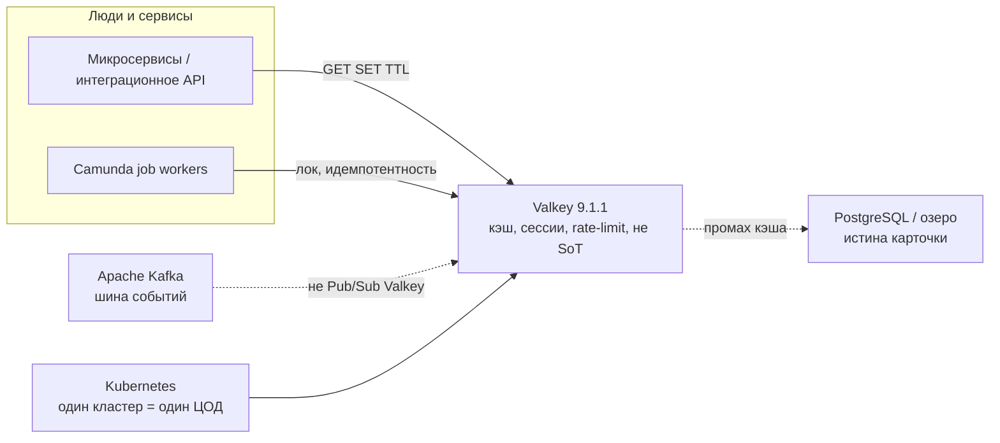
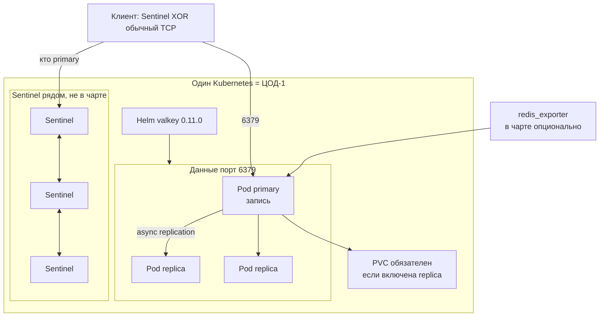
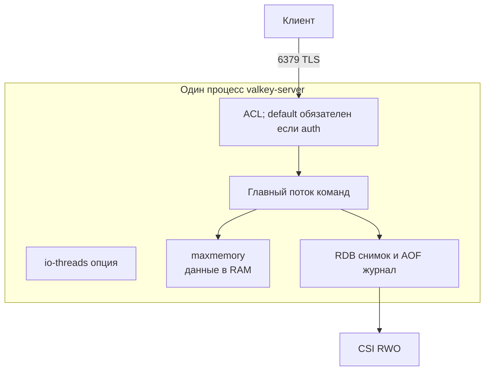
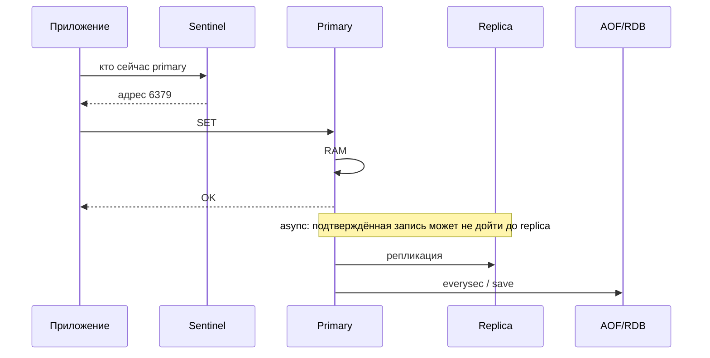
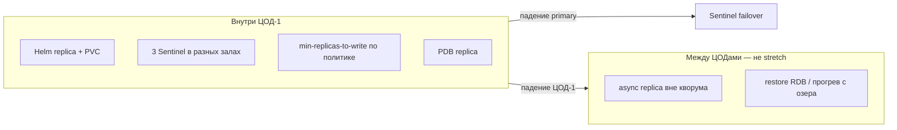
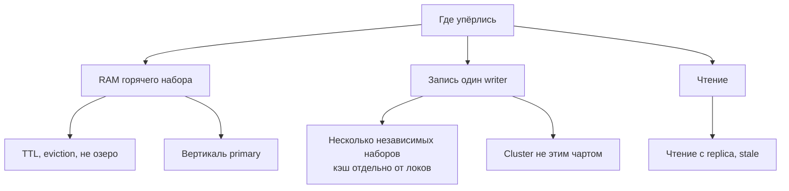
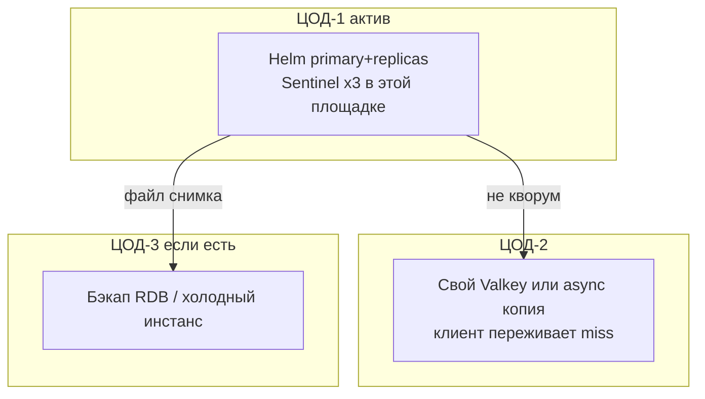

# Valkey 9.1.1 — схемы устройства

Связанные документы: правила — `Valkey.md`; установка — `Valkey.install.md`.

Ниже **C4** (четыре уровня: контекст → контейнеры → компоненты → код). В запросе это «D4»: тот же каркас. Уровень кода пропускаем — для эксплуатации важнее роли, порты и ручки HA/масштаба.

Допущения (их не было в исходном ТЗ платформы, без них схема врёт):

1. Stretch одного Sentinel-набора или Valkey Cluster на 2–3 ЦОДа **нет**. HA — **внутри ЦОД-1**.
2. Self-hosted **Valkey 9.1.1** (BSD-3, форк Redis OSS). На Kubernetes: официальный Helm `valkey` **0.11.0** (`appVersion` 9.1.1) — standalone **или** primary + replicas. **Не** Cluster. Оператор `valkey-operator` в README: *not ready for production*.
3. Valkey — кэш и координация, **не** SoT. Репликация **асинхронная**.
4. Нагрузки нет — на схемах нет «N ядер». Есть *что крутить*, когда цифры появятся.

---

## 1. Контекст (C4 system context)

Valkey **не** было в исходном ТЗ (Kafka / Camunda / озеро / API). Ниже — типичное место: горячий слой перед эталоном.

| Стрелка | Зачем помнить |
|---|---|
| Сервис → Valkey | Кэш ответа API на секунды–минуты, лимит вызовов к ведомству, короткий замок. Не «вся карточка навсегда» |
| Промах → озеро/БД | Если ключ должен пережить падение ЦОДа без потери — его место не здесь |
| Kafka отдельно | Шина фактов остаётся Kafka |

**Слабое место контекста:** три независимых Valkey в трёх ЦОДах без шардирования приложением = три правды сессий.

---

## 2. Контейнеры (из чего состоит решение)

Helm 0.11.0 упаковывает **данные**: 1 primary + N replica. Автосмены primary в чарте **нет**. Для failover рядом ставят Sentinel (отдельные манифесты, порт **26379**) — или принимают ручной `REPLICAOF` / простой записи.

Порты: **6379/TCP** — клиенты и репликация; **26379/TCP** — Sentinel; **16379/TCP** — Cluster bus (этим чартом **не** поднимается). Service `valkey` в Helm — **writer**; запись на `valkey-read` будет ошибкой.

**Сильное:** официальный образ `valkey/valkey:9.1.1` и официальный чарт на replica. **Слабое:** replica.enabled без PVC — сценарий «пустой primary после рестарта съел флот». NAT/NodePort как у веб-приложения ломает Sentinel discovery.

---

## 3. Компоненты внутри инстанса

| Компонент | Для чего настраивать |
|---|---|
| `maxmemory` + policy | Дефолт политики `noeviction`: при заполнении **встанет запись**. Для кэша задать eviction явно |
| AOF `everysec` + RDB | Вендор: если данные жалко — оба. Persistence off + авторестарт kubelet = обнуление replica |
| ACL | Helm без `auth.enabled` + bind 0.0.0.0 = кто достучался, тот хозяин. С auth пользователь `default` **обязателен** |
| `min-replicas-to-write` | Дефолт Helm **0**. ≥1 сужает окно потери, не закрывает его |

`WAIT` не даёт strong consistency — это прямо в cluster tutorial, даже если Cluster вы не ставите.

---

## 4. Поток записи

Без Sentinel клиент, захардкодивший DNS primary, после failover пишет в пустоту. Обычный TCP на один Service **не** переживает смену роли.

---

## 5. Что настраивать: отказоустойчивость

| Ручка | Если не настроить |
|---|---|
| PVC на replication | Helm и вендор: уничтожение данных после рестарта primary |
| 3 Sentinel, не 2 | Failover не стартует без majority. Два процесса официально не схема |
| Клиент Sentinel-aware | HA на бумаге |
| Persistence on primary **и** replica | Классический способ обнулить весь набор |
| `valkey-operator` в прод | README: не готов; API `v1alpha1` может сломаться |
| Cluster через Helm 0.11.0 | Чарт *does not and will not support cluster mode* |

Цель отказа — **1** ЦОД (точнее: 1 нода/зал внутри ЦОД-1). Два ЦОДа из кворума не переживают — и мы кворум на ЦОДы не размазываем.

---

## 6. Что настраивать: масштабируемость

Один Sentinel-набор = **один** writer. Горизонталь записи — либо несколько доменов ключей (разные релизы Helm), либо Cluster **вне** этого чарта (VM / риск третьего инсталлятора). Оператор для шардов в прод не берём. `io-threads` — под замер, не слайд.

Дефолт Helm 0.11.0: persistence на standalone выкл., replica выкл., auth выкл., TLS выкл. Это стенд.

---

## 7. Прод: 2 или 3 ЦОДа без stretch

Клиенты пишут в primary ЦОД-1. Не копировать «как DaemonSet в каждый кластер» без решения по ключам: получите три кэша. Stretch bus 16379 по трём Kubernetes **не** целевой путь.

**Сильное:** heartbeat Sentinel не зависит от межЦОДового RTT. **Слабое:** падение ЦОД-1 = нет кэша, пока restore или прогрев; сессии разлогинятся; идемпотентность внешнего вызова может пробить ведомство повторно.

---

## 8. Безопасность и сильное / слабое

Пин образа **9.1.1** (не 9.1.0): закрыты CVE-2026-56684 (RCE через TLS / `CLIENT KILL` у уже аутентифицированного клиента) и CVE-2026-63639 (RCE через повреждённый stream в RDB).

Слои:

1. Сеть — 6379 только приложениям; 26379 только Sentinel. Не LoadBalancer в интернет.
2. ACL: отдельный replication-user; приложениям не `+@all`. Helm + auth без `default` = *anyone can access without credentials*.
3. TLS к клиентам. Для Cluster (если когда-нибудь) ещё `tls-cluster`: bus по умолчанию без прикладной аутентификации.

| Сильное | Слабое |
|---|---|
| BSD, официальный Helm на replica | Sentinel собираете сами; Cluster чарт не ставит |
| 9.1.1 закрывает свежие RCE | Async: OK клиенту ≠ запись на replica |
| `min-replicas-to-write` сужает окно | Дефолт чарта 0 — легко забыть |
| | Оператор не прод; нет strong consistency |

Источники фактов: `Valkey.md` (Helm 0.11.0, оператор, порты, persistence). Порога RTT у проекта Valkey **нет** — stretch на схемах не рисуем как целевой.
