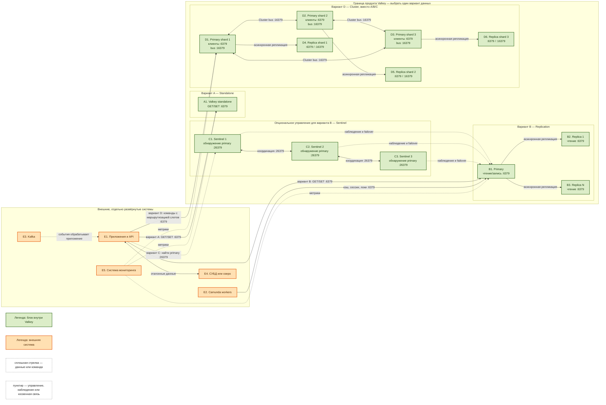

# Valkey 9.1.1 — назначение и архитектура

Valkey — хранилище ключ–значение в оперативной памяти (форк Redis OSS под Linux Foundation): кэш, сессии, замки, лимиты. Рассматривается self-hosted Valkey версии **9.1.1**. Это не Redis Stack и не Redis Enterprise.

Документация: https://valkey.io/  
Лицензия: BSD-3.

---

## Назначение системы

Valkey нужен, чтобы **ускорять чтение и координировать короткие состояния**: кэш нормализованного ответа API на секунды–минуты, лимит вызовов к внешней службе, замок, идемпотентный ключ консьюмера Kafka, сессия шлюза.

События везёт Kafka. Эталон карточек живёт в озере или СУБД. Процессы ведёт Camunda. Valkey — **слой ускорения**, не слой истины. Если ключ должен пережить падение площадки **без потери** — его место в базе/озере, а Valkey только ускоряет чтение.

Данные живут в **RAM**. Терабайты озера сюда не помещаются: вы упрётесь в память раньше, чем в диск Kafka.

---

## Перечень функций

Что умеет Valkey 9.1.1:

1. **Хранить ключ–значение в RAM** и отдавать GET/SET и структуры вроде Redis.
2. **Копировать данные на replica** асинхронно: primary отвечает клиенту OK, копия догоняет потом. Падение primary до досылки = **потеря уже подтверждённой** записи. Это модель, не баг.
3. **Ждать N replica командой `WAIT`.** Снижает шанс потери, **не** даёт строгую согласованность (это прямо сказано в cluster tutorial).
4. **Менять primary процессами Sentinel** (отдельные процессы, порт **26379**), когда **нет** Cluster. Минимум **3** Sentinel. Два вендор показывает как *DON'T DO THIS*. Чтобы **выполнить** смену, нужна ещё **majority** всех Sentinel.
5. **Резать ключи на шарды (Valkey Cluster):** 16384 слота, минимум **три** primary. Для боя вендор **настоятельно** рекомендует **шесть** узлов (3 primary + 3 replica). Sentinel с Cluster **не сочетают**. Клиентам нужен cluster-aware клиент. Hash tag `{…}` кладёт связанные ключи в один слот (нужно для MULTI/Lua на нескольких ключах).
6. **Снимать снимок (RDB)** и вести журнал (AOF). Политика `everysec` (завод смысла AOF): потерять можно **около 1 секунды**. `always` — очень медленно. Persistence выкл. + авторестарт primary = классический способ **обнулить и primary, и все replica**. Вендор это отдельно запрещает.
7. **Ограничивать RAM** (`maxmemory`) и решать, что вытеснять. Завод политики — **не вытеснять** (`noeviction`): новые записи начинают получать ошибку. Для кэша обычно LRU — это решение, не завод.
8. **Разграничивать доступ ACL.** Старый один пароль (`requirepass`) — совместимость со старым Redis; с файлом ACL он **игнорируется**. Protected mode: если у `default` нет пароля — слушать только localhost.
9. **Шифровать канал TLS.** В документации Valkey при включённом TLS по умолчанию **взаимные сертификаты** клиентов. Cluster bus (порт **клиентский + 10000**, при 6379 это **16379**) по умолчанию **без** прикладной аутентификации: кто дотянулся до порта, тому кластер верит. Закрывать сетью или mTLS (`tls-cluster yes`).
10. **Отдавать команды в основном на одном потоке.** `io-threads` — часть сетевой работы не на одном ядре. Больше CPU ≠ линейный рост без замера.

Чего система **не** делает и часто путают: она не озеро эталона, не шина событий, не BPMN, не строгая согласованность «как синхронный Postgres». Replication означает копии, но сама по себе не меняет primary при его отказе. Sentinel и Cluster — разные варианты управления отказом, а не обязательные дополнения друг к другу.

---

## Основные элементы системы и зависимости

Valkey — одно ПО, работающее как один или несколько отдельных процессов; клиентские библиотеки остаются частью приложений. Состав Valkey зависит от **одной выбранной топологии**: standalone, replication, replication + Sentinel либо Cluster. Схема ниже показывает эти варианты рядом для сравнения; она не предписывает запускать их одновременно.

### Схема инстансов и потоков

### Как читать схему

1. **Сначала выберите ровно один путь хранения данных.** A — один процесс; B — один primary и его replica; B+C — та же replication с автоматическим обнаружением отказа и сменой primary; D — Cluster с несколькими шардами. Варианты A, B и D не являются слоями одной обязательной инсталляции.
2. **Цвет показывает владение.** Зелёные блоки находятся в границе продукта Valkey. Оранжевые блоки развёртываются отдельно и остаются внешними системами, даже если активно используют Valkey.
3. **Сплошная стрелка показывает передачу команды или данных.** Клиент отправляет GET/SET на порт 6379. Primary асинхронно передаёт изменения replica. Направление стрелки показывает инициатора или основной поток.
4. **Пунктир показывает управляющую, наблюдаемую или косвенную связь.** Sentinel наблюдает процессы данных и координирует failover; мониторинг собирает метрики; Kafka не пишет данные в Valkey сама — событие получает приложение, и уже оно решает, нужен ли ключ.
5. **Standalone (A)** принимает клиентские команды на 6379 и не содержит отдельной копии. Отказ этого процесса прерывает обслуживание до его возврата или ручного восстановления.
6. **Replication (B)** имеет одного писателя B1. B2 и B3 получают асинхронные копии и могут обслуживать допустимое для приложения чтение с отставанием. Без C смена primary выполняется снаружи или вручную.
7. **Sentinel (C)** не хранит пользовательские ключи и не заменяет replica. Клиент с поддержкой Sentinel спрашивает на 26379, какой процесс сейчас primary, затем подключается к найденному primary на 6379. На схеме показаны три отдельных Sentinel — рекомендуемый минимум из документации.
8. **Cluster (D)** — самостоятельная альтернатива B+C. Cluster-aware клиент подключается к нодам на 6379 и следует перенаправлениям по слотам. Ноды обмениваются состоянием по Cluster bus на 16379. Failover выполняет сам Cluster; Sentinel здесь не используется.
9. **Внешние платформенные системы не становятся частью Valkey.** Kafka остаётся шиной событий, Camunda — движком процессов, СУБД/озеро — источником истины. Потеря Valkey не должна уничтожать эталонные данные.
10. **Схема логическая.** Она показывает роли и потоки, но не задаёт площадки, Kubernetes-объекты, количество дата-центров, ресурсы, порядок установки или конкретную политику безопасности.

### Описание блоков

#### Внешние системы

- **E1. Приложения и API.** Клиенты Redis-протокола, которые создают и читают кэш, сессии, лимиты, замки и короткие координационные ключи. Для B+C библиотека должна понимать Sentinel, для D — слоты и перенаправления Cluster.
- **E2. Camunda workers.** Исполнители шагов процесса могут использовать Valkey для краткоживущего кэша или технических блокировок. Состояние BPMN-процесса остаётся ответственностью Camunda.
- **E3. Kafka.** Внешняя шина событий. Kafka не является replica Valkey и не входит в контур его failover; приложение может записать идемпотентный ключ после обработки события.
- **E4. СУБД или озеро.** Внешний источник эталонных и долговечных данных. Valkey хранит ускоряющую копию или производное значение, которое можно пересоздать.
- **E5. Система мониторинга.** Внешний сборщик метрик и предупреждений. Наблюдает память, вытеснение ключей, задержку, состояние replica, Sentinel или Cluster, но не участвует в клиентском потоке данных.

#### Valkey: процессы данных и управления

- **A1. Valkey standalone.** Один процесс Valkey и один набор ключей. Подходит, когда приемлемы единая точка отказа и вертикальное масштабирование. Технология — сервер Valkey с Redis-совместимым протоколом на 6379.
- **B1. Primary.** Единственный принимающий запись процесс в replication-топологии. Хранит полный набор ключей в RAM, отвечает клиенту и асинхронно передаёт изменения всем replica.
- **B2/B3. Replica.** Полные асинхронные копии набора B1. Служат резервными кандидатами и могут разгружать чтение, если клиент допускает устаревшие данные. Replica — не backup: удаление или `FLUSHALL` также реплицируется.
- **C1/C2/C3. Sentinel.** Отдельные процессы наблюдения и координации. Они определяют недоступность primary, достигают quorum/majority и назначают одну replica новым primary. Пользовательские ключи в Sentinel не хранятся.
- **D1/D2/D3. Primary shard.** Primary-узлы Cluster делят 16384 слота ключей между собой. Каждый процесс отвечает только за свой диапазон и участвует в принятии кластерных решений.
- **D4/D5/D6. Replica shard.** Асинхронные копии соответствующих primary-шардов. При допустимом кворуме Cluster может повысить replica отказавшего шарда до primary.
- **Легенда.** Служебные блоки диаграммы, а не исполняемые компоненты. Они фиксируют значение цвета и линий, чтобы схему можно было читать без внешних пояснений.

### Варианты топологии и технологии

| Топология | Состав | Назначение | Масштабирование записи | Автосмена primary |
|---|---|---|---|---|
| **Standalone** | 1 процесс Valkey | Простой независимый набор ключей | Нет, только вертикально или отдельными независимыми наборами | Нет |
| **Replication** | 1 primary + N replica | Копии данных и масштабирование допустимого чтения | Нет, writer один | Нет сама по себе |
| **Replication + Sentinel** | 1 primary + N replica + минимум 3 Sentinel | Отказоустойчивость одного набора ключей без шардирования | Нет, writer один | Да, при кворуме/majority и совместимом клиенте |
| **Cluster** | Минимум 3 primary; для отказоустойчивости — replica шардов | Шардирование ключей и failover внутри Cluster | Да, по нескольким primary | Да, без Sentinel |

Эти строки — **альтернативы**. Sentinel дополняет только replication. Cluster уже имеет собственные механизмы обнаружения нод, маршрутизации слотов и failover, поэтому Sentinel к нему не добавляется.

Технологическая совместимость:

- Клиент standalone/replication может использовать обычное подключение Redis-протокола к 6379.
- Клиент Sentinel должен поддерживать обнаружение текущего primary через 26379.
- Клиент Cluster должен быть cluster-aware: понимать слоты и ответы перенаправления.
- RDB и AOF относятся к сохранению состояния процессов Valkey, но не превращают кэш в источник строгой истины.
- ACL ограничивает команды и ключи, TLS защищает транспорт. Эти механизмы не меняют выбранную топологию.

### Официальные порты

Порты можно перенастроить, но их значения становятся контрактом между процессами, клиентами и сетью.

| Порт | Кто использует | Назначение |
|---|---|---|
| **6379/TCP** | Клиенты ↔ Valkey; ноды Cluster при миграции ключей | Клиентские команды и передача ключей между нодами Cluster |
| **16379/TCP** | Только ноды Cluster | Cluster bus, если клиентский порт равен 6379 |
| **26379/TCP** | Sentinel ↔ Sentinel; Sentinel-aware клиенты ↔ Sentinel | Координация Sentinel и ответ на вопрос «кто сейчас primary» |

Порт 16379 нужен только варианту Cluster. Порт 26379 нужен только варианту replication + Sentinel. Для standalone и обычной replication основным клиентским портом остаётся 6379.

### Назначение и граница продукта

В границу Valkey входят:

- процессы Valkey standalone, primary, replica и Cluster-узлы;
- процессы Sentinel, если выбран вариант replication + Sentinel;
- протоколы репликации, Cluster bus, управление слотами, RDB/AOF, ACL и TLS самого Valkey.

За границей Valkey остаются:

- бизнес-приложения, API и их клиентские библиотеки;
- Kafka, Camunda, СУБД, озеро, резервное хранилище и система мониторинга;
- оркестратор, сеть, DNS, балансировщики, диски, секреты и выпуск сертификатов.

Valkey отвечает за быстрый доступ к ключам и механизмы выбранной топологии. Он не отвечает за доставку событий, исполнение бизнес-процессов, долговременное хранение эталона, восстановление внешних систем и автоматическое исправление клиента, который не умеет Sentinel или Cluster.

---

## Глоссарий

- **ACL (Access Control List)** — правила, определяющие, какой пользователь может выполнять команды и обращаться к ключам.
- **AOF (Append Only File)** — журнал изменяющих команд Valkey на диске, используемый для восстановления состояния.
- **Cluster-aware клиент** — клиентская библиотека, которая знает о слотах Cluster, нескольких нодах и перенаправлениях.
- **Cluster bus** — внутренний канал обмена состоянием между нодами Cluster; при клиентском порте 6379 использует 16379.
- **Failover** — назначение replica новым primary после признания старого primary недоступным.
- **Hash tag** — часть ключа в фигурных скобках `{…}`, по которой Cluster размещает связанные ключи в одном слоте.
- **LRU (Least Recently Used)** — политика вытеснения давно не использованных ключей при нехватке памяти.
- **Majority** — большинство всех участников, необходимое Sentinel или Cluster для части решений при отказах.
- **Primary** — процесс Valkey, который принимает запись для набора данных или шарда.
- **Quorum** — настроенное количество Sentinel, которые должны согласиться, что primary недоступен.
- **RAM** — оперативная память, где Valkey держит рабочий набор данных.
- **RDB** — снимок набора данных Valkey в определённый момент времени.
- **Redis-протокол** — сетевой протокол команд, совместимый с клиентами Redis для поддерживаемых Valkey операций.
- **Replica** — процесс с асинхронной копией данных primary.
- **Replication** — асинхронное копирование изменений с primary на replica.
- **Sentinel** — отдельный процесс наблюдения, обнаружения primary и координации failover для replication-топологии без Cluster.
- **Shard (шард)** — часть общего набора ключей, закреплённая за отдельным primary в Cluster.
- **Slot (слот)** — одна из 16384 логических групп ключей, распределяемых между primary-нодами Cluster.
- **Standalone** — топология из одного процесса Valkey без replica и встроенного автоматического failover.
- **Strict consistency (строгая согласованность)** — гарантия, при которой все клиенты видят единый актуальный результат; асинхронная replication Valkey такую гарантию не даёт.
- **TLS / mTLS** — шифрование канала; mTLS дополнительно проверяет сертификаты обеих сторон.
- **TTL (Time To Live)** — срок жизни ключа, после которого Valkey удаляет его.
- **`WAIT`** — команда ожидания подтверждения записи заданным числом replica; уменьшает риск потери, но не создаёт строгую согласованность.

---

## Источники

- Релиз Valkey 9.1.1: https://github.com/valkey-io/valkey/releases/tag/9.1.1
- Cluster tutorial: порты, слоты, состав и клиентская маршрутизация: https://valkey.io/topics/cluster-tutorial/
- Cluster specification: устройство Cluster bus, слоты и failover: https://valkey.io/topics/cluster-spec/
- Sentinel: процессы, порт 26379, quorum/majority и требования к клиентам: https://valkey.io/topics/sentinel/
- Replication: асинхронные копии и роль primary/replica: https://valkey.io/topics/replication/
- Persistence: RDB и AOF: https://valkey.io/topics/persistence/
- ACL: https://valkey.io/topics/acl/
- TLS: https://valkey.io/topics/tls/
