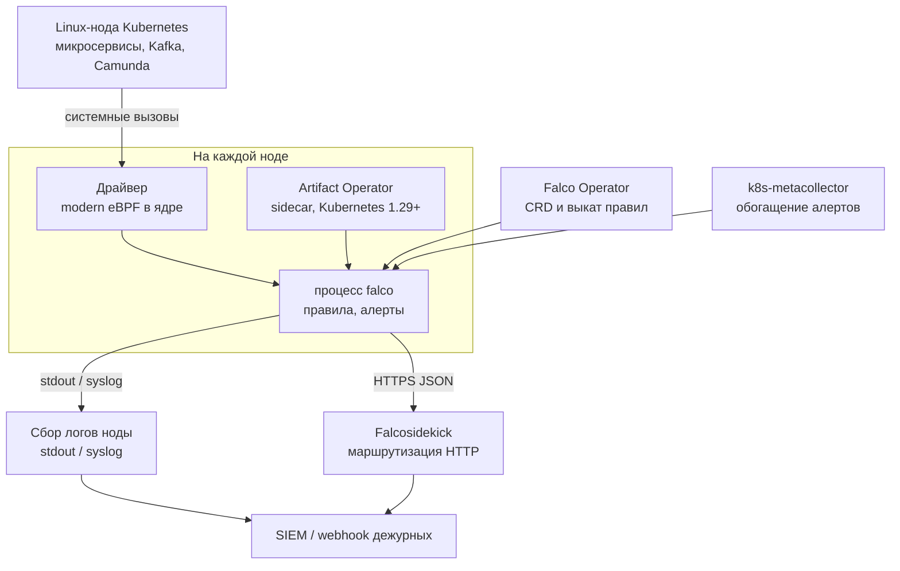

# Falco 0.44.1 — развёртывание и настройка

Falco — агент на каждой Linux-ноде: смотрит, что процесс **уже делает** (запустил shell, открыл чувствительный файл, вышел в сеть), и поднимает тревогу. Сам он **не убивает** под и **не блокирует** системный вызов. Это не WAF, не сканер образов до запуска, не NetworkPolicy и не «кнопка безопасность включена».

Версия, о которой этот документ: **0.44.1** (релиз 11 июня 2026, на дату подготовки — последний стабильный патч линии 0.44).  
Документация: https://falco.org/docs/  
Образ: `falcosecurity/falco:0.44.1` (Docker Hub и `public.ecr.aws/falcosecurity/falco:0.44.1`).  
На Kubernetes официально рекомендуемый способ: **Falco Operator v0.4.1** (с v0.4.0 в матрице оператора default Falco = 0.44.1). Helm-чарт оператора — `falcosecurity/falco-operator` **0.3.0**. Альтернатива: Helm-чарт `falcosecurity/falco` **9.1.0** (тоже ставит 0.44.1).

Этот текст — не набор команд «скопируй и запусти», а правила, без которых система не будет одновременно устойчивой к сбоям, масштабируемой и безопасной. Пошаговая установка — в `Falco.install.md`.

---

## Назначение системы

Falco нужен, чтобы **видеть опасное поведение на уже запущенной ноде**: скомпрометированный контейнер, `kubectl exec` → bash в бою, процесс полез не туда в файловой системе или открыл лишний сокет. Admission-контроллер и сканер CVE это не закрывают: они смотрят образ **до** запуска.

Система **детектирует и пишет алерт**. Она **не** запрещает системный вызов (это seccomp), **не** режет пакеты (NetworkPolicy, WAF, firewall), **не** ходит в государственные сервисы и **не** хранит эталон клиентов. Без приёмника (SIEM / очередь дежурных) экземпляр — логи на ноде, не контур безопасности.

---

## Перечень функций

Что умеет open-source Falco 0.44.1 (по документации проекта):

1. **Читать поток системных вызовов** ядра Linux через драйвер. По умолчанию — **modern eBPF** (программа встроена в бинарник, без сборки модуля под каждое ядро). Нужны возможности ядра: BPF ring buffer и таблица типов BTF (обычно Linux **≥ 5.8**). Альтернатива — модуль ядра (работает на более старых ядрах ≥ 3.10, но требует **полных привилегий** и загрузки модуля на каждую ноду). Старый legacy eBPF **удалён в 0.44** — оставлять его в конфиге нельзя.
2. **Применять правила** (YAML): условие + текст тревоги + приоритет. Макросы и списки, чтобы не копировать одно и то же.
3. **Писать алерт**, не действуя на процесс. Движок реакции (убить под, повесить политику сети) — **другой** проект экосистемы (Falco Talon), в дистрибутив 0.44.1 **не входит**.
4. **Расширяться плагинами**: почти всегда нужны метаданные контейнера (иначе штатные правила с полями контейнера мертвы) и часто контекст Kubernetes (под, namespace, deployment), иначе в алерте «какой-то контейнер на hostname».
5. **Отдавать алерты** в stdout, файл, syslog, программу, HTTP. Встроенного продюсера Kafka/NATS нет. gRPC-выход в 0.44 **удалён**. Маршрутизация в 70+ мест — отдельный сервис Falcosidekick.
6. **Ставить правила и плагины как артефакты** в registry (не файл, зашитый в образ). На Kubernetes это часто делает sidecar оператора (нужен Kubernetes **1.29+** из-за native sidecars).
7. **Работать как DaemonSet**: по одному поду на каждую ноду. Режим обычного Deployment с N репликами для съёма системных вызовов со всех машин **не подходит** (имеет смысл для плагинных источников вроде аудита API-сервера, не для ядра каждой машины).
8. **Сообщать о дропах**: ядро не смогло записать вызов в буфер — Falco его **не увидел**. Это слепая зона, не оптимизация. На очень шумных машинах документация troubleshooting признаёт: дропы могут быть неустранимы.

Чего система **не** делает и часто путают: она не кластер с кворумом на три дата-центра (агент на ноде; падение зала не «выбирает нового лидера Falco»). Не закрывает образ до запуска. Не Kubernetes Audit «кто вызвал API» штатным DaemonSet (это другой источник — audit.log API-сервера). Не ГОСТ-TLS: канал алертов — обычный HTTP или TLS с **валидным** сертификатом (самоподписанный Falco для HTTP-выхода **не** принимает). Гарантии нуля дропов при любой нагрузке нет.

---

## Требования к развёртыванию

### Требования к ПО

| Что | Что ставить | Комментарий |
|---|---|---|
| **Формат поставки** | Контейнеры в Kubernetes (основной бой) **или** пакет/контейнер на Linux-ноде | Официальный образ `falcosecurity/falco:0.44.1`. Для Kubernetes в этом документе — **Operator v0.4.1**. Если кластер **старше 1.29** — не этот оператор (native sidecar), а Helm `falco` **9.1.0**. |
| **Kubernetes** | Свой кластер | Оркестрация подов Falco. Operator: **1.29+**. Чарт `falco` 9.1.0 — если кластер старше (проверять values чарта). Режим для ядра — **только DaemonSet**. |
| **ОС нод** | Linux x86_64 или ARM64 | **Windows-ноды Falco не покрывает** — постоянная слепая зона. |
| **Ядро для modern eBPF** | BTF + BPF ring buffer; для скорости — JIT (`CONFIG_BPF_JIT`, `net.core.bpf_jit_enable=1`) | Без этого modern eBPF не встанет. Для таких нод только модуль ядра — другие привилегии и другой выкат. Смешивать «тихо» нельзя: явное решение по пулу. |
| **Модуль ядра (kmod)** | Kernel headers / готовый модуль, полные привилегии | Только пул, где eBPF физически не встаёт. Least-privilege mode модуль **не умеет**. |
| **CRI** | Сокеты containerd / CRI-O / Docker на ноде | Для плагина контейнера. Без них штатные правила с полями контейнера не работают. |
| **Каталоги хоста** | `/proc`, сокеты runtime в под | Без этого нет нормального контекста процессов. Не монтировать лишнее. |
| **Registry** | Образы и OCI-правила (`ghcr.io` или зеркало) | В закрытом контуре без зеркала поды не стартанут. |
| **Приёмник алертов** | SIEM / syslog / Falcosidekick | Исходящая сеть с нод. Без неё детект есть, учёта нет. |
| **Сертификаты** | Корпоративный PKI для боя | Самоподписанные для HTTP-выхода Falco **не поддерживаются**. |
| **Лицензия** | Open-source Falco, отдельного license-server нет | Sysdig Shield и коммерческие «совместимые» агенты — другое ПО. |

Quickstart-манифест оператора поднимает сразу агента, плагины, Sidekick, UI, Redis и сборщик метаданных Kubernetes. Для знакомства удобно. **Это не боевой манифест** (HTTP, теги `latest`, UI).

### Требования к ресурсам

Официальной таблицы «N CPU / M ГиБ / диск на агент» у проекта **нет**. Нагрузки в исходном запросе не было. Ниже только то, что есть в документации.

| Роль | CPU | RAM | Диск |
|---|---|---|---|
| **Агент на ноде** | Ориентир troubleshooting (с оговоркой авторов): порядка **< ~1–1.5 тысячи событий/с на одно ядро** обычно терпимо, **> ~3 тысяч/с** часто тяжело. Это не смета кластера | Больше кольцевой буфер eBPF → меньше дропов и **больше RAM на каждой ноде** (размер × число буферов). Жёсткий limit CPU (пример «50m чтобы не мешал») → дропы → ложь | Не склад данных. Алерты уезжают в syslog/HTTP. Локальный диск ноды только под логи, если включён файловый выход |
| **Falcosidekick** | Отдельный Deployment, не часть бинарника Falco | Зависит от числа нод и приёмников; в примерах оператора для боя фигурируют **2 реплики** | Не склад |
| **Учебный один DaemonSet** | Мягкие лимиты / без жёсткого throttle | Меньше боевого | Можно без TLS и без отдельного тома |

Дополнительно:

- Userspace Falco обрабатывает основной поток **однопоточно**; слишком широкие правила и лишние плагины создают обратное давление → дропы в ядре.
- «Терабайты в озере» на Falco почти не влияют. Влияет **частота системных вызовов на ноде** (Kafka с большим сетевым/дисковым I/O, Java с частым fork/exec).
- Второй процесс Falco на той же ноде **удваивает** работу ядра, не делит её.
- Memory limit — с запасом под буферы eBPF и таблицы процессов.

---

## Основные элементы системы и зависимости

Это одно ПО из **нескольких процессов**. Ниже — те, что живут отдельными инстансами, и как они вызывают друг друга.

### Схема инстансов и потоков

Как читать схему:

1. Драйвер снимает системные вызовы **этого** ядра. Чужую ноду агент не видит. Поэтому режим — DaemonSet, не «два реплики на кластер».
2. Процесс `falco` применяет правила и пишет алерт. Оператор и sidecar артефактов нужны, чтобы правила и плагины не править руками по SSH на каждой машине. Краткий простой оператора уже запущенный DaemonSet обычно переживает; выкат правил — нет.
3. Плагин контейнера читает сокеты runtime с ноды. Сборщик метаданных Kubernetes — **отдельный** сервис: в quickstart оператора у него **1 реплика**. Это точка отказа **обогащения** (под/namespace), не съёма вызовов. Детект ядра без него жив, алерты деградируют до hostname.
4. Минимум два канала: **логи ноды** (переживают смерть Sidekick) и **HTTP** в Falcosidekick. Sidekick — другое ПО. UI + Redis — удобство, не контур детекта.
5. Клиентов на драйвер и на внутренние сокеты не пускают. Наружу — только алерты по закрытому каналу.

Рядом, но это уже другое ПО: Wazuh/SIEM, NATS, NetworkPolicy, WAF. Их отказ проектируется отдельно. Два хука на одни точки ядра (второй runtime-агент) усиливают нагрузку и спорят за буферы.

### Что входит в состав

| Компонент | Зачем | Как масштабируется |
|---|---|---|
| **Процесс falco + драйвер** | Детект на ноде | По числу нод. DaemonSet сам ставит ещё один агент |
| **Правила / плагины** | Что считать опасным | Выкат артефактом, не «vi на ноде» |
| **Falco Operator** | CRD, рекомендуемый путь на Kubernetes | Не меньше 2 реплик Deployment + PDB; иначе выкат оператора = риск застрявших объектов |
| **Falcosidekick** | Маршрутизация алертов | Не меньше 2 реплик в бою, размазать по зонам **этого** кластера |
| **k8s-metacollector** | Имена подов в алерте | Не равен по критичности брокеру Kafka, но без мониторинга деградирует смысл алертов |

### Порты (контракт сети)

У самого агента нет обязательного «клиентского» порта как у базы. Контракт — исходящие каналы и приёмник.

| Что | Назначение | Кому открывать |
|---|---|---|
| **stdout / syslog** | Запасной канал алертов | Сборщик логов ноды |
| **HTTP(S) на Falcosidekick** (в примерах часто 2801) | JSON-алерты | Только поды Falco → Sidekick. Не LoadBalancer в интернет |
| **Метрики** (если включили scrape) | Дропы, частота событий, CPU | Система мониторинга, не мир |

NetworkPolicy: Falco только на Sidekick; Sidekick только на SIEM. UI наружу не публиковать.

### Зависимости окружения

- Taints пулов (Kafka, Camunda, control-plane): без tolerations DaemonSet **не** встанет на самые важные ноды — слепота как раз там.
- Идентификатор кластера/зала в алерте **до** боя, иначе дежурные увидят три потока без площадки.
- GitOps на правила. Ошибка в overlay может заглушить детект или заспамить дежурных.

---

## Краткие вводные

### Как устроена отказоустойчивость

Это **не** Kafka. Нет копий партиций и нет кворума.

| Что падает | Что происходит |
|---|---|
| Под Falco на ноде | Эта нода **слепая**, пока под не перезапустится. Нагрузка приложений жива |
| Нода целиком | И нагрузка, и Falco мертвы вместе. Это нормально |
| Falcosidekick | Детект на нодах продолжается; HTTP-алерты могут копиться или отваливаться по таймауту выхода. Если настроен ещё stdout/syslog — след не обязан пропасть |
| Один дата-центр из трёх | Ноды других залов мониторятся независимо. «Переключения на другой Falco» нет и не нужно |
| Оператор | Уже запущенные DaemonSet обычно продолжают работать; ломается выкат правил/конфига |
| Сборщик метаданных Kubernetes | Съём вызовов жив; в алерте нет pod/namespace |

Следствие: устойчивость = **под на каждой рабочей Linux-ноде** (включая tainted) + **живой канал алертов** минимум в двух экземплярах + запасной канал (логи ноды). Во время выката DaemonSet часть нод слепая — окно атаки; `maxUnavailable` держать низким (часто 1). PDB для DaemonSet в классическом виде почти бесполезен (по одному поду на ноду).

Приоритет пода высокий: при давлении памяти вытеснить Falco «как BestEffort» = слепая нода. Выбор class — решение эксплуатации; смысл: агент не первый кандидат на evict.

### Как устроено масштабирование

Единица масштаба — **нода**, не «ещё один кластер Falco».

1. Добавили worker → DaemonSet сам поставил агента.
2. Дропы: сначала **сузить правила и набор снимаемых вызовов** (официальный рычаг минимума для движка состояния), потом увеличивать буферы. Для modern eBPF troubleshooting предлагает *эксперимент*: пресет буфера **6 или 7** и несколько CPU на один буфер **4 или 6** на крупных машинах. Это не гарантия, это стартовая ручка.
3. Не ставить на одну ноду второй syscall-агент «для надёжности».
4. Шумные пулы (брокеры Kafka) — отдельные замеры. Если дропы неустранимы — либо слабее охват, либо честный процент слепоты в ожиданиях, не выдуманный SLA.

Действия при дропах в бою: **не** `ignore`. Практичный набор: журнал + алерт. Действие «завершить процесс Falco» превращает перегруз в **гарантированную** слепоту до рестарта — обычно хуже.

Таймаут HTTP-выхода: слишком маленький — потеря алертов при лаге приёмника; слишком большой — Falco тормозит разбор вызовов → дропы. В примере оператора фигурирует 2000 мс как иллюстрация, не закон.

### Безопасность самой Falco

Агент с доступом к системным вызовам всей ноды — **привилегированный наблюдатель**. Если его взломают или отдадут логи/webhook наружу — утечка фактов о процессах и, при широких правилах, о путях и командных строках (там могут быть персональные данные и секреты).

Поэтому «включить quickstart и UI в интернет» — новая поверхность атаки, не контур ИБ.

Опасные значения «из коробки / из примера»:

| Что | Как в примере | Почему опасно |
|---|---|---|
| Quickstart оператора | HTTP на Sidekick, теги `latest`, UI, Redis | Учебный каркас |
| `privileged: true` «на всякий случай» | проще встало | На ядрах с дробными capabilities официальный минимум уже: `CAP_BPF`, `CAP_PERFMON`, `CAP_SYS_RESOURCE`, `CAP_SYS_PTRACE` (иначе ещё `CAP_SYS_ADMIN`) |
| Deployment вместо DaemonSet | «два реплики = HA» | Не покрывает ноды |
| Самоподписанный сертификат HTTP-выхода | «чтобы завелось» | Falco invalid/self-signed **не принимает** |
| `syscall_event_drops: ignore` | тише | Слепота без сигнала |
| Единственный выход — UI | удобно смотреть | В инциденте нужен SIEM/дежурство |
| Talon / kill pod «сразу» | реакция | Ложный exec на интеграционном контуре положит гособмен |

Штатный TLS — не СКЗИ по требованиям КИИ, если ИБ её выдвинет.

---

## Допущения

Ниже то, чего не было в исходном запросе, но без чего нельзя нарисовать конкретную схему. Если допущение неверно — схему надо пересмотреть.

1. Берём **open-source Falco 0.44.1**, не коммерческий совместимый агент.
2. Бой крутится в Kubernetes. Целевой путь — **Falco Operator v0.4.1**. Если Kubernetes < 1.29 — Helm `falco` 9.1.0. Версия вашего кластера в контексте не названа; в соседней инструкции платформы фигурирует 1.36 — тогда оператор допустим.
3. Драйвер боя — **`modern_ebpf`**. Ядра достаточно новые. Древние ядра — явный пул на kmod.
4. Три дата-центра = три домена отказа для **нод**, но Falco не stretch-кластер. Схема следует топологии Kubernetes: один кластер на три зоны **или** три изолированных кластера.
5. Нагрузки нет — нет цифры CPU/RAM «хватит агенту». Есть сигналы дропов и рычаги буферов/правил.
6. Формального SLA на детект нет. «Система 24/7» ≠ «Falco не пропустил вызов».
7. Приёмник алертов будет. Falcosidekick UI **не** замена SIEM.
8. Корпоративный PKI есть или будет.
9. Штатный ruleset — старт, не финиш. На Java/Kafka/Camunda будет шум. Нужен процесс исключений.
10. Реакция kill pod в этом документе **не включается**.
11. Учебный стенд изолирован. HTTP до Sidekick и default rules там допустимы. Каналы вывода и метрики дропов лучше включить сразу.
12. Camunda, Kafka, озеро, интеграционное API — нагрузка и поверхность на тех же нодах, не часть Falco. Их ноды обязаны попасть в DaemonSet.

---

## Критически важные условия, которых нет в исходном контексте

Их нужно закрыть **до** «поставили DaemonSet и забыли».

| Пробел | Почему это ломает решение |
|---|---|
| **Версия Kubernetes** | Operator v0.4.x официально требует **1.29+**. Ниже — другой инсталлятор |
| **Версия и BTF ядер** во всех пулах и залах | Без ringbuf/BTF modern eBPF не встанет. Откат на kmod меняет привилегии |
| **Один Kubernetes на три зала или три кластера** | Один оператор или три независимых контура; как алерты сходятся к одним дежурным |
| **Taints/пулы** (Kafka, control-plane, GPU, Windows) | Без tolerations слепые самые важные ноды. Windows = постоянная слепота |
| **Куда девать алерты** | Без приёмника и дежурства Falco не закрывает «безопасность» |
| **Профиль вызовов / шум нод** | Нет замера частоты и дропов → нельзя сказать, выдержит ли агент соседство с Kafka |
| **ИБ: ГОСТ, персональные данные, срок хранения алертов, запрет privileged** | Меняют TLS, возможность eBPF, куда можно слать командную строку |
| **Политика `kubectl exec` / отладка в бою** | Штатные правила на shell либо орют постоянно, либо их выключат «чтобы не мешали» |
| **Есть ли уже другой runtime-агент** | Два хука на одни точки ядра |

---

## Краткое описание ключевых этапов и элементов развертывания

Общий каркас (и тест, и бой):

1. Зафиксировать **0.44.1** и способ (Operator v0.4.1 *или* Helm `falco` 9.1.0). Userspace 0.44 **несовместим** с драйвером 0.43.
2. Проверить ядро: BTF, ringbuf, BPF JIT.
3. Поставить агент как **DaemonSet**, драйвер **`modern_ebpf`**.
4. Сначала плагин **контейнера**, потом ruleset (порядок оператора: без плагина поля контейнера в правилах мертвы). Для смысла в Kubernetes — ещё метаданные + сборщик.
5. Включить метрики счётчиков ядра и действия на дропы (журнал + алерт, не молчаливый ignore).
6. Настроить выходы алертов **до** объявления «мы под мониторингом».
7. Прогнать контролируемое событие (генератор событий проекта / exec в тестовом поде) и убедиться, что алерт **доехал** до приёмника.
8. Только потом — сужение правил под ваши сервисы.

Боевая схема на несколько дата-центров — в `Falco.install.md`. Ниже — только тестовый стенд.

---

### 1 инстанс: тестовый стенд, 1 площадка, без нагрузки

**Цель стенда:** увидеть алерты, понять шум штатных правил на ваших образах, отладить доставку. **Не** цель: доказать, что бой не пропустит атаку на Kafka-ноде под нагрузкой.

Минимально достаточно:

- пространство имён `falco`;
- Operator (если Kubernetes ≥ 1.29) **или** Helm `falco` 9.1.0;
- один объект Falco / один DaemonSet, драйвер modern eBPF;
- плагин контейнера;
- официальный набор правил (на тесте тег можно ослабить, в бой — **pin**);
- опционально Falcosidekick **1** реплика + UI, HTTP без TLS **только в изолированной сети**.

Режим Deployment с `replicas: 2` для съёма вызовов **не использовать**: ложное чувство устойчивости и не покроет ноды.

#### Что сознательно упрощаем

| Параметр | На тесте | Почему можно |
|---|---|---|
| TLS до Sidekick | нет, если сеть закрыта | Иначе PKI раньше правил |
| Реплики Sidekick | 1 | Нет требования пережить выкат |
| Свои исключения | минимум | Сначала увидеть реальный шум |
| Лимиты CPU | мягкие / без жёсткого throttle | На тесте важнее не получить дропы из cgroup |
| Покрытие control-plane | можно не сразу | На тесте часто одна нода |

#### Чего на тесте **не** стоит упрощать

- Драйвер тот же (`modern_ebpf`), что планируете в бой.
- Метрики дропов включены.
- Хотя бы один выход кроме «человек смотрит `kubectl logs`».
- Проверка: под с `sleep` + `kubectl exec sh` даёт ожидаемый алерт.
- Версия **0.44.1**.

#### Сильные стороны такой схемы

- Поднимается за часы.
- Совпадает с официальным quickstart оператора.
- Дешево показывает шум правил на *ваших* Java/Node образах.

#### Слабые стороны (обязательно понимать)

- Нет модели отказа зала, нет TLS, нет доказанной ёмкости буферов.
- Успешный детект exec на простой ноде **не** доказывает детект на нагруженном брокерном узле.
- UI + Redis приучают «ходить смотреть в Falco»; в инциденте нужен SIEM, не дашборд в пространстве имён `falco`.

Практическая рекомендация: препрод = маленький **боевой профиль** (DaemonSet на все tainted-ноды, TLS, 2 Sidekick, pin версий, свои исключения), даже без боевого трафика. Всё это **в одном** дата-центре.

---

## Сводка: что считать «экземпляр готов»

| Требование | Тест (1 площадка) | Бой |
|---|---|---|
| Отказоустойчивость | Не требуется | DaemonSet на **всех** Linux-нодах с нагрузкой; tolerations; низкий maxUnavailable; Sidekick не меньше 2; запасной канал логов. Схема на 2–3 дата-центра — в `Falco.install.md` |
| Производительность / масштаб | Не требуется | Масштаб = число нод; метрики дропов; буферы и набор вызовов по замеру; не второй агент на ноду; шумные пулы мерить отдельно |
| Безопасность | HTTP только в изоляции | modern eBPF с минимумом capabilities; pin **0.44.1**; HTTPS с валидным сертификатом; нет публичного UI; overlay правил; секреты не в git; NetworkPolicy |

**Не готов к бою**, если: Deployment вместо DaemonSet для вызовов ядра; нет плагина контейнера; тег `latest`; открытый HTTP Sidekick на общей сети; нет tolerations на Kafka-ноды; дропы в режиме ignore; единственный выход — UI; оператор на Kubernetes < 1.29 «как в гайде»; ядро без BTF, а в конфиге modern eBPF «надеемся»; ждут, что Falco *остановит* атаку.

---

## Источники (чтобы не принимать на веру)

- Релиз 0.44.1: https://github.com/falcosecurity/falco/releases/tag/0.44.1
- Анонс 0.44.0 (удаление legacy eBPF, gRPC; несовместимость драйвера с 0.43): https://falco.org/blog/falco-0-44-0/
- Что такое Falco, драйверы: https://falco.org/docs/
- Драйверы, capabilities, BTF/ringbuf: https://falco.org/docs/concepts/event-sources/kernel/
- Дропы: https://falco.org/docs/concepts/event-sources/kernel/dropped-events/
- Troubleshooting буферов, ориентиры событий/с: https://falco.org/docs/troubleshooting/dropping/
- Каналы вывода, запрет invalid/self-signed: https://falco.org/docs/concepts/outputs/channels/
- Operator, DaemonSet vs Deployment, Kubernetes 1.29+: https://falco.org/docs/setup/operator/
- Матрица Operator → Falco 0.44.1: https://github.com/falcosecurity/falco-operator/blob/main/docs/version-matrix.md
- Operator v0.4.1: https://github.com/falcosecurity/falco-operator/releases/tag/v0.4.1
- Helm `falco` 9.1.0: https://artifacthub.io/packages/helm/falcosecurity/falco
- Пакеты, JIT: https://falco.org/docs/setup/packages/
- k8smeta: https://falco.org/blog/falco-k8smeta-plugin/

Утверждения про «Falco переживёт два дата-центра» или «N millicores на брокер» в документации проекта **отсутствуют**. Задержка между залами на путь *детекта* почти не влияет; она влияет на доставку алертов — без порога в миллисекундах, которого у Falco нет.
