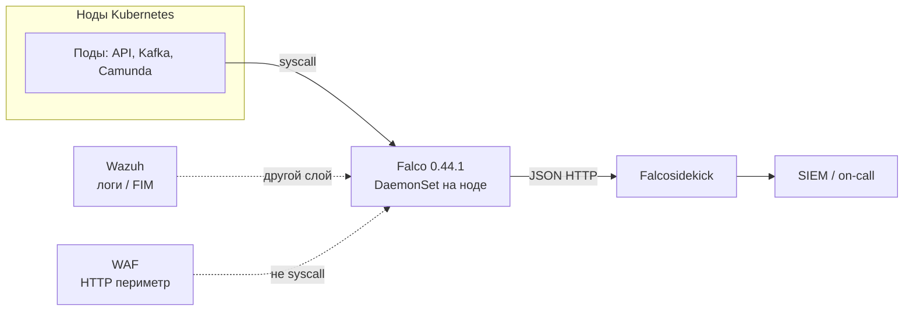
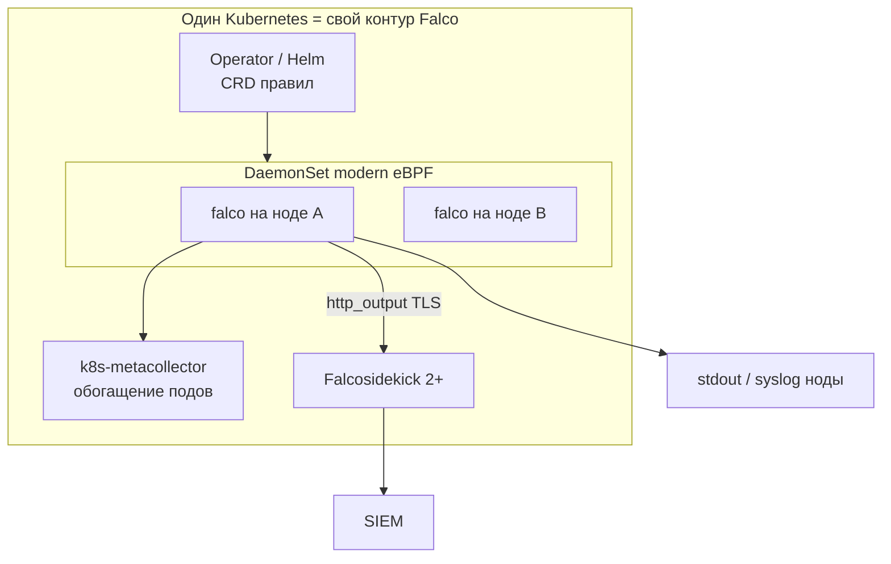
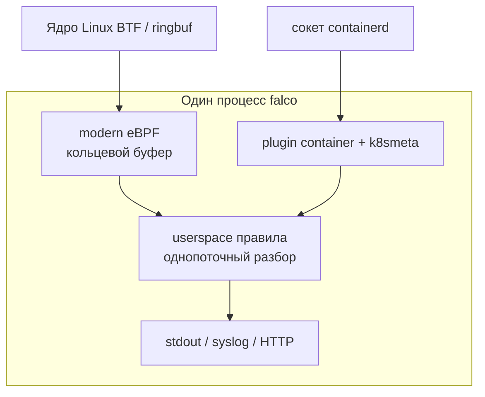
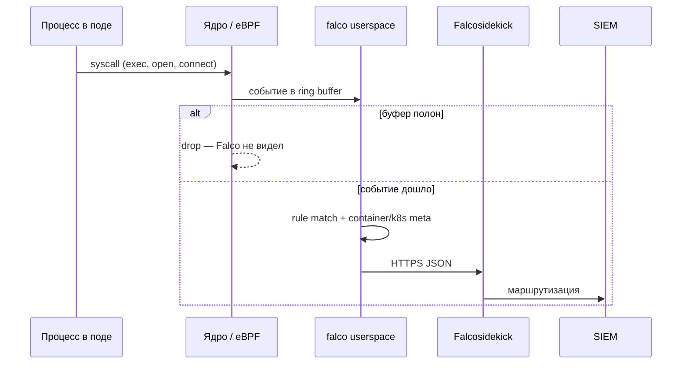
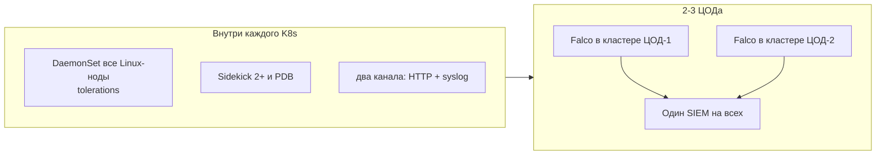
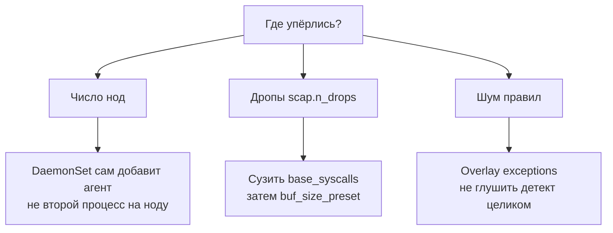
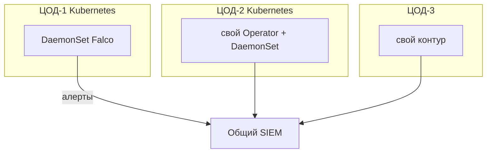

# Falco 0.44.1 — схемы устройства

Связанные документы: правила — `Falco.md`; установка — `Falco.install.md`.

C4 / «D4»: контекст → контейнеры → компоненты. Код eBPF не рисуем.

Допущения:

1. Глобального кластера Falco на 2–3 ЦОДа **нет**. Агент живёт на ноде; stretch не применим.
2. Open-source **0.44.1**, Operator v0.4.1 (K8s ≥ 1.29) или Helm `falco` 9.1.0. Драйвер прода — **modern eBPF**.
3. Нагрузки syscall нет — на схемах нет «N millicores». Есть *что крутить*.

---

## 1. Контекст (C4 system context)

Falco — **runtime-детектор syscalls**. Алертит, не блокирует пакет и не заменяет WAF / NetworkPolicy / сканер CVE.

| Стрелка | Зачем помнить |
|---|---|
| Ядро → Falco | Поток syscalls этой машины. Чужую ноду агент не видит |
| Falco → Sidekick → SIEM | Без приёмника это логи на ноде, не безопасность |
| Wazuh рядом | Хостовые логи/FIM; syscall-поток — у Falco |

**Слабое место контекста:** «один Falco на страну» не существует. Ставить **в каждый** Kubernetes.

---

## 2. Контейнеры (агент, не кворум)

Единица = **DaemonSet**: по одному поду на ноду. Deployment с `replicas: 2` для ядра **не** покрывает ноды и даёт ложное HA.

Падение пода Falco = **эта нода слепая**, нагрузка жива. Падение ЦОДа = нет и нагрузки, и детекта площадки. «Выборов лидера Falco» нет.

**Сильное:** живые ноды других кластеров мониторятся независимо. **Слабое:** без tolerations слепы Kafka/control-plane — самые важные машины.

---

## 3. Компоненты внутри агента

| Компонент | Для чего настраивать |
|---|---|
| modern eBPF | Default 0.44; legacy eBPF **удалён**. Нужны BTF + ringbuf (обычно ядро ≥ 5.8) |
| container plugin | Без него поля `container.*` в штатных правилах мертвы |
| Правила YAML / OCI | Макросы, priority, overlay exceptions под JVM/Kafka |
| buf_size_preset | Больше буфер → меньше дропов, больше RAM |
| kmod | Только если eBPF физически не встаёт; тогда full privileges |

Falco **не убивает** под. Talon — другой проект, в 0.44.1 не входит.

---

## 4. Поток: syscall → алерт

Дроп — слепая зона, не оптимизация. `syscall_event_drops: ignore` в проде нельзя. Self-signed в `http_output` Falco **не** принимает.

---

## 5. Что настраивать: отказоустойчивость

| Ручка | Если не настроить |
|---|---|
| DaemonSet, не Deployment | Часть нод без агента = постоянная слепота |
| Tolerations на tainted | Dedicated Kafka без Falco |
| Sidekick ≥ 2 | Выкат приёмника = потеря HTTP-алертов |
| Запасной syslog | Смерть Sidekick не должна обнулить след |
| Низкий maxUnavailable | Rolling update = окно атаки на слепых нодах |

Оператор ≥ 2 реплик: уже запущенный DaemonSet переживает простой Operator; ломается выкат правил.

---

## 6. Что настраивать: масштабируемость

Масштаб = **число нод**, не «ещё один кластер Falco». Userspace однопоточен; ориентир troubleshooting ~1–1.5k events/s на CPU обычно терпимо, &gt;~3k часто тяжело — не смета, зерно соли. Терабайты озера почти не влияют; влияет syscall-шум Kafka/Java.

---

## 7. Прод: 2 или 3 ЦОДа без stretch

Ставить **в каждый** Kubernetes. Нет глобального Falco-кластера и нет кворума. Правила сводить GitOps'ом, иначе три «правды» SOC.

**Сильное:** RTT между ЦОДами на детект не влияет; blast radius = нода/площадка. **Слабое:** легко забыть включить агент в новом кластере; ошибка ruleset в общем Git — сразу везде, если один выкат на все.

---

## 8. Безопасность (слои)

1. Least privilege (`CAP_BPF` / `CAP_PERFMON` / …), не `privileged: true`; NetworkPolicy Falco → только Sidekick, UI не в интернет.
2. Pin **0.44.1** (драйвер 0.44 ≠ userspace 0.43). Cmdline в алертах может нести ПДн. Falco не *останавливает* атаку — monitoring and detection agent.

Источники: `Falco.md` (DaemonSet, modern eBPF, Sidekick, нет единого кластера). Stretch на схемах не рисуем: модели нет.
