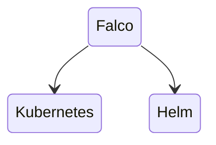
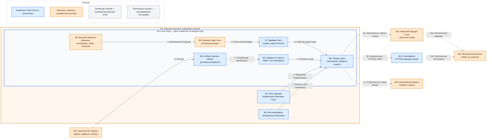

# Falco 0.44.1 — назначение и архитектура

Falco — агент наблюдения за поведением процессов на Linux-нодах. Он получает события ядра, сопоставляет их с правилами и формирует алерты о подозрительной активности. Falco **не блокирует** системные вызовы, не завершает поды и не заменяет WAF, NetworkPolicy, сканер образов или SIEM.

Рассматриваемая версия: **0.44.1**. Официальный образ: `falcosecurity/falco:0.44.1` или `public.ecr.aws/falcosecurity/falco:0.44.1`.

---

## Назначение системы

Falco нужен для обнаружения опасного поведения **после запуска** процесса или контейнера, например:

- запуска shell внутри рабочего контейнера;
- чтения чувствительных файлов;
- запуска неожиданной программы;
- открытия нетипичного сетевого соединения;
- изменения критичных файлов или каталогов;
- поведения, которое соответствует пользовательскому правилу безопасности.

Admission-контроллер и сканер уязвимостей проверяют объект или образ до запуска, а Falco наблюдает фактические действия процесса во время работы. Результат работы Falco — алерт. Реакция на алерт выполняется человеком или отдельной внешней системой.

Falco не предназначен для хранения истории расследований, корреляции событий всей платформы, остановки атак, фильтрации сетевого трафика или интеграции с государственными сервисами. Эти задачи относятся к внешним системам.

---

## Перечень функций

1. **Чтение системных вызовов Linux.** Драйвер получает поток событий ядра той ноды, на которой запущен агент. Основной вариант — `modern_ebpf`: eBPF-программа встроена в Falco и использует BPF ring buffer и BTF. Альтернативный вариант — модуль ядра `kmod`; он требует загрузки модуля и более широких привилегий. Удалённый из ветки 0.44 драйвер legacy eBPF использовать нельзя.
2. **Проверка событий по правилам.** YAML-правила задают условие, приоритет и текст алерта. Макросы и списки позволяют переиспользовать части условий.
3. **Формирование алертов.** Falco сообщает о совпадении с правилом, но сам не воздействует на процесс. Автоматическая реакция, например завершение пода, относится к отдельным системам и не является функцией Falco 0.44.1.
4. **Добавление контекста.** Плагины и интеграции могут добавлять сведения о контейнере, поде, namespace и других объектах. Без такого контекста детектирование ядра продолжает работать, но алерт может содержать только сведения о процессе и ноде.
5. **Вывод алертов.** Встроенные каналы Falco: stdout, файл, syslog, запуск программы и HTTP(S). Встроенного продюсера Kafka или NATS в Falco 0.44.1 нет; gRPC-выход в ветке 0.44 удалён. Для маршрутизации алертов во внешние системы можно использовать отдельный сервис Falcosidekick.
6. **Получение правил и плагинов как артефактов.** Правила и плагины могут распространяться через OCI registry. При использовании Falco Operator доставкой артефактов может заниматься отдельный sidecar.
7. **Наблюдение за каждой нодой независимо.** Для событий ядра нужен отдельный процесс Falco на каждой Linux-ноде. Агент не видит системные вызовы соседней ноды и не образует кворум с другими агентами.
8. **Учёт потерянных событий.** Счётчики дропов показывают, что событие не попало из ядра в обработку. Дроп означает слепую зону, а не штатное масштабирование.

---

## Основные элементы системы и зависимости

### Состав

| Компонент | Назначение | Принадлежность |
|---|---|---|
| **Драйвер событий ядра** | Получает системные вызовы конкретной Linux-ноды | Falco |
| **Процесс `falco`** | Обогащает события, применяет правила и создаёт алерты | Falco |
| **Правила и плагины** | Определяют детекты и доступный событиям контекст | Falco и артефакты экосистемы Falco |
| **Falco Operator** | Управляет объектами Falco и их конфигурацией в Kubernetes | Экосистема Falco, отдельный компонент |
| **Artifact Operator sidecar** | Доставляет правила и плагины из OCI registry | Экосистема Falco, отдельный контейнер |
| **`k8s-metacollector`** | Собирает метаданные Kubernetes для обогащения | Экосистема Falco, отдельный сервис |
| **Falcosidekick** | Принимает HTTP-алерты и маршрутизирует их получателям | Экосистема Falco, отдельный сервис |

Falcosidekick, `k8s-metacollector` и Falco Operator не входят в бинарник `falco`. SIEM, webhook-приёмник, сборщик логов, OCI registry, Kubernetes и система мониторинга являются внешними системами.

### Схема инстансов и потоков

Схема показывает логические инстансы и направления данных, а не обязательный набор включённых интеграций. Пунктирные ветви вывода независимы: можно использовать один или несколько поддерживаемых каналов в соответствии с архитектурой платформы. Наличие Falcosidekick, SIEM, webhook или отдельного канала метрик не является условием запуска движка Falco.

### Описание блоков

#### B1. Kubernetes-кластер

Это внешняя система оркестрации, в которой могут работать ноды и компоненты экосистемы Falco. Варианты взаимодействия: Kubernetes API, CRD, DaemonSet, Deployment и sidecar-контейнеры. Назначение блока — показать границу кластера и то, что агенты привязаны к его Linux-нодам. Kubernetes не является частью Falco.

#### B2. Falco Operator

Это отдельный контроллер экосистемы Falco для управления объектами Falco в Kubernetes. Он использует Kubernetes API и CRD, формирует желаемую конфигурацию и управляет связанными ресурсами. Его назначение — централизованное декларативное управление, а не обработка системных вызовов. Operator не входит в процесс `falco` и не является обязательным output-каналом.

#### B3. `k8s-metacollector`

Это отдельный сервис экосистемы Falco, собирающий метаданные Kubernetes. Он взаимодействует с Kubernetes API и передаёт контекст для плагина `k8smeta`: pod, namespace и сведения о рабочих нагрузках. Назначение — сделать алерт понятнее. Компонент не читает системные вызовы; при его недоступности базовый детект ядра сохраняется, а обогащение деградирует.

#### B4. Linux-нода

Это отдельная машина или виртуальная машина с Linux в составе Kubernetes-кластера. На каждой наблюдаемой ноде существует собственная цепочка «ядро → драйвер → процесс `falco`». Технологические варианты ноды зависят от поддерживаемой Linux-архитектуры и ядра. Нода является внешней средой выполнения, а не частью Falco.

#### B5. Рабочие процессы

Это контейнеры и процессы платформы: микросервисы, Kafka, Camunda и другие нагрузки. Они используют обычные интерфейсы Linux и порождают системные вызовы. Назначение блока — показать источник наблюдаемого поведения. Рабочие процессы не вызывают Falco напрямую и не являются его частью.

#### B6. Ядро Linux

Это ядро операционной системы ноды, выполняющее системные вызовы процессов. Оно предоставляет механизмы eBPF, BPF ring buffer, BTF или загрузку модуля ядра — в зависимости от выбранного драйвера. Назначение блока — источник событий для наблюдения. Ядро Linux является внешней системной зависимостью Falco.

#### B7. Драйвер Falco

Это слой получения событий ядра. Предпочтительный вариант для Falco 0.44.1 — `modern_ebpf`; альтернативный — `kmod`. `modern_ebpf` использует eBPF и кольцевой буфер ядра, а `kmod` загружается как модуль ядра и требует иных привилегий. Драйвер передаёт Falco события только своей ноды и является частью Falco.

#### B8. Процесс `falco`

Это основной userspace-процесс Falco. Он принимает события драйвера, добавляет доступный контекст, вычисляет условия правил и создаёт алерты. Варианты интеграции вывода: stdout, файл, syslog, запуск программы и HTTP(S); они настраиваются независимо. Процесс входит в состав Falco и не содержит встроенного Kafka/NATS-продюсера или механизма блокировки атаки.

#### B9. Правила и плагины

Правила — YAML-описания условий детекта, приоритетов и сообщений. Плагины расширяют источники событий или набор доступных полей; для контейнерного контекста используются интеграции с containerd, CRI-O или Docker через runtime-сокеты, а для Kubernetes-контекста — `k8smeta`. Артефакты могут храниться в OCI registry. Правила являются частью конфигурации Falco, плагины — расширениями Falco.

#### B10. Artifact Operator sidecar

Это отдельный контейнер рядом с управляемым экземпляром, который получает правила и плагины как OCI-артефакты и предоставляет их Falco. Технологии интеграции: OCI registry, Kubernetes native sidecar и общий том контейнеров. Назначение — управляемая доставка артефактов без ручного изменения файлов на каждой ноде. Это компонент экосистемы Falco, но не часть бинарника `falco`.

#### B11. OCI registry

Это внешнее хранилище контейнерных образов и OCI-артефактов. Возможные реализации включают GHCR, публичные registry и корпоративное зеркало с поддержкой OCI. Оно отдаёт образы, правила и плагины по стандартному OCI-механизму. Registry развёртывается и эксплуатируется отдельно от Falco.

#### B12. Сборщик логов

Это внешняя система, которая читает stdout контейнера, журнал ноды или syslog. Возможные варианты — платформенный log collector, syslog-демон или агент доставки логов. Назначение — принять один из настраиваемых каналов алертов и при необходимости переслать его получателю. Сборщик не входит в Falco; этот output-путь опционален.

#### B13. Falcosidekick

Это отдельный сервис экосистемы Falco, принимающий алерты Falco по HTTP(S) в JSON и перенаправляющий их в поддерживаемые внешние системы. Варианты интеграций включают SIEM, webhook и системы сообщений, которые поддерживает конкретная версия Falcosidekick. Назначение — маршрутизация, а не детектирование, долговременное хранение или корреляция. Falcosidekick не входит в бинарник Falco и является опциональной output-интеграцией.

#### B14. Получатель алертов

Это внешняя система, в которой алерты хранятся, ищутся, коррелируются или передаются дежурным. Варианты — SIEM, например Wazuh, или собственный webhook-приёмник платформы. Интеграция может идти через Falcosidekick или через существующий сборщик логов. Получатель не является частью Falco, а конкретный маршрут выбирается отдельно.

#### B15. Система мониторинга

Это внешняя система для сбора технических метрик: частоты событий, дропов, CPU и других доступных показателей. Типовой вариант интеграции — scrape HTTP endpoint системой, совместимой с форматом метрик Falco. Назначение — наблюдаемость самого датчика, а не приём security-алертов. Система мониторинга не входит в Falco; включение метрик является отдельной настройкой.

### Как читать схему

1. Начинайте с блока **B5**. Рабочий процесс не отправляет событие в Falco намеренно: он выполняет обычную операцию, которая превращается в системный вызов ядра **B6**.
2. Драйвер **B7** наблюдает события только ядра своей ноды. Поэтому рамка **B4** повторяется для каждой Linux-ноды: один агент не может наблюдать соседнюю машину.
3. Основной обязательный для детектирования поток внутри ноды отмечен сплошными стрелками: **B5 → B6 → B7 → B8**. Если событие потеряно до обработки, это отражается счётчиками дропов.
4. Блок **B8** сопоставляет событие с правилами **B9**. Плагины могут дополнить событие контейнерными полями и метаданными Kubernetes, но не превращают Falco в средство блокировки.
5. **B10** показывает один из способов доставки правил и плагинов из **B11**. Он относится к управлению артефактами, а не к пути обработки системного вызова.
6. **B2** управляет желаемым состоянием объектов Falco через Kubernetes. Потеря управляющего компонента и потеря агента — разные ситуации: оператор не находится в потоке «ядро → детект».
7. **B3** передаёт Kubernetes-контекст. Если этот поток недоступен, Falco всё ещё может сформировать алерт по событию ядра, но сведения о pod или namespace могут отсутствовать.
8. После создания алерта схема разветвляется пунктиром. **B12**, **B13** и **B15** — настраиваемые направления, а не одновременно обязательные компоненты.
9. Ветка **B8 → B12 → B14** означает вывод в stdout/syslog, сбор существующим агентом логов и дальнейшую передачу получателю.
10. Ветка **B8 → B13 → B14** означает HTTP(S)-передачу JSON в Falcosidekick и дальнейшую маршрутизацию. Falcosidekick не является SIEM и не добавляет Falco способность остановить процесс.
11. Ветка **B8 → B15** относится к техническим метрикам. Она не заменяет доставку алертов и может отсутствовать.
12. Оранжевые блоки развёртываются и сопровождаются отдельно. Синие блоки относятся к Falco или его экосистеме. Цвет не обозначает обязательность: обязательность конкретного потока показывают тип стрелки и пояснения.

### Порты и сетевые потоки

У агента Falco нет обязательного входящего клиентского порта, аналогичного порту базы данных. Сетевой контракт определяется включёнными выходами и интеграциями.

| Поток | Порт / транспорт | Назначение | Обязательность |
|---|---|---|---|
| `falco` → stdout | Локальный stdout | Вывод алертов в журнал контейнера | Опционально |
| `falco` → syslog | Локальный или настроенный syslog | Вывод алертов сборщику логов | Опционально |
| `falco` → Falcosidekick | HTTP(S), в примерах часто **2801/TCP** | Передача JSON-алертов | Опционально; порт зависит от конфигурации Sidekick |
| Falcosidekick → получатель | Зависит от выбранной интеграции | Доставка во внешнюю систему | Опционально |
| Мониторинг → endpoint метрик | HTTP, порт задаётся конфигурацией | Scrape технических метрик | Опционально |
| Artifact sidecar → OCI registry | HTTPS, обычно **443/TCP** | Получение правил и плагинов | Только при использовании OCI-доставки |
| Компоненты управления → Kubernetes API | HTTPS, обычно **6443/TCP** у API server | Чтение и изменение объектов Kubernetes | Только для Kubernetes-интеграций |
| `falco` → runtime-сокет | Unix domain socket, без TCP-порта | Контейнерный контекст containerd / CRI-O / Docker | Только при включённой runtime-интеграции |

Номер 2801 — распространённый пример порта Falcosidekick, а не обязательный порт Falco. Порты внешнего SIEM, webhook, syslog, registry и мониторинга определяются конфигурацией этих систем.

---

## Ограничения и границы ответственности

- Falco наблюдает Linux-ноду, но не покрывает Windows-ноды.
- Falco формирует алерт, но не выполняет active response. Falco Talon и другие механизмы реакции — отдельные продукты.
- DaemonSet агентов не является распределённым кластером: между агентами нет лидера, репликации данных или кворума.
- Falcosidekick маршрутизирует сообщения, но не заменяет SIEM.
- UI Falcosidekick не является обязательным элементом детекта или output-канала.
- Потеря событий ядра возможна при перегрузке; её показывают счётчики дропов.
- Встроенных output-интеграций с Kafka и NATS нет. При необходимости используется внешний маршрутизатор с поддерживаемой интеграцией.
- HTTP(S), stdout, syslog, файл и программа — варианты вывода. Документ не назначает ни один опциональный output обязательным.
- Второй процесс Falco на той же ноде не делит поток событий и не создаёт горизонтальное масштабирование обработки этой ноды.

---

## Глоссарий

| Термин | Определение |
|---|---|
| **Active response** | Автоматическое действие в ответ на алерт, например завершение процесса или изменение сетевой политики. |
| **Admission-контроллер** | Компонент Kubernetes, который проверяет или изменяет объект до его сохранения и запуска. |
| **Алерт** | Сообщение Falco о том, что событие совпало с правилом. |
| **API** | Программный интерфейс, через который компоненты обмениваются запросами и данными. |
| **Artifact Operator sidecar** | Контейнер экосистемы Falco для доставки правил и плагинов как OCI-артефактов. |
| **BPF** | Механизм ядра Linux для безопасного выполнения ограниченных программ в ядре. |
| **BPF ring buffer** | Кольцевой буфер ядра для передачи событий из eBPF-программы userspace-процессу. |
| **BTF** | Метаданные о типах ядра Linux, используемые переносимыми eBPF-программами. |
| **Container runtime** | Программа, которая запускает контейнеры; примеры: containerd, CRI-O и Docker. |
| **CRI** | Стандартный интерфейс Kubernetes к среде выполнения контейнеров. |
| **CRD** | Пользовательский тип ресурса, расширяющий Kubernetes API. |
| **DaemonSet** | Контроллер Kubernetes, обеспечивающий запуск пода на каждой подходящей ноде. |
| **Deployment** | Контроллер Kubernetes, поддерживающий заданное число взаимозаменяемых реплик приложения. |
| **Драйвер Falco** | Компонент, который получает события ядра и передаёт их процессу `falco`. |
| **Дроп** | Событие ядра, потерянное до обработки Falco. |
| **eBPF** | Расширенный механизм BPF для выполнения проверенных программ внутри ядра Linux. |
| **Falco Operator** | Контроллер экосистемы Falco для декларативного управления Falco в Kubernetes. |
| **Falco Talon** | Отдельный проект автоматической реакции на события; не входит в Falco. |
| **Falcosidekick** | Отдельный сервис маршрутизации алертов Falco во внешние системы. |
| **gRPC** | Протокол удалённых вызовов; output через gRPC удалён из Falco 0.44. |
| **HTTP(S)** | Протокол передачи данных; HTTPS — HTTP поверх TLS. |
| **JSON** | Текстовый формат структурированных данных, используемый для передачи алертов. |
| **`k8smeta`** | Плагин для добавления к событиям метаданных Kubernetes. |
| **`k8s-metacollector`** | Сервис, собирающий метаданные Kubernetes для `k8smeta`. |
| **Kafka** | Внешняя распределённая платформа потоковой передачи событий; не является частью Falco. |
| **`kmod`** | Драйвер Falco в форме загружаемого модуля ядра Linux. |
| **Kubernetes** | Система оркестрации контейнерных приложений. |
| **Legacy eBPF** | Старый eBPF-драйвер Falco, удалённый в ветке 0.44. |
| **Linux-нода** | Машина с Linux, на которой выполняются процессы и локальный агент Falco. |
| **Макрос Falco** | Именованный переиспользуемый фрагмент условия правила. |
| **Метрика** | Числовой технический показатель состояния или работы компонента. |
| **`modern_ebpf`** | Современный eBPF-драйвер Falco со встроенной в бинарник eBPF-программой. |
| **Namespace** | Логическая область имён Kubernetes для группировки и изоляции объектов. |
| **NATS** | Внешняя система обмена сообщениями; встроенного NATS-продюсера у Falco нет. |
| **NetworkPolicy** | Правила Kubernetes для ограничения сетевого взаимодействия подов. |
| **Нода** | Отдельная машина или виртуальная машина в кластере. |
| **OCI** | Набор открытых стандартов форматов и распространения контейнерных образов и артефактов. |
| **OCI registry** | Хранилище, совместимое с OCI и выдающее образы или другие артефакты. |
| **Output** | Настроенный канал, через который Falco выводит алерты. |
| **Плагин Falco** | Расширение, добавляющее источник событий или дополнительные поля. |
| **Под** | Минимальная единица запуска контейнеров в Kubernetes. |
| **Правило Falco** | YAML-описание условия детекта, приоритета и текста алерта. |
| **Runtime-сокет** | Локальный Unix domain socket для взаимодействия с container runtime. |
| **Scrape** | Периодическое чтение endpoint метрик системой мониторинга. |
| **Sidecar** | Дополнительный контейнер в том же поде, обслуживающий основной контейнер. |
| **SIEM** | Внешняя система хранения, поиска и корреляции событий информационной безопасности. |
| **Syslog** | Стандарт передачи и хранения системных журналов. |
| **Системный вызов** | Запрос процесса к ядру Linux на операцию с файлом, сетью, памятью или другим ресурсом. |
| **TLS** | Протокол шифрования и проверки подлинности сетевого соединения. |
| **Unix domain socket** | Локальный файловый сокет для обмена данными между процессами одной системы. |
| **Userspace** | Область выполнения обычных процессов вне ядра операционной системы. |
| **WAF** | Межсетевой экран для анализа и фильтрации HTTP-трафика веб-приложений. |
| **Webhook** | HTTP endpoint, принимающий уведомления от другой системы. |
| **Wazuh** | Один из возможных внешних SIEM-получателей алертов. |
| **YAML** | Текстовый формат конфигурации, в котором описываются правила Falco. |

---

## Источники

- Релиз Falco 0.44.1: https://github.com/falcosecurity/falco/releases/tag/0.44.1
- Изменения Falco 0.44.0, включая удаление legacy eBPF и gRPC output: https://falco.org/blog/falco-0-44-0/
- Основная документация Falco: https://falco.org/docs/
- Источники событий ядра и варианты драйверов: https://falco.org/docs/concepts/event-sources/kernel/
- Потерянные события: https://falco.org/docs/concepts/event-sources/kernel/dropped-events/
- Каналы вывода: https://falco.org/docs/concepts/outputs/channels/
- Falco Operator и модели запуска: https://falco.org/docs/setup/operator/
- Матрица версий Falco Operator: https://github.com/falcosecurity/falco-operator/blob/main/docs/version-matrix.md
- Falco Operator v0.4.1: https://github.com/falcosecurity/falco-operator/releases/tag/v0.4.1
- Плагин метаданных Kubernetes: https://falco.org/blog/falco-k8smeta-plugin/
