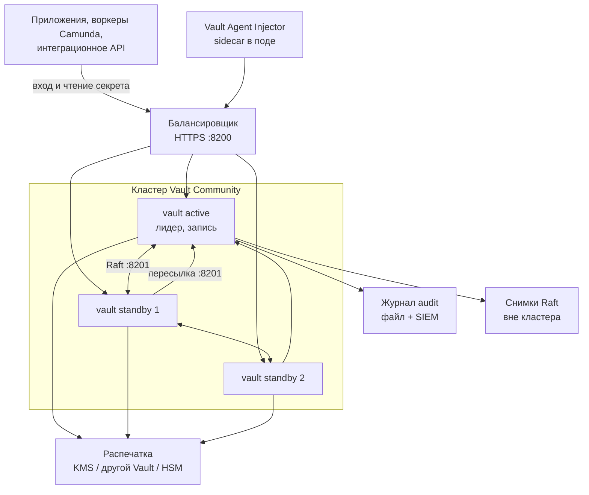

# HashiCorp Vault 2.0.4 — развёртывание и настройка

Vault — хранилище секретов и ключей: пароли баз, сертификаты, ключи шифрования. Приложение доказывает, кто оно, и получает **короткий** допуск, а не вечный пароль из git. Это не озеро клиентских карточек, не шина событий и не замена WAF / Falco / NetworkPolicy.

Версия, о которой этот документ: **2.0.4** (релиз 4 августа 2026, на дату подготовки — последний стабильный патч линии 2.0).  
Документация: https://developer.hashicorp.com/vault/docs  
Релиз: https://github.com/hashicorp/vault/releases/tag/v2.0.4  
Официальный путь на Kubernetes: Helm-чарт **hashicorp/vault 0.34.1** (версия приложения **2.0.4**).  
Образы: Community — `hashicorp/vault:2.0.4`; Enterprise — `hashicorp/vault-enterprise` с тегом линии `2.0.4-ent` (зафиксировать digest, не `latest`).

Этот текст — не набор команд «скопируй helm install», а правила, без которых система не будет одновременно устойчивой к сбоям, масштабируемой и безопасной. Пошаговая установка — в `HashiCorp Vault.install.md`.

---

## Назначение системы

Vault нужен, чтобы **секреты жили в одном месте** и выдавались по политике: динамический пароль в PostgreSQL, сертификат на сервис, расшифровать поле без хранения самих данных. Микросервис, воркер Camunda или интеграционный адаптер входит по роли Kubernetes (или AppRole) и читает только свой путь.

Система **хранит секреты и ключи**. Она **не** хранит эталон клиентов, **не** заменяет Kafka, **не** оркестрирует BPMN и **не** ходит в государственные сервисы. Клиентские карточки остаются в озере; при необходимости чувствительное поле шифруется через движок transit, шифротекст лежит в озере, ключ — в Vault.

---

## Перечень функций

Что умеет self-hosted Vault Community 2.0.4 (по документации HashiCorp):

1. **Хранить секреты** движками: KV (ключ-значение), database (выпускает пароль в СУБД и умеет отозвать), pki (выпускает сертификаты), transit (шифрует байты, сами данные не хранит).
2. **Пускать клиента только после входа**: Kubernetes (JWT пода), AppRole (идентификатор + секрет для машин не из Kubernetes), OIDC/LDAP для людей. Без метода входа любой с адресом Vault — никто.
3. **Ограничивать путь политикой**: «этому токену можно читать `secret/data/app/*` и больше ничего». Это не NetworkPolicy Kubernetes.
4. **Выдавать короткий токен** со сроком жизни. У динамических секретов есть аренда: Vault умеет отозвать.
5. **Держать данные запечатанными** после старта: файлы на диске есть, мастер-ключ в памяти нет, API почти мёртв. Распечатать — вручную долями (Shamir: часто 5 долей, порог 3) или автоматически (облачный KMS, HSM, другой Vault).
6. **Хранить состояние встроенным Raft** (Integrated Storage). Отдельный Consul для нового кластера HashiCorp не рекомендует. В кластере **один** лидер принимает запись; остальные запасные почти все запросы **пересылают** лидеру (в Community).
7. **Снимать снимок Raft** вручную (`vault operator raft snapshot save/restore`). Автоснимки по расписанию — **только Enterprise**.
8. **Писать журнал доступа** (audit): кто что спросил. Чувствительные поля хешируются. Если Vault **не может записать** ни на одно включённое устройство журнала — **отказывается обслуживать запрос**. Это задумано.
9. **Слушать клиентов на 8200** и разговаривать узлам между собой на **8201** (Raft, пересылка, своя взаимная TLS).
10. **Подставлять секреты в поды** отдельными программами: Agent Injector (sidecar по аннотации), Secrets Operator (кладёт в обычный Kubernetes Secret — секрет оказывается в etcd), CSI (в чарте сервера по умолчанию выключен).

Чего система **не** делает и часто путают: она не озеро данных (терабайты персоналки в KV — путь убить файловую базу Raft), не шина, не BPMN, не интеграция с ведомствами. В Community **нет** репликации кластера на другой дата-центр «из коробки» (Performance / DR replication — Enterprise) и **нет** запасного узла, который сам обслуживает чтения. Добавление узлов Raft **не** ускоряет запись: пишет один лидер. ГОСТ-криптографии нет. Шифрование etcd Kubernetes — конфиг API-сервера, не Vault: если оператор кладёт секреты в Kubernetes Secret без encryption-at-rest, они лежат как есть (base64 ≠ шифр).

---

## Требования к развёртыванию

### Требования к ПО

| Что | Что ставить | Комментарий |
|---|---|---|
| **Формат поставки** | Контейнеры в Kubernetes **или** виртуальные машины | Официальный образ `hashicorp/vault:2.0.4`. Для Kubernetes в этом документе — Helm-чарт **0.34.1**. Чарт ставит StatefulSet, но **не** делает за вас init, распечатку, бэкап и обновление (прямо сказано в руководстве). |
| **Kubernetes** | Свой кластер, Helm 3.6+ | Anti-affinity в чарте = **отдельная нода на каждый под Vault**. 5 серверов → минимум 5 нод в пуле. HashiCorp в hardening предпочитает меньше соседей на ноде; их Kubernetes-гайд: по возможности выделенный кластер / пул нод. Дефолт чарта — **один** сервер и файловый бэкенд: Security Warning, не бой. |
| **ОС** | Linux x86_64 или ARM64 | Это основной контур. **Боевой Vault на Windows-хосте в схеме с Kubernetes не предполагается.** |
| **Хранилище** | Только Integrated Storage (Raft) для новой установки | Путь данных — **локальный SSD/NVMe**, не NFS и не общая папка на троих. Consul как бэкенд официально ещё жив, но это *ещё один* кластер для сопровождения; здесь не предлагаем. |
| **Часы** | NTP на всех машинах | TTL токенов и даты в сертификатах PKI завязаны на время; сильный разъезд ломает смену лидера. |
| **PKI** | Свой CA для TLS на 8200 в бою | Между узлами взаимную TLS на 8201 Vault согласует сам после присоединения. Завершать TLS на Ingress и дальше открытым текстом HashiCorp для боя **не** рекомендует. |
| **Журнал** | Отдельный том под audit + второй приёмник (syslog/сокет) | Один файл на диске ОС = риск: диск 100% → Vault встаёт. |
| **Лицензия** | Community без отдельного license-server | Enterprise — другой образ, другая операционка (репликация, HSM, пространства имён Vault, автоснимки). Юридические ограничения BSL Community служба должна проверить отдельно. |

Режим `vault server -dev` (память, всё открыто, root на экране) в этот документ не входит.

### Требования к ресурсам

Цифр «сколько ядер на ваши терабайты озера» у проекта **нет**: нагрузка Vault — *число запросов к секретам*, не объём озера. Ниже ориентир HashiCorp reference architecture, не смета закупки.

| Размер | CPU | RAM | Диск |
|---|---|---|---|
| **Small** | **2–4 ядра** | **8–16 ГБ** | **100+ ГБ**; IOPS от **3000**, скорость от **75 МБ/с** |
| **Large** | **4–8 ядер** | **32–64 ГБ** | **200+ ГБ**; IOPS от **10000**, скорость от **250 МБ/с** |

Дополнительно:

- Для облака вендор запрещает burstable типы (t2/t3 и аналоги).
- В Helm-гайде для small-кластера пример requests: **8 ГиБ RAM / 2000m CPU**, limit memory **16 ГиБ**.
- Магнитные диски вендор прямо называет сильным штрафом к скорости. **Не NFS** как каталог Raft.
- В Kubernetes том не умеют уменьшить — размер сразу с запасом.
- Swap на нодах пула Vault: **выключен** (проверить, не верить). При Raft HashiCorp рекомендует `disable_mlock = true` (иначе файловая база раздувает память и ловит OOM). Helm-чарт так и ставит, если не переопределить.

---

## Основные элементы системы и зависимости

Это одно ПО из **нескольких процессов**. Ниже — те, что живут отдельными инстансами, и как они вызывают друг друга.

### Схема инстансов и потоков

Как читать схему:

1. Клиенты (люди, сервисы, sidecar) ходят на **8200**. На **8201** клиентов не пускают: это разговор узлов между собой.
2. Запрос может попасть на запасной узел. В Community запасной **пересылает** почти всё лидеру и возвращает ответ. Клиенту «всё равно, на какой под попал», если балансировщик и пересылка живы.
3. **Лидер один.** Добавить десятый под запись не ускорит: узкое место — диск лидера и сеть до большинства голосующих.
4. После рестарта пода данные на диске есть, но без распечатки API почти мёртв. На Kubernetes поды переезжают часто: без автоматической распечатки каждый переезд — звонок людям с долями.
5. Журнал доступа — не «удобство». Некуда писать → Vault **сам отказывается** обслуживать. Снимки уезжают **вне** этих дисков: копии Raft спасают от падения **машины**, не от «удали секрет» и не от гибели всей площадки.

Рядом, но это уже другое ПО: балансировщик с проверкой `/v1/sys/health`, KMS/HSM/второй маленький Vault для распечатки, SIEM под журнал, бакет для снимков, Vault Secrets Operator (другой чарт). Их отказ проектируется отдельно.

### Что входит в состав

| Компонент | Зачем | Как масштабируется |
|---|---|---|
| **Сервер `vault`** | API, политики, движки, Raft, печать | Нечётное число голосующих, типично **5** в бою (пережить 2 узла) или **3** (пережить 1). Запись не масштабируется числом узлов |
| **CLI `vault`** | Init, распечатка, политики, снимок | Тот же бинарник, без своего склада |
| **UI** | Веб-консоль | Включается отдельно; для API не обязательна |
| **Injector** | Sidecar-секреты в поды | Несколько реплик webhook; если он мёртв — новые поды с аннотациями не создаются |
| **Движки и методы входа** | KV, database, pki, transit, Kubernetes, AppRole | Включаются **на кластере**, не «галочка HA» |

### Порты (контракт сети)

| Порт | Назначение | Кому открывать |
|---|---|---|
| **8200/TCP** | API клиентов, присоединение узла | Клиенты через балансировщик; узлы Vault друг другу. Не мир без TLS |
| **8201/TCP** | Raft, пересылка на лидера, репликация между узлами | Только узлы Vault |

Балансировщик смотрит **`/v1/sys/health`**, не «TCP 8200 открыт»: коды различают запечатан / запасной / лидер.

### Зависимости окружения

- Стабильный DNS или IP каждой ноды на 8200/8201.
- В Kubernetes том с режимом «один под — один диск» на данные Raft и отдельно на журнал. Общий диск на троих ломает Raft.
- Идентификация: приложения — свои роли и политики; люди — не root-токен в ежедневной работе. Root после первичной настройки **отзывают**.
- Место для снимков, которое **переживает** гибель этой площадки.

---

## Краткие вводные

### Как устроена отказоустойчивость

Это **похоже на etcd**, не на агента на каждой ноде. Нет большинства голосов → **нет записи** (новые секреты, вход, смена политик).

| Что падает | Community, один Raft-кластер |
|---|---|
| Под-лидер | Выборы, запасной становится лидером. Короткий разрыв записи. Клиенты должны переживать 5xx повтором |
| 1 из 3 узлов | Большинство 2 — живо |
| 1 из 5 узлов (или 2 из 5) | Большинство 3 — живо. Официальный «идеальный размер» — **5**, чтобы пережить **2** узла |
| Площадка, в которой **большинство** голосов | Нет большинства → нет записи и смены лидера. Чтение с единственного выжившего без большинства — не штатная устойчивость |
| Весь кластер / город | Community **не** даёт тёплую копию в другом регионе. Остаётся снимок и процедура восстановления |
| Рестарт без автоматической распечатки | Пока люди не внесут доли **на каждый** под — сервиса нет. На Kubernetes это почти гарантированный простой |

Следствие: устойчивость = **нечётное число голосующих не меньше 3**, размазанных так, чтобы потеря **одной машины внутри площадки** оставляла большинство, плюс **автоматическая распечатка**, плюс **снимки вне кластера**. Растянуть те же голоса на три города — только если задержка сети меньше порога HashiCorp (**8 мс** между зонами) и порты 8200/8201 открыты. Пока замер не сделан (или ping между площадками запрещён) — это не решение.

### Как устроено масштабирование

Несколько независимых осей (их нельзя путать):

1. **Запись** в одном кластере числом узлов не растёт. Extra members **не** увеличивают производительность операций, которые пишут в storage (формулировка HashiCorp).
2. **Чтение** в Community часто всё равно идёт через пересылку на лидера → лидер остаётся узким местом.
3. Горизонтальные чтения внутри кластера — запасной узел, который сам читает (**только Enterprise**).
4. Чтения в другом дата-центре без езды на лидера — репликация (**только Enterprise**).
5. В таблице «business requirements» HashiCorp у Community: масштаб под спрос — **нет**; disaster recovery — **нет**. Это их формулировка для выбора редакции, не замер вашего RPS.

Сначала вертикаль лидера (диск IOPS, RAM по таблице small/large), не «добавим ещё 10 подов». Пик: массовый рестарт подов с Injector (тысячи sidecar одновременно входят) — отдельный сценарий.

### Безопасность самой Vault

Это **единая точка**: зная её, можно получить ключи ко всем базам и интеграциям. Компрометация Vault хуже компрометации одного микросервиса.

Поэтому `helm install` в standalone (дефолт чарта: один сервер, файловый бэкенд, часто без TLS) — это не бой. HashiCorp помечает это Security Warning.

Опасные значения «из коробки / из примера»:

| Что | Как в примере | Почему опасно |
|---|---|---|
| Дефолт чарта | standalone + file | Нет выборов лидера, нет модели диска Raft |
| `vault server -dev` | всё открыто, root на экране | Учебный режим, не контур |
| Listener без TLS на общей сети | «чтобы завелось» | Секреты по открытому тексту |
| Root-токен «на всякий случай» | после init лежит у админа | Абсолютный ключ ко всем секретам |
| Доли Shamir в git / общем чате / одном сейфе | удобно | Один человек = весь контур |
| Журнал выключен | завод на новом кластере | Нет следа, кто читал секреты |
| Один audit на диске ОС | «потом добавим второй» | Диск 100% = отказ API |
| Secrets Operator без шифрования etcd | секрет в Kubernetes Secret | Обошли Vault, читая API Kubernetes |
| UI в интернет | удобно кликать | Поверхность атаки на SoT ключей |

Штатный TLS — OpenSSL, не отдельная криптография по требованиям КИИ, если ИБ её выдвинет.

---

## Допущения

Ниже то, чего не было в исходном запросе, но без чего нельзя нарисовать конкретную схему. Если допущение неверно — схему надо пересмотреть.

1. Целевая редакция — **Community 2.0.4**, потому что лицензия Enterprise в контексте не названа. Если купите Enterprise — для нескольких дата-центров правильный путь другой (репликация чтений + тёплая копия).
2. Бой крутится в Kubernetes, установщик — **Helm hashicorp/vault 0.34.1**.
3. Storage — только **Integrated Storage (Raft)**.
4. Три дата-центра = три независимых отказа. Три зала с общим питанием эту схему не спасают.
5. Stretch одного Raft на три площадки принимается **только** при подтверждённой задержке **меньше 8 мс** и открытых 8200/8201. Иначе — кластер в одном дата-центре + снимки, с явным «сколько секретов готовы потерять».
6. Нагрузки на Vault нет — нет числа «запросов входа/секрета в секунду». Железо ниже — официальный старт, не расчёт.
7. Формального круглосуточного обещания нет. «Беспрерывная работа» ≠ переживание двух площадок и ≠ DR в Community.
8. Корпоративные сертификаты есть или будут. TLS на listener в бою обязателен.
9. Облачного KMS может не быть. Тогда автоматическая распечатка: HSM PKCS#11 (**только Enterprise**), либо transit через маленький отдельный Vault (официальный паттерн: Shamir переезжает туда), либо Shamir (на Kubernetes операционно опасно).
10. Учебный стенд изолирован. На нём допустимы Shamir и даже HTTP *только в закрытой сети*. Raft и хотя бы один журнал лучше включить сразу — иначе тест не показывает «диск журнала забил — API встал».
11. Camunda, Kafka, озеро, интеграционное API — клиенты Vault. Им нужны адрес, CA, роль; не часть этого ПО.
12. В Vault **не** кладут терабайты клиентских данных.

---

## Критически важные условия, которых нет в исходном контексте

Их нужно закрыть **до** «поставили Helm и забыли».

| Пробел | Почему это ломает решение |
|---|---|
| **Community или Enterprise** | Без Enterprise нет репликации на другой дата-центр, нет HSM-распечатки, нет пространств имён Vault, нет автоснимков, нет запасного узла, который сам читает |
| **Задержка p50/p95/p99 между всеми парами площадок** | Порог HashiCorp для Raft между зонами — **меньше 8 мс**. Выше — растяжка будет источником аварий |
| **Один Kubernetes на три площадки или три кластера** | Один Raft требует под↔под на 8200/8201. Три изолированных Kubernetes без маршрута — один Raft не собрать |
| **Сколько секретов готовы потерять и как быстро поднять Vault** | 5 узлов переживают машины внутри площадки. Две площадки из трёх при неудачном кворуме обычно убивают запись. Потеря города в Community — только снимок |
| **Чем распечатывать on-prem** | Нет облачного KMS + нет Enterprise HSM = либо маленький Vault для transit, либо Shamir. Без решения каждый увод пода — ночной звонок |
| **Профиль запросов** (входы, KV, transit, PKI, пик выката) | Без этого нельзя выбрать small vs large и понять, упрётесь ли в одного лидера |
| **Требования ИБ: ГОСТ, персональные данные, HSM, срок хранения журнала, запрет контейнеров для СКЗИ** | Меняют редакцию, печать, место установки (Kubernetes vs выделенные машины), куда можно писать журнал |
| **Есть ли уже секреты в Kubernetes Secret / CI** | Миграция и правило «секреты только через Vault» — процесс, не values Helm |
| **Кто держит доли / ключи восстановления и root** | Все доли в одном сейфе одного админа = один человек = весь контур |

---

## Краткое описание ключевых этапов и элементов развертывания

Общий каркас (и тест, и бой):

1. Зафиксировать **2.0.4** + чарт **0.34.1**, образ по digest.
2. Выбрать редакцию и способ распечатки (Shamir / облачный KMS / transit / HSM).
3. Поднять **не standalone**: HA + Raft.
4. Диск под данные и отдельно под журнал; класс диска локальный/зонный, не NFS.
5. TLS на 8200; сеть 8200/8201; NTP.
6. `init` **один раз** на первом поде → раздать доли/ключи восстановления → **отозвать root** после включения входа.
7. Присоединить остальных (в чарте обычно повтор присоединения). Механизм Autopilot новые голосующие сначала догоняет, потом даёт голос. Вычистку мёртвых узлов включают **отдельно** после init (по умолчанию выключена).
8. **Два** устройства журнала; метрики; снимки Raft **вне** кластера.
9. Вход Kubernetes для подов, AppRole/OIDC по необходимости; политики с минимумом прав; короткие TTL.
10. Способ доставки секретов в приложения (Injector и/или оператор) — *после* живого API, не вместо устойчивого сервера.
11. Учение: убить лидера, заполнить диск журнала, восстановить из снимка.

Боевая схема на несколько дата-центров — в `HashiCorp Vault.install.md`. Ниже — только тестовый стенд.

---

### 1 инстанс: тестовый стенд, 1 площадка, без нагрузки

**Цель стенда:** понять вход приложений, политики, как выглядит печать, куда едет журнал. **Не** цель: доказать отказ дата-центра и пик Injector.

Минимально осмысленно (уже не дефолт чарта):

- пространство имён `vault`;
- Helm 0.34.1, образ `hashicorp/vault:2.0.4`;
- HA + Raft, **3** реплики (большинство есть, пережить можно 1 под);
- Shamir допустим: рестартов мало, людей рядом;
- TLS можно отложить **только** если сеть стенда закрыта;
- Injector 1 реплика; UI только внутри сети;
- один файловый журнал.

`helm install` без переопределений = **один сервер + файловый бэкенд**. Для знакомства с командной строкой сгодится. Для «как будем жить в бою» — **нет**: нет выборов лидера, нет модели диска, нет присоединения.

Режим `vault server -dev` сюда не входит.

#### Что сознательно упрощаем

| Параметр | На тесте | Почему можно |
|---|---|---|
| 5 узлов / 3 площадки | 3 пода, 1 площадка | Нет требования пережить зал |
| Автоматическая распечатка | Shamir | Не строить KMS ради песочницы |
| Репликация Enterprise | нет | Community и так без неё |
| Жёсткий small/large | меньше RAM, чем 8 ГиБ | Нет нагрузки; следить, чтобы не OOM на Raft |
| Оператор секретов в Kubernetes | можно не ставить | Сначала API + одна политика + запись KV |

#### Чего на тесте **не** стоит упрощать

- Raft, не файловый бэкенд, если цель — учиться провалу пода.
- `init` один раз, доли не в git и не в общем чате.
- Хотя бы один журнал — увидеть, что секрет в логе **хеширован**.
- Проверка: убить под-лидер → кластер выбирает нового, статус сходится.
- Вход Kubernetes с одной ролью на сервисный аккаунт тестового пода — иначе в бою внезапно окажется, что разбор JWT не настроен.
- Не класть озеро клиентов в KV.

#### Сильные стороны такой схемы

- Поднимается за часы, совпадает с официальным примером HA-with-raft (там как раз 3 пода).
- Команда видит печать, большинство голосов и политики до боя с PKI и KMS.

#### Слабые стороны (обязательно понимать)

- Нет модели отказа площадки, нет доказанной ёмкости, нет автоматической распечатки.
- Успешная смена лидера трёх подов в одном зале **не** доказывает растяжку на трёх площадках.
- UI приучает «ходить кликать секреты»; в инциденте нужны журнал и политики, не клики под root.

Практическая рекомендация: препрод = маленький **боевой профиль** (TLS, 3–5 Raft, автоматическая распечатка или отрепетированный Shamir, два журнала, задание снимка), даже без боевого трафика. Всё это **в одном** дата-центре.

---

## Сводка: что считать «экземпляр готов»

| Требование | Тест (1 площадка) | Бой |
|---|---|---|
| Отказоустойчивость | 3 Raft, не standalone; увидеть смену лидера | 5 голосующих (или явно 3); автоматическая распечатка; снимки вне кластера; учение восстановления. Схема на 2–3 дата-центра — в `HashiCorp Vault.install.md` |
| Производительность / масштаб | Не требуется | Диск/RAM от small/large и **свой** профиль запросов; не ждать ускорения записи от лишних узлов; пик Injector; Enterprise — если нужны локальные чтения по площадкам |
| Безопасность | Shamir и HTTP только в изоляции | TLS до конца; два журнала; root отозван; короткие TTL; NetworkPolicy; секреты не в git; UI закрыт; pin **2.0.4** |

**Не готов к бою**, если: дефолтный один сервер и файловый бэкенд; тег `latest`; открытый listener на общей сети; один узел Raft; Shamir без сценария на Kubernetes; один журнал на диске ОС; нет снимков вне кластера; растяжка при неизвестной задержке; ждут, что Community «сам» копируется в три дата-центра как Enterprise; кладут озеро клиентов в KV; считают, что 5 подов ускорят запись.

---

## Источники (чтобы не принимать на веру)

- Релиз 2.0.4: https://github.com/hashicorp/vault/releases/tag/v2.0.4
- Helm-чарт 0.34.1, предупреждение про standalone: https://developer.hashicorp.com/vault/docs/deploy/kubernetes/helm
- HA + Raft в чарте: https://developer.hashicorp.com/vault/docs/deploy/kubernetes/helm/examples/ha-with-raft
- Kubernetes: 5 узлов, anti-affinity, TLS, выделенный кластер: https://developer.hashicorp.com/vault/tutorials/kubernetes/kubernetes-raft-deployment-guide
- Режимы чарта, production checklist: https://developer.hashicorp.com/vault/docs/deploy/kubernetes/helm/run
- Reference architecture: 5 узлов, **RTT меньше 8 мс**, порты 8200/8201, small/large, запись не масштабируется числом узлов: https://developer.hashicorp.com/vault/tutorials/day-one-raft/raft-reference-architecture
- Integrated Storage, кворум, Autopilot: https://developer.hashicorp.com/vault/docs/internals/integrated-storage
- Production hardening: https://developer.hashicorp.com/vault/docs/concepts/production-hardening
- mlock, disable_mlock, swap: https://developer.hashicorp.com/vault/tutorials/kubernetes/kubernetes-security-concerns
- Редакции Community vs Enterprise: https://developer.hashicorp.com/vault/tutorials/get-started/available-editions
- Репликация Enterprise: https://developer.hashicorp.com/vault/docs/enterprise/replication
- PKCS#11 auto-unseal = Enterprise: https://developer.hashicorp.com/vault/docs/configuration/seal/pkcs11
- Transit auto-unseal: https://developer.hashicorp.com/vault/docs/configuration/seal/transit-best-practices
- Снимки Community / автоснимки Enterprise: https://developer.hashicorp.com/vault/docs/commands/operator/raft
- Audit: отказ, если нельзя записать; рекомендация не меньше двух устройств: https://developer.hashicorp.com/vault/docs/audit

Утверждения про «Vault Community переживёт два дата-центра» или «N запросов в секунду хватит на 30 интеграций» в документации HashiCorp **отсутствуют**. Порог **8 мс** между зонами — есть; вашего замера задержки в контексте нет.
