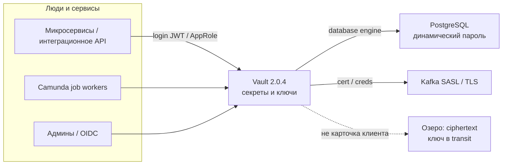
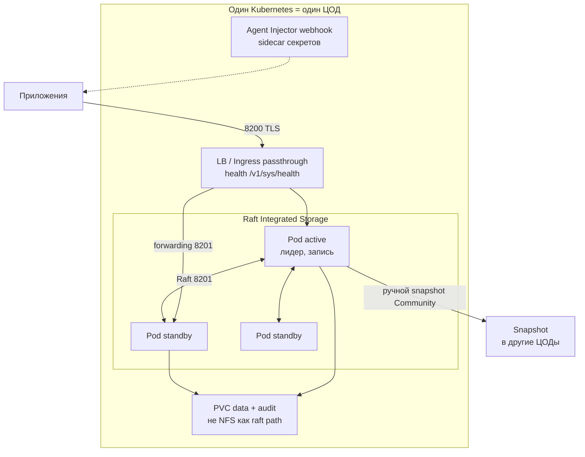
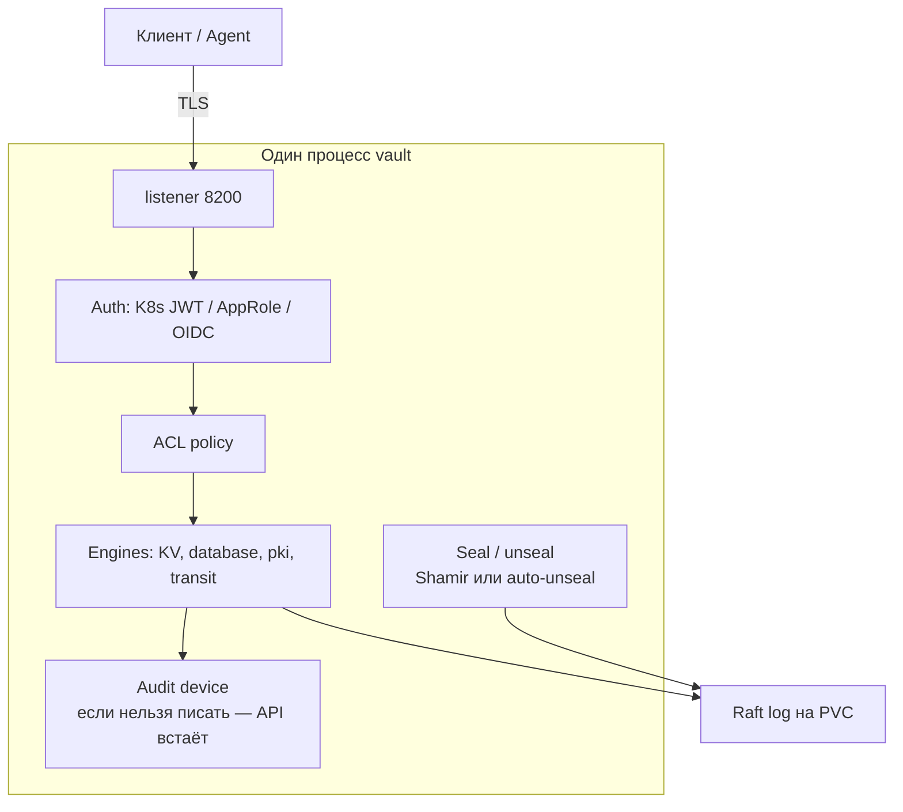
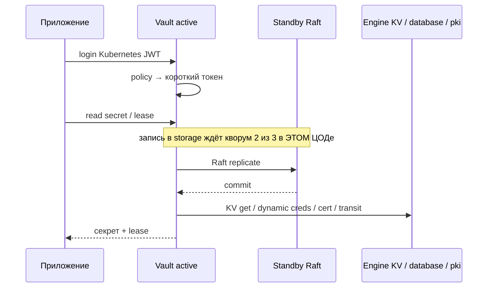
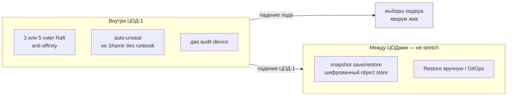
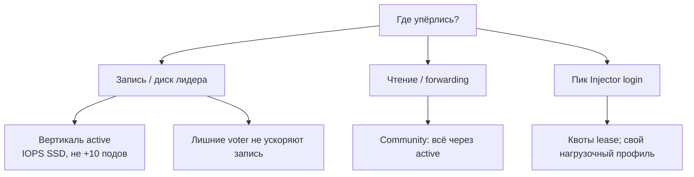
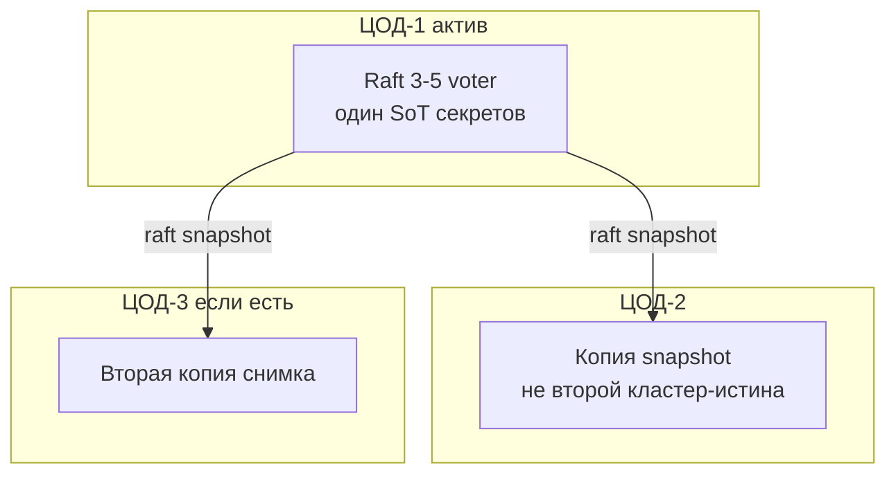

# HashiCorp Vault 2.0.4 — схемы устройства

Связанные документы: правила — `HashiCorp Vault.md`; установка — `HashiCorp Vault.install.md`.

C4 / «D4»: контекст → контейнеры → компоненты. Код клиентов не рисуем.

Допущения (без них схема врёт):

1. Stretch одного Raft на 2–3 ЦОДа **нет** (запрет платформы). Порог HashiCorp RTT &lt; 8 мс для AZ **не** делает stretch целевым.
2. Community 2.0.4 + Helm `hashicorp/vault` **0.34.1**. Performance Replication и DR replication **нет**.
3. Нагрузки нет — на схемах нет «N RPS». Есть *что крутить*, когда цифры появятся.

---

## 1. Контекст (C4 system context)

Vault — **источник истины секретов и ключей**, не SoT карточек и не WAF.

Сервис ходит за коротким токеном (KV / database / pki / transit), не в ConfigMap. Озеро остаётся SoT данных: ciphertext там, ключ в transit; терабайты в KV — антипаттерн. Компрометация Vault хуже падения одного микросервиса.

---

## 2. Контейнеры (из чего состоит решение)

Дефолт Helm — **standalone + file**. Это не прод (Security Warning HashiCorp). Прод = HA Raft, нечётные voter.

Порт **8200** — API клиентов. **8201** — Raft, forwarding, mTLS между узлами. Клиент «всё равно, на какой под», standby пересылает лидеру. Community **performance standby нет**: чтения тоже часто идут через active.

**Сильное:** смена лидера внутри ЦОДа. **Слабое:** нет кворума → нет записи (login, KV put, смена политик).

---

## 3. Компоненты внутри инстанса

| Компонент | Для чего настраивать |
|---|---|
| Shamir / auto-unseal | `init` один раз. На K8s без auto-unseal reschedule = sealed |
| KV / database / pki / transit | Четыре движка платформы; не класть озеро в KV |
| Audit ≥ 2 | Один file на полном диске = Vault отказывается обслуживать |
| Root token | После auth **отозвать**. Держать root «на всякий» — дыра |

---

## 4. Поток: приложение получает секрет

Unseal: после старта мастер-ключ в памяти нет. Shamir — люди вводят K из N долей **на каждый** под. Auto-unseal (KMS / Transit-Vault) — иначе Kubernetes не прод.

---

## 5. Что настраивать: отказоустойчивость

| Ручка | Если не настроить |
|---|---|
| HA Raft, не standalone+file | Нет выборов, один диск = весь контур |
| 3–5 voter + anti-affinity | Два пода на одной VM = «HA на бумаге» |
| Auto-unseal | Drain ноды = ночной звонок держателям Shamir |
| Snapshot вне кластера | Community **не** даёт DR-реплику |
| `/v1/sys/health` на LB | TCP 8200 «открыт» на sealed — ложь |

Падение **домашнего** ЦОДа — нет секретов, пока restore. Это цена запрета stretch.

---

## 6. Что настраивать: масштабируемость

Горизонтали **записи** у Community нет. Локальные чтения в другом ЦОДе — **Performance Replication (Enterprise)**. Без лицензии этого нет.

---

## 7. Прод: 2 или 3 ЦОДа без stretch

Клиенты в штате пишут в active ЦОД-1. Три независимых Community-кластера **без** PR = **три SoT**: политики и ключи разъедутся. HashiCorp для «единых ключей на 30 интеграций» сделал PR — в Community его нет.

**Сильное:** Raft не ждёт межЦОдовый RTT; порог 8 мс не ваш путь. **Слабое:** смерть ЦОД-1 = простой секретов до restore; RPO = интервал снимка.

---

## 8. Безопасность (ручки на той же схеме)

1. NetworkPolicy: клиенты → 8200; узлы ↔ 8200/8201.
2. TLS e2e; HashiCorp не рекомендует терминировать TLS на Ingress и дальше plaintext.
3. Least privilege ACL, короткие TTL, UI не в интернет.
4. VSO кладёт секрет в etcd — только с encryption-at-rest.

Источники фактов: `HashiCorp Vault.md` (Helm 0.34.1, Raft, Shamir, редакции). Stretch на схемах не рисуем как целевой.
