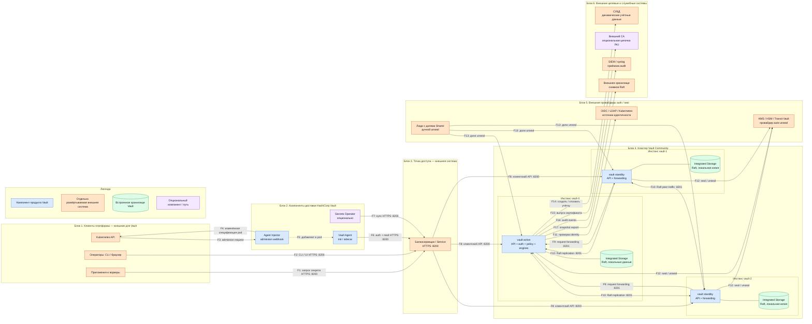

# HashiCorp Vault 2.0.4 — развёртывание и настройка

Vault — хранилище секретов и ключей: пароли баз, сертификаты, ключи шифрования. Приложение доказывает, кто оно, и получает **короткий** допуск, а не вечный пароль из git. Это не озеро клиентских карточек, не шина событий и не замена WAF / Falco / NetworkPolicy.

Версия, о которой этот документ: **2.0.4** (релиз 4 августа 2026, на дату подготовки — последний стабильный патч линии 2.0).  
Документация: https://developer.hashicorp.com/vault/docs  
Релиз: https://github.com/hashicorp/vault/releases/tag/v2.0.4  
Официальный путь на Kubernetes: Helm-чарт **hashicorp/vault 0.34.1** (версия приложения **2.0.4**).  
Образы: Community — `hashicorp/vault:2.0.4`; Enterprise — `hashicorp/vault-enterprise` с тегом линии `2.0.4-ent` (зафиксировать digest, не `latest`).

Этот текст — не набор команд «скопируй helm install», а правила, без которых система не будет одновременно устойчивой к сбоям, масштабируемой и безопасной. Пошаговая установка — в `HashiCorp Vault.install.md`.

---

## Назначение системы

Vault нужен, чтобы **секреты жили в одном месте** и выдавались по политике: динамический пароль в PostgreSQL, сертификат на сервис, расшифровать поле без хранения самих данных. Микросервис, воркер Camunda или интеграционный адаптер входит по роли Kubernetes (или AppRole) и читает только свой путь.

Система **хранит секреты и ключи**. Она **не** хранит эталон клиентов, **не** заменяет Kafka, **не** оркестрирует BPMN и **не** ходит в государственные сервисы. Клиентские карточки остаются в озере; при необходимости чувствительное поле шифруется через движок transit, шифротекст лежит в озере, ключ — в Vault.

---

## Перечень функций

Что умеет self-hosted Vault Community 2.0.4 (по документации HashiCorp):

1. **Хранить секреты** движками: KV (ключ-значение), database (выпускает пароль в СУБД и умеет отозвать), pki (выпускает сертификаты), transit (шифрует байты, сами данные не хранит).
2. **Пускать клиента только после входа**: Kubernetes (JWT пода), AppRole (идентификатор + секрет для машин не из Kubernetes), OIDC/LDAP для людей. Без метода входа любой с адресом Vault — никто.
3. **Ограничивать путь политикой**: «этому токену можно читать `secret/data/app/*` и больше ничего». Это не NetworkPolicy Kubernetes.
4. **Выдавать короткий токен** со сроком жизни. У динамических секретов есть аренда: Vault умеет отозвать.
5. **Держать данные запечатанными** после старта: файлы на диске есть, мастер-ключ в памяти нет, API почти мёртв. Распечатать — вручную долями (Shamir: часто 5 долей, порог 3) или автоматически (облачный KMS, HSM, другой Vault).
6. **Хранить состояние встроенным Raft** (Integrated Storage). Отдельный Consul для нового кластера HashiCorp не рекомендует. В кластере **один** лидер принимает запись; остальные запасные почти все запросы **пересылают** лидеру (в Community).
7. **Снимать снимок Raft** вручную (`vault operator raft snapshot save/restore`). Автоснимки по расписанию — **только Enterprise**.
8. **Писать журнал доступа** (audit): кто что спросил. Чувствительные поля хешируются. Если Vault **не может записать** ни на одно включённое устройство журнала — **отказывается обслуживать запрос**. Это задумано.
9. **Слушать клиентов на 8200** и разговаривать узлам между собой на **8201** (Raft, пересылка, своя взаимная TLS).
10. **Подставлять секреты в поды** отдельными программами: Agent Injector (sidecar по аннотации), Secrets Operator (кладёт в обычный Kubernetes Secret — секрет оказывается в etcd), CSI (в чарте сервера по умолчанию выключен).

Чего система **не** делает и часто путают: она не озеро данных (терабайты персоналки в KV — путь убить файловую базу Raft), не шина, не BPMN, не интеграция с ведомствами. В Community **нет** репликации кластера на другой дата-центр «из коробки» (Performance / DR replication — Enterprise) и **нет** запасного узла, который сам обслуживает чтения. Добавление узлов Raft **не** ускоряет запись: пишет один лидер. ГОСТ-криптографии нет. Шифрование etcd Kubernetes — конфиг API-сервера, не Vault: если оператор кладёт секреты в Kubernetes Secret без encryption-at-rest, они лежат как есть (base64 ≠ шифр).

---

## Основные элементы системы и зависимости

Vault — продукт из серверных процессов, клиентских утилит и подключаемых логических модулей. На схеме показаны физически отдельные инстансы и логические компоненты, через которые проходят запросы. Целевая архитектура этого документа использует **только встроенное Integrated Storage (Raft)**. Внешние storage-backend перечислены отдельно как альтернативы, но в показанный кластер не входят.

### Схема инстансов и потоков

### Компоненты схемы

| Компонент | Технология | Назначение | Принадлежность |
|---|---|---|---|
| **Приложения и воркеры** | HTTP API-клиент, Vault SDK или чтение подготовленного файла | Аутентифицируются и получают только разрешённые политикой секреты | Внешние клиенты платформы; не входят в Vault |
| **CLI `vault`** | Тот же поставляемый HashiCorp бинарник в режиме клиента | Административные вызовы API: настройка, политики, операции с секретами и снимками | Компонент продукта Vault; отдельного состояния не хранит |
| **UI** | Веб-интерфейс, обслуживаемый сервером Vault | Выполняет разрешённые пользователю операции через API | Встроен в продукт; браузер оператора — внешний клиент |
| **Kubernetes API** | Admission API, ServiceAccount JWT, Kubernetes Secret | Создаёт pod, вызывает Injector; может подтверждать Kubernetes identity; принимает данные от VSO | Внешняя система Kubernetes |
| **Agent Injector** | `vault-k8s`, mutating admission webhook | По аннотациям изменяет спецификацию pod и добавляет Vault Agent | Компонент экосистемы HashiCorp Vault, отдельный процесс в Kubernetes |
| **Vault Agent** | Init-контейнер и/или sidecar, auto-auth, template rendering | Входит в Vault, получает и обновляет секрет, записывает его в общий том pod | Компонент продукта Vault, отдельный контейнер рядом с приложением |
| **Vault Secrets Operator (VSO)** | Kubernetes operator и CRD | Синхронизирует данные из Vault в Kubernetes Secret | Отдельно устанавливаемый компонент HashiCorp; не часть серверного кластера |
| **Балансировщик / Service** | L4/L7 load balancer или Kubernetes Service | Даёт клиентам стабильный адрес и направляет трафик на доступные серверы | Внешняя инфраструктурная система |
| **`vault active`** | Сервер Vault, активный Raft leader | Обрабатывает записи, применяет политики, auth methods и secrets engines, координирует Raft | Основной серверный компонент продукта |
| **`vault standby`** | Сервер Vault, Raft follower и HA standby | Держит реплику состояния, участвует в кворуме и пересылает запросы active-узлу | Основной серверный компонент продукта |
| **Integrated Storage** | Встроенный Raft; локальное состояние на каждом сервере | Надёжно хранит зашифрованное состояние Vault и согласует изменения большинством | Встроенная часть Vault, не отдельная внешняя БД |
| **Auth methods** | Kubernetes, AppRole, JWT/OIDC, LDAP, userpass и другие плагины | Проверяют предъявленную identity и выпускают Vault token с политиками | Логические компоненты внутри Vault; внешний IdP или Kubernetes остаётся внешней системой |
| **Policies, tokens, leases** | ACL policy, Vault token, lease/TTL | Ограничивают действия и время жизни доступа; позволяют отзывать динамические данные | Встроенное ядро Vault |
| **Secrets engines** | KV, database, PKI, transit и другие плагины | Хранят статические секреты либо создают криптографические операции и динамические данные | Логические компоненты внутри Vault; СУБД и внешний CA в продукт не входят |
| **Провайдер auto-unseal** | Облачный KMS, HSM или Transit seal | Расшифровывает ключ, которым Vault снимает seal после запуска | Отдельная внешняя система; HSM PKCS#11 для auto-unseal требует Enterprise |
| **Держатели долей Shamir** | Несколько человеческих держателей частей ключа | Совместно вручную снимают seal при достижении порога | Внешняя организационная роль, не программный компонент |
| **СУБД** | Например, PostgreSQL/MySQL с административным API/протоколом | По команде database engine создаёт и отзывает динамические учётные данные | Внешняя целевая система |
| **Внешний CA** | Корпоративный центр сертификации | Может образовывать вышестоящую цепочку для PKI engine | Внешняя система; PKI engine самого Vault остаётся встроенным |
| **SIEM / syslog** | Audit sink, syslog, socket или иной приёмник | Принимает события аудита для расследований и контроля | Внешняя служебная система; audit device настраивается в Vault |
| **Хранилище снимков** | Объектное, файловое или резервное хранилище | Хранит экспортированные снимки Integrated Storage вне кластера | Внешняя служебная система |

### Storage: встроенный вариант целевой архитектуры

**Integrated Storage (Raft)** работает внутри процессов `vault`. Каждый сервер хранит собственную локальную копию зашифрованного состояния; active-узел добавляет изменение в журнал Raft и подтверждает его после репликации на кворум. Для этой платформы выбран именно этот вариант: отдельный storage-кластер не нужен.

| Встроенный вариант | Где исполняется и хранит данные | HA | Роль в этой схеме |
|---|---|---|---|
| **Integrated Storage (`raft`)** | Исполняется в каждом `vault`; данные находятся на локальном диске каждого Raft peer | Да, за счёт кворума Raft | **Используется** |
| **File storage (`file`)** | Исполняется в `vault`; данные находятся в одном локальном каталоге | Нет собственного HA | Не используется в показанном кластере |

### Storage: внешние backend-варианты

Внешний storage-backend — это **альтернатива** Integrated Storage, а не его дополнительная реплика и не seal-provider. Vault хранит зашифрованное состояние через API отдельно развёрнутой системы. HashiCorp рекомендует Integrated Storage для большинства случаев; внешний backend добавляет отдельный сетевой переход, мониторинг и собственную модель отказа.

| Внешний вариант | Где находятся данные | Что разворачивается отдельно | Роль в этой схеме |
|---|---|---|---|
| **Consul** | В Consul KV | Выделенный кластер Consul | Поддерживаемая историческая альтернатива; **не используется** |
| **DynamoDB и другие backend из перечня Vault** | Во внешнем сервисе соответствующего типа | Сам сервис и его HA/backup-контур | Альтернатива для специальных случаев; **не используется** |

Нельзя одновременно считать Raft и Consul «двумя слоями хранения» одного кластера: в конфигурации Vault выбирается один основной `storage` backend. Seal, audit и хранилище экспортированных снимков — другие роли и к storage-backend не относятся.

### Seal: варианты доступа к мастер-ключу

Seal защищает мастер-ключ: на диске остаётся зашифрованное состояние, а запечатанный процесс не может выполнять обычные операции с секретами.

| Вариант seal | Как снимается seal | Принадлежность и ограничения |
|---|---|---|
| **Shamir seal** | Несколько держателей вводят доли; достаточно заданного порога | Механизм встроен в Vault; люди и места хранения долей — внешняя организационная система |
| **Cloud KMS seal** | Vault обращается к ключу облачного KMS и выполняет auto-unseal | Механизм интеграции встроен; KMS — внешняя отдельно управляемая система |
| **Transit seal** | Один Vault использует transit engine другого независимого Vault | Клиентская интеграция встроена; второй Vault — отдельная внешняя система со своим seal и доступностью |
| **PKCS#11 HSM seal** | Vault обращается к аппаратному ключу через PKCS#11 | HSM — внешняя система; вариант auto-unseal относится к Enterprise |

У всех узлов одного Raft-кластера должна быть согласованная seal-конфигурация. **Seal не хранит бизнес-секреты вместо Raft**: он даёт доступ к ключу, необходимому для расшифрования ключевой иерархии Vault.

### Auth: встроенные методы и внешние источники identity

Auth method — подключаемый логический модуль **внутри Vault**. Он проверяет credential сам либо делегирует проверку внешнему источнику identity, после чего Vault выдаёт собственный token с policy и TTL.

| Встроенный auth method | Кто предъявляет credential | Внешняя система при проверке | Назначение |
|---|---|---|---|
| **Kubernetes** | Pod предъявляет JWT ServiceAccount | Kubernetes API / reviewer JWT | Вход workloads из Kubernetes |
| **AppRole** | Машина предъявляет RoleID и SecretID | Не обязательна | Вход сервисов и заданий вне Kubernetes |
| **JWT/OIDC** | Пользователь или workload предъявляет JWT/OIDC assertion | OIDC provider / IdP | Федеративный вход людей и машин |
| **LDAP** | Пользователь предъявляет имя и пароль | LDAP directory | Корпоративный вход людей |
| **Userpass** | Пользователь предъявляет локальные имя и пароль | Нет | Локальные учётные записи Vault; не внешний IdP |
| **Token** | Клиент предъявляет ранее выданный Vault token | Нет | Последующие API-вызовы после первичной аутентификации |

Kubernetes, LDAP и OIDC-провайдеры не становятся частью Vault после подключения: Vault хранит конфигурацию метода и сопоставление с policies, а источник identity остаётся внешней системой. AppRole и userpass не следует изображать как внешние backend: их проверяемое состояние хранится самим Vault.

### Движки секретов

| Встроенный secrets engine | Назначение | Связанная внешняя система |
|---|---|---|
| **KV** | Хранение версионируемых пар «ключ — значение» | Не требуется |
| **Database** | Создание и отзыв динамических учётных данных | Целевая СУБД |
| **PKI** | Выпуск и отзыв сертификатов | Внешний CA нужен только при выбранной цепочке доверия |
| **Transit** | Шифрование, расшифрование, подпись и проверка без хранения исходных данных | Не требуется; вызывающее приложение хранит шифротекст у себя |

Secrets engine исполняется внутри Vault, но внешняя СУБД или CA остаётся самостоятельной системой. Transit engine и внешний Transit Vault для auto-unseal — разные роли: первый обслуживает криптографические запросы приложений, второй может быть seal-provider для другого кластера.

### Что входит в состав

| Компонент | Зачем | Как масштабируется |
|---|---|---|
| **Сервер `vault`** | API, policies, secrets engines, auth methods, Integrated Storage и seal | Нечётное число голосующих; один active принимает записи, standby участвуют в Raft |
| **CLI `vault`** | Административные и пользовательские обращения к API | Запускается у операторов и в автоматизации; собственного хранилища нет |
| **UI** | Веб-доступ к разрешённым API-операциям | Обслуживается сервером; для API не обязателен |
| **Injector** | Добавляет Agent init/sidecar в pod | Несколько реплик webhook; не входит в Raft-кворум |
| **Движки и методы входа** | KV, database, PKI, transit; Kubernetes, AppRole, JWT/OIDC, LDAP | Включаются логически на кластере и используют общее состояние Vault |

### Порты (контракт сети)

| Порт | Назначение | Кому открывать |
|---|---|---|
| **8200/TCP** | Клиентский HTTP API, UI и операция присоединения узла | Клиентам через контролируемую точку доступа; узлам Vault при присоединении. Для передачи секретов используется TLS |
| **8201/TCP** | Request forwarding, Raft и внутренний cluster traffic | Только между узлами одного кластера Vault |

Порт внешней СУБД, LDAP, OIDC, KMS, HSM, SIEM или backup-системы определяется соответствующей внешней системой и не является портом Vault. Проверка только факта открытия `8200` недостаточна: endpoint `/v1/sys/health` различает active, standby и sealed-состояния.

### Как читать потоки на схеме

1. **F1 — прямой клиентский запрос.** Приложение сначала выполняет вход выбранным auth method, получает Vault token, затем по тому же HTTPS API на `8200/TCP` читает секрет или вызывает secrets engine. Policy проверяется на каждом разрешаемом действии.
2. **F2 — работа оператора.** CLI обращается к тому же API, что и приложение. UI — не отдельный административный backend: браузер получает интерфейс от Vault и выполняет API-запросы с правами вошедшего пользователя.
3. **F3–F5 — добавление Agent в pod.** При создании pod Kubernetes API вызывает admission webhook Injector. Injector возвращает изменённую спецификацию с init-контейнером и/или sidecar Vault Agent. Сам Injector не читает бизнес-секрет за приложение.
4. **F6 — доставка через Agent.** Agent использует identity pod, обычно JWT ServiceAccount, входит в Vault и записывает результат template rendering в общий memory volume. Приложение читает файл и может не иметь собственного Vault SDK.
5. **F7 — доставка через VSO.** Оператор следит за CRD, читает секрет из Vault и записывает его в Kubernetes Secret. После этого копия секрета существует в Kubernetes/etcd; это принципиально другой путь, чем файл Agent в общем томе.
6. **F8 — выбор серверного инстанса.** Балансировщик направляет запрос на доступный `vault` по `8200/TCP`. Запрос может прийти как active, так и standby-инстансу; стабильный адрес скрывает смену active-узла от клиента.
7. **F9 — request forwarding.** В Community standby обычно не становится независимым источником чтения: он устанавливает внутреннее соединение на `8201/TCP`, пересылает запрос active-узлу и возвращает клиенту ответ.
8. **F10 — Raft.** Active добавляет изменение в реплицируемый журнал. Запись считается committed после подтверждения кворумом, затем применяется к состоянию. Локальные `R0–R2` — не три независимые базы, а согласованные копии одного Integrated Storage.
9. **F11 — внешняя проверка identity.** Для Kubernetes, OIDC или LDAP Vault связывается с соответствующей внешней системой. Та подтверждает identity, но Vault самостоятельно сопоставляет её с ролью, policies и параметрами выдаваемого token.
10. **F12–F13 — снятие seal.** При auto-unseal каждый сервер обращается к настроенному KMS, HSM или Transit Vault. При Shamir требуемый порог долей вводится для запечатанного сервера вручную. Это открывает доступ к ключевой иерархии, а не копирует секреты из seal-provider.
11. **F14 — динамический секрет СУБД.** Database engine использует заранее настроенную привилегированную связь с СУБД, создаёт временную учётную запись и отдаёт клиенту credential с lease. При истечении или отзыве Vault удаляет либо блокирует эту учётную запись в СУБД.
12. **F15 — сертификаты.** PKI engine выпускает сертификат из ключевого материала и роли внутри Vault. Внешний CA участвует только если архитектура использует подписанный им intermediate CA или иной внешний этап цепочки.
13. **F16 — аудит.** Audit device формирует событие о запросе и передаёт его внешнему приёмнику либо пишет в настроенный файл/сокет. Если ни одно включённое audit device не может записать событие, Vault не обслуживает соответствующий запрос.
14. **F17 — снимок.** Оператор или автоматизация экспортирует snapshot текущего Integrated Storage во внешнее backup-хранилище. Это копия состояния для восстановления, а не online storage-backend и не дополнительный Raft peer.
15. **Пунктир и фиолетовый цвет.** Пунктир F5 означает изменение спецификации, а не сетевой вызов работающего pod. Фиолетовые узлы обозначают опциональные варианты; оранжевые узлы всегда требуют отдельного владения, доступности и мониторинга.

### Глоссарий

| Термин | Значение в этом документе |
|---|---|
| **ACL policy / policy** | Набор правил Vault, определяющий разрешённые операции над путями API |
| **Active / leader** | Единственный сервер Vault, который в текущий момент руководит Raft и применяет записи |
| **Admission webhook** | HTTP-компонент Kubernetes, который проверяет или изменяет объект до его сохранения API-сервером |
| **AppRole** | Метод входа Vault для машин с использованием RoleID и SecretID |
| **Audit device** | Настроенный в Vault канал записи событий аудита: файл, socket, syslog и другие поддерживаемые варианты |
| **Auto-auth** | Возможность Vault Agent самостоятельно пройти выбранный auth method и обновлять token |
| **Auto-unseal** | Автоматическое снятие seal через внешний криптографический провайдер |
| **Backend** | Реализация определённой роли; storage-backend хранит состояние, auth-backend проверяет identity. Эти роли нельзя смешивать |
| **CA** | Certificate Authority, центр сертификации, который подписывает сертификаты |
| **CLI** | Command Line Interface, программа `vault` для обращения к Vault API из командной строки |
| **Committed entry** | Запись журнала Raft, подтверждённая кворумом и готовая к применению |
| **Credential** | Доказательство для входа или использования ресурса: token, пароль, JWT, сертификат, RoleID/SecretID |
| **CRD** | Custom Resource Definition, расширение Kubernetes API собственным типом ресурса |
| **CSI** | Container Storage Interface; в контексте секретов — способ монтирования данных в pod через CSI driver |
| **Dynamic secret** | Временный credential, созданный Vault по запросу и связанный с lease |
| **Engine / secrets engine** | Подключаемый модуль Vault для хранения секретов или выполнения операций над ними |
| **Follower** | Узел Raft, который принимает записи от leader и участвует в голосовании |
| **HA** | High Availability, способность сервиса продолжить работу после допустимого отказа |
| **HSM** | Hardware Security Module, аппаратная система хранения и использования криптографических ключей |
| **Identity** | Подтверждённая сущность пользователя или workload, к которой Vault привязывает права |
| **IdP** | Identity Provider, внешняя система, подтверждающая identity и выдающая утверждения входа |
| **Init-контейнер** | Контейнер Kubernetes, который завершается до запуска основных контейнеров pod |
| **Integrated Storage** | Встроенный в Vault storage-backend на основе Raft |
| **JWT** | JSON Web Token, подписанный токен с утверждениями об identity |
| **KMS** | Key Management Service, внешний сервис управления криптографическими ключами |
| **KV** | Key-Value, модель хранения значений по именованным ключам |
| **Lease** | Управляемый Vault срок действия динамического секрета или token с возможностью продления и отзыва |
| **Memory volume** | Общий для контейнеров pod том в оперативной памяти; Agent использует его для файлов секретов |
| **OIDC** | OpenID Connect, протокол федеративной аутентификации поверх OAuth 2.0 |
| **PKCS#11** | Стандартный программный интерфейс доступа к криптографическим устройствам, включая HSM |
| **PKI** | Public Key Infrastructure, инфраструктура выпуска, проверки и отзыва сертификатов |
| **Pod** | Минимальная запускаемая единица Kubernetes из одного или нескольких контейнеров |
| **Quorum / кворум** | Большинство голосующих Raft peer, необходимое для выбора leader и подтверждения записи |
| **Raft** | Протокол консенсуса, который согласует реплицируемый журнал между серверами |
| **Request forwarding** | Пересылка клиентского запроса со standby на active по внутреннему cluster-соединению |
| **Seal** | Состояние защиты, при котором Vault не имеет в памяти ключа для доступа к зашифрованному состоянию |
| **Secrets Operator / VSO** | Отдельный Kubernetes operator HashiCorp для синхронизации секретов Vault |
| **Shamir** | Схема разделения секрета на доли, из которых для восстановления достаточно заданного порога |
| **Sidecar** | Вспомогательный контейнер, работающий в одном pod рядом с приложением |
| **SIEM** | Система централизованного сбора и анализа событий информационной безопасности |
| **Snapshot** | Согласованная точечная копия состояния Integrated Storage для последующего восстановления |
| **Standby** | Неактивный сервер Vault в HA-кластере; при Raft обычно также follower |
| **Storage-backend** | Единственный выбранный механизм долговременного хранения зашифрованного состояния Vault |
| **Template rendering** | Преобразование ответа Vault в файл заданного формата по шаблону |
| **TLS** | Протокол шифрования и проверки подлинности сетевого соединения |
| **Token** | Выдаваемый Vault credential, несущий policies и срок действия для последующих API-вызовов |
| **Transit** | Secrets engine Vault для криптографических операций без сохранения исходных пользовательских данных |
| **TTL** | Time To Live, срок действия token, lease или другого временного объекта |
| **Unseal** | Получение Vault доступа к ключевой иерархии после запуска процесса |
| **Workload** | Исполняемое приложение, сервис, job или pod, которому требуется машинная identity |

## Источники (чтобы не принимать на веру)

- Релиз 2.0.4: https://github.com/hashicorp/vault/releases/tag/v2.0.4
- Helm-чарт 0.34.1, предупреждение про standalone: https://developer.hashicorp.com/vault/docs/deploy/kubernetes/helm
- HA + Raft в чарте: https://developer.hashicorp.com/vault/docs/deploy/kubernetes/helm/examples/ha-with-raft
- Integrated Storage, кворум, Autopilot: https://developer.hashicorp.com/vault/docs/internals/integrated-storage
- Встроенные и внешние storage-backend: https://developer.hashicorp.com/vault/docs/configuration/storage
- Seal: https://developer.hashicorp.com/vault/docs/configuration/seal
- Transit seal: https://developer.hashicorp.com/vault/docs/configuration/seal/transit
- Shamir seal: https://developer.hashicorp.com/vault/docs/configuration/seal/shamir
- PKCS#11 seal: https://developer.hashicorp.com/vault/docs/configuration/seal/pkcs11
- Методы входа: https://developer.hashicorp.com/vault/docs/auth
- Kubernetes auth: https://developer.hashicorp.com/vault/docs/auth/kubernetes
- AppRole: https://developer.hashicorp.com/vault/docs/auth/approle
- Vault Agent Injector: https://developer.hashicorp.com/vault/docs/deploy/kubernetes/injector
- Vault Secrets Operator: https://developer.hashicorp.com/vault/docs/platform/k8s/vso
- Secrets engines: https://developer.hashicorp.com/vault/docs/secrets
- Database secrets engine: https://developer.hashicorp.com/vault/docs/secrets/databases
- PKI secrets engine: https://developer.hashicorp.com/vault/docs/secrets/pki
- Transit secrets engine: https://developer.hashicorp.com/vault/docs/secrets/transit
- Редакции Community vs Enterprise: https://developer.hashicorp.com/vault/tutorials/get-started/available-editions
- Снимки Raft: https://developer.hashicorp.com/vault/docs/commands/operator/raft
- Audit: https://developer.hashicorp.com/vault/docs/audit
