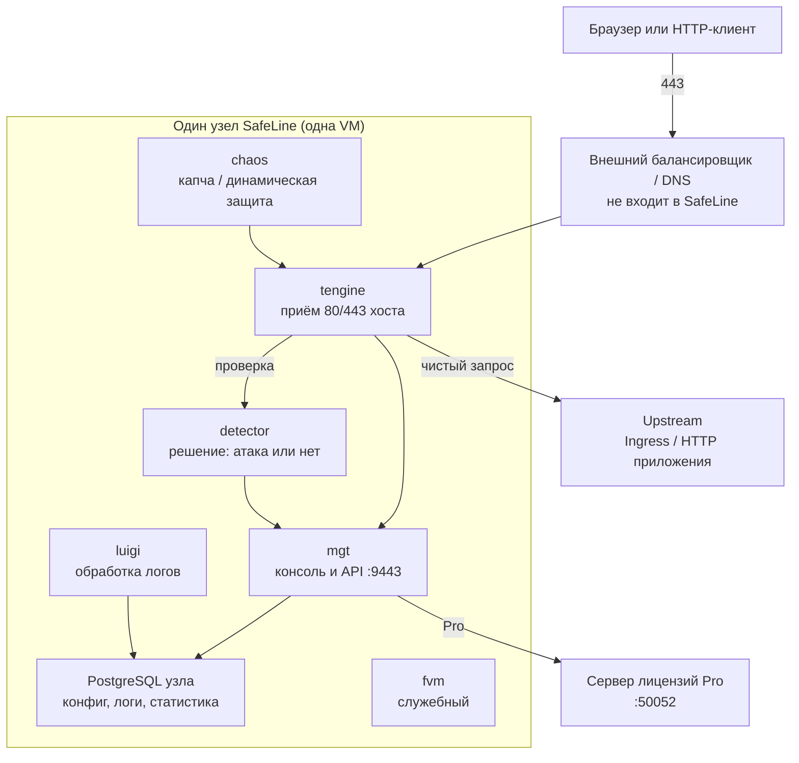

# SafeLine WAF 9.4.0 — развёртывание и настройка

SafeLine — фильтр **HTTP и HTTPS** перед вашим приложением: смотрит содержимое запроса (инъекция, XSS, бот), а не только «порт открыт или закрыт». Клиент стучится в SafeLine, тот проверяет запрос и, если он чистый, пересылает его на настоящий сервер. Это не Ingress-контроллер Kubernetes, не NetworkPolicy и не защита Kafka / gRPC.

Версия, о которой этот документ: **9.4.0** (релиз 17 августа 2026, на дату подготовки — последний стабильный релиз линии 9.x).  
Документация: https://docs.waf.chaitin.com/  
Репозиторий: https://github.com/chaitin/SafeLine  
Образы: `chaitin/safeline-*` (Docker Hub; международная линейка задаётся `REGION=-g`).

Этот текст — не набор команд «скопируй и запусти», а правила, без которых система не будет одновременно устойчивой к сбоям, масштабируемой и безопасной. Пошаговая установка — в `SafeLine WAF.install.md`.

---

## Назначение системы

SafeLine нужен на **входе HTTP**: интеграционное API, если оно торчит наружу, веб-консоли, портал, колбэки партнёров. Он не делает интеграционный контур умнее и не нормализует ответы ведомств.

Система **проверяет входящий веб-трафик**. Она **не** стоит на исходящих вызовах от вас к государственным сервисам, **не** видит шину Kafka, **не** защищает Postgres и **не** заменяет авторизацию приложения. Если повесить её за Ingress без передачи реального IP клиента, в журнале атак будет адрес балансировщика, а чёрные списки и geo-правила станут бессмысленны.

---

## Перечень функций

Что умеет SafeLine 9.4.0 (по документации вендора):

1. **Стоять обратным прокси**: слушать домен и порт, проверять запрос, форвардить на upstream (ваш Ingress, API, портал).
2. **Семантический анализ** запроса (заявленное ядро): не только чёрные списки строк, но смысл (инъекция, обход пути).
3. **Ограничивать частоту** запросов (антифлуд, подбор пароля).
4. **Проверять «ты человек?»** (капча, слайдер) и **шифровать HTML/JS на лету** (Dynamic Protection) — включать точечно: ломает часть легитимных клиентов и машинных интеграций.
5. **Видеть реальный IP** клиента за балансировщиком: заголовок X-Forwarded-For или PROXY Protocol (есть с линейки 8.x).
6. **Управлять сайтами в консоли** (обычно `https://<ip>:9443`): какой домен слушаем, куда форвардим, сертификаты TLS.
7. **В редакции Pro — копировать конфигурацию** с одного узла (master) на остальные (slave). Это **не** общий кластер с общей базой: у каждого узла свой PostgreSQL. Трафик могут принимать все узлы; править правила — пока жив master. Штатной процедуры «выбрать нового master, если умер зал» в английской документации **нет**.
8. **В Pro — syslog атак** в SIEM и режимы производительности детектора под мощность машины.
9. **Проверка живости** для внешнего балансировщика: служебный порт **65508** (не меняется).

Чего система **не** делает и часто путают: она не Kafka-кластер с одной базой и кворумом («три пода в Deployment» официально не являются кластером). Официального оператора Kubernetes нет: штатный путь — Linux + Docker Compose. Сторонний Helm-чарт существует, но в README: у каждого Deployment **только 1 replica**; несколько replica «ломают WAF неизвестным образом». Ветка LTS чарта завязана на LTS SafeLine, а **LTS вендор не сопровождает с 9.1.0-LTS (14 августа 2025)**. Нет ГОСТ-TLS. Нет общего диска логов на три площадки: логи живут в локальной базе узла.

Редакции: Personal (бывшая Community, бесплатная), Lite, **Pro** (платная: синхронизация HA, syslog, режимы детектора). Для ключа Pro официально нужна **постоянная** связь с облачным сервером лицензий.

---

## Требования к развёртыванию

### Требования к ПО

| Что | Что ставить | Комментарий |
|---|---|---|
| **Формат поставки** | Виртуальная машина (или железо) с **Docker Compose** | Один «инстанс» = пачка контейнеров на **одной** машине. Публичного официального Helm-оператора нет. Контейнеры в Kubernetes — только если сознательно ставите Compose на выделенной ноде и **не** отдаёте 80/443 Ingress-контроллеру. |
| **Kubernetes** | Не штатный инсталлятор WAF | Community Helm — запасной путь с ограничением 1 replica и без гарантии вендора. HPA и `replicas: 3` **не** являются горизонтальным масштабом SafeLine. Честный вариант: приложения в Kubernetes, WAF **рядом** на выделенных VM. |
| **ОС** | Linux x86_64 или ARM64 | **macOS и Windows не поддерживаются** ни в одной редакции (FAQ). **ARM работает только с лицензией Pro**; Personal на ARM не поддерживается. |
| **CPU** | Нужен флаг **SSSE3** | Проверка: `lscpu \| grep ssse3`. Без флага официальный путь не тот. |
| **Docker** | **≥ 20.10.14**, Compose v2 **≥ 2.0.0** | Tengine (приём HTTP) работает в **`network_mode: host`**: слушает порты машины напрямую. На этой VM не ставить второй процесс, который тоже хочет 80/443. |
| **База в составе** | PostgreSQL из compose **того релиза**, который ставите | В changelog **9.3.11** бандл 15.2 → **15.18**. Не смешивать compose разных тегов. Внешний Postgres, ZooKeeper, Redis, Kafka в штатной схеме **не** требуются. Связь консоли с базой в примере — `sslmode=disable`: приемлемо, пока 5432 **не** торчит с хоста. |
| **Лицензия Pro** | Исходящий доступ контейнера консоли к `safeline.stream.safepoint.cloud:50052` | Официально ключ требует **стабильного постоянного** соединения. Смена IP узла может оборвать сессию. Offline-схемы в Install Guide нет. |
| **Часы** | NTP | У Personal для TOTP админки время критично (FAQ); на всех узлах лучше один NTP. |
| **Балансировщик** | Отдельное ПО перед фермой | SafeLine сам себе failover трафика не делает. |

Готовый инсталлятор `manager.sh` у вендора есть — для знакомства и боя на VM, не «как Grafana в Helm».

### Требования к ресурсам

Цифр «на терабайты озера» нет: WAF масштабируется от **HTTP-запросов в секунду**, не от объёма Kafka. Ниже FAQ вендора «recommended configuration», с оговоркой «только справка, тестируйте своё».

| Сценарий | CPU | RAM | Диск |
|---|---|---|---|
| **Минимум, чтобы контейнеры встали** | **1 ядро** | **1 ГБ** | **5 ГБ** |
| **Меньше 100 запросов/с** | **2 ядра** | **4 ГБ** | Каталог `SAFELINE_DIR` (часто `/data/safeline`): конфиг, база, логи **этого** узла |
| **100–1000 запросов/с** | **4 ядра** | **8 ГБ** | Тот же каталог; логи атак раздувают Postgres |
| **Больше 1000 запросов/с** | **8 ядер** | **16 ГБ** | Политика очистки логов обязательна, иначе диск кончится независимо от озера данных |

Дополнительно:

- FAQ прямо не рекомендует соседство с бизнесом на одной машине (можно, но нагрузка выше).
- **Не NFS как каталог данных** — вендор это не описывает; диск этой VM.
- В Kubernetes том не уменьшают — если когда-нибудь поставите так, размер сразу с запасом.
- На размер WAF влияют access/attack logs, если копить месяцами на узле, не терабайты озера.

---

## Основные элементы системы и зависимости

Платформа — это **несколько отдельных программ** на одной машине (и несколько таких машин в бою). Ниже — инстансы и как они вызывают друг друга.

### Схема инстансов и потоков

Как читать схему:

1. Человек или робот идёт на балансировщик (или сразу на узел). **Tengine** — форк Nginx: принимает HTTP(S) портами **машины**, не изолированной сети Docker.
2. Запрос уходит в **detector**. Если чисто — tengine форвардит на **upstream**. Тяжёлые запросы к чужому залу через город не тащить: живой WAF + мёртвое «чужое» приложение = лишняя зависимость.
3. **Консоль (mgt)** хранит сайты и правила в **своём** Postgres. Соседний узел свою базу с этой **не** делит. В Pro правила копируются master→slave по сети между WAF-узлами, не через общую БД.
4. **Chaos** — капча и динамическая защита. **Luigi** — логи (роль старого контейнера `mario` с 6.10.2 переехала сюда). **Fvm** в compose есть; отдельного описания роли в публичных docs нет — не выдумываем.
5. Лицензия Pro: консоль ходит исходящим на облако вендора. Это зависимость безопасности, не «галочка».

Рядом, но это уже другое ПО: городской балансировщик, Ingress каждого зала, SIEM под syslog, зеркало образов. Kafka к SafeLine не подключается.

### Что входит в состав

| Контейнер | Зачем | Как масштабируется |
|---|---|---|
| **safeline-tengine** | Вход HTTP(S), host-сеть | Ещё **целый узел** за балансировщиком, не replica пода |
| **safeline-detector** | Решение «атака / не атака» | Вертикаль CPU на узле; в Pro — режим производительности |
| **safeline-mgt** | Консоль и API | Один процесс на узел; в Pro один master на ферму |
| **safeline-pg** | Конфиг и логи **этого** узла | Не кластер. Не растягивать на три зала |
| **safeline-luigi** | Обработка логов | На том же узле |
| **safeline-chaos** | Челенджи | На том же узле |
| **safeline-fvm** | Служебный | На том же узле |

### Порты (контракт сети)

| Порт | Назначение | Кому открывать |
|---|---|---|
| **80 / 443/TCP** (и listen приложений) | Вход людей и HTTP-клиентов | С балансировщика / периметра. Не обходной Ingress на origin |
| **9443/TCP** | Консоль (внутри контейнера 1443, снаружи `MGT_PORT`) | Только jump / VPN. Не интернет: это админка щита |
| **65508** | Health check (FAQ: не меняется) | Балансировщик |
| **65443** | Своя страница ошибки (FAQ: не меняется) | По необходимости |
| **8000** внутри | Tengine → detector | Только localhost / сеть compose |
| **5432** | Postgres узла | **Не** публиковать с хоста |
| **50052** исходящий | Сервер лицензий Pro | Только нужный хост, не «весь интернет с WAF» |

Сброс пароля админа: `docker exec safeline-mgt resetadmin`. Пароль Postgres — в `.env`.

### Зависимости окружения

- Свободны на хосте 80/443 (или те порты, что пропишете в сайтах), плюс 65508 и 65443.
- Уникальный префикс Docker-сети, если на хосте уже есть сети.
- Корпоративный PKI для сертификатов сайтов на tengine. Самоподписанный сертификат консоли для людей на FQDN — плохая норма.
- Origin в Kubernetes должен принимать HTTP **только** с IP WAF-узлов. Иначе щит обходят.

---

## Краткие вводные

### Как устроена отказоустойчивость

SafeLine **не выбирает лидера трафика**. Один Compose-узел упал — этот узел не принимает HTTP.

Устойчивость в продукте (с 7.0.0, **Pro**) — это:

1. Несколько **независимых** полных инстансов (у каждого свой диск, свой Postgres, свой tengine).
2. Копирование правил с master на slave.
3. **Снаружи** — балансировщик (или DNS), который перестаёт слать на мёртвый узел.

Пока slave уже получил конфиг, падение **master** само по себе не обязано ронять трафик: slave продолжает проксировать. Но **менять правила** вы сможете, только пока жив master. Синхронизация конфигурации ≠ репликация логов. В changelog 9.4.0 отдельно добавили синхронизацию правил форвардинга — намёк, что набор historically был неполным. Централизовать логи атак нужно внешне (Pro syslog / SIEM).

Апгрейд официально **рестартует сервис и кратко рвёт трафик** узла. Катить все залы сразу = простой периметра. Катить по узлам: снять с балансировщика → обновить → вернуть. Бэкап = остановить compose + скопировать каталог; миграция данных при апгрейде **необратима**.

### Как устроено масштабирование

Две разные оси (их путают):

1. **Вертикально** — больше CPU/RAM на узле; в Pro есть режимы детектора под мощность машины. Personal в материалах вендора описывается как более слабый по утилизации CPU (маркетинг «extreme performance» не замена замеру).
2. **Горизонтально** — ещё **полные узлы** за балансировщиком. Это умножает ёмкость **и** даёт устойчивость. Каждый узел Pro — своя лицензия; один ключ на три машины в документации не обещан.

Добавление replica пода в Kubernetes **не** является горизонтальным масштабом. Нехватка CPU детектора на пике → сначала вертикаль и режим Pro, потом ещё узел **в том же зале** в пул балансировщика. Добавлять узлы лучше равномерно по площадкам, иначе весь запас окажется в одном зале.

### Безопасность самой SafeLine

Порт 9443 — админка щита. Если её выставить в интернет, атакуют не сайт, а **фильтр**.

Опасные значения «из коробки / из примера»:

| Что | Как в примере | Почему опасно |
|---|---|---|
| Стартовый admin | пароль из `resetadmin` | Первый вход оставить навсегда |
| `.env` с паролем Postgres | лежит рядом с compose | Попадёт в git — ключ от логов атак и правил |
| Postgres `sslmode=disable` | внутри стека | Приемлемо, пока 5432 не с хоста в мир |
| Консоль на самоподписанном сертификате | «кликните Continue» | Привычка игнорировать TLS |
| `IMAGE_TAG=latest` | удобно | Залы сами разъедутся по версиям |
| Dynamic Protection / капча на JSON API | «включить всё» | Ломает машинные интеграции и health check ведомств |
| Доверять X-Forwarded-For с любого IP на приложении | `0.0.0.0/0` | Подделка клиента. Доверять только IP WAF |
| Origin всё ещё опубликован напрямую | «WAF уже стоит» | Щит в стороне |
| Opt-in телеметрии | переключатель в продукте | Решение ИБ про вендора из КНР и облако `safepoint.cloud`, не галочка |
| `curl \| bash` с сайта вендора в бою | Install Guide | В закрытом контуре — зеркало образов и свой registry |

Штатный TLS сайтов — не ГОСТ. Кастомные cipher — возможность Pro (changelog 6.9.0).

---

## Допущения

Ниже то, чего не было в исходном запросе, но без чего нельзя нарисовать конкретную схему. Если допущение неверно — схему надо пересмотреть.

1. Берём **9.4.0 международной линейки** (`IMAGE_PREFIX=chaitin`, `REGION=-g`), не китайский инсталлятор `waf-ce.chaitin.cn` и не LTS. Вендор предупреждает: континентальный Китай и international-образы по-разному ходят в облако.
2. Для боя нужна редакция **Pro**. Personal не даёт официальную синхронизацию HA (changelog 7.0.0). Без Pro остаются один узел или несколько узлов с **ручным** копированием конфига (дрейф правил = дыры).
3. Официальный runtime боя — **Linux VM + Docker Compose**, не native Deployment. Kubernetes остаётся для приложений.
4. Три дата-центра = три независимых отказа. На каждый живой зал — минимум один полный инстанс. Stretch «один Postgres WAF на три зала» продукт **не поддерживает**.
5. Перед фермой есть (или будет) внешний балансировщик с health check. Без него три узла — три острова.
6. Нагрузки HTTP нет — нет числа узлов «хватит для боя». Есть минимум для отказа зала (по узлу на площадку) и правило роста: узлы + CPU по факту запросов в секунду.
7. Исходящий интернет с WAF-узлов до сервера лицензий допустим. Если контур это запрещает — документированный Pro **не работает**; ответа про air-gap в Install Guide нет.
8. Формального круглосуточного обещания нет. Схема «узлы + балансировщик» переживает отказ 1 зала **по трафику**, если балансировщик и DNS это умеют.
9. WAF защищает входящий HTTP периметра, не Kafka и не исходящие адаптеры.
10. Корпоративный PKI есть или будет.
11. Учебный стенд можно поднять на Personal (x86) в изолированной сети. Список сайтов и политику «что блокируем» лучше отладить до боя.
12. Camunda, озеро, Kafka — не часть этого ПО. Им WAF нужен, только если у них есть HTTP, торчащий наружу.

---

## Критически важные условия, которых нет в исходном контексте

Их нужно закрыть **до** закупки лицензий и «постановки в бой».

| Пробел | Почему это ломает решение |
|---|---|
| **Можно ли с WAF-машин ходить в интернет на сервер лицензий** | Ключ Pro требует постоянной связи. При обрыве вендор пишет, что прокси/детекция/платные функции **пока** живут — это не замена нормальной лицензии и не бесконечный offline. Для закрытого контура это может быть стоп-фактор на сам продукт |
| **Какой HTTP реально торчит наружу** | Без карты входящих URL нельзя сказать список сайтов и не сломает ли капча машинные интеграции |
| **Профиль HTTP** (запросы/с, пик, размер тела, доля TLS, websocket) | FAQ даёт железо «от запросов/с», у вас числа нет |
| **Где живёт Ingress** | WAF перед Ingress, вместо Ingress или только для выбранных Service. Неправильный слой ломает реальный IP и health check |
| **Есть ли городской балансировщик / DNS failover** | Без этого три узла WAF SafeLine не склеит |
| **ИБ: ГОСТ, персональные данные, запрет телеметрии в облако вендора, КИИ** | Вендор — Chaitin (КНР). Это отдельное решение, не compose |
| **Нужен ли air-gap** | Официальный инсталлятор — `curl … manager.sh`, образы с Docker Hub. Закрытый контур требует зеркала **и** ответа по лицензии |
| **Задержка между залами** | На **проверку запроса** почти не влияет (проверка локальная). Влияет на копирование конфига master→slave, доступ админов к master и на то, можно ли ставить один балансировщик на три зала |
| **Как повысить slave до master, если умер зал с master** | В публичных EN docs процедуры нет. Без ответа вендора у вас устойчивость трафика, но точка отказа на **изменение** политики |

---

## Краткое описание ключевых этапов и элементов развертывания

Общий каркас (и тест, и бой):

1. Зафиксировать **9.4.0** (`IMAGE_TAG=9.4.0`, не `latest`).
2. Linux x86_64 (если ARM — сразу Pro), SSSE3, Docker/Compose нужных версий.
3. Каталог данных, сильный пароль Postgres, уникальный префикс сети.
4. Поднять стек, узнать стартовый пароль админа (`resetadmin`), **сменить** и хранить вне git.
5. **Не** публиковать 9443 и 5432 в интернет.
6. Описать сайты: домен, listen, upstream, TLS.
7. Настроить реальный IP (сокет / заголовок / PROXY Protocol) **до** включения банов по IP.
8. Политика: сначала журнал, потом жёсткая блокировка на боевых интеграциях. Allowlist служебных IP ведомств **до** капчи на тех же URL.
9. Мониторинг: контейнеры, диск каталога, запросы/с, 5xx «от SafeLine vs от origin» (в Pro различают), health 65508, синхронизация (если Pro), коннект :50052.

Боевая схема на несколько дата-центров — в `SafeLine WAF.install.md`. Ниже — только тестовый стенд.

---

### 1 инстанс: тестовый стенд, 1 площадка, без нагрузки

**Цель стенда:** понять модель обратного прокси, набрать список сайтов, проверить, что машинные клиенты не ломаются об капчу и динамическую защиту. **Не** цель: доказать отказ зала и CPU детектора на пике.

Одна VM (2 CPU / 4 ГБ хватит по FAQ для меньше 100 запросов/с), Docker Compose, Personal на x86 допустим:

- `IMAGE_TAG=9.4.0`
- консоль 9443 только из VPN/jump-хоста
- tengine слушает 80/443 **хоста** — не ставьте на ту же VM Ingress, который тоже хочет 80/443
- один сайт на тестовый HTTP
- открытый текст до upstream, если стенд изолирован
- без синхронизации master/slave

Community Helm в учебном пространстве имён с **1 replica** возможен как эксперимент «впихнуть в Kubernetes», но это уже не официальный путь; этот YAML в бой не копировать.

#### Что сознательно упрощаем

| Параметр | На тесте | Почему можно |
|---|---|---|
| Один узел | да | Некому синхронизироваться |
| Personal | да, x86 | Устойчивости всё равно нет |
| Балансировщик | не нужен | Один IP |
| Жёсткая блокировка всех правил | нет, сначала журнал | Иначе две недели «WAF виноват» |
| Мониторинг | контейнер жив + диск | Нет нагрузки |

#### Чего на тесте **не** стоит упрощать

- Сразу учить приложения ходить **на домен WAF**, не в обход.
- Зафиксировать, как передаётся IP клиента (пригодится, когда появится балансировщик).
- Не включать динамическую защиту и капчу на URL, которые дергают роботы интеграций — это боевые грабли, их надо увидеть на тесте.
- Версию клиента/браузера и HTTP/2 vs 1.1 на тех же путях, что в бою.
- Версию **9.4.0**, международную линейку.

#### Сильные стороны такой схемы

- Поднимается за часы официальным `manager.sh` или compose репозитория того релиза.
- Совпадает с Install Guide.
- Достаточна, чтобы понять, подходит ли продукт интеграционному HTTP вообще.

#### Слабые стороны (обязательно понимать)

- Падение VM = нет WAF и, если DNS указывает только сюда, нет входа на приложения.
- Стенд **не** ловит: рассинхрон узлов, рестарт при апгрейде, CPU детектора на пике, реальный IP за городским балансировщиком.
- Успех одного Compose **не** доказывает готовность трёх залов.

Практическая рекомендация: препрод = **минимум 2 узла** (Pro + синхронизация **или** Personal + ручной YAML, который вы реально копируете) + простой балансировщик, даже без боевых запросов в секунду. Иначе первый сюрприз — «правила на одном зале другие».

---

## Сводка: что считать «экземпляр готов»

| Требование | Тест (1 площадка) | Бой |
|---|---|---|
| Отказоустойчивость | Не требуется | Полный узел Compose на каждую живую площадку; Pro-синхронизация (или жёсткая процедура YAML); внешний балансировщик с health check; бэкап каталога. Схема на 2–3 дата-центра — в `SafeLine WAF.install.md` |
| Производительность / масштаб | Не требуется | Железо от запросов/с (таблица FAQ + свой замер); горизонталь = новые узлы, не replicas Deployment; режим детектора Pro; диск под логи |
| Безопасность | Консоль не в интернет; тестовые правила | TLS сайтов; 9443 закрыт; Postgres не опубликован; реальный IP; pin версии; исходящий только на хост лицензий; логи в SIEM; origin не доступен в обход WAF |

**Не готов к бою**, если: один Compose на три зала; Personal как «кластер»; `replicas: 3` в Kubernetes; `IMAGE_TAG=latest`; консоль 9443 с мира; нет балансировщика; сервер лицензий заблокирован файрволом без альтернативы вендора; динамическая защита на машинном API; origin публикуется напрямую; восстановление и прогон отказа зала не делались.

---

## Источники (чтобы не принимать на веру)

- Обзор, модель обратного прокси: https://docs.waf.chaitin.com/
- Установка, зависимости, ARM=Pro, отказ от LTS, `.env`: https://docs.waf.chaitin.com/en/GetStarted/Deploy
- Апгрейд, необратимость миграции, простой при рестарте, бэкап каталога: https://docs.waf.chaitin.com/en/GetStarted/Upgrade
- Changelog 9.4.0, HA с 7.0.0, PostgreSQL 15.18 в 9.3.11, syslog, PROXY Protocol: https://docs.waf.chaitin.com/en/Reference/Changelog
- FAQ: железо от запросов/с, порты 9443/65508/65443, не Windows/macOS: https://docs.waf.chaitin.com/en/faq/home
- Лицензия, постоянный интернет, `:50052`, смена IP: https://docs.waf.chaitin.com/LicenseDisconnectionInstructions
- Состав контейнеров и host-сеть tengine: https://github.com/chaitin/SafeLine/blob/main/compose.yaml
- Community Helm, запрет нескольких replica: https://github.com/yaencn/safeline-lts-helmchart

Утверждения вида «800 запросов/с на ядро» в **официальной** документации не найдены — в этом файле их нет. Детали «что именно синхронизируется каждую минуту / как повысить slave» в EN docs тоже нет.
