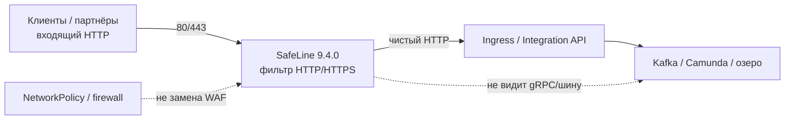
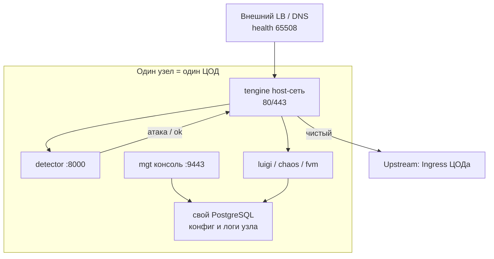
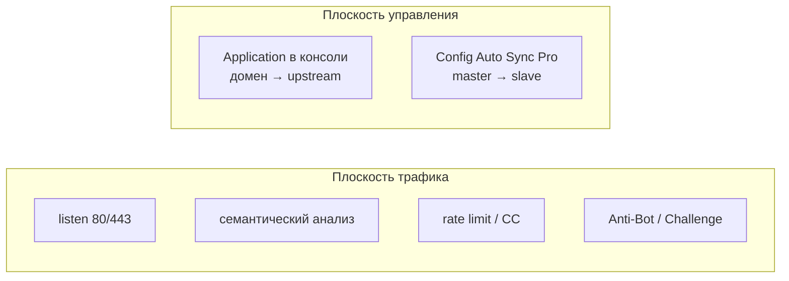
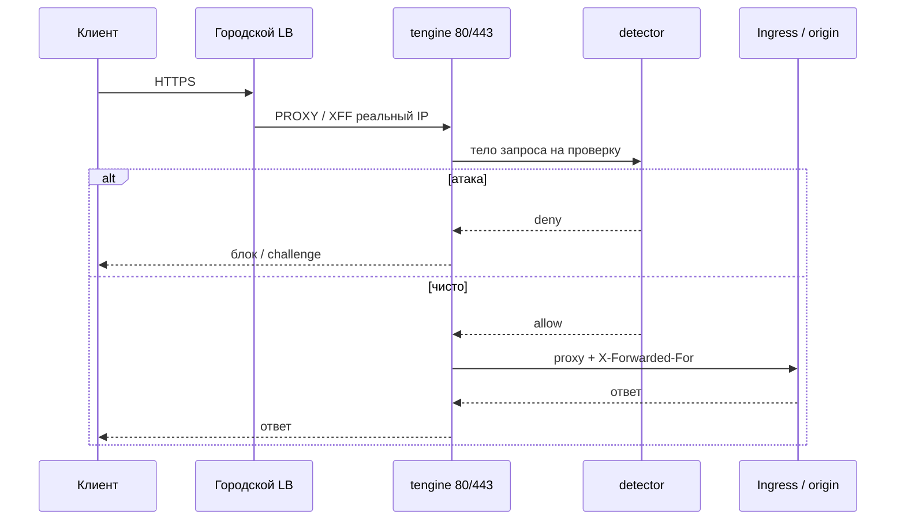
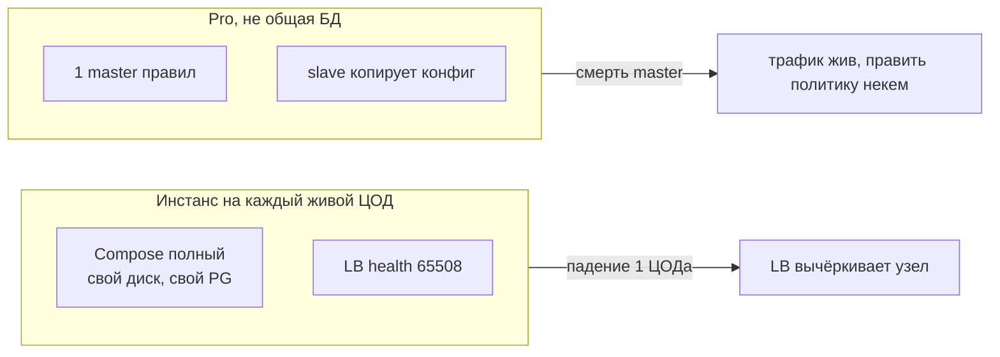
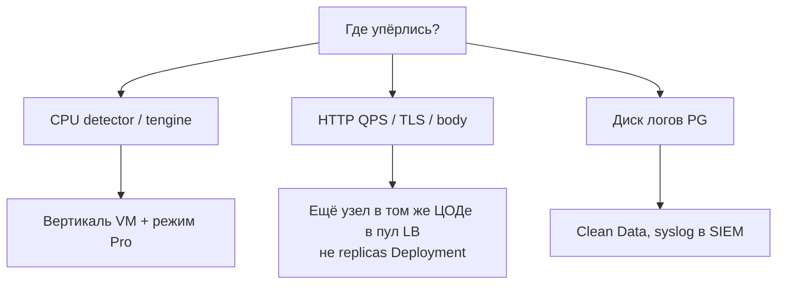
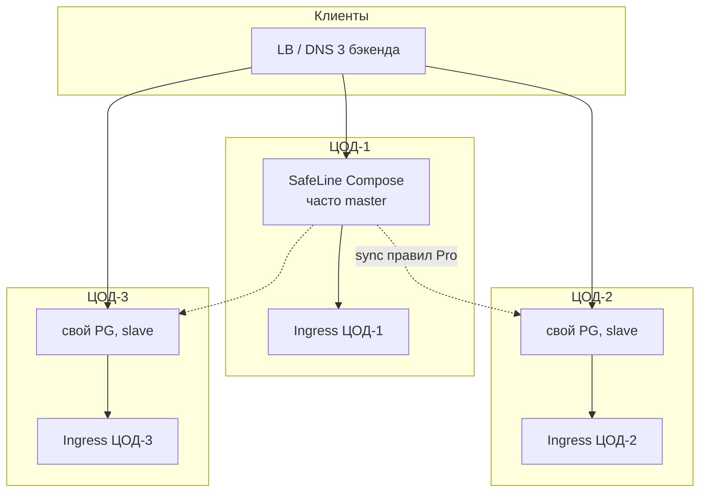

# SafeLine WAF 9.4.0 — схемы устройства

Связанные документы: правила — `SafeLine WAF.md`; установка — `SafeLine WAF.install.md`.

C4 / «D4»: контекст → контейнеры → компоненты. Код Tengine не рисуем.

Допущения:

1. Stretch «один Postgres WAF на 3 ЦОДа» **нет** и продуктом **не** поддерживается.
2. SafeLine **9.4.0**, образы международной линейки `REGION=-g` (`IMAGE_PREFIX=chaitin`). Официальный runtime — Linux + Docker Compose, не Ingress-контроллер.
3. Нагрузки QPS нет — на схемах нет «N ядер». Есть *что крутить*.

---

## 1. Контекст (C4 system context)

SafeLine — **HTTP reverse proxy (WAF)** на периметре. Не NetworkPolicy, не Kafka, не исходящие SOAP к ведомствам.

Клиент стучится в WAF, не в origin: семантика тела, не «порт открыт». Upstream — Ingress **этого** ЦОДа. NetworkPolicy восток-запад не заменяется. Обходной Ingress / прямой Service с мира = WAF в стороне.

---

## 2. Контейнеры (один инстанс = одна машина)

Один Compose-узел = полный стек со **своим** Postgres. «Три пода Deployment» официально не кластер. Community Helm: **1 replica**.

ZooKeeper, общий Redis, **общий PG на ЦОДы — нет**. Tengine в `network_mode: host`: на хосте свободны 80/443 (не делить с Ingress). Консоль **9443** — админка щита, не сайт.

**Сильное:** падение узла = этот бэкенд мёртв, остальные живы, если LB снял его. **Слабое:** SafeLine сам себе failover трафика не делает.

---

## 3. Компоненты внутри узла

| Компонент | Для чего настраивать |
|---|---|
| Application | Какой домен слушаем и куда форвардим |
| XFF / PROXY Protocol | Иначе в логах IP балансировщика, баны бессмысленны |
| detector | Узкое место CPU на пике QPS |
| свой PG | Логи атак раздувают диск; Clean Data обязателен |
| 9443 / 5432 | Не в интернет; внутри стека `sslmode=disable` |

Personal не даёт официальный HA-sync. Прод-ферма — **Pro** на каждом узле (отдельный ключ, egress `:50052` на license server).

---

## 4. Поток: HTTP через WAF

Проверка **локальная**: межЦОдовый RTT на детект почти не влияет. Dynamic Protection / Challenge на machine-to-machine API ломает интеграции — сначала лог, потом block.

---

## 5. Что настраивать: отказоустойчивость

| Ручка | Если не настроить |
|---|---|
| Узел в каждом ЦОДе | Один Compose на страну = SPOF периметра |
| Внешний LB + drain при апгрейде | Рестарт Tengine рвёт трафик (официально) |
| Config Auto Sync | Три политики, дыра в одном зале |
| Свой PG, не шарить | Продукт так не умеет; «кластер PG» — выдумка |
| Origin только с IP WAF | Иначе обход |

Апгрейд необратимо мигрирует данные: бэкап каталога, катить **по одному** ЦОДу.

---

## 6. Что настраивать: масштабируемость

FAQ: &lt;100 QPS → 2 ядра / 4 ГБ; 100–1000 → 4/8; &gt;1000 → 8/16 — **справка**, не гарантия. Терабайты озера на размер WAF не давят.

---

## 7. Прод: 2 или 3 ЦОДа без stretch

Инстанс **перед** Ingress площадки. Общего Postgres нет. Три острова без LB — не HA.

**Сильное:** отказ 1 ЦОДа по HTTP, если LB живой и конфиг уже на slave. **Слабое:** master — SPOF на *изменение* политики (процедуры promote в EN docs нет); лицензия Pro требует облако вендора.

---

## 8. Безопасность (слои)

1. Tengine 80/443 с LB; 9443 только VPN; PG не публиковать.
2. Реальный IP до IP-банов. Allowlist ведомств до Anti-Bot.
3. Pin `IMAGE_TAG=9.4.0`, `REGION=-g`, не `latest`. `.env` не в Git.
4. Не ГОСТ. Origin не должен быть доступен в обход WAF.

Источники: `SafeLine WAF.md` (tengine, detector, mgt, свой PG, Pro sync). Stretch PG на схемах не рисуем.
