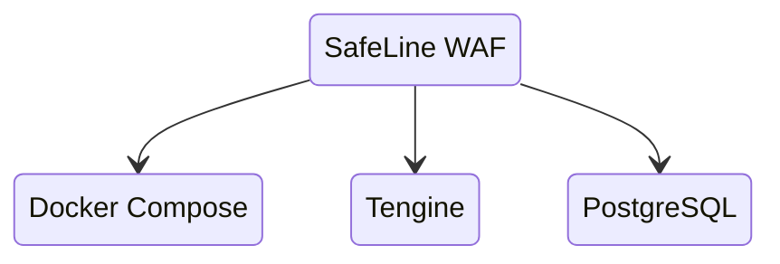
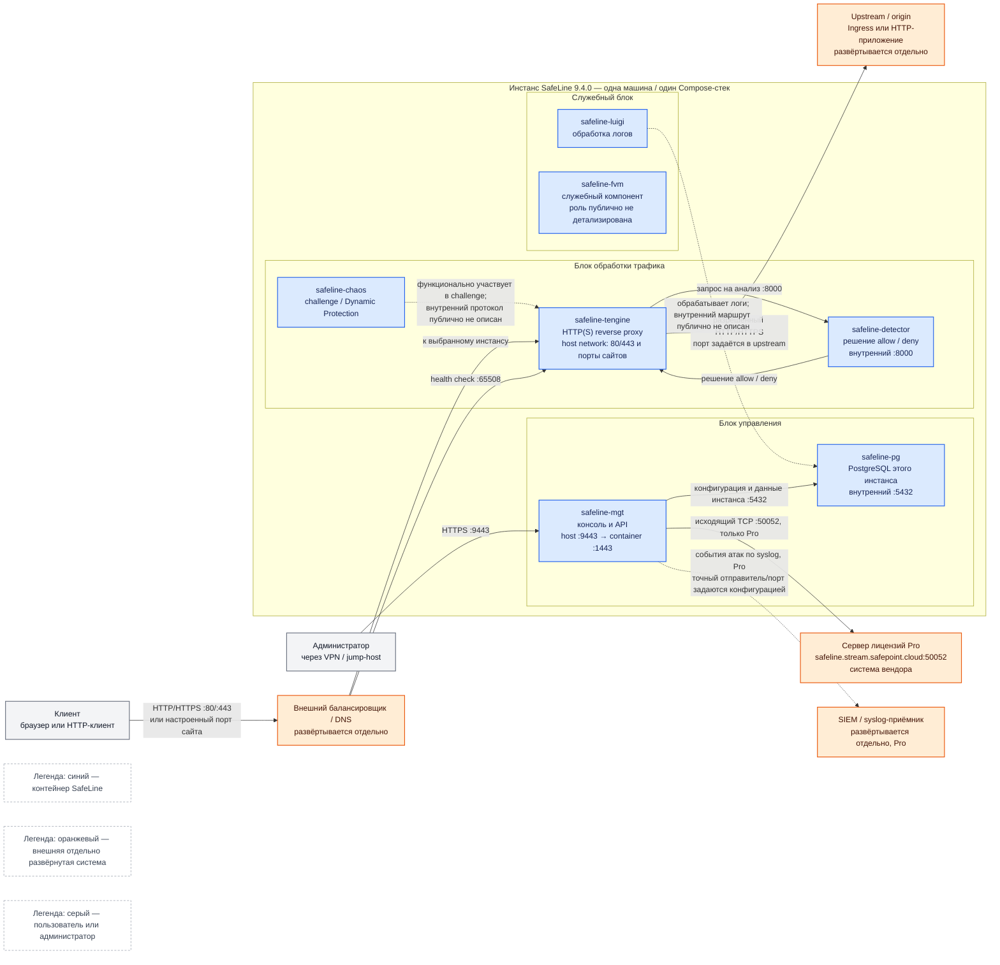

# SafeLine WAF 9.4.0 — назначение, функции и устройство

SafeLine — фильтр **HTTP и HTTPS** перед приложением: он анализирует содержимое запроса (например, инъекции, XSS и поведение ботов), а не только факт открытия сетевого порта. Клиент обращается к SafeLine, а SafeLine после проверки либо отклоняет запрос, либо передаёт его настоящему серверу.

Версия, к которой относится документ: **9.4.0** (релиз 17 августа 2026).
Документация: https://docs.waf.chaitin.com/  
Репозиторий: https://github.com/chaitin/SafeLine  
Образы международной линии: `chaitin/safeline-*`; линия выбирается через `REGION=-g`.

Документ описывает назначение, функции, состав и границы продукта. Пошаговая установка вынесена в `SafeLine WAF.install.md`.

---

## Назначение системы

SafeLine нужен на **входе HTTP**: перед опубликованным интеграционным API, веб-консолью, порталом или HTTP-колбэком партнёра. Он проверяет входящий веб-трафик и работает как обратный прокси.

SafeLine не стоит на исходящих вызовах платформы к государственным сервисам, не видит шину Kafka, не защищает PostgreSQL и не заменяет авторизацию приложения. Это не Ingress-контроллер Kubernetes, не NetworkPolicy и не средство защиты произвольного TCP, Kafka или gRPC.

Клиент должен обращаться к домену, ведущему на WAF. Если origin остаётся доступен напрямую, SafeLine можно обойти. Если перед WAF есть балансировщик, реальный IP клиента должен передаваться через поддерживаемый заголовок или PROXY Protocol; иначе правила по IP будут работать с адресом балансировщика.

---

## Перечень функций

SafeLine 9.4.0 выполняет следующие функции:

1. **Обратное проксирование:** принимает запрос на настроенных домене и порте, проверяет его и передаёт разрешённый запрос в upstream — например, в Ingress или непосредственно в HTTP-приложение.
2. **Семантический анализ запросов:** заявленное вендором ядро определяет атаки, включая инъекции и обход пути, не ограничиваясь простым поиском строк.
3. **Ограничение частоты запросов:** применяется против флуда и автоматизированного подбора.
4. **Проверка пользователя и динамическая защита:** капча, слайдер и преобразование HTML/JavaScript на лету. Эти функции включают точечно: они могут нарушить работу машинных API и легитимных клиентов.
5. **Учёт реального IP клиента:** поддерживаются `X-Forwarded-For` и PROXY Protocol.
6. **Управление защищаемыми сайтами:** в консоли задаются домен, входной порт, upstream и TLS-сертификаты.
7. **Синхронизация конфигурации в Pro:** конфигурация копируется с master на slave. Это не общая база и не кластер PostgreSQL: у каждого полного инстанса своя БД. Публичная англоязычная документация не описывает автоматическое повышение slave при потере master.
8. **Возможности Pro для эксплуатации:** экспорт событий атак по syslog и режимы производительности детектора.
9. **Проверка живости:** внешний балансировщик может использовать служебный порт **65508**.

Редакции продукта: Personal (бывшая Community, бесплатная), Lite и Pro. Pro добавляет, в частности, штатную синхронизацию конфигурации для нескольких инстансов, syslog и режимы детектора. Для проверки лицензии Pro используется постоянное исходящее соединение с сервером вендора.

---

## Основные элементы системы и зависимости

Один **инстанс SafeLine** на принятом здесь уровне абстракции — полный набор контейнеров Docker Compose на одной Linux-машине. Несколько инстансов являются самостоятельными: у каждого свой `tengine`, набор служебных контейнеров, PostgreSQL и локальные данные. Схема ниже показывает подтверждённые внешние потоки и только те внутренние связи, которые следуют из публичной документации и состава Compose.

### Схема инстансов и потоков

Сплошные стрелки показывают подтверждённый сетевой или прикладной поток. Пунктирные стрелки показывают подтверждённую функцию, но не утверждают конкретный внутренний протокол, endpoint или направление всех обменов. Отсутствие стрелки у `safeline-fvm` намеренно: контейнер есть в официальном составе, однако его внутренняя роль и интерфейсы в публичной документации не раскрыты.

Схема показывает **один** инстанс. При нескольких площадках этот блок повторяется целиком, включая собственный PostgreSQL. Внешний балансировщик распределяет трафик между инстансами; синхронизация Pro копирует конфигурацию между master и slave, но не превращает локальные БД в общую БД.

### Состав контейнеров

#### `safeline-tengine`

- **Технология / вариант:** Tengine, форк Nginx; контейнер работает в `network_mode: host`.
- **Назначение:** принимает HTTP/HTTPS, передаёт запрос на проверку и проксирует разрешённый запрос в upstream.
- **Граница продукта:** входит в SafeLine. DNS, внешний балансировщик и upstream в него не входят. Порты сайтов принадлежат сетевому пространству хоста, а не изолированной Docker-сети.
- **Уровень детализации:** публично подтверждены роль reverse proxy, host-сеть и взаимодействие с detector; внутренний pipeline модулей Tengine здесь не моделируется.

#### `safeline-detector`

- **Технология / вариант:** отдельный контейнер движка обнаружения; в Pro доступны режимы производительности.
- **Назначение:** анализирует запрос и возвращает решение «разрешить / заблокировать».
- **Граница продукта:** входит в SafeLine и не является внешним антивирусом, SIEM или IDS.
- **Уровень детализации:** алгоритмы, модель, формат внутреннего запроса и устройство процесса вендор публично не раскрывает; схема фиксирует только логическую проверку через внутренний порт `8000`.

#### `safeline-mgt`

- **Технология / вариант:** отдельный контейнер управления; наружу публикуется HTTPS-консоль `9443`, соответствующая контейнерному порту `1443`.
- **Назначение:** управление сайтами, upstream, сертификатами и защитными правилами; в Pro участвует в лицензионном и многосайтовом контуре управления.
- **Граница продукта:** входит в SafeLine. VPN, jump-host, корпоративный каталог пользователей и сервер лицензий вендора — внешние системы.
- **Уровень детализации:** язык реализации, внутреннее разбиение API и точный механизм Config Auto Sync в публичной документации не подтверждены и здесь не заявляются.

#### `safeline-pg`

- **Технология / вариант:** PostgreSQL, поставляемый в Compose вместе с конкретным релизом SafeLine.
- **Назначение:** локальное хранение конфигурации, логов и статистики данного инстанса.
- **Граница продукта:** контейнер входит в SafeLine; это не корпоративная СУБД платформы и не общая БД нескольких площадок. Внешний PostgreSQL штатной схемой не заявлен.
- **Уровень детализации:** схема таблиц и все потребители БД публично не описаны. Поэтому диаграмма не изображает неподтверждённые SQL-связи каждого контейнера.

#### `safeline-luigi`

- **Технология / вариант:** отдельный контейнер образа `safeline-luigi`; публичная документация описывает его на функциональном уровне обработки логов.
- **Назначение:** обработка данных журналов внутри инстанса.
- **Граница продукта:** входит в SafeLine. Внешнее долговременное хранение и анализ событий выполняет отдельная SIEM; экспорт syslog относится к Pro.
- **Уровень детализации:** язык реализации, очереди, внутренние порты и точная последовательность записи в PostgreSQL публично не подтверждены.

#### `safeline-chaos`

- **Технология / вариант:** отдельный контейнер образа `safeline-chaos`.
- **Назначение:** функции challenge, включая капчу, и Dynamic Protection.
- **Граница продукта:** входит в SafeLine; браузер или машинный клиент остаётся внешним участником.
- **Уровень детализации:** внутренний API между `chaos`, `tengine` и другими контейнерами публично не описан, поэтому пунктир на схеме означает функциональное участие, а не доказанный сетевой вызов.

#### `safeline-fvm`

- **Технология / вариант:** отдельный контейнер образа `safeline-fvm`.
- **Назначение:** в публичном Compose контейнер присутствует как служебный компонент.
- **Граница продукта:** входит в SafeLine.
- **Уровень детализации:** расшифровка имени, внутренняя ответственность, протоколы и зависимости в доступной публичной документации не подтверждены. Документ намеренно не приписывает ему конкретную функцию.

### Внешние элементы и граница продукта

- **Клиенты и администраторы** — участники взаимодействия, а не части SafeLine.
- **DNS и внешний балансировщик** выбирают доступный инстанс и выполняют health check. SafeLine не заменяет этот слой и сам не переключает внешний трафик между машинами.
- **Upstream / origin** — Ingress или HTTP-приложение платформы. SafeLine фильтрует запрос до него, но не заменяет маршрутизацию Kubernetes, бизнес-авторизацию и NetworkPolicy.
- **Сервер лицензий** принадлежит вендору. Он нужен для Pro и находится за границей развёртывания SafeLine.
- **SIEM / syslog-приёмник** развёртывается отдельно. SafeLine Pro может передавать туда события, но SIEM не входит в продукт.
- **Kafka, Camunda, PostgreSQL бизнес-системы и озеро данных** не подключаются к SafeLine как к внутренним компонентам. Они оказываются за WAF только если предоставляют внешний HTTP-интерфейс через отдельный origin.

### Порты — сетевой контракт

| Порт | Направление | Назначение | Граница |
|---|---|---|---|
| **80 / 443 TCP** и настроенные listen-порты | клиент / балансировщик → `tengine` | входной HTTP/HTTPS защищаемых сайтов | host network инстанса |
| **9443 TCP** | администратор → `mgt` | HTTPS-консоль; отображение `9443 → 1443` задаётся `MGT_PORT` | вход в SafeLine |
| **65508 TCP** | балансировщик → инстанс | health check; порт не изменяется | вход в SafeLine |
| **65443 TCP** | HTTP-клиент → инстанс | пользовательская страница ошибки; порт не изменяется | вход в SafeLine |
| **8000 TCP** | `tengine` ↔ `detector` | внутренняя проверка запроса | только внутри инстанса |
| **5432 TCP** | контейнеры инстанса → `safeline-pg` | локальный PostgreSQL | внутренний, не публикуется как сервис платформы |
| **50052 TCP** | `mgt` → сервер лицензий | исходящая связь Pro с `safeline.stream.safepoint.cloud` | выход из SafeLine к системе вендора |
| **порт upstream** | `tengine` → origin | разрешённый HTTP/HTTPS | задаётся для каждого защищаемого сайта |
| **порт syslog** | SafeLine Pro → SIEM | экспорт событий атак | выбирается в конфигурации; единого номера в использованных источниках не подтверждено |

Таблица фиксирует назначение портов, но не является инструкцией межсетевого экрана. В частности, она не предполагает публикацию внутренних `8000` и `5432` наружу.

### Как читать схему

Схема — это карта одного инстанса и его внешних соседей, а не чертёж установки и не полный внутренний исходный код продукта. Читать её удобно в таком порядке.

1. **Сначала цвет прямоугольника.** Синий — контейнер, который поднимает сам SafeLine в Compose. Оранжевый — система, которую ставят и сопровождают отдельно (балансировщик, origin, SIEM, сервер лицензий вендора). Серый — человек или программа-клиент, а не сервис. Цвет не означает «обязательно включено в бой»: SIEM и лицензия оранжевые и нужны только в соответствующих сценариях (Pro / выбранная интеграция).
2. **Затем рамки.** Большая рамка «Инстанс SafeLine» — одна Linux-машина и один Docker Compose. Внутри неё три блока (трафик, управление, служебный) группируют контейнеры по роли, а не по отдельным виртуальным машинам. Три рамки не равны трём серверам.
3. **Потом стрелки.** Сплошная стрелка — поток, который публичная документация позволяет назвать (протокол, порт или смысл передачи). Пунктир — функция подтверждена, но точный внутренний протокол, endpoint или отправитель в использованных источниках не закреплены. Отсутствие стрелки у `safeline-fvm` намеренно: контейнер есть в составе, маршрут не выдуман.
4. **Направление чтения.** Пользовательский HTTP идёт слева направо: клиент → внешний балансировщик / DNS → `tengine` ↔ `detector` → origin. Администратор входит сверху/сбоку в `mgt` на `9443`, а не через порты сайтов. Лицензия Pro и syslog — исходящие потоки из инстанса, а не вход клиентов.
5. **Что схема сознательно не рисует.** Второго зала, общей PostgreSQL, автоматического failover master/slave и внутреннего устройства Tengine нет на диаграмме, потому что это либо повторение того же синего блока, либо детали, которых нет в публичных источниках. Несколько площадок = несколько полных копий рамки инстанса, каждая со своей БД.
6. **Термины.** Слова вроде host network, upstream, origin, health check, Config Auto Sync и остальные «птичьи» обозначения собраны в глоссарии ниже; в тексте схемы они не заменяются синонимами «от себя».

Ниже — те же потоки по шагам, уже поверх этой карты.

#### 1. Обычный разрешённый запрос

1. HTTP-клиент обращается к публичному домену.
2. DNS приводит его на внешний балансировщик либо непосредственно на `tengine`, если балансировщика нет.
3. Балансировщик выбирает инстанс. Поток приходит на `tengine` через `80`, `443` или другой listen-порт сайта.
4. `tengine` передаёт запрос локальному `detector` на анализ через внутренний `8000`.
5. `detector` возвращает решение `allow`.
6. `tengine` отправляет запрос в настроенный upstream. Порт upstream не является фиксированным портом SafeLine: его задают в карточке защищаемого сайта.
7. Ответ origin возвращается клиенту через тот же `tengine` и балансировщик.

На схеме этот маршрут читается слева направо по сплошным стрелкам: `Клиент → балансировщик → tengine ↔ detector → tengine → origin`.

#### 2. Заблокированный запрос или challenge

1. Первые четыре шага совпадают с обычным запросом.
2. Если `detector` возвращает `deny`, запрос не передаётся в origin.
3. В зависимости от правила клиент получает блокировку, страницу ошибки или challenge.
4. `safeline-chaos` функционально отвечает за challenge и Dynamic Protection. Пунктирная связь подчёркивает, что публичные источники не позволяют точно нарисовать внутренний wire protocol между контейнерами.
5. Порт `65443` относится к пользовательской странице ошибки. Это не дополнительный upstream приложения и не консоль.

#### 3. Управление

1. Администратор открывает HTTPS-консоль `mgt` на `9443`.
2. `mgt` читает и изменяет конфигурацию в PostgreSQL **этого** инстанса.
3. В редакции Pro управление может включать синхронизацию конфигурации master → slave. На схеме второго инстанса нет, поэтому межинстансный поток не дорисован неподтверждённым портом.
4. Для Pro `mgt` устанавливает исходящее соединение к серверу лицензий на `50052`.

#### 4. Наблюдаемость

1. Балансировщик опрашивает health endpoint инстанса на `65508`.
2. `luigi` обрабатывает логи внутри продукта. Публичные материалы не дают достаточных оснований заявить полный маршрут, протокол и все источники логов.
3. В Pro события атак можно отправлять во внешнюю SIEM по syslog. Поскольку использованные официальные страницы не закрепляют один обязательный порт и конкретный контейнер-отправитель, схема показывает этот поток пунктиром и без выдуманного номера.

#### 5. Несколько инстансов

Каждый инстанс повторяет весь синий блок схемы. Балансировщик направляет новый запрос только в живой инстанс. В Pro конфигурация может копироваться с master на slave, однако HTTP-трафик каждого узла обрабатывается локально, а PostgreSQL и журналы не становятся общими. Синхронизация конфигурации, репликация БД и переключение внешнего трафика — три разные функции; SafeLine штатно заявляет только первую, а внешнему балансировщику оставляет третью.

---

## Глоссарий

- **Allow / deny** — решение разрешить запрос или прекратить его обработку.
- **API** — программный HTTP-интерфейс, которым пользуется другая программа, а не человек в браузере.
- **Challenge** — дополнительная проверка клиента, например капча или слайдер, до допуска к приложению.
- **Config Auto Sync** — возможность Pro копировать конфигурацию SafeLine с master на slave; не репликация общей БД.
- **Контейнер** — изолированный процесс с упакованной программой и её зависимостями.
- **Docker Compose** — описание и запуск набора связанных контейнеров на машине.
- **Dynamic Protection** — преобразование отдаваемых HTML/JavaScript для усложнения автоматизированного анализа; может быть несовместимо с машинными клиентами.
- **Endpoint** — сетевой адрес конкретной функции сервиса.
- **gRPC** — протокол удалённых вызовов поверх HTTP/2; в этом документе SafeLine не заявлен как универсальная защита gRPC.
- **Health check** — технический запрос балансировщика, проверяющий способность инстанса принимать трафик.
- **Host network** — режим, в котором контейнер использует сетевые интерфейсы и порты самой машины.
- **HTTP / HTTPS** — протокол веб-запросов; HTTPS добавляет шифрование TLS.
- **Ingress** — компонент Kubernetes, маршрутизирующий входящий HTTP-трафик к сервисам кластера; SafeLine его не заменяет.
- **Инстанс** — один полный самостоятельный экземпляр SafeLine на одной машине, включающий весь Compose-стек и локальную БД.
- **Jump-host** — выделенная промежуточная машина для административного доступа в закрытую сеть.
- **Kafka** — платформа передачи событий; её внутренний протокол не является предметом фильтрации SafeLine WAF.
- **Listen-порт** — порт, на котором процесс ожидает входящее соединение.
- **Master / slave** — роли источника и получателя синхронизируемой конфигурации Pro; это не роли общей PostgreSQL.
- **NetworkPolicy** — правила Kubernetes, ограничивающие сетевые соединения между workload; WAF их не заменяет.
- **Origin** — настоящий сервер приложения за обратным прокси; синоним целевого upstream в контексте схемы.
- **PostgreSQL** — реляционная СУБД; в SafeLine это локальная БД конкретного инстанса.
- **PROXY Protocol** — способ передать исходный адрес клиента через TCP-балансировщик.
- **Reverse proxy / обратный прокси** — сервер, принимающий запрос вместо приложения и пересылающий его выбранному upstream.
- **SIEM** — внешняя система централизованного сбора и анализа событий безопасности.
- **Syslog** — стандартный формат и семейство протоколов передачи журналов.
- **Tengine** — форк Nginx; в SafeLine принимает и проксирует HTTP/HTTPS.
- **TLS** — криптографический протокол, обеспечивающий шифрование HTTPS.
- **Upstream** — адрес сервера, куда обратный прокси передаёт разрешённый запрос.
- **VPN** — защищённое сетевое соединение для доступа в закрытый контур.
- **WAF (Web Application Firewall)** — фильтр веб-запросов прикладного уровня.
- **Wire protocol** — точный сетевой формат обмена между процессами.
- **X-Forwarded-For** — HTTP-заголовок, в котором доверенный прокси передаёт исходный IP клиента.
- **XSS** — внедрение вредоносного скрипта в веб-страницу.

---

## Источники

- Обзор и модель обратного прокси: https://docs.waf.chaitin.com/
- Развёртывание, `.env`, консоль и международная линия: https://docs.waf.chaitin.com/en/GetStarted/Deploy
- Добавление защищаемого приложения — Domain, Port, Upstream: https://docs.waf.chaitin.com/en/GetStarted/AddApplication
- Changelog 9.4.0, HA, syslog и PROXY Protocol: https://docs.waf.chaitin.com/en/Reference/Changelog
- FAQ — порты `9443`, `65508`, `65443`: https://docs.waf.chaitin.com/en/faq/home
- Связь Pro с сервером лицензий `:50052`: https://docs.waf.chaitin.com/LicenseDisconnectionInstructions
- Состав контейнеров, host network Tengine и отображение порта консоли: https://github.com/chaitin/SafeLine/blob/main/compose.yaml

Для внутренних протоколов `chaos`, `luigi` и `fvm`, полного маршрута журналов, порта Config Auto Sync и процедуры автоматического повышения slave подтверждения в перечисленной публичной документации не найдено; эти детали намеренно не выдуманы.
