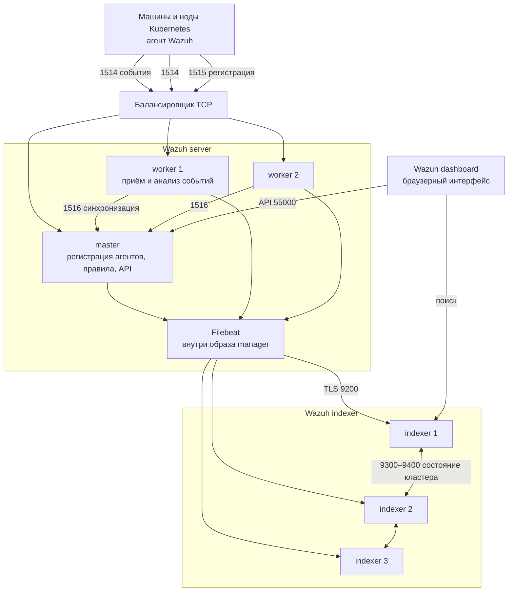

# Wazuh 4.14.7 — развёртывание и настройка

Wazuh — открытая платформа, куда складывают события безопасности с машин и контейнеров, ищут по ним и смотрят их в браузере. Это не облако вендора (Wazuh Cloud) и не замена межсетевого экрана, NetworkPolicy или Falco.

Версия, о которой этот документ: **4.14.7** (релиз 29 июля 2026, на дату подготовки — последний стабильный патч линии 4.14).  
Документация: https://documentation.wazuh.com/current/  
Образы: `wazuh/wazuh-manager:4.14.7`, `wazuh/wazuh-indexer:4.14.7`, `wazuh/wazuh-dashboard:4.14.7`, `wazuh/wazuh-agent:4.14.7`.  
На Kubernetes официальный путь: репозиторий `wazuh/wazuh-kubernetes`, тег **`v4.14.7`**, установка через Kustomize (`envs/eks/` или `envs/local-env/`). Отдельного Helm-оператора у вендора в этом гайде нет.

Этот текст — не набор команд «скопируй и запусти», а правила, без которых система не будет одновременно устойчивой к сбоям, масштабируемой и безопасной. Пошаговая установка — в `Wazuh.install.md`.

---

## Назначение системы

Wazuh нужен, чтобы **видеть, что происходит на хостах**: логи приложений и системы, кто менял файлы, насколько машина отошла от эталона настройки, какие пакеты уязвимы. Сотрудник безопасности открывает веб-интерфейс и ищет алерт, а не ходит по десятку серверов.

Система **наблюдает**. Она **не** фильтрует HTTP на входе (это SafeLine / WAF), **не** читает системные вызовы ядра так, как Falco, **не** хранит эталон клиентских карточек и **не** ходит в государственные сервисы вместо вашего интеграционного API. Алерты можно опционально куда-то ещё слать — это не делает Wazuh шиной событий или BPMN.

---

## Перечень функций

Что умеет self-hosted Wazuh 4.14.7 из коробки (по документации вендора):

1. **Собирать события с машин** программой-агентом: логи, целостность файлов, проверки конфигурации, инвентарь, реакции на хосте (если включить). Агент есть для Linux, Windows, macOS, Solaris, AIX, HP-UX; в Kubernetes — DaemonSet или sidecar из того же гайда.
2. **Принимать syslog без агента** с сетевых коробок (коллектор по умолчанию выключен).
3. **Разбирать события по правилам** на сервере (manager): декодировать, сравнить с правилами, решить, это алерт или нет. Кластер серверов — **один** управляющий узел (master) и несколько рабочих (worker). Второго master штатно нельзя.
4. **Регистрировать агентов** на master (служба `authd`, порт 1515): агент получает уникальный ключ и дальше шлёт события по зашифрованному каналу (по умолчанию TCP 1514, AES).
5. **Хранить и искать алерты** в отдельном поисковом движке (indexer на базе OpenSearch). Это **другой** кластер, не путать с кластером серверов.
6. **Показывать интерфейс** (dashboard): поиск по индексу и управление агентами через API master.
7. **Следить за файлами** (FIM): файл создали, изменили, удалили. На шумных каталогах брокера Kafka или Java это легко даёт лавину событий.
8. **Проверять, настроен ли хост по CIS-бенчмарку** (SCA). Это оценка конфигурации, не детект атаки в секунду T.
9. **Искать уязвимые пакеты** (Vulnerability Detection) через публичный сервис угроз вендора (CTI). В закрытом контуре без исходящего доступа модуль как в гайде не работает.
10. **Автоматически отвечать на хосте** (Active Response): блокировать IP, убить процесс, удалить файл. Без процесса ИБ это способ уронить интеграцию.
11. **Жить с индексами по расписанию** (ISM): через N дней сжать или удалить. Без этого диск indexer съест сам.
12. **Масштабировать приём событий** числом worker и балансировщиком; **хранение** — числом нод indexer.

Чего система **не** делает и часто путают: она не два активных master, не кворум «как у Kafka/etcd» (worker сам стучится к master — это не Raft), не WAF, не Falco, не NetworkPolicy, не озеро данных и не ГОСТ-криптография. Официального порога задержки сети между дата-центрами нет. Гарантии «терабайты алертов влезут» нет: диск считают от числа событий в секунду × агенты × срок хранения.

---

## Требования к развёртыванию

### Требования к ПО

| Что | Что ставить | Комментарий |
|---|---|---|
| **Формат поставки** | Виртуальные машины с пакетами Linux **или** контейнеры в Kubernetes | All-in-one скриптом на одну машину — учёба. Бой центральных ролей — официальный overlay `wazuh-kubernetes` v4.14.7 (Kustomize) либо те же роли пакетами на VM. Публичного Helm-оператора в этом гайде нет. |
| **Kubernetes** | Свой кластер + CSI для постоянных дисков | Официальный путь: тег репозитория **`v4.14.7`**, не `main`. Manager и indexer — **StatefulSet с диском**, не Deployment. Dashboard — Deployment. Минимум, чтобы поды просто стартанули: **2 CPU / 3 ГиБ RAM / 2 ГиБ диск** — это не бой. Для EKS 1.23+ вендор отдельно требует IAM-роль EBS CSI. |
| **ОС центральных ролей** | 64-bit Linux, x86_64 или ARM64 | Список вендора: Amazon Linux 2/2023, CentOS Stream 10, RHEL 7–10, Ubuntu 16.04–24.04. **Windows как хост indexer/server в этом списке нет.** |
| **ОС агента** | Linux, Windows, macOS, Solaris, AIX, HP-UX | На Kubernetes — DaemonSet из гайда той же версии. Агент в контейнере **без** доступа к каталогам хоста хост не мониторит. |
| **Диск** | Отдельный том на каждый под manager и каждый indexer (RWO) | Общая сетевая папка NFS «один том на три indexer» в манифестах **нет**. Indexer — машина ввода-вывода: медленный диск = очередь Filebeat = дырки в поиске при живом анализе. |
| **Ядро Linux** | `vm.max_map_count ≥ 262144` на нодах indexer | Иначе indexer падает. В K8s-манифесте это привилегированный init-контейнер `sysctl`. После ребута ноды значение должно остаться. |
| **Балансировщик** | Отдельное ПО, TCP перед 1514 (и обычно 1515) | Не часть образа Wazuh. Официальная рекомендация: агент знает один адрес, а не список всех worker. |
| **Часы** | NTP на всех машинах | Сессии, сертификаты и кластер indexer чувствительны к разъезду времени. |
| **Сертификаты** | Свои доверенные в бою | Скрипт `generate_certs.sh` в репозитории делает самоподписанные. Для API вендор прямо советует свой сертификат. |
| **Лицензия** | Отдельного license-server нет | Центральные компоненты — GPLv2 / Apache 2.0 по quickstart. Это не SafeLine. |

Готовый учебный путь «всё на одной машине» у вендора есть — для знакомства, не для боя на нескольких площадках.

### Требования к ресурсам

Цифры ниже — **ориентир вендора**, не смета вашей нагрузки. Нагрузки в исходном запросе не было.

All-in-one (один хост, до ~100 агентов, 90 дней в индексе):

| Агенты | CPU | RAM | Диск |
|---|---|---|---|
| 1–25 | **4 vCPU** | **8 ГиБ** | **50 ГБ** |
| 25–50 | **8 vCPU** | **8 ГиБ** | **100 ГБ** |
| 50–100 | **8 vCPU** | **8 ГиБ** | **200 ГБ** |

Распределённая установка, **на один узел** (не «на весь бой»):

| Компонент | Минимум | Рекомендовано |
|---|---|---|
| Wazuh server | **2 ГиБ RAM / 2 CPU** | **4 ГиБ / 8 CPU** |
| Wazuh indexer | **4 ГиБ RAM / 2 CPU** | **16 ГиБ / 8 CPU** |

Диск **на одного агента за 90 дней** (таблица вендора, не ваш Kafka с auditd):

| Что мониторят | Оценка событий/с | Indexer | Server |
|---|---|---|---|
| Сервер | 0.25 | **3.7 ГБ** | **0.1 ГБ** |
| Рабочая станция | 0.1 | **1.5 ГБ** | **0.04 ГБ** |
| Сетевое устройство | 0.5 | **7.4 ГБ** | **0.2 ГБ** |

Пример с той же страницы: 80 станций + 10 серверов + 10 сетевых ≈ **231 ГБ** на indexer за 90 дней. Это единица пересчёта, когда появятся свои числа событий в секунду.

Дополнительно:

- Куча Java indexer: половина RAM узла, `Xms = Xmx`. В примере вендора 8 ГБ RAM → 4g. Overlay Kubernetes с лимитом 2 ГиБ и `-Xms1g` — стенд, не план ёмкости.
- Патч `envs/eks`: **500m–1 CPU, 1–2 ГиБ RAM, 10 ГиБ PVC** — «чтобы стартануло», не таблица recommended hardware.
- Минимум Kubernetes «поды поднялись»: **2 CPU / 3 ГиБ / 2 ГиБ** — не бой.
- «Архивы» (все события, не только алерты) и широкий FIM на брокерах наполняют диск сами, независимо от терабайт озера данных.

---

## Основные элементы системы и зависимости

Платформа — это **несколько отдельных программ**, а не один процесс. Ниже — те, что ставятся как отдельные инстансы (свой процесс, часто своя машина), и как они вызывают друг друга.

### Схема инстансов и потоков



Как читать схему:

1. На наблюдаемой машине (или в поде) работает **агент**. Он собирает логи и следит за файлами и шлёт это на сервер по зашифрованному каналу. Пока агент не зарегистрирован, он ходит на порт **1515** (это живёт на **master**). Уже зарегистрированный — на **1514**.
2. Перед 1514/1515 в бою стоит **балансировщик**. Иначе агент знает один IP, и падение этого IP = слепые агенты, даже если worker'ы ещё живы.
3. **Worker** принимает события и применяет правила. **Master** один: регистрация агентов, эталон правил и ключей, API управления. Worker сам инициирует связь с master по порту **1516**. Автовыбора нового master **нет**.
4. На каждом server в образе есть **Filebeat**: читает JSON-алерты и по TLS отдаёт их в indexer на **9200**. Без Filebeat алерты лежат в файлах manager, а dashboard их не увидит.
5. **Indexer** — отдельный поисковый кластер. Ноды общаются по **9300–9400**. Это не «тот же OpenSearch, что у платформы для логов приложений».
6. **Dashboard** ходит в indexer за поиском и в API master за агентами. Он **без своего склада**: потерял indexer или master — часть экрана пустая. Официальный манифест ставит **1** реплику.

Рядом, но это уже другое ПО: TCP-балансировщик, ваш сбор логов, Falco (другой слой: системные вызовы ядра), WAF на HTTP-входе. Пересечение «shell в контейнере» у Wazuh и Falco — два слоя, не «поставили одно — второе не нужно».

### Что входит в состав

| Роль | Зачем | Как масштабируется |
|---|---|---|
| **Agent** | Сбор с машины | По числу машин и нод (пакет или DaemonSet) |
| **Server master** | Регистрация, эталон правил/ключей, API | Всегда **один**. Второго штатно нельзя |
| **Server worker** | Приём и анализ событий | Горизонтально: больше worker + балансировщик |
| **Filebeat** | Доставка алертов в indexer | На каждом server, в образе manager |
| **Indexer** | Хранение и поиск | Горизонтально: ноды + шарды и копии шардов |
| **Dashboard** | Интерфейс | Несколько реплик Deployment на тот же indexer; официальный YAML даёт 1 |

### Порты (контракт сети)

| Порт | Назначение | Кому открывать |
|---|---|---|
| **1514/TCP** | События уже зарегистрированных агентов (UDP 1514 по умолчанию выключен) | Агенты и балансировщик. Не мир |
| **1515/TCP** | Регистрация агентов (`authd`), живёт на master | Агенты / балансировщик. Не интернет: пароль из публичного манифеста известен |
| **1516/TCP** | Разговор master↔worker | Только узлы server-кластера |
| **55000/TCP** | REST API | Dashboard и операторы. Не мир |
| **514 UDP/TCP** | Syslog-коллектор | По умолчанию **выключен** |
| **9200/TCP** | REST indexer (Filebeat, dashboard) | Только server и dashboard. Не мир |
| **9300–9400/TCP** | Общение нод indexer | Только ноды indexer |
| **443** (в контейнере dashboard часто **5601**) | Веб-интерфейс | Только внутренняя сеть / единый вход. Не интернет |

Канал агент↔server по умолчанию: **AES** (блок 128 бит, ключ 256 бит). Blowfish — опция. Filebeat→indexer и dashboard→API — **TLS + логин/пароль**.

### Зависимости окружения

- Постоянные диски под manager и indexer. Рестарт пода без PVC = потеря данных этой роли.
- Исходящая сеть до Wazuh CTI, если включаете поиск уязвимостей. Иначе модуль не обещать «из коробки».
- Зеркало образов и пакетов `4.14.7` в закрытом контуре — иначе поды не стартанут.
- Идентификация людей: не общий `admin` из примера. Единый вход — отдельная настройка dashboard/indexer, не «галочка в `kubectl apply -k`».

---

## Краткие вводные

### Как устроена отказоустойчивость

Это **два разных кластера** плюс агенты. Путать их — главная ошибка. All-in-one на одной машине — одна точка отказа всего сразу.

**1) Server (master / worker)**

| Что падает | Что происходит |
|---|---|
| Один worker, агенты смотрят в балансировщик | Балансировщик перестаёт слать на него. Приём событий жив на остальных |
| Worker, а агент знает только его IP | Этот агент слепой, пока не переключится |
| **Master** | Регистрация новых агентов и управление, завязанные на этот узел, встают. Синхронизация правил/ключей на worker останавливается. Анализ на worker вендор **не** обещает отдельным SLA «N часов без master» — это учение, не слайд |
| Весь дата-центр с master | То же + API, на который смотрит dashboard, мёртв. Поиск по уже лежащим алертам в indexer может ещё открыться |
| Нет балансировщика | Падение одного IP = слепые агенты, даже если worker'ы живы |

Следствие: устойчивость **приёма событий** = несколько worker + балансировщик (или список запасных адресов на агенте). Устойчивость **управления** = живой единственный master и заранее написанный сценарий, что делать, когда его площадка мертва. Нового master система **сама не выберет**.

**2) Indexer (поиск)**

| Что падает | Что происходит |
|---|---|
| Одна нода данных при **хотя бы одной копии** шарда и шардах на разных узлах | Полный индекс ещё доступен (официальный пример на 3 узлах) |
| Одна нода при **0 копий** (заводской шаблон индекса) | Дырка в индексе. Это **не** устойчивость |
| Потеря большинства узлов, которые выбирают «кто ведёт кластер» | Кластер не выбирает ведущего — запись и стабильность под вопросом. На трёх таких узлах пережить **две** площадки нельзя честно |
| Filebeat не достучался до 9200 | Анализ на server идёт, поиск в интерфейсе отстаёт или дырявится |

Официально: несколько нод indexer — «когда нужны устойчивость и нагрузка». Zone awareness — чтобы копия шарда жила в **другой** зоне, чем основная. Пока задержку сети не измерили, размазывать indexer на три площадки вслепую нельзя: порога в миллисекундах у вендора нет.

**3) Агент**

Агент падает вместе с машиной — это нормально. Пока машина жива, а путь до 1514 мёртв — на машине копится очередь, но бесконечный буфер вендор не обещает.

**4) Dashboard**

Падение единственного пода UI = нет экрана. Детект и поиск от этого не обязаны умереть. Один под в официальном YAML — точка отказа **просмотра**, не анализа.

### Как устроено масштабирование

Три разные оси (их путают):

1. **Больше агентов и событий** → больше **worker** и следить, чтобы счётчики отброшенных событий (`events_dropped`, `discarded_count`) были **0**. Иначе — ресурсы или ещё worker, не «ещё один master».
2. **Больше хранения и поиска** → больше **indexer** (RAM, диск, ноды), схема кусков индекса и политика жизни индексов. Куча Java не раздувать «на глаз».
3. **Больше нод Kubernetes** → DaemonSet агентов растёт сам. На центральные роли это давит **потоком событий**, не «числом микросервисов» напрямую.

Горизонтально растут: worker, ноды indexer, реплики dashboard. Master не клонируют. Терабайты озера Wazuh сами не наполняют.

### Безопасность самой Wazuh

Компрометация manager или indexer = карта вашей инфраструктуры, командная строка, пути, иногда содержимое файлов из слежения за целостностью. Кластерный ключ (ровно 32 символа) и пароль регистрации агента равносильны возможности принять чужой агент или войти в синхронизацию узлов.

Официальный overlay Kubernetes кладёт в Git **известные** секреты. Их нельзя оставлять в бою:

| Секрет | Значение в публичном манифесте `v4.14.7` |
|---|---|
| Пароль регистрации агентов | `password` |
| Учётка indexer | `admin` / `SecretPassword` |
| Учётка dashboard | `kibanaserver` / `kibanaserver` |
| Учётка API | `wazuh-wui` / `MyS3cr37P450r.*-` |
| Ключ кластера server | `123a45bc67def891gh23i45jk67l8mn9` |

Документация Kubernetes буквально говорит: пароль регистрации по умолчанию — `password`. Документация API: сменить заводские пароли и **не** оставлять самоподписанный сертификат, если можно иначе.

«Включить `kubectl apply -k` и отдать dashboard в интернет» — это новая поверхность атаки, не контур безопасности.

Опасные значения «из коробки / из примера»:

| Что | Как в примере | Почему опасно |
|---|---|---|
| Overlay-секреты | см. таблицу выше | Первый же, кто видел GitHub |
| Шаблон индексов | 3 основных куска, **0 копий** | Падение одной ноды = дырка в SIEM |
| Самоподписанные сертификаты скрипта | норма для стенда | В бою люди привыкают игнорировать предупреждение браузера |
| Репозиторий пакетов после установки | остаётся включённым, если не выключить | Случайный `yum update` разъезжает версии (совет quickstart — выключить) |
| Агент в контейнере без каталогов хоста | «поставили YAML» | Хост не мониторится — галочка, не покрытие |
| Active Response | легко включить «для безопасности» | Ложный позитив на интеграционном контуре |

Штатный AES/TLS — не отдельная криптография по требованиям КИИ, если ИБ её выдвинет.

---

## Допущения

Ниже то, чего не было в исходном запросе, но без чего нельзя нарисовать конкретную схему. Если допущение неверно — схему надо пересмотреть.

1. Берём **свою установку open-source 4.14.7**, не Wazuh Cloud.
2. Бой центральных ролей крутится в Kubernetes, установщик — **`wazuh-kubernetes` v4.14.7**. Агенты — пакет на VM и/или DaemonSet из того же гайда. Если server/indexer ставят «голым» Linux рядом с Kubernetes — правила устойчивости те же, меняется только оркестрация дисков.
3. Три дата-центра = три независимых отказа (питание, сеть). Три зала с общим ИБП эту схему не спасают.
4. Один indexer+server, размазанный на три площадки, принимается **только если** задержка на портах **9300** и **1516** измерена и приемлема. Порога у вендора нет. Пока замер не сделан — это гипотеза.
5. Цель отказа: пережить **один** дата-центр по данным и приёму событий, не два из трёх. На трёх узлах «кто ведёт indexer», размазанных по одному на площадку, потеря двух площадок снимает большинство голосов.
6. Нагрузки нет — поэтому **нет** цифры «N worker и M терабайт диска». Есть сигналы (отброшенные события, жёлтый/красный indexer, куча Java, диск) и рычаги (worker, железо indexer, правила, FIM, ISM).
7. Формального обещания «ни один лог не потерян» нет. Очереди агента и отбросы анализа — штатный риск, его надо мерить.
8. Будет приёмник людей (дежурство). Интерфейс без политики хранения — поисковик, не безопасность. Falcosidekick в Wazuh можно целить отдельно — это не часть дистрибутива Wazuh.
9. Корпоративные сертификаты есть или будут. Самоподписанные — для теста.
10. Штатный набор правил и CIS — старт, не финиш. На Java/Kafka будет шум. Active Response в первом боевом контуре **выключен**.
11. Поиск уязвимостей в закрытом контуре может быть выключен, пока нет решения по CTI.
12. Учебный стенд изолирован. На нём допустимы all-in-one и заводские пароли *внутри песочницы*. В бой их не копируем.
13. Kafka, Camunda, озеро, интеграционное API — источники логов и поверхность FIM, не часть Wazuh. Их машины обязаны иметь агента (или syslog), иначе SIEM слепой там, где деньги и гособмен.
14. Отдельного license-server нет.

---

## Критически важные условия, которых нет в исходном контексте

Их нужно закрыть **до** «поставили Kustomize и забыли».

| Пробел | Почему это ломает решение |
|---|---|
| **Задержка и потери между дата-центрами** на портах 9300 и 1516 | Indexer чувствителен к задержке состояния кластера. Zone awareness есть, цифры «можно при 80 мс» нет. Без замера растяжка на 3 площадки — лотерея |
| **Один Kubernetes на три площадки или три кластера** | От этого зависит: один набор индексов или три разных SIEM (три правды для дежурных — обычно плохо) |
| **Где живёт единственный master** | Нельзя «по одному master на площадку». Нужно явно: в каком дата-центре master и как переживают его смерть агенты и dashboard |
| **Число агентов и событий в секунду** | Без этого нельзя выбрать диск indexer, число worker, кучу Java. Таблица 3.7 ГБ/сервер — не Kafka с audit |
| **Срок хранения алертов и персональные данные** | Политика индексов, шифрование томов, что писать в FIM (персональные данные в файлах), куда можно выносить командную строку |
| **Куда смотрит dashboard** (только внутренняя сеть? единый вход?) | Публичный 443 с `admin`/`SecretPassword` — инцидент, не пилот |
| **Есть ли уже Falco / другой агент на хосте / auditd** | Два агента на одной ноде — двойной шум и двойная нагрузка. Нужна матрица: кто за системные вызовы, кто за логи и файлы |
| **Политика `kubectl exec` / отладка в бою** | Правила либо орют, либо их выключат. Это процесс, не YAML |
| **Класс диска: локальный SSD vs сеть** | Медленный том = очередь Filebeat = дырки в SIEM |
| **Исход в интернет (CTI, packages.wazuh.com)** | Закрытый контур: зеркало образов, иначе поды не стартанут; поиск CVE без CTI — отдельное решение |

---

## Краткое описание ключевых этапов и элементов развертывания

Общий каркас (и тест, и бой):

1. Зафиксировать **Wazuh 4.14.7** и способ: all-in-one **или** `wazuh-kubernetes` v4.14.7 **или** пакеты на VM. Не смешивать 4.13 indexer с 4.14 manager «на глаз».
2. Сначала **indexer**, потом **server**, потом **dashboard** (порядок руководства по установке). В Kustomize это один `apply`, но логическая зависимость та же.
3. Выпустить **свои** секреты и сертификаты **до** первого агента в бою. Не применять секреты из Git.
4. Включить метрики: отброшенные события = 0; здоровье indexer; диск и куча Java.
5. Настроить **шаблоны индексов** (копии шардов!) и политику жизни индексов **до** боевого потока. Завод: три основных куска и **нет копий**. Для кластера из 3 нод это прямое противоречие устойчивости.
6. Поставить агентов (или syslog) и прогнать контролируемое событие (изменение файла / известный лог). Убедиться, что алерт **доехал до индекса** и виден в dashboard.
7. Только потом — сужение правил, путей FIM, SCA, дежурство.

Боевая схема на несколько дата-центров, порядок включения и проверки — в `Wazuh.install.md`. Ниже — только тестовый стенд.

---

### 1 инстанс: тестовый стенд, 1 площадка, без нагрузки

**Цель стенда:** увидеть агента, алерт, шум штатных правил на ваших образах, понять интерфейс. **Не** цель: доказать падение дата-центра и поток логов Kafka.

Официальные минимальные пути (выберите один, не оба сразу):

**Путь A — всё на одной машине Linux** (быстрее понять продукт):

```text
curl -sO https://packages.wazuh.com/4.14/wazuh-install.sh && sudo bash ./wazuh-install.sh -a
```

Это server + indexer + dashboard на одном хосте. Вендор: обычно хватает **до ~100 точек** и 90 дней индекса. После установки — **отключить репозиторий пакетов**, чтобы случайное обновление системы не разъехало версии.

**Путь B — Kubernetes `envs/local-env`** (ближе к боевому оркестратору):

- пространство имён `wazuh`;
- indexer **1** реплика;
- master 1 + worker **1**;
- dashboard 1;
- класс диска под ваш кластер;
- сертификаты скриптом репозитория.

Официальный полный overlay (не local) показывает indexer 3 / master 1 / worker 2 — это уже не «тест без нагрузки», если копировать слепо на ноутбук.

Режим «три indexer на Minikube» для знакомства **не нужен**: ложное чувство устойчивости и сгорит по RAM.

#### Что сознательно упрощаем

| Параметр | На тесте | Почему можно |
|---|---|---|
| Копии шардов indexer | 0 (и 1 узел) | Иначе «жёлтый» кластер на одном поде. Вендор: на одном узле копии **ставить 0** |
| Worker | 1 | Нет цели пережить выкат |
| Сертификаты | самоподписанные | Иначе команда утонет в PKI раньше, чем в правилах |
| Пароли overlay | можно оставить завод **только в изолированной сети** | На тесте важнее контур данных; в чек-лист боя не переносить |
| FIM / SCA | минимум путей | Сначала увидеть реальный шум |
| CTI / поиск уязвимостей | можно выключить | Часто нет интернета со стенда |
| Лимиты CPU/RAM | как в `local-env` | Не цель — ёмкость |

#### Чего на тесте **не** стоит упрощать

- Версия **4.14.7** на всех четырёх ролях (агент не старше/младше manager без чтения руководства по обновлению).
- Хотя бы один агент, который шлёт не пусто. Проверка: файл из FIM или лог → документ в индексе `wazuh-alerts-*`.
- Понимание: включать «архивы всех событий» из любопытства опасно — диск и привычка, которую утащат в бой.
- Даже на тесте с одним worker: файл настроек master **не** копируется на worker сам. Это ловушка, когда начнёте второй узел.
- Веб и порты 1514/1515/9200 **не** с интернета.

#### Сильные стороны такой схемы

- Поднимается за часы (all-in-one — быстрее).
- Совпадает с официальным quickstart / local-env.
- Дешево показывает шум правил на *ваших* логах Java/Kafka.

#### Слабые стороны (обязательно понимать)

- Нет модели отказа площадки, нет доказанной ёмкости indexer, нет балансировщика.
- Успешный алерт на простой ноде **не** доказывает, что анализ не будет отбрасывать события с брокерного узла.
- Заводские пароли и пример LoadBalancer приучают «открыть и зайти».

Практическая рекомендация: препрод = маленький **боевой профиль** (3 indexer, 1 master + не меньше 2 worker, свои секреты, копии шардов не меньше 1, политика индексов, агент на нодах с taint), даже без боевого трафика. Всё это **в одном** дата-центре.

---

## Сводка: что считать «экземпляр готов»

| Требование | Тест (1 площадка) | Бой |
|---|---|---|
| Отказоустойчивость | Не требуется | Indexer не меньше 3 нод, **копия шарда не меньше 1**; server 1 master + не меньше 2 worker + балансировщик на 1514; бэкап дисков indexer и каталога master (ключи агентов); отдельный сценарий на смерть master (второго нет). Схема на 2–3 дата-центра — в `Wazuh.install.md` |
| Производительность / масштаб | Не требуется | Worker по нулю отброшенных событий; indexer по куче Java, диску и своим событиям/с; политика жизни индексов; не «архивы на всякий случай»; ресурсы не из патча 2 ГиБ; шумные пулы (Kafka) мерить отдельно |
| Безопасность | Заводские пароли только в изоляции; интерфейс не с мира | Смена всех секретов overlay; свои сертификаты; 1516/9200/55000 закрыты; pin **4.14.7**; роли API; FIM не пылесосит персональные данные без политики; репозиторий пакетов выключен после установки |

**Не готов к бою**, если: одна машина «как тест» на несколько площадок; один indexer без копий шардов; пароли `password` / `SecretPassword` / ключ из Git; три master «для устойчивости»; агенты без балансировщика и без запасного адреса; DaemonSet без видимости хоста; тег `latest`; dashboard из интернета; нет политики индексов при «терабайтах»; ждут, что Wazuh остановит атаку как WAF или заменит Falco; задержку сети не мерили, а indexer растянули на три площадки; учение отказа master не делали.

---

## Источники (чтобы не принимать на веру)

- Релиз 4.14.7 (29 Jul 2026): https://documentation.wazuh.com/current/release-notes/release-4-14-7.html
- Список релизов: https://documentation.wazuh.com/current/release-notes/index.html
- Архитектура, порты, AES, Filebeat, типы поставки: https://documentation.wazuh.com/current/getting-started/architecture.html
- Состав ролей, агент (FIM, SCA, Active Response): https://documentation.wazuh.com/current/getting-started/components/index.html
- Quickstart all-in-one, железо до 100 агентов, отключение репозитория: https://documentation.wazuh.com/current/quickstart.html
- Server: железо, диск от событий/с, отбросы анализа: https://documentation.wazuh.com/current/installation-guide/wazuh-server/index.html
- Indexer: железо, диск: https://documentation.wazuh.com/current/installation-guide/wazuh-indexer/index.html
- Типы узлов server, один master, `ossec.conf` не синхронизируется: https://documentation.wazuh.com/current/user-manual/wazuh-server-cluster/types-of-nodes.html
- Как работает server-кластер: https://documentation.wazuh.com/current/user-manual/wazuh-server-cluster/how-server-cluster-works.html
- Агенты: запасной список vs балансировщик: https://documentation.wazuh.com/current/user-manual/wazuh-server-cluster/agent-connections.html
- HAProxy: https://documentation.wazuh.com/current/user-manual/wazuh-server-cluster/load-balancers.html
- Ключ кластера 32 символа, один элемент в списке master: https://documentation.wazuh.com/current/user-manual/reference/ossec-conf/cluster.html
- Шарды/копии, завод 0 копий, куча Java: https://documentation.wazuh.com/current/user-manual/wazuh-indexer/wazuh-indexer-tuning.html
- Зоны, роли узлов indexer: https://documentation.wazuh.com/current/user-manual/wazuh-indexer-cluster/wazuh-indexer-cluster-tuning.html
- Жизнь индексов, пример 90 дней: https://documentation.wazuh.com/current/user-manual/wazuh-indexer-cluster/index-lifecycle-management.html
- Kubernetes, clone `-b v4.14.7`, StatefulSet 3/1/2: https://documentation.wazuh.com/current/deployment-options/deploying-with-kubernetes/kubernetes-deployment.html
- CSI, 2 CPU / 3 ГиБ / 2 ГиБ, dashboard без состояния: https://documentation.wazuh.com/current/deployment-options/deploying-with-kubernetes/kubernetes-conf.html
- Репозиторий манифестов: https://github.com/wazuh/wazuh-kubernetes/tree/v4.14.7
- `vm.max_map_count`, ограничение контейнерного агента: https://documentation.wazuh.com/current/deployment-options/docker/wazuh-container.html
- Смена паролей API: https://documentation.wazuh.com/current/user-manual/api/securing-api.html

Утверждения вида «Wazuh переживёт два дата-центра» или «N ядер на брокер Kafka» в документации проекта **отсутствуют** — поэтому в этом файле их нет. Задержку на 9300 и 1516 надо измерить у себя.
