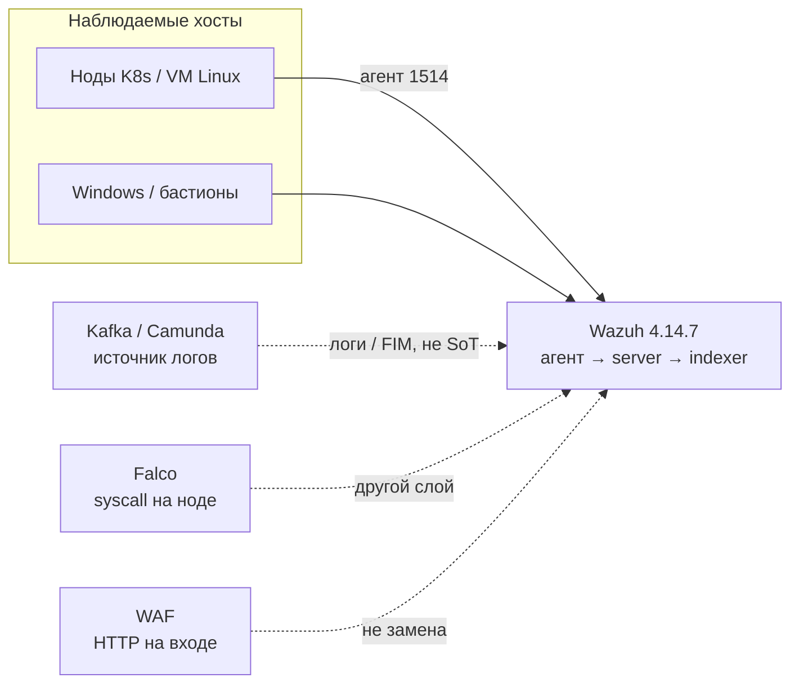
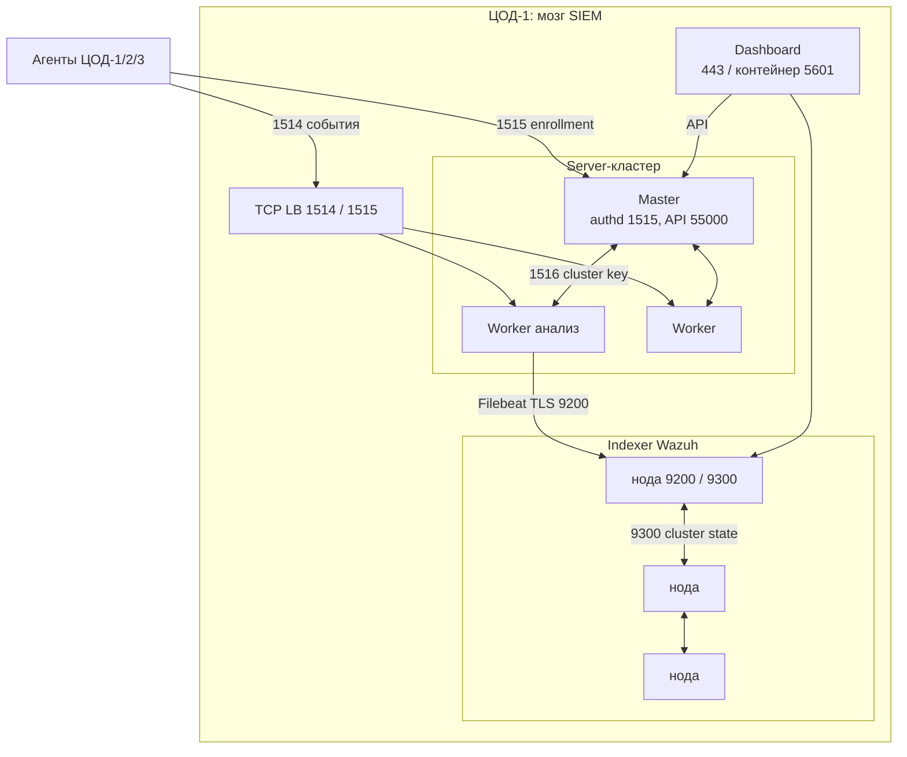
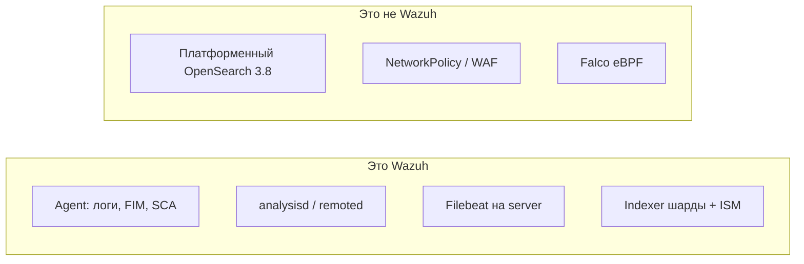
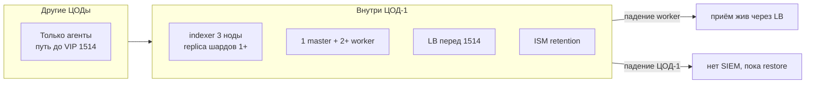
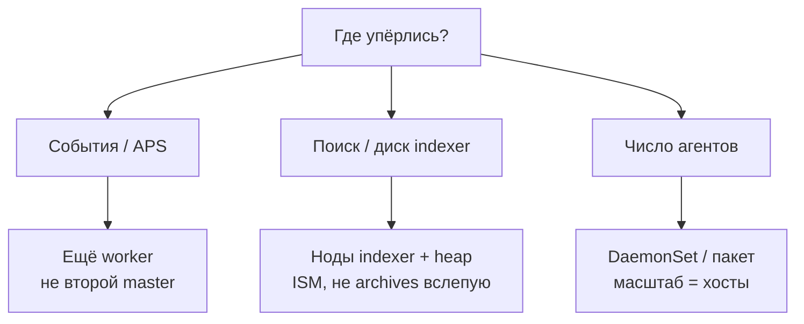
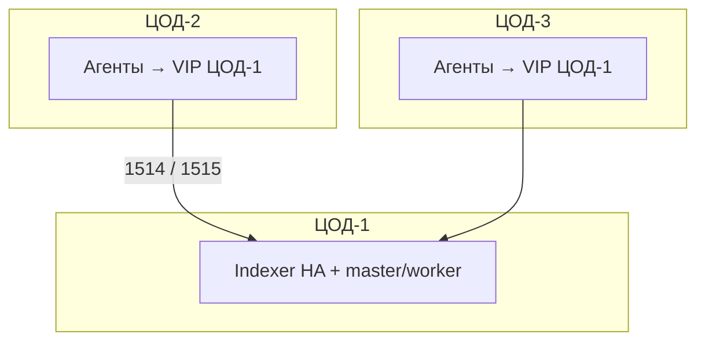

# Wazuh 4.14.7 — схемы устройства

Связанные документы: правила — `Wazuh.md`; установка — `Wazuh.install.md`.

C4 / «D4»: контекст → контейнеры → компоненты. Код агента не рисуем.

Допущения:

1. Stretch indexer/manager на 2–3 ЦОДа **нет**. HA центра — **внутри ЦОД-1**.
2. Self-hosted 4.14.7 (`wazuh-kubernetes` v4.14.7). Indexer — **свой** OpenSearch Wazuh, **не** платформенный OpenSearch 3.8.
3. Нагрузки (APS) нет — на схемах нет «N ядер». Есть *что крутить*.

---

## 1. Контекст (C4 system context)

Wazuh — **SIEM/XDR**: логи, FIM, SCA, поиск алертов. Не шина, не WAF, не Falco.



| Стрелка | Зачем помнить |
|---|---|
| Агент → server | События AES по 1514; enrollment 1515 на **master** |
| Falco / WAF рядом | Syscall и HTTP-эксплойт — не роль Wazuh |
| Kafka как хост | Без агента (или syslog) SIEM слеп там, где деньги |

**Слабое место контекста:** три изолированных Wazuh = **три SIEM**, три индекса, три правды для SOC.

---

## 2. Контейнеры (четыре роли, два кластера)

Один логический Wazuh = агенты + **один** master + worker'ы + indexer + dashboard. All-in-one — стенд, не прод.



**Сильное:** приём событий переживает падение worker (есть LB). **Слабое:** второго master **нет**; падение master = enrollment и управление встают. Это не Raft.

---

## 3. Компоненты, которые путают



Порт **1516** — только узлы server. **9300–9400** — только ноды *этого* indexer. Смешать с чужим OpenSearch нельзя: другая линейка, другие индексы.

Дефолт шаблона алертов: 3 primary / **0 replica** — не HA. Overlay-секреты в Git (`password`, `SecretPassword`) в прод не копировать.

---

## 4. Поток: агент шлёт событие

```mermaid
sequenceDiagram
  participant Ag as Агент на ноде
  participant Lb as TCP LB
  participant Wk as Worker
  participant Ms as Master
  participant Ix as Indexer
  participant Ui as Dashboard

  Ag->>Ms: enrollment 1515 (ключ агента)
  Ms-->>Ag: unique key
  Ag->>Lb: событие TCP 1514 AES
  Lb->>Wk: leastconn
  Wk->>Wk: decoder + rules
  Note over Ms,Wk: 1516: ключи/rules с master; ossec.conf worker не едет сам
  Wk->>Ix: Filebeat TLS 9200
  Ui->>Ix: поиск алерта
  Ui->>Ms: управление агентами
```

Без Filebeat алерт лежит в файлах manager, UI его не видит. `events_dropped` / `discarded_count` должны быть **0**.

---

## 5. Что настраивать: отказоустойчивость



| Ручка | Если не настроить |
|---|---|
| Indexer ≥ 3 + replica ≥ 1 | Падение узла = дырка в индексе (red/неполный) |
| LB на 1514 | Агент знает один IP пода — слепой при выкате |
| Один master, не три | «HA master» вендор **запрещает** |
| PVC manager+indexer | Deployment без диска = потеря ключей агентов |
| `vm.max_map_count` ≥ 262144 | Indexer не стартует |

Пережить **два** ЦОДа на трёх cluster-manager нельзя честно. Цель отказа — 1 площадка у мозга, не 2 из 3.

---

## 6. Что настраивать: масштабируемость



Три оси независимы: worker ≠ indexer. Ресурсы EKS-патча (2 Gi) — стенд, не ёмкость. FIM на data-dir Kafka взорвёт APS.

---

## 7. Прод: 2 или 3 ЦОДа без stretch



Один SoT алертов. Три полных стека «по кластеру как Falco» = три SIEM: SOC склеивает вручную, ruleset разъедется.

**Сильное:** кворум indexer и 1516 не едут по межЦОДовому RTT (порога мс у Wazuh **нет** — поэтому не растягиваем). **Слабое:** смерть ЦОД-1 = нет анализа/поиска для всех площадок; агенты копят очередь, бесконечный буфер не обещан.

---

## 8. Безопасность (слои)

1. Сменить все overlay-секреты; cluster key 32 символа = root кластера.
2. 9200 / 9300 / 1516 / 55000 не с мира; 1514 только от агентов/LB.
3. Свои cert, не self-signed скрипта. Dashboard не LoadBalancer в интернет.
4. Агент в K8s без hostPath/`/var/log` — декорация, хост не видит.
5. Active Response по умолчанию **выкл** на интеграционном контуре.

Источники: `Wazuh.md` (роли, порты, один master, indexer ≠ OpenSearch 3.8). Stretch на схемах не целевой.
