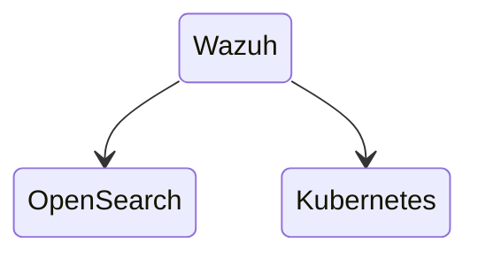
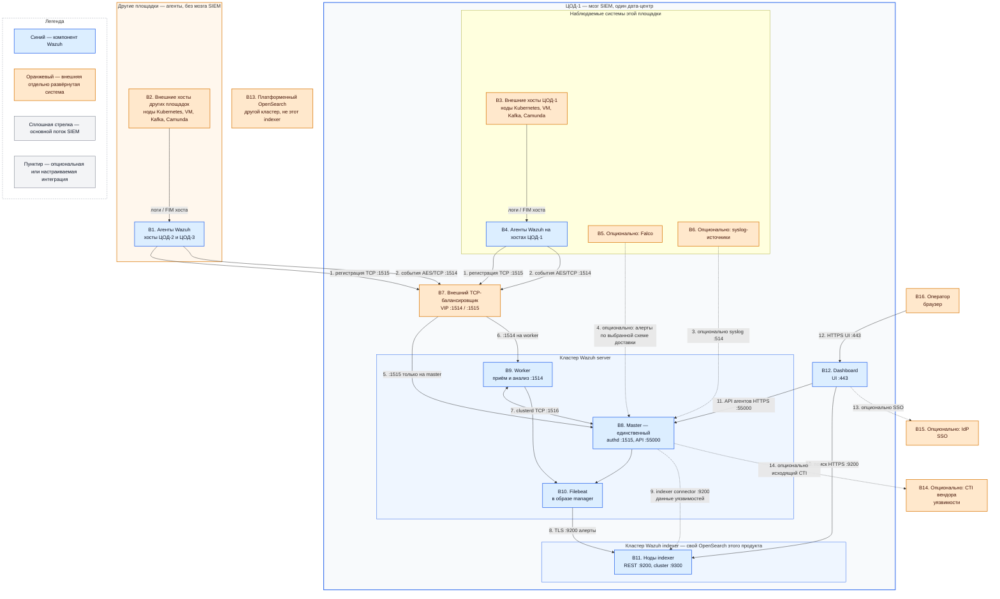

# Wazuh 4.14.7 — назначение и архитектура

Wazuh — открытая платформа, куда складывают события безопасности с машин и контейнеров, ищут по ним и смотрят их в браузере. Это не облако вендора (Wazuh Cloud) и не замена межсетевого экрана, NetworkPolicy или Falco.

Версия, о которой этот документ: **4.14.7** (релиз 29 июля 2026, на дату подготовки — последний стабильный патч линии 4.14).  
Документация: https://documentation.wazuh.com/current/  
Образы: `wazuh/wazuh-manager:4.14.7`, `wazuh/wazuh-indexer:4.14.7`, `wazuh/wazuh-dashboard:4.14.7`, `wazuh/wazuh-agent:4.14.7`.  
На Kubernetes официальный путь: репозиторий `wazuh/wazuh-kubernetes`, тег **`v4.14.7`**, установка через Kustomize (`envs/eks/` или `envs/local-env/`). Отдельного Helm-оператора у вендора в этом гайде нет.

Этот текст описывает назначение, функции, состав и потоки. Пошаговая установка — в `Wazuh.install.md`. Стыковка с площадками — в `Wazuh.shema.md`.

---

## Назначение системы

Wazuh нужен, чтобы **видеть, что происходит на хостах**: логи приложений и системы, кто менял файлы, насколько машина отошла от эталона настройки, какие пакеты уязвимы. Сотрудник безопасности открывает веб-интерфейс и ищет алерт, а не ходит по десятку серверов.

Система **наблюдает**. Она **не** фильтрует HTTP на входе (это SafeLine / WAF), **не** читает системные вызовы ядра так, как Falco, **не** хранит эталон клиентских карточек и **не** ходит в государственные сервисы вместо вашего интеграционного API. Алерты можно опционально куда-то ещё слать — это не делает Wazuh шиной событий или BPMN.

---

## Перечень функций

Что умеет self-hosted Wazuh 4.14.7 из коробки (по документации вендора):

1. **Собирать события с машин** программой-агентом: логи, целостность файлов, проверки конфигурации, инвентарь, реакции на хосте (если включить). Агент есть для Linux, Windows, macOS, Solaris, AIX, HP-UX; в Kubernetes — DaemonSet или sidecar из того же гайда.
2. **Принимать syslog без агента** с сетевых коробок (коллектор по умолчанию выключен).
3. **Разбирать события по правилам** на сервере (manager): декодировать, сравнить с правилами, решить, это алерт или нет. Кластер серверов — **один** управляющий узел (master) и несколько рабочих (worker). Второго master штатно нельзя.
4. **Регистрировать агентов** на master (служба `authd`, порт 1515): агент получает уникальный ключ и дальше шлёт события по зашифрованному каналу (по умолчанию TCP 1514, AES).
5. **Хранить и искать алерты** в отдельном поисковом движке (indexer на базе OpenSearch). Это **другой** кластер, не путать с кластером серверов.
6. **Показывать интерфейс** (dashboard): поиск по индексу и управление агентами через API master.
7. **Следить за файлами** (FIM): файл создали, изменили, удалили. На шумных каталогах брокера Kafka или Java это легко даёт лавину событий.
8. **Проверять, настроен ли хост по CIS-бенчмарку** (SCA). Это оценка конфигурации, не детект атаки в секунду T.
9. **Искать уязвимые пакеты** (Vulnerability Detection) через публичный сервис угроз вендора (CTI). В закрытом контуре без исходящего доступа модуль как в гайде не работает.
10. **Автоматически отвечать на хосте** (Active Response): блокировать IP, убить процесс, удалить файл. Без процесса ИБ это способ уронить интеграцию.
11. **Жить с индексами по расписанию** (ISM): через N дней сжать или удалить. Без этого диск indexer съест сам.
12. **Масштабировать приём событий** числом worker и балансировщиком; **хранение** — числом нод indexer.

Чего система **не** делает и часто путают: она не два активных master, не кворум «как у Kafka/etcd» (worker сам стучится к master — это не Raft), не WAF, не Falco, не NetworkPolicy, не озеро данных и не ГОСТ-криптография. Официального порога задержки сети между дата-центрами нет. Гарантии «терабайты алертов влезут» нет: диск считают от числа событий в секунду × агенты × срок хранения.

---

## Основные элементы системы и зависимости

Один логический Wazuh — это агенты плюс **два разных кластера** центральных ролей: кластер server (один master и worker) и кластер indexer. Dashboard своего склада не имеет. Мозг SIEM живёт в **одном** дата-центре; другие площадки шлют события агентами на адрес этой площадки.

**Wazuh indexer** — поисковый движок **этого** продукта на базе OpenSearch, поставляемый образами `wazuh/wazuh-indexer`. Это **не** платформенный OpenSearch и не общее «озёрное» хранилище логов приложений. Приложения платформы в indexer не пишут.

Встроенного Kafka-коннектора в Wazuh 4.14.7 нет. Kafka, Camunda и прочие нагрузки — наблюдаемые хосты: на них ставят агент (или опционально шлют syslog). Falco, syslog-коллектор, SSO через IdP и обращение к CTI вендора — отдельные, явно опциональные пути.

### Что входит в состав

| Компонент | Назначение | Принадлежность |
|---|---|---|
| **Agent** | Сбор логов, FIM, SCA, инвентаря с конкретной машины | Wazuh |
| **Server master** | Регистрация агентов, эталон правил и ключей, API управления | Wazuh; всегда **один** |
| **Server worker** | Приём событий и разбор по правилам | Wazuh; число выбирается отдельно |
| **Filebeat** | Чтение JSON-алертов с диска manager и отправка в indexer | Wazuh; в образе manager на каждом узле server |
| **Indexer connector** | Передача данных модуля уязвимостей в indexer | Wazuh; в составе manager |
| **Indexer** | Хранение и поиск алертов | Wazuh; свой кластер на базе OpenSearch этого продукта |
| **Dashboard** | Веб-интерфейс поиска и управления агентами | Wazuh |
| **TCP-балансировщик** | Стабильный VIP перед 1514 и обычно 1515 | Внешняя система; не входит в образ Wazuh |
| **Syslog-источники** | Сетевые устройства без агента | Внешние; коллектор по умолчанию **выключен** |
| **Falco** | Датчик системных вызовов Linux | Отдельный продукт; приём в Wazuh опционален |
| **IdP** | Единый вход в dashboard | Внешняя система; SSO — отдельная настройка |
| **CTI вендора** | Данные об уязвимостях для Vulnerability Detection | Внешний сервис вендора; в закрытом контуре можно не включать |
| **Платформенный OpenSearch** | Поиск и хранение платформенных данных | Другой кластер; **не** indexer Wazuh |

Горизонтально растут агенты, worker и ноды indexer. Master не клонируют. Число нод indexer и копий шардов — выбор устойчивости и ёмкости, а не фиксированный «минимум продукта». Заводской шаблон индекса алертов: 3 primary и **0 replicas**.

### Схема инстансов и потоков

Каждый прямоугольник имеет постоянное имя вида **B1**. Оно связывает схему с описаниями ниже. Синие блоки — компоненты Wazuh. Оранжевые — отдельно развёрнутые внешние системы. Пунктир — опциональный или настраиваемый путь, а не обязательное условие запуска SIEM.

Схема показывает логические инстансы и направления данных. Она **не** обещает stretch-кластер на несколько дата-центров, не фиксирует число worker и нод indexer и не включает платформенный OpenSearch в поток Wazuh. На учебном all-in-one блоки B8–B12 живут на одной машине, а B7 может отсутствовать: агент тогда знает адрес этой машины напрямую.

Встроенного Kafka-коннектора на схеме нет: его нет в составе Wazuh 4.14.7. Пересылка алертов во внешние платформы через отдельный forwarder (например Logstash) — отдельная опциональная интеграция, не часть этого продукта.

### Описание блоков

#### B1. Агенты Wazuh на других площадках

Это процессы `wazuh-agent` версии **4.14.7** на машинах и нодах за пределами дата-центра мозга. Технологии: пакет Linux/Windows/macOS (и другие ОС из списка вендора) или DaemonSet в Kubernetes той площадки. Назначение — собрать события своей машины и доставить их на VIP ЦОД-1. Агент входит в продукт; хост, на котором он стоит, — нет. Без агента (и без включённого syslog) SIEM эту машину не видит.

#### B2. Хосты других площадок

Это внешние машины и нагрузки: ноды Kubernetes, виртуальные машины, брокеры Kafka, Camunda и прочие процессы. Они порождают логи и изменения файлов, но сами в indexer не пишут. Назначение блока — показать источник наблюдаемого поведения вне ЦОД-1. Это отдельно развёрнутые системы платформы.

#### B3. Хосты ЦОД-1

Те же внешние нагрузки, но в дата-центре мозга SIEM. Kafka здесь — наблюдаемый хост и поверхность FIM, а не шина Wazuh. Назначение — локальный источник событий. Компоненты платформы в состав Wazuh не входят.

#### B4. Агенты Wazuh на хостах ЦОД-1

Тот же агент, что B1, на машинах площадки мозга. В Kubernetes имя агента должно совпадать с нодой, иначе ноды сливаются в интерфейсе. Официальный Docker-агент — syslog-коллектор и **без** каталогов хоста (`/var/log`, `/proc`) хост не мониторит. Агент — часть продукта.

#### B5. Falco (опционально)

Это отдельный датчик системных вызовов Linux, не компонент Wazuh. Технологии доставки в SIEM выбираются отдельно (например syslog или HTTP-маршрут через Falcosidekick). Назначение — другой слой наблюдения; пересечение «shell в контейнере» не отменяет ни Falco, ни Wazuh. Приём алертов Falco в Wazuh не обязателен для запуска SIEM.

#### B6. Syslog-источники (опционально)

Это внешние сетевые устройства (межсетевые экраны, коммутаторы, маршрутизаторы), которые могут слать журналы по syslog, если агент поставить нельзя. Коллектор Wazuh слушает **514** UDP/TCP и по умолчанию **выключен**. Назначение — agentless-приём. Источники развёртываются отдельно; включение коллектора — отдельная настройка server.

#### B7. TCP-балансировщик

Это внешнее ПО (например HAProxy или Kubernetes Service / LoadBalancer), не часть образа Wazuh. Оно даёт агентам один VIP на **1514** (события) и обычно на **1515** (регистрация). Назначение — пережить падение отдельного worker и не зашивать в агент IP одного пода. На all-in-one стенде балансировщик не нужен. Вендор рекомендует балансировщик перед кластером server; это рекомендация эксплуатации, а не встроенный компонент продукта.

#### B8. Master

Это единственный управляющий узел кластера Wazuh server. Технологии: пакет `wazuh-manager` или контейнер `wazuh/wazuh-manager:4.14.7`; службы `authd` (регистрация), API на **55000**, эталон правил и ключей агентов. Назначение — enrollment, синхронизация кластера и управление. Второго активного master штатно нет, автовыбора лидера нет: это не Raft. Файл `ossec.conf` на worker сам не копируется. Master — часть продукта.

#### B9. Worker

Это рабочий узел того же кластера server. Тот же пакет или образ manager в роли worker. Назначение — принимать события с **1514** и разбирать их декодерами и правилами (`analysisd`, `remoted`). Число worker выбирается по потоку событий и счётчикам отброса; «ещё один master» нагрузку не снимает. Worker сам инициирует связь с master по **1516**. Часть продукта.

#### B10. Filebeat

Это forwarder внутри образа manager на **каждом** узле server. Он читает JSON-алерты с диска manager и по TLS отдаёт их на REST indexer **9200**. Без Filebeat анализ может идти, а dashboard алертов не увидит. Это не платформенный Filebeat «для всех логов» и не Kafka-коннектор. Часть продукта.

#### B11. Ноды Wazuh indexer

Это поисковый кластер продукта: Java-процесс на базе OpenSearch **этой** поставки, образ `wazuh/wazuh-indexer:4.14.7`. REST API — **9200**, общение нод — **9300–9400**. Назначение — хранить и искать алерты. Число нод и копии шардов задают устойчивость поиска; один узел допустим, но падение узла при **0 replicas** даёт дырку в индексе. Это **не** платформенный OpenSearch. Часть продукта.

#### B12. Dashboard

Это веб-интерфейс продукта, образ `wazuh/wazuh-dashboard:4.14.7`. Снаружи обычно **443/TCP**; в контейнере Kubernetes часто слушает **5601**. Назначение — поиск по indexer и управление агентами через API master. Своего склада нет: потеря indexer или master оставляет часть экрана пустой. Официальный манифест Kubernetes ставит одну реплику; это пример поставки, а не запрет нескольких реплик Deployment на тот же indexer. Часть продукта.

#### B13. Платформенный OpenSearch

Это отдельно развёрнутый кластер платформы для прикладного поиска. На схеме он показан, чтобы его **не** путали с B11: стрелок в поток Wazuh нет. Приложения не используют Wazuh indexer как «озёрный» OpenSearch. Внешняя система, не часть продукта.

#### B14. CTI вендора (опционально)

Это публичный сервис угроз Wazuh для модуля Vulnerability Detection. Назначение — данные о CVE. В закрытом контуре без исходящего доступа модуль как в гайде не работает и может быть выключен. Внешняя система вендора, не обязательна для приёма логов и FIM.

#### B15. IdP (опционально)

Это внешний поставщик идентичности для единого входа в dashboard/indexer (OIDC или иной поддержанный способ). Назначение — вход людей без общего `admin` из примера. SSO не включается «галочкой» Kustomize и не является частью ядра SIEM. Внешняя система.

#### B16. Оператор

Это человек в браузере (через VPN или jump-host), который открывает dashboard. Не программный компонент продукта.

### Как читать схему

1. Начните с **B2/B3**. Рабочая нагрузка (контейнер, брокер Kafka, процесс Camunda, виртуальная машина) не вызывает Wazuh как свой API. Она пишет логи и меняет файлы на своей машине.
2. **B1** и **B4** — агенты на этих машинах. Один агент видит только свой хост. Агент в контейнере без каталогов хоста хост не видит. Флот агентов на ЦОД-2 и ЦОД-3 не создаёт второй SIEM: мозг один, в рамке ЦОД-1.
3. Пока агент не зарегистрирован, он идёт на **1515/TCP** (поток **1**) — это служба `authd` на **B8**. После выдачи ключа события идут на **1514/TCP** с AES (поток **2**). UDP 1514 по умолчанию выключен.
4. **B7** — внешняя точка входа. Агент знает один VIP, а не список подов worker. Если балансировщика нет, адрес в конфигурации агента — конкретный server; падение этого адреса делает агента слепым, даже если другие worker живы. На одноузловом стенде B7 можно не ставить.
5. Балансировщик обязан отправлять **1515 только на master** (поток **5**). События **1514** — на worker (поток **6**). Путать эти порты нельзя: регистрация на worker штатно не живёт.
6. **B9** принимает событие, декодирует его и сверяет с правилами. Результат — алерт или «не алерт». Горизонтальное масштабирование приёма — это добавление worker, не второго master.
7. Поток **7** (**1516/TCP**) — разговор master↔worker: ключи агентов и правила. Worker сам стучится к master. Это **не** Raft и не выборы лидера. Падение master останавливает регистрацию, API и синхронизацию; вендор не даёт SLA «N часов анализа без master».
8. **B10** забирает JSON-алерты с диска server и по TLS кладёт их в **B11** на **9200** (поток **8**). Пока Filebeat не достучался, интерфейс отстаёт или дырявится, хотя разбор на worker может продолжаться.
9. **B11** — свой поисковый кластер продукта. Ноды общаются по **9300–9400**. Это не B13. Приложения платформы сюда не подключаются. Число нод на схеме не фиксировано: одна нода — рабочий минимум процесса; несколько нод и копии шардов — отдельное решение об устойчивости.
10. **B12** читает индекс (поток **10**) и спрашивает API master про агентов (поток **11**). Оператор (**B16**) открывает только dashboard, не порты 9200/55000/1516 с мира.
11. Пунктир **3**: syslog на **514**, коллектор выключен, пока его явно не включат. Это не замена агента на Linux-ноде приложения.
12. Пунктир **4**: Falco может отдавать алерты в Wazuh, если вы настроите доставку. Схема не назначает конкретный протокол обязательным. Falco остаётся отдельным продуктом.
13. Пунктир **9**: indexer connector менеджера шлёт в indexer данные модуля уязвимостей. Это не Kafka и не путь обычных алертов Filebeat.
14. Пунктиры **13** и **14**: SSO через IdP и исходящий CTI включаются отдельно. Закрытый контур может обойтись без обоих.
15. Оранжевые блоки сопровождаются отдельно: у них свои отказы, порты и владельцы. Синие блоки входят в поставку Wazuh. Цвет не означает обязательность: обязательность потока показывают тип стрелки и этот список.
16. Растягивать кластер indexer или server на несколько дата-центров схема **не** предлагает: порога RTT у вендора нет, межплощадочный кворум на **9300** и **1516** здесь не рисуется. Три полных стека без склейки — это три SIEM.

### Глоссарий терминов схемы

| Термин | Пояснение |
|---|---|
| **AES** | Алгоритм шифрования канала агент↔server по умолчанию: блок 128 бит, ключ 256 бит. Это не TLS. |
| **Active Response** | Реакция агента на алерт на самой машине: блокировка IP, завершение процесса, удаление файла. На интеграционном контуре по умолчанию выключена. |
| **Алерт** | Событие, которое server признал совпадением с правилом и отправил в индекс. |
| **analysisd** | Процесс server, который декодирует событие и применяет правила. |
| **API** | Программный интерфейс. У server — REST на **55000**; у indexer — REST на **9200**. |
| **APS** | События в секунду; оценка диска indexer строится от APS × срок хранения, а не от терабайт озера. |
| **authd** | Служба регистрации агентов на master, порт **1515/TCP**. |
| **Blowfish** | Альтернативное шифрование канала агента; по умолчанию не используется. |
| **clusterd** | Демон кластера server; master и worker общаются по **1516/TCP**. |
| **CTI** | Cyber Threat Intelligence, публичный сервис вендора с данными об уязвимостях. |
| **CVE** | Идентификатор опубликованной уязвимости. |
| **DaemonSet** | Контроллер Kubernetes, который запускает под на каждой подходящей ноде; так ставят агент. |
| **Dashboard** | Веб-интерфейс Wazuh для поиска алертов и управления агентами. |
| **Deployment** | Контроллер Kubernetes для взаимозаменяемых реплик без своего постоянного склада; так обычно ставят dashboard. |
| **Enrollment** | Первичная регистрация агента: получение уникального ключа у master. |
| **events_dropped / discarded_count** | Счётчики отброшенных событий на server. Ненуль значит, что анализ не успевает. |
| **Falco** | Отдельный агент наблюдения за системными вызовами Linux. |
| **Falcosidekick** | Отдельный маршрутизатор алертов Falco; не входит в дистрибутив Wazuh. |
| **FIM** | File Integrity Monitoring, слежение за созданием, изменением и удалением файлов. |
| **Filebeat** | Программа в образе manager, которая читает JSON-алерты и отправляет их в indexer. |
| **IdP** | Identity Provider, внешняя система входа людей (единый вход). |
| **Indexer** | Поисковый кластер Wazuh на базе OpenSearch **этого** продукта. |
| **Indexer connector** | Компонент manager, который передаёт в indexer данные модуля уязвимостей. Не Kafka-коннектор. |
| **ISM** | Index State Management, политика сжатия и удаления индексов по возрасту. |
| **Jump-host** | Промежуточная машина, через которую заходят во внутреннюю сеть. |
| **Kafka** | Внешняя шина событий платформы. Для Wazuh это наблюдаемый хост, не брокер SIEM. |
| **Kustomize** | Способ наложить манифесты Kubernetes из репозитория `wazuh-kubernetes`. |
| **Master** | Единственный управляющий узел кластера Wazuh server. |
| **Manager** | Другое имя Wazuh server (пакет `wazuh-manager`). |
| **NetworkPolicy** | Правила Kubernetes для ограничения сети подов; Wazuh их не заменяет. |
| **Нода** | Отдельная машина или виртуальная машина в кластере. |
| **OpenSearch (платформенный)** | Отдельный кластер платформы. Нельзя считать его indexer Wazuh. |
| **ossec.conf** | Основной файл настроек server/агента. С master на worker сам не синхронизируется. |
| **Primary / replica шарда** | Основной кусок индекса и его копия на другой ноде indexer. Завод шаблона алертов: 3 primary, **0 replicas**. |
| **Raft** | Протокол кворума, который **не** используется кластером Wazuh server. |
| **remoted** | Процесс server, который принимает соединения агентов. |
| **RTT** | Round-Trip Time, задержка туда-обратно по сети. Порога для растяжки кластера у вендора нет. |
| **SCA** | Security Configuration Assessment, проверка настроек хоста по бенчмарку (например CIS). |
| **Server** | Центральный анализатор Wazuh: master и worker. |
| **Шард** | Кусок индекса на ноде indexer. |
| **SIEM** | Система сбора, хранения и разбора событий информационной безопасности. |
| **SSO** | Single Sign-On, вход через корпоративный IdP вместо локальной учётки dashboard. |
| **StatefulSet** | Контроллер Kubernetes с постоянным диском и стабильным именем; так ставят manager и indexer. |
| **Stretch-кластер** | Один живой кластер, размазанный на несколько дата-центров. Для Wazuh в этом документе **не применяется**. |
| **Syslog** | Стандарт передачи системных журналов; коллектор Wazuh на **514** по умолчанию выключен. |
| **TLS** | Шифрование и проверка подлинности соединения; используется Filebeat→indexer и dashboard→API. |
| **VIP** | Virtual IP, стабильный адрес балансировщика, который знают агенты. |
| **vm.max_map_count** | Параметр ядра Linux; для indexer вендор требует не меньше **262144**. |
| **Vulnerability Detection** | Модуль поиска уязвимых пакетов; в гайде опирается на CTI вендора. |
| **WAF** | Фильтр HTTP на входе приложения; роль SafeLine, не Wazuh. |
| **Worker** | Узел server, который принимает и анализирует события. |
| **XDR** | Расширенное обнаружение и реагирование на конечных точках; маркетинг вендора для той же платформы агент+server+indexer. |
| **Zone awareness** | Расстановка копий шардов indexer по разным зонам. Не превращает три дата-центра в один stretch-кластер. |

### Порты (контракт сети)

| Порт | Назначение | Кому открывать | Обязательность |
|---|---|---|---|
| **1514/TCP** | События уже зарегистрированных агентов | Агенты и балансировщик. Не мир | Основной канал агента |
| **1514/UDP** | Тот же канал | — | По умолчанию **выключен** |
| **1515/TCP** | Регистрация агентов (`authd`), живёт на master | Агенты / балансировщик. Не интернет | Нужен для enrollment |
| **1516/TCP** | Разговор master↔worker | Только узлы server-кластера | Нужен при нескольких узлах server |
| **55000/TCP** | REST API server | Dashboard и операторы. Не мир | Нужен UI управления агентами |
| **514 UDP/TCP** | Syslog-коллектор | Настроенные syslog-источники | По умолчанию **выключен** |
| **9200/TCP** | REST indexer (Filebeat, dashboard, indexer connector) | Только server и dashboard. Не мир и не приложения платформы | Основной вход indexer |
| **9300–9400/TCP** | Общение нод indexer | Только ноды **этого** indexer | Нужен при нескольких нодах indexer |
| **443/TCP** | Веб-интерфейс dashboard | Внутренняя сеть / VPN. Не интернет | Основной вход UI; в контейнере часто **5601** |

Канал агент↔server по умолчанию: **AES** (блок 128 бит, ключ 256 бит). Filebeat→indexer и dashboard→API — **TLS** и учётные данные. Порт платформенного OpenSearch, Falco, IdP, syslog-устройства или Kafka задаётся соответствующей внешней системой и не является портом Wazuh.

---

## Ограничения и границы ответственности

- Кластер server и кластер indexer — **две разные** системы. Падение одной не описывается правилами другой.
- Master всегда один. «HA master» вендор не даёт. Новый master система сама не выберет.
- Worker не образует кворум Raft: он подключается к известному master по **1516**.
- Indexer — свой OpenSearch продукта. Это не платформенный OpenSearch, не общее озеро и не место, куда пишут микросервисы.
- Встроенного Kafka-коннектора нет. Наблюдение за брокером Kafka — через агент или syslog, не через подключение SIEM к шине как клиент топика.
- Приём Falco и syslog опционален. Выключенный коллектор **514** — штатное состояние.
- All-in-one на одной машине — одна точка отказа всех ролей сразу; успех алерта на стенде не доказывает отказ зала.
- Заводской шаблон индекса с **0 replicas** не даёт устойчивости поиска.
- Живой кластер indexer/server **не растягивается** на 2–3 дата-центра: порога RTT в документации нет. Другие площадки участвуют агентами.
- Три полных Wazuh без склейки = три SIEM и три правды для дежурных.
- Wazuh не заменяет WAF, Falco, NetworkPolicy и не останавливает атаку сам по себе. Active Response — отдельное опасное решение, не функция «включил — безопасно».
- Очередь агента при недоступности **1514** не обещана бесконечной. Ненулевые `events_dropped` / `discarded_count` — потеря видимости, а не штатное масштабирование.

---

## Допущения

Ниже то, без чего нельзя однозначно прочитать схему. Если допущение неверно — схему нужно пересмотреть явно, а не «додумать» stretch или второй master.

1. Берём **свою установку open-source 4.14.7**, не Wazuh Cloud.
2. Мозг (indexer + один master + worker + dashboard) стоит в **одном** дата-центре. Остальные площадки шлют **агентами** на VIP этой площадки.
3. Три дата-центра считаются тремя независимыми отказами. Общий ИБП эту модель не отменяет.
4. Stretch-кластер indexer/server на несколько площадок **не используется**. Задержка между залами неизвестна, порога в миллисекундах у вендора нет.
5. Нагрузки в событиях/с нет — поэтому нет цифры «N worker и M терабайт». Есть сигналы отброса и рычаги (worker, ноды indexer, FIM, ISM).
6. Kafka, Camunda, озеро и интеграционное API — источники логов и поверхность FIM. Без агента (или включённого syslog) SIEM на этих машинах слепой.
7. Falco, syslog-коллектор, SSO и CTI включаются только если это решено отдельно.
8. Active Response на интеграционном контуре **выключен**.
9. Отдельного license-server нет.
10. Учебный стенд изолирован. Заводские пароли overlay Kubernetes (`password`, `SecretPassword`, ключ кластера из GitHub) в бой не копируют.

---

## Источники (чтобы не принимать на веру)

- Релиз 4.14.7 (29 Jul 2026): https://documentation.wazuh.com/current/release-notes/release-4-14-7.html
- Архитектура, порты, AES, Filebeat, типы поставки: https://documentation.wazuh.com/current/getting-started/architecture.html
- Состав ролей, агент (FIM, SCA, Active Response): https://documentation.wazuh.com/current/getting-started/components/index.html
- Quickstart all-in-one: https://documentation.wazuh.com/current/quickstart.html
- Server: диск от событий/с, отбросы анализа: https://documentation.wazuh.com/current/installation-guide/wazuh-server/index.html
- Indexer: https://documentation.wazuh.com/current/installation-guide/wazuh-indexer/index.html
- Типы узлов server, один master, `ossec.conf` не синхронизируется: https://documentation.wazuh.com/current/user-manual/wazuh-server-cluster/types-of-nodes.html
- Как работает server-кластер: https://documentation.wazuh.com/current/user-manual/wazuh-server-cluster/how-server-cluster-works.html
- Агенты: запасной список vs балансировщик: https://documentation.wazuh.com/current/user-manual/wazuh-server-cluster/agent-connections.html
- HAProxy: https://documentation.wazuh.com/current/user-manual/wazuh-server-cluster/load-balancers.html
- Ключ кластера 32 символа, один элемент в списке master: https://documentation.wazuh.com/current/user-manual/reference/ossec-conf/cluster.html
- Шарды/копии, завод 0 копий, куча Java: https://documentation.wazuh.com/current/user-manual/wazuh-indexer/wazuh-indexer-tuning.html
- Зоны, роли узлов indexer: https://documentation.wazuh.com/current/user-manual/wazuh-indexer-cluster/wazuh-indexer-cluster-tuning.html
- Жизнь индексов, пример 90 дней: https://documentation.wazuh.com/current/user-manual/wazuh-indexer-cluster/index-lifecycle-management.html
- Filebeat и indexer connector: https://documentation.wazuh.com/current/user-manual/manager/indexer-integration.html
- Интеграции с внешними платформами (Logstash, не Kafka-коннектор продукта): https://documentation.wazuh.com/current/integrations-guide/index.html
- Kubernetes, clone `-b v4.14.7`: https://documentation.wazuh.com/current/deployment-options/deploying-with-kubernetes/kubernetes-deployment.html
- CSI, dashboard без состояния: https://documentation.wazuh.com/current/deployment-options/deploying-with-kubernetes/kubernetes-conf.html
- Репозиторий манифестов: https://github.com/wazuh/wazuh-kubernetes/tree/v4.14.7
- Ограничение контейнерного агента: https://documentation.wazuh.com/current/deployment-options/docker/wazuh-container.html

Утверждений «Wazuh переживёт два дата-центра», «встроенный Kafka-коннектор» и «хватит N ядер на брокер Kafka» в документации проекта **нет** — поэтому в этом файле их нет.
