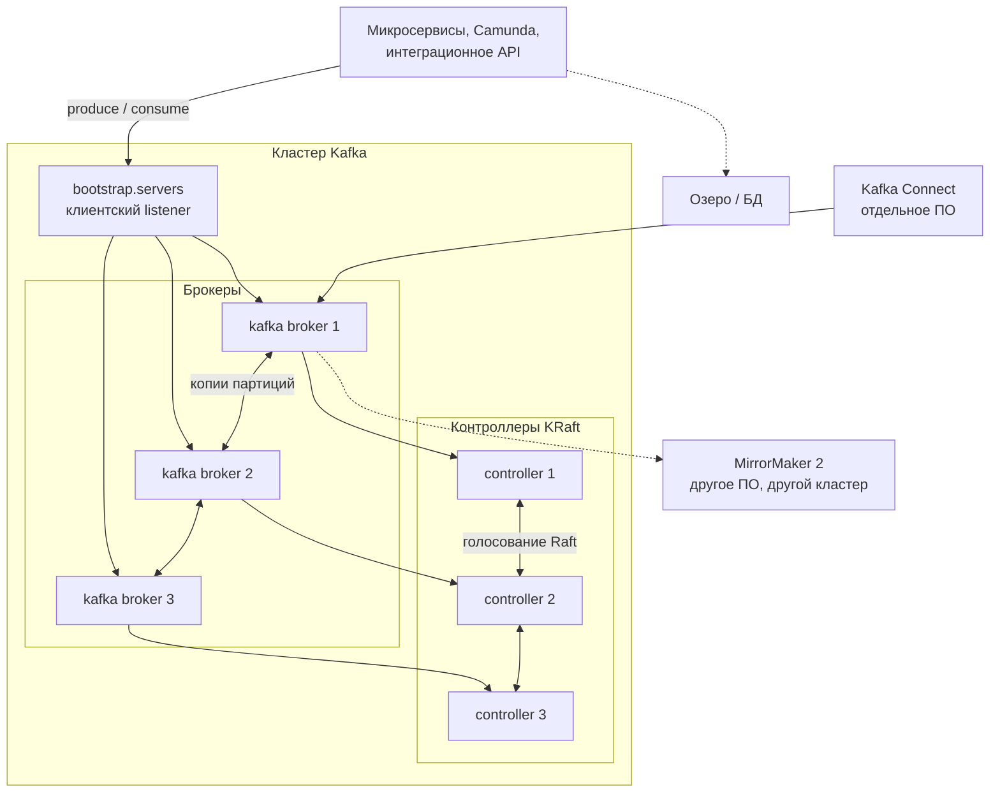

# Apache Kafka 4.3.1 — развёртывание и настройка

Apache Kafka — лог событий: сервисы пишут факты («заявка изменилась», «данные запрошены»), несколько независимых читателей забирают их в своём темпе. Этот документ про **свою установку** версии **4.3.1** (релиз 25 июня 2026, на дату подготовки — последний стабильный патч линии 4.3). Это не Confluent Platform и не «Kafka API-совместимый» форк: там другие обещания и другие манифесты, их сюда копировать нельзя.

Документация линейки: https://kafka.apache.org/43/  
Образ: `apache/kafka:4.3.1` (официальный Docker Hub).  
На Kubernetes для этой схемы: **Strimzi 1.2.0** (подтверждена совместимость с Kafka 4.3.1).

С Kafka **4.0** ZooKeeper **удалён**. 4.3.1 — только режим KRaft: метаданные живут внутри Kafka.

Этот текст — не набор команд «скопируй и запусти», а правила, без которых экземпляр не будет одновременно устойчивым к сбоям, масштабируемым и безопасным. Пошаговая установка — в `Apache Kafka.install.md`.

---

## Назначение системы

Kafka нужна, чтобы **везти события** между сервисами: буфер, когда Camunda или интеграционный API временно медленные; несколько читателей одного потока (аудит, озеро, процессный движок) без повторной записи в каждый.

Система **хранит лог** на диске брокеров и отдаёт его потребителям. Она **не** хранит эталон клиентских карточек, **не** заменяет очереди задач (RabbitMQ), **не** исполняет бизнес-процессы (Camunda) и **не** ходит сама в государственные сервисы. Источник истины у вас задуман как озеро / хранилище. Если положить эталон в Kafka, вы получите лог, из которого неудобно делать произвольные выборки «дай клиента по ИНН».

---

## Перечень функций

Что умеет self-hosted Apache Kafka 4.3.1:

1. **Принимать и хранить сообщения** в именованных потоках (топиках). Топик — лог, не таблица базы.
2. **Делить топик на партиции** — единица параллелизма. Один потребитель в классической группе читает одну партицию. Если воркеров больше, чем партиций — лишние простаивают.
3. **Держать копии партиции (реплики)** на других брокерах, чтобы падение одной машины не уничтожило данные. Число копий — `replication.factor` (RF). Пишут в **лидера**; остальные копируют с него.
4. **Не подтверждать запись**, пока живых свежих копий меньше порога `min.insync.replicas`, если продюсер ждёт `acks=all`. Это ручка «лучше отказать, чем записать в одну копию».
5. **Координировать кластер через KRaft**: отдельные процессы-контроллеры хранят метаданные (список топиков, кто лидер, кто жив) и голосуют по Raft. Для 3 контроллеров большинство = 2. Живых меньше — нельзя создавать топики и выбирать лидеров партиций.
6. **Делить читателей на группы (consumer group)**: Kafka раскидывает партиции между ними. С 4.2 есть ещё share group (KIP-932): несколько консьюмеров делят одну партицию позаписно, как классическая очередь. Нужна не всегда.
7. **Копировать топики между разными кластерами** (MirrorMaker 2). Это уже не один кластер, а репликация «кластер → кластер», асинхронно.
8. **Подключать внешние системы** через Kafka Connect (отдельные процессы). Kafka Streams — библиотека внутри JVM-приложения, не отдельный сервер.
9. **Шифровать канал и пускать по учёткам**: TLS (в конфиге исторически пишут `SSL`), SASL (SCRAM, Kerberos, OAUTHBEARER, PLAIN), списки доступа (ACL) через `StandardAuthorizer`. ACL хранятся в метаданных кластера.
10. **Квотировать** клиентов, чтобы один зависший читатель не забил диск и сеть.

Чего система **не** делает и часто путают: она не озеро эталона, не BPMN, не интеграция с ведомствами, не очередь задач «сделай один раз» (это ближе к RabbitMQ). Реестра схем (Avro / JSON Schema / Protobuf) в дистрибутиве нет — это Confluent Schema Registry, Apicurio и аналоги. UI «посмотреть топики» — отдельное ПО. Автоперекладка партиций при добавлении брокеров — Cruise Control (в образах Strimzi он есть). Шифрования данных **на диске** в open-source Kafka нет: только LUKS / том Kubernetes / hardware. ГОСТ TLS / СКЗИ не входят. Сама по новым брокерам данные не раскладывает: без перекладки партиций новые машины будут пустыми.

---

## Требования к развёртыванию

### Требования к ПО

| Что | Что ставить | Комментарий |
|---|---|---|
| **Формат поставки** | Контейнеры Docker **или** поды Kubernetes | Официальный образ `apache/kafka:4.3.1`. ZooKeeper **не нужен и не ставится**. |
| **Оркестратор боя** | Kubernetes (свой) + **Strimzi 1.2.0** | Чарты и манифесты фиксировать **тегом релиза**, не `latest`. Отдельные пулы нод: контроллер и брокер. |
| **ОС** | Linux x86_64 | Это основной контур. **Боевая Kafka на Windows-хосте в схеме с Kubernetes не предполагается.** |
| **Java на брокерах / Connect / утилитах** | Минимум **17**. Официально 17, 21 и 25 | Apache рекомендует свежий LTS (на момент документации 4.3 — Java 25) и свежий патч JDK. Клиенты и Kafka Streams допускают Java 11. |
| **Диск** | Локальные SSD / NVMe, обычная файловая система POSIX | **Не NFS и не сетевой NAS как `log.dirs`.** Kafka рассчитана на локальный диск и page cache ядра Linux. В Kubernetes — отдельный том на каждый брокер и каждый контроллер. |
| **Сеть** | Стабильный DNS / IP до каждого брокера и контроллера | Клиент ходит **напрямую** к брокеру-лидеру партиции. Балансировщик «как у HTTP» перед всеми брокерами ломает модель. |
| **Сертификаты** | Корпоративный PKI для боя | Самоподписанные — только стенд. Hostname verification с Kafka 2.0 **включён по умолчанию**; отключать «чтобы завелось» нельзя считать боевой настройкой. |
| **Лицензия** | Apache 2.0 | Отдельного license-server нет. Следить нужно за обвязкой (Strimzi, Connect, UI — свои лицензии). |

Один процесс сразу и брокер, и контроллер (`process.roles=broker,controller`, combined mode) Apache разрешает для разработки и **не рекомендует** для критичных контуров.

### Требования к ресурсам

Цифр «сколько ядер на ваши терабайты» у проекта **нет** — нагрузки в исходном запросе не было. Ниже ориентиры поставщика, не смета закупки.

| Роль | CPU | RAM | Диск |
|---|---|---|---|
| **Брокер** | Запас под TLS: при шифровании путь zero-copy `sendfile` так не работает, брокер шифрует байты. Цифр ядер под вашу нагрузку нет | Куча JVM — ориентир Apache для нагруженного примера LinkedIn: **6 ГиБ** (`-Xmx6g -Xms6g`) и G1GC. **Остальная RAM машины — кэш диска (page cache), не куча.** Раздуть кучу до 32 ГиБ «как у обычного Java-сервиса» = отнять память у кэша и замедлить чтение | Локальный SSD / NVMe. Объём = (входящий поток × срок хранения × RF / число брокеров) × запас. **Формула пустая, пока нет потока и retention** |
| **Контроллер KRaft** | Меньше брокера; не соседствовать с нагрузкой клиентов на том же процессе | Для типичного кластера Apache пишет порядка **5 ГиБ RAM** | Порядка **5 ГиБ** под metadata log, **отдельный** быстрый том, не общая «куча» с `log.dirs` брокера |
| **Учебный один процесс (combined)** | Минимум | Хватит меньше боевого | Можно маленький том; на бою так нельзя |

Дополнительно:

- Сообщения **не** живут в куче JVM. Куча — метаданные, сетевые буферы, индексы. Горячий хвост лога читается из page cache ядра.
- Лимит памяти пода Kubernetes должен быть **выше** `-Xmx`, иначе Linux нечем кэшировать лог.
- Три копии каждой партиции занимают примерно **утроенный** объём плюс запас под восстановление реплики.
- RAID «для надёжности» часто вреден: надёжность уже в репликации, пересборка RAID убивает задержку. Несколько каталогов `log.dirs` (JBOD) допустимы.
- На тестовой песочнице 6 ГиБ кучи можно не требовать. Этот стенд **нельзя** переносить в бой как «официальный минимум».

---

## Основные элементы системы и зависимости

Это одно ПО из **нескольких процессов**. Ниже — те, что живут отдельными инстансами, и как они вызывают друг друга.

### Схема инстансов и потоков



Как читать схему:

1. Клиенты (микросервисы, Camunda, интеграционное API) ходят на **клиентский listener** (в бою обычно SASL_SSL). `bootstrap.servers` — список 2–3 брокеров, с которых клиент **узнаёт** весь кластер, не «все брокеры мира». Дальше клиент идёт **напрямую** к лидеру нужной партиции.
2. **Брокер** хранит лог и отдаёт его читателям. Несколько брокеров — это копии партиций (отказ машины) и место под диск / CPU.
3. **Контроллер** помнит метаданные и выбирает лидеров партиций. Клиентов на его порт **не пускают**. Без большинства контроллеров кластер не меняет состав топиков и не выбирает новых лидеров.
4. Копии партиции пересылаются **между брокерами** по отдельному listener репликации. Общий «один адрес на всех, как HTTP» ломает эту модель.
5. **MirrorMaker 2** копирует топики в **другой** кластер асинхронно. Connect — другое ПО со своей отказоустойчивостью.
6. Озеро остаётся эталоном. Kafka доставляет факт «данные изменились».

### Что входит в состав

| Компонент | Зачем | Как масштабируется |
|---|---|---|
| **Брокер** | Данные + раздача | Сначала больше CPU/RAM/диск; потом новые брокеры **и** перекладка партиций. Копии партиции — для отказа |
| **Контроллер KRaft** | Метаданные, выборы лидеров | Нечётное число, типично **3** выделенных процесса. Правило Apache: чтобы пережить **N** отказов, нужно **2N+1**. Не масштабируют «от числа сообщений» |
| **Клиенты** | producer / consumer / admin | Без своего склада данных. `acks=all` и ключ партиции — часть контракта |
| **Kafka Connect** | Коннекторы во внешние системы | Отдельные процессы, свой отказ |
| **Kafka Streams** | Обработка внутри JVM-приложения | Не отдельный сервер |
| **MirrorMaker 2** | Копия топиков в другой кластер | Сам должен быть отказоустойчивым |
| **Утилиты** | `kafka-storage.sh`, `kafka-topics.sh`, `kafka-acls.sh`, `kafka-metadata-quorum.sh` | Операционка |

Рядом, но это уже другое ПО: Strimzi, Cruise Control, Schema Registry, UI (AKHQ и т.п.). Их отказ проектируется отдельно.

### Официальные порты (менять можно, это контракт сети)

Номера портов в Kafka задаются в `listeners`. Типичный контракт:

| Listener | Кто ходит | Протокол в бою |
|---|---|---|
| **CLIENT** (часто 9092 / 9093) | микросервисы, Camunda, Connect | SASL_SSL |
| **REPLICATION** / inter-broker | брокеры между собой | SSL или SASL_SSL |
| **CONTROLLER** | только контроллеры и брокеры | SSL, доступ закрыт сетью |
| Внешний, если вообще нужен | отдельный listener | SASL_SSL; лучше не торчать в интернет |

Клиенты только на CLIENT-порт. Контроллерный порт не публиковать через LoadBalancer «на всякий случай». `advertised.listeners` должны быть именами, которые резолвят **клиенты** (частая поломка на Kubernetes: внутри кластера одно DNS, снаружи другое — для этого разные listener'ы).

### Зависимости окружения

- Прямая связность брокер↔брокер и брокер↔контроллер внутри площадки.
- В Kubernetes том с режимом «один под — один диск» на каждый брокер и каждый контроллер. `emptyDir` как `log.dirs` = потеря лога при рестарте пода.
- Идентификация: отдельный principal на каждый сервис (`User:camunda`, `User:integration-api`), минимум прав. Общий пользователь «на всех» запрещён.
- Dedicated nodes (taint): не соседствовать с batch-джобами, которые выбивают page cache.

---

## Краткие вводные

### Как устроена отказоустойчивость

Долговечность записи — это **не** «fsync на диск», а **репликация на другие брокеры**. Сообщение считается надёжно принятым, когда продюсер использует `acks=all`, у топика `min.insync.replicas >= 2`, реплики лежат в **разных** доменах отказа (`broker.rack`), `unclean.leader.election.enable=false` (завод: нельзя выбрать лидером отставшую реплику ценой потери уже «подтверждённых» сообщений).

Три контейнера с RF=1 — это три разные «одиночки», не отказоустойчивый кластер.

**1) Контроллеры**

| Что падает | Что происходит |
|---|---|
| Один контроллер из трёх | Остаётся двое, большинство есть, выбирается другой лидер метаданных |
| Два контроллера из трёх | Большинства нет. Нет лидера метаданных. Не создать топик, не выбрать лидера партиции |
| Combined mode (брокер+контроллер в одном процессе) | Нельзя катить контроллер отдельно; он делит GC и диск с нагрузкой клиентов. Для боя документация KRaft это **не рекомендует** |
| Все контроллеры в одном дата-центре | Падение площадки = нет координации, даже если данные брокеров живы в других местах |

Три контроллера переживают потерю **одного**, не двух.

**2) Данные (реплики + min.ISR)**

| Что падает | Что происходит |
|---|---|
| Один брокер, реплики разложены, min.ISR=2, RF=3 | Остаются 2 копии; запись с `acks=all` жива; чтение живо |
| Тот же отказ при min.ISR=3 | Запись **останавливается** (нужны три живые копии) |
| `acks=all` выключен «для скорости» | Кластер быстро пишет и молча теряет данные при падении брокера |
| Unclean election включён | Лидером может стать отставшая реплика → уже подтверждённые сообщения пропали |
| Нет перекладки после добавления брокеров | Новые машины пустые; отказ старых всё ещё теряет данные |

Репликация **партиции**, не «всего брокера». Внутренние топики offsets и transaction state тоже нужны с RF=3: иначе падение одного брокера ломает consumer groups.

**Слабое место пары RF=3 / min.ISR=2:** если одновременно катите по одному брокеру в каждом домене отказа, ISR может просесть ниже 2. Concurrent rolling «все зоны сразу» требует либо большей RF, либо **последовательного** выката.

**3) Клиентский вход**

Падение одного брокера ≠ падение кластера, если клиент умеет перейти к новому лидеру. Все реплики в одной зоне — отказ **площадки**, не протокола.

**4) Пайплайн рядом**

Connect или MirrorMaker упал — Kafka хранит старое, новое на другую сторону не уезжает. Буфер должен быть **в топике**, не «в надежде что выгрузка не умрёт».

### Как устроено масштабирование

Единица параллелизма — **партиция**, не «ещё один Kafka». Добавление брокеров увеличивает диск, сеть и CPU, но **не** ускоряет топик, пока партиции не переложены на новые брокеры и пока число партиций достаточно.

Несколько независимых осей (их нельзя путать):

1. **Больше потока и диска** → сначала больше железа на брокер, затем новые брокеры пачками и перекладка (Cruise Control / `kafka-reassign-partitions.sh`).
2. **Больше параллельных читателей одного топика** → больше партиций. Слишком мало → потолок по throughput и по числу воркеров. Слишком много → давление на контроллер, дольше восстановление, больше файлов, выше хвосты задержки.
3. **Отказ** → RF и `broker.rack`, не «ещё один bootstrap».
4. **Контроллеры** почти не масштабируют «от числа сообщений». Им важны метаданные и диск журнала.

Число партиций выбирают **после** оценки: целевой MB/s, размер сообщения, задержка `acks=all`, число consumer groups. Сейчас этой оценки нет.

«Терабайты» сами по себе не требуют сотен брокеров: если это холодный архив, смотрят **retention** и опционально **tiered storage** (вынос старых сегментов в object storage). Tiered storage в 4.x существует, но это отдельный контур. Не включать «на всякий случай» без политики хранения.

Share groups включать точечно (`share.version=1`), когда нужен конкурентный разбор **записей**, а не порядок внутри ключа. Для event-sourcing клиентских данных обычно остаются классические consumer groups.

TLS стоит CPU. «Включим и останется та же скорость» — неверно.

### Безопасность самой Kafka

Компрометация кластера с событиями заявок и интеграций = компрометация персональных данных и фактов «что ушло в ведомство». Анонимный PLAINTEXT на 9092 в сеть равносилен открытому логу.

Три слоя, все три: шифрование канала (TLS); аутентификация (SASL или mTLS); авторизация (ACL). Нет ACL на ресурс → **доступ только super.users**. Не включать `allow.everyone.if.no.acl.found=true` в бою.

Опасные значения «из коробки / из примера»:

| Что | Как в примере / заводе | Почему опасно |
|---|---|---|
| PLAINTEXT listener | Учебный стенд | Пароли и тела открытым текстом |
| SASL/PLAIN без TLS | Старые примеры | Пароль в сети. Документация прямо требует TLS для SCRAM |
| `allow.everyone.if.no.acl.found=true` | «Чтобы завелось» | Любой, кто достучался, читает всё |
| Combined mode в бою | Удобно на ноутбуке | Контроллер нельзя катить отдельно |
| RF=1 / auto.create.topics | Дефолт забытого топика | Одна копия, топики без ACL |
| `ssl.endpoint.identification.algorithm` пустой | «Чтобы сертификат сошёлся» | Принимаете чужое имя |
| Пароли SCRAM в `server.properties` plaintext | Старые гайды PLAIN | Секрет на всех нодах в файле |
| Контроллерный порт в LoadBalancer | «На всякий случай» | Голосование метаданных снаружи |

`super.users` — служебные учётки операторов и брокеров, не приложения. Сертификаты: PKCS12 (дефолт современных JDK; JKS устарел); SAN=DNS на реальное имя брокера. Штатный TLS — JDK, не ГОСТ / СКЗИ.

---

## Допущения

Ниже то, чего не было в исходном запросе, но без чего нельзя нарисовать конкретную схему. Если допущение неверно — схему надо пересмотреть.

1. Берём **Apache Kafka 4.3.1**, не Confluent Platform и не форк.
2. Бой крутится в Kubernetes, установщик — **Strimzi 1.2.0**. Альтернатива — выделенные VM; правила по RF / rack / безопасности те же.
3. Три дата-центра = три независимых отказа. Три зала с общим ИБП эту схему не спасают.
4. Один кластер, размазанный на три площадки, принимается **только если** сеть репликации и голосования контроллеров достаточно быстрая и стабильная. Порога задержки у Apache **нет**. **Пока RTT не измерен — это гипотеза.** Боевая схема этой платформы (кластер внутри одной площадки) — в `Apache Kafka.install.md`.
5. Цель отказа: пережить **1** дата-центр (ценой асинхронного MirrorMaker или ручного переключения), не 2 из 3. Три контроллера по одному на площадку при потере двух площадок большинства не имеют.
6. Нагрузки нет — поэтому **нет** цифры «N брокеров и M терабайт тома». Есть минимум размещения (3 брокера, 3 контроллера) и рычаги (железо, партиции, RF, retention).
7. Формального SLA нет. Три живые реплики ≠ юридический круглосуточный режим.
8. Корпоративные сертификаты есть или будут. Самоподписанные — для теста.
9. Идентификация сервисов — SASL/SCRAM-SHA-512 поверх TLS как практичный старт без Kerberos. Если в контуре уже есть IdP — разумнее OAUTHBEARER; если есть доменный Kerberos — GSSAPI. Выбор ИБ, не единственно верный.
10. Шифрование канала — TLS 1.2+ стандартными алгоритмами JDK. ГОСТ/СКЗИ не озвучены; vanilla Apache Kafka их не закрывает.
11. Учебный стенд изолирован. На нём допустим PLAINTEXT. Топики и клиентский код лучше сразу учить с `acks=all` и явным RF, иначе тест врёт.
12. Camunda, озеро, интеграционное API — клиенты Kafka, не часть этого ПО. Их consumer groups, ключи партиционирования и схемы сообщений проектируются отдельно.

---

## Критически важные условия, которых нет в исходном контексте

Их нужно закрыть **до** «поставили оператор и забыли».

| Пробел | Почему это ломает решение |
|---|---|
| **Задержка и потери между дата-центрами** (p50/p95/p99, все пары) | При `acks=all` и реплике в другом дата-центре латентность записи **не может быть ниже**, чем доставка на эту копию. Если RTT высокий или «плавает», ISR будут выпадать, записи получат `NOT_ENOUGH_REPLICAS`. Stretch станет источником аварий, а не защиты. Порога миллисекунд у Apache **нет** |
| **Профиль нагрузки** (сообщ./с, MB/s in/out, размер, число топиков, партиций, consumer groups, пик) | Без этого нельзя сказать ни число брокеров, ни диск, ни «готовы к высокой нагрузке» |
| **Срок хранения и реальный объём** («терабайты» — это 2 или 200? за день или за год?) | Retention определяет диск. Без политики любой кластер упрётся в диск |
| **Формальные RPO/RTO и «упал дата-центр»** | Stretch переживает **один** дата-центр. Два сразу при трёх площадках кворум из 3 или 5 контроллеров, как правило, **не** переживает |
| **Топология Kubernetes** (один кластер на 3 площадки или три изолированных) | От этого зависит, возможен ли stretch вообще. Изолированные кластеры без маршрутизации pod-to-pod stretch не взлетят |
| **Требования ИБ: ГОСТ, 152-ФЗ, at-rest, КИИ** | Меняют PKI, возможность vanilla TLS, необходимость шифрования томов |
| **Есть ли уже Kafka / ZooKeeper-кластер** | На 4.3.1 с ZooKeeper не входят. Миграция только через bridge-релиз **3.9**. Для новой установки это неважно |

---

## Краткое описание ключевых этапов и элементов развертывания

Общий каркас (и тест, и бой):

1. Зафиксировать версию **4.3.1** и Java (брокеры ≥ 17). Не `latest`.
2. Выбрать роли: combined **только** на тесте; в бою `process.roles=controller` **или** `broker`, никогда оба.
3. Сгенерировать `cluster.id`, **отформатировать** диски через `kafka-storage.sh` (в KRaft автоформатирование пустых дисков специально убрали: пустой диск большинства контроллеров может выбрать лидера **без** уже закоммиченных метаданных).
4. Поднять кворум контроллеров, затем брокеры.
5. Выставить дефолты топиков и внутренние топики (`offsets`, `transaction state`) с RF=3.
6. Включить безопасность **до** появления реальных клиентов.
7. Дать клиентам bootstrap **и** правила: `acks=all`, идемпотентный продюсер (в современных клиентах по умолчанию включён), осмысленный ключ партиции.
8. Мониторинг: ISR < RF, under-replicated partitions, request latency, disk, page cache / miss-чтение, лаг консьюмеров, здоровье кворума (`kafka-metadata-quorum.sh`).

Боевая схема на несколько дата-центров — в `Apache Kafka.install.md`. Ниже — только учебный стенд.

---

### 1 инстанс: тестовый стенд, 1 площадка, без нагрузки

**Цель стенда:** чтобы разработчики писали и читали события, отлаживали контракты, поднимали Camunda / сервисы. **Не** цель: доказать отказ дата-центра и ёмкость боя.

**Путь A — один контейнер (combined mode):**

```text
docker run -d \
  --name kafka-dev \
  -p 127.0.0.1:9092:9092 \
  apache/kafka:4.3.1
```

Один процесс: и брокер, и контроллер. Apache это разрешает для development. Listener PLAINTEXT только на изолированной сети. Топики с `replication.factor=1`, `min.insync.replicas=1`. Переменные listener / `advertised` — из README образа **4.3.1**: клиент с хоста должен видеть то имя/порт, который брокер рекламирует (частая поломка: внутри контейнера `localhost`, с хоста — нет). ZooKeeper **не** ставить.

Официальный путь bootstrap контроллера: `kafka-storage.sh format --standalone` (динамический кворум), затем брокеры с `--no-initial-controllers`. В 4.1+ динамический кворум — рекомендуемый; `controller.quorum.bootstrap.servers` вместо статического `controller.quorum.voters`. Образ `apache/kafka:4.3.1` форматирует диск при первом запуске по переменным образа — сверять README **этого тега**, не копировать устаревшие `KAFKA_ZOOKEEPER_CONNECT`.

**Путь B — Kubernetes:** Strimzi 1.2.0, Kafka CR версии **4.3.1**, 1 брокер, маленький PVC. Combined / одна replica — только стенд. Этот YAML в бой не копировать.

Альтернатива чуть ближе к бою: 1 контроллер + 1 брокер на одной машине. Отказоустойчивости всё равно нет.

#### Что сознательно упрощаем

| Параметр | На тесте | Почему можно |
|---|---|---|
| Combined mode | да | Apache прямо разрешает для dev; отдельно катить контроллеры на тесте не важно |
| RF / min.ISR | 1 / 1 | Некому реплицировать |
| PLAINTEXT | да, если сеть закрыта | Иначе команда утонет в сертификатах раньше, чем в событиях |
| Автосоздание топиков | можно включить | Удобство; в бой — выключить |
| Мониторинг | минимум | Нет нагрузки |

#### Чего на тесте **не** стоит упрощать

- Версия **4.3.1**.
- Продюсер с `acks=all` (на RF=1 это просто «лидер записал»). Иначе в бою внезапно появятся другие гарантии.
- Явные имена топиков, а не «как получится».
- Ключ сообщения (partition key) — от него зависит порядок и «горячие» партиции.
- Версия клиента не древнее брокера на поколение без проверки совместимости.
- Понимание: **RF=1 не копируется**. Успешный produce на ноутбуке **не** доказывает min.ISR и голосование контроллеров.

#### Сильные стороны такой схемы

- Поднимается за часы, совпадает с рекомендацией Apache: combined mode для development.
- Дешево показывает сжатие контрактов и ключи партиций на *ваших* событиях.

#### Слабые стороны (обязательно понимать)

- **Любое** падение ноды = простой и, при RF=1, потеря незареплицированных данных.
- Стенд **не** ловит: rebalance, ISR, межплощадочную задержку, TLS CPU, «клиент достучался не до того брокера».
- Успешный тест на одном брокере **не** является доказательством готовности боя.

Практическая рекомендация: препрод = маленькая **копия боевой топологии** (3 брокера, isolated controllers, RF=3, TLS) даже без боевой нагрузки. Всё это **в одном** дата-центре.

---

## Сводка: что считать «экземпляр готов»

| Требование | Тест (1 площадка) | Бой |
|---|---|---|
| Отказоустойчивость | Не требуется | Isolated KRaft 3 контроллера; ≥3 брокера; RF=3; min.ISR=2; `broker.rack`; unclean election выкл. Схема на 2–3 дата-центра — в `Apache Kafka.install.md` |
| Производительность / масштаб | Не требуется | Партиции как единица масштаба; брокеры пачками; куча ~6 ГиБ + RAM под page cache; локальные диски; перекладка партиций при scale-out |
| Безопасность | PLAINTEXT только в изоляции | TLS везде; SASL_SSL; StandardAuthorizer; нет ACL → нет доступа; отдельные listener'ы; секреты не в git |

**Не готов к бою**, если: combined mode; RF=1; PLAINTEXT на общей сети; все реплики без rack; `allow.everyone.if.no.acl.found=true`; контроллеры и брокеры на одном процессе; данные на NFS; RTT между площадками неизвестен, а схема уже stretch; Kafka назначена эталоном клиентских карточек; учебный манифест одной replica уехал в бой.

---

## Источники (чтобы не принимать на веру)

- Релиз 4.3.1: https://kafka.apache.org/blog/2026/06/25/apache-kafka-4.3.1-release-announcement/
- KRaft, роли, кворум 2N+1, combined vs isolated, 5 ГиБ для контроллера, format/bootstrap: https://kafka.apache.org/43/operations/kraft/
- Апгрейд, «4.3 только KRaft», Java для брокеров 17+: https://kafka.apache.org/43/getting-started/upgrade/
- Java 17/21/25, пример `-Xmx6g`: https://kafka.apache.org/43/operations/java-version/
- `min.insync.replicas`, `unclean.leader.election.enable`: https://kafka.apache.org/43/configuration/topic-configs/
- SSL/TLS, PKCS12, hostname verification: https://kafka.apache.org/43/security/encryption-and-authentication-using-ssl/
- SASL, SCRAM только с TLS: https://kafka.apache.org/43/security/authentication-using-sasl/
- ACL, StandardAuthorizer: https://kafka.apache.org/43/security/authorization-and-acls/
- Strimzi 1.2.0 + Kafka 4.3.1: https://strimzi.io/downloads/ и документация оператора 1.2.0

Утверждения про «типичный порог RTT для stretch» в документации Apache **отсутствуют** — поэтому в этом файле они не выдаются за стандарт, а вынесены в допущения и в таблицу пробелов. Задержку на репликации и голосовании контроллеров надо измерить у себя.
