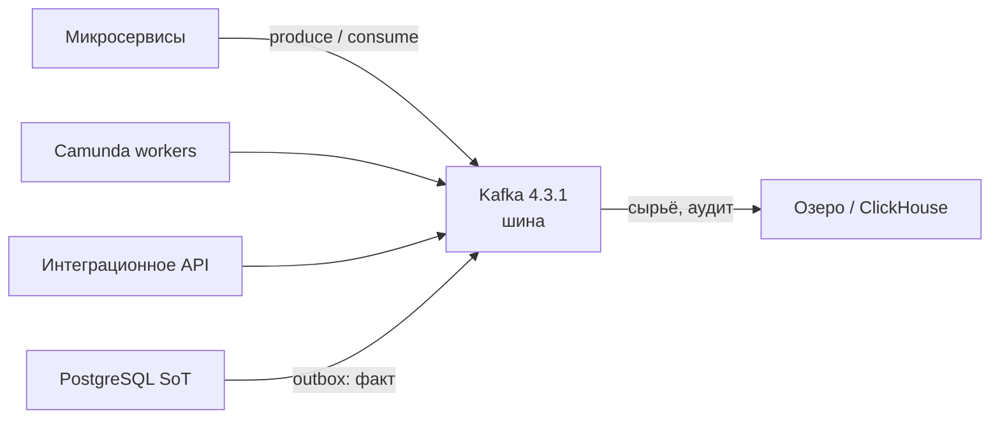
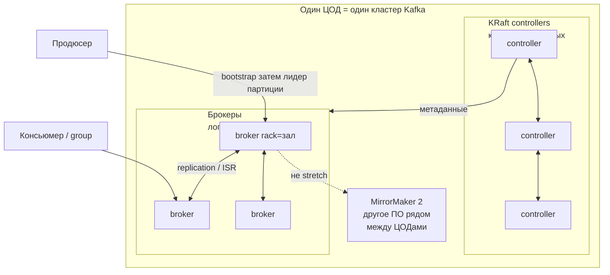
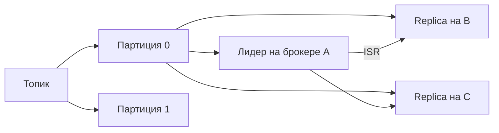
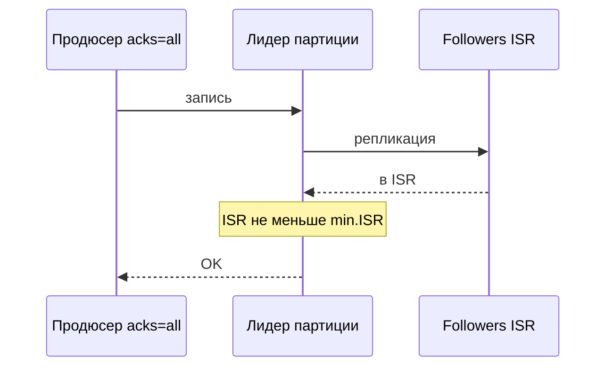
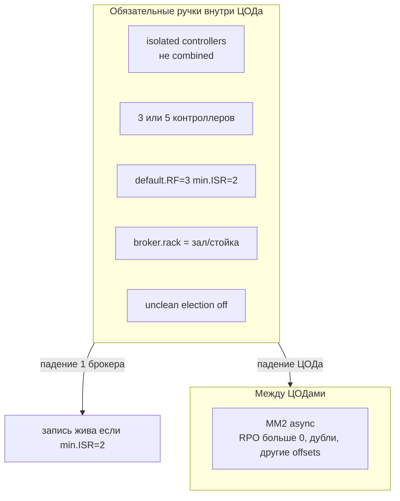
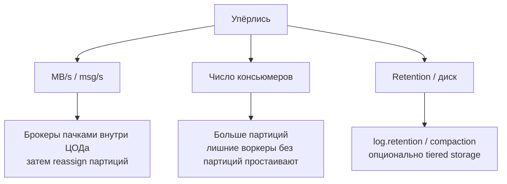
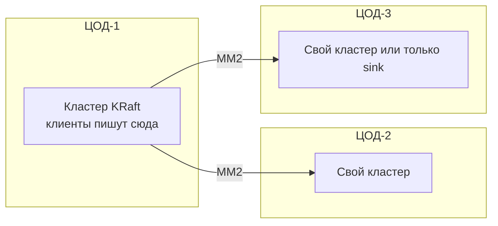

# Apache Kafka 4.3.1 — схемы устройства

Связанные документы: правила — `Apache Kafka.md`; установка — `Apache Kafka.install.md`.

C4 / «D4»: контекст → контейнеры → компоненты. Код клиентов не рисуем.

Допущения: stretch брокеров на 2–3 ЦОДа **нет**; ZooKeeper нет (KRaft); Java ≥ 17 на брокерах; нагрузка не замерена.

---

## 1. Контекст

Kafka — **лог событий**, не источник истины карточки и не Camunda.

Несколько независимых читателей одного топика **без** повторной записи в каждый. SoT «дай клиента по ИНН» — не Kafka.

---

## 2. Контейнеры (одно ПО, разные процессы)

Клиент **не** ходит на все брокеры через HTTP-LB: он узнаёт кластер с bootstrap, пишет в **лидера партиции**. Combined mode (брокер+контроллер в одном процессе) — только Dev.

---

## 3. Компоненты данных

Параллелизм = **число партиций**, не «ещё один Kafka». RF=3 / min.ISR=2: запись с `acks=all` ждёт две живые копии **внутри ЦОДа**.

---

## 4. Поток produce

`unclean.leader.election=false`: отставшую replica лидером не делают ценой потери уже подтверждённого.

---

## 5. Отказоустойчивость — что настраивать

| Ручка | Если забыть |
|---|---|
| `broker.rack` | Три копии в одном шкафу |
| min.ISR=3 при RF=3 | Один мёртвый брокер останавливает запись |
| auto.create.topics | Топики с RF=1 |
| offsets.topic RF=3 | Падение брокера ломает consumer groups |
| PDB / Drain Cleaner | Kubernetes убивает лидеров «вежливо» |

---

## 6. Масштабируемость — что настраивать

Новые брокеры **пусты**, пока партиции не переложены. Куча JVM ~ориентир 6 ГиБ в примере Apache; остальная RAM — **page cache**, не `-Xmx32g`.

TLS бьёт по CPU и zero-copy — запас ядер, не «та же скорость».

---

## 7. 2–3 ЦОДа без stretch

Один `bootstrap.servers` «на страну» при запрете stretch **нет**. Failover площадки — runbook и контракт топиков, не автомагия.

**Сильное:** локальный `acks=all` не ждёт чужой ЦОД. **Слабое:** RPO≠0, offsets не те же, MM2 сам должен быть HA.

---

## 8. Безопасность на той же картине

Отдельные listener'ы: CONTROLLER / inter-broker / CLIENT. CLIENT = SASL_SSL. StandardAuthorizer: нет ACL → нет доступа. SCRAM без TLS вендор считает опасным.

Источники: `Apache Kafka.md`. Порога RTT для stretch у Apache **нет**.
