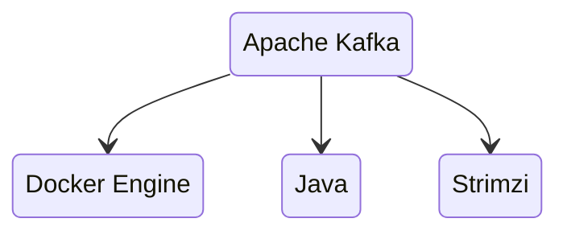
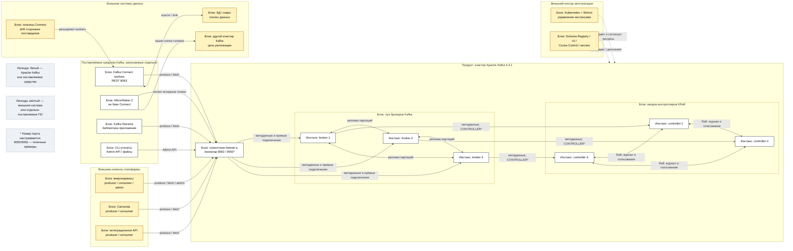

# Apache Kafka 4.3.1

Apache Kafka — распределённый журнал событий: сервисы записывают факты («заявка изменилась», «данные запрошены»), а независимые читатели получают их в своём темпе. Здесь описана self-hosted Apache Kafka **4.3.1**, не Confluent Platform, облачный сервис или совместимый форк.

С Kafka **4.0** режим ZooKeeper удалён. Kafka 4.3.1 работает только в режиме **KRaft**, в котором метаданные кластера хранит сама Kafka. Это не означает, что у KRaft нет вариантов: ниже отдельно разобраны роли процессов и динамический либо статический кворум контроллеров.

Документация линейки: https://kafka.apache.org/43/  
Официальный образ: `apache/kafka:4.3.1`.  
Оператор Kubernetes, принятый в платформе: **Strimzi 1.2.0**, совместимый с Kafka 4.3.1.

---

## Назначение системы

Kafka нужна, чтобы **доставлять события** между сервисами и временно удерживать их, если Camunda, озеро или интеграционный API читают медленнее, чем источники пишут. Один поток могут независимо читать аудит, аналитика, процессный движок и другие потребители без отдельной отправки каждому.

Kafka хранит упорядоченный по партициям лог на дисках брокеров и отдаёт его потребителям. Она **не** является эталонной базой клиентских карточек, **не** исполняет BPMN-процессы, **не** заменяет RabbitMQ для очередей заданий и **не** обращается сама к государственным системам. Эталон данных остаётся в БД или озере, а Kafka переносит факты об изменениях.

---

## Перечень функций

Self-hosted Apache Kafka 4.3.1:

1. **Принимает и хранит сообщения** в именованных потоках — топиках.
2. **Делит топик на партиции** для параллельной записи, чтения и хранения. Порядок гарантируется внутри одной партиции, а не между всеми партициями топика.
3. **Реплицирует партиции** между брокерами. Запись идёт лидеру партиции, остальные реплики копируют её.
4. **Управляет подтверждением записи** через `acks` продюсера и порог `min.insync.replicas`: при `acks=all` запись не подтверждается, если синхронных реплик меньше заданного порога.
5. **Координирует кластер через KRaft**: контроллеры ведут журнал метаданных и большинством голосов выбирают активный контроллер.
6. **Распределяет чтение в consumer group**: партиции назначаются экземплярам потребителя. Share group, доступная в Kafka 4.2 и новее, позволяет нескольким потребителям конкурентно разбирать записи одной партиции.
7. **Копирует топики между независимыми кластерами** через MirrorMaker 2. Копирование асинхронное и не превращает два кластера в один.
8. **Связывает Kafka с внешними системами** через отдельные процессы Kafka Connect и плагины-коннекторы.
9. **Обрабатывает потоки в приложении** через библиотеку Kafka Streams; это библиотека, а не отдельный сервер.
10. **Защищает сетевой доступ** с помощью TLS, SASL и ACL и ограничивает нагрузку клиентов квотами.

Kafka не включает реестр схем, графический интерфейс, ГОСТ/СКЗИ и шифрование данных на диске. Schema Registry, UI, средства шифрования томов и конкретные Connect-плагины выбираются и сопровождаются отдельно. Cruise Control также отдельный проект; Strimzi может интегрировать его, но он не становится частью ядра Apache Kafka.

---

## Основные элементы системы и зависимости

### Состав

| Блок | Состав и роль |
|---|---|
| **Брокеры Kafka** | Серверные процессы, которые принимают клиентские запросы, хранят партиции и обмениваются их репликами |
| **Контроллеры KRaft** | Серверные процессы, которые образуют кворум метаданных; один активен, остальные готовы его заменить |
| **Клиенты Kafka** | Продюсеры, консьюмеры и административные клиенты в микросервисах, Camunda и интеграционном API |
| **Kafka Connect** | Отдельные worker-процессы для передачи данных между Kafka и внешними системами |
| **MirrorMaker 2** | Набор коннекторов на базе Kafka Connect для копирования топиков между кластерами Kafka |
| **Kafka Streams** | Библиотека, встроенная в JVM-приложение для потоковой обработки |
| **CLI-утилиты** | Поставляемые скрипты администрирования: `kafka-topics.sh`, `kafka-acls.sh`, `kafka-storage.sh`, `kafka-metadata-quorum.sh` и другие |
| **Отдельная обвязка** | Strimzi, Kubernetes, Cruise Control, Schema Registry, UI и хранилище секретов; это не процессы ядра Kafka |

### Варианты координации метаданных

Координация кластера — это то, где хранятся состав брокеров, топики, лидеры партиций и конфигурация. Для Kafka **4.3.1** это не «KRaft или ZooKeeper на выбор», а только KRaft. Ниже — какие варианты существуют исторически и внутри KRaft.

| Вариант | Суть | Статус в Kafka 4.3.1 |
|---|---|---|
| **KRaft, isolated mode** | Отдельные процессы `process.roles=broker` и `process.roles=controller` | Целевой для боя: тройка контроллеров отдельно от брокеров, внутри одной площадки |
| **KRaft, combined mode** | Один процесс с `process.roles=broker,controller` | Поддерживается для разработки и небольших стендов; Apache не рекомендует для критичных сред |
| **KRaft, динамический кворум** | KIP-853: `kraft.version >= 1`, состав контроллеров меняется командами, bootstrap через `controller.quorum.bootstrap.servers` | Рекомендован для **новых** кластеров 4.3 |
| **KRaft, статический кворум** | Полный список voters задан в `controller.quorum.voters` на каждом узле | Поддерживается как прежний способ; не является отдельным продуктом |
| **ZooKeeper** | Внешний ансамбль Apache ZooKeeper хранил метаданные Kafka | **Не вариант 4.3.1.** Режим удалён с Kafka **4.0**. Существующий ZooKeeper нельзя «подключить» к 4.3.1. Последний bridge-релиз миграции ZooKeeper → KRaft — Kafka **3.9** |

ZooKeeper на схеме инстансов 4.3.1 не рисуется: это была бы отдельная внешняя система прошлых линейок, а не блок текущего продукта. Миграция со старого ZooKeeper-кластера — отдельный путь через 3.9, а не настройка новой Kafka 4.3.1.

Официальное описание ролей, combined/isolated и кворумов: https://kafka.apache.org/43/operations/kraft/

### Порты и сетевые точки

Kafka не закрепляет обязательный номер за каждой ролью: номера задаются в `listeners`. **9092 и 9093 ниже — распространённый контракт и значения из официальных примеров, а не неизменяемые «порты протокола».**

| Listener или интерфейс | Типичный порт | Кто подключается | Примечание |
|---|---:|---|---|
| **CLIENT** | `9092` для внутреннего или PLAINTEXT; часто `9093` для TLS | Продюсеры, консьюмеры, AdminClient, Connect, MirrorMaker 2 | Название, порт и протокол назначает оператор; для разных сетей могут быть отдельные listener'ы |
| **REPLICATION / inter-broker** | Настраиваемый, часто отдельный | Только брокеры | По нему лидеры передают данные репликам; может совпадать с другим listener'ом, если это явно настроено |
| **CONTROLLER** | Настраиваемый; в официальном примере KRaft — `9093` | Контроллеры и брокеры | Не является клиентским входом; задаётся в `controller.listener.names` |
| **Kafka Connect REST API** | По умолчанию `8083` | Оператор и средства управления Connect | Это порт Connect, не брокера Kafka |
| **Внешний CLIENT** | Настраиваемый | Клиенты за пределами внутренней сети | Публикуется отдельным listener'ом только при необходимости |

`bootstrap.servers` содержит несколько доступных адресов брокеров для первого знакомства клиента с кластером. После получения метаданных клиент подключается непосредственно к нужным брокерам по адресам из `advertised.listeners`; поэтому один HTTP-подобный адрес не заменяет корректные адреса всех брокеров.

### Схема инстансов и потоков

### Описание каждого блока схемы

#### Блок «Микросервисы»

- **Сущность:** экземпляры прикладных сервисов — клиенты Kafka.
- **Технологии и варианты:** Kafka Producer, Consumer или AdminClient для языка приложения; классическая consumer group либо, для подходящего сценария, share group.
- **Назначение:** публиковать доменные события, читать нужные топики и выполнять административные операции в пределах выданных прав.
- **Поставка:** разворачиваются отдельно; с Kafka не поставляются.

#### Блок «Camunda»

- **Сущность:** внешний процессный движок и его интеграционный код.
- **Технологии и варианты:** Kafka-клиент внутри worker/адаптера; конкретный коннектор зависит от архитектуры приложения.
- **Назначение:** запускать или продолжать процессы по событиям и публиковать результаты.
- **Поставка:** разворачивается отдельно; не является частью Kafka.

#### Блок «Интеграционное API»

- **Сущность:** внешний сервис доступа к ведомственным и иным интеграциям.
- **Технологии и варианты:** producer/consumer Kafka, собственные HTTP- или иные адаптеры на внешней стороне.
- **Назначение:** изолировать Kafka и бизнес-сервисы от протоколов внешних ведомств.
- **Поставка:** разворачивается отдельно.

#### Блок «Клиентские listener'ы»

- **Сущность:** сетевые точки входа, открытые процессами брокеров; это не отдельный сервер и не балансировщик.
- **Технологии и варианты:** PLAINTEXT, SSL, SASL_PLAINTEXT или SASL_SSL; внутренний и внешний listener'ы могут иметь разные адреса и порты.
- **Назначение:** первоначальное обнаружение кластера и последующие подключения клиентов к конкретным брокерам.
- **Поставка:** часть брокера Apache Kafka.

#### Блок «Пул брокеров Kafka»

- **Сущность:** отдельные процессы `broker-1..N`, каждый со своим `node.id`, сетевым адресом и хранилищем.
- **Технологии и варианты:** роль `process.roles=broker`; listener'ы для клиентов и межброкерного обмена; партиции с лидером и репликами.
- **Назначение:** принимать записи, хранить сегменты лога, отдавать данные и реплицировать партиции.
- **Поставка:** ядро Apache Kafka.

#### Блок «Кворум контроллеров KRaft»

- **Сущность:** процессы-контроллеры, один из которых активен, остальные являются горячими резервами.
- **Технологии и варианты:** роль `process.roles=controller`; **динамический кворум KIP-853** (`kraft.version >= 1`, `controller.quorum.bootstrap.servers`) рекомендован для новых кластеров Kafka 4.3; **статический кворум** (`controller.quorum.voters`) остаётся поддерживаемым старым вариантом. Обычно роли контроллера и брокера изолируют. `process.roles=broker,controller` — поддерживаемый combined mode для небольших и разработческих сценариев, но Apache не рекомендует его для критичных сред.
- **Назначение:** хранить журнал метаданных, регистрировать брокеры, выбирать лидеров партиций и согласовывать изменения большинством контроллеров.
- **Поставка:** ядро Apache Kafka.

В Kafka 4.3.1 **нет режима ZooKeeper**. Существующий ZooKeeper-кластер нельзя просто запустить на 4.3.1: последним bridge-релизом для миграции ZooKeeper → KRaft является Kafka 3.9. Это отдельный миграционный путь, а не вариант новой Kafka 4.3.1.

#### Блок «Kafka Connect workers»

- **Сущность:** один или несколько отдельных JVM-процессов Connect.
- **Технологии и варианты:** standalone mode для одного процесса и distributed mode для группы workers; REST API по умолчанию слушает `8083`; поведение задают плагины source/sink.
- **Назначение:** надёжно переносить данные из внешней системы в Kafka или из Kafka во внешнюю систему и хранить служебные offsets/status/config.
- **Поставка:** фреймворк и скрипты Connect входят в Apache Kafka; конкретные коннектор-плагины обычно поставляются отдельно.

#### Блок «Плагины Connect»

- **Сущность:** JAR-библиотеки, загружаемые worker-процессами Connect.
- **Технологии и варианты:** source connector читает внешнюю систему, sink connector пишет в неё; реализации выпускают Apache-проекты, вендоры или команда платформы.
- **Назначение:** добавить знание конкретного API, формата или СУБД, которого нет в общем фреймворке Connect.
- **Поставка:** отдельно, кроме редких плагинов, явно включённых выбранным дистрибутивом.

#### Блок «MirrorMaker 2»

- **Сущность:** набор специализированных коннекторов, работающих на Kafka Connect.
- **Технологии и варианты:** однонаправленная или двунаправленная топология между независимыми кластерами; репликация остаётся асинхронной.
- **Назначение:** копировать выбранные топики и связанные метаданные в другой кластер, например для межплощадочного восстановления.
- **Поставка:** входит в Apache Kafka, но запускается и масштабируется отдельно от брокеров.

#### Блок «Другой кластер Kafka»

- **Сущность:** самостоятельный Kafka-кластер со своими брокерами, контроллерами, безопасностью и данными.
- **Технологии и варианты:** Kafka 4.3.1 KRaft либо совместимая версия после проверки протокольной совместимости.
- **Назначение:** принимать реплики топиков от MirrorMaker 2; не участвует в кворуме исходного кластера.
- **Поставка:** отдельный экземпляр продукта.

#### Блок «Kafka Streams»

- **Сущность:** клиентская Java-библиотека внутри процесса приложения, а не отдельный инстанс платформы.
- **Технологии и варианты:** stateless/stateful-операции, локальные state stores и внутренние changelog/repartition topics.
- **Назначение:** фильтровать, агрегировать и объединять события, читая из Kafka и записывая результат обратно.
- **Поставка:** входит в проект Apache Kafka как клиентская библиотека; приложение поставляется отдельно.

#### Блок «CLI-утилиты»

- **Сущность:** командные скрипты администратора.
- **Технологии и варианты:** Admin API через broker endpoint, прямой controller endpoint для поддерживаемых команд, либо локальная работа с файлами хранения.
- **Назначение:** управлять топиками и ACL, проверять кворум, форматировать хранилище и выполнять диагностику.
- **Поставка:** входит в Apache Kafka.

#### Блок «БД / озеро»

- **Сущность:** внешнее долговременное хранилище и источник истины.
- **Технологии и варианты:** реляционная или документная БД, объектное хранилище, lakehouse; подключение через приложение или Connect-плагин.
- **Назначение:** хранить эталонные и аналитические данные, выполнять запросы по их текущему состоянию.
- **Поставка:** разворачивается отдельно.

#### Блок «Kubernetes + Strimzi»

- **Сущность:** внешний оркестратор и оператор, который управляет ресурсами Kafka.
- **Технологии и варианты:** Kubernetes с Strimzi 1.2.0 для Kafka 4.3.1; альтернатива — управление Kafka на VM или контейнерах без Strimzi.
- **Назначение:** создавать и согласовывать процессы, сервисы, конфигурацию и хранилища, но не обрабатывать сообщения вместо Kafka.
- **Поставка:** Kubernetes и Strimzi поставляются отдельно от Apache Kafka.

#### Блок «Schema Registry / UI / Cruise Control / secrets»

- **Сущность:** набор независимых сервисов эксплуатации и разработки.
- **Технологии и варианты:** Apicurio или Confluent Schema Registry, AKHQ и аналоги, Cruise Control, Vault или Kubernetes Secrets.
- **Назначение:** управлять схемами, давать интерфейс просмотра, рассчитывать переразмещение партиций и хранить секреты.
- **Поставка:** отдельно; лицензии, совместимость и отказоустойчивость проверяются для каждого выбранного продукта.

### Как читать схему

1. Микросервис, Camunda или интеграционное API начинает работу со списка `bootstrap.servers`. Стрелки к блоку listener'ов означают клиентский протокол Kafka, а не HTTP-запрос к единому шлюзу.
2. Любой доступный bootstrap-брокер возвращает клиенту метаданные: список брокеров, адреса из `advertised.listeners`, топики, партиции и их лидеров.
3. После bootstrap клиент идёт непосредственно к брокеру, который обслуживает нужную партицию. Поэтому на схеме listener'ы связаны со всеми тремя брокерами.
4. Продюсер выбирает партицию по ключу или алгоритму клиента и отправляет запись её лидеру. При `acks=all` момент подтверждения зависит от числа актуальных ISR и `min.insync.replicas`.
5. Двунаправленные стрелки между брокерами показывают не копию «всего broker-1», а независимую репликацию каждой партиции между её лидером и follower-репликами.
6. Брокеры регистрируются у активного KRaft-контроллера и получают изменения метаданных. Клиентские записи не проходят через контроллеры.
7. Контроллеры обмениваются журналом метаданных и голосуют по Raft. Для доступности нужна живая связь с большинством участников кворума.
8. Три показанных контроллера — пример топологии, а не требование «всегда ровно три». Три позволяют пережить отказ одного контроллера; пять — двух. Формула для `N` одновременных отказов: `2N+1`.
9. Схема изображает isolated mode: брокеры и контроллеры — разные процессы. В combined mode соответствующие роли совмещаются в одном процессе, но логические потоки остаются теми же.
10. Для нового кластера 4.3 динамический кворум позволяет добавлять и удалять контроллеры штатными командами. Статический кворум фиксирует полный набор voters в конфигурации каждого узла.
11. Kafka Connect подключается к брокерам обычным клиентским протоколом. Доступ к БД или озеру выполняет не брокер, а загруженный в Connect source- или sink-плагин.
12. MirrorMaker 2 читает исходный кластер и пишет в целевой как клиент двух независимых кластеров. Пунктиром или общей линией кворума эти кластеры не соединяются.
13. Kafka Streams находится внутри прикладного процесса. Его стрелка совпадает с обычными produce/fetch, потому что отдельного серверного протокола Streams нет.
14. CLI обращается к Admin API брокеров или, для отдельных операций с KRaft, к controller endpoint. Некоторые утилиты, например форматирование, работают с локальными файлами узла.
15. Strimzi создаёт и согласовывает Kubernetes-ресурсы, но не входит в поток сообщений. Поэтому его связь с кластером показана пунктиром как управление.
16. БД/озеро, второй Kafka-кластер, Connect-плагины и эксплуатационная обвязка выделены жёлтым: это внешние зависимости или отдельно поставляемое ПО.
17. Порты со звёздочкой на схеме настраиваются. `9092/9093` нельзя считать универсальным правилом межсетевого экрана без сверки фактических `listeners` и `advertised.listeners`.

### Зависимости

- Клиентам нужны DNS и сетевая связность до **каждого рекламируемого брокера**, а не только до bootstrap-адреса.
- Брокерам нужна взаимная связность для репликации и доступ к controller listener'ам.
- Контроллерам нужна взаимная связность для Raft-кворума; клиентам controller listener не нужен.
- Брокерам и контроллерам нужны устойчивые отдельные хранилища; журнал данных брокера и журнал метаданных контроллера имеют разные роли.
- TLS требует PKI и корректных DNS-имён в сертификатах; SASL/mTLS устанавливает личность, ACL задают её права.
- Connect требует выбранных плагинов и отдельного проектирования их доступности; MirrorMaker 2 требует доступ сразу к исходному и целевому кластерам.
- Реестр схем, UI, Cruise Control, мониторинг, шифрование дисков и управление секретами не появляются вместе с брокером автоматически.
- Межплощадочная задержка влияет на синхронную репликацию и `acks=all`. Apache не задаёт универсального допустимого RTT, поэтому конкретный порог нельзя выдумать без измерений и SLO.

---

## Словарь терминов и жаргона

- **ACL (Access Control List)** — правило, разрешающее или запрещающее операции конкретной учётной записи над топиком, группой и другим ресурсом Kafka.
- **Admin API / AdminClient** — клиентский интерфейс управления топиками, конфигурацией и другими объектами Kafka.
- **`acks=all`** — режим продюсера, в котором лидер ждёт подтверждения от всех текущих синхронных реплик ISR в рамках ограничения `min.insync.replicas`.
- **`advertised.listeners`** — адреса брокера, которые Kafka сообщает клиентам для последующих прямых подключений.
- **Apache Kafka** — проект с открытым исходным кодом под лицензией Apache 2.0; в этом документе версия 4.3.1.
- **BPMN** — нотация описания бизнес-процессов; исполняется Camunda, а не Kafka.
- **Bootstrap / `bootstrap.servers`** — первоначальный список адресов брокеров, достаточный клиенту, чтобы получить метаданные всего кластера.
- **Bridge-релиз** — промежуточная версия, умеющая работать со старым и новым механизмом во время миграции; для ZooKeeper → KRaft последняя такая Kafka — 3.9.
- **Broker / брокер** — серверный процесс Kafka, который хранит партиции и обслуживает запросы клиентов.
- **Changelog topic** — внутренний топик Kafka Streams для восстановления локального состояния приложения.
- **CLI** — интерфейс командной строки; в Kafka это набор административных скриптов.
- **Combined mode** — KRaft-вариант, где один процесс имеет роли `broker,controller`; удобен для небольших/dev-сценариев, но не рекомендован Apache для критичных сред.
- **Consumer / консьюмер / потребитель** — клиент, который читает записи из топиков.
- **Consumer group** — группа потребителей, между которыми Kafka распределяет партиции так, чтобы одну партицию в момент времени обрабатывал один участник группы.
- **Controller / контроллер** — KRaft-процесс, участвующий в управлении метаданными кластера.
- **Controller listener** — сетевой вход для трафика управления между брокерами и контроллерами и внутри кворума; не клиентский порт.
- **Cruise Control** — отдельное ПО для анализа нагрузки и формирования перемещения партиций между брокерами.
- **Distributed mode Connect** — режим Kafka Connect, где несколько workers координируются и распределяют коннекторы и задачи.
- **DNS** — система преобразования сетевых имён в IP-адреса.
- **Dynamic quorum / динамический кворум** — KRaft-кворум KIP-853, состав контроллеров которого можно менять командами; в Kafka 4.3 определяется `kraft.version >= 1`.
- **Endpoint** — конкретный сетевой адрес вида «имя:порт».
- **Event / событие** — неизменяемая запись о произошедшем факте.
- **Fetch** — запрос клиента или реплики на чтение записей Kafka.
- **Follower / ведомая реплика** — копия партиции, которая получает записи от лидера.
- **Fork / форк** — отдельный продукт, созданный на основе исходного кода другого проекта; его поведение не обязано совпадать с Apache Kafka.
- **Hot standby / горячий резерв** — уже работающий контроллер, готовый стать активным после выборов.
- **IdP** — поставщик цифровой идентификации, который выдаёт или подтверждает учётные данные.
- **Инстанс** — отдельный запущенный экземпляр процесса или приложения.
- **Inter-broker listener** — listener для обмена данными между брокерами, включая репликацию.
- **ISR (in-sync replicas)** — набор реплик партиции, которые Kafka считает достаточно актуальными относительно лидера.
- **Isolated mode** — топология KRaft, в которой процессы имеют только роль брокера или только роль контроллера.
- **JAR** — архив Java-классов и ресурсов; стандартный формат поставки Connect-плагинов.
- **JVM** — среда выполнения Java, в которой работают Kafka, Connect и Java-приложения.
- **Kafka Connect** — поставляемый с Kafka фреймворк запуска коннекторов к внешним системам.
- **Kafka Streams** — Java-библиотека обработки потоков внутри приложения.
- **KIP** — Kafka Improvement Proposal, формальное описание изменения Kafka; KIP-853 ввёл динамический controller quorum, KIP-932 — share groups.
- **KRaft** — встроенный в Kafka механизм управления метаданными на основе протокола Raft.
- **Кворум** — группа голосующих контроллеров; для принятия решений доступно должно быть большинство.
- **Leader / лидер партиции** — реплика, которая принимает записи и обычно обслуживает чтение данной партиции.
- **Listener** — именованная сетевая точка входа процесса Kafka с заданными адресом и протоколом безопасности.
- **Metadata / метаданные** — описание топиков, партиций, брокеров, лидеров, конфигурации и прав, а не сами пользовательские сообщения.
- **MirrorMaker 2 (MM2)** — средство асинхронного копирования топиков между независимыми Kafka-кластерами на базе Connect.
- **`min.insync.replicas`** — минимальное число ISR, необходимое для успешной записи при соответствующем уровне `acks`.
- **mTLS** — TLS с сертификатами обеих сторон, позволяющий серверу проверить клиента.
- **Offset** — порядковая позиция записи внутри партиции; потребитель сохраняет достигнутую позицию.
- **Operator / оператор Kubernetes** — контроллер, который сравнивает желаемое и фактическое состояние ресурса и приводит их в соответствие.
- **Партиция** — упорядоченная часть топика и единица распределения данных и параллелизма.
- **Partition key / ключ партиции** — значение, по которому клиент обычно выбирает партицию; одинаковые ключи направляются в одну партицию при неизменной топологии и алгоритме.
- **PLAINTEXT** — соединение Kafka без шифрования и встроенной аутентификации транспортного уровня.
- **Плагин** — отдельно загружаемое расширение; для Connect это реализация связи с конкретной системой.
- **PKI** — инфраструктура выпуска и проверки цифровых сертификатов.
- **`process.roles`** — список ролей процесса Kafka: `broker`, `controller` или оба сразу (combined mode).
- **Producer / продюсер** — клиент, который записывает события в Kafka.
- **Produce** — операция записи события в Kafka.
- **Raft** — алгоритм согласования реплицированного журнала большинством участников; KRaft использует его для метаданных.
- **Repartition topic** — внутренний топик Kafka Streams для перераспределения записей по новому ключу.
- **Replica / реплика** — одна копия партиции на конкретном брокере.
- **Replication factor (RF)** — заданное число реплик каждой партиции.
- **REST API** — HTTP-интерфейс управления; у Connect по умолчанию порт 8083, у брокера Kafka REST API из коробки нет.
- **SASL** — каркас аутентификации; Kafka поддерживает, среди прочих, SCRAM, GSSAPI/Kerberos, OAUTHBEARER и PLAIN.
- **SASL_SSL** — listener Kafka с аутентификацией SASL поверх шифрованного TLS-канала.
- **Schema Registry / реестр схем** — отдельный сервис хранения версий схем сообщений Avro, JSON Schema или Protobuf.
- **Self-hosted** — продукт, который организация запускает и сопровождает на своей инфраструктуре.
- **Share group** — модель конкурентного позаписного чтения, где записи одной партиции могут обрабатываться разными участниками.
- **Sink connector** — Connect-плагин, который читает Kafka и записывает во внешнюю систему.
- **Source connector** — Connect-плагин, который читает внешнюю систему и пишет в Kafka.
- **Standalone mode Connect** — режим одного worker-процесса Connect с локальной конфигурацией.
- **Static quorum / статический кворум** — старый KRaft-вариант с фиксированным полным списком `controller.quorum.voters` в конфигурации узлов.
- **Strimzi** — отдельный open-source оператор Kubernetes для управления Kafka и связанной обвязкой.
- **TLS / SSL** — шифрование сетевого канала; в названиях Kafka-конфигурации исторически используется `SSL`, хотя применяется TLS.
- **Топик** — именованный поток записей, разделённый на партиции.
- **Worker Connect** — процесс Kafka Connect, который исполняет коннекторы и их задачи.
- **ZooKeeper** — прежняя внешняя система координации Kafka; в Kafka 4.0+ удалена и в Kafka 4.3.1 не поддерживается.

---

## Источники

- Apache Kafka 4.3.1: https://kafka.apache.org/43/
- KRaft: роли, combined/isolated, динамический и статический кворумы, миграция с ZooKeeper: https://kafka.apache.org/43/operations/kraft/
- Конфигурация брокеров и listener'ов: https://kafka.apache.org/43/configuration/broker-configs/
- Kafka Connect, standalone/distributed и REST API: https://kafka.apache.org/43/kafka-connect/overview/
- MirrorMaker 2: https://kafka.apache.org/43/operations/mirrormaker2/
- Kafka Streams: https://kafka.apache.org/43/streams/
- Безопасность Kafka: https://kafka.apache.org/43/security/
- Strimzi 1.2.0 и поддерживаемые версии Kafka: https://strimzi.io/downloads/

У Apache Kafka нет документированного универсального порога RTT для растянутого между дата-центрами кластера. Поэтому конкретная допустимая задержка здесь не указана: её определяют измерениями сети и требованиями к задержке и доступности конкретной платформы.
