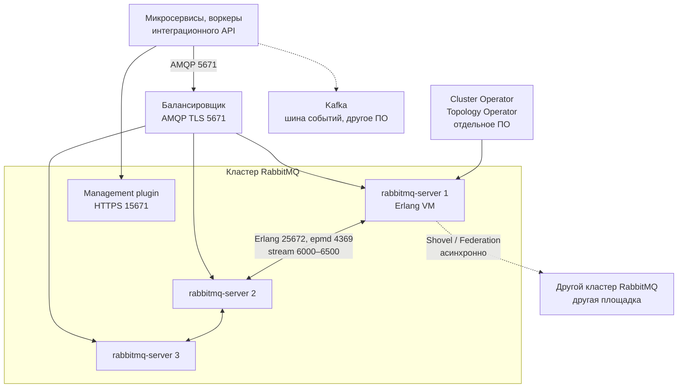

# RabbitMQ 4.3.5 — развёртывание и настройка

Версия ПО: **RabbitMQ 4.3.5** (релизная дата 17 августа 2026; на дату подготовки документа это последний стабильный патч линии **4.3**).  
Документация линейки: https://www.rabbitmq.com/docs/  
Релизы: https://www.rabbitmq.com/release-information  
Образ: `rabbitmq:4.3.5-management` (официальный Docker Hub; теги `4.3.5`, `4.3`, `4`, `latest` на эту дату указывают на этот патч).  
Erlang/OTP: **минимум 27.0**, максимум поддерживаемый — **27.x**. Нода на более старом Erlang **не стартует**. Erlang 28 официально только для **новых** кластеров: rolling-апгрейд хранилища метаданных Khepri с Erlang 27 → 28 на живом кластере имеет известную проблему mixed-version.

Этот текст — не набор команд «скопируй `docker run rabbitmq`», а правила, без которых экземпляр не будет одновременно устойчивым к сбоям, масштабируемым и безопасным. Пошаговая установка — в `RabbitMQ.install.md`.

RabbitMQ **не назван** в исходной архитектуре: шиной событий там заявлена **Kafka**. Ниже — как поставить брокер очередей задач на ту же инфраструктуру. Это **не** замена Kafka, **не** озеро клиентских данных и **не** интеграционная шина к ведомствам.

---

## Назначение системы

RabbitMQ — слой **очередей работ**. Сервис кладёт сообщение «сделай задачу» (сходи в ведомство, обработай заявку, ответь на RPC), воркер забирает и делает. Если воркер умер на полуслове — сообщение можно отдать другому.

Система **хранит сообщения, пока их не подтвердят**. Она **не** хранит эталон клиентских карточек, **не** заменяет шину событий (Kafka), **не** исполняет бизнес-процессы (Camunda 8 / Zeebe) и **не** ходит сама в государственные сервисы. Для долгого лога с несколькими независимыми читателями и повтором с offset используйте Kafka — это другой контур.

---

## Перечень функций

Что брокер умеет из коробки (по документации проекта):

1. **Принимать и отдавать сообщения** по протоколам AMQP 0-9-1 (большинство Java/.NET/Python-клиентов), AMQP 1.0 (с 4.0 нативно, нужен SASL) и Stream (свой протокол, порты 5552/5551).
2. **Маршрутизировать**: публикация идёт в **exchange** (сам сообщения не хранит); по правилам **binding** сообщение попадает в **очередь**, где ждёт потребителя.
3. **Держать реплицируемые очереди задач (quorum queue)** на протоколе Raft: запись через лидера, подтверждение клиенту — когда **большинство** копий записало на диск. Официально «выбор по умолчанию», когда нужна сохранность. Типичный размер группы — **3** члена.
4. **Держать журнал Stream** («дописал и читают с offset») — ближе к топику Kafka, чем к классической очереди. Это не замена вашей шины Kafka.
5. **Держать обычную очередь (classic)**: живёт на **одной** ноде. С RabbitMQ **4.0** она **не реплицируется**. Упала нода — очередь недоступна (durable-сообщения на диске этой ноды). Это тип по умолчанию, пока его не переопределили.
6. **Подтверждать публикацию (publisher confirm)** и **ручное подтверждение обработки (manual ack)**. Без confirm клиент не знает, дошло ли. Без ack (auto-ack) сообщение теряется, если воркер умер на полуслове.
7. **Делить работу между воркерами** на одной очереди: каждое сообщение — одному (competing consumers). Это не «всем читателям своя копия», как consumer group у Kafka.
8. **Ограничивать ядовитые сообщения**: с 4.0 лимит повторной выдачи (**delivery-limit**) по умолчанию **20**, дальше — удаление или dead-letter. Есть TTL, dead-letter exchange, с 4.3 у quorum queue — **32 уровня приоритета**.
9. **Разделять контуры** виртуальными хостами (vhost; по умолчанию `/`) и правами пользователей.
10. **Отдавать UI и HTTP API** (плагин management, порты 15672 / 15671) и **метрики Prometheus**.
11. **Копировать сообщения между отдельными кластерами** плагинами Federation и Shovel (асинхронно, без общего кворума через город).
12. **Засеивать схему** JSON-ом (definition import): vhost, пользователи, очереди, политики.
13. **Останавливать публикацию**, если кончилась RAM или диск (пороги `vm_memory_high_watermark` и `disk_free_limit`) — это защита, не «зависание».
14. **Входить через OAuth 2** (плагин), если в контуре уже есть IdP.

Чего система **не** делает и часто путают: она не шина событий с долгим логом и партициями (это Kafka), не озеро эталона, не BPMN, не коннект к ведомствам. Старая репликация classic (`ha-mode`, mirroring) **удалена с 4.0**. Хранилище Mnesia и стратегии `pause_minority` / `autoheal` **удалены в 4.3** — восстановление теперь семантика Raft. Шифрования тел сообщений на диске брокера **нет**: только том (LUKS и т.п.) или шифрование на клиенте до публикации. ГОСТ TLS / СКЗИ в поставку не входят.

---

## Требования к развёртыванию

### Требования к ПО

| Что | Что ставить | Комментарий |
|---|---|---|
| **Формат поставки** | Контейнеры Docker **или** поды Kubernetes | Официальный образ `rabbitmq:4.3.5-management`. Свой Erlang «сбоку» младше 27.0 — нода не поднимется. |
| **Оркестратор боя** | Kubernetes (свой) + **RabbitMQ Cluster Operator v2.22.5** (24 августа 2026, MPL-2.0) | В `spec.image` пинить **`rabbitmq:4.3.5-management`**. Дефолт оператора на дату README — образ **4.3.4**. Topology Operator — отдельно, для vhost/users/queues as code. Не `latest`. |
| **ОС** | Linux x86_64 | Это основной контур. **Боевой брокер на Windows-хосте в схеме с Kubernetes не предполагается.** |
| **Erlang** | **27.x** в том же образе/пакете | Минимум **27.0**. Erlang **28** — только для **новых** кластеров. |
| **Диск** | Durable volume на каждую ноду | Khepri, quorum queues и streams рассчитаны **только на постоянный диск**. Эфемерный диск пода → после рестарта полная синхронизация реплики с лидера. Локальный SSD/NVMe предпочтительнее NAS; NAS допустим при стабильно низкой задержке I/O. Том **не делится** между нодами. Distributed FS как общий каталог — путь к порче данных. |
| **Часы** | NTP / chrony на **всех** машинах | Кластер без NTP обычно живёт, но метрики management врут. |
| **Сертификаты** | Корпоративный PKI для боя | Самоподписанные — только стенд. Hostname verification не отключать «чтобы завелось». |
| **Лицензия** | Community MPL-2.0 | Не Tanzu и не коммерческий дистрибутив с Intra-cluster Compression. Отдельного license-server нет. |

Готовый учебный `docker run` есть — для знакомства, не для боя.

### Требования к ресурсам

Цифр «сколько ядер на ваши тысячи сообщений в секунду» у проекта **нет** — нагрузки в исходном запросе не было. Ниже ориентиры **чеклиста проекта**, не смета закупки.

| Роль | CPU | RAM | Диск |
|---|---|---|---|
| **Нода боя (минимум чеклиста)** | **4 ядра**, без соседства с I/O-тяжёлыми СУБД на тех же ядрах | **4 ГиБ** | Постоянный том. Порог свободного места `disk_free_limit` — **порядка memory watermark**, не заводские **50 МБ**. Пример чеклиста: watermark 4 ГиБ → `disk_free_limit.absolute = 4G` |
| **Учебный один контейнер** | Минимум | Хватит меньше боевого минимума | Можно маленький или даже эфемерный том; на бою так нельзя |

Дополнительно:

- Порог RAM `vm_memory_high_watermark`: диапазон чеклиста **0.4–0.7** (завод **0.6**). Считать от **лимита контейнера (cgroup)**, иначе брокер увидит память ноды Kubernetes и сработает слишком поздно (или наоборот). Выше 0.7 — только с мониторингом: ОС нужна память под page cache.
- Лимит открытых файлов: ориентир чеклиста **не меньше 50 тысяч**, часто сотни тысяч (соединения + очереди).
- Quorum queues и streams **не обязаны** быстро отдавать место на диске после ack. Диск **перезакладывать**.
- Ориентир проекта «пересмотри топологию»: порядка **5000** quorum queues (это не жёсткий лимит кода).
- На тестовой песочнице 4 ядра / 4 ГиБ можно не требовать. Этот «облегчённый» стенд **нельзя** переносить в бой как «официальный минимум».

---

## Основные элементы системы и зависимости

Это одно ПО из **нескольких процессов**. Ниже — те, что живут отдельными инстансами, и как они вызывают друг друга.

### Схема инстансов и потоков

Как читать схему:

1. Приложения ходят по **AMQP** на **5672** (без TLS) или **5671** (TLS). Клиент может подключиться к **любой** ноде: нода сама прокинет публикацию к лидеру quorum queue. Балансировщик перед 5671 **допустим** (в отличие от Kafka bootstrap). Цена: лишняя сеть внутри кластера, если попали не на лидера.
2. **rabbitmq-server** — один процесс (Erlang VM). Несколько нод с общим секретом (Erlang cookie) образуют **кластер**: общие пользователи, vhost, очереди. Метаданные кластера (очереди, пользователи, права) хранит **Khepri** внутри нод — с 4.3 это **единственное** хранилище. Работает по Raft: нужна **большинство** живых нод.
3. Ноды находят друг друга через демон **epmd** (порт **4369**) и говорят по Erlang distribution (**25672**). Эти порты — полный административный канал. Клиентов туда не пускают.
4. **Management** — UI и HTTP API. Падение UI ≠ падение брокера, но API используют Topology Operator и автоматизация.
5. **Cluster Operator** ставит и сопровождает ноды. **Topology Operator** описывает очереди и пользователей как код. Оба — другое ПО.
6. **Shovel / Federation** копируют сообщения в **другой** кластер асинхронно. Это не общий кворум через город.
7. **Kafka** остаётся шиной событий. RabbitMQ её не заменяет.

### Что входит в состав

| Компонент | Зачем | Как масштабируется |
|---|---|---|
| **Нода брокера** | Приём, маршрутизация, хранение | Сначала больше CPU/RAM/диск на ноду; горизонталь — **нечётное** число нод (3, 5). Двузначное число нод официально уже дорого по метаданным: проект советует дробить на **отдельные кластеры** |
| **Khepri (внутри ноды)** | Метаданные всего кластера | Кворум **всех** нод кластера. Падение большинства = кластер «глухой», даже если очереди на диске |
| **Quorum queue** | Отказоустойчивая очередь задач | Реплики по нодам (обычно 3). Больше очередей ≠ линейно больше throughput |
| **Stream** | Журнал с несколькими читателями | Реплики + свой протокол. Не замена вашей Kafka |
| **Classic queue** | Лёгкая нереплицируемая очередь | Одна нода. Для отказа машины в 4.x **не подходит** |
| **Клиенты** | Библиотеки AMQP / Stream | Масштабируются отдельно. Confirm + manual ack — часть контракта, не «настройка сервера» |
| **Management plugin** | UI и HTTP API | Удобство эксплуатации. Не точка отказа брокера, но нужен операторам |
| **Prometheus plugin** | Метрики | Отдельный listener; отказоустойчивость мониторинга проектируется отдельно |
| **Federation / Shovel** | Мост между **кластерами** | Асинхронно. Сами плагины должны переживать падение ноды, на которой висел link |

Рядом, но это уже другое ПО: Cluster Operator, Topology Operator, Ingress/балансировщик, IdP (если OAuth 2), диск/CSI, PKI. Их отказ проектируется отдельно.

### Официальные порты (менять можно, это контракт сети)

| Порт | Назначение | Кому открывать |
|---|---|---|
| **5672/TCP** | AMQP 0-9-1 и AMQP 1.0 без TLS | Клиенты. В бою лучше 5671 |
| **5671/TCP** | То же поверх TLS | Клиенты в бою |
| **15672/TCP** | HTTP API и management UI | Операторы, Topology Operator. Не мир |
| **15671/TCP** | То же HTTPS | Операторы в бою |
| **5552 / 5551/TCP** | Stream protocol / Stream+TLS | Stream-клиенты |
| **4369/TCP** | epmd | Только ноды и CLI, **не** в интернет |
| **25672/TCP** | Erlang distribution (нода↔нода и CLI). По умолчанию AMQP-порт + 20000 | Только ноды и CLI |
| **35672–35682/TCP** | Клиентские порты CLI к distribution | Хосты, с которых запускают `rabbitmqctl` |
| **6000–6500/TCP** | Репликация stream | Между нодами |

Порты 4369 и 25672 **нельзя** выставлять в публичную сеть: cookie + Erlang distribution — это полный административный канал.

### Зависимости окружения

- **DNS / hostname** каждой ноды резолвится **у всех** членов (в Kubernetes — FQDN, `RABBITMQ_USE_LONGNAME=true`). Cookie одинаковый.
- В Kubernetes: StatefulSet + отдельный PVC на ноду; **Parallel** pod management, не `OrderedReady` (иначе rolling restart кластера официально упирается в deadlock ожидания пира). Readiness probe на полном старте не должен быть `rabbitmq-diagnostics check_running`, пока нода ждёт sync метаданных; для этой фазы годится `rabbitmq-diagnostics ping`.
- Идентификация: отдельный пользователь на приложение, не общий `guest`. `guest` с завода ходит **только с localhost** (`loopback_users`) — это страховка, не «безопасность боя».
- Журналы и метрики можно отдавать в Prometheus / SIEM — это не замена Falco.

---

## Краткие вводные

### Как устроена отказоустойчивость

Это **не** «поставили 3 ноды». Несколько слоёв, у каждого свой отказ.

**1) Метаданные (Khepri)**

| Что падает | Что происходит |
|---|---|
| Одна нода из трёх | Остаётся двое, большинство есть |
| Две ноды из трёх | Большинства нет. Не создать очередь, не сменить права. Кластер «глухой», даже если сообщения на диске живой ноды |
| Все ноды в одном дата-центре | Падение площадки = нет кворума |

Для трёх нод большинство = 2. Правило то же, что у любого Raft.

**2) Очереди (quorum / stream / classic)**

| Что падает | Что происходит |
|---|---|
| Одна реплика quorum queue, majority жив | Запись и чтение живы. Confirm клиенту — когда большинство реплик **этой очереди** записало на диск |
| Клиент без publisher confirm | Может решить, что «отправил», а брокер умер до записи |
| Classic queue, упала её нода | Очередь недоступна, пока нода не вернётся **с тем же диском**. Три ноды рядом **не** делают classic отказоустойчивой: mirroring удалён с 4.0 |
| Диск ноды эфемерный (`emptyDir`) | Рестарт пода = полная синхронизация реплики по сети |

**3) Клиентский вход**

Падение одной ноды при правильном балансировщике ≠ падение кластера. Клиенты переподключаются (auto-recovery в Java/.NET/Ruby; иначе — свой цикл, как в примерах Go/Pika).

**4) Мост между кластерами**

Shovel/Federation упал — локальный кластер жив, доставка на другую площадку стоит. Link живёт на **конкретной** ноде; её падение — отдельный отказ плагина.

Confirm без majority **не выдаётся**. Classic queue на бою с требованием «упала машина — живём» **не выполняет** это требование.

### Как устроено масштабирование

Это **не** Kafka. Единица параллелизма обработки одной очереди — **потребители на этой очереди**, плюс CPU ноды-лидера.

Несколько независимых осей (их нельзя путать):

1. **Больше соединений и место для реплик** → больше нод. Метаданные всё равно копируются **на каждую** ноду (синхронно). Проект прямо советует не раздувать кластер до десятков нод, а дробить на **отдельные кластеры** по контурам.
2. **Больше очередей** → больше Raft-групп, RAM, диска, времени восстановления. Ориентир «пересмотри топологию» — порядка **5000** quorum queues.
3. **Тяжёлые сообщения и высокий rate** → диск и сеть, не «ещё один exchange».
4. **Throughput confirm'а на растянутом кластере** не может быть быстрее, чем задержка до ближайшей реплики в другом дата-центре + fsync. Поэтому боевая схема этой платформы **не** растягивает кворум через город — см. `RabbitMQ.install.md`.

TLS заметно бьёт по CPU брокера и клиентов. «Включим и останется та же скорость» — неверно.

Нагрузки у вас нет — поэтому **нет** числа «хватит 3 нод на бой» как ёмкости. Есть минимум для кворума (нечётное число, старт **3**) и правила роста: сначала вертикаль, затем добавление нод **нечётными** шагами с переразкладкой реплик (`rabbitmq-queues grow`).

### Безопасность самого RabbitMQ

Компрометация брокера с очередями интеграционных воркеров = очередь задач «сходи в ведомство за ИНН», часто с персональными данными в теле. Учётка `guest` / `guest` на порту 5672 в сеть равносильна открытой двери.

Опасные значения «из коробки / из примера»:

| Что | Как в примере / заводе | Почему опасно |
|---|---|---|
| Пользователь `guest` | Пароль `guest`, с localhost пускает | Первый же сканер, если открыть 5672 и снять `loopback_users` |
| `loopback_users.guest = false` | «Разрешить guest снаружи» | Антипаттерн чеклиста. Нужно **удалить** `guest`, не выпускать его |
| Механизм ANONYMOUS | Может быть включён | Вход без учётки |
| Erlang cookie | Дефолт образа / скопировали из git | Полный административный канал на 25672 |
| Порты 4369 / 25672 | В туториалах иногда публикуют | Это не AMQP для приложений |
| Шифрование тел на диске | Нет, **by design** | Нужен шифрованный том или шифрование на клиенте |
| Учебный PLAINTEXT 5672 | Удобно на стенде | На общей сети — пароли и тела открытым текстом |

Штатный TLS — стек Erlang/OpenSSL сборки, не отдельная криптография по требованиям КИИ, если ИБ её выдвинет.

Практичный контур боя: удалить `guest`; отдельный администратор; отдельный пользователь на каждое приложение; `anonymous_login_user = none`; клиенты на **5671 + TLS**; management на **15671**; cookie не в git; порты Erlang только между нодами и jump-хостом CLI.

---

## Допущения

Ниже то, чего не было в исходном запросе, но без чего нельзя нарисовать конкретную схему. Если допущение неверно — схему надо пересмотреть.

1. Берём **открытый RabbitMQ 4.3.5** (MPL-2.0), не Tanzu/коммерческий дистрибутив.
2. Бой крутится в Kubernetes, установщик — **Cluster Operator v2.22.5**, образ нод **явно 4.3.5-management**, не дефолт оператора 4.3.4 и не тег `latest`.
3. Три дата-центра = три независимых отказа (питание, сеть). Три зала с общим ИБП — это не три площадки.
4. Один кластер, размазанный на три площадки, принимается **только если** межплощадочная сеть попадает в официальную таблицу RTT проекта (см. ниже) и без потерь пакетов. **Пока RTT не измерен — это гипотеза.** Боевая схема этой платформы (кластер внутри одной площадки) — в `RabbitMQ.install.md`.
5. Цель отказа: пережить **1** дата-центр (ценой асинхронного моста или ручного переключения), не 2 из 3. Три ноды одного Raft, по одной на площадку, при потере двух площадок большинства не имеют.
6. Нагрузки нет — поэтому **нет** цифры «N нод и M гигабайт тома под сообщения». Есть минимум кворума (3 ноды) и рычаги (железо, потребители, отдельные кластеры, TTL/DLX).
7. Формального SLA нет. Живой кворум quorum queue ≠ юридический круглосуточный режим.
8. **RabbitMQ не заменяет Kafka.** Если все потоки уже на Kafka и нет AMQP-клиентов — этот кластер можно не ставить. «Ещё одна шина на всякий» — отдельное продуктовое решение, не техническая необходимость 4.3.
9. Корпоративные сертификаты есть или будут. Самоподписанные — для теста.
10. Идентификация приложений на старте — отдельные пользователи с паролем (PLAIN по TLS). Если в контуре уже есть IdP — разумнее OAuth 2 plugin. Выбор ИБ, не единственно верный.
11. ГОСТ/СКЗИ и отдельная криптография канала не озвучены. Vanilla RabbitMQ их не закрывает.
12. Учебный стенд изолирован. На нём допустим AMQP без TLS. Клиентский код лучше сразу писать с publisher confirm и manual ack — иначе тест врёт про бой.
13. Camunda, озеро, интеграционное API — клиенты или соседи, не часть этого ПО. Camunda **7** умела ходить в Rabbit как job worker transport. Camunda **8 Self-Managed** — свой протокол Zeebe, не этот брокер.

---

## Критически важные условия, которых нет в исходном контексте

Их нужно закрыть **до** «поставили оператор и забыли».

| Пробел | Почему это ломает решение |
|---|---|
| **Нужен ли RabbitMQ вообще** (есть ли AMQP-клиенты / очереди задач, или всё на Kafka) | Иначе вы разворачиваете второй брокер сообщений без роли, со своим отказом и ИБ |
| **p99 и max RTT, потеря пакетов между дата-центрами, все пары, дни а не минуты** | Официальная оценка кластера **завязана на эти цифры** (таблица ниже). Confirm quorum queue **всегда** ≥ RTT до другой реплики + диск. Потери / RTT > 100 мс → кластер **не** рекомендуют |
| **Профиль нагрузки** (сообщ./с, размер, число очередей, соединений, prefetch, пик vs среднее) | Без этого нет CPU, диска, file descriptors, числа нод «под нагрузку» |
| **Срок хранения в очередях** | RabbitMQ — не озеро. Backlog «на всякий» на терабайты упрётся в диск quorum WAL. Политика TTL/DLX/max-length должна быть явной |
| **Формальные RPO/RTO и «упал дата-центр»** | Три ноды одного кластера переживают **одну** машину (и одну площадку — только если реплики разложены по площадкам **и** сеть это позволяет). Две площадки сразу — кворума Khepri нет |
| **Топология Kubernetes** (один кластер на 3 площадки или три изолированных) | От этого зависит, возможен ли вообще один Raft на три стороны |
| **Требования ИБ: ГОСТ, at-rest, контур КИИ** | Меняют PKI, возможность vanilla TLS, необходимость шифрования томов |
| **Есть ли уже RabbitMQ 3.x с mirrored classic** | В 4.0 mirroring нет. Миграция — отдельный проект (новые quorum queues, не «включил политику ha-mode») |

Официальная таблица RTT для **кластеризации** (документация 4.3, раздел Multiple Data Centers). Это **не** оценка «на глаз»:

| p99 RTT между нодами | Оценка проекта RabbitMQ |
|---|---|
| **< 1 мс** | LAN, **рекомендуемая** модель |
| **1–10 мс** | Типичные зоны одного региона; дефолты обычно ок |
| **10–100 мс** | Площадки **возможны**; закладывать цену латентности confirm и следить за лишними выборами лидера |
| **> 100 мс или видимые потери пакетов** | Кластер **не рекомендуют**. Отдельные кластеры + **Shovel или Federation** |

Стабильность канала важнее среднего: ровные 50 мс лучше, чем 10 мс с провалами на секунды.

---

## Краткое описание ключевых этапов и элементов развертывания

Общий каркас (и тест, и бой):

1. Зафиксировать **4.3.5** и Erlang **27**. Не `latest`.
2. Выбрать макросхему: один кластер внутри площадки / (только после замера RTT) stretch / отдельные кластеры + Shovel/Federation. Боевой выбор этой платформы — в `RabbitMQ.install.md`.
3. Сгенерировать Erlang cookie **автоматизацией** (не «первая нода сама написала файл, мы скопировали»). Права файла **600**.
4. Постоянный диск на каждую ноду, hostname стабильный.
5. Поднять ноды, проверить `rabbitmq-diagnostics cluster_status` и кворум Khepri.
6. Удалить `guest`, завести пользователей, выключить ANONYMOUS. В бою — TLS до появления боевых клиентов.
7. Задать `default_queue_type = quorum` (на vhost или на всю ноду) **до** того, как приложения насоздают classic «по умолчанию».
8. Клиентам: publisher confirms, manual ack, durable topology, осмысленный prefetch; не `basic.get` в цикле (polling официально считают неэффективным).
9. Мониторинг: memory/disk alarms, quorum status (`rabbitmq-queues quorum_status`, `check_if_node_is_quorum_critical`), unacked, confirm latency, inter-node buffer, лидеры, которые прыгают без рестартов.

Боевая схема на несколько дата-центров, порядок включения и проверки — в `RabbitMQ.install.md`. Ниже — только тестовый стенд.

---

### 1 инстанс: тестовый стенд, 1 площадка, без нагрузки

**Цель стенда:** чтобы разработчики публиковали и потребляли, отлаживали routing, dead-letter, контракт confirm/ack. **Не** цель: доказать отказ дата-центра и тысячи quorum queues.

**Путь A — один контейнер** (быстрее понять продукт):

- образ `rabbitmq:4.3.5-management`;
- один том или даже эфемерный диск (на тесте потеря данных при `down -v` приемлема);
- AMQP **5672** только в изолированной сети стенда;
- пользователь не `guest` с паролем `guest`, даже на тесте (привычка);
- очереди можно classic: реплицировать некому.

**Путь B — Kubernetes:** Cluster Operator, `replicas: 1`, образ явно **4.3.5-management**. Этот манифест **не** копировать в бой.

Альтернатива чуть ближе к бою: 3 ноды **в одном** дата-центре, quorum queues. Отказоустойчивости площадки всё равно нет, но клиенты уже бьются о confirm и смену лидера.

#### Что сознательно упрощаем

| Параметр | На тесте | Почему можно |
|---|---|---|
| Число нод | 1 | Проект прямо: одна нода, когда простота важнее всего (разработка, интеграция, часть QA) |
| TLS | нет, если сеть закрыта | Иначе команда утонет в сертификатах раньше, чем в routing key |
| Classic queues | допустимы | Некому реплицировать; на препроде уже quorum |
| Management UI 15672 | да | Удобство отладки |
| Shovel / Federation | нет | Одна площадка |
| Мониторинг | минимум | Нет нагрузки |

#### Чего на тесте **не** стоит упрощать

- Версия **4.3.5** и Erlang **27.x**.
- Отдельный пользователь, не `guest` / `guest`.
- Publisher confirms и обработка nack/timeout **в клиентском коде**.
- Manual ack (или осознанный auto-ack только для сообщений, которые не жалко).
- Имена exchange/queue/vhost, а не «как получилось в туториале».
- Идемпотентность воркера: at-least-once после рестарта потребителя — норма.
- Порты 4369 и 25672 **не** публиковать даже на стенде.
- Понимание: **голая classic-очередь на одной ноде не копируется**. Успешный publish на ноутбуке **не** доказывает кворум Khepri и confirm через majority.

#### Сильные стороны такой схемы

- Поднимается за часы, совпадает с официальным Docker-гайдом для development.
- Дешево показывает routing, DLX и контракт AMQP на *ваших* сообщениях.
- Одна нода официально нормальна для разработки.

#### Слабые стороны (обязательно понимать)

- Падение ноды = простой; при classic — очередь недоступна, пока нода не вернётся с **тем же** диском.
- Стенд **не** ловит: кворум Khepri, split-brain Raft, межплощадочный confirm, TLS CPU, «попали не на лидера».
- Успешный тест на одной ноде **не** является доказательством готовности боя.

Практическая рекомендация: препрод = маленькая **копия боевой топологии** (3 ноды, quorum, TLS) даже без боевой нагрузки. Всё это **в одном** дата-центре.

---

## Сводка: что считать «экземпляр готов»

| Требование | Тест (1 площадка) | Бой |
|---|---|---|
| Отказоустойчивость | Не требуется | Не меньше 3 нод; кворум Khepri; **quorum queues / streams**, не classic; постоянный диск; `default_queue_type = quorum`. Схема на 2–3 дата-центра — в `RabbitMQ.install.md` |
| Производительность / масштаб | Не требуется | Сначала больше железа; нечётное добавление нод; не десятки нод в одном кластере; диск перезаложен под WAL; confirm latency заложена; ≥ 50k file descriptors |
| Безопасность | Свои пароли; 5672 не с интернета; не `guest` / `guest` | TLS 5671/15671; нет guest; нет ANONYMOUS; cookie и 25672 закрыты; отдельный пользователь на приложение; секреты не в git |

**Не готов к бою**, если: одна нода «потому что кластер сложный»; classic queues как отказоустойчивость; mirroring из мануала 3.x; `guest` снаружи; PLAINTEXT на общей сети; emptyDir; `OrderedReady` + `check_running` как единственный probe; RTT неизвестен, а схема уже stretch; RabbitMQ объявлен «вместо Kafka»; учебный манифест `replicas: 1` уехал в бой.

---

## Источники (чтобы не принимать на веру)

- Релиз 4.3.5: https://github.com/rabbitmq/rabbitmq-server/releases/tag/v4.3.5
- Матрица Erlang: https://www.rabbitmq.com/docs/which-erlang
- Релизная информация линейки: https://www.rabbitmq.com/release-information
- 4.3: только Khepri, удаление Mnesia и partition strategies: https://www.rabbitmq.com/blog/2026/04/23/rabbitmq-4.3-release и https://github.com/rabbitmq/rabbitmq-server/releases/tag/v4.3.0
- Clustering, cookie, порты, **таблица RTT**, Shovel/Federation: https://www.rabbitmq.com/docs/clustering
- Partitions / Raft majority: https://www.rabbitmq.com/docs/partitions
- Quorum queues, confirm, ~5000, mirroring удалён, delivery-limit: https://www.rabbitmq.com/docs/quorum-queues
- Classic без репликации: https://www.rabbitmq.com/docs/classic-queues
- Production checklist (железо, диск, watermark, guest, TLS, at-rest, размер кластера): https://www.rabbitmq.com/docs/production-checklist
- TLS: https://www.rabbitmq.com/docs/ssl
- Networking / порты: https://www.rabbitmq.com/docs/networking
- AMQP 1.0 нативно с 4.0: https://www.rabbitmq.com/docs/amqp
- OAuth 2: https://www.rabbitmq.com/docs/oauth2
- Kubernetes operators: https://www.rabbitmq.com/kubernetes/operator/operator-overview
- Cluster Operator v2.22.5 и дефолт образа 4.3.4: https://github.com/rabbitmq/cluster-operator
- Официальный образ 4.3.5: https://hub.docker.com/_/rabbitmq

Утверждения про ёмкость под вашу нагрузку в документации **отсутствуют** (нагрузки нет) — поэтому в этом файле нет «хватит трёх нод на терабайты». Таблица RTT для кластера, наоборот, в документации **есть** — она процитирована, не выдумана. Задержку между площадками надо измерить у себя, прежде чем решать, один это Raft или отдельные кластеры.
