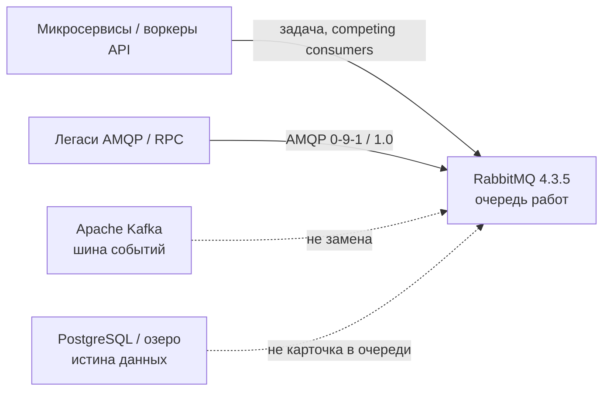
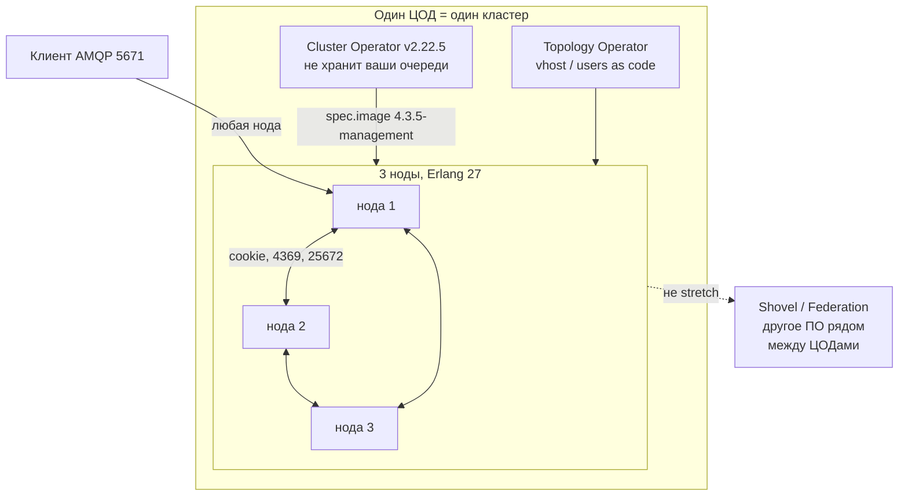
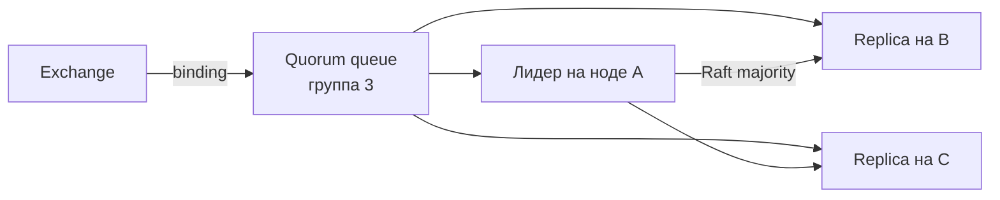
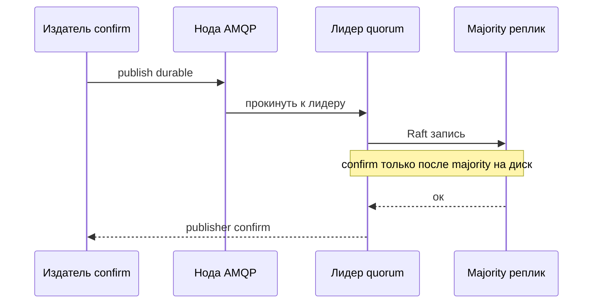
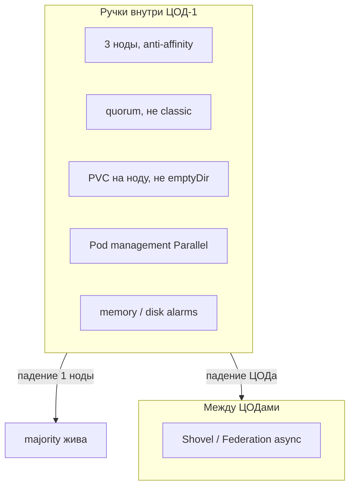
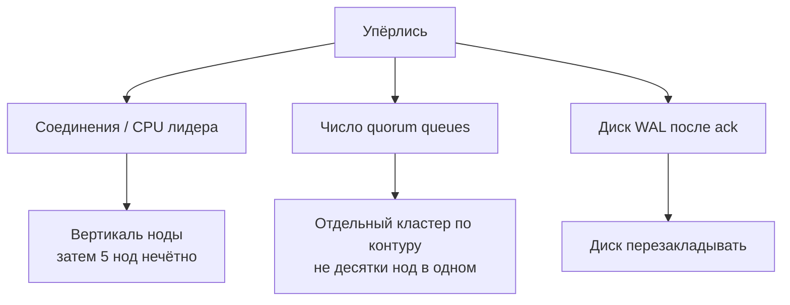
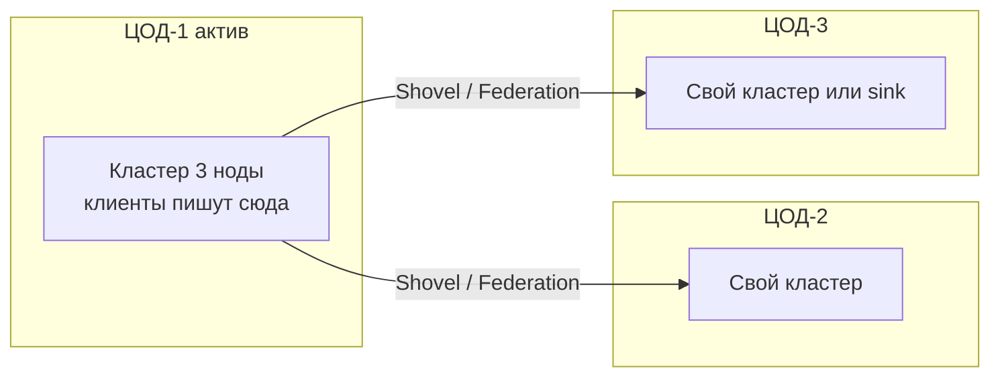

# RabbitMQ 4.3.5 — схемы устройства

Связанные документы: правила — `RabbitMQ.md`; установка — `RabbitMQ.install.md`.

C4 / «D4»: контекст → контейнеры → компоненты. Код клиентов не рисуем.

Допущения: stretch одного кластера на 2–3 ЦОДа **нет** (партиции Raft / Khepri чувствительны к WAN). Кластер из **3 нод внутри одного ЦОДа**. Другие площадки — **Shovel / Federation**, не общий кворум. Не замена Kafka. Cluster Operator **v2.22.5**, образ **пинить `rabbitmq:4.3.5-management`** (дефолт оператора — **4.3.4**). Erlang **27**. Нагрузки нет.

---

## 1. Контекст

RabbitMQ — **очередь задач / AMQP-буфер**, не шина событий и не SoT карточки.

Несколько потребителей **одной** очереди делят работу: каждое сообщение — **одному**. Это не consumer group на логе Kafka. После ack данных в брокере **нет**.

Если в контуре нет AMQP-клиентов и всё уже на Kafka — кластер можно не ставить.

---

## 2. Контейнеры (одно ПО, разные роли)

Клиент **может** ходить на любую ноду (в отличие от Kafka: лидер партиции). Балансировщик перед **5671** допустим. Цена: лишний hop, если попали не на лидера quorum queue.

Порты **4369** (epmd) и **25672** (Erlang distribution) — только ноды и CLI, не в интернет. Cookie совпадает у всех, иначе кластера нет.

---

## 3. Компоненты очереди

| Тип | Что помнить |
|---|---|
| Quorum queue | Официальный выбор HA. Confirm = majority записала на диск |
| Classic | С 4.0 **не реплицируется**. Три ноды ≠ HA classic |
| Stream | Журнал с offset, порты **5552/5551**. Не «Kafka внутри Rabbit» |
| Khepri | Метаданные всего кластера. Majority нод жива, иначе declare/права глухие |

Mirroring classic и `ha-mode` **удалены с 4.0**. Mnesia и `pause_minority` / `autoheal` — с **4.3**. Восстановление — семантика Raft, не старый чеклист partition handling.

`default_queue_type = quorum` **до** того, как приложения насоздают classic «по дефолту».

---

## 4. Поток publish

Без confirm клиент **не знает**, дошло ли. Consumer — **manual ack**; auto-ack теряет сообщение, если воркер умер на полуслове. `delivery-limit` (дефолт 20) + DLX — иначе яд забьёт диск.

---

## 5. Отказоустойчивость — что настраивать

| Ручка | Если забыть |
|---|---|
| 3 ноды + zone anti-affinity | Два пода в одном зале = HA на бумаге |
| Образ `4.3.5-management` | Оператор сам поставит **4.3.4** |
| Durable диск | Рестарт пода = полный resync реплики |
| `OrderedReady` + `check_running` | Rolling deadlock, пока нода ждёт sync |
| `disk_free_limit` = 50 МБ | Дефолт туториала; публикация стопорится слишком поздно |
| `net_ticktime` понизить на WAN | Ложные разрывы. На stretch мы и так не идём |

Партиция сети **внутри** кластера: minority не принимает операции. Три ноды в одном ЦОДе как раз чтобы Raft не ходил по межЦОДовому каналу, где потери и RTT > 100 мс официально **не рекомендуют** кластеризовать.

---

## 6. Масштабируемость — что настраивать

Единица параллелизма **одной** очереди — потребители на ней, плюс CPU **лидера**. Больше нод ≠ линейный throughput: метаданные Khepri копируются **на каждую** ноду синхронно. Ориентир проекта: пересмотреть топологию, если quorum queues **> ~5000**.

TLS бьёт по CPU — «включили, скорость та же» неверно. Watermark RAM считать от **лимита контейнера**, не от памяти ноды Kubernetes.

---

## 7. 2–3 ЦОДа без stretch

Одного списка узлов «на страну» при запрете stretch **нет**. Confirm локальный, не ждёт чужой ЦОД.

**Сильное:** латентность confirm не прибита межЦОДовым RTT; партиция WAN не рвёт Khepri.  
**Слабое:** RPO ≠ 0, возможны дубли; link Shovel живёт на конкретной ноде — её падение отдельный failover плагина. Смерть ЦОД-1 = простой локальных очередей, пока не переключите клиентов и мост.

Официально **двух ЦОДов недостаточно** для stretch-кворума — поэтому мы stretch не рисуем, а не «поставим 1+1».

---

## 8. Безопасность на той же картине

1. NetworkPolicy: 5671 клиентам; 4369/25672/stream-replication только между нодами.
2. TLS 5671 / 15671. Удалить `guest`. Нет ANONYMOUS.
3. Отдельный пользователь на приложение; permissions на vhost.
4. Cookie не в git. At-rest: шифрование **тома** — брокер тела сам не шифрует.

Источники: `RabbitMQ.md`. Таблица RTT для **кластера** у проекта есть — при > 100 мс или потерях пакетов кластер **не рекомендуют**; на схемах stretch нет.
