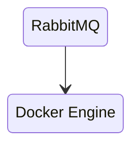
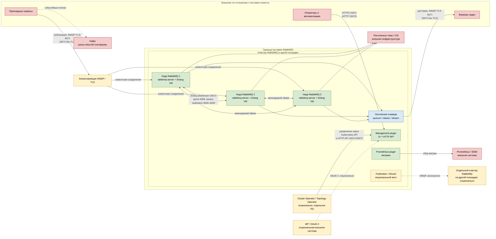

# RabbitMQ 4.3.5 — назначение, состав и границы системы

Версия ПО: **RabbitMQ 4.3.5** (релизная дата 17 августа 2026).
Документация линейки: https://www.rabbitmq.com/docs/
Релиз: https://github.com/rabbitmq/rabbitmq-server/releases/tag/v4.3.5
Официальный образ: `rabbitmq:4.3.5-management`.

RabbitMQ **не назван** в исходной архитектуре: шиной событий там заявлена **Kafka**. RabbitMQ нужен только при наличии отдельной задачи очередей работ или обязательных AMQP-клиентов. Если все необходимые потоки уже реализованы через Kafka, компонент **опционален и может не поставляться**.

---

## Назначение системы

RabbitMQ — слой **очередей работ**. Сервис кладёт сообщение «сделай задачу» (сходи в ведомство, обработай заявку, ответь на RPC), воркер забирает и делает. Если воркер умер на полуслове — сообщение можно отдать другому.

Система **хранит сообщения, пока их не подтвердят**. Она **не** хранит эталон клиентских карточек, **не** заменяет шину событий (Kafka), **не** исполняет бизнес-процессы (Camunda 8 / Zeebe) и **не** ходит сама в государственные сервисы. Для долгого лога с несколькими независимыми читателями и повтором с offset используйте Kafka — это другой контур.

---

## Перечень функций

Что брокер умеет из коробки (по документации проекта):

1. **Принимать и отдавать сообщения** по протоколам AMQP 0-9-1 (большинство Java/.NET/Python-клиентов), AMQP 1.0 (с 4.0 нативно, нужен SASL) и Stream (свой протокол, порты 5552/5551).
2. **Маршрутизировать**: публикация идёт в **exchange** (сам сообщения не хранит); по правилам **binding** сообщение попадает в **очередь**, где ждёт потребителя.
3. **Держать реплицируемые очереди задач (quorum queue)** на протоколе Raft: запись через лидера, подтверждение клиенту — когда **большинство** копий записало на диск. Официально «выбор по умолчанию», когда нужна сохранность. Типичный размер группы — **3** члена.
4. **Держать журнал Stream** («дописал и читают с offset») — ближе к топику Kafka, чем к классической очереди. Это не замена вашей шины Kafka.
5. **Держать обычную очередь (classic)**: живёт на **одной** ноде. С RabbitMQ **4.0** она **не реплицируется**. Упала нода — очередь недоступна (durable-сообщения на диске этой ноды). Это тип по умолчанию, пока его не переопределили.
6. **Подтверждать публикацию (publisher confirm)** и **ручное подтверждение обработки (manual ack)**. Без confirm клиент не знает, дошло ли. Без ack (auto-ack) сообщение теряется, если воркер умер на полуслове.
7. **Делить работу между воркерами** на одной очереди: каждое сообщение — одному (competing consumers). Это не «всем читателям своя копия», как consumer group у Kafka.
8. **Ограничивать ядовитые сообщения**: с 4.0 лимит повторной выдачи (**delivery-limit**) по умолчанию **20**, дальше — удаление или dead-letter. Есть TTL, dead-letter exchange, с 4.3 у quorum queue — **32 уровня приоритета**.
9. **Разделять контуры** виртуальными хостами (vhost; по умолчанию `/`) и правами пользователей.
10. **Отдавать UI и HTTP API** (плагин management, порты 15672 / 15671) и **метрики Prometheus**.
11. **Копировать сообщения между отдельными кластерами** плагинами Federation и Shovel (асинхронно, без общего кворума через город).
12. **Засеивать схему** JSON-ом (definition import): vhost, пользователи, очереди, политики.
13. **Останавливать публикацию**, если кончилась RAM или диск (пороги `vm_memory_high_watermark` и `disk_free_limit`) — это защита, не «зависание».
14. **Входить через OAuth 2** (плагин), если в контуре уже есть IdP.

Чего система **не** делает и часто путают: она не шина событий с долгим логом и партициями (это Kafka), не озеро эталона, не BPMN, не коннект к ведомствам. Старая репликация classic (`ha-mode`, mirroring) **удалена с 4.0**. Хранилище Mnesia и стратегии `pause_minority` / `autoheal` **удалены в 4.3** — восстановление теперь семантика Raft. Шифрования тел сообщений на диске брокера **нет**: только том (LUKS и т.п.) или шифрование на клиенте до публикации. ГОСТ TLS / СКЗИ в поставку не входят.

---

## Основные элементы системы и зависимости

RabbitMQ — серверное ПО, экземпляры которого можно объединить в кластер. На схеме показана рекомендуемая логическая граница: один кластер находится внутри одной площадки; связь с другой площадкой не входит в общий кворум и при необходимости выполняется асинхронным мостом.

**Опциональность всей системы:** RabbitMQ, все его плагины и операторы **опциональны**, пока не подтверждена потребность в очередях работ или AMQP. Kafka остаётся обязательной шиной событий платформы независимо от решения по RabbitMQ.

### Схема инстансов и потоков

**Легенда:**

- ■ **Зелёный** — программные компоненты RabbitMQ, входящие в границу поставки при выборе соответствующей функции.
- ■ **Красный** — отдельно развёрнутые внешние системы и потребители; RabbitMQ их не поставляет.
- ■ **Жёлтый** — опциональные элементы: они появляются только при выбранном способе доступа, управления, идентификации или межплощадочного обмена.
- ■ **Синий** — логический объект внутри брокера, а не отдельный процесс или отдельно развёртываемый инстанс.
- **Сплошная стрелка** — основной синхронный вызов, доставка либо инфраструктурная зависимость.
- **Пунктирная стрелка** — опциональный или независимый поток, не образующий единый кластер RabbitMQ.

### Как читать схему

1. Чтение начинается слева с прикладного сервиса. Он публикует задачу по AMQP. Для защищённого соединения используется порт **5671**; порт **5672** показывает вариант без TLS. Балансировщик выделен жёлтым: он удобен как единая точка входа, но **опционален** — клиентская библиотека может знать адреса нескольких нод самостоятельно.
2. Балансировщик направляет соединение на любую доступную ноду. Нода, принявшая публикацию, не обязательно владеет лидером нужной очереди: внутри кластера она передаёт операцию соответствующей ноде. Поэтому попадание не на лидера не меняет контракт клиента, но добавляет внутренний сетевой переход.
3. Три зелёных блока — три отдельных процесса `rabbitmq-server`, каждый в собственной Erlang VM и со своим постоянным томом. Это физические инстансы одной системы. Число **3** на схеме иллюстрирует кластер с большинством; это не оценка достаточной производительности для неизвестной нагрузки.
4. Двусторонние стрелки между нодами показывают служебный обмен. `epmd` на **4369** помогает нодам находить Erlang-порты, **25672** обслуживает Erlang distribution и команды CLI, а диапазон **6000–6500** используется для репликации stream. Это административные и межнодовые порты; клиентские приложения к ним не подключаются.
5. Синий блок очередей логический. Quorum queue, classic queue и stream создаются внутри брокера и не являются четвёртым сервером. Конкретный тип определяет хранение, репликацию и способ чтения. Тип выбирается для каждого сценария явно.
6. Воркеры получают сообщения из очереди по клиентскому порту. При competing consumers одно сообщение передаётся одному воркеру. Manual ack сообщает брокеру об успешной обработке; до такого подтверждения сообщение может быть выдано повторно.
7. Management plugin и Prometheus plugin показаны внутри границы RabbitMQ, но их функции различаются. Первый даёт UI и HTTP API, второй — endpoint метрик. Потеря UI не означает остановку AMQP-брокера. Prometheus и SIEM снаружи красные, потому что их развёртывание и доступность — отдельная поставка.
8. Cluster Operator и Topology Operator жёлтые и находятся за границей: это **опциональное отдельное ПО** для Kubernetes. Первый управляет жизненным циклом кластера, второй — объектами вроде пользователей, vhost и очередей. Сам RabbitMQ может существовать без этих операторов.
9. Каждый зелёный процесс зависит от собственного постоянного тома. Хранилище и CSI красные: RabbitMQ пишет данные, но не поставляет дисковую инфраструктуру. Один общий каталог для нескольких нод не является частью схемы.
10. IdP показан пунктиром как **опциональный** источник идентификации при OAuth 2. Без него используются собственные пользователи RabbitMQ. Выбор IdP и его эксплуатация находятся за границей поставки.
11. Federation/Shovel и второй кластер жёлтые: межплощадочная передача **опциональна**. Пунктир подчёркивает, что сообщение копируется асинхронно, а удалённый кластер не становится участником общего Raft-кворума.
12. Kafka красная и подключена отдельной пунктирной линией. Это независимый событийный путь платформы. Сообщение не обязано проходить одновременно через RabbitMQ и Kafka; выбор зависит от семантики конкретного потока.

### Компоненты, варианты и граница поставки

#### Нода RabbitMQ

- **Реализация:** процесс `rabbitmq-server` в Erlang VM; экземпляр может работать в контейнере, поде Kubernetes или на поддерживаемом Linux-хосте.
- **Назначение:** принимает клиентские соединения, маршрутизирует сообщения, обслуживает очереди и участвует в хранении метаданных и реплик.
- **Варианты:** один инстанс для разработки либо несколько нод одного кластера. Один процесс не следует называть отказоустойчивым кластером.
- **Опциональность:** сам компонент обязателен, только если принято решение поставлять RabbitMQ; число инстансов определяется сценарием и нагрузкой.
- **Граница поставки:** ПО RabbitMQ и его штатная конфигурация входят; ОС, вычислительные ресурсы, сеть, DNS и постоянные тома не входят.

#### Внутреннее хранилище метаданных Khepri

- **Реализация:** встроенное в ноды RabbitMQ хранилище на основе Raft; в RabbitMQ 4.3 это единственное штатное хранилище метаданных.
- **Назначение:** хранит определения очередей, пользователей, прав и другие данные уровня кластера.
- **Варианты:** отдельный внешний экземпляр Khepri не разворачивается; Mnesia не является вариантом для RabbitMQ 4.3.
- **Опциональность:** не опционально внутри RabbitMQ 4.3.
- **Граница поставки:** входит в `rabbitmq-server`; внешний сервер БД для него не нужен и не поставляется.

#### Quorum queue

- **Реализация:** реплицируемая очередь на основе отдельной Raft-группы с лидером и членами.
- **Назначение:** очередь работ, для которой требуется сохранение доступности при отказе меньшинства реплик.
- **Варианты:** число членов и размещение задаются политикой; типичный размер группы по документации — 3.
- **Опциональность:** **опциональный тип очереди**, но предпочтительный для важных очередей. Он не нужен каждому временному или тестовому потоку.
- **Граница поставки:** программная реализация входит в RabbitMQ; диски, резервное копирование инфраструктуры и клиентская идемпотентность не входят.

#### Classic queue

- **Реализация:** очередь, размещённая на одной ноде; в RabbitMQ 4.x не реплицируется.
- **Назначение:** простые или временные очереди без требования пережить отказ ноды.
- **Варианты:** durable или transient в рамках возможностей очереди, но ни один вариант не создаёт реплику на другой ноде.
- **Опциональность:** **опциональный тип**; не подходит как замена quorum queue при требовании отказоустойчивости.
- **Граница поставки:** входит в RabbitMQ; восстановление потерянной доступности без исходной ноды и её диска не предоставляется.

#### RabbitMQ Stream

- **Реализация:** реплицируемый дописываемый журнал и отдельный клиентский Stream protocol.
- **Назначение:** повторное чтение с позиции и несколько независимых читателей внутри локального сценария RabbitMQ.
- **Варианты:** доступ по портам **5552** без TLS или **5551** с TLS.
- **Опциональность:** **опциональная функция**; при наличии Kafka её необходимость должна быть отдельно обоснована.
- **Граница поставки:** серверная функция входит в RabbitMQ; Kafka, коннекторы и перенос существующих событийных потоков не входят.

#### Exchange, binding и vhost

- **Реализация:** логические объекты конфигурации брокера, а не отдельные процессы.
- **Назначение:** exchange принимает публикацию, binding задаёт маршрут в очередь, vhost изолирует имена и права разных контуров.
- **Варианты:** тип exchange и правила binding выбираются под контракт потока; объекты можно создавать API, клиентом или декларативной автоматизацией.
- **Опциональность:** exchange и очередь нужны для AMQP 0-9-1-потока; отдельные vhost **опциональны**, но полезны для изоляции.
- **Граница поставки:** механизмы входят в RabbitMQ; бизнес-имена, routing key и владение контрактом определяет прикладная команда.

#### Management plugin

- **Реализация:** штатный плагин с web-интерфейсом и HTTP API.
- **Назначение:** наблюдение и административное управление объектами RabbitMQ.
- **Варианты:** HTTP **15672** либо HTTPS **15671**.
- **Опциональность:** **опционален** для передачи сообщений; может быть нужен операционной автоматизации.
- **Граница поставки:** плагин входит в официальный management-образ; внешний ingress, балансировщик, PKI и единый вход не входят.

#### Prometheus plugin

- **Реализация:** штатный endpoint метрик RabbitMQ.
- **Назначение:** отдаёт показатели брокера системе мониторинга.
- **Варианты:** встроенные наборы метрик и настраиваемая детализация.
- **Опциональность:** технически **опционален**, но мониторинг производственного экземпляра должен быть предусмотрен.
- **Граница поставки:** endpoint входит; сервер Prometheus, хранилище метрик, панели и оповещения не входят.

#### Federation и Shovel

- **Реализация:** два разных штатных плагина асинхронной передачи между брокерами или кластерами.
- **Назначение:** переносит сообщения через границу кластеров без объединения нод в один Raft-кворум.
- **Варианты:** Federation управляет федеративными upstream-связями, Shovel переносит сообщения по явно заданному маршруту.
- **Опциональность:** оба **опциональны**; нужны только при подтверждённом межкластерном потоке.
- **Граница поставки:** плагины входят в RabbitMQ; канал между площадками, удалённый кластер и согласование семантики повторной доставки не входят.

#### Клиентские библиотеки и прикладные сервисы

- **Реализация:** AMQP- или Stream-библиотеки для Java, .NET, Python и других языков.
- **Назначение:** публикуют и получают сообщения, выполняют publisher confirm, manual ack, повторное подключение и обработку повторной доставки.
- **Варианты:** официальный или совместимый клиент выбранного протокола.
- **Опциональность:** без хотя бы одного клиента RabbitMQ не имеет прикладной функции; конкретная библиотека выбирается приложением.
- **Граница поставки:** сервер RabbitMQ не включает код приложения, воркеры, бизнес-обработчики и их идемпотентность.

#### Cluster Operator и Topology Operator

- **Реализация:** отдельные Kubernetes-операторы; Cluster Operator создаёт и сопровождает кластер, Topology Operator управляет логическими объектами.
- **Назначение:** декларативное управление жизненным циклом и топологией RabbitMQ в Kubernetes.
- **Варианты:** ручное/иное автоматизированное управление без операторов либо использование одного или обоих операторов.
- **Опциональность:** **опциональны** и нужны только при выбранном Kubernetes-способе управления.
- **Граница поставки:** не входят в `rabbitmq-server`; Kubernetes, его операторы и их обновление — отдельная поставка.

#### Балансировщик, IdP, хранилище и наблюдаемость

- **Реализация:** внешние продукты выбранной платформой инфраструктуры.
- **Назначение:** соответственно дают единую точку входа, идентификацию, постоянные тома и сбор телеметрии.
- **Варианты:** зависят от стандартов платформы; RabbitMQ не требует конкретного вендора этих систем.
- **Опциональность:** балансировщик и IdP **опциональны**; постоянное хранилище необходимо для сохраняемых данных; внешняя наблюдаемость определяется эксплуатационным контуром.
- **Граница поставки:** все эти системы находятся вне поставки RabbitMQ.

#### Kafka и отдельный кластер RabbitMQ

- **Реализация:** независимо развёрнутые системы.
- **Назначение:** Kafka обслуживает событийную шину; второй RabbitMQ обслуживает автономную площадку или контур.
- **Варианты:** между RabbitMQ-кластерами может не быть связи либо применяется Federation/Shovel.
- **Опциональность:** Kafka не является опцией RabbitMQ и остаётся отдельным компонентом платформы; второй RabbitMQ-кластер **опционален**.
- **Граница поставки:** ни Kafka, ни удалённый кластер не входят в экземпляр, ограниченный зелёной областью схемы.

### Официальные порты

Порты можно изменить конфигурацией, поэтому их значения являются сетевым контрактом конкретного экземпляра.

| Порт | Назначение | Кому открывать |
|---|---|---|
| **5672/TCP** | AMQP 0-9-1 и AMQP 1.0 без TLS | Доверенные клиенты; не публиковать в интернет |
| **5671/TCP** | AMQP поверх TLS | Прикладные клиенты |
| **15672/TCP** | HTTP API и management UI без TLS | Операторы и автоматизация в доверенной сети |
| **15671/TCP** | HTTP API и management UI поверх TLS | Операторы и автоматизация |
| **5552/TCP** | Stream protocol без TLS | Stream-клиенты в доверенной сети |
| **5551/TCP** | Stream protocol поверх TLS | Stream-клиенты |
| **4369/TCP** | `epmd`, обнаружение Erlang distribution | Только ноды и административный CLI |
| **25672/TCP** | Erlang distribution между нодами и для CLI; по умолчанию AMQP-порт + 20000 | Только ноды и административный CLI |
| **35672–35682/TCP** | Клиентские порты CLI к Erlang distribution | Административные хосты |
| **6000–6500/TCP** | Репликация RabbitMQ Stream | Только между нодами кластера |

Порты **4369** и **25672** нельзя выставлять в публичную сеть: Erlang cookie вместе с доступом к distribution даёт административные возможности. Management-порты также не предназначены для публичного доступа.

### Зависимости окружения

- **DNS и имена нод:** имя каждой ноды должно разрешаться у остальных членов кластера.
- **Erlang cookie:** общий секрет требуется для взаимной аутентификации нод; его хранение вне RabbitMQ обеспечивает платформа секретов.
- **Постоянный том:** каждой ноде нужен собственный том для сохраняемых очередей и метаданных; общий каталог нескольких нод не поддерживается как модель хранения.
- **Сеть:** клиентские, административные и межнодовые потоки должны быть разделены сетевыми правилами.
- **Время:** синхронизация часов нужна для корректной интерпретации журналов и метрик.
- **PKI:** сертификаты и доверенная цепочка нужны для TLS, но корпоративный удостоверяющий центр находится вне поставки.
- **Идентификация:** собственные пользователи RabbitMQ доступны штатно; внешний IdP через OAuth 2 — опциональный вариант.
- **Наблюдаемость:** RabbitMQ отдаёт метрики и журналы, а их хранение, визуализация и оповещения выполняются внешними системами.

---

## Специальные термины

- **Ack (acknowledgement)** — подтверждение потребителя брокеру, что сообщение успешно обработано и его можно удалить из очереди.
- **AMQP** — семейство прикладных протоколов обмена сообщениями; основные клиентские варианты RabbitMQ — AMQP 0-9-1 и AMQP 1.0.
- **Auto-ack** — режим, при котором доставка считается успешной сразу, без явного подтверждения приложения.
- **Binding** — правило, связывающее exchange с очередью или другим exchange.
- **BPMN** — нотация описания исполняемых бизнес-процессов; RabbitMQ сам такие процессы не исполняет.
- **Broker (брокер)** — сервер-посредник, который принимает, маршрутизирует и выдаёт сообщения.
- **Classic queue** — очередь RabbitMQ 4.x, хранящаяся на одной ноде без межнодовой репликации.
- **Competing consumers** — несколько обработчиков одной очереди, между которыми брокер распределяет сообщения по принципу «одно сообщение — одному обработчику».
- **CSI** — интерфейс Kubernetes для подключения внешних систем хранения к подам.
- **Dead-letter / DLX** — механизм перенаправления отклонённых, просроченных или исчерпавших лимит доставок сообщений.
- **Definition import** — загрузка описаний vhost, пользователей, очередей, exchange, binding и политик из JSON.
- **Delivery-limit** — максимальное число повторных доставок сообщения quorum queue до удаления или отправки в dead-letter.
- **Durable** — свойство объекта или сообщения, предполагающее сохранение на диске и восстановление после перезапуска в пределах гарантий его типа.
- **Endpoint** — сетевой адрес и порт, на котором компонент предоставляет API или метрики.
- **epmd** — служба Erlang Port Mapper Daemon, через которую Erlang-ноды обнаруживают порты друг друга.
- **Erlang cookie** — общий секрет для аутентификации Erlang-нод и административных инструментов.
- **Erlang distribution** — служебный протокол обмена между Erlang-нодами.
- **Erlang VM** — виртуальная машина, внутри которой выполняется процесс RabbitMQ.
- **Exchange** — логический маршрутизатор AMQP; принимает публикацию и направляет её по binding, но сам не является очередью.
- **Federation** — плагин асинхронного получения сообщений из удалённых брокеров или кластеров.
- **ГОСТ TLS / СКЗИ** — сертифицированные российские криптографические требования и средства; стандартная поставка RabbitMQ их не реализует.
- **HTTP API** — административный программный интерфейс management plugin.
- **Idempotency (идемпотентность)** — способность обработчика безопасно выполнить повторно доставленную задачу без нежелательного повторного эффекта.
- **IdP** — внешняя система идентификации, выдающая сведения или токены для входа.
- **Khepri** — встроенное в RabbitMQ 4.3 хранилище метаданных кластера на основе Raft.
- **Leader (лидер)** — член Raft-группы, через который проходят изменения конкретной quorum queue или группы метаданных.
- **Listener** — сетевой сокет процесса, принимающий подключения на заданном порту.
- **Manual ack** — явное подтверждение успешной обработки сообщения клиентским кодом.
- **Nack** — отрицательное подтверждение публикации или обработки.
- **Node (нода)** — один экземпляр процесса `rabbitmq-server` со своим именем и хранилищем.
- **OAuth 2** — протокол авторизации по токенам, который RabbitMQ поддерживает через плагин.
- **Offset** — позиция чтения в последовательном журнале Stream или Kafka.
- **Plugin (плагин)** — подключаемый модуль, расширяющий функции `rabbitmq-server`.
- **Prometheus** — внешняя система сбора и хранения метрик; RabbitMQ предоставляет совместимый endpoint через плагин.
- **Publisher confirm** — подтверждение брокера издателю, что публикация принята согласно гарантиям выбранной очереди.
- **Quorum (кворум)** — большинство членов группы, необходимое Raft для принятия решений.
- **Quorum queue** — реплицируемая очередь RabbitMQ на основе Raft.
- **Raft** — алгоритм согласования состояния между несколькими членами группы через лидера и большинство.
- **Raft-группа** — отдельный набор лидера и реплик, согласующий конкретное состояние.
- **RabbitMQ Cluster Operator** — отдельный Kubernetes-оператор жизненного цикла кластеров RabbitMQ.
- **RabbitMQ Topology Operator** — отдельный Kubernetes-оператор для декларативного управления пользователями, vhost, очередями и другими объектами.
- **Routing key** — значение публикации, которое exchange использует при выборе маршрута.
- **RPC** — модель вызова удалённой операции с запросом и ответом.
- **SASL** — каркас механизмов аутентификации, применяемый, в частности, с AMQP 1.0.
- **Shovel** — плагин, пересылающий сообщения между явно заданными источником и назначением.
- **SIEM** — внешняя система сбора и анализа событий информационной безопасности.
- **Stream** — реплицируемый дописываемый журнал RabbitMQ с чтением по позиции.
- **TLS** — протокол шифрования и проверки подлинности сетевого соединения.
- **TTL** — срок жизни сообщения или очереди, после которого объект истекает.
- **UI** — пользовательский web-интерфейс management plugin.
- **vhost** — логическая область имён и прав внутри одного RabbitMQ.
- **Worker (воркер)** — прикладной процесс, который получает задачу из очереди и выполняет её.

---

## Источники

- Релиз RabbitMQ 4.3.5: https://github.com/rabbitmq/rabbitmq-server/releases/tag/v4.3.5
- Документация RabbitMQ: https://www.rabbitmq.com/docs/
- Clustering, межнодовые порты, Federation и Shovel: https://www.rabbitmq.com/docs/clustering
- Networking и порты: https://www.rabbitmq.com/docs/networking
- Quorum queues и publisher confirms: https://www.rabbitmq.com/docs/quorum-queues
- Classic queues: https://www.rabbitmq.com/docs/classic-queues
- Streams: https://www.rabbitmq.com/docs/streams
- Management plugin: https://www.rabbitmq.com/docs/management
- Prometheus plugin: https://www.rabbitmq.com/docs/prometheus
- OAuth 2: https://www.rabbitmq.com/docs/oauth2
- Kubernetes operators: https://www.rabbitmq.com/kubernetes/operator/operator-overview
- Официальный образ RabbitMQ: https://hub.docker.com/_/rabbitmq
