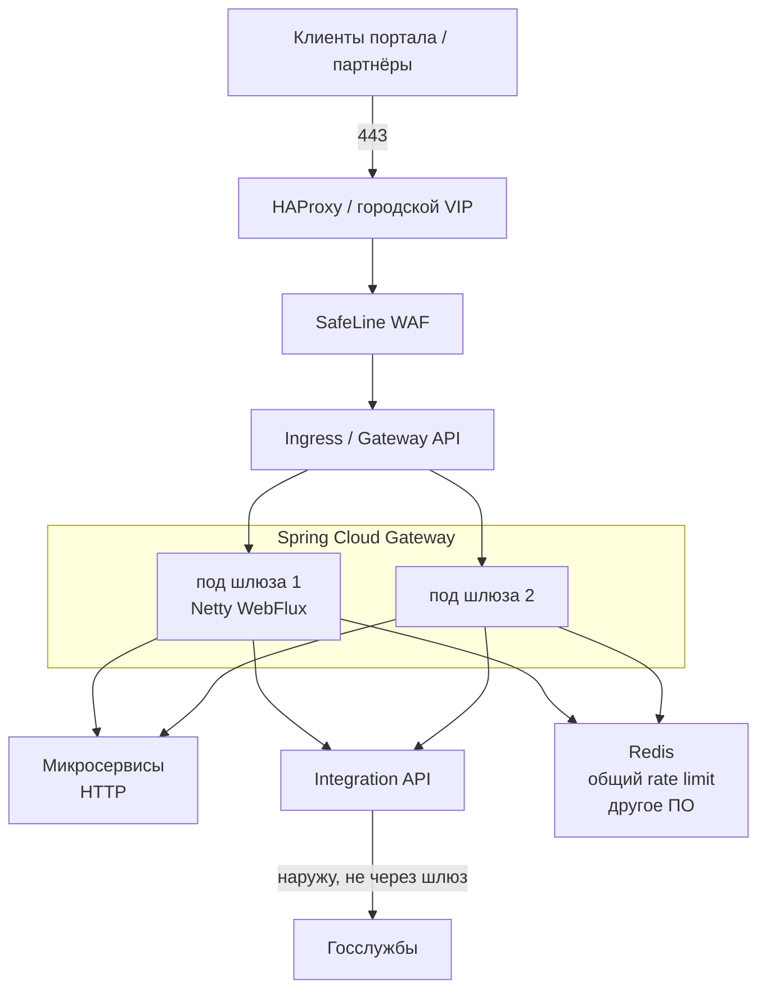

# Spring Cloud Gateway 5.0.3 — развёртывание и настройка

Spring Cloud Gateway — HTTP-шлюз: принимает запрос снаружи (или от внутреннего клиента) и **проксирует** его на нужный сервис: маршруты, заголовки, лимиты, вход по токену, обрыв при аварии бэкенда. Это **библиотека внутри вашего Spring Boot-приложения**, не готовый «кластер как Kafka», который ставят Helm-чартом вендора.

Версия, о которой этот документ: **5.0.3** (релизная дата **20 августа 2026**; на дату подготовки — последний стабильный патч линии **5.0**). Входит в поезд **Spring Cloud 2025.1.3** (aka **Oakwood**). Поезд официально **основан на Spring Boot 4.0.8**. С **2025.1.2** линейка Oakwood совместима также с **Spring Boot 4.1.x**.

Документация: https://docs.spring.io/spring-cloud-gateway/reference/ (страницы Server WebFlux помечены **5.0.3**)  
BOM: `org.springframework.cloud:spring-cloud-dependencies:2025.1.3`  
Анонс поезда: https://spring.io/blog/2026/08/20/spring-cloud-2025-1-3-has-been-released  
Матрица поездов: https://spring.io/projects/spring-cloud

В **5.0.3** закрыт **CVE-2026-47879** (SSRF и доступ к локальным файлам через gRPC-путь Gateway). В бой не тащить 5.0.2 и ниже этой линии без патча.

Этот текст — не набор команд «скопируй `application.yml`», а правила, без которых экземпляр не будет одновременно устойчивым к сбоям, масштабируемым и безопасным. Пошаговая установка — в `Spring Cloud Gateway.install.md`.

Spring Cloud Gateway **не было** в исходном описании архитектуры как отдельный продукт. Ниже — как поставить **входной HTTP-шлюз** на ту же платформу. Это **не** замена Kafka, **не** Camunda, **не** озеро клиентских данных и **не** сам интеграционный оркестратор «какие ведомства дергать».

---

## Назначение системы

Spring Cloud Gateway — слой **входа HTTP**. Браузер портала или партнёрская система открывает ваш API; шлюз смотрит путь и заголовки и пересылает запрос на нужный микросервис или на Integration API.

Система **проксирует** уже существующие HTTP-сервисы. Она **не** хранит эталон клиентских карточек, **не** заменяет очередь событий (Kafka), **не** исполняет бизнес-процессы (Camunda) и **не** ходит сама в государственные сервисы. Исходящие вызовы к ведомствам делает **интеграционное API**. Для WAF (семантика атаки) используйте SafeLine — это другой контур. Для городского VIP и TLS на краю — HAProxy / Ingress.

---

## Перечень функций

Что шлюз умеет из коробки (по документации проекта, вкус **Server WebFlux**):

1. **Маршрутизировать HTTP(S)**: правило «если запрос подходит под условия (предикаты) — отправить на URI, прогнав фильтры». У маршрута есть `id` и `order` (кто победит, если подошло несколько). Несколько предикатов в YAML **склеиваются через AND**.
2. **Резать и дополнять запрос**: срезать префикс пути, добавить заголовок, ограничить размер, CORS, типовые заголовки браузерной защиты (SecureHeaders — это не WAF).
3. **Балансировать на инстансы сервиса** схемой `lb://` (нужен Spring Cloud LoadBalancer и DiscoveryClient) **или** ходить на фиксированный URI / DNS Service Kubernetes. Путь в URI маршрута официально **игнорируется** (берётся путь входящего запроса + фильтры вроде StripPrefix).
4. **Автосоздавать маршруты** по всем сервисам из реестра (discovery locator). Завод **выключен**. Включить «чтобы не писать YAML» в бою = выставить наружу **все** найденные Service.
5. **Ограничивать частоту** (token bucket). Штатная общая реализация — Redis. Без распределённого бэкенда счётчик живёт **на поде**: при 10 репликах квота ×10. Ключ лимита (пользователь, IP) задаёте вы; **нет ключа → запрос отклоняется**.
6. **Обрывать больной бэкенд** (circuit breaker, обычно Resilience4j) и отдавать запасной ответ (fallback). Без автомата шлюз копит таймауты и жжёт пул соединений.
7. **Повторять запрос** (retry). На GET иногда уместно. На **POST в ведомство** без идемпотентности = двойная заявка.
8. **Держать исходящий HTTP-клиент** (Netty HttpClient): пул соединений (завод типа пула в 5.0.3 — **elastic**; режим **fixed** ограничивает `max-connections`), таймаут установки TCP и полного ответа. Глобально и **на маршрут**.
9. **Отдавать пульт маршрутов** через Actuator `/actuator/gateway`. В 5.0.3 доступ **по умолчанию выключен**. Режим `unrestricted` = можно **менять маршруты на живую** (классический вектор SSRF).
10. **Понимать цепочку прокси**: фильтры Forwarded / X-Forwarded в 5.x **не активируются**, пока не задан `trusted-proxies` (Java-regex доверенных прокси).
11. **Кэшировать ответы GET в памяти пода** (Caffeine). Это не Redis, не CDN и не общее на три площадки.
12. **Проксировать из своего контроллера** (Proxy Exchange) — другая поставка, не платформенный вход.

Чего система **не** делает и часто путают: она не шина событий, не BPMN, не озеро эталона, не оркестрация ведомств, не WAF, не Ingress-контроллер, не плавающий городской VIP, не балансировщик Kafka / Postgres / gRPC Camunda. Несколько подов = несколько независимых JVM: согласованность конфига — Git / ConfigMap, не Raft. Общего кэша ответов на три дата-центра нет. ГОСТ TLS / СКЗИ не заявлены. Готовой цифры «хватит N запросов в секунду» у проекта нет.

Два вкуса в одном процессе **нельзя** смешать: WebFlux (`spring-cloud-starter-gateway-server-webflux`) и WebMVC (`spring-cloud-starter-gateway-server-webmvc`). Старый префикс YAML 4.x `spring.cloud.gateway.routes` в 5.x WebFlux **молча не биндится** — маршрутов нет. Нужен `spring.cloud.gateway.server.webflux.routes`.

---

## Требования к развёртыванию

### Требования к ПО

| Что | Что ставить | Комментарий |
|---|---|---|
| **Формат поставки** | Контейнер **вашего** Spring Boot-приложения | Официального образа «Spring Cloud Gateway как продукт» нет. Это JAR с стартером, не Helm-чарт вендора. |
| **Стартер боя** | `spring-cloud-starter-gateway-server-webflux` | Полноценный реактивный шлюз на Netty. MVC не запрещён, но префиксы и фильтры **другие**. `spring-cloud-starter-gateway` без `-server-webflux` — гайды 4.x. |
| **Поезд / Boot** | BOM **2025.1.3** + Spring Boot **4.0.8** | На 4.0.8 поезд **явно основан**. Переход на 4.1.x допустим матрицей Oakwood с 2025.1.2 — отдельное решение совместимости всех облачных модулей, не `latest` Boot. |
| **JDK** | Минимум **Java 17**; для нового контура **21 или 25 LTS** | Boot 4.0: first-class **Java 25**, совместимость до 25. Boot 4.1.x (если возьмёте): до **Java 26**. Сборщики: Maven **≥ 3.6.3** или Gradle **8.14+ / 9.x** (требования текущей доки Boot 4.1.1; для 4.0.8 смотреть system requirements **той** минорной линейки). |
| **Сервер** | Встроенный Netty Boot | **Не** класть WebFlux-шлюз во внешний Tomcat как WAR «как старый Spring MVC». |
| **Оркестратор боя** | Kubernetes: Deployment + Service + (обычно) Ingress | Это оркестрация процесса, не замена маршрутов. Не StatefulSet (нет стабильной личности). |
| **ОС** | Linux в контейнере | **Боевой шлюз на Windows-хосте в схеме с Kubernetes не предполагается.** |
| **Redis** | Только если общий rate limit | Тогда отказоустойчивость Redis проектируется **отдельно** (см. документ Redis 7). Caffeine/Bucket4j без распределённого бэкенда считает лимит **на под**. |
| **DiscoveryClient** | Только если `lb://` или locator | На Kubernetes это либо DNS Service (`http://name.ns.svc`), либо Spring Cloud Kubernetes + RBAC на API. Смешивать Eureka + K8s + хардкод — путь к ночным 503. |
| **Часы** | NTP на всех машинах | JWT, TLS, метрики, Redis TTL. |
| **Сертификаты** | Корпоративный PKI для боя | На входе часто терминирует Ingress/HAProxy; исходящий TLS к origin — доверенные сертификаты. `use-insecure-trust-manager: true` в бою не настройка. |

Не кладите оба стартера WebFlux и WebMVC в один JAR «на всякий случай».

### Требования к ресурсам

Цифр «сколько ядер на ваши запросы в секунду» у проекта **нет**. Официальных бенчмарков Gateway нет. Не подставляйте цифры из блогов. Ниже — что из исходного текста можно сказать честно, не смета закупки.

| Роль | CPU | RAM | Диск |
|---|---|---|---|
| **Под шлюза, бой** | Запас под TLS handshake, **если** шифрование снимаете **на шлюзе**, а не на HAProxy/Ingress. Цифры ядер проект не даёт | Куча JVM + прямые буферы Netty. Лимит памяти пода **обязателен**: без него процесс легко съедает ноду. Цифры гигабайт проект не даёт | Своего склада данных нет. Образ приложения |
| **Учебный один процесс** | Минимум | Хватит меньше боевого | Без тома под данные |

Дополнительно:

- «Терабайты данных» на размер шлюза почти не влияют. Влияют: **запросы в секунду, размер тела, число одновременных долгих запросов**, доля TLS, retry (умножает нагрузку на origin).
- Заводской connect-timeout в appendix **30 с**, если не задан — для внутреннего Service обычно слишком много (дольше держит слот при мёртвом поде). Это не ресурс железа, но бьёт по ёмкости пула.
- Пул `elastic` при шторме размножает соединения до нехватки файлов / памяти. В бою — `fixed` + явный `max-connections`.
- Локальный кэш ответов **не** масштабируется горизонтально как общая память: каждый под кэширует своё.
- На тестовой песочнице боевые limits можно не требовать. Этот стенд **нельзя** переносить в бой как «официальный минимум».

---

## Основные элементы системы и зависимости

Это одно ПО из **нескольких процессов** (реплики вашего приложения) плюс край платформы. Ниже — те, что живут отдельными инстансами, и как они вызывают друг друга.

### Схема инстансов и потоков

Как читать схему:

1. Человек или партнёр заходит на **край** (HAProxy, WAF, Ingress). Шлюз **не** единственный процесс с публичным IP на три площадки.
2. Ingress отдаёт запрос на один из **подов Spring Cloud Gateway**. Поды независимы: общего лидера нет. Упал под — Kubernetes поднимает другой; клиент, который уже висел на сломанном TCP, получит обрыв — это норма для HTTP-прокси.
3. Шлюз по маршруту ходит в **микросервисы** или в **Integration API** по HTTP. Исходящие соединения устанавливает **сам** (Netty HttpClient). NetworkPolicy: куда ему можно ходить, а куда нельзя (произвольный интернет, metadata-серверы, брокер Kafka).
4. **Integration API** ходит в ведомства. Шлюз туда **не** должен ходить сам: иначе второй, невидимый контур интеграций, плюс SSRF при кривом маршруте.
5. **Redis** нужен только если лимит частоты общий на все реплики. Иначе каждый под считает своё.
6. Kafka, Zeebe gRPC, диск озера — **мимо** этого шлюза.

Два контура нельзя склеить в одну «ферму на всё»: вход людей (northbound) и выход к ведомствам (southbound).

### Что входит в состав

| Компонент | Зачем | Как масштабируется |
|---|---|---|
| **Под шлюза (WebFlux)** | Вход, маршруты, фильтры | Горизонталь — реплики Deployment. Вертикаль — CPU/RAM, куча JVM, пул HttpClient |
| **Маршруты YAML / Java `RouteLocator`** | Контракт входа | YAML для GitOps; Java — когда предикат сложнее AND. В бою один механизм, не «на тесте Java, в бою YAML» |
| **Netty HttpClient** | Исходящие вызовы к origin | Таймауты, TLS, пул. Не Ingress и не Tomcat |
| **Фильтры и предикаты** | Политика на маршруте | Явный список, не «все дефолты подряд» |
| **Proxy Exchange** | Прокси из своего контроллера | Не платформенный вход, а кусок приложения |

Рядом, но это уже другое ПО: Kubernetes Ingress / Gateway API, HAProxy, SafeLine WAF, Redis, Spring Cloud LoadBalancer / Spring Cloud Kubernetes, IdP (OIDC), Prometheus / Grafana Tempo. Их отказ проектируется отдельно.

### Порты (контракт сети)

У шлюза нет «своих» портов вендора, как у Kafka. Контракт задаёте вы. Типично:

| Порт | Назначение | Кому открывать |
|---|---|---|
| **8080/TCP** (или тот, что в `server.port`) | HTTP входа шлюза | Ingress / HAProxy, не мир напрямую |
| **443/TCP** | HTTPS | Обычно на крае, не на каждом поде |
| Actuator (часто отдельный порт) | health, метрики, `/gateway` | Prometheus и операторы, не пользовательская VLAN |
| Исходящие на origin | порты ваших Service | Только нужные микросервисы и Integration API |

Балансировщик перед HTTP допустим — это штатная модель Kubernetes Service. Шлюз сам IP между площадками не таскает.

### Зависимости окружения

- Сеть до origin: шлюз устанавливает **свои** исходящие соединения.
- Origin принимает HTTP **только** из CIDR шлюза (и mesh), не NodePort «на всякий случай».
- Идентификация: люди и сервисы — разные учётки. Spring Security **до** проксирования внутренних API. Origin всё равно проверяет JWT: иначе обход шлюза = обход входа.
- Camunda Operate/Tasklist, OpenSearch Dashboards, Grafana — отдельные входы с отдельным IdP; не тащить их через тот же публичный шлюз, что портал, без жёсткого списка доступа.

---

## Краткие вводные

### Как устроена отказоустойчивость

Процесс шлюза **почти без состояния**. Это не Raft и не «кластер шлюзов».

| Что падает | Что происходит |
|---|---|
| Один origin | Без circuit breaker шлюз копит таймауты и жжёт пул. С автоматом — быстрый отказ / fallback на **этом** маршруте |
| Один под Gateway | Service/Ingress перестаёт слать сюда (при живом probe). Нужны **не меньше двух** подов |
| Redis rate limiter | Либо 429 / ошибка лимитера, либо (если криво настроен fallback) **дыра в лимите**. Это отдельная зависимость |
| Конфиг маршрутов | Живёт в приложении / ConfigMap. «Кластер шлюзов» сам его не реплицирует |
| Один дата-центр | Поды в других площадках **не выбирают лидера**. Нужен тот же городской слой, что и для HAProxy |
| Неверный `trusted-proxies` | Либо нет X-Forwarded (сервисы видят IP шлюза), либо доверяете миру — подмена IP |

Следствие: отказ входа = **несколько живых подов в разных зонах** + живой Ingress/HAProxy + (если лимиты общие) **живой Redis**. Один под на три дата-центра отказоустойчивости **не даёт**. Origin — **локальный** Service этой площадки: шлюз площадки 1 в Integration API площадки 3 превращает чужую задержку сети в деградацию **всего** входа.

### Как устроено масштабирование

Две независимые оси (их нельзя путать):

1. **Вертикально** — CPU/RAM пода, размер кучи JVM, пул Netty HttpClient (`fixed` + `max-connections`), `response-timeout` (слишком большой = больше «висящих» запросов). TLS handshake на **входе**, если терминируете TLS **на шлюзе**, жрёт CPU; если TLS снял HAProxy/Ingress — шлюз дешевле.
2. **Горизонтально** — реплики Deployment. Это умножает ёмкость **и** даёт отказ машины. HPA имеет смысл по CPU / запросам в секунду / задержке, не по «терабайтам озера». Масштаб без потолка пула HttpClient даёт 100 подов, которые вместе сносят origin.

Canary: предикат `Weight` — штатный. Это не service mesh; веса считаются **на шлюзе**.

### Безопасность самого шлюза

Шлюз видит URL, заголовки, часто токены, при буферизации тела — **содержимое** запросов к внутренним API. Actuator с записью маршрутов historically использовали как **SSRF «на заказ»**. Wiretap Netty пишет трафик в лог — в бою это утечка.

Фильтр `RequestHeaderToRequestUri` официально помечен: только доверенная среда; заголовок должен быть **срезан** с клиентских запросов до шлюза. Пример rate limiter «ключ из query-параметра `user`» в документации **не для боя**.

В 5.0.3 закрыт CVE про SSRF/файлы на gRPC-пути — ещё одна причина не сидеть на 5.0.2.

Опасные значения «из коробки / из примера»:

| Что | Как в примере / заводе | Почему опасно |
|---|---|---|
| Префикс YAML 4.x | `spring.cloud.gateway.routes` | В 5.x молча пустой шлюз — или кто-то «починит» чем попало |
| Actuator `/gateway` `unrestricted` | Можно создавать/удалять маршруты | SSRF и смена входа с мира |
| `trusted-proxies: .*` | Доверять любому X-Forwarded-For | Подмена IP клиента |
| `use-insecure-trust-manager: true` | Примеры TLS | Принимаете любой сертификат origin |
| `RequestHeaderToRequestUri` | «URI бэкенда из заголовка» | Готовый SSRF с мира |
| Discovery locator включён | Маршрут на каждый Service | Внутренние сервисы становятся публичными путями |
| Retry на POST | Удобно «чтобы дошло» | Двойная заявка в ведомство |
| `httpclient.wiretap` | Отладка | ПДн и токены в логе |
| SpEL из пользовательского ввода | `key-resolver: "#{@bean}"` криво | Выполнение выражений не от ваших бинов |

Штатный TLS — JDK / Netty, не отдельная криптография по требованиям КИИ, если ИБ её выдвинет.

---

## Допущения

Ниже то, чего не было в исходном запросе, но без чего нельзя нарисовать конкретную схему. Если допущение неверно — схему надо пересмотреть.

1. Берём **OSS Spring Cloud Gateway 5.0.3 через BOM 2025.1.3**, не коммерческий Tanzu/Spring Enterprise fork и не линейку **4.3.x** (другой Boot, другой YAML).
2. Целевой вкус боя — **Server WebFlux**. MVC не запрещён, но дальше текст и префиксы — про WebFlux. Два вкуса в одном JAR не смешиваем.
3. Spring Boot — **4.0.8** как версия, на которой **явно основан** поезд 2025.1.3. Переход на 4.1.x — отдельное решение.
4. Java на шлюзе — **21 или 25 LTS**. 17 — легальный минимум, не лучшая цель для нового контура 2026.
5. Роль боя — **northbound HTTP** перед микросервисами и Integration API. Исходящие вызовы к госслужбам шлюз **не** выполняет.
6. Перед шлюзом есть слой края: HAProxy и/или WAF и/или Ingress.
7. Три дата-центра = три независимых отказа. Реплики шлюза раскладываются по зонам **или** по три отдельных выката. Stretch «один под, но диск в другом зале» не рассматривается.
8. Нагрузки HTTP нет — поэтому **нет** числа реплик и ядер «хватит для боя». Есть минимум размещения (≥2 пода) и правило роста.
9. Формального SLA нет. Схема «поды в трёх зонах + городской failover» переживает отказ 1 площадки **по HTTP-входу**, если DNS/Anycast/Ingress это умеют. Это не юридический 24/7.
10. Общий rate limit в бою — Redis (линейка Redis 7 описана отдельно), не Caffeine на поде. Если Redis не будет — лимиты либо на WAF/HAProxy, либо честно локальные.
11. Маршруты в Git (ConfigMap/Helm values из CI), не `POST /actuator/gateway/routes` в бою. Actuator записи — `read-only` или выключен.
12. Корпоративный PKI есть или будет.
13. Шифрование канала — обычный TLS JDK/Netty. ГОСТ не озвучен; vanilla Gateway его не закрывает.
14. Учебный стенд изолирован. На нём допустим HTTP и открытый actuator **внутри** VPN. Боевые маршруты и таймауты интеграций лучше не упрощать в коде.
15. Discovery locator в бою выключен. Маршруты явные. `lb://` — только если приняли Spring Cloud Kubernetes (и RBAC) вместо DNS Service.
16. Camunda Operate/Tasklist, OpenSearch Dashboards, Grafana — отдельные входы.

---

## Критически важные условия, которых нет в исходном контексте

Их нужно закрыть **до** «поставили шлюз в бой».

| Пробел | Почему это ломает решение |
|---|---|
| **Где именно стоит шлюз** относительно HAProxy, WAF, Ingress | Меняются TLS, `trusted-proxies`, кто видит тело запроса, health check, реальный IP |
| **Шлюз = Integration API или только вход к нему?** | Если «шлюз сам оркестрирует ведомства» — второй интеграционный контур без парсинга/нормализации из постановки |
| **Задержка и потери между дата-центрами** | На локальный origin почти не влияет. Влияет, если шлюз площадки 1 ходит в сервис площадки 2; и если Redis лимитера «на город» |
| **Профиль нагрузки** (запросы/с, p99, размер тела, доля долгих запросов, пик) | Без этого нельзя сказать ни HPA, ни `max-connections`, ни кучу |
| **Максимальное ожидание ведомства** | Заводской connect timeout в appendix — **30 с**, если не задан. Слишком короткий рвёт легитимный long-poll; слишком длинный забивает пул |
| **Топология Kubernetes** (1 кластер × 3 зоны или 3 кластера) | От этого зависит, один Deployment или три независимых выката |
| **IdP / модель токена** (JWT resource server vs BFF-cookie vs mTLS партнёров) | Иначе KeyResolver и Security «как получится» |
| **Нужен ли общий rate limit** | Тогда Redis HA обязателен; иначе лимит на WAF или честный per-pod |
| **Требования ИБ: ГОСТ, 152-ФЗ, КИИ** | Меняют TLS, логи (ПДн в URL), куда можно писать access log |
| **Какие URL публичные, какие только из VPN** | Один Ingress на «всё» = Actuator и внутренние API рядом с порталом |
| **gRPC / WebSocket / файловые upload** | WebFlux умеет ws/wss; gRPC-путь в 5.0.3 как раз патчили. Это отдельные маршруты и таймауты, не «как REST» |

---

## Краткое описание ключевых этапов и элементов развертывания

Общий каркас (и тест, и бой):

1. Зафиксировать **BOM 2025.1.3** + артефакт **Gateway 5.0.3** + Boot **4.0.8** (или явно принятый 4.1.x). Не `spring-cloud-starter-gateway` без `-server-webflux` из старых гайдов.
2. YAML только под `spring.cloud.gateway.server.webflux.*`. Прогнать `/actuator/gateway/routes` на стенде: если пусто — почти всегда старый префикс.
3. Явные маршруты (`id`, `uri`, предикаты, `order`). `fail-on-route-definition-error: true` (завод) — не глушить.
4. Таймауты: глобальный `httpclient.connect-timeout` / `response-timeout` **и** длинные metadata на маршруте Integration API. Отрицательный per-route `response-timeout` **отключает** глобальный — знать, что делаете.
5. Probes: liveness/readiness **не** через тяжёлый origin; Actuator `health` с аккуратным набором индикаторов (не валить под из-за «Redis на секунду моргнул», если лимитер не критичен для жизни процесса — это продуктовое решение).
6. Actuator: `/gateway` не `unrestricted` с мира; `/env`, `/heapdump` не публиковать.
7. TLS: на входе — слой края; к origin — доверенные сертификаты, **не** `use-insecure-trust-manager`.
8. Мониторинг: метрики шлюза **включить явно** (`spring.cloud.gateway.server.webflux.metrics.enabled`), Prometheus, **не** включать path-tag без понимания кардинальности. Трейсы (у вас есть Grafana Tempo).
9. Учение: убить под, убить origin, открыть circuit breaker, исчерпать rate limit, rolling update.

Боевая схема на несколько дата-центров — в `Spring Cloud Gateway.install.md`. Ниже — только учебный стенд.

---

### 1 инстанс: тестовый стенд, 1 площадка, без нагрузки

**Цель стенда:** чтобы разработчики ходили в сервисы через **те же пути**, что в бою, отладили StripPrefix / JWT / CORS и таймауты Integration API. **Не** цель: доказать отказ дата-центра и запросы в секунду.

**Путь A — один процесс на машине разработчика:**

- зависимость `spring-cloud-starter-gateway-server-webflux` из BOM **2025.1.3** (в дереве должна быть Gateway **5.0.3**);
- 2–3 маршрута на тестовые сервисы;
- HTTP на `127.0.0.1:8080`;
- Actuator `/gateway` в режиме **read-only**, только с localhost;
- без Redis-лимитера;
- discovery locator **выключен**.

**Путь B — один под Kubernetes:** Deployment `replicas: 1`, ваш образ с 5.0.3 внутри. Этот YAML в бой не копировать.

Java-маршруты через `RouteLocatorBuilder` на тесте допустимы, но тогда бой должен брать **тот же** механизм.

#### Что сознательно упрощаем

| Параметр | На тесте | Почему можно |
|---|---|---|
| Одна реплика | да | Некому делить трафик |
| TLS на входе | нет, если сеть закрыта | Иначе сертификаты раньше путей |
| Redis rate limit | нет | Нет атаки и нет отказоустойчивого Redis |
| Circuit breaker | можно отложить | Нет хаоса origin, но таймауты лучше сразу |
| TLS к origin | по ситуации | Если сервисы HTTP внутри mesh |

#### Чего на тесте **не** стоит упрощать

- Префикс **`spring.cloud.gateway.server.webflux`**.
- Реальные **пути** публичного API и StripPrefix — иначе в бою «внезапно» 404.
- **Таймауты** на маршруте интеграций — иначе край ждёт минуты, а шлюз рвёт через 30 с.
- Клиенты ходят **на шлюз**, не в обход на под сервиса (иначе тесты врут).
- Версии BOM/Gateway **зафиксированы**, не `latest`.
- Не включать `RequestHeaderToRequestUri` «для удобства Postman».
- `httpclient.wiretap: false` даже на тесте, если в запросах персональные данные.

#### Сильные стороны такой схемы

- Поднимается за часы; совпадает с моделью проекта: Boot-приложение + YAML.
- Дешево ловит ошибку префикса 5.x и кривой RewritePath до боя.

#### Слабые стороны (обязательно понимать)

- Падение процесса = нет входа, если DNS указывает только сюда.
- Стенд **не** ловит: HPA, Redis-лимитер на 3 репликах, rolling drain, CPU TLS, межплощадочный origin.
- Успешный тест на одном поде **не** является доказательством трёх дата-центров.

Практическая рекомендация: препрод = **не меньше 2 реплик + PDB + TLS на Ingress + один боевой маршрут Integration API с боевым таймаутом**, даже без боевого трафика. Всё это **в одном** дата-центре.

---

## Сводка: что считать «экземпляр готов»

| Требование | Тест (1 площадка) | Бой |
|---|---|---|
| Отказоустойчивость | Не требуется | Не меньше 2 подов, зоны, PDB, probes, локальный origin. Схема на 2–3 дата-центра — в `Spring Cloud Gateway.install.md` |
| Производительность / масштаб | Не требуется | Пул HttpClient limited; таймауты по факту интеграций; горизонталь = реплики; HPA после замера; не кэшировать персональные данные «на всякий» |
| Безопасность | Actuator не с мира; тестовый HTTP допустим | 5.0.3; YAML 5.x; TLS края; trusted-proxies; actuator read-only; нет SSRF-фильтров; шлюз не в интернет; секреты не в git |

**Не готов к бою**, если: один под на три дата-центра; `spring.cloud.gateway.routes` из гайда 4.x (пустой шлюз); стартер без `-server-webflux`; discovery locator на всём кластере; `use-insecure-trust-manager`; `/actuator/gateway` unrestricted с мира; `RequestHeaderToRequestUri` на публичном API; Retry на POST в ведомства; шлюз сам ходит в интернет «как интеграция»; Redis-лимитер на 10 подах без Redis; origin в чужой площадке без замера сети; ждут, что Gateway заменит WAF, Kafka и Integration API; версия 5.0.2.

---

## Источники (чтобы не принимать на веру)

- Релиз поезда **2025.1.3** (20.08.2026), Boot **4.0.8**, Gateway **5.0.3**, CVE-2026-47879, изменение TimeLimiter в CircuitBreaker: https://spring.io/blog/2026/08/20/spring-cloud-2025-1-3-has-been-released
- Матрица поездов (Oakwood = Boot 4.0.x и 4.1.x с 2025.1.2): https://spring.io/projects/spring-cloud
- Поддержка поездов следует за поддержкой Boot: https://github.com/spring-cloud/spring-cloud-release/wiki/Supported-Versions
- Обзор продукта (Server vs Proxy Exchange, WebFlux и MVC): https://docs.spring.io/spring-cloud-gateway/reference/
- Как работает (пре/пост фильтры; path в URI маршрута игнорируется): https://docs.spring.io/spring-cloud-gateway/reference/spring-cloud-gateway-server-webflux/how-it-works.html
- Конфигурация 5.x (`server.webflux.routes`): https://docs.spring.io/spring-cloud-gateway/reference/spring-cloud-gateway-server-webflux/configuration.html
- Appendix свойств **5.0.3** (пул elastic, connect-timeout дефолт 30s, metrics.enabled=false, trusted-proxies, redis rate limiter headers): https://docs.spring.io/spring-cloud-gateway/reference/5.0.3/appendix.html
- Таймауты HTTP (глобальные Duration vs per-route мс; −1 отключает global response-timeout): https://docs.spring.io/spring-cloud-gateway/reference/spring-cloud-gateway-server-webflux/http-timeouts-configuration.html
- TLS/SSL (`useInsecureTrustManager` не для боя): https://docs.spring.io/spring-cloud-gateway/reference/spring-cloud-gateway-server-webflux/tls-and-ssl.html — **в примерах этой страницы ещё встречается старый префикс `spring.cloud.gateway.httpclient`; для 5.0.3 биндинг — `spring.cloud.gateway.server.webflux.httpclient` по appendix**
- CORS: https://docs.spring.io/spring-cloud-gateway/reference/spring-cloud-gateway-server-webflux/cors-configuration.html
- Actuator `/gateway` (access read-only vs unrestricted; YAML-маршруты не DELETE): https://docs.spring.io/spring-cloud-gateway/reference/spring-cloud-gateway-server-webflux/actuator-api.html
- Global filters, `lb://`, 503 vs 404, local cache, метрики: https://docs.spring.io/spring-cloud-gateway/reference/spring-cloud-gateway-server-webflux/global-filters.html
- RequestRateLimiter, Redis token bucket, «user query param не для боя»: https://docs.spring.io/spring-cloud-gateway/reference/spring-cloud-gateway-server-webflux/gatewayfilter-factories/requestratelimiter-factory.html
- RequestHeaderToRequestUri — только trusted environment: https://docs.spring.io/spring-cloud-gateway/reference/spring-cloud-gateway-server-webflux/gatewayfilter-factories/requestheadertorequesturi-factory.html
- Forwarded/X-Forwarded требуют `trusted-proxies`: https://docs.spring.io/spring-cloud-gateway/reference/spring-cloud-gateway-server-webflux/httpheadersfilters.html
- Java/Boot system requirements (линейка 4.1.1 на дату запроса доки: Java 17–26; для 4.0.8 сверять страницу **той** версии): https://docs.spring.io/spring-boot/system-requirements.html
- Boot 4.0.0: Java 17 + first-class 25: https://spring.io/blog/2025/11/20/spring-boot-4-0-0-available-now
- Тег Gateway 5.0.3: https://github.com/spring-cloud/spring-cloud-gateway/releases/tag/v5.0.3

Утверждения вида «N запросов в секунду на нашу JVM», «Gateway переживёт два дата-центра сам», «discovery locator безопасен в бою», «старый YAML 4.x подхватится» в документации **отсутствуют или прямо опровергаются** — поэтому в этом файле их нет. Порог задержки сети, при котором шлюз ещё имеет смысл ходить в origin другой площадки, проектом **не задан**; пока замер не сделан, межплощадочный origin в план не кладём.
