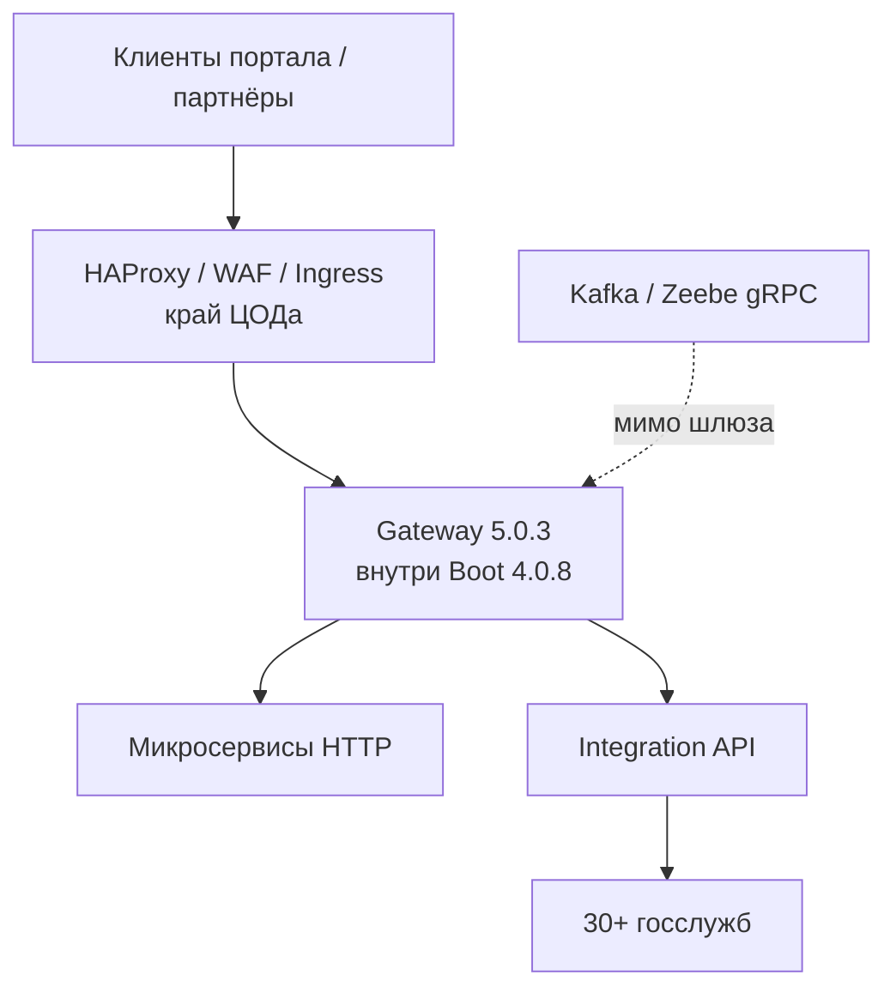
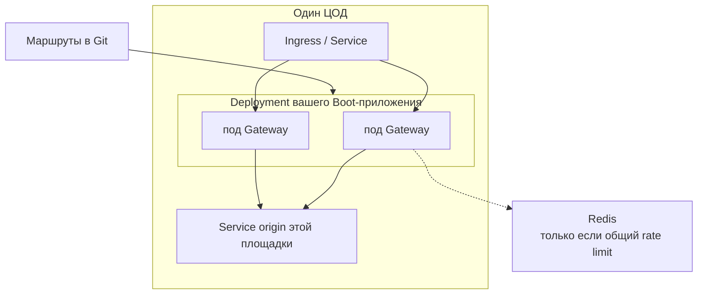
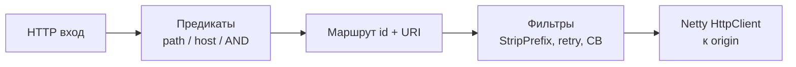
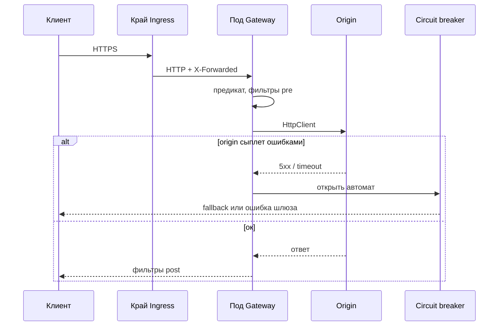
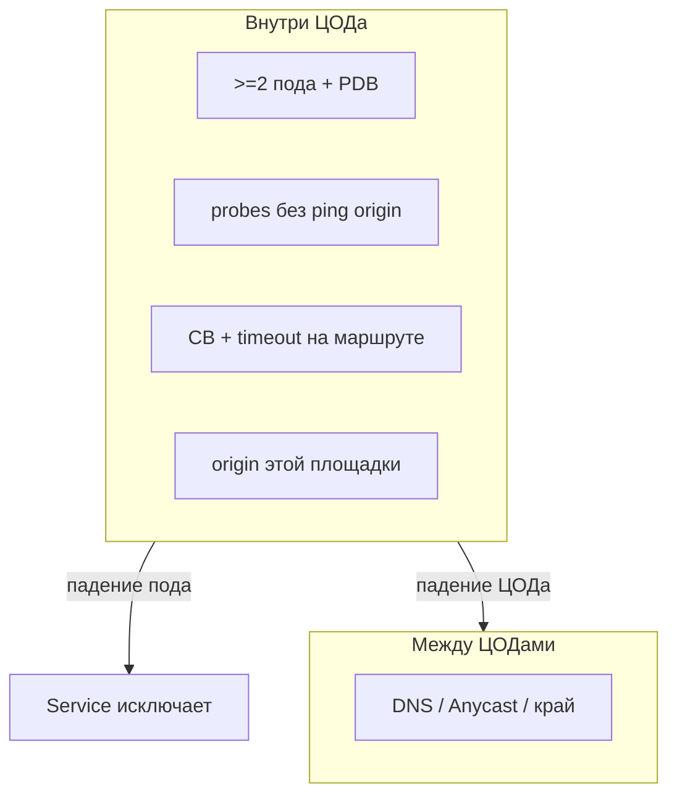
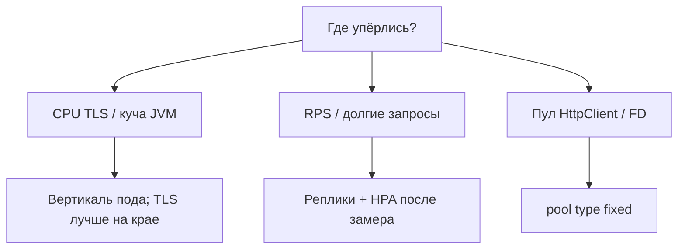
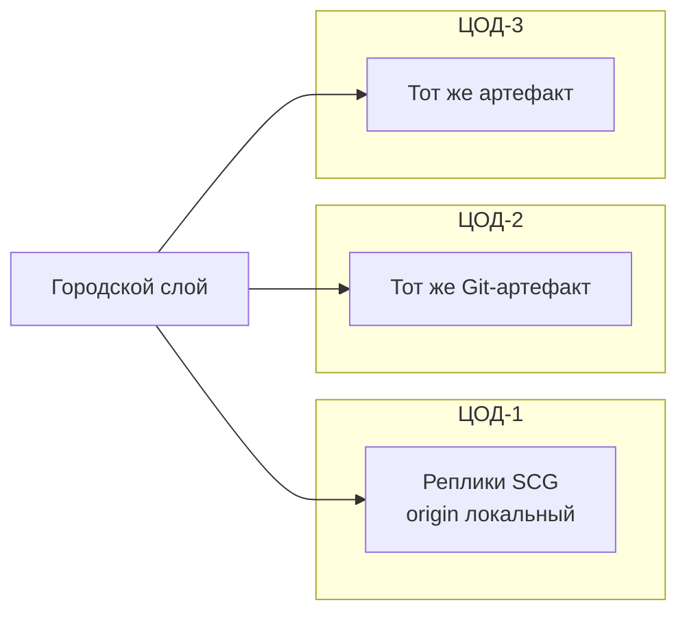

# Spring Cloud Gateway 5.0.3 — схемы устройства

Связанные документы: правила — `Spring Cloud Gateway.md`; установка — `Spring Cloud Gateway.install.md`.

C4 / «D4»: контекст → контейнеры → компоненты. Это **библиотека** в **вашем** Spring Boot **4.0.8** (поезд **2025.1.3** / Oakwood), не Helm-кластер «как Kafka».

Допущения: stretch сессии шлюза на 2–3 ЦОДа **нет** — реплики **stateless**, по Deployment **в каждом** ЦОДе. Не Ingress-контроллер и не Kafka. В **5.0.3** закрыт **CVE-2026-47879**. Нагрузки HTTP нет.

---

## 1. Контекст

Шлюз — **northbound HTTP**: маршруты к вашим сервисам. Исходящие вызовы к ведомствам делает интеграционное API, не Gateway.

Он **не** оркестрирует «какие ведомства дергать», **не** хранит досье и **не** читает Ingress-объекты Kubernetes. SecureHeaders и rate limit — не WAF.

Несколько независимых JVM с одним Git-конфигом. Согласованность маршрутов — Git/ConfigMap, не Raft.

---

## 2. Контейнеры (ваше приложение, не «кластер Gateway»)

Deployment, не StatefulSet. `topologySpread` / anti-affinity по зоне. Origin — **локальный**: «шлюз в ЦОД-1, API только в ЦОД-3» превращает чужой RTT в деградацию всего входа.

Городской VIP / Anycast — документ HAProxy, не фича библиотеки. Реплики сами IP между площадками **не** таскают.

Стартер прода: `spring-cloud-starter-gateway-server-webflux`. MVC — другой YAML и фильтры; оба стартера в одном процессе **нельзя**. Старый префикс `spring.cloud.gateway.routes` в 5.x **молча не биндится**.

---

## 3. Компоненты внутри процесса

| Компонент | Для чего настраивать |
|---|---|
| Route + predicates | Контракт входа. Path в `uri:` маршрута официально **игнорируется** |
| GatewayFilter | StripPrefix, заголовки, rate limit, circuit breaker, retry |
| GlobalFilter | На все маршруты: `lb://`, запись ответа |
| HttpClient pool | Дефолт `elastic`; в проде `fixed` + `max-connections` |
| Circuit breaker | Фильтр; реализация — Spring Cloud CircuitBreaker (Resilience4j из того же BOM) |
| Actuator `/actuator/gateway` | Дефолт запись **выключена**. `unrestricted` = менять маршруты на живую |

`discovery.locator` дефолт **выключен**. Включить «чтобы не писать YAML» = выставить в интернет все найденные Service. `lb://` — не магия Kubernetes: нужен LoadBalancer/DiscoveryClient **или** DNS Service `http://name.ns.svc`.

---

## 4. Поток запроса

Упал под — клиент на этом TCP получает обрыв; это норма HTTP-прокси. Retry на **GET** иногда уместен. Retry на **POST в ведомство** без идемпотентности = двойная заявка. Не копировать старые гайды TimeLimiter: в поезде 2025.1.3 дефолт factory **больше не используется**.

---

## 5. Отказоустойчивость — что настраивать

| Ручка | Если забыть |
|---|---|
| ≥2 реплики + PDB | Drain узла = нет входа |
| Readiness ≠ обязательный ping origin | Каскад рестартов, когда бэкенд тупит |
| `trusted-proxies` = IP края, не `.*` | Либо слепой IP, либо клиент подделывает XFF |
| Circuit breaker на критичном маршруте | Шлюз копит таймауты и жжёт пул |
| Redis HA, если общий лимит | 10 реплик Caffeine = квота ×10; падение Redis = дыра или 429 |
| Pin **5.0.3** | 5.0.2 и ниже линии — CVE-2026-47879 (SSRF / файлы на gRPC-пути) |

Один под на три ЦОДа отказоустойчивости **не даёт**. Шлюз в других залах о мёртвой площадке **не договаривается**.

---

## 6. Масштабируемость — что настраивать

«Терабайты озера» на размер шлюза почти не влияют. Влияют RPS, размер тела, число висящих запросов, retry (умножает нагрузку на origin). LocalResponseCache — RAM **пода**, не общее на три ЦОДа.

HPA без потолка пула даёт сто подов, которые вместе сносят origin. Цифр RPS у проекта Gateway **нет**.

---

## 7. 2–3 ЦОДа без stretch

**Сильное:** процесс почти stateless; отказ зоны переживается репликами в других ЦОДах, если край перестаёт слать на мёртвую.  
**Слабое:** ошибка GitOps = 404 или лишний путь **на всех** площадках сразу; общий Redis-лимитер — отдельная HA-задача; межЦОДовый origin проектом **не нормирован**.

---

## 8. Безопасность на той же картине

1. На мир — только публичные пути через край. Actuator, `/env`, heapdump — не с интернета. `/gateway` = `read-only` или выкл.
2. `RequestHeaderToRequestUri` — только доверенная среда, не публичный маршрут.
3. NetworkPolicy: шлюз → нужные Service; **запрет** шлюз → интернет (southbound у Integration API).
4. `use-insecure-trust-manager: false`. Wiretap Netty в проде **false**.
5. Не тащить 5.0.2.

Источники: `Spring Cloud Gateway.md`. Порога RTT «шлюз в чужой ЦОД» у Spring **нет** — на схемах межЦОДовый origin не целевой.
