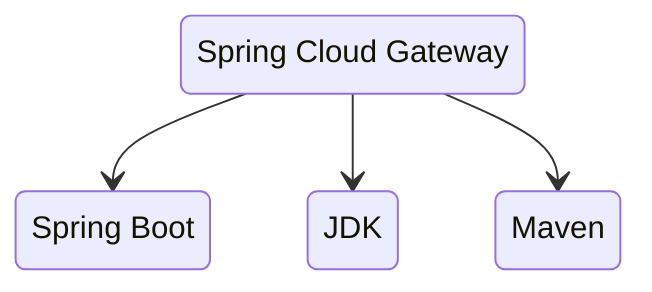
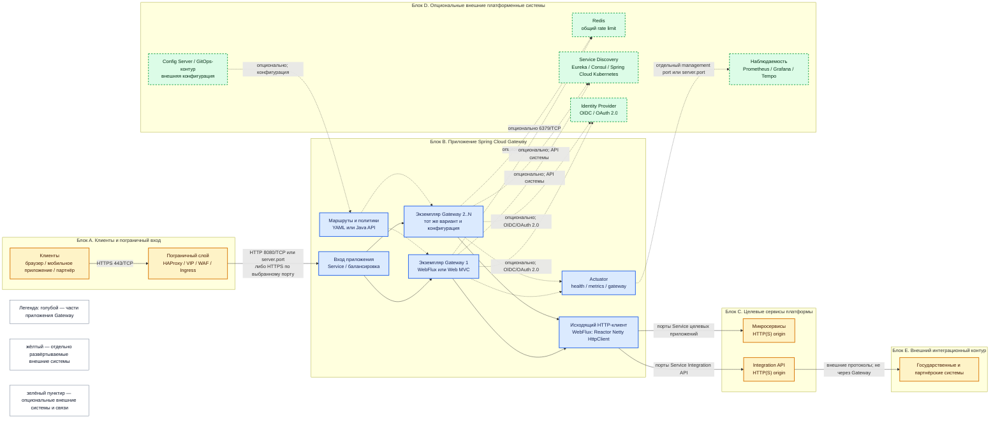

# Spring Cloud Gateway 5.0.3

Spring Cloud Gateway — HTTP-шлюз, реализованный как библиотека внутри Spring Boot-приложения. Он принимает HTTP(S)-запрос, выбирает маршрут и передаёт запрос целевому сервису, применяя политики к запросу и ответу. Это не готовый серверный продукт, не Ingress-контроллер и не отдельный кластер уровня Kafka.

Рассматриваемая версия — **Spring Cloud Gateway 5.0.3** из **Spring Cloud 2025.1.3 (Oakwood)**, основанного на **Spring Boot 4.0.8**. В 5.0.3 исправлена уязвимость **CVE-2026-47879**. Основной вариант документа — **Server WebFlux**; вариант **Server Web MVC** допустим как альтернатива, но имеет другой стартер, модель выполнения и пространство настроек. Одновременно включать оба варианта в одно приложение нельзя.

Официальная документация: https://docs.spring.io/spring-cloud-gateway/reference/

---

## Назначение системы

Spring Cloud Gateway образует управляемую точку входа в HTTP API платформы. Клиент обращается к одному внешнему адресу, а шлюз по пути, заголовкам и другим условиям выбирает внутренний сервис, преобразует запрос при необходимости и возвращает ответ клиенту.

В рассматриваемой платформе шлюз:

- принимает входящий трафик портала, мобильных клиентов и партнёрских систем после пограничного слоя;
- направляет запросы в микросервисы той же площадки или в Integration API;
- централизует маршрутизацию и технические политики HTTP;
- не хранит клиентские данные;
- не заменяет Kafka, Camunda, WAF, Ingress, балансировщик городского уровня или Integration API;
- не выполняет прямые обращения к государственным системам: это функция Integration API.

---

## Перечень функций

Ниже перечислены функции Server WebFlux. Для Server Web MVC основные идеи те же, но набор доступных фильтров, используемый HTTP-стек и имена настроек необходимо сверять с документацией MVC.

1. **Маршрутизация HTTP(S).** Маршрут содержит идентификатор, адрес назначения, условия выбора и цепочку преобразований. Если указано несколько условий, они совместно ограничивают выбор маршрута.
2. **Преобразование запроса и ответа.** Шлюз может менять путь, добавлять или удалять заголовки, ограничивать размер запроса, управлять CORS и добавлять типовые защитные HTTP-заголовки.
3. **Выбор экземпляра целевого сервиса.** Возможны фиксированный URI, DNS-имя Kubernetes Service либо схема `lb://` совместно со Spring Cloud LoadBalancer и реализацией Service Discovery. Последний вариант опционален.
4. **Автоматическое построение маршрутов из реестра сервисов.** Discovery Locator может создавать маршруты по данным Service Discovery. Он выключен по умолчанию и не является обязательной частью шлюза.
5. **Ограничение частоты запросов.** Request Rate Limiter реализует квоты. Общий счётчик для нескольких экземпляров может храниться в Redis; Redis нужен только при выбранной распределённой модели ограничения.
6. **Circuit Breaker и запасной ответ.** Интеграция, обычно с Resilience4j, прекращает обращения к нестабильному сервису на заданный период и может направить запрос в fallback.
7. **Повтор запроса.** Retry повторяет допустимые операции после выбранных ошибок. Для операций, изменяющих данные, повтор безопасен только при обеспеченной идемпотентности.
8. **Исходящие HTTP-соединения.** В Server WebFlux используется Reactor Netty HttpClient с пулом соединений и настройками времени ожидания. В Server Web MVC запросы обрабатываются на Servlet-стеке, поэтому детали транспорта отличаются.
9. **Операционный API.** Spring Boot Actuator может публиковать состояние и список маршрутов через `/actuator/gateway`. Доступ на изменение маршрутов — отдельная возможность, а не обязательная функция.
10. **Обработка заголовков прокси.** Forwarded и X-Forwarded передают сведения об исходном запросе через цепочку доверенных прокси.
11. **Локальный кэш HTTP-ответов.** В Server WebFlux Local Response Cache использует Caffeine и хранит данные отдельно в памяти каждого экземпляра.
12. **Proxy Exchange.** Отдельный модуль позволяет проксировать запрос из собственного контроллера. Это часть прикладного кода, а не основной механизм платформенного входа.

Шлюз не является хранилищем данных, брокером событий, BPMN-движком, WAF, Service Mesh или механизмом интеграции с ведомствами. Несколько экземпляров шлюза — независимые процессы без общего лидера и встроенного протокола согласования конфигурации.

---

## Основные элементы системы и зависимости

### Схема экземпляров и потоков

### Описание блоков схемы

#### Блок A. Клиенты и пограничный вход

- **Сущность:** клиенты API и цепочка систем, принимающих внешний трафик.
- **Технологии и варианты:** браузеры, мобильные приложения и серверные клиенты; HAProxy или иной балансировщик, городской VIP, WAF, Kubernetes Ingress либо Gateway API.
- **Назначение:** дать клиенту внешний адрес, завершить TLS там, где это принято архитектурой, отфильтровать сетевой и прикладной трафик и передать допустимый HTTP-запрос шлюзу.
- **Граница:** все элементы блока являются отдельными системами и не входят в Spring Cloud Gateway-приложение. Наличие конкретного HAProxy, WAF или Ingress определяется архитектурой площадки; схема не требует использовать их все одновременно.

#### Блок B. Приложение Spring Cloud Gateway

- **Сущность:** одно Spring Boot-приложение, запущенное в одном или нескольких независимых экземплярах.
- **Технологии и варианты:** **Server WebFlux** использует реактивный стек Spring WebFlux и Reactor Netty; **Server Web MVC** использует Spring MVC и Servlet-стек. Выбирается один вариант на приложение. Маршруты задаются конфигурацией или Java API соответствующего варианта.
- **Назначение:** выбрать маршрут, применить условия и фильтры, выполнить исходящий HTTP-запрос, получить ответ и вернуть его клиенту.
- **Граница:** экземпляры, маршруты, фильтры и исходящий HTTP-клиент — части Gateway-приложения. Kubernetes Service или иной балансировщик перед экземплярами развёртывается отдельно, хотя на схеме показан внутри логического блока входа приложения. Actuator — библиотечная часть приложения; система, которая собирает его метрики, внешняя.

#### Блок C. Целевые сервисы платформы

- **Сущность:** микросервисы бизнес-функций и отдельный Integration API.
- **Технологии и варианты:** любые HTTP(S)-сервисы с совместимым контрактом. Их реализация не обязана использовать Spring. Адрес назначения может быть фиксированным URI, DNS-именем Service или логическим именем `lb://`.
- **Назначение:** микросервисы исполняют бизнес-функции; Integration API изолирует логику и протоколы взаимодействия с внешними ведомствами.
- **Граница:** это отдельно развёрнутые приложения, не модули Spring Cloud Gateway. Шлюз не принимает на себя их бизнес-логику и хранилища.

#### Блок D. Опциональные внешние платформенные системы

- **Сущность:** дополнительные сервисы, подключаемые только при выбранной архитектурной функции.
- **Технологии и варианты:** Redis для распределённого ограничения частоты; Eureka, Consul или Spring Cloud Kubernetes для Service Discovery; Spring Cloud Config либо GitOps-контур для внешней конфигурации; OIDC/OAuth 2.0 Identity Provider для проверки идентичности; Prometheus, Grafana и Tempo для наблюдаемости.
- **Назначение:** дать нескольким экземплярам шлюза общий счётчик, разрешать логические имена сервисов, доставлять конфигурацию, проверять токены и собирать телеметрию.
- **Граница:** каждая позиция — отдельная система со своим жизненным циклом. **Ни Service Discovery, ни Config Server, ни Identity Provider, ни Redis не являются обязательными для запуска Gateway.** Их отсутствие заменяется соответственно фиксированным URI или DNS, локальной конфигурацией, иной моделью защиты и локальным либо внешним ограничением частоты.

#### Блок E. Внешний интеграционный контур

- **Сущность:** государственные, ведомственные и партнёрские информационные системы.
- **Технологии и варианты:** протоколы определяются Integration API и внешними контрактами; это могут быть HTTP(S), очереди, файловый обмен или специализированные адаптеры.
- **Назначение:** принимать и возвращать данные по внешним интеграционным контрактам.
- **Граница:** системы блока внешние для платформы. К ним обращается Integration API, а не Spring Cloud Gateway. Поэтому исходящий ведомственный поток не смешивается с входным потоком пользователей.

### Как подробно читать схему

1. Чтение основного синхронного запроса начинается слева. Клиент устанавливает HTTPS-соединение с пограничным слоем на **443/TCP**.
2. Пограничный слой передаёт запрос на вход приложения Gateway. На схеме показан типичный **8080/TCP**, но фактический порт определяется свойством `server.port`; при сквозном TLS это может быть выбранный HTTPS-порт.
3. Входной Service или балансировщик выбирает один экземпляр Gateway. Экземпляры равноправны: схема не содержит ведущего узла и не подразумевает общий процесс между ними.
4. Выбранный экземпляр сопоставляет запрос с маршрутами. Сплошные стрелки показывают основной поток запроса; пунктирные стрелки — конфигурационные, операционные или опциональные обращения.
5. После применения фильтров исходящий HTTP-клиент обращается либо к микросервису, либо к Integration API. Порт на этой связи задаётся целевым Service, поэтому у Gateway нет единого «исходящего порта».
6. Если запрос требует взаимодействия с ведомством, Gateway заканчивает свою роль на Integration API. Следующая стрелка идёт от Integration API к внешней системе и явно помечена «не через Gateway».
7. Redis участвует только тогда, когда выбран общий счётчик rate limit для нескольких экземпляров. Без Redis основной маршрут клиента к сервису остаётся работоспособной моделью.
8. Service Discovery нужен только для разрешения логических имён и `lb://`. При маршрутах на DNS-имена Kubernetes Service или фиксированные URI этот блок отсутствует.
9. Config Server или GitOps-контур — варианты доставки маршрутов, а не обязательная часть обработки каждого запроса. Маршруты также могут поставляться вместе с приложением.
10. Identity Provider показан пунктиром, потому что конкретная модель идентификации выбирается отдельно. Gateway может проверять токен локально по ключам либо использовать другую принятую схему защиты.
11. Actuator отдаёт служебные данные системе наблюдаемости. Он может использовать `server.port` либо отдельный management port; это не пользовательский API.
12. Цвет показывает границу владения: голубые узлы входят в приложение Gateway, жёлтые развёртываются независимо, зелёные также независимы и при этом опциональны.

### Что входит в состав

| Элемент | Назначение | Принадлежность |
|---|---|---|
| **Экземпляр Gateway** | Обработка входа, маршрутов и фильтров | Spring Boot-приложение; WebFlux или Web MVC |
| **Маршруты YAML / Java API** | Описывают условия, адрес назначения, порядок и фильтры | Конфигурация или код приложения |
| **Предикаты** | Определяют, подходит ли входящий запрос маршруту | Часть Gateway-приложения |
| **Фильтры** | Изменяют запрос/ответ и реализуют технические политики | Часть Gateway-приложения |
| **Исходящий HTTP-клиент** | Устанавливает соединение с целевым сервисом | Часть приложения; в WebFlux — Reactor Netty HttpClient |
| **Actuator endpoints** | Публикуют здоровье, метрики и сведения о маршрутах | Часть приложения при подключённом Actuator |
| **Proxy Exchange** | Проксирует из пользовательского контроллера | Опциональный модуль прикладного кода |
| **Пограничный слой, сервисы назначения и платформенные зависимости** | Дают внешний вход, выполняют бизнес-функции и предоставляют дополнительные возможности | Отдельно развёртываемые системы |

### Порты: сетевой контракт

У Spring Cloud Gateway нет обязательного набора портов продукта: приложение и его окружение задают сетевой контракт.

| Порт или направление | Назначение | Участники |
|---|---|---|
| **443/TCP** | Внешний HTTPS-вход | Клиент → пограничный слой; иногда пограничный слой → Gateway при сквозном TLS |
| **8080/TCP** или значение `server.port` | Типичный HTTP-вход приложения | Пограничный слой / Service → экземпляр Gateway |
| **Management port** или `server.port` | Actuator health, metrics и `/gateway` | Система наблюдаемости и операторы → Gateway |
| **Порты целевых Service** | Исходящие HTTP(S)-обращения | Gateway → микросервисы / Integration API |
| **6379/TCP**, опционально | Redis-команды распределённого rate limit | Gateway → Redis |
| **API-порты выбранных внешних систем** | Discovery, Config, Identity, телеметрия | Gateway → соответствующая система; только если она используется |

---

## Глоссарий

- **Actuator** — модуль Spring Boot со служебными HTTP-endpoint для здоровья, метрик и управления приложением.
- **API** — программный интерфейс, через который одна система вызывает функции другой.
- **BPMN** — графическая нотация описания исполняемых бизнес-процессов.
- **BOM (Bill of Materials)** — файл Maven, согласующий совместимые версии зависимостей Spring.
- **Camunda** — отдельная платформа исполнения и управления бизнес-процессами; Gateway её не заменяет.
- **Circuit Breaker** — автомат, временно прекращающий вызовы нестабильного сервиса после серии ошибок.
- **Config Server** — отдельный сервер, который выдаёт приложениям внешнюю конфигурацию.
- **CORS** — браузерные правила доступа к API с веб-страницы другого источника.
- **CVE** — идентификатор публично зарегистрированной уязвимости программного обеспечения.
- **Discovery Locator** — функция Gateway, автоматически создающая маршруты из записей Service Discovery.
- **DNS** — механизм преобразования имени сервиса в сетевой адрес.
- **Endpoint** — доступная по сети точка API с определённым адресом и назначением.
- **Fallback** — запасной ответ или обработчик, используемый при недоступности основного назначения.
- **Filter / фильтр** — обработчик, который меняет запрос или ответ либо применяет техническую политику маршрута.
- **Forwarded / X-Forwarded** — HTTP-заголовки с исходной схемой, адресом и IP клиента, прошедшего через прокси.
- **Gateway API** — набор объектов Kubernetes для публикации и маршрутизации сетевого трафика.
- **GitOps** — доставка конфигурации и изменений из Git автоматизированным контуром.
- **HAProxy** — отдельный программный балансировщик и прокси для TCP- и HTTP-трафика.
- **HTTP(S)** — протокол обмена запросами и ответами; HTTPS означает HTTP поверх TLS.
- **Идемпотентность** — свойство операции, при котором безопасный повтор не создаёт дополнительного бизнес-эффекта.
- **Identity Provider (IdP)** — отдельная система, выпускающая или подтверждающая данные идентификации.
- **Ingress** — объект и контроллер Kubernetes, публикующие HTTP(S)-сервисы за пределами кластера.
- **Instance / экземпляр** — отдельно запущенный процесс одного и того же приложения.
- **Integration API** — внутреннее приложение платформы, инкапсулирующее обращения к внешним ведомствам и партнёрам.
- **JVM** — процесс виртуальной машины Java, внутри которого работает Spring Boot-приложение.
- **Kafka** — отдельный распределённый брокер событий; Gateway не выполняет его функции.
- **Kubernetes** — платформа управления контейнерными приложениями.
- **Kubernetes Service** — стабильное сетевое имя и виртуальный адрес для группы экземпляров приложения в Kubernetes.
- **Local Response Cache / Caffeine** — кэш HTTP-ответов в памяти одного экземпляра приложения.
- **Load Balancer / балансировщик** — компонент, выбирающий один из доступных экземпляров для обработки запроса.
- **Management port** — выделенный сетевой порт для служебных endpoint приложения.
- **Netty / Reactor Netty** — неблокирующий сетевой стек, используемый вариантом Server WebFlux.
- **Northbound** — направление входящих запросов от пользователей и клиентских систем к платформе.
- **Наблюдаемость** — получение метрик, журналов и трассировок для понимания состояния системы.
- **OAuth 2.0 / OIDC** — протоколы авторизации и идентификации на основе токенов.
- **Origin** — целевой HTTP-сервис, которому Gateway передаёт запрос.
- **Predicate / предикат** — условие выбора маршрута, например путь, метод или заголовок.
- **Пул соединений** — повторно используемый набор сетевых соединений к целевым сервисам.
- **Proxy / прокси** — посредник, принимающий сетевой запрос и передающий его другому сервису.
- **Квота** — допустимое число запросов для выбранного клиента или ключа за период.
- **Реактивный стек** — модель неблокирующей обработки, в которой ожидание ввода-вывода не удерживает отдельный поток на каждый запрос.
- **Rate limit** — ограничение количества запросов за период для выбранного клиента или ключа.
- **Redis** — отдельное сетевое хранилище, которое Gateway может использовать для общего счётчика rate limit.
- **Resilience4j** — Java-библиотека шаблонов устойчивости, включая Circuit Breaker.
- **Retry** — повтор запроса после определённой ошибки.
- **Route / маршрут** — правило, связывающее входящий запрос, условия выбора, фильтры и адрес назначения.
- **Servlet-стек** — модель обработки HTTP-запросов Java Servlet, используемая вариантом Server Web MVC.
- **Server WebFlux** — вариант Spring Cloud Gateway на реактивном Spring WebFlux и Reactor Netty.
- **Server Web MVC** — вариант Spring Cloud Gateway на Spring MVC и Servlet-стеке.
- **Service Discovery** — механизм регистрации сервисов и получения адресов их экземпляров по логическому имени.
- **Service Mesh** — отдельный инфраструктурный слой управления межсервисным трафиком.
- **Spring Boot** — основа Java-приложения, которая собирает конфигурацию, веб-сервер и подключённые библиотеки.
- **Spring Cloud Gateway** — библиотека маршрутизации и проксирования HTTP-запросов внутри Spring Boot-приложения.
- **Spring Cloud LoadBalancer** — библиотека выбора одного экземпляра сервиса для адресов вида `lb://`.
- **SSRF** — класс уязвимостей, при котором атакующий заставляет сервер обращаться к непредусмотренному адресу.
- **Southbound** — направление от платформы к внешним ведомственным и партнёрским системам.
- **TCP** — транспортный сетевой протокол; номер TCP-порта определяет сетевую точку подключения.
- **Телеметрия** — автоматически собираемые метрики и трассировки работы приложения.
- **TLS** — шифрование и проверка стороны для сетевого соединения.
- **Token bucket** — алгоритм rate limit, расходующий на каждый запрос условный токен из пополняемого запаса.
- **URI** — адрес ресурса или сервиса, используемый маршрутом как назначение.
- **VIP** — виртуальный IP-адрес, за которым пограничный балансировщик публикует сервис.
- **WAF** — отдельный межсетевой экран, анализирующий HTTP-трафик на прикладные атаки.
- **YAML** — текстовый формат конфигурации маршрутов и параметров приложения.
- **`lb://`** — схема URI Spring Cloud, означающая выбор экземпляра сервиса через LoadBalancer.

---

## Источники

- Релиз Spring Cloud 2025.1.3, Spring Boot 4.0.8, Gateway 5.0.3 и CVE-2026-47879: https://spring.io/blog/2026/08/20/spring-cloud-2025-1-3-has-been-released
- Матрица совместимости Spring Cloud: https://spring.io/projects/spring-cloud
- Обзор Server WebFlux, Server Web MVC и Proxy Exchange: https://docs.spring.io/spring-cloud-gateway/reference/
- Работа Server WebFlux: https://docs.spring.io/spring-cloud-gateway/reference/spring-cloud-gateway-server-webflux/how-it-works.html
- Конфигурация Server WebFlux 5.x: https://docs.spring.io/spring-cloud-gateway/reference/spring-cloud-gateway-server-webflux/configuration.html
- Свойства версии 5.0.3: https://docs.spring.io/spring-cloud-gateway/reference/5.0.3/appendix.html
- Actuator API Gateway: https://docs.spring.io/spring-cloud-gateway/reference/spring-cloud-gateway-server-webflux/actuator-api.html
- Request Rate Limiter: https://docs.spring.io/spring-cloud-gateway/reference/spring-cloud-gateway-server-webflux/gatewayfilter-factories/requestratelimiter-factory.html
- Global Filters, LoadBalancer и Local Response Cache: https://docs.spring.io/spring-cloud-gateway/reference/spring-cloud-gateway-server-webflux/global-filters.html
- Заголовки Forwarded и X-Forwarded: https://docs.spring.io/spring-cloud-gateway/reference/spring-cloud-gateway-server-webflux/httpheadersfilters.html
- Релиз Gateway 5.0.3: https://github.com/spring-cloud/spring-cloud-gateway/releases/tag/v5.0.3
