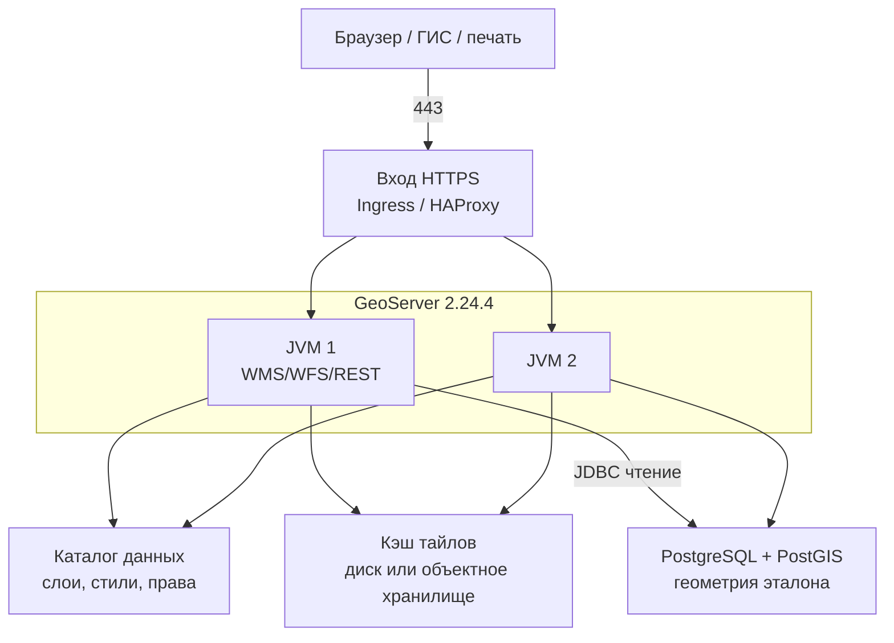

# GeoServer 2.24.4 — развёртывание и настройка

GeoServer — сервер картографических протоколов OGC: картинка карты (WMS), объекты (WFS), готовые квадратики тайлов (WMTS). Этот документ про **классический** GeoServer **2.24.4** (последний патч линии 2.24.x; релиз **18 июня 2024**, вместе с GeoTools 30.4 и GeoWebCache 1.24.4). Это не GeoServer Cloud (микросервисы и другой Helm) и не платформа GeoData ООО «АйТи Гео».

Документация линии: https://docs-archive.geoserver.org/2.24.x/en/user/  
Скачивание: https://geoserver.org/release/2.24.4/  
Официальный контейнер: `docker.osgeo.org/geoserver`. Для боя **не** тег `2.24.x` (в руководстве 2.24 это nightly), а **конкретный патч `2.24.4`**, если он есть в реестре OSGeo; иначе — свой образ из **WAR 2.24.4** на Tomcat 9.

**Критично по версии.** По расписанию проекта линия **2.24.x**: stable сентябрь 2023, maintenance апрель 2024, **конец жизни — август 2024**. На дату подготовки этого файла (август 2026) линейка **два года без официальных патчей**. 2.24.4 закрывал в том числе **CVE-2024-36401 (удалённый запуск кода, Critical)**. Всё, что нашли **после** июня 2024, в 2.24.x проект **не чинит**. Документ описывает **запрошенную** версию; считать её готовой к бою с гособменом без отдельного решения ИБ **нельзя**.

Этот текст — не набор команд «скопируй docker run», а правила, без которых система не будет одновременно устойчивой к сбоям, масштабируемой и безопасной. Пошаговая установка — в `GeoServer.install.md`.

---

## Назначение системы

GeoServer нужен, чтобы **отдать геометрию стандартными протоколами**: «нарисуй карту», «отдай объекты», «отдай тайл». Руководитель или сервис открывает слой «земельные участки» / «охранные зоны», не таща терабайты JSON в браузер.

Система **публикует то, что лежит в хранилище** (обычно PostgreSQL с PostGIS). Она **не** хранит эталон контуров, **не** заменяет очередь событий, **не** исполняет бизнес-процессы и **не** ходит в государственные сервисы. Упал PostGIS — карта пустая при живом интерфейсе.

Нечестная роль: «положим эталон только в файл внутри каталога GeoServer и размножим три зала». Файловое хранилище на сетевой папке между площадками и три писателя каталога — это гонка, не устойчивость.

---

## Перечень функций

Что умеет классический GeoServer 2.24:

1. **Отдавать картинку карты** (WMS): слои, область, стиль. Тяжёлая нагрузка на CPU и память, особенно на растрах.
2. **Отдавать объекты** (WFS) в GML/GeoJSON. Чтение. Запись (WFS-T) в бою часто **выключают**.
3. **Отдавать покрытие/растр** (WCS) — сетку значений, не картинку для глаз.
4. **Отдавать готовые тайлы** (WMTS и родственники) через встроенный **GeoWebCache**, чтобы не рисовать WMS на каждый сдвиг карты.
5. **Считать на сервере** (WPS: буфер, пересечение). Состояние заданий между нодами **не** общее без отдельного расширения.
6. **Вести каталог**: рабочие области, подключения к данным, слои, стили. В классическом GeoServer это XML-файлы в **каталоге данных** на диске.
7. **Ограничивать доступ** к слоям (своя подсистема пользователей). Keycloak из коробки нет (есть экспериментальные модули).
8. **Ставить расширения** в каталог библиотек: лимиты параллельных запросов (control-flow), тайлы в объектное хранилище (gwc-s3) и другие. Набор должен быть **одинаковым** на всех нодах и **той же** мелкой версии, что сервер.

Чего система **не** делает и часто путают: она не озеро эталона, не шина событий, не Camunda, не GeoData, не кворум «пережили площадку сами». Несколько копий за балансировщиком переживают падение **пода**, не падение **единственного PostGIS**. Официального оператора Kubernetes для WAR 2.24 нет. ГОСТ-криптографии нет. Терабайты живут в PostGIS и файлах, GeoServer держит **рабочий набор** (память, соединения, тайлы). Реплики подов бэкап каталога не заменяют.

---

## Требования к развёртыванию

### Требования к ПО

| Что | Что ставить | Комментарий |
|---|---|---|
| **Формат поставки** | Контейнер OSGeo **или** WAR на Tomcat | Образ `docker.osgeo.org/geoserver`. Для боя пин **2.24.4**, не nightly `2.24.x`. Windows installer есть на странице релиза — для **сервера в схеме с Kubernetes не основной путь** |
| **Kubernetes** | Не штатный инсталлятор WAR 2.24 | Нет официального оператора. Целевой примитив — Deployment/StatefulSet + вход + диск. Чужие Helm «geoserver» этим файлом не сертифицируются. GeoServer Cloud — **другой** продукт |
| **ОС** | Linux x86_64 (контейнер / Tomcat) | Основной контур. **Боевой GeoServer на Windows-хосте в схеме с Kubernetes не предполагается.** Установщик Windows — для знакомства на ПК, не эта схема |
| **Java** | **11** как опорный runtime линии 2.24 | Java 17 в руководстве 2.24 — *только экспериментально*. Свой «новейший 21» — за пределами официальной таблицы 2.24 |
| **Контейнер сервлетов** | Tomcat **8.5 или 9** | Tomcat 10+ (другое пространство имён Jakarta) — **не** тот WAR. Jetty — из bin-сборки |
| **Хранилище объектов** | Обычно PostgreSQL + PostGIS | Это **другое ПО**. Учётка для GeoServer в бою — **только чтение**, если запись идёт вашими сервисами |
| **Каталог данных** | Внешний каталог (`GEOSERVER_DATA_DIR`) | Поставщик прямо: в бою **настоятельно рекомендуется**. В Docker 2.24 пример точки монтирования: `/opt/geoserver_data` |
| **Часы** | NTP | Иначе отладка и сертификаты живут в кривой вселенной |
| **Лицензия** | GPL | Для закрытого контура — условия распространения правок, не license-server. Не Apache 2.0 |

### Требования к ресурсам

Цифр «сколько ядер на ваши терабайты озера» у проекта **нет** — нагрузки в исходном запросе не было. Ниже только то, что есть в документации 2.24, не смета закупки.

| Что | Ориентир из документации | Комментарий |
|---|---|---|
| **Пример команд JVM** | `-Xms128m`, `-Xmx756M` | Это **иллюстрация синтаксиса**, не размер боя |
| **Куч по умолчанию** | Часто **¼ оперативной памяти** хоста | Задать **явно** (`-Xms` / `-Xmx` по смыслу равны), иначе сюрприз при нагрузке |
| **Сборщик** | **G1**, если куча **≥ 6 ГиБ** и нагрузка постоянная | Не включать несколько сборщиков сразу |
| **Параллельные GetMap** | Пик около **2 × число ядер** на **один** инстанс (модуль control-flow, локальные данные) | Стартовая формула лимита, не ваша смета. Пример в доке — на **4 ядра** |
| **Вектор (WFS)** | Лишняя память скорость почти не растит | Упирается в индексы PostGIS и лимит числа объектов |
| **Растр** | Память + кэш тайлов + пирамиды на диске | Не 200 мелких GeoTIFF без обзоров |
| **Диск каталога и тайлов** | Локальный SSD или объектное хранилище | Общая сетевая папка как каталог на несколько залов без замера — лотерея блокировок |

Дополнительно:

- Лимит памяти пода Kubernetes должен быть **выше** кучи Java: нативные библиотеки отрисовки и кэш тайлов живут рядом.
- Тайлы можно пересчитать; каталог слоёв — нет. Бэкап: каталог данных + PostGIS.
- На тестовой песочнице 512 МиБ–1 ГиБ кучи часто хватает. В бой это не переносить как «официальный минимум».

---

## Основные элементы системы и зависимости

Это **одно** Java-приложение в контейнере сервлетов. Ниже — те роли и соседние процессы, которые живут отдельными инстансами.

### Схема инстансов и потоков

Как читать схему:

1. Клиенты ходят на **443**. Сам GeoServer в примерах слушает **8080**. Между нодами GeoServer **нет** своего бинарного кластерного протокола в ядре: «кластер» — несколько одинаковых JVM за общим входом.
2. Каждая нода **сама** ходит в PostGIS и к файлам/объектке. Шина сообщений экспериментального кластера каталога **данные слоёв не возит**.
3. Каталог (список слоёв) должен быть **одной правдой**. Три независимых каталога = три разных карты. Общий каталог на сетевой папке через город без замера даёт битый XML, не устойчивость.
4. Кэш тайлов: свой каталог на каждом поде = клиент «мигает» (то старый тайл, то промах). Для боя — **общее** хранилище или смириться с холодным кэшем после смены ноды.
5. Админка (`/geoserver/web`) — люди правят слои. На всех нодах сразу — риск разъезда каталога. Часто админку на читающих нодах **выключают**.

Рядом, но это уже другое ПО: PostgreSQL/PostGIS, объектное хранилище тайлов, Ingress/HAProxy, озеро эталона. GeoData (IT Geo) — другой стек.

### Что входит в состав

| Роль | Зачем | Как масштабируется |
|---|---|---|
| **OGC-сервисы** | Карта и объекты клиентам | Несколько одинаковых JVM за балансировщиком, если каталог и данные общие |
| **Админка и REST** | Менять слои и права | Обычно **один** писатель конфига |
| **GeoWebCache** | Тайлы | Чтение масштабируется общим хранилищем тайлов |
| **Подсистема прав** | Кто видит слой | Конфиг в каталоге данных |
| **Расширения** | Лимиты, S3-тайлы, WPS, … | Одинаковый набор на все ноды |

### Официальные порты (контракт сети)

| Порт | Назначение |
|---|---|
| **8080/TCP** | HTTP приложения в официальном Docker (`/geoserver`). Снаружи обычно **443** |
| **8009** и хвосты AJP | Не открывать наружу |
| **8443** | Если включили HTTPS **внутри** контейнера — проверить на теге 2.24.4 |

UDP нет. Балансировщик HTTP(S) перед нодами — штатная схема из production-документации.

### Зависимости окружения

- Сеть до хранилища: JDBC к PostGIS, пути к GeoTIFF, объектка.
- В Kubernetes: для **нескольких** реплик с общим каталогом нужен диск, который можно отдать нескольким подам сразу. Диск «только одному» + три реплики = не стартуют или портят конфиг. Либо 1 реплика, либо каталог вынесен иначе, либо свой диск на под (тогда нужен другой способ синка).
- TLS обычно на входе, не внутри контейнера. Cookie сессии в бою: флаг **Secure**.
- Бэкап: каталог данных + файлы прав + PostGIS. Тайлы можно пересчитать.

---

## Краткие вводные

### Как устроена отказоустойчивость

В ядре **нет** выборов лидера и кворума. «Кластер» — несколько узлов за общим прокси, один публичный базовый URL, **одна** правда каталога.

**1) Процесс (JVM / под)**

| Что падает | Что происходит |
|---|---|
| Один под из нескольких за входом | Остальные отдают карту, если хранилище жив |
| Все поды в одном дата-центре | Падение площадки = нет карты, даже если PostGIS в других залах |
| Единственный под | Любой рестарт = простой. Это стенд, не бой |

**2) Каталог**

Официальная формулировка проблемы: *the challenge is management of changes to the data directory*. Пока это не решено, «три реплики» — три разных сервера с риском трёх каталогов.

| Схема | Живой узел | Слабое место |
|---|---|---|
| Один каталог на одном поде | Просто | Потеря диска = потеря публикации слоёв |
| Общий каталог на все ноды | Все видят одни XML | Блокировки файлов, задержка, «кто последний записал» |
| Писатель один, остальные копия | Читатели стабильны | Выкат конфига = процедура |
| Экспериментальные JMS / каталог в СУБД | Конфиг едет иначе; **данные слоёв — нет** | Не стабильный релиз; после конца жизни 2.24 патчей нет |

**3) Данные слоёв**

PostGIS/файлы/объектка должны быть доступны **каждой** ноде сами. Устойчивость PostGIS — отдельный проект.

**4) Тайлы**

Свой каталог на каждом поде = мигание. Общее хранилище (диск в пределах зала или расширение gwc-s3 из стабильного списка). Тайлы не заменяют бэкап каталога.

**5) Админка**

Падение UI ≠ падение карты, если ноды уже сконфигурированы. Один писатель конфига — точка отказа **изменения** слоёв, не обязательно чтения.

### Как устроено масштабирование

Несколько независимых осей:

1. **Больше одновременных картинок карты** → больше JVM **и** лимиты control-flow (иначе нехватка памяти). Ориентир модуля: ~**2 × ядер** параллельных GetMap **на инстанс**.
2. **Карта как подложка** → кэш тайлов (предрасчёт). Это главный рычаг WMS, не «ещё 64 ГиБ кучи».
3. **Больше объектов WFS** → лимиты числа объектов и индексы PostGIS, не раздувание кучи.
4. **Больше растра** → куча + кэш тайлов + пирамиды на диске.
5. **Десятки тысяч слоёв** → XML-каталог на диске уже некомфортен; в документации для этого фигурирует экспериментальный каталог в СУБД.

Цифр «ядер под терабайты» нет.

### Безопасность самого GeoServer

Компрометация с заводским `admin` / `geoserver` = полный каталог слоёв, часто **учётки JDBC** в подключениях, возможность записи через WFS, если не выключили. Для контура с геометрией клиентов это утечка персональных и пространственных данных.

- Дефолт админки: **`admin` / `geoserver`**. Сменить до любого входа наружу. В README образа — сменить также пароль хранилища ключей (проверить на теге 2.24.4).
- 2.24.4 закрывал RCE и сопутствующие дыры; линейка после конца жизни новые дыры **не получает**.
- WFS «только чтение»: уровень сервиса без транзакций + учётка базы только на чтение.
- Разбор XML: по умолчанию внешние http/https **не ограничены**. Для боя — белый список. Галочка «без ограничений» **снимает** защиту.
- Не светить переменные окружения на странице статуса (в 2.24.4 чинили утечку).
- CSRF: не выключать «чтобы интерфейс заработал за прокси»; задать белый список доменов.
- CORS в примерах Tomcat — любой сайт. Для закрытого контура нужен явный адрес вашего UI.
- HSTS по умолчанию **выключен**. Сессия: HttpOnly есть; **Secure в бою включить**.
- Админку в бою часто выключают, REST — из внутренней сети.
- Сэмплы вроде `topp:states` снять.
- «Поднять docker на 8080 и выдать в интернет» — это новый WFS ко всему каталогу, не ГИС-платформа.

---

## Допущения

Ниже то, чего не было в исходном запросе, но без чего нельзя нарисовать конкретную схему. Если допущение неверно — схему надо пересмотреть.

1. Берём **классический 2.24.4** (WAR/Docker OSGeo), не Cloud и не Enterprise.
2. Бой крутится в Kubernetes, но **официального оператора под WAR 2.24 нет**.
3. Три дата-центра = три независимых отказа. Если это три зала с одним дисковым массивом и одним PostGIS без копии — схема врёт.
4. Цель отказа по карте: пережить 1 дата-центр с нодами GeoServer, **если** PostGIS и каталог этот зал тоже переживают.
5. Нагрузки (запросы в секунду, размер растра, число слоёв) нет — нет цифры «N реплик и M кучи».
6. Формального круглосуточного обещания нет. Живая картинка ≠ «тайл обновился сразу после кадастровой сделки».
7. Основное хранилище — PostGIS. Растры — отдельно, если появятся.
8. Запись через WFS в бою выключена; геометрию пишут ваши сервисы в озеро/БД.
9. Люди в бою — не общий `admin`. Штатного Keycloak в стабильном 2.24 нет.
10. Шифрование канала — TLS на входе. ГОСТ не озвучен.
11. Учебный стенд изолирован. Дефолтный пароль — только пока порт не уходит дальше ноутбука.
12. Экспериментальные модули кластера в бою не считаются «официальной устойчивостью».
13. Лицензия GPL. Юристы — отдельно.
14. Заказчик сознательно остаётся на линейке с закончившейся жизнью. Иначе целевая поддерживаемая линия на август 2026 — другой документ (текущие Stable/Maintenance на geoserver.org).

---

## Критически важные условия, которых нет в исходном контексте

Их нужно закрыть **до** «накрутили три реплики».

| Пробел | Почему это ломает решение |
|---|---|
| **Конец жизни 2.24 + ИБ** | Два года без патчей на контуре с геометрией. Это не «мелочь версии» |
| **Что публикуем** | Разные лимиты, права слоёв, кэш, персональные данные. «Терабайты» без состава — не смета кучи |
| **Где живёт геометрия** | Устойчивость карты = устойчивость этого хранилища |
| **Один Kubernetes на три площадки или три** | Общий диск и JDBC на три зала требуют сети и блокировок. Иначе — актив в одном зале + восстановление |
| **Задержка до каталога и до PostGIS между залами** | Каталог на «общей папке через город» даёт таймауты и битый XML. Порога в доке **нет** |
| **Нужен ли живой синк каталога** или достаточно выката раз в день | От этого зависит схема каталога |
| **Тайлы: пересчитывать или хранить** | Без общего кэша три ноды = три правды картинки |
| **Кто ходит в админку** | Публичный `/web` с `admin`/`geoserver` — инцидент |
| **Нужен ли WPS** | Состояние заданий между нодами не общее без отдельных расширений |
| **Есть ли тег 2.24.4 в реестре OSGeo** | Документация 2.24 показывает nightly. Наличие патч-тега надо **проверить** |
| **Какая Java внутри образа 2.24.4** | Актуальный Dockerfile репозитория docker (2026) для линейки 2.x указывает JDK 17. Для **конкретного** 2.24.4 смотреть слои. Java 17 в руководстве 2.24 — экспериментально |

---

## Краткое описание ключевых этапов и элементов развертывания

Общий каркас (и тест, и бой):

1. Зафиксировать **2.24.4** (WAR + те же zip расширений). Не смешивать патчи, не ставить экспериментальный JAR с nightly на release WAR.
2. Вынести каталог данных наружу приложения.
3. Сменить **admin** (и пароль хранилища ключей, если дистрибутив его показывает). Снять учебные слои.
4. Поставить **control-flow** и лимиты WMS/WFS **до** боевого трафика.
5. Настроить публичный базовый URL **до** раздачи Capabilities клиентам.
6. Подключение: PostGIS с учёткой только на чтение; WFS без транзакций, если записи через GeoServer нет.
7. Метрики: куча, задержка GetMap, очередь лимитов, JDBC, размер кэша тайлов, ошибки входа.
8. Прогнать Capabilities / GetMap / GetFeature. URL в XML — внешние, не внутренний адрес пода.
9. Только потом — вторая нода, общее хранилище тайлов, права слоёв, выключение админки.

Боевая схема на несколько дата-центров — в `GeoServer.install.md`. Ниже — только учебный стенд.

---

### 1 инстанс: тестовый стенд, 1 площадка, без нагрузки

**Цель стенда:** слой из PostGIS, стиль, WMS/WFS, понять Capabilities. **Не** цель: доказать отказ дата-центра и ёмкость тайлов.

Официальный быстрый путь (руководство 2.24, Docker) показывает тег **`2.24.x`** — это **nightly**, *не для боя*. На стенде допустимо «пощупать»; для препрода — **2.24.4**.

Свой каталог (чтобы пережить пересоздание контейнера) монтируют в `/opt/geoserver_data`. Пустой каталог **заполнится учебными данными**. В бой их уносят.

На Kubernetes: Deployment **1** реплика, диск только этому поду, вход в изолированном пространстве имён. Не копировать «три реплики» с этого YAML в бой.

#### Что сознательно упрощаем

| Параметр | На тесте | Почему можно |
|---|---|---|
| Число нод | 1 | Нет требования пережить выкат |
| Каталог | локальный диск / один том | Не учим блокировки сетевой папки |
| Кэш тайлов | локальный | Нет «карты на 10 тысяч клиентов» |
| Сертификаты | HTTP / самоподписанные | Иначе PKI раньше стилей |
| Пароль | сменить с `geoserver`, сеть изолирована | Заводской пароль в доке открытым текстом |
| Экспериментальный кластер | не ставить | Иначе отладка шины вместо GetMap |

#### Чего на тесте **не** стоит упрощать

- Слой живёт в **хранилище**, не «в GeoServer». Удалите PostGIS — карта умрёт при живом поде.
- Публичный базовый URL, если уже есть вход: иначе клиент ходит на внутренний адрес.
- Версия плагина = версия сервера.
- Nightly `2.24.x` **не** есть «почти 2.24.4».

#### Сильные стороны такой схемы

- Совпадает с официальным Docker-быстрым стартом 2.24.
- Дешево показывает стиль и шум GetMap на *вашей* геометрии.
- Один процесс — проще читать журнал в каталоге данных.

#### Слабые стороны (обязательно понимать)

- Нет модели отказа площадки, нет общего кэша, нет доказанной ёмкости.
- Успешная карта на одном поде **не** доказывает общий диск через город.
- Заводской пароль и учебные слои приучают «так и в бою».
- Конец жизни линейки: даже стенд не стоит выставлять в корпоративную сеть без фильтра — удалённый запуск кода в линейке уже был, новые дыры не закроют.

Практическая рекомендация: препрод = **2.24.4** + внешний каталог + control-flow + PostGIS + вход с TLS, **две** реплики уже с выбранной схемой каталога, даже без боевого трафика. Всё **в одном** дата-центре.

---

## Сводка: что считать «экземпляр готов»

| Требование | Тест (1 площадка) | Бой |
|---|---|---|
| Отказоустойчивость | Не требуется | Не меньше двух нод **и** живые хранилище + каталог; бэкап каталога и PostGIS с учебной восстановкой. Схема на 2–3 дата-центра — в `GeoServer.install.md` |
| Производительность / масштаб | Не требуется | Лимиты запросов; кэш тайлов на общем хранилище; куча с замера (растр ≠ вектор); рост **подов**, не «один гигантский Tomcat» |
| Безопасность | Изоляция; пароль не заводской, как только есть сеть | Только 2.24.4; нет учебных слоёв; нет записи через WFS; JDBC только чтение; TLS; CSRF-список; белый список XML; админка не в интернет |

**Не готов к бою**, если: тег nightly `2.24.x`; пароль `geoserver`; учебные слои; один под; три реплики на диске «только одному»; запись через WFS «на всякий случай»; JDBC с записью в эталон; CORS любой сайт; CSRF выключен; XML без ограничений; общий каталог через город без замера; экспериментальный JAR с nightly; карта назначена эталоном вместо озера; линейка 2.24 принята в аттестованный контур **без** фиксации риска конца жизни.

---

## Источники (чтобы не принимать на веру)

- Релиз 2.24.4, CVE-2024-36401: https://geoserver.org/release/2.24.4/
- Конец жизни / Java 11 / Tomcat 8.5–9: https://github.com/geoserver/geoserver/wiki/Release-Schedule
- Руководство 2.24 (архив): https://docs-archive.geoserver.org/2.24.x/en/user/
- Java 11 vs 17: https://docs-archive.geoserver.org/2.24.x/en/user/production/java.html
- JVM, контейнер: https://docs-archive.geoserver.org/2.24.x/en/user/production/container.html
- Боевые настройки, WFS, XML, админка: https://docs-archive.geoserver.org/2.24.x/en/user/production/config.html
- Кластер = ноды за прокси: https://docs-archive.geoserver.org/2.24.x/en/user/production/misc.html
- Docker 2.24 (nightly `2.24.x`): https://docs-archive.geoserver.org/2.24.x/en/user/installation/docker.html
- Дефолт `admin` / `geoserver`: https://docs.geoserver.org/2.24.x/en/user/gettingstarted/web-admin-quickstart/index.html
- Control-flow (ориентир 2×CPU): https://docs-archive.geoserver.org/2.24.x/en/user/extensions/controlflow/index.html
- GeoServer Cloud (другой продукт): https://geoserver.org/geoserver-cloud/deploy/kubernetes/

Утверждения вида «GeoServer сам переживёт два дата-центра» или «N миллисекунд — можно общий каталог» в документации **отсутствуют**. Задержку до PostGIS и до каталога надо измерить у себя. Пример кучи `-Xmx756M` **не** норма вашего боя.
