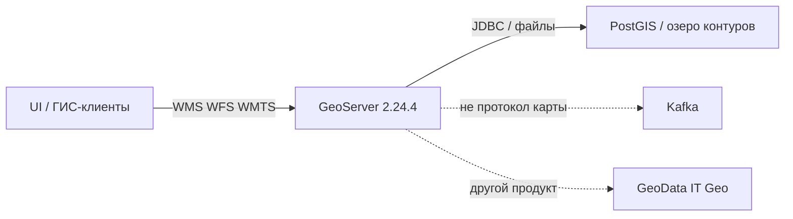
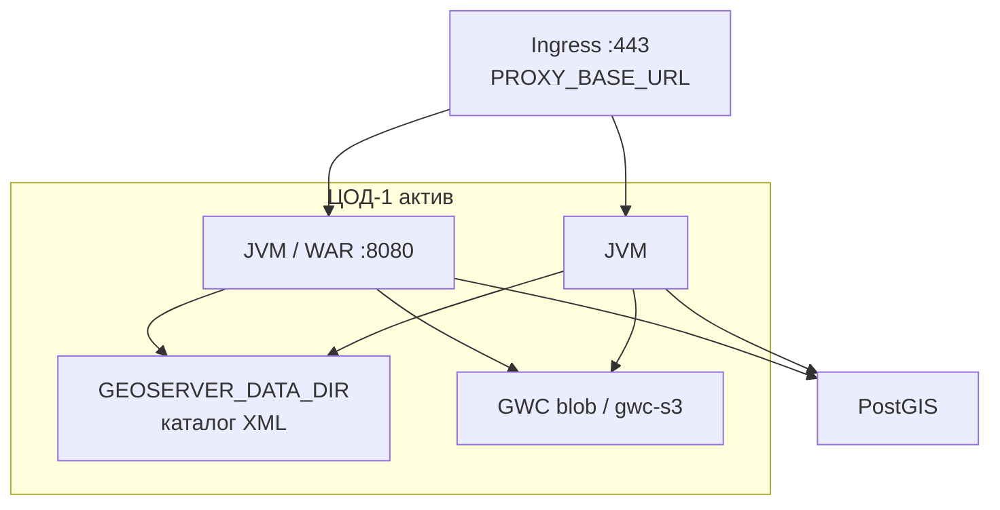
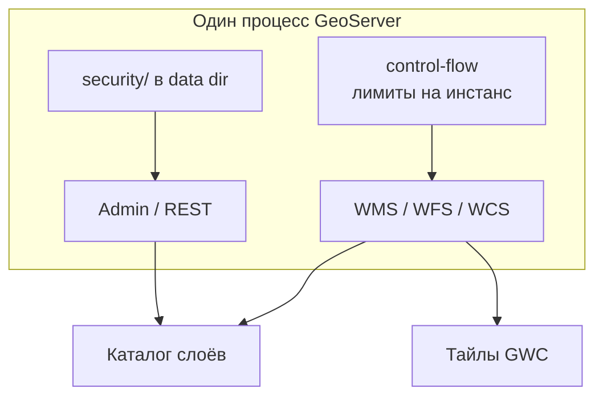
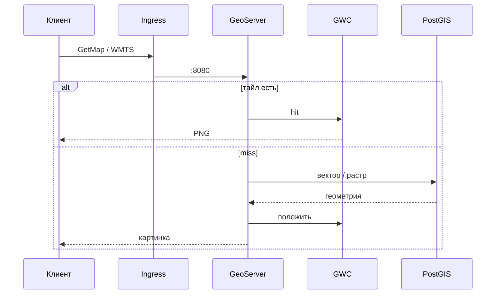
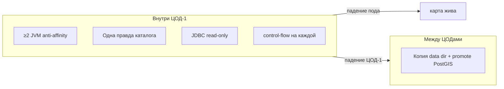
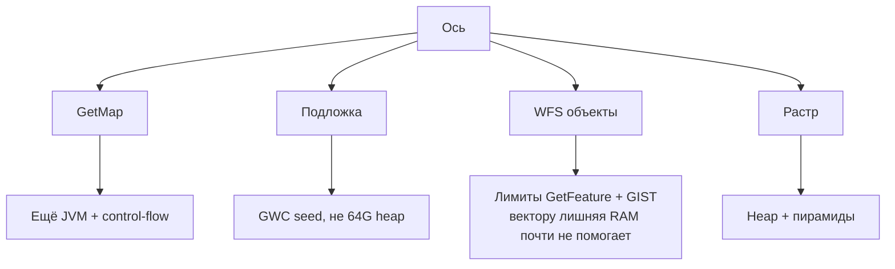
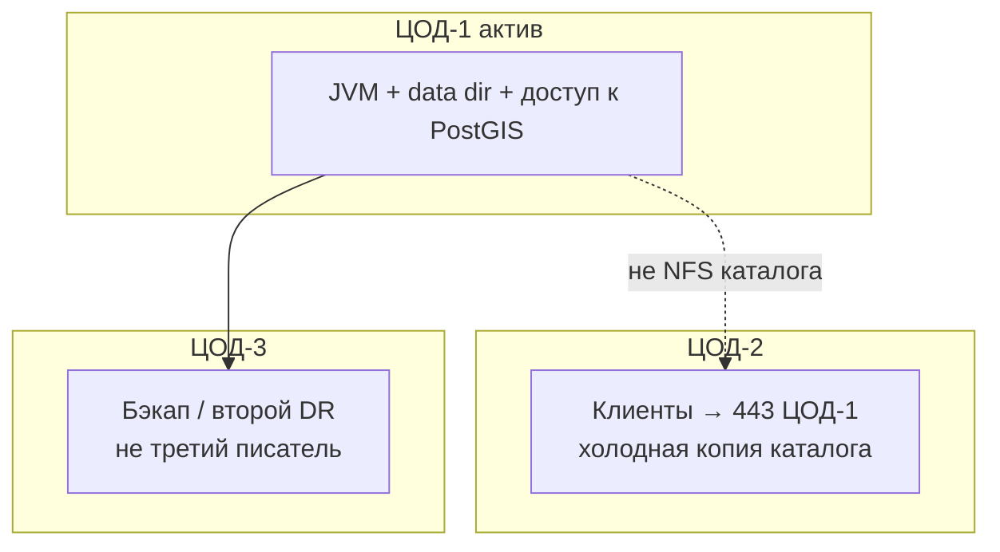

# GeoServer 2.24.4 — схемы устройства

Связанные документы: правила — `GeoServer.md`; установка — `GeoServer.install.md`.

C4 / «D4»: контекст → контейнеры → компоненты. Код SLD не рисуем.

Допущения: stretch data dir / NFS на 2–3 ЦОДа **нет**; классический WAR/Docker OSGeo, **не** GeoServer Cloud и **не** GeoData (ООО «АйТи Гео»); линия **EOL август 2024**; нагрузка GetMap не замерена.

---

## 1. Контекст

GeoServer — **OGC-фасад** (WMS/WFS/WMTS) над store. Не SoT геометрии, не Kafka, не платформа GeoData.

Упал store — карта пустая при живом Tomcat. Запись геометрии в проде — ваши сервисы в БД, не интернет-**WFS-T**.

**Критично:** 2.24.4 (18 июня 2024) закрывал **CVE-2024-36401 (RCE)**. После июня 2024 линейка **не чинится**. Считать готовой к гособмену без решения ИБ **нельзя**. Тег Docker `2.24.x` в manual — **nightly**, не прод.

---

## 2. Контейнеры (актив в одном ЦОДе)

В ядре **нет** кворума. «Кластер» доки — несколько JVM за proxy и **одна** правда каталога.

Порт приложения **8080**; снаружи 443. Между нодами **нет** своего бинарного протокола как у Kafka. Официального оператора K8s под WAR 2.24 **нет**.

Каталог: не 3 реплики на одном **RWO**. Общий RWX/NFS **внутри ЦОДа** — после замера lock; через город — порча XML. Предпочтительно иммутабельный data dir + один писатель.

**Сильное:** падение одного пода — GetMap с остальных, если store жив. **Слабое:** три реплики без одной правды каталога = три сервера.

---

## 3. Компоненты внутри JVM

| Компонент | Для чего настраивать |
|---|---|
| Data directory | Внешний в проде (*highly recommended*). Потеря тома = потеря публикации |
| GWC | Свой каталог на каждом поде = «мигание» тайлов |
| control-flow | Stable. Ориентир модуля: ~2× ядер параллельных GetMap **на инстанс** — старт, не смета. Кластер не видит |
| JMS / JDBCConfig | Community, experimental, нет патчей после EOL. Данные слоёв по JMS **не** едут |

Java 11 — опорный runtime 2.24. Java 17 в доке — *experimental*. Tomcat 8.5/9, не Tomcat 10.

---

## 4. Поток: GetMap

Смена в PostGIS сама тайл не обновит — нужен сброс GWC. Capabilities без `PROXY_BASE_URL` отдают внутренний `http://pod:8080`.

---

## 5. Что настраивать: отказоустойчивость

| Ручка | Если забыть |
|---|---|
| Pin **2.24.4** | Nightly `2.24.x` не прод |
| Не WFS-T | Клиент пишет в эталон |
| CSRF whitelist | Не `GEOSERVER_CSRF_DISABLED` |
| Бэкап data dir + PostGIS | Тайлы пересчитаешь; каталог — нет |

Community JMS multicast в Kubernetes обычно **не** живёт. Не два механизма синка каталога сразу.

---

## 6. Что настраивать: масштабируемость

Цифр «ядер под терабайты» нет. `-Xmx756M` в таблице доки — иллюстрация команд. Limit K8s **выше** heap (JAI, native).

---

## 7. Прод: 2 или 3 ЦОДа без stretch

Третий ЦОД не делает третий writer XML. GeoServer Cloud / Helm camptocamp — **другой** дистрибутив.

**Сильное:** каталог не шарится через город. **Слабое:** падение ЦОД-1 = нет WMS у всех; EOL — дыры после 2.24.4 апстрим не закроет.

---

## 8. Безопасность (ручки на той же схеме)

Сменить `admin`/`geoserver` до любой маршрутизации. Demo `topp:states` снять. XXE: `ENTITY_RESOLUTION_ALLOWLIST`, unrestricted **выкл**. CORS — явный origin, не `*`. Status не светить env (CVE-2024-34696). Сессия **Secure**. Админку часто `GEOSERVER_CONSOLE_DISABLED` на читателях. Лицензия GeoServer — **GPL**.

Источники: `GeoServer.md`. Порога RTT для shared data dir у проекта **нет**.
