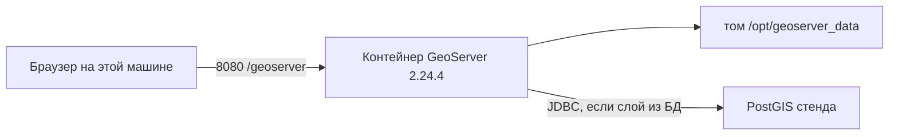

# GeoServer 2.24.4 — установка (учебный контур)

GeoServer — сервер протоколов OGC: картинка карты (**WMS**), объекты (**WFS**), растр (**WCS**), готовые тайлы (**WMTS** через встроенный **GeoWebCache**). Ставите **классический** WAR/Docker OSGeo **2.24.4** (релиз 18 июня 2024). Это **не** платформа GeoData ООО «АйТи Гео» и **не** GeoServer Cloud.

**Допущение:** закрытая сеть, один процесс на одной машине, тег **`2.24.4`**. Боевой запуск сюда не копировать.

Линия **2.24.x** закончила жизнь в **августе 2024**. 2.24.4 закрывал в том числе **CVE-2024-36401** (удалённый запуск кода, Critical). После июня 2024 проект в 2.24.x патчи **не** выпускает. Считать стенд готовым к гособмену без решения ИБ **нельзя**.

Официальный путь учёбы: **Docker**. **Docker** — программа, которая запускает **образ** (упакованная программа с Java и Tomcat) как **контейнер** (запущенная копия). Java отдельно ставить не нужно: она уже внутри образа. Опорный runtime линии 2.24 — **Java 11**; Java 17 в руководстве 2.24 — *experimental only*. Свой «новейший 21» — за пределами таблицы 2.24. Образ: `docker.osgeo.org/geoserver:2.24.4` (тег в реестре OSGeo есть). Не тег **`2.24.x`**: в главе Docker руководства 2.24 это nightly / SNAPSHOT, *not suitable for production*. Не `latest`.

Документация линии — архив: https://docs-archive.geoserver.org/2.24.x/en/user/  
Живой URL `docs.geoserver.org/2.24.x/...` на дату подготовки **404**.

---

## Куда ставить и сколько ресурсов (учебный контур)

**Куда.** Одна машина стенда (Linux или Docker Desktop), порт **8080** слушает только **localhost**. Рядом с учебным Kubernetes, **не** как «три реплики Deployment». Официального оператора Kubernetes под WAR 2.24 нет. Windows installer со страницы релиза — знакомство на ПК, не эта схема.

Каталог данных (**data directory**, `GEOSERVER_DATA_DIR`) — XML слоёв, стили, security, логи. В Docker 2.24 точка монтирования: `/opt/geoserver_data`. Том **локальный**, не NFS через город: порога задержки в доке нет, блокировки XML портят каталог.



**Сколько.** Цифр CPU/RAM «хватит для учёбы / терабайтов» у проекта **нет**. Не подставлять ядра.

| Зачем | Что есть в мануале | Откуда |
|---|---|---|
| Пример команд JVM | `-Xms128m`, `-Xmx756M` — **иллюстрация синтаксиса**, не размер стенда и не смета боя | [Container Considerations](https://docs-archive.geoserver.org/2.24.x/en/user/production/container.html) |
| Куча по умолчанию | часто **¼ RAM хоста**; задать явно, иначе сюрприз | та же страница |
| Параллельные GetMap | ориентир модуля control-flow: пик около **2 × ядер на один инстанс** (пример в доке — на 4 ядра). Это лимит запросов, не «купите N ядер» | [Control flow](https://docs-archive.geoserver.org/2.24.x/en/user/extensions/controlflow/index.html) |
| Диск | внешний каталог данных; пустой каталог образ **заполнит учебными слоями** | [Docker](https://docs-archive.geoserver.org/2.24.x/en/user/installation/docker.html) |

Для учёбы достаточно машины, где Docker поднимает один контейнер и свободен **8080**. Кучу на стенде не крутить, пока процесс не стартует.

**Сильная сторона:** совпадает с Docker-быстрым стартом 2.24, пин патча, а не nightly. **Слабая:** один процесс; падение машины = нет карты.

**Критично:** **8080 в интернет не публиковать** (линейка без патчей, RCE в прошлом уже был). Заводской пароль — только пока порт на localhost. Один контейнер — не кластер: в ядре нет выборов лидера. Каталог сетевой папкой на несколько дата-центров **не** собираем.

---

## Установка для новичка

Команды — в оболочке, где есть Docker (на Linux стенда или в WSL/PowerShell с Docker Desktop). Страница шагов: https://docs-archive.geoserver.org/2.24.x/en/user/installation/docker.html — в примерах там тег `2.24.x`; **подставляйте `2.24.4`**.

### Что должно быть до установки

**Есть:**

- Docker (демон запущен)
- свободный порт **8080** на этой машине
- закрытая сеть; вход с jump-хоста / VPN, если машина не ваш ноутбук

**Нет** (и не должно появиться):

- публикация 8080 наружу (`-p 8080:8080` без `127.0.0.1`)
- тег `2.24.x` / `latest`
- три реплики Kubernetes с этим запуском
- общий NFS каталога на несколько залов

### Этап 1. Docker

**Что делаем:** проверяем, что Docker — программа, которая умеет скачать образ и запустить контейнер. Если Docker ещё нет — ставят из **вашего** зеркала пакетов / Docker Desktop; минимальной версии в главе Docker 2.24 **нет**.

```bash
docker version
```

Успех: клиент и сервер отвечают, демон доступен. `Cannot connect to the Docker daemon` — демон не запущен.

### Этап 2. Скачать образ 2.24.4

**Что делаем:** забираем **конкретный патч**, не nightly. Тег `2.24.4` в `docker.osgeo.org` на дату подготовки есть (реестр OSGeo, `GET /v2/geoserver/tags/list`).

```bash
docker pull docker.osgeo.org/geoserver:2.24.4
```

Успех: pull без ошибки, в списке образов тег **`2.24.4`**.

Если реестр с вашей сети недоступен — свой образ из **WAR 2.24.4** на Tomcat **9** (Tomcat 10+ — другое пространство имён Jakarta, не тот WAR). Java тогда нужна **11**. Скачивание WAR: https://geoserver.org/release/2.24.4/

### Этап 3. Запуск с внешним каталогом

**Что делаем:** поднимаем контейнер. `-p 127.0.0.1:8080:8080` — порт **8080** внутри контейнера проброшен только на loopback этой машины (не на все интерфейсы, как в примере вендора `-p8080:8080`). Том — чтобы каталог слоёв пережил удаление контейнера. Пустой каталог **заполнится учебными данными** (`topp:states` и т.п.) — в бой их не уносят.

```bash
docker run -d --name geoserver-dev \
  -p 127.0.0.1:8080:8080 \
  --mount type=volume,src=geoserver-data,target=/opt/geoserver_data \
  docker.osgeo.org/geoserver:2.24.4
```

Официальный пример — bind-mount каталога хоста в `/opt/geoserver_data`. Именованный том здесь то же по смыслу: данные снаружи процесса.

Успех: `docker ps` показывает `geoserver-dev` в `Up`.

### Этап 4. Welcome и версия

**Что делаем:** ждём старт Tomcat (десятки секунд) и проверяем UI.

```bash
docker logs --tail 50 geoserver-dev
```

В браузере: `http://127.0.0.1:8080/geoserver` — должна открыться Welcome page ([Docker](https://docs-archive.geoserver.org/2.24.x/en/user/installation/docker.html), [Web admin](https://docs-archive.geoserver.org/2.24.x/en/user/gettingstarted/web-admin-quickstart/index.html)).

Capabilities:

```bash
curl -sS "http://127.0.0.1:8080/geoserver/wms?service=WMS&version=1.1.1&request=GetCapabilities"
```

Успех: XML GetCapabilities, не ошибка Tomcat. После входа в UI: **About** / статус — **2.24.4**, не `2.24-SNAPSHOT`. Учебный GetMap (если демо-слой на месте):

```text
http://127.0.0.1:8080/geoserver/wms?request=GetMap&service=WMS&version=1.1.1&layers=topp%3Astates&styles=&srs=EPSG%3A4326&bbox=-124,24,-66,50&width=780&height=330&format=image/png
```

(пример слоя и операции — [WMS reference](https://docs-archive.geoserver.org/2.24.x/en/user/services/wms/reference.html)).

Расширения — zip **той же** 2.24.4 (страница релиза, раздел Extensions). На стенде имеет смысл стабильный **control-flow**, не community JAR с nightly. В главе Docker 2.24 можно `INSTALL_EXTENSIONS=true` и `STABLE_EXTENSIONS=control-flow` — набор должен совпасть с патчем **2.24.4**.

**Чего этот стенд не доказывает:** отказ зала, отказ PostGIS (карта пустая при живом UI — ожидаемо), ёмкость тайлов, общий диск каталога, выборы лидера (их в ядре нет), нагрузка GetMap, «три реплики = HA». Healthcheck образа по логотипу UI (если есть) = процесс жив, не «PostGIS отвечает».

---

## Первый запуск — URL, порт, учётка, смена пароля

**URL:** `http://127.0.0.1:8080/geoserver`  
Порт приложения в официальном Docker — **8080/TCP**, контекст **`/geoserver`**. Снаружи в бою обычно 443 на Ingress; на этом стенде — только loopback. Админка: тот же URL, после входа меню слева (`/geoserver/web`).

Страница: https://docs-archive.geoserver.org/2.24.x/en/user/gettingstarted/web-admin-quickstart/index.html

**Учётка (заводская, 2.24 подтверждена):**

| Поле | Значение |
|---|---|
| Пользователь | `admin` |
| Пароль | `geoserver` |

Это пароль админки. Он напечатан в мануале открытым текстом — **только закрытый стенд**. Вход: правый верхний угол Welcome.

**Смена пароля `admin` — сразу после первого входа**, до любого проброса порта дальше этой машины.

1. **Security → Users, Groups, Roles** (или предупреждение на Welcome «change it»).
2. Пользователь **`admin`**.
3. **Password** и **Confirm password** — свой пароль, **Save**.

Страница пользователей: https://docs-archive.geoserver.org/2.24.x/en/user/security/webadmin/ugr.html

Новый пароль — в сейф / Vault, **не в git**. Учебный `geoserver` в бой не копировать.

**Пароль хранилища ключей (keystore / master password)** — отдельный от `admin`. Им шифруют обратимые секреты (в т.ч. JDBC). В 2.24 по умолчанию сгенерированный пароль лежит открытым текстом в файле `security/masterpw.info` внутри каталога данных. Администратор: прочитать, проверить, **удалить файл**. Смена: **Security → Passwords → Change password**.

https://docs-archive.geoserver.org/2.24.x/en/user/security/passwd.html  
https://docs-archive.geoserver.org/2.24.x/en/user/security/webadmin/passwords.html

Не считать, что master password тоже равен `geoserver`, пока не прочитали `masterpw.info` **этого** каталога. Переменные образа линейки 2.28 (`GEOSERVER_ADMIN_PASSWORD` и т.д.) на тег **2.24.4** вслепую не копировать: после смены в UI, если такие переменные оставить, README текущего образа предупреждает, что учётки могут **перезаписаться** при рестарте.

---

## Подключение к своей системе

Клиенты ходят **HTTP(S) по протоколам OGC** на URL GeoServer. Приложение GeoServer **не** импортирует. Геометрия живёт в **store** (обычно PostgreSQL + PostGIS — другое ПО). Упал store — карта пустая при живом Tomcat.

Интеграции с ведомствами — через **своё интеграционное API**, не напрямую из GeoServer. **GeoData** — другой продукт (low-code ООО «АйТи Гео»); GeoServer его не заменяет и не является его встроенным движком.

### Протоколы и URL стенда

База: `http://127.0.0.1:8080/geoserver`. За reverse proxy задают **Proxy Base URL** (`PROXY_BASE_URL`), иначе Capabilities отдают внутренний адрес.

https://docs-archive.geoserver.org/2.24.x/en/user/configuration/globalsettings.html

| Протокол | Что отдаёт | Пример |
|---|---|---|
| **WMS** | картинка карты (GetMap), список слоёв (GetCapabilities) | `.../wms?service=WMS&version=1.1.1&request=GetCapabilities` |
| **WFS** | объекты (GetFeature), GML/GeoJSON | `.../wfs?service=WFS&version=1.1.0&request=GetCapabilities` |
| **WCS** | покрытие / растр | ссылки на Welcome |
| **WMTS** | готовый тайл (GeoWebCache) | `.../gwc/service/wmts` |
| **TMS / WMS-C** | другие тайловые входы GWC | `.../gwc/service/tms/1.0.0`, `.../gwc/service/wms` |
| Админка / REST | люди и автоматизация каталога | `/geoserver/web`, REST из внутренней сети |

WMS: https://docs-archive.geoserver.org/2.24.x/en/user/services/wms/reference.html  
WFS: https://docs-archive.geoserver.org/2.24.x/en/user/services/wfs/reference.html  
Тайлы: https://docs-archive.geoserver.org/2.24.x/en/user/geowebcache/using.html · https://docs-archive.geoserver.org/2.24.x/en/user/geowebcache/webadmin/defaults.html

**WFS-T** (запись транзакцией) на стенде выключить, если цель — чтение: WFS **Service Level = Basic** + учётка PostGIS **только чтение**. https://docs-archive.geoserver.org/2.24.x/en/user/production/config.html

### Кто клиент

- Браузер, настольная ГИС, портал карт — вставляют URL WMS/WFS/WMTS из Welcome / Capabilities.
- Карта в Kubernetes за Ingress/WAF — тот же OGC, снаружи **443**, внутри под → **8080**.
- Kafka, Camunda, озеро эталона в GeoServer **не** подключаются как клиенты протокола карты.

### Слой из PostGIS (учебный)

Stores → **Add a new store** → **PostGIS NG**. Поля: host, port (**5432** у Postgres), database, schema, user, passwd. Затем слой из таблицы, стиль, проверка GetMap и GetFeature.

https://docs-archive.geoserver.org/2.24.x/en/user/data/database/postgis.html

Пароль JDBC — не в git и не в Capabilities.

### Секреты (не в git)

| Секрет | Где живёт | Куда не класть |
|---|---|---|
| Пароль `admin` после смены | сейф / Vault | git, чат, образ, `-e` навсегда |
| Keystore / master password | после смены — сейф; файл `masterpw.info` удалить | git, общий диск |
| JDBC user/password store | каталог данных (шифруется keystore) | git, Capabilities |
| `PROXY_BASE_URL` | настройка / переменная среды | в git можно без секретов |

### Чем продукт не является

| Сосед / ожидание | Чем отличается |
|---|---|
| **GeoData** (IT Geo) | Платный low-code, свой стек. Не обёртка над GeoServer 2.24 |
| **GeoServer Cloud** | Другой дистрибутив и Helm |
| Эталон геометрии / озеро | SoT — PostGIS / кадастр, не shapefile внутри data dir |
| Kafka / Camunda | Не шина событий и не процессный движок |
| Кластер с кворумом | Несколько JVM за прокси и **одна** правда каталога; своего бинарного протокола между нодами нет |
| ГОСТ-криптография | Не заявлена |

---

## Ссылки на материал

| Факт | URL |
|---|---|
| Релиз **2.24.4** (18 июня 2024), пакеты, расширения | https://geoserver.org/release/2.24.4/ |
| CVE-2024-36401, CVE-2024-34696, SSRF TestWfsPost | https://geoserver.org/announcements/vulnerability/2024/06/18/geoserver-2-24-4-released.html |
| EOL 2.24.x = август 2024; Java **11**; Tomcat **8.5 или 9** | https://github.com/geoserver/geoserver/wiki/Release-Schedule |
| Docker 2.24: порт 8080, `/geoserver`, `/opt/geoserver_data`, тег `2.24.x` = nightly | https://docs-archive.geoserver.org/2.24.x/en/user/installation/docker.html |
| Дефолт **`admin` / `geoserver`**, Welcome `http://localhost:8080/geoserver` | https://docs-archive.geoserver.org/2.24.x/en/user/gettingstarted/web-admin-quickstart/index.html |
| Смена пароля пользователя | https://docs-archive.geoserver.org/2.24.x/en/user/security/webadmin/ugr.html |
| Keystore / `masterpw.info` | https://docs-archive.geoserver.org/2.24.x/en/user/security/passwd.html |
| Смена keystore password в UI | https://docs-archive.geoserver.org/2.24.x/en/user/security/webadmin/passwords.html |
| `GEOSERVER_DATA_DIR` | https://docs-archive.geoserver.org/2.24.x/en/user/datadirectory/setting.html |
| Java 11 vs 17 experimental | https://docs-archive.geoserver.org/2.24.x/en/user/production/java.html |
| Пример `-Xms128m` / `-Xmx756M`, куча ¼ RAM | https://docs-archive.geoserver.org/2.24.x/en/user/production/container.html |
| WFS Basic, демо-слои, XML, админка | https://docs-archive.geoserver.org/2.24.x/en/user/production/config.html |
| Кластер = ноды за прокси | https://docs-archive.geoserver.org/2.24.x/en/user/production/misc.html |
| Control-flow, ориентир 2× CPU | https://docs-archive.geoserver.org/2.24.x/en/user/extensions/controlflow/index.html |
| WMS GetCapabilities / GetMap | https://docs-archive.geoserver.org/2.24.x/en/user/services/wms/reference.html |
| WFS GetFeature / Transaction | https://docs-archive.geoserver.org/2.24.x/en/user/services/wfs/reference.html |
| PostGIS store | https://docs-archive.geoserver.org/2.24.x/en/user/data/database/postgis.html |
| Proxy Base URL | https://docs-archive.geoserver.org/2.24.x/en/user/configuration/globalsettings.html |
| GWC / WMTS `.../gwc/service/wmts` | https://docs-archive.geoserver.org/2.24.x/en/user/geowebcache/webadmin/defaults.html |
| Текущий README образа (примеры 2.28; не копировать env в 2.24.4 вслепую) | https://github.com/geoserver/docker/blob/master/README.md |
| Зачем продукт, порты, железо | `GeoServer.md` |
| Словарь | `GeoServer.info.md` |
| Схема стыковки | `GeoServer.shema.md` |
| Роль консультанта | `GeoServer.consultant.md` |

**В доке вендора нет (и здесь не выдумано):** CPU/RAM «минимум, чтобы процесс поднялся»; порог RTT для общего каталога; официальный оператор Kubernetes для WAR 2.24; Java **внутри слоёв образа 2.24.4** (актуальный Dockerfile репозитория docker для 2.x указывает JDK 17 — для **этого** тега смотреть `docker inspect`, не гадать); что master password завода у 2.24.4 равен `geoserver` (читать `masterpw.info`); живые страницы `https://docs.geoserver.org/2.24.x/en/user/...` (404, брать архив).
