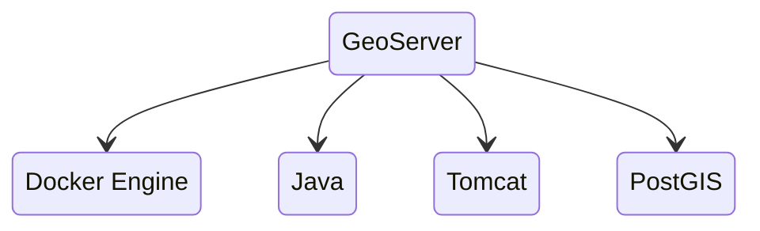
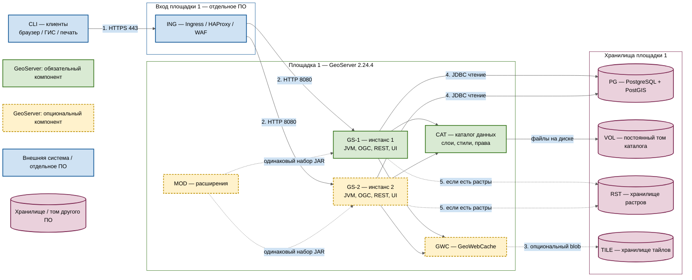

# GeoServer 2.24.4 — развёртывание и настройка

GeoServer — сервер картографических протоколов OGC: картинка карты (WMS), объекты (WFS), готовые квадратики тайлов (WMTS). Этот документ про **классический** GeoServer **2.24.4** (последний патч линии 2.24.x; релиз **18 июня 2024**, вместе с GeoTools 30.4 и GeoWebCache 1.24.4). Это не GeoServer Cloud (микросервисы и другой Helm) и не платформа GeoData ООО «АйТи Гео».

Документация линии: https://docs-archive.geoserver.org/2.24.x/en/user/  
Скачивание: https://geoserver.org/release/2.24.4/  
Официальный контейнер: `docker.osgeo.org/geoserver`. Для боя **не** тег `2.24.x` (в руководстве 2.24 это nightly), а **конкретный патч `2.24.4`**, если он есть в реестре OSGeo; иначе — свой образ из **WAR 2.24.4** на Tomcat 9.

**Критично по версии.** По расписанию проекта линия **2.24.x**: stable сентябрь 2023, maintenance апрель 2024, **конец жизни — август 2024**. На дату подготовки этого файла (август 2026) линейка **два года без официальных патчей**. 2.24.4 закрывал в том числе **CVE-2024-36401 (удалённый запуск кода, Critical)**. Всё, что нашли **после** июня 2024, в 2.24.x проект **не чинит**. Документ описывает **запрошенную** версию; считать её готовой к бою с гособменом без отдельного решения ИБ **нельзя**.

Этот текст — не набор команд «скопируй docker run», а правила, без которых система не будет одновременно устойчивой к сбоям, масштабируемой и безопасной. Пошаговая установка — в `GeoServer.install.md`.

---

## Назначение системы

GeoServer нужен, чтобы **отдать геометрию стандартными протоколами**: «нарисуй карту», «отдай объекты», «отдай тайл». Руководитель или сервис открывает слой «земельные участки» / «охранные зоны», не таща терабайты JSON в браузер.

Система **публикует то, что лежит в хранилище** (обычно PostgreSQL с PostGIS). Она **не** хранит эталон контуров, **не** заменяет очередь событий, **не** исполняет бизнес-процессы и **не** ходит в государственные сервисы. Упал PostGIS — карта пустая при живом интерфейсе.

Нечестная роль: «положим эталон только в файл внутри каталога GeoServer и размножим три зала». Файловое хранилище на сетевой папке между площадками и три писателя каталога — это гонка, не устойчивость.

---

## Перечень функций

Что умеет классический GeoServer 2.24:

1. **Отдавать картинку карты** (WMS): слои, область, стиль. Тяжёлая нагрузка на CPU и память, особенно на растрах.
2. **Отдавать объекты** (WFS) в GML/GeoJSON. Чтение. Запись (WFS-T) в бою часто **выключают**.
3. **Отдавать покрытие/растр** (WCS) — сетку значений, не картинку для глаз.
4. **Отдавать готовые тайлы** (WMTS и родственники) через встроенный **GeoWebCache**, чтобы не рисовать WMS на каждый сдвиг карты.
5. **Считать на сервере** (WPS: буфер, пересечение). Состояние заданий между нодами **не** общее без отдельного расширения.
6. **Вести каталог**: рабочие области, подключения к данным, слои, стили. В классическом GeoServer это XML-файлы в **каталоге данных** на диске.
7. **Ограничивать доступ** к слоям (своя подсистема пользователей). Keycloak из коробки нет (есть экспериментальные модули).
8. **Ставить расширения** в каталог библиотек: лимиты параллельных запросов (control-flow), тайлы в объектное хранилище (gwc-s3) и другие. Набор должен быть **одинаковым** на всех нодах и **той же** мелкой версии, что сервер.

Чего система **не** делает и часто путают: она не озеро эталона, не шина событий, не Camunda, не GeoData, не кворум «пережили площадку сами». Несколько копий за балансировщиком переживают падение **пода**, не падение **единственного PostGIS**. Официального оператора Kubernetes для WAR 2.24 нет. ГОСТ-криптографии нет. Терабайты живут в PostGIS и файлах, GeoServer держит **рабочий набор** (память, соединения, тайлы). Реплики подов бэкап каталога не заменяют.

---

## Основные элементы системы и зависимости

GeoServer — **одно Java-приложение** в контейнере сервлетов. Для параллельной обработки запускают несколько одинаковых экземпляров приложения; самостоятельного кластерного процесса, выборов лидера и кворума в ядре нет. Ниже отдельно показаны встроенные части GeoServer и внешние системы, которые развёртываются и сопровождаются независимо.

**Допущение схемы:** одна площадка. Живые JVM, каталог данных и PostGIS этой публикации живут в одном дата-центре. Stretch-каталога и общего NFS на 2–3 зала на рисунке **нет**: порога допустимой задержки в документации вендора нет, а общая папка через город даёт порчу XML. ([Clustering](https://docs-archive.geoserver.org/2.24.x/en/user/production/misc.html), [data directory](https://docs-archive.geoserver.org/2.24.x/en/user/datadirectory/setting.html))

**Сильная сторона** одного зала: ноды ходят в свой PostGIS и свой каталог без межплощадочной сети, отказ одного процесса переживается второй JVM. **Слабая:** падение этой площадки вместе с её PostGIS останавливает карту, даже если в других залах есть копии. **Критично:** не публиковать **8080** и Web UI в интернет; не копировать учебный `admin`/`geoserver` в бой; не объявлять три реплики с общим каталогом на диске «только одному поду» кластером; линейка **2.24.x** закончила жизнь в августе 2024.

### Схема инстансов и потоков

Имена внутри блоков — роли, не обязательные DNS-имена. Сплошная стрелка — рабочий поток показанной схемы одной площадки; пунктир — опциональный путь или логическая установка, а не обязательный TCP. Направление стрелки — кто открывает соединение. Рамки subgraph **без заливки**: цвет задаёт сам квадратик, подложка его не перекрашивает.

**Легенда:**

- ■ **Зелёный** — компоненты GeoServer, без которых показанный контур публикации не работает (`GS-1` и каталог данных).
- ■ **Жёлтый, пунктирная рамка** — поставка GeoServer, которую на одной площадке можно не использовать (вторая JVM, кэш тайлов, расширения).
- ■ **Синий** — отдельно развёрнутые системы и участники. GeoServer их не кластеризует и не заменяет.
- ■ **Розовый цилиндр** — хранилище или том другого ПО. Формат каталога — продукт, диск и СУБД — нет.

### Описание блоков

#### CLI — клиенты

- **Что это:** браузер, настольная ГИС, сервер печати, портал или прикладной сервис, которые запрашивают карту.
- **Технологии и варианты:** любой OGC-клиент WMS, WFS, WCS, WMTS; конкретный продукт задаёт платформа, не GeoServer.
- **Назначение:** получить картинку карты, векторные объекты, покрытие или готовый тайл. Клиент не ходит в конкретную JVM и не читает PostGIS напрямую.
- **Развёртывание:** внешние участники, не входят в GeoServer.

#### ING — Ingress / HAProxy / WAF

- **Что это:** внешняя HTTPS-точка входа площадки 1.
- **Технологии и варианты:** Kubernetes Ingress, HAProxy или иной HTTP(S)-прокси; WAF может стоять перед ними или совмещать роль края. GeoServer конкретный продукт не задаёт. ([Proxy your server](https://docs-archive.geoserver.org/2.24.x/en/user/production/misc.html))
- **Назначение:** завершить TLS, отдать один публичный URL, распределить HTTP между `GS-1` и `GS-2`, ограничить доступ к Web UI и REST. В Capabilities должен попасть внешний адрес (`Proxy base URL`), а не `http://pod:8080`.
- **Развёртывание:** отдельно развёрнутая система. Для одной JVM на закрытом стенде можно обойтись без неё; для показанной многонодовой схемы вход обязателен.

#### GS-1 — инстанс 1

- **Что это:** один запущенный процесс классического GeoServer: Java-машина с приложением, которое принимает HTTP и отдаёт OGC, REST и Web UI.
- **Технологии и варианты:** WAR **2.24.4** в Tomcat **8.5 или 9**, либо контейнер `docker.osgeo.org/geoserver` с патч-тегом **`2.24.4`** (не nightly `2.24.x`, не `latest`). Опорный runtime линии 2.24 — **Java 11**; Java 17 в руководстве 2.24 экспериментальна, Tomcat 10 не подходит. ([Docker](https://docs-archive.geoserver.org/2.24.x/en/user/installation/docker.html), [Java](https://docs-archive.geoserver.org/2.24.x/en/user/production/java.html), [Release Schedule](https://github.com/geoserver/geoserver/wiki/Release-Schedule))
- **Назначение:** разобрать запрос, прочитать каталог, сходить в хранилище и вернуть карту или объекты. Состояние слоёв между процессами сам не синхронизирует.
- **Развёртывание:** входит в продукт, ставится на этой площадке. Минимум для живой публикации — один такой процесс.

#### GS-2 — инстанс 2

- **Что это:** второй такой же процесс GeoServer за тем же входом.
- **Технологии и варианты:** та же поставка и тот же патч **2.24.4**, тот же каталог и тот же набор расширений, что у `GS-1`. Отдельного протокола «нода ↔ нода» в ядре нет. ([Clustering](https://docs-archive.geoserver.org/2.24.x/en/user/production/misc.html))
- **Назначение:** горизонтально раздать GetMap/GetFeature и пережить отказ одной JVM. Это не выборы лидера и не кворум.
- **Развёртывание:** входит в продукт; на одной площадке **опционален**. Учебный стенд обходится `GS-1`. В бою вторая JVM имеет смысл, только если каталог и PostGIS ей доступны.

#### CAT — каталог данных

- **Что это:** файловая конфигурация GeoServer (рабочие области, подключения, слои, стили, права, настройки сервисов). Это не эталон геометрии.
- **Технологии и варианты:** XML и сопутствующие файлы в `GEOSERVER_DATA_DIR`. Если путь не задан, берётся `data_dir` внутри установки. ([Setting the data directory](https://docs-archive.geoserver.org/2.24.x/en/user/datadirectory/setting.html))
- **Назначение:** сказать инстансу, *что* публиковать и *как*. Потеря каталога оставляет геометрию в PostGIS, но сервер перестаёт знать слои.
- **Развёртывание:** формат входит в продукт и **обязателен**. Файлы лежат на внешнем носителе `VOL`. Независимые каталоги на двух JVM дают два разных сервера. Общий каталог через несколько дата-центров на этой схеме не используется.

#### GWC — GeoWebCache

- **Что это:** встроенный сервер тайлов: промежуточный кэш между клиентом и отрисовкой WMS.
- **Технологии и варианты:** GeoWebCache, входящий в классический GeoServer; отдельно существует standalone-продукт, на этой схеме его нет. Тайлы можно держать локально у инстанса или вынести в `TILE`. ([GeoWebCache](https://docs-archive.geoserver.org/2.24.x/en/user/geowebcache/index.html))
- **Назначение:** не рисовать GetMap заново на каждый сдвиг карты. Смена геометрии в PostGIS сама тайл не сбросит — нужен сброс кэша.
- **Развёртывание:** входит в поставку WAR/образа; **использование кэша опционально**. WMS и WFS работают без прогретого кэша. Локальные кэши `GS-1` и `GS-2` независимы, поэтому картинка на нодах может разойтись, пока нет общего `TILE`.

#### MOD — расширения

- **Что это:** дополнительные JAR в каталоге библиотек инстанса, не отдельные сервисы.
- **Технологии и варианты:** zip той же мелкой версии **2.24.4**. На схеме как типичные: `control-flow` (лимит параллельных запросов), WPS, `gwc-s3` (тайлы в объектное хранилище). Сообщество-модули кластера (JMS, JDBCConfig) после конца жизни 2.24 патчей не получают и штатной устойчивостью не считаются. ([control-flow](https://docs-archive.geoserver.org/2.24.x/en/user/extensions/controlflow/index.html))
- **Назначение:** лимиты, серверная геообработка, внешнее хранение тайлов и прочее, чего нет в ядре.
- **Развёртывание:** входит в экосистему продукта, ставится **в каждый** инстанс одинаковым набором. Для базовых WMS/WFS **не обязательно**. Пунктир к JVM — не сетевой вызов, а требование одинаковой установки.

#### PG — PostgreSQL + PostGIS

- **Что это:** реляционная СУБД с пространственным расширением; эталон векторной геометрии этой публикации.
- **Технологии и варианты:** PostgreSQL с PostGIS (хранилище NG в GeoServer; JDBC или JNDI-пул контейнера). GeoServer умеет и другие векторные источники; на этой схеме платформы выбран PostGIS. Порт задаёт СУБД, часто **5432/TCP**, это не порт GeoServer. ([PostGIS](https://docs-archive.geoserver.org/2.24.x/en/user/data/database/postgis.html))
- **Назначение:** хранить геометрию и атрибуты слоёв. Инстанс читает их при сборке карты и объектов. В бою этой схемы запись через WFS выключена: геометрию пишут ваши сервисы в БД.
- **Развёртывание:** отдельно развёрнутая система на **этой же** площадке. Реплики GeoServer не бэкапят и не кластеризуют PostGIS. Для публикации без записи — JDBC-учётка только на чтение.

#### VOL — постоянный том каталога

- **Что это:** диск, на котором лежат файлы `CAT` после пересоздания контейнера или пода.
- **Технологии и варианты:** PersistentVolume Kubernetes, локальный SSD. Если каталог на сетевой ФС, вендор предлагает `GEOSERVER_REQUIRE_FILE`, чтобы пустой mount не поднял учебный незащищённый каталог. ([data directory](https://docs-archive.geoserver.org/2.24.x/en/user/datadirectory/setting.html))
- **Назначение:** сохранить конфигурацию публикации. Тайлы этот том не заменяют и наоборот.
- **Развёртывание:** элемент отдельно выбранного хранения, не процесс GeoServer. Постоянство каталога в бою **обязательно**. Том «только одному поду» нельзя отдать двум JVM сразу; общую папку между площадками эта схема не использует.

#### RST — хранилище растров

- **Что это:** файлы исходных растровых покрытий и пирамид, если такие слои публикуются.
- **Технологии и варианты:** GeoTIFF и другие форматы, которые умеет GeoServer; объектное хранилище — только при совместимом доступе. На схеме не рисуется как обязательное.
- **Назначение:** отдать покрытие/растр (WCS) или нарисовать растровый слой в WMS. Векторный контур с одним PostGIS работает без этого блока.
- **Развёртывание:** отдельно развёрнутое хранилище на этой площадке; **опционально**.

#### TILE — хранилище тайлов

- **Что это:** место, куда `GWC` складывает уже посчитанные квадратики карты.
- **Технологии и варианты:** локальный диск инстанса, общий том зала или объектное хранилище через совместимое расширение (например `gwc-s3`).
- **Назначение:** ускорить повторные WMTS/тайловые запросы. Потеря тайлов ухудшает скорость и вызывает пересчёт, конфигурацию слоёв не уничтожает.
- **Развёртывание:** отдельно выбранный носитель; **опционален**. Нужен как общий, только если обе JVM должны отдавать одну и ту же версию тайла.

#### Рамки EDGE / SITE / DATA и блоки легенды

- **Что это:** группировка и пояснение цветов, не runtime-процессы.
- **Технологии и варианты:** служебные блоки Mermaid; заливки у рамок нет, чтобы не перекрашивать квадратики.
- **Назначение:** `SITE` — поставка GeoServer на площадке 1; `EDGE` и `DATA` — чужое ПО той же площадки; легенда повторяет цвета узлов.
- **Развёртывание:** на схему не ставятся.

### Как читать схему

1. **Это одна площадка.** Рамки `Вход`, `GeoServer` и `Хранилища` — один дата-центр. Второго и третьего ЦОДа нет: их появление потребовало бы холодной копии каталога и отдельного плана promote PostGIS, а не общего диска через город.
2. **Сначала смотрите на цвет квадратика, не на рамку.** Зелёный — ядро продукта. Жёлтый пунктир — тот же продукт, но его можно не включать. Синий — чужой жизненный цикл (клиент, вход). Розовый цилиндр — диск или СУБД. Рамки специально без заливки, иначе подложка перекрашивает узлы.
3. **Читайте основной путь по номерам 1–2–4.** Человек или сервис открывает HTTPS на вход; вход выбирает живую JVM; JVM сама читает PostGIS по JDBC. Балансировщик геометрию не возит.
4. **Шаг 1.** `CLI` знает одно публичное имя на **443**, не адрес пода. Если в Capabilities попадает внутренний `http://pod:8080`, клиенты разъедутся. За это отвечает `Proxy base URL` на входе. ([Proxy](https://docs-archive.geoserver.org/2.24.x/en/user/production/misc.html))
5. **Шаг 2.** Внутри официального Docker приложение слушает **HTTP 8080** (`/geoserver`). Две стрелки `ING → GS-1` и `ING → GS-2` — балансировка запросов, не репликация состояния. Между JVM своей стрелки нет: ядро не выбирает лидера. ([Docker](https://docs-archive.geoserver.org/2.24.x/en/user/installation/docker.html), [Clustering](https://docs-archive.geoserver.org/2.24.x/en/user/production/misc.html))
6. **Жёлтый `GS-2` можно снять.** На закрытом стенде достаточно `GS-1`. Вторая JVM имеет смысл для нагрузки GetMap и отказа процесса, пока живы `ING`, `CAT`/`VOL` и `PG`.
7. **`CAT` — правила, `PG` — геометрия, `TILE` — картинки.** Это три разных правды. Упал PostGIS — карта пустая при живом UI. Упал каталог — данные в БД есть, публиковать нечего. Упали тайлы — слои живы, но WMS снова считается.
8. **`CAT → VOL` разделяет формат и носитель.** XML каталога — часть продукта; долговечность даёт выбранный том. Для двух JVM нужна одна согласованная копия каталога или управляемая доставка одинаковых копий. Документация прямо называет это главной трудностью кластера: *the challenge is management of changes to the data directory*.
9. **Админку в бою обычно пускают на одного писателя.** REST/UI меняют `CAT`. Пока правка не разъехалась по нодам, читатели могут отдавать старую конфигурацию. Типовой приём доки: направлять `/geoserver/web` на одну ноду, остальных перезапускать после выката. Штатного кворума нет.
10. **Шаг 3 пунктирный.** `GWC` встроен, отдельный `TILE` не обязателен. Без кэша ответ рисуется заново. Свои каталоги тайлов на каждой JVM дают «мигание» подложки. Кэш не заменяет бэкап `VOL` и `PG`.
11. **Шаг 4 обязателен для этой схемы платформы.** Каждый инстанс открывает JDBC сам. Учётка в бою — только чтение, если запись геометрии идёт вашими сервисами, а не WFS-T.
12. **Шаг 5 появляется только с растрами.** Векторный контур (участки, зоны) живёт без `RST`. Стрелка пунктирная, потому что блока может не быть.
13. **Пунктир `MOD → JVM` — не протокол.** Это требование: один и тот же набор JAR той же 2.24.4 в каждый инстанс. `control-flow` видит только свою JVM; ориентир модуля — порядка **2× ядер** параллельных GetMap **на инстанс**, это лимит запросов, не смета закупки ядер. ([control-flow](https://docs-archive.geoserver.org/2.24.x/en/user/extensions/controlflow/index.html))
14. **Отказ `ING` или обеих JVM останавливает карту этой площадки.** Отказ одной JVM при живом входе, каталоге и PostGIS — остальные продолжают отдавать OGC. Отказ UI ≠ отказ карты, если ноды уже сконфигурированы.
15. **На схеме нет Kafka, Camunda, GeoData и госинтеграционного API.** GeoServer их не заменяет. Интеграции с ведомствами — через своё API платформы, не напрямую из этого процесса.
16. **Эту схему нельзя дорисовать «ещё двумя ЦОДами».** Общий `VOL` через город — риск битого XML; порога RTT у проекта нет. Второй зал — холодная копия каталога плюс свой план PostGIS, не второй писатель XML.

### Специальные термины схемы

- **Blob store** — место хранения готовых тайлов GeoWebCache (диск, том или объектное хранилище).
- **Capabilities** — XML-описание операций, слоёв и адресов OGC-сервиса; клиент узнаёт из него, куда ходить.
- **GetMap / GetFeature** — операции WMS «нарисуй картинку» и WFS «отдай объекты».
- **JDBC** — стандартный интерфейс Java к реляционной базе; инстанс открывает им соединение к PostGIS.
- **JNDI** — именной lookup пула соединений в контейнере сервлетов; альтернатива прямым параметрам JDBC.
- **JVM / инстанс / нода** — один процесс Java с экземпляром GeoServer; в Kubernetes обычно один под.
- **OGC** — консорциум, чьи спецификации задают WMS/WFS/WCS/WMTS/WPS.
- **PersistentVolume / постоянный том** — диск Kubernetes (или аналог), который переживает пересоздание пода.
- **PostGIS** — расширение PostgreSQL для геометрии и пространственных индексов.
- **Proxy base URL** — внешний базовый URL, который GeoServer подставляет в Capabilities вместо внутреннего адреса процесса.
- **RWX / RWO** — том, который можно отдать нескольким подам сразу, или только одному; RWO на две реплики каталога не подходит.
- **Stretch** — растяжка живого состояния на несколько дата-центров; для каталога GeoServer на этой схеме запрещена.
- **Tomcat** — контейнер сервлетов, в котором запускается WAR GeoServer.
- **WAF** — внешний фильтр HTTP-запросов перед приложением.
- **WAR** — архив Java-веб-приложения.
- **WCS** — выдача растрового или иного покрытия, не картинки для глаз.
- **WFS / WFS-T** — чтение векторных объектов; T — транзакционная запись. В бою этой схемы WFS-T выключен.
- **WMS** — выдача готового изображения карты.
- **WMTS** — выдача карты фиксированными тайлами.
- **WPS** — запуск пространственных операций на сервере; состояние заданий между нодами без отдельного расширения не общее.

### Что входит в состав

| Роль | Зачем | Встроенность и опциональность | Как масштабируется |
|---|---|---|---|
| **OGC-сервисы** | Карта и объекты клиентам | Встроены, основной состав | Несколько одинаковых JVM за балансировщиком при согласованных каталоге и данных |
| **Админка и REST** | Менять слои и права | Встроены; внешний доступ опционален | Обычно **один** писатель конфигурации |
| **GeoWebCache** | Тайлы | Встроен; кэширование **опционально** | Общее хранилище либо независимые локальные кэши |
| **Подсистема прав** | Кто видит слой | Встроена | Конфигурация хранится в каталоге данных |
| **Расширения** | Лимиты, S3-тайлы, WPS, … | **Опциональны** | Одинаковая версия и набор на всех JVM |

### Официальные порты (контракт сети)

| Порт | Назначение |
|---|---|
| **8080/TCP** | HTTP приложения в официальном Docker (`/geoserver`). Снаружи обычно **443** |
| **8009** и хвосты AJP | Не открывать наружу |
| **8443** | Если включили HTTPS **внутри** контейнера — проверить на теге 2.24.4 |

UDP нет. Балансировщик HTTP(S) перед нодами — штатная схема из production-документации.

### Зависимости окружения

- Сеть до хранилища: JDBC к PostGIS; пути к GeoTIFF и объектному хранилищу нужны **только при использовании** соответствующих источников.
- В Kubernetes: для **нескольких** реплик с общим каталогом нужен диск, который можно отдать нескольким подам сразу. Диск «только одному» + три реплики = не стартуют или портят конфиг. Либо 1 реплика, либо каталог вынесен иначе, либо свой диск на под (тогда нужен другой способ синка).
- TLS обычно на входе, не внутри контейнера. Cookie сессии в бою: флаг **Secure**.
- Бэкап: каталог данных + файлы прав + PostGIS. Тайлы можно пересчитать.

---

## Краткие вводные

### Как устроена отказоустойчивость

В ядре **нет** выборов лидера и кворума. «Кластер» — несколько узлов за общим прокси, один публичный базовый URL, **одна** правда каталога.

**1) Процесс (JVM / под)**

| Что падает | Что происходит |
|---|---|
| Один под из нескольких за входом | Остальные отдают карту, если хранилище жив |
| Все поды в одном дата-центре | Падение площадки = нет карты, даже если PostGIS в других залах |
| Единственный под | Любой рестарт = простой. Это стенд, не бой |

**2) Каталог**

Официальная формулировка проблемы: *the challenge is management of changes to the data directory*. Пока это не решено, «три реплики» — три разных сервера с риском трёх каталогов.

| Схема | Живой узел | Слабое место |
|---|---|---|
| Один каталог на одном поде | Просто | Потеря диска = потеря публикации слоёв |
| Общий каталог на все ноды | Все видят одни XML | Блокировки файлов, задержка, «кто последний записал» |
| Писатель один, остальные копия | Читатели стабильны | Выкат конфига = процедура |
| Экспериментальные JMS / каталог в СУБД | Конфиг едет иначе; **данные слоёв — нет** | Не стабильный релиз; после конца жизни 2.24 патчей нет |

**3) Данные слоёв**

PostGIS/файлы/объектка должны быть доступны **каждой** ноде сами. Устойчивость PostGIS — отдельный проект.

**4) Тайлы**

Свой каталог на каждом поде = мигание. Общее хранилище (диск в пределах зала или расширение gwc-s3 из стабильного списка). Тайлы не заменяют бэкап каталога.

**5) Админка**

Падение UI ≠ падение карты, если ноды уже сконфигурированы. Один писатель конфига — точка отказа **изменения** слоёв, не обязательно чтения.

### Как устроено масштабирование

Несколько независимых осей:

1. **Больше одновременных картинок карты** → больше JVM **и** лимиты control-flow (иначе нехватка памяти). Ориентир модуля: ~**2 × ядер** параллельных GetMap **на инстанс**.
2. **Карта как подложка** → кэш тайлов (предрасчёт). Это главный рычаг WMS, не «ещё 64 ГиБ кучи».
3. **Больше объектов WFS** → лимиты числа объектов и индексы PostGIS, не раздувание кучи.
4. **Больше растра** → куча + кэш тайлов + пирамиды на диске.
5. **Десятки тысяч слоёв** → XML-каталог на диске уже некомфортен; в документации для этого фигурирует экспериментальный каталог в СУБД.

Цифр «ядер под терабайты» нет.

### Безопасность самого GeoServer

Компрометация с заводским `admin` / `geoserver` = полный каталог слоёв, часто **учётки JDBC** в подключениях, возможность записи через WFS, если не выключили. Для контура с геометрией клиентов это утечка персональных и пространственных данных.

- Дефолт админки: **`admin` / `geoserver`**. Сменить до любого входа наружу. В README образа — сменить также пароль хранилища ключей (проверить на теге 2.24.4).
- 2.24.4 закрывал RCE и сопутствующие дыры; линейка после конца жизни новые дыры **не получает**.
- WFS «только чтение»: уровень сервиса без транзакций + учётка базы только на чтение.
- Разбор XML: по умолчанию внешние http/https **не ограничены**. Для боя — белый список. Галочка «без ограничений» **снимает** защиту.
- Не светить переменные окружения на странице статуса (в 2.24.4 чинили утечку).
- CSRF: не выключать «чтобы интерфейс заработал за прокси»; задать белый список доменов.
- CORS в примерах Tomcat — любой сайт. Для закрытого контура нужен явный адрес вашего UI.
- HSTS по умолчанию **выключен**. Сессия: HttpOnly есть; **Secure в бою включить**.
- Админку в бою часто выключают, REST — из внутренней сети.
- Сэмплы вроде `topp:states` снять.
- «Поднять docker на 8080 и выдать в интернет» — это новый WFS ко всему каталогу, не ГИС-платформа.

---

## Допущения

Ниже то, чего не было в исходном запросе, но без чего нельзя нарисовать конкретную схему. Если допущение неверно — схему надо пересмотреть.

1. Берём **классический 2.24.4** (WAR/Docker OSGeo), не Cloud и не Enterprise.
2. Бой крутится в Kubernetes, но **официального оператора под WAR 2.24 нет**.
3. Три дата-центра = три независимых отказа. Если это три зала с одним дисковым массивом и одним PostGIS без копии — схема врёт.
4. Цель отказа по карте: пережить 1 дата-центр с нодами GeoServer, **если** PostGIS и каталог этот зал тоже переживают.
5. Нагрузки (запросы в секунду, размер растра, число слоёв) нет — нет цифры «N реплик и M кучи».
6. Формального круглосуточного обещания нет. Живая картинка ≠ «тайл обновился сразу после кадастровой сделки».
7. Основное хранилище — PostGIS. Растры — отдельно, если появятся.
8. Запись через WFS в бою выключена; геометрию пишут ваши сервисы в озеро/БД.
9. Люди в бою — не общий `admin`. Штатного Keycloak в стабильном 2.24 нет.
10. Шифрование канала — TLS на входе. ГОСТ не озвучен.
11. Учебный стенд изолирован. Дефолтный пароль — только пока порт не уходит дальше ноутбука.
12. Экспериментальные модули кластера в бою не считаются «официальной устойчивостью».
13. Лицензия GPL. Юристы — отдельно.
14. Заказчик сознательно остаётся на линейке с закончившейся жизнью. Иначе целевая поддерживаемая линия на август 2026 — другой документ (текущие Stable/Maintenance на geoserver.org).

---

## Критически важные условия, которых нет в исходном контексте

Их нужно закрыть **до** «накрутили три реплики».

| Пробел | Почему это ломает решение |
|---|---|
| **Конец жизни 2.24 + ИБ** | Два года без патчей на контуре с геометрией. Это не «мелочь версии» |
| **Что публикуем** | Разные лимиты, права слоёв, кэш, персональные данные. «Терабайты» без состава — не смета кучи |
| **Где живёт геометрия** | Устойчивость карты = устойчивость этого хранилища |
| **Один Kubernetes на три площадки или три** | Общий диск и JDBC на три зала требуют сети и блокировок. Иначе — актив в одном зале + восстановление |
| **Задержка до каталога и до PostGIS между залами** | Каталог на «общей папке через город» даёт таймауты и битый XML. Порога в доке **нет** |
| **Нужен ли живой синк каталога** или достаточно выката раз в день | От этого зависит схема каталога |
| **Тайлы: пересчитывать или хранить** | Без общего кэша три ноды = три правды картинки |
| **Кто ходит в админку** | Публичный `/web` с `admin`/`geoserver` — инцидент |
| **Нужен ли WPS** | Состояние заданий между нодами не общее без отдельных расширений |
| **Есть ли тег 2.24.4 в реестре OSGeo** | Документация 2.24 показывает nightly. Наличие патч-тега надо **проверить** |
| **Какая Java внутри образа 2.24.4** | Актуальный Dockerfile репозитория docker (2026) для линейки 2.x указывает JDK 17. Для **конкретного** 2.24.4 смотреть слои. Java 17 в руководстве 2.24 — экспериментально |

---

## Глоссарий специальных терминов

| Термин | Значение в этом документе |
|---|---|
| **OGC** | Open Geospatial Consortium — организация, спецификации которой задают стандартные геосервисы. |
| **WMS** | Web Map Service — запрос готового изображения карты из слоёв и стилей. |
| **WFS** | Web Feature Service — чтение векторных объектов и атрибутов; WFS-T добавляет транзакционную запись. |
| **WCS** | Web Coverage Service — выдача покрытий: растровых или иных пространственных сеток значений. |
| **WMTS** | Web Map Tile Service — выдача карты фиксированными тайлами. |
| **WPS** | Web Processing Service — запуск пространственных операций на сервере. |
| **Тайл** | Небольшой готовый фрагмент карты для конкретных масштаба и координат. |
| **GeoWebCache (GWC)** | Встроенный компонент генерации и хранения тайлов. |
| **Каталог данных (`GEOSERVER_DATA_DIR`)** | Файловая конфигурация подключений, слоёв, стилей, прав и сервисов; это не хранилище всей геометрии. |
| **Инстанс / JVM / нода** | Один запущенный процесс Java с экземпляром GeoServer; в Kubernetes обычно соответствует одному поду. |
| **WAR** | Архив Java Web Application, разворачиваемый в контейнере сервлетов, например Tomcat. |
| **Контейнер сервлетов** | Java-среда, которая запускает WAR и принимает HTTP-запросы. |
| **Ingress** | Внешняя точка входа Kubernetes, направляющая HTTP(S)-трафик к подам. |
| **WAF** | Web Application Firewall — внешний фильтр веб-запросов перед приложением. |
| **JDBC** | Стандартный интерфейс Java для подключения к реляционной базе данных. |
| **PostGIS** | Расширение PostgreSQL для пространственных данных и индексов. |
| **Объектное хранилище** | Внешняя система хранения объектов по ключам; не обычная общая файловая папка. |
| **Постоянный том** | Хранилище, которое сохраняется при пересоздании контейнера или пода. |
| **Control-flow** | Опциональное расширение, ограничивающее параллельные запросы и очередь. |
| **Capabilities** | XML-описание операций, слоёв, форматов и адресов OGC-сервиса. |
| **Публичный базовый URL** | Внешний адрес GeoServer, возвращаемый клиентам вместо внутреннего адреса пода. |
| **Кворум** | Согласование состояния большинством участников; ядро классического GeoServer его не предоставляет. |
| **HA / отказоустойчивость** | Продолжение обслуживания при отказе компонента; несколько JVM не создают HA внешних хранилищ автоматически. |

## Источники (чтобы не принимать на веру)

- Релиз 2.24.4, CVE-2024-36401: https://geoserver.org/release/2.24.4/
- Конец жизни / Java 11 / Tomcat 8.5–9: https://github.com/geoserver/geoserver/wiki/Release-Schedule
- Руководство 2.24 (архив): https://docs-archive.geoserver.org/2.24.x/en/user/
- Java 11 vs 17: https://docs-archive.geoserver.org/2.24.x/en/user/production/java.html
- JVM, контейнер: https://docs-archive.geoserver.org/2.24.x/en/user/production/container.html
- Боевые настройки, WFS, XML, админка: https://docs-archive.geoserver.org/2.24.x/en/user/production/config.html
- Кластер = ноды за прокси: https://docs-archive.geoserver.org/2.24.x/en/user/production/misc.html
- Docker 2.24 (nightly `2.24.x`): https://docs-archive.geoserver.org/2.24.x/en/user/installation/docker.html
- Дефолт `admin` / `geoserver`: https://docs.geoserver.org/2.24.x/en/user/gettingstarted/web-admin-quickstart/index.html
- Control-flow (ориентир 2×CPU): https://docs-archive.geoserver.org/2.24.x/en/user/extensions/controlflow/index.html
- GeoServer Cloud (другой продукт): https://geoserver.org/geoserver-cloud/deploy/kubernetes/

Утверждения вида «GeoServer сам переживёт два дата-центра» или «N миллисекунд — можно общий каталог» в документации **отсутствуют**. Задержку до PostGIS и до каталога надо измерить у себя. Пример кучи `-Xmx756M` **не** норма вашего боя.
