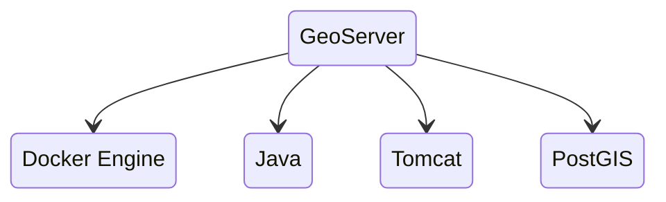
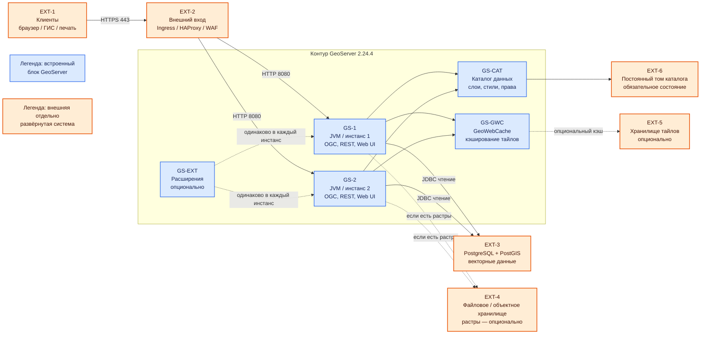

# GeoServer 2.24.4 — развёртывание и настройка

GeoServer — сервер картографических протоколов OGC: картинка карты (WMS), объекты (WFS), готовые квадратики тайлов (WMTS). Этот документ про **классический** GeoServer **2.24.4** (последний патч линии 2.24.x; релиз **18 июня 2024**, вместе с GeoTools 30.4 и GeoWebCache 1.24.4). Это не GeoServer Cloud (микросервисы и другой Helm) и не платформа GeoData ООО «АйТи Гео».

Документация линии: https://docs-archive.geoserver.org/2.24.x/en/user/  
Скачивание: https://geoserver.org/release/2.24.4/  
Официальный контейнер: `docker.osgeo.org/geoserver`. Для боя **не** тег `2.24.x` (в руководстве 2.24 это nightly), а **конкретный патч `2.24.4`**, если он есть в реестре OSGeo; иначе — свой образ из **WAR 2.24.4** на Tomcat 9.

**Критично по версии.** По расписанию проекта линия **2.24.x**: stable сентябрь 2023, maintenance апрель 2024, **конец жизни — август 2024**. На дату подготовки этого файла (август 2026) линейка **два года без официальных патчей**. 2.24.4 закрывал в том числе **CVE-2024-36401 (удалённый запуск кода, Critical)**. Всё, что нашли **после** июня 2024, в 2.24.x проект **не чинит**. Документ описывает **запрошенную** версию; считать её готовой к бою с гособменом без отдельного решения ИБ **нельзя**.

Этот текст — не набор команд «скопируй docker run», а правила, без которых система не будет одновременно устойчивой к сбоям, масштабируемой и безопасной. Пошаговая установка — в `GeoServer.install.md`.

---

## Назначение системы

GeoServer нужен, чтобы **отдать геометрию стандартными протоколами**: «нарисуй карту», «отдай объекты», «отдай тайл». Руководитель или сервис открывает слой «земельные участки» / «охранные зоны», не таща терабайты JSON в браузер.

Система **публикует то, что лежит в хранилище** (обычно PostgreSQL с PostGIS). Она **не** хранит эталон контуров, **не** заменяет очередь событий, **не** исполняет бизнес-процессы и **не** ходит в государственные сервисы. Упал PostGIS — карта пустая при живом интерфейсе.

Нечестная роль: «положим эталон только в файл внутри каталога GeoServer и размножим три зала». Файловое хранилище на сетевой папке между площадками и три писателя каталога — это гонка, не устойчивость.

---

## Перечень функций

Что умеет классический GeoServer 2.24:

1. **Отдавать картинку карты** (WMS): слои, область, стиль. Тяжёлая нагрузка на CPU и память, особенно на растрах.
2. **Отдавать объекты** (WFS) в GML/GeoJSON. Чтение. Запись (WFS-T) в бою часто **выключают**.
3. **Отдавать покрытие/растр** (WCS) — сетку значений, не картинку для глаз.
4. **Отдавать готовые тайлы** (WMTS и родственники) через встроенный **GeoWebCache**, чтобы не рисовать WMS на каждый сдвиг карты.
5. **Считать на сервере** (WPS: буфер, пересечение). Состояние заданий между нодами **не** общее без отдельного расширения.
6. **Вести каталог**: рабочие области, подключения к данным, слои, стили. В классическом GeoServer это XML-файлы в **каталоге данных** на диске.
7. **Ограничивать доступ** к слоям (своя подсистема пользователей). Keycloak из коробки нет (есть экспериментальные модули).
8. **Ставить расширения** в каталог библиотек: лимиты параллельных запросов (control-flow), тайлы в объектное хранилище (gwc-s3) и другие. Набор должен быть **одинаковым** на всех нодах и **той же** мелкой версии, что сервер.

Чего система **не** делает и часто путают: она не озеро эталона, не шина событий, не Camunda, не GeoData, не кворум «пережили площадку сами». Несколько копий за балансировщиком переживают падение **пода**, не падение **единственного PostGIS**. Официального оператора Kubernetes для WAR 2.24 нет. ГОСТ-криптографии нет. Терабайты живут в PostGIS и файлах, GeoServer держит **рабочий набор** (память, соединения, тайлы). Реплики подов бэкап каталога не заменяют.

---

## Основные элементы системы и зависимости

GeoServer — **одно Java-приложение** в контейнере сервлетов. Для параллельной обработки запускают несколько одинаковых экземпляров приложения; самостоятельного кластерного процесса, выборов лидера и кворума в ядре нет. Ниже отдельно показаны встроенные части GeoServer и внешние системы, которые развёртываются и сопровождаются независимо.

### Схема инстансов и потоков

Синие блоки — процессы и логические компоненты поставки GeoServer. Оранжевые — **внешние, отдельно развёртываемые системы**. Сплошная стрелка обозначает основной поток, пунктирная — опциональный поток или дополнение. Блоки «Легенда» внутри схемы показывают те же цвета.

### Описание блоков

#### EXT-1 — клиенты

- **Технологии/варианты:** веб-браузер, настольная ГИС, сервер печати, прикладной сервис или портал.
- **Назначение:** запрашивать карты, объекты, покрытия и тайлы по WMS, WFS, WCS и WMTS.
- **Тип:** внешний блок, в GeoServer не входит.

#### EXT-2 — внешний вход

- **Технологии/варианты:** Kubernetes Ingress, HAProxy; WAF может стоять перед ними или выполнять роль общего края.
- **Назначение:** единая HTTPS-точка, завершение TLS, балансировка между `GS-1` и `GS-2`, сетевые ограничения для Web UI и REST.
- **Тип:** внешняя отдельно развёртываемая система; обязательна для показанной многонодовой схемы, конкретный продукт GeoServer не задаёт.

#### GS-1 и GS-2 — экземпляры GeoServer

- **Технологии/варианты:** классический GeoServer 2.24.4 как WAR в Tomcat 8.5/9 либо контейнер OSGeo с зафиксированным патч-тегом.
- **Назначение:** обработка OGC-запросов, REST-настройки и Web UI; каждый экземпляр сам читает данные и строит ответ.
- **Тип:** встроенный основной процесс. Второй и последующие экземпляры **опциональны**: один подходит для стенда, несколько — для горизонтального масштабирования и переживания отказа процесса.
- **Условие:** версия, каталог и набор расширений должны совпадать. Между экземплярами нет штатного протокола кворума.

#### GS-CAT — каталог данных

- **Технологии/варианты:** XML-файлы в `GEOSERVER_DATA_DIR`; физически каталог размещается на постоянном томе.
- **Назначение:** хранить рабочие области, подключения, слои, стили, права и настройки сервисов.
- **Тип:** встроенная и **обязательная** часть GeoServer; носитель `EXT-6` внешний относительно процесса.
- **Условие:** независимые каталоги дают разную конфигурацию. Общий каталог между дата-центрами нельзя считать безопасной синхронизацией без проверки задержек и блокировок.

#### GS-GWC — GeoWebCache

- **Технологии/варианты:** встроенный GeoWebCache; локальный дисковый кэш или внешнее общее хранилище, включая объектное с совместимым расширением.
- **Назначение:** хранить готовые тайлы, чтобы не перерисовывать WMS при каждом перемещении карты.
- **Тип:** встроенный компонент, но кэширование **опционально**; WMS/WFS работают без прогретого кэша.
- **Условие:** локальные кэши инстансов независимы. Общее хранилище нужно, только если требуется единая версия тайлов; кэш можно пересчитать, и он не заменяет бэкап каталога.

#### GS-EXT — расширения

- **Технологии/варианты:** `control-flow`, WPS, `gwc-s3` и другие модули подходящей поставки.
- **Назначение:** лимиты запросов, серверная геообработка, внешнее хранение тайлов и другие возможности.
- **Тип:** **опциональные** модули, не обязательные для базовых WMS/WFS.
- **Условие:** версия расширения должна совпадать с версией сервера; набор одинаков на всех инстансах. Экспериментальный модуль не превращает ядро в штатный кластер.

#### EXT-3 — PostgreSQL + PostGIS

- **Технологии/варианты:** PostgreSQL с PostGIS; возможны и другие поддерживаемые GeoServer источники векторных данных.
- **Назначение:** хранить геометрию и атрибуты публикуемых слоёв.
- **Тип:** внешняя отдельно развёртываемая система. PostGIS **опционален для GeoServer**, но нужен в этой схеме, если векторные данные находятся в нём.
- **Условие:** реплики GeoServer не обеспечивают отказоустойчивость и бэкап PostGIS. Для публикации без записи используется JDBC-учётка только на чтение.

#### EXT-4 — хранилище растров

- **Технологии/варианты:** GeoTIFF и другие поддерживаемые форматы на файловом хранилище; объектное хранилище — при совместимом способе доступа.
- **Назначение:** хранить исходные растровые покрытия и пирамиды.
- **Тип:** внешний и **опциональный** блок; отсутствует, если растры не публикуются.

#### EXT-5 — хранилище тайлов

- **Технологии/варианты:** локальный диск, общий том или объектное хранилище через совместимое расширение, например `gwc-s3`.
- **Назначение:** сохранять результат работы `GS-GWC`.
- **Тип:** внешний носитель и **опциональный** блок. Отдельное общее хранилище требуется не всегда.
- **Условие:** потеря производных тайлов ухудшает скорость и вызывает повторную генерацию, но не должна уничтожать конфигурацию слоёв.

#### EXT-6 — постоянный том каталога

- **Технологии/варианты:** постоянный том Kubernetes, локальный SSD или иной файловый носитель с подходящей семантикой блокировок.
- **Назначение:** сохранять `GS-CAT` при пересоздании процесса.
- **Тип:** внешний носитель встроенного каталога; постоянное хранение каталога **обязательно**, технология тома выбирается отдельно.
- **Условие:** том с доступом только для одного пода нельзя одновременно подключить ко всем репликам. Сетевую папку между площадками нельзя объявлять HA без измерений и испытаний.

### Как подробно читать схему

1. Клиент `EXT-1` не знает адрес конкретной JVM: он обращается к одному публичному имени по **HTTPS 443**.
2. `EXT-2` выбирает живой инстанс. Внутренний HTTP GeoServer в официальном Docker использует **8080**. Две стрелки означают балансировку, а не обмен состоянием между JVM.
3. Выбранный инстанс разбирает запрос. Для WMS он читает данные, применяет стиль и формирует изображение; для WFS возвращает объекты; для WMTS сначала проверяет GeoWebCache.
4. Каждый инстанс обращается к источникам сам. Поэтому доступ к `EXT-3` и, при наличии растров, к `EXT-4` нужен от каждой JVM. Балансировщик данные слоёв не переносит.
5. `GS-CAT` хранит не геометрию и не тайлы, а правила публикации. При его потере данные останутся в PostGIS, но GeoServer перестанет знать, как их публиковать.
6. Связь `GS-CAT → EXT-6` разделяет формат и носитель: формат каталога встроен, долговечность обеспечивает выбранный том. Для нескольких JVM нужна одна согласованная правда или управляемая доставка одинаковых копий.
7. `GS-GWC` встроен. Пунктир к `EXT-5` подчёркивает опциональность отдельного кэша: без него ответ вычисляется заново. При локальных кэшах один тайл может обновиться на инстансах в разное время.
8. Пунктир к `EXT-4` означает, что растровое хранилище появляется только при публикации растров. Векторный контур с PostGIS может работать без него.
9. `GS-EXT` — не отдельный сервис, а логический блок JAR-модулей. Стрелки к обеим JVM требуют одинаковой установки в каждый инстанс.
10. На схеме нет Kafka, Camunda и государственного интеграционного API: GeoServer их не заменяет и для стандартной публикации карт не включает в свои потоки.
11. Прямой стрелки между `GS-1` и `GS-2` нет: ядро не выбирает лидера и не реплицирует данные слоёв. Отказ процесса переживается, только пока вход, каталог и источники доступны оставшемуся.
12. Цвет обозначает границу поставки, а не обязательность. Например, `EXT-6` внешний и обязательный носитель; `GS-GWC` встроен, но применение кэша опционально.

Рядом, но это уже другое ПО: PostgreSQL/PostGIS, объектное хранилище тайлов, Ingress/HAProxy, озеро эталона. GeoData (IT Geo) — другой стек.

### Что входит в состав

| Роль | Зачем | Встроенность и опциональность | Как масштабируется |
|---|---|---|---|
| **OGC-сервисы** | Карта и объекты клиентам | Встроены, основной состав | Несколько одинаковых JVM за балансировщиком при согласованных каталоге и данных |
| **Админка и REST** | Менять слои и права | Встроены; внешний доступ опционален | Обычно **один** писатель конфигурации |
| **GeoWebCache** | Тайлы | Встроен; кэширование **опционально** | Общее хранилище либо независимые локальные кэши |
| **Подсистема прав** | Кто видит слой | Встроена | Конфигурация хранится в каталоге данных |
| **Расширения** | Лимиты, S3-тайлы, WPS, … | **Опциональны** | Одинаковая версия и набор на всех JVM |

### Официальные порты (контракт сети)

| Порт | Назначение |
|---|---|
| **8080/TCP** | HTTP приложения в официальном Docker (`/geoserver`). Снаружи обычно **443** |
| **8009** и хвосты AJP | Не открывать наружу |
| **8443** | Если включили HTTPS **внутри** контейнера — проверить на теге 2.24.4 |

UDP нет. Балансировщик HTTP(S) перед нодами — штатная схема из production-документации.

### Зависимости окружения

- Сеть до хранилища: JDBC к PostGIS; пути к GeoTIFF и объектному хранилищу нужны **только при использовании** соответствующих источников.
- В Kubernetes: для **нескольких** реплик с общим каталогом нужен диск, который можно отдать нескольким подам сразу. Диск «только одному» + три реплики = не стартуют или портят конфиг. Либо 1 реплика, либо каталог вынесен иначе, либо свой диск на под (тогда нужен другой способ синка).
- TLS обычно на входе, не внутри контейнера. Cookie сессии в бою: флаг **Secure**.
- Бэкап: каталог данных + файлы прав + PostGIS. Тайлы можно пересчитать.

---

## Краткие вводные

### Как устроена отказоустойчивость

В ядре **нет** выборов лидера и кворума. «Кластер» — несколько узлов за общим прокси, один публичный базовый URL, **одна** правда каталога.

**1) Процесс (JVM / под)**

| Что падает | Что происходит |
|---|---|
| Один под из нескольких за входом | Остальные отдают карту, если хранилище жив |
| Все поды в одном дата-центре | Падение площадки = нет карты, даже если PostGIS в других залах |
| Единственный под | Любой рестарт = простой. Это стенд, не бой |

**2) Каталог**

Официальная формулировка проблемы: *the challenge is management of changes to the data directory*. Пока это не решено, «три реплики» — три разных сервера с риском трёх каталогов.

| Схема | Живой узел | Слабое место |
|---|---|---|
| Один каталог на одном поде | Просто | Потеря диска = потеря публикации слоёв |
| Общий каталог на все ноды | Все видят одни XML | Блокировки файлов, задержка, «кто последний записал» |
| Писатель один, остальные копия | Читатели стабильны | Выкат конфига = процедура |
| Экспериментальные JMS / каталог в СУБД | Конфиг едет иначе; **данные слоёв — нет** | Не стабильный релиз; после конца жизни 2.24 патчей нет |

**3) Данные слоёв**

PostGIS/файлы/объектка должны быть доступны **каждой** ноде сами. Устойчивость PostGIS — отдельный проект.

**4) Тайлы**

Свой каталог на каждом поде = мигание. Общее хранилище (диск в пределах зала или расширение gwc-s3 из стабильного списка). Тайлы не заменяют бэкап каталога.

**5) Админка**

Падение UI ≠ падение карты, если ноды уже сконфигурированы. Один писатель конфига — точка отказа **изменения** слоёв, не обязательно чтения.

### Как устроено масштабирование

Несколько независимых осей:

1. **Больше одновременных картинок карты** → больше JVM **и** лимиты control-flow (иначе нехватка памяти). Ориентир модуля: ~**2 × ядер** параллельных GetMap **на инстанс**.
2. **Карта как подложка** → кэш тайлов (предрасчёт). Это главный рычаг WMS, не «ещё 64 ГиБ кучи».
3. **Больше объектов WFS** → лимиты числа объектов и индексы PostGIS, не раздувание кучи.
4. **Больше растра** → куча + кэш тайлов + пирамиды на диске.
5. **Десятки тысяч слоёв** → XML-каталог на диске уже некомфортен; в документации для этого фигурирует экспериментальный каталог в СУБД.

Цифр «ядер под терабайты» нет.

### Безопасность самого GeoServer

Компрометация с заводским `admin` / `geoserver` = полный каталог слоёв, часто **учётки JDBC** в подключениях, возможность записи через WFS, если не выключили. Для контура с геометрией клиентов это утечка персональных и пространственных данных.

- Дефолт админки: **`admin` / `geoserver`**. Сменить до любого входа наружу. В README образа — сменить также пароль хранилища ключей (проверить на теге 2.24.4).
- 2.24.4 закрывал RCE и сопутствующие дыры; линейка после конца жизни новые дыры **не получает**.
- WFS «только чтение»: уровень сервиса без транзакций + учётка базы только на чтение.
- Разбор XML: по умолчанию внешние http/https **не ограничены**. Для боя — белый список. Галочка «без ограничений» **снимает** защиту.
- Не светить переменные окружения на странице статуса (в 2.24.4 чинили утечку).
- CSRF: не выключать «чтобы интерфейс заработал за прокси»; задать белый список доменов.
- CORS в примерах Tomcat — любой сайт. Для закрытого контура нужен явный адрес вашего UI.
- HSTS по умолчанию **выключен**. Сессия: HttpOnly есть; **Secure в бою включить**.
- Админку в бою часто выключают, REST — из внутренней сети.
- Сэмплы вроде `topp:states` снять.
- «Поднять docker на 8080 и выдать в интернет» — это новый WFS ко всему каталогу, не ГИС-платформа.

---

## Допущения

Ниже то, чего не было в исходном запросе, но без чего нельзя нарисовать конкретную схему. Если допущение неверно — схему надо пересмотреть.

1. Берём **классический 2.24.4** (WAR/Docker OSGeo), не Cloud и не Enterprise.
2. Бой крутится в Kubernetes, но **официального оператора под WAR 2.24 нет**.
3. Три дата-центра = три независимых отказа. Если это три зала с одним дисковым массивом и одним PostGIS без копии — схема врёт.
4. Цель отказа по карте: пережить 1 дата-центр с нодами GeoServer, **если** PostGIS и каталог этот зал тоже переживают.
5. Нагрузки (запросы в секунду, размер растра, число слоёв) нет — нет цифры «N реплик и M кучи».
6. Формального круглосуточного обещания нет. Живая картинка ≠ «тайл обновился сразу после кадастровой сделки».
7. Основное хранилище — PostGIS. Растры — отдельно, если появятся.
8. Запись через WFS в бою выключена; геометрию пишут ваши сервисы в озеро/БД.
9. Люди в бою — не общий `admin`. Штатного Keycloak в стабильном 2.24 нет.
10. Шифрование канала — TLS на входе. ГОСТ не озвучен.
11. Учебный стенд изолирован. Дефолтный пароль — только пока порт не уходит дальше ноутбука.
12. Экспериментальные модули кластера в бою не считаются «официальной устойчивостью».
13. Лицензия GPL. Юристы — отдельно.
14. Заказчик сознательно остаётся на линейке с закончившейся жизнью. Иначе целевая поддерживаемая линия на август 2026 — другой документ (текущие Stable/Maintenance на geoserver.org).

---

## Критически важные условия, которых нет в исходном контексте

Их нужно закрыть **до** «накрутили три реплики».

| Пробел | Почему это ломает решение |
|---|---|
| **Конец жизни 2.24 + ИБ** | Два года без патчей на контуре с геометрией. Это не «мелочь версии» |
| **Что публикуем** | Разные лимиты, права слоёв, кэш, персональные данные. «Терабайты» без состава — не смета кучи |
| **Где живёт геометрия** | Устойчивость карты = устойчивость этого хранилища |
| **Один Kubernetes на три площадки или три** | Общий диск и JDBC на три зала требуют сети и блокировок. Иначе — актив в одном зале + восстановление |
| **Задержка до каталога и до PostGIS между залами** | Каталог на «общей папке через город» даёт таймауты и битый XML. Порога в доке **нет** |
| **Нужен ли живой синк каталога** или достаточно выката раз в день | От этого зависит схема каталога |
| **Тайлы: пересчитывать или хранить** | Без общего кэша три ноды = три правды картинки |
| **Кто ходит в админку** | Публичный `/web` с `admin`/`geoserver` — инцидент |
| **Нужен ли WPS** | Состояние заданий между нодами не общее без отдельных расширений |
| **Есть ли тег 2.24.4 в реестре OSGeo** | Документация 2.24 показывает nightly. Наличие патч-тега надо **проверить** |
| **Какая Java внутри образа 2.24.4** | Актуальный Dockerfile репозитория docker (2026) для линейки 2.x указывает JDK 17. Для **конкретного** 2.24.4 смотреть слои. Java 17 в руководстве 2.24 — экспериментально |

---

## Глоссарий специальных терминов

| Термин | Значение в этом документе |
|---|---|
| **OGC** | Open Geospatial Consortium — организация, спецификации которой задают стандартные геосервисы. |
| **WMS** | Web Map Service — запрос готового изображения карты из слоёв и стилей. |
| **WFS** | Web Feature Service — чтение векторных объектов и атрибутов; WFS-T добавляет транзакционную запись. |
| **WCS** | Web Coverage Service — выдача покрытий: растровых или иных пространственных сеток значений. |
| **WMTS** | Web Map Tile Service — выдача карты фиксированными тайлами. |
| **WPS** | Web Processing Service — запуск пространственных операций на сервере. |
| **Тайл** | Небольшой готовый фрагмент карты для конкретных масштаба и координат. |
| **GeoWebCache (GWC)** | Встроенный компонент генерации и хранения тайлов. |
| **Каталог данных (`GEOSERVER_DATA_DIR`)** | Файловая конфигурация подключений, слоёв, стилей, прав и сервисов; это не хранилище всей геометрии. |
| **Инстанс / JVM / нода** | Один запущенный процесс Java с экземпляром GeoServer; в Kubernetes обычно соответствует одному поду. |
| **WAR** | Архив Java Web Application, разворачиваемый в контейнере сервлетов, например Tomcat. |
| **Контейнер сервлетов** | Java-среда, которая запускает WAR и принимает HTTP-запросы. |
| **Ingress** | Внешняя точка входа Kubernetes, направляющая HTTP(S)-трафик к подам. |
| **WAF** | Web Application Firewall — внешний фильтр веб-запросов перед приложением. |
| **JDBC** | Стандартный интерфейс Java для подключения к реляционной базе данных. |
| **PostGIS** | Расширение PostgreSQL для пространственных данных и индексов. |
| **Объектное хранилище** | Внешняя система хранения объектов по ключам; не обычная общая файловая папка. |
| **Постоянный том** | Хранилище, которое сохраняется при пересоздании контейнера или пода. |
| **Control-flow** | Опциональное расширение, ограничивающее параллельные запросы и очередь. |
| **Capabilities** | XML-описание операций, слоёв, форматов и адресов OGC-сервиса. |
| **Публичный базовый URL** | Внешний адрес GeoServer, возвращаемый клиентам вместо внутреннего адреса пода. |
| **Кворум** | Согласование состояния большинством участников; ядро классического GeoServer его не предоставляет. |
| **HA / отказоустойчивость** | Продолжение обслуживания при отказе компонента; несколько JVM не создают HA внешних хранилищ автоматически. |

## Источники (чтобы не принимать на веру)

- Релиз 2.24.4, CVE-2024-36401: https://geoserver.org/release/2.24.4/
- Конец жизни / Java 11 / Tomcat 8.5–9: https://github.com/geoserver/geoserver/wiki/Release-Schedule
- Руководство 2.24 (архив): https://docs-archive.geoserver.org/2.24.x/en/user/
- Java 11 vs 17: https://docs-archive.geoserver.org/2.24.x/en/user/production/java.html
- JVM, контейнер: https://docs-archive.geoserver.org/2.24.x/en/user/production/container.html
- Боевые настройки, WFS, XML, админка: https://docs-archive.geoserver.org/2.24.x/en/user/production/config.html
- Кластер = ноды за прокси: https://docs-archive.geoserver.org/2.24.x/en/user/production/misc.html
- Docker 2.24 (nightly `2.24.x`): https://docs-archive.geoserver.org/2.24.x/en/user/installation/docker.html
- Дефолт `admin` / `geoserver`: https://docs.geoserver.org/2.24.x/en/user/gettingstarted/web-admin-quickstart/index.html
- Control-flow (ориентир 2×CPU): https://docs-archive.geoserver.org/2.24.x/en/user/extensions/controlflow/index.html
- GeoServer Cloud (другой продукт): https://geoserver.org/geoserver-cloud/deploy/kubernetes/

Утверждения вида «GeoServer сам переживёт два дата-центра» или «N миллисекунд — можно общий каталог» в документации **отсутствуют**. Задержку до PostGIS и до каталога надо измерить у себя. Пример кучи `-Xmx756M` **не** норма вашего боя.
