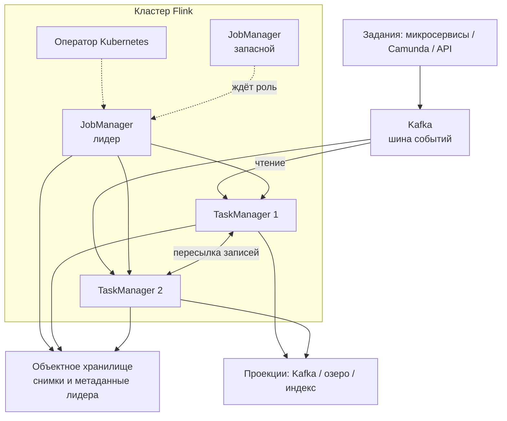

# Apache Flink 2.2.1 — развёртывание и настройка

Apache Flink — потоковый движок: читает события, считает окна и соединения, пишет результат. Этот документ про **свою установку** версии **2.2.1** (релиз 15 мая 2026, последний патч линии 2.2). Это не облачный сервис вендора и не коммерческая обвязка.

Документация линейки: https://nightlies.apache.org/flink/flink-docs-release-2.2/  
Образ: `flink:2.2.1-java17` (официальный Docker Hub; Java 17 — рекомендуемый рантайм в документации 2.2).

На Kubernetes официальный путь: **Apache Flink Kubernetes Operator 1.15.0** (26 мая 2026). Он **проверен против Flink 2.2**. На дату документа последний релиз *самого* Flink — **2.3.0** (25 июня 2026); анонс оператора 1.15.0 линейку 2.3 **не перечисляет**. Поэтому бой на Kubernetes здесь — **2.2.1 + оператор 1.15.0**.

Коннектор к шине: **Apache Flink Kafka Connector 5.0.0** (совместим с Flink 2.1.x и **2.2.x**). Коннекторы выпускаются **отдельно** от ядра — версию фиксируют явно.

Этот текст — не набор команд «скопируй YAML», а правила, без которых система не будет одновременно устойчивой к сбоям, масштабируемой и безопасной. Пошаговая установка — в `Apache Flink.install.md`.

Flink **не** шина событий, **не** озеро эталона, **не** Camunda и **не** интеграционное API к ведомствам.

---

## Назначение системы

Flink нужен, чтобы **непрерывно превращать поток событий в проекции**: обогащение, окна, дедупликация, запись в другой топик, озеро или индекс. События приходят из Kafka. Эталон карточек живёт в озере. Процессы ведёт Camunda. Наружу ходит интеграционное API.

Система держит **рабочее состояние задания** (окна, ключи, позиции во входе). Снимок состояния — не копия озера. Точечные правки «как в PostgreSQL» и юридически значимые карточки здесь живут плохо: после сбоя задание **переигрывает вход** с последнего успешного снимка.

Если вся обработка — «прочитал JSON, записал в базу» без окон и без согласованного рестарта, Flink может оказаться лишним слоем. Это развилка продукта, не «надо потому что есть события».

---

## Перечень функций

Что умеет Apache Flink 2.2 OSS:

1. **Выполнять задания**: поток (живёт, пока не остановили) или пакет (пока не дочитал вход).
2. **Планировать работу** процессом JobManager: в каждый момент лидер **один**. Без запаса это одна точка отказа.
3. **Считать на рабочих процессах** (TaskManager): чтение, преобразование, окна, запись. Падение рабочего — не гибель кластера, если есть снимок: задание **перезапускается** с него.
4. **Снимать снимок состояния** (чекпоинт): позиции во входах + управляемое состояние. Чтобы после сбоя продолжить «как будто сбоя не было» *для этого состояния*.
5. **Снимать снимок «для людей»** (сейвпоинт): смена версии, смена графа, переезд. Его создаёте и удаляете сами.
6. **Хранить рабочее состояние** в куче JVM или на локальном диске (RocksDB). Куда уезжает **копия** при снимке — отдельно: куча JobManager (только стенд) или файловая/объектная система.
7. **Выбирать лидера JobManager** через Kubernetes или ZooKeeper плюс каталог метаданных.
8. **Читать и писать Kafka** актуальными API источника и приёмника. Гарантия записи в Kafka задаётся отдельно; заводской режим приёмника — **без гарантии**.
9. **Масштабировать параллелизм** операторов (сколько рук одновременно). Параллелизм источника не выше числа партиций топика.
10. **Отдавать REST и UI** на порту **8081**.

Чего система **не** делает и часто путают: она не хранит лог «навсегда» (это Kafka), не озеро эталона, не BPMN, не реестр схем, не «ровно один раз до любого приёмника» (обычный INSERT в JDBC при рестарте даст дубли). Официального порога задержки сети между площадками нет. Шифрования состояния на диске рабочего из коробки нет. ГОСТ-криптографии нет. ZooKeeper на Kubernetes **не обязателен** (типичен выбор лидера через Kubernetes). Экспериментальный backend «состояние на объектке» в 2.2 в бой не берём.

«Поставили Flink, значит ровно один раз» — **неверно**.

---

## Требования к развёртыванию

### Требования к ПО

| Что | Что ставить | Комментарий |
|---|---|---|
| **Формат поставки** | Контейнеры Docker **или** поды Kubernetes | Образ `flink:2.2.1-java17`. Свой образ: база + задание + плагин объектного хранилища + коннекторы |
| **Kubernetes** | Оператор **1.15.0** | Helm с архива Apache, метка **1.15.0**, не `latest`. Режим Native (не Standalone: адрес с IP пода ломает выбор лидера). Flink 2.3.0 на этом операторе **не** заявлен |
| **ОС** | Linux x86_64 или ARM64 | **Боевой Flink на Windows-хосте в схеме с Kubernetes не предполагается** |
| **Java** | **17** рекомендуется | Java 11 поддерживается. Java 21 в 2.2 — **экспериментально**. Пинить 17 на менеджере, рабочих и в архиве задания |
| **Диск рабочего** | Локальный быстрый диск (SSD) для RocksDB | Рабочее состояние ≠ снимок. Пустой том пода переживает рестарт только пока жив узел. Снимок должен быть **вне** пода |
| **Снимки и метаданные лидера** | S3-совместимое хранилище (или HDFS) | Куча JobManager — только разработка / крошечное состояние. Плагин **flink-s3-fs-presto** в документации S3 назван рекомендуемым *для снимков в S3* |
| **Kafka** | Живой кластер (у вас отдельный документ) | Для режима «ровно один раз» в приёмник — транзакции брокера и запас по таймауту транзакции |
| **Часы** | NTP | Иначе снимки, TLS и отладка живут в кривой вселенной |
| **Лицензия** | Apache 2.0 на ядро | Отдельного license-server нет. Следить за составом коннекторов |

Лимит открытых файлов и модель памяти рабочего задают **явно**. Не задавать сразу «размер процесса» и «размер Flink внутри» — документация: конфликт, возможен отказ старта.

### Требования к ресурсам

Цифр «сколько ядер на ваши терабайты озера» **нет** — нагрузки не было. Терабайты в озере **не равны** терабайтам состояния Flink. Состояние — окна, агрегаты, буферы соединений, позиции Kafka. Если задание — простое преобразование без окон, состояние крошечное. Если «окно 90 дней по всем клиентам в состоянии по ключу» — диск рабочего может стать главным.

| Роль | CPU | RAM | Диск |
|---|---|---|---|
| **JobManager** | Вертикаль под метаданные задания, не «от мегабайт в секунду» | Запас под метаданные; много мелких заданий на одном менеджере — антипаттерн боя | Метаданные лидера — **не** на диске одного пода, а во внешнем каталоге |
| **TaskManager** | Параллелизм задания × слоты | Задавать `taskmanager.memory.process.size` (для контейнера это размер пода) | Для RocksDB — **локальный SSD**; NFS как рабочий каталог не путь |
| **Учебный один контейнер** | Минимальные | Хватит меньше боевого | Снимок на локальный файл или в куче менеджера — только здесь |

Дополнительно:

- Восстановление большого состояния с RocksDB может быть долгим. Времени в минутах документация **не даёт** — замерить.
- Бакет снимков только в одном зале = восстановление в другом зале упирается в этот бакет.
- На тестовой песочнице боевые объёмы не требовать. В бой это не переносить.

---

## Основные элементы системы и зависимости

Это одно ПО из **нескольких процессов**. Ниже — те, что живут отдельными инстансами.

### Схема инстансов и потоков



Как читать схему:

1. Люди и автоматизация ходят на **8081** (REST/UI). На внутренний обмен рабочих клиентов **не пускают**.
2. **JobManager** планирует и ведёт снимки. Запасной ускоряет смену лидера; задание **всё равно перезапускается** (формулировка оператора).
3. **TaskManager** считает. Несколько рабочих — параллелизм и запас при падении одного, не «копии как у Kafka».
4. Пересылка записей между рабочими чувствительна к задержке сети. Размазать рабочие по городам = гнать этот обмен через город.
5. Снимки уезжают в объектное хранилище. Копия рабочего спасает от падения **пода**, не от «удалили бакет» и не от шифровальщика.
6. Оператор смотрит объекты Kubernetes и делает выкат. Падение оператора **не** роняет уже бегущие задания, но никто не вылечит пропавший JobManager.

Рядом, но это уже другое ПО: Kafka, объектное хранилище, Prometheus, реестр схем, озеро. Их отказ проектируется отдельно.

### Что входит в состав

| Роль | Зачем | Как масштабируется |
|---|---|---|
| **JobManager** | План, снимки, REST | Вертикаль. Для запаса — вторая копия, не «ещё менеджер от нагрузки» |
| **TaskManager** | Счёт, окна, обмен, локальный RocksDB | Больше рабочих и/или слотов. Параллелизм задания должен совпасть со слотами |
| **Клиент** | Собрать граф и сдать | Не масштабируют «как сервис» |
| **Сервис выбора лидера** | Кто сейчас JobManager | Kubernetes или ZooKeeper. На Kubernetes типичен Kubernetes |
| **Хранилище снимков** | Долговечные копии состояния | Отдельное **внешнее** хранилище |
| **Плагины ФС и коннекторы** | S3, Kafka, JDBC | В образ **до** старта |

### Официальные порты (менять можно, это контракт сети)

| Порт | Назначение |
|---|---|
| **8081/TCP** | REST API и Web UI JobManager |
| **6123/TCP** | Внутренний вызов JobManager. При запасе лидера рабочие **находят** его через сервис выбора, не через зашитый адрес |
| **blob / вызов рабочего / данные** | Часто ОС выдаёт свободный порт. В сетевой политике нельзя «разрешить только 6123» и считать внутренний трафик закрытым |

UDP нет. Клиенты ходят на **8081**, не на обмен рабочих.

### Зависимости окружения

- Сеть рабочий↔рабочий и рабочий↔менеджер. Это не HTTP-повторы «как у REST».
- В Kubernetes: диск с предсказуемой скоростью для RocksDB. Снимки **не** единственная копия на томе одной рабочей.
- PKI для боя, если включаете TLS REST/внутренний.
- Kafka: живой кластер; для режима «ровно один раз» — транзакции.

---

## Краткие вводные

### Как устроена отказоустойчивость

Это **не** кворум данных как у Kafka (три копии каждого сообщения). Это **снимки + переигрывание входа**.

**1) Снимок задания**

Пока снимки выключены, при падении рабочего задание либо умрёт, либо (заводская стратегия без снимков) **не перезапустится**.

Когда снимки включены: периодически все операторы снимают состояние и позиции; копия уезжает в хранилище; при сбое Flink откатывается на последний **успешный** снимок и перечитывает Kafka **с сохранённых позиций**.

| Что падает | Что происходит |
|---|---|
| Одна рабочая, снимок свежий, хранилище жив | Задание перезапускается. Дубли на выходе зависят от гарантии приёмника |
| JobManager без запаса | Новые задания не сдать; бегущие **падают** |
| JobManager с запасом, каталог метаданных жив | Новый лидер поднимает задание со снимка. Задание **всё равно рестартится** |
| Потерян каталог снимков / метаданных | Восстановление **из Flink** невозможно. Остаётся вход в Kafka (если срок хранения ещё держит) |
| Снимок только в куче JobManager | Падение менеджера = нет снимка |
| Срок хранения Kafka короче дыры без снимка | Позиция указывает в уже вычищенный лог → дырка или падение источника |

Сколько данных готовы потерять ≈ интервал снимка плюс время, пока снимок ещё не завершился. Интервал «как в учебнике 10 секунд» на большом состоянии может не успевать.

**2) Сейвпоинт ≠ снимок**

Плановый выкат версии, смена параллелизма, смена места состояния — через сейвпоинт. Снимок оптимизирован «тот же код, быстрый рестарт». Путать их — типичная причина «после релиза состояние не встало».

Автоматическое восстановление идёт с **последнего снимка**, не с периодических сейвпоинтов.

**3) «Ровно один раз» до Kafka и дальше**

Цепочка честная только если: снимки включены в режиме с выравниванием; приёмник Kafka в режиме транзакций + уникальный префикс транзакций; потребители проекции читают только подтверждённые; таймаут транзакции на брокере **больше**, чем длительность снимка плюс рестарт.

Записи в топике **видны после снимка**. Это не баг. Заводской приёмник Kafka — **без гарантии**.

**4) Оператор**

Две реплики оператора **без** выбора лидера = два активных контроллера, конфликт. С выбором лидера — норма.

### Как устроено масштабирование

Несколько независимых осей:

1. **Больше CPU на оператор** → поднять параллелизм и дать столько слотов.
2. **Больше места под состояние** → RocksDB + локальный диск, не раздувать кучу «как у обычного Java-сервиса».
3. **Больше входного Kafka** → сначала партиции, потом Flink. Лишние руки источника простаивают.
4. **Автомасштаб оператора** — после стабильного снимка и метрик, не в день первого выката.
5. **JobManager** почти не масштабируют «от мегабайт в секунду».

### Безопасность самого Flink

Компрометация REST менеджера = остановить задание, снять сейвпоинт, иногда влиять на запуск. Компрометация рабочего = рабочая копия состояния (персональные данные, ответы ведомств) и сеть к Kafka.

- Внутренний обмен и внешний REST — **разные** флаги TLS.
- REST по умолчанию **не спрашивает**, кто клиент. Рекомендуемый путь: REST только внутри + прокси с нормальным входом.
- Оператор **пишет в журнал разницу** манифеста. Ключи хранилища и Kafka в тексте объекта = ключи в логах.
- Открытый 8081 в интернет с открытым текстом — панель управления кластером, не «удобный мониторинг».

---

## Допущения

Ниже то, чего не было в исходном запросе, но без чего нельзя нарисовать конкретную схему. Если допущение неверно — схему надо пересмотреть.

1. Берём **Apache Flink 2.2.1 + Kafka Connector 5.0.0**, не коммерческую платформу и не облако.
2. Бой в Kubernetes, установщик — **оператор 1.15.0**, режим Native. Режим приложения: один запуск на приложение, если нужен запас лидера (несколько запусков + запас документация **не поддерживает**).
3. Три дата-центра = три независимых отказа.
4. Цель отказа: пережить падение 1 площадки для *обработки* **не** тем же механизмом, что три копии сообщения в Kafka. Официального «размажь Flink на три зала» в документации **нет**.
5. Нагрузки нет — нет числа рабочих, параллелизма и размера RocksDB.
6. Формального круглосуточного обещания нет. Успешный снимок ≠ ноль потерянных фактов.
7. Корпоративные сертификаты есть или будут.
8. Люди к UI — через прокси, не дырка 8081.
9. Шифрование канала — TLS JDK. ГОСТ не озвучен.
10. Учебный стенд изолирован. В бой его упрощения не копируем.
11. Kafka, Camunda, озеро, интеграционное API — источники и приёмники, не часть этого ПО.
12. Снимки живут в хранилище, доступном из всех залов, где собираетесь поднимать задание.
13. Экспериментальный backend состояния на объектке и линейка 2.3 в бой 2.2.1 **не** берём.
14. Лицензия Apache 2.0.

---

## Критически важные условия, которых нет в исходном контексте

Их нужно закрыть **до** «поставили оператор и забыли».

| Пробел | Почему это ломает решение |
|---|---|
| **Зачем именно Flink** (какие задания, какое состояние, какой приёмник) | Без этого нельзя выбрать диск состояния, интервал снимка, параллелизм и даже «нужен ли Flink» |
| **Задержка и потери между дата-центрами** (не ping, а обмен рабочих и выгрузка снимка) | Высокая задержка → долгий снимок, торможение, ложные смерти рабочих |
| **Один Kubernetes на три площадки или три изолированных** | Выбор лидера хранит аренду в **этом** кластере. Три изолированных Kubernetes ≠ один домен Flink |
| **Где бакет снимков и его копии** | Падение зала с бакетом убивает восстановление, даже если Kafka жива |
| **Срок хранения топиков vs интервал снимка и простой** | Короткий срок + долгий простой = нельзя переиграть вход |
| **Лаги интеграций** | Если ведомство отвечает часами, «водяной знак 10 секунд» отрежет опоздавшие факты |
| **Сколько данных готовы потерять** | Flink не даёт ноль. Если «ни одного события нельзя переиграть» — это другое требование |
| **Персональные данные в состоянии по ключу** | Состояние на диске рабочего и в бакете — это персональные данные |
| **Совместимость коннектора 5.0.0 с вашим Kafka** | Таблица загрузок тестирует линейку Flink, не «любой брокер». Прогон на **вашем** кластере обязателен |
| **Нужен ли «ровно один раз» до внешнего мира** | Если приёмник — обычный HTTP без идемпотентности, транзакции Kafka не спасут |

---

## Краткое описание ключевых этапов и элементов развертывания

Общий каркас (и тест, и бой):

1. Зафиксировать **Flink 2.2.1**, Java **17**, коннектор Kafka **5.0.0**, оператор **1.15.0**.
2. Собрать **свой образ**: база + архив задания + плагин S3 + коннекторы.
3. Выделить каталог снимков и метаданных лидера на долговечной ФС. Проверить, что менеджер *и* рабочие туда пишут.
4. Включить снимки и осмысленный перезапуск (при включённых снимках завод рекомендует нарастающую паузу, чтобы лавина не долбила Kafka).
5. Задать место состояния. Стенд с крошечным состоянием — куча допустима. Бой с неизвестным/большим — RocksDB + инкрементальные снимки.
6. Проставить стабильные имена всем операторам с состоянием **до** первого боевого сейвпоинта.
7. REST не публиковать; TLS/прокси. Секреты — не в тексте объекта (логи оператора).
8. Метрики: длительность/размер снимка, число неудачных, лаг Kafka, торможение, куча рабочего, диск RocksDB, число рестартов.
9. Прогон: дождаться **успешного** снимка → убить рабочую → задание встало с той же позиции. Для приёмника Kafka «ровно один раз» — потребитель подтверждённых записей не видит дублей.
10. Только потом — автомасштаб, снимки без полного выравнивания, смена цвета выката.

Боевая схема на несколько дата-центров — в `Apache Flink.install.md`. Ниже — только учебный стенд.

---

### 1 инстанс: тестовый стенд, 1 площадка, без нагрузки

**Цель стенда:** написать задание, увидеть UI, прочитать тестовый топик, отладить водяной знак и имена операторов. **Не** цель: доказать отказ дата-центра и ёмкость RocksDB.

**Путь A — один контейнер** (быстрее понять продукт):

```text
docker run --rm -it -p 8081:8081 flink:2.2.1-java17 jobmanager
# второй контейнер — taskmanager с адресом менеджера
```

Либо дистрибутив: `bin/start-cluster.sh`. UI: `http://localhost:8081`. Снимок можно оставить в куче менеджера или на локальный файл — **только** здесь.

**Путь B — оператор в учебном пространстве имён:** 1 менеджер, 1 рабочий, маленький параллелизм, выкат без состояния, пока граф прыгает каждый час. Учебный YAML оператора **не** копировать в бой.

#### Что сознательно упрощаем

| Параметр | На тесте | Почему можно |
|---|---|---|
| Число менеджеров / рабочих | 1 / 1 | Нет требования пережить выкат |
| Запас лидера | выкл | Иначе команда утонет в каталоге раньше, чем в API |
| Место состояния | куча (завод) | Состояние крошечное |
| Хранилище снимков | куча менеджера или локальный файл | Документация прямо: разработка / крошечное состояние |
| TLS REST | нет, сеть изолирована | Иначе сертификаты раньше первого задания |
| Гарантия Kafka | без гарантии на игрушечном топике | На тесте важнее увидеть запись; **в коде** лучше сразу тот режим, что будет в бою |
| Несколько заданий на одном кластере | можно | Учебная экономия |

#### Чего на тесте **не** стоит упрощать

- Версия **2.2.1** и коннектор **5.0.0** — те же, что в бою.
- Стабильные имена операторов с состоянием и явные имена топиков.
- Понимание: без снимков рестарт **не** восстановит состояние (завод без снимков = не перезапускать).
- Не коммитить в git «работает на куче без имён» как боевой манифест.

#### Сильные стороны такой схемы

- Поднимается за часы, совпадает с Docker-гайдом.
- Дешево показывает водяные знаки на *ваших* запоздалых событиях.
- Один менеджер официально нормален для разработки.

#### Слабые стороны (обязательно понимать)

- Нет модели отказа площадки, нет обмена между узлами, нет выгрузки снимка в объектку.
- Успешное преобразование на одной рабочей **не** доказывает, что снимок RocksDB уложится в интервал.
- Открытый 8081 приучает «зайти без учётки».

Практическая рекомендация: препрод = маленькая **копия боевой топологии** (оператор, режим приложения, запас лидера + объектка, RocksDB, TLS на REST хотя бы внутри сети, 2 рабочих, прогон «убить рабочую») даже без боевого трафика. Всё **в одном** дата-центре.

---

## Сводка: что считать «экземпляр готов»

| Требование | Тест (1 площадка) | Бой |
|---|---|---|
| Отказоустойчивость | Не требуется | Снимки + внешнее хранилище + запас лидера; прогнанное убийство рабочей и менеджера. Схема на 2–3 дата-центра — в `Apache Flink.install.md` |
| Производительность / масштаб | Не требуется | Параллелизм ↔ слоты ↔ партиции Kafka; RocksDB если состояние не игрушечное; память через размер процесса; рост рабочих после замера |
| Безопасность | 8081 только в изоляции | REST не в интернет; TLS; секреты не в тексте объекта; шифрование томов и бакета |

**Не готов к бою**, если: снимки выключены; хранилище в куче менеджера; приёмник без гарантии на пайплайне в озеро; куча при немереном состоянии по ключу; учебный файл на одном томе выдан за запас; 8081 снаружи; две реплики оператора без выбора лидера; экспериментальный backend в бою; Flink 2.3.0 на операторе 1.15.0; Flink назначен эталоном клиентских данных; задержку обмена не мерили, а рабочие уже в трёх залах.

---

## Источники (чтобы не принимать на веру)

- Релиз 2.2.1: https://flink.apache.org/2026/05/15/apache-flink-2.2.1-release-announcement/
- Релиз 2.3.0: https://flink.apache.org/downloads/
- Оператор 1.15.0, матрица 2.2.x: https://flink.apache.org/2026/05/26/apache-flink-kubernetes-operator-1.15.0-release-announcement/
- Документация 2.2: https://nightlies.apache.org/flink/flink-docs-release-2.2/
- Запас лидера: https://nightlies.apache.org/flink/flink-docs-release-2.2/docs/deployment/ha/overview/
- Снимки: https://nightlies.apache.org/flink/flink-docs-release-2.2/docs/ops/state/checkpoints/
- Снимки vs сейвпоинты: https://nightlies.apache.org/flink/flink-docs-release-2.2/docs/ops/state/checkpoints_vs_savepoints/
- Java 11 / 17 / 21: https://nightlies.apache.org/flink/flink-docs-release-2.2/docs/deployment/java_compatibility/
- TLS: https://nightlies.apache.org/flink/flink-docs-release-2.2/docs/deployment/security/security-ssl/
- S3: https://nightlies.apache.org/flink/flink-docs-release-2.2/docs/deployment/filesystems/s3/
- Kafka-коннектор: https://nightlies.apache.org/flink/flink-docs-release-2.2/docs/connectors/datastream/kafka/
- Образ: https://hub.docker.com/_/flink

Утверждения вида «Flink переживёт два дата-центра сам» или «N миллисекунд — можно размазать рабочие» в документации **отсутствуют**. Задержку обмена и время восстановления с вашего бакета надо измерить у себя.
