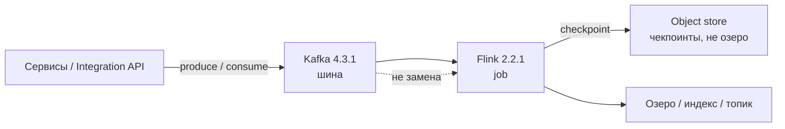
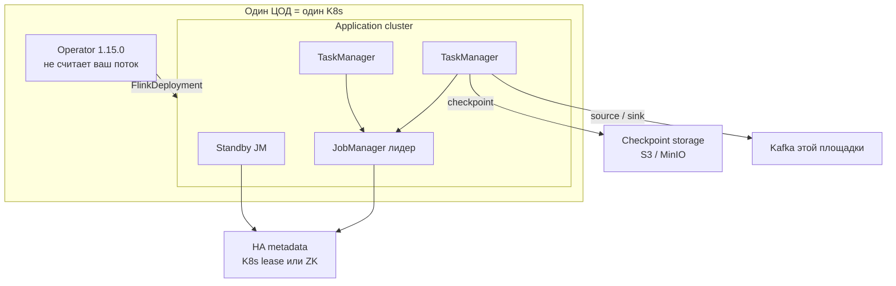
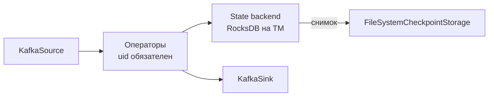
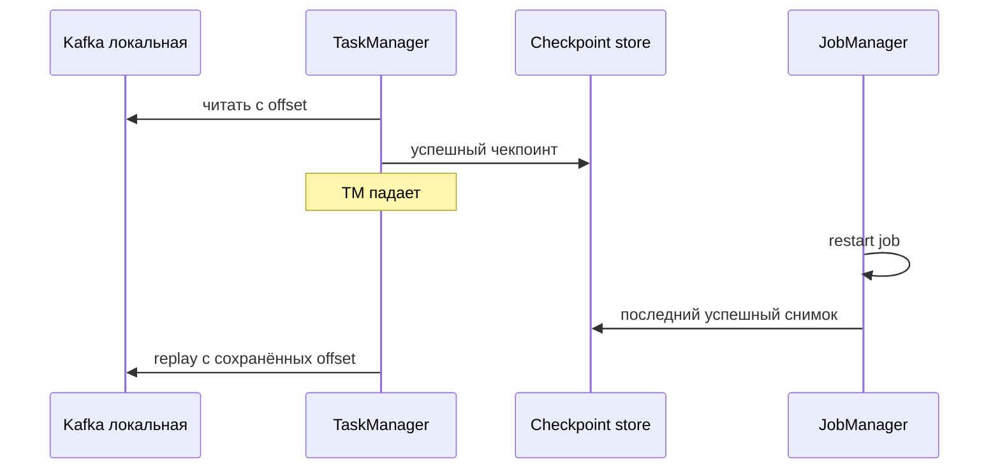
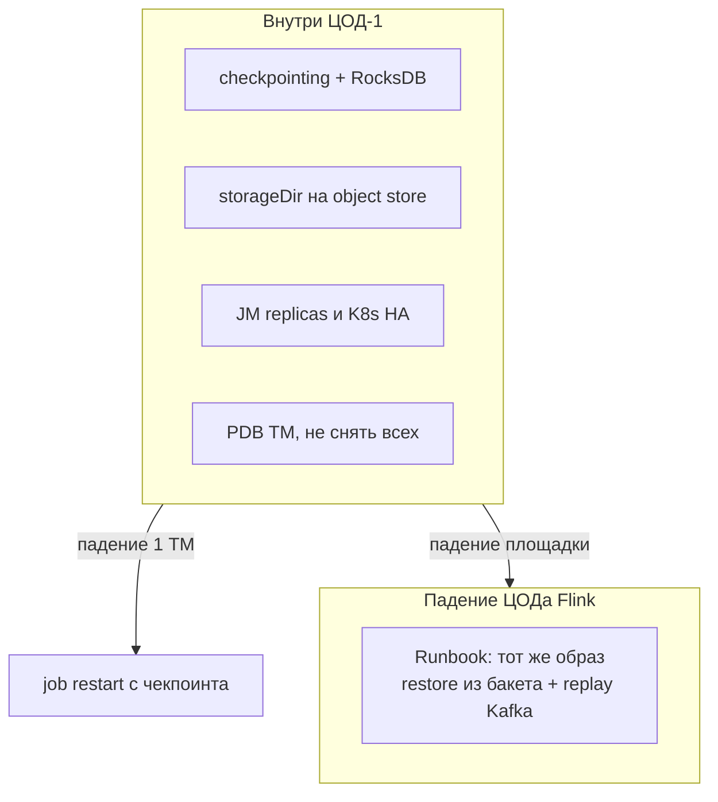
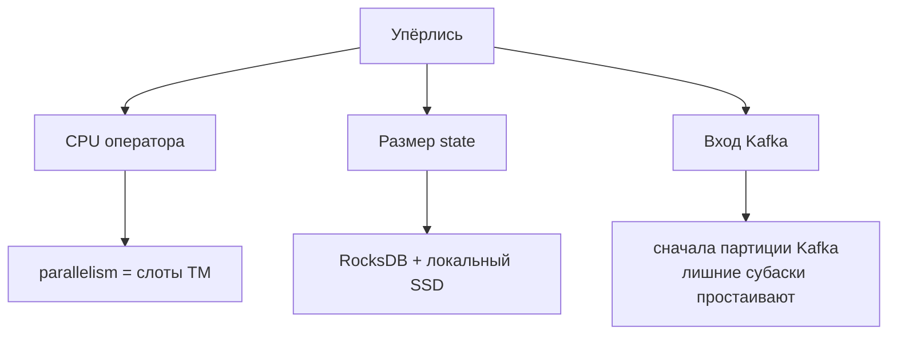
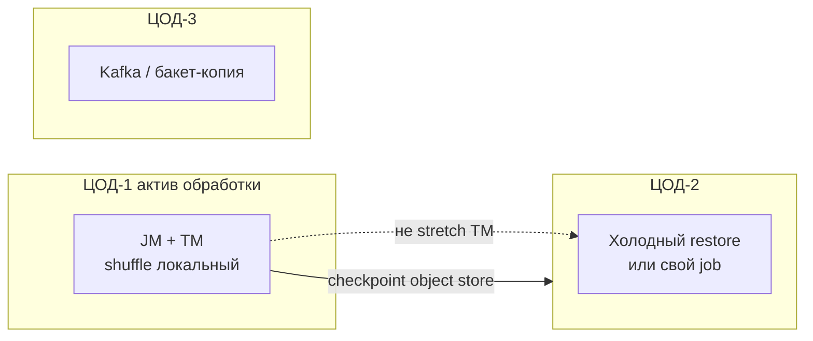

# Apache Flink 2.2.1 — схемы устройства

Связанные документы: правила — `Apache Flink.md`; установка — `Apache Flink.install.md`.

C4 / «D4»: контекст → контейнеры → компоненты. Код job не рисуем.

Допущения: stretch JM/TM на 2–3 ЦОДа **нет** (shuffle и чекпоинт не «RF=3 как у Kafka»). **JobManager HA внутри одного ЦОДа** (Kubernetes HA или ZooKeeper). Replay — из **локального** Kafka. Оператор **1.15.0** (матрица **2.2.x**). **Не** брать Flink **2.3** с этим оператором. Коннектор Kafka **5.0.0**. Нагрузки нет.

---

## 1. Контекст

Flink — **потоковый движок**: читает шину, считает, пишет проекции. Не шина, не SoT, не Camunda, не интеграционное API.

Чекпоинт — не «копия озера». Keyed state — рабочее состояние job. Ходить в 30 ведомств «вместо API» — сломать контур лагов.

Если вся обработка — «JSON в БД» без окон и согласованного рестарта, слой может быть лишним.

---

## 2. Контейнеры (одно ПО, разные процессы)

Лидер JM **один**. Без HA падение JM роняет running job. Standby **ускоряет** смену лидера; задание **всё равно перезапускается** (формулировка оператора).

Порты: люди и CLI — **8081** (REST/UI). RPC JM **6123**; blob/TM data часто эфемерные — NetworkPolicy «только 6123» внутренний трафик не закрывает.

Оператор `replicas: 2` **только** с leader election. Два активных контроллера без election — конфликт. Падение оператора **не** роняет уже бегущие job.

---

## 3. Компоненты job

| Компонент | Для чего настраивать |
|---|---|
| Checkpoint | Автоснимок state + offset. Без него дефолт restart = **не рестартовать** |
| Savepoint | Для людей: смена версии/графа. HA-рестарт оператора идёт с **чекпоинта** |
| RocksDB | Прод с неизвестным state. Incremental — только у него среди стабильных backend |
| HashMap | Куча JM/TM; стенд / крошечный state |
| ForSt | В 2.2 **experimental**, в прод не берём |
| DeliveryGuarantee | Дефолт sink — **NONE**. EXACTLY_ONCE = транзакции Kafka + уникальный `transactionalIdPrefix` |

`JobManagerCheckpointStorage` (куча JM) — development. Для HA док требует filesystem storage. Плагин S3 (presto, схема `s3p://`) кладётся в **образ до** старта.

---

## 4. Поток: сбой TM и replay

RPO ≈ интервал чекпоинта плюс незавершённый снимок, **не** «ноль как `acks=all`». Если retention Kafka короче дыры без чекпоинта — offset указывает в вычищенный лог.

Exactly-once до топика честна только если: checkpointing `EXACTLY_ONCE`, sink `EXACTLY_ONCE`, потребители `read_committed`, `transaction.timeout.ms` больше max(чекпоинт)+max(рестарт). Видимость записей **задерживается до чекпоинта**.

---

## 5. Отказоустойчивость — что настраивать

| Ручка | Если забыть |
|---|---|
| Checkpointing | Падение TM = нет state |
| Storage не куча JM | Падение JM = нет снимка |
| Бакет переживает ЦОД job | Смерть зала с MinIO = restore не из Flink |
| uid операторов | Savepoint не встанет после смены кода |
| Не Flink **2.3** + operator **1.15.0** | Матрица 1.15.0 линейку 2.3 **не** перечисляет |
| Native mode оператора | Standalone `--host` IP пода ломает leader election |

Вариант «размазать TM по трём ЦОДам» — shuffle по WAN, порога RTT у проекта **нет**. На схемах его нет.

---

## 6. Масштабируемость — что настраивать

Пустые TM без слотов job не ускоряют. JM почти не масштабируют «от MB/s». Память TM: `taskmanager.memory.process.size` **или** `flink.size`, не оба. Autoscaler оператора — **после** стабильного чекпоинта, не в день первого деплоя.

«Терабайты озера» ≠ терабайты state. State — окна, join, offsets.

---

## 7. 2–3 ЦОДа без stretch

Целевое: мозг Flink в одном ЦОДе; Kafka площадки может жить по своим правилам. Падение ЦОДа Flink = **остановка обработки**, пока не поднимете job в другом зале из чекпоинта и не переиграете локальный топик.

**Сильное:** shuffle предсказуемый; нет сюрприза etcd/lease «на страну»; DR явный.  
**Слабое:** нет автопродолжения «как ISR»; RTO restore надо **измерить** на вашем RocksDB; два job с одним `transactionalIdPrefix` — конфликт транзакций.

Три независимых Flink (по ЦОДу) дают изоляцию, но не единую exactly-once картинку.

---

## 8. Безопасность на той же картине

1. **8081** не в интернет. REST по умолчанию **без** аутентификации клиента — sidecar-прокси + SSO (рекомендация доки).
2. Разные флаги: `security.ssl.rest` и `security.ssl.internal` (RPC/blob/data).
3. Секреты не в тексте `FlinkDeployment`: оператор **логирует diff CR**.
4. At-rest: том TM (RocksDB) и бакет чекпоинтов. NetworkPolicy: 8081 — админы/оператор; RPC — JM↔TM; к Kafka — как в документе Kafka.

Источники: `Apache Flink.md`. Утверждения «Flink переживёт два ЦОДа сам» или порог RTT для TM в документации **отсутствуют**.
