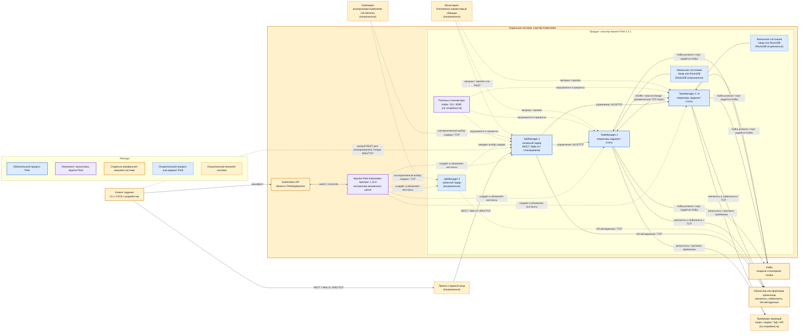

# Apache Flink 2.2.1 — назначение и архитектура

Apache Flink — движок обработки потоков и ограниченных наборов данных. В платформе используется Apache Flink **2.2.1** с Java **17**, Apache Flink Kubernetes Operator **1.15.0** и Apache Flink Kafka Connector **5.0.0**. Коннектор выпускается отдельно от ядра, поэтому его версия фиксируется явно.

Flink **не** является шиной событий, эталонным хранилищем, системой управления бизнес-процессами, реестром схем или интеграционным API. Kafka, объектное хранилище, озеро данных, индекс, Camunda и корпоративные сервисы — отдельно развёрнутые системы.

## Назначение системы

Flink непрерывно превращает входные события в производные наборы данных: обогащает и фильтрует записи, объединяет потоки, считает показатели по временным окнам, удаляет повторы и записывает результат в другой топик Kafka, озеро данных, индекс или иной приёмник.

Во время вычислений Flink хранит рабочее состояние задания: накопленные значения окон, ключи, буферы объединения и позиции чтения входа. Это состояние необходимо для продолжения расчёта после сбоя, но не заменяет эталонные данные. После сбоя задание восстанавливает состояние из последнего успешного чекпоинта и повторно читает вход с сохранённых позиций.

Flink оправдан, когда нужны вычисления над потоком, состояние между событиями или согласованное восстановление. Если обработка сводится к передаче одной записи из JSON в базу без окон и состояния, продукт может быть лишним слоем.

## Перечень функций

Apache Flink 2.2 OSS выполняет следующие функции:

1. Выполняет долгоживущие потоковые и завершаемые пакетные задания.
2. Строит план задания и распределяет его части между рабочими процессами.
3. Параллельно читает, преобразует, объединяет и записывает данные.
4. Хранит рабочее состояние в памяти JVM или во встроенном RocksDB.
5. Создаёт чекпоинты для автоматического восстановления после сбоя.
6. Создаёт управляемые пользователем сейвпоинты для плановой смены версии, графа или параллелизма.
7. Выбирает активный JobManager через Kubernetes или, как вариант, ZooKeeper с внешним каталогом метаданных.
8. Читает и пишет Kafka через отдельно подключаемый Kafka Connector.
9. Масштабирует обработку изменением числа TaskManager, слотов и параллельных экземпляров операторов задания.
10. Предоставляет REST API и Web UI JobManager на порту **8081/TCP**.

Гарантия «ровно один раз» не возникает от одного факта использования Flink. Она зависит от чекпоинтов и поведения конкретного приёмника. Например, обычная повторная операция `INSERT` через JDBC может создать дубли.

## Основные элементы системы и зависимости

Flink — одно программное обеспечение из нескольких процессов. На схеме показан один кластер Flink для одного приложения в одной площадке. Два TaskManager обозначают горизонтальное масштабирование; их фактическое количество определяется нагрузкой. Запасной JobManager, внешний прокси, ZooKeeper, локальный RocksDB и система мониторинга отмечены как **опциональные**.

### Схема инстансов и потоков

Цвета обозначают принадлежность, а не состояние системы: синие блоки — процессы или внутренние варианты ядра Flink, фиолетовые — компоненты экосистемы Apache Flink, жёлтые — отдельно развёрнутые системы. Пунктирная граница блока означает опциональность и не меняет цвет его принадлежности. Сплошная стрелка показывает поток данных или вызов; пунктирная — управление, наблюдение либо необязательный путь.

### Состав и описание блоков

#### JobManager 1 — активный лидер

- **Что это:** процесс ядра Apache Flink и компонент продукта.
- **Технология/варианты:** JVM; в составе процесса работают Dispatcher, ResourceManager и JobMaster. В режиме приложения обычно обслуживает одно приложение.
- **Назначение:** принимает задание, строит его граф выполнения, выделяет слоты, координирует TaskManager и чекпоинты, предоставляет REST API и Web UI.
- **Опциональность:** сам JobManager обязателен; роль лидера в каждый момент выполняет ровно один экземпляр.

#### JobManager 2 — запасной лидер

- **Что это:** второй экземпляр процесса JobManager, компонент продукта.
- **Технология/варианты:** выбор лидера через Kubernetes HA Services; альтернативный вариант вне такой схемы — ZooKeeper HA Services.
- **Назначение:** ждёт роль лидера и принимает её после отказа активного JobManager. Выполняемое задание при смене лидера восстанавливается, а не продолжает вычисление внутри старого процесса.
- **Опциональность:** **опционален**; нужен, когда требуется запас управляющего процесса.

#### TaskManager 1 и TaskManager 2..N

- **Что это:** рабочие JVM-процессы ядра Apache Flink, компоненты продукта.
- **Технология/варианты:** один или несколько экземпляров; каждый предоставляет вычислительные слоты. Операторы задания выполняются цепочками подзадач.
- **Назначение:** читают вход, выполняют преобразования и окна, обмениваются записями, хранят рабочее состояние и пишут результат.
- **Опциональность:** минимум один TaskManager обязателен; экземпляры 2..N **опциональны** и добавляются для параллелизма и запаса вычислительной ёмкости.

#### Локальное состояние: Heap или RocksDB

- **Что это:** выбранный для задания способ хранения рабочего состояния внутри TaskManager; не отдельная система.
- **Технология/варианты:** память JVM либо встроенный RocksDB на локальном диске. RocksDB использует нативную библиотеку и локальные файлы.
- **Назначение:** хранит окна, агрегаты, буферы и состояние по ключу между входными событиями.
- **Опциональность:** состояние нужно только заданиям с состоянием; RocksDB **опционален**, потому что возможен вариант в памяти JVM. Локальное состояние не заменяет внешние чекпоинты.

#### Плагины и коннекторы

- **Что это:** подключаемые библиотеки экосистемы Apache Flink, загружаемые процессами продукта.
- **Технология/варианты:** Kafka Connector **5.0.0**, плагины S3, JDBC-коннекторы и другие совместимые библиотеки.
- **Назначение:** реализуют протокол конкретного источника, приёмника или файловой системы.
- **Опциональность:** набор **опционален** и зависит от интеграций; Kafka Connector необходим для показанных на схеме потоков Kafka.

#### Apache Flink Kubernetes Operator

- **Что это:** отдельно работающий Kubernetes-контроллер проекта Apache Flink; не процесс исполняющего кластера Flink.
- **Технология/варианты:** Apache Flink Kubernetes Operator **1.15.0**, Kubernetes Custom Resources и API reconciliation loop.
- **Назначение:** наблюдает декларации `FlinkDeployment`, создаёт и обновляет JobManager и TaskManager, управляет состоянием их жизненного цикла.
- **Опциональность:** **опционален** для Flink вообще; в показанном варианте управления через Kubernetes используется как компонент экосистемы.

#### Кластер Kubernetes и Kubernetes API

- **Что это:** отдельно развёрнутая контейнерная платформа.
- **Технология/варианты:** Kubernetes; объекты API, поды, сервисы и механизм выбора лидера. Вне Kubernetes Flink может работать в других поддерживаемых режимах.
- **Назначение:** запускает процессы, предоставляет им сеть и вычислительные ресурсы, хранит декларации оператора и данные выбора лидера.
- **Опциональность:** **опционален** как способ запуска Flink; обязателен для показанной схемы.

#### ZooKeeper

- **Что это:** отдельно развёрнутая координационная система, не компонент Flink.
- **Технология/варианты:** Apache ZooKeeper и ZooKeeper HA Services Flink; на показанном основном пути альтернативой служат Kubernetes HA Services.
- **Назначение:** в альтернативной конфигурации участвует в выборе активного JobManager; долговечные данные задания при этом всё равно размещаются во внешнем файловом или объектном хранилище.
- **Опциональность:** **опционален** и не используется одновременно как основной механизм выбора лидера в показанном варианте Kubernetes.

#### Клиент задания

- **Что это:** внешняя роль, а не постоянно работающий сервер Flink.
- **Технология/варианты:** Flink CLI, процесс сборки CI/CD, Java-клиент или разработчик через Web UI.
- **Назначение:** собирает граф задания, публикует декларацию в Kubernetes либо обращается к REST API JobManager.
- **Опциональность:** роль обязательна для подачи или управления заданием; конкретная реализация выбирается платформой.

#### Прокси и единый вход

- **Что это:** отдельно развёрнутая внешняя система доступа.
- **Технология/варианты:** reverse proxy или ingress-контроллер совместно с корпоративным провайдером идентификации.
- **Назначение:** завершает TLS, аутентифицирует пользователя и ограничивает доступ к REST API и Web UI.
- **Опциональность:** **опционален** для изолированного стенда; на схеме показан как предпочтительная точка пользовательского доступа. REST Flink сам по себе по умолчанию не является полноценным контуром аутентификации.

#### Kafka

- **Что это:** отдельно развёрнутая шина событий, не компонент Flink.
- **Технология/варианты:** Apache Kafka и Kafka protocol; доступ из Flink обеспечивает Kafka Connector.
- **Назначение:** долговременно хранит упорядоченные журналы событий по партициям и служит входом или выходом потокового задания.
- **Опциональность:** **опциональна** для Flink как продукта, но обязательна для показанных потоков платформы.

#### Объектное или файловое хранилище

- **Что это:** отдельно развёрнутая долговечная система хранения.
- **Технология/варианты:** S3-совместимое хранилище, HDFS или другая поддерживаемая файловая система.
- **Назначение:** хранит чекпоинты, сейвпоинты и метаданные высокой доступности вне процессов Flink.
- **Опциональность:** внешнее хранилище **опционально** для простого стенда без долговечного восстановления; для показанного восстановления и запаса JobManager является необходимой зависимостью.

#### Приёмники проекций

- **Что это:** отдельно развёрнутые целевые системы.
- **Технология/варианты:** озеро данных, поисковый индекс, СУБД, Kafka или API; конкретный протокол реализует коннектор или код задания.
- **Назначение:** принимают вычисленные проекции и результаты обработки.
- **Опциональность:** блок **опционален по составу**; задание может писать в один или несколько приёмников. Kafka как выход уже показана отдельным двунаправленным потоком.

#### Мониторинг

- **Что это:** отдельно развёрнутая система наблюдаемости.
- **Технология/варианты:** Prometheus-совместимый сборщик или другой поддерживаемый Flink Metrics Reporter.
- **Назначение:** собирает показатели заданий, чекпоинтов, задержки, JVM, слотов и перезапусков.
- **Опциональность:** **опционален** для исполнения задания.

### Порты

| Порт | Стороны соединения | Назначение |
|---|---|---|
| **8081/TCP** | клиент или прокси → активный JobManager | REST API и Web UI |
| **6123/TCP** | JobManager ↔ TaskManager | внутренние RPC-вызовы и управление |
| **Динамические TCP-порты** | TaskManager ↔ TaskManager; внутренние сервисы Flink | передача данных, RPC TaskManager и Blob Server, если фиксированные диапазоны не настроены |
| **Порт внешней системы** | TaskManager или JobManager → Kafka, хранилище, приёмник, мониторинг | задаётся конфигурацией соответствующей внешней системы и не является портом Flink |

Flink не использует UDP для перечисленных взаимодействий. Разрешение только `6123/TCP` не открывает весь необходимый внутренний обмен: динамические порты должны быть зафиксированы настройками или учтены в сетевой политике.

## Подробное объяснение схемы

1. Клиент задания передаёт в Kubernetes API объект `FlinkDeployment`. Оператор наблюдает этот объект и приводит фактические экземпляры JobManager и TaskManager к описанному состоянию. Этот поток управляет жизненным циклом, но не переносит пользовательские события.
2. Активный JobManager принимает граф задания, разбивает его на параллельные подзадачи и назначает их свободным слотам TaskManager. Связь управления идёт по внутренним RPC-вызовам. Пользовательские данные через JobManager обычно не проходят.
3. TaskManager читают разные партиции входных топиков Kafka. Если после чтения записи требуется перераспределить по ключу, рабочие пересылают их друг другу через поток `shuffle`. Поэтому количество рабочих процессов не означает создание копий каждой записи, как при репликации Kafka.
4. Каждый оператор задания выполняет свою часть графа: например, источник читает Kafka, затем преобразование проверяет запись, окно накапливает значения, а приёмник записывает итог. Параллельные экземпляры одного оператора работают над разными разделами данных.
5. Состояние задания находится рядом с вычислением — в памяти JVM либо RocksDB конкретного TaskManager. При потере процесса эта локальная рабочая копия может исчезнуть.
6. Во время чекпоинта JobManager координирует согласованную фиксацию позиций источников и состояния операторов. TaskManager выгружают долговечные части снимка во внешнее хранилище, а JobManager хранит ссылочные метаданные. Чекпоинт не является копией Kafka или озера.
7. Если TaskManager падает, задание перезапускается и восстанавливается из последнего успешного чекпоинта. Kafka повторно отдаёт записи с сохранённых позиций. Наличие или отсутствие дублей на выходе определяется гарантией выбранного приёмника.
8. При отказе активного JobManager запасной экземпляр, если он есть, становится лидером через механизм высокой доступности. Он читает метаданные из внешнего хранилища и восстанавливает координацию задания. Это смена управляющего процесса, а не бесшовное продолжение его памяти.
9. Результат TaskManager уходит обратно в Kafka либо в отдельный приёмник: озеро, индекс, СУБД или API. Каждый путь имеет собственный протокол и семантику подтверждения. Транзакционный Kafka-приёмник не делает транзакционным последующий HTTP-вызов или JDBC-запись.
10. Пользователь или автоматизация обращаются к REST API и Web UI активного JobManager на `8081/TCP`. Опциональный прокси отделяет этот административный интерфейс от пользователей и добавляет TLS и единый вход.
11. Опциональная система мониторинга читает экспортируемые метрики. Она наблюдает выполнение, но не участвует в обработке данных и не хранит состояние задания.
12. Схема показывает один кластер Flink в одной площадке. Официальная документация не задаёт допустимый порог задержки для растягивания рабочих процессов между дата-центрами; обмен `shuffle`, RPC и чекпоинты чувствительны к сети.

## Глоссарий

- **Backend состояния** — реализация хранения рабочего состояния операторов; в этой схеме память JVM или RocksDB.
- **Blob Server** — внутренний сервис Flink для передачи крупных двоичных артефактов, например JAR-файлов задания.
- **CI/CD** — автоматизированная сборка, проверка и доставка версии приложения.
- **Dispatcher** — часть JobManager, принимающая задания и запускающая для них JobMaster.
- **FlinkDeployment** — пользовательский ресурс Kubernetes, в котором оператору декларативно описывают кластер и задание Flink.
- **HA, высокая доступность** — способность восстановить управляющую роль после отказа процесса с использованием выбора лидера и внешних метаданных.
- **JobMaster** — часть JobManager, которая координирует выполнение одного задания.
- **JVM** — среда выполнения Java, внутри которой работают процессы Flink.
- **Kafka Connector** — отдельная библиотека, связывающая API источника и приёмника Flink с Kafka.
- **RocksDB** — встроенная дисковая база ключ–значение, используемая Flink как вариант локального backend состояния.
- **RPC** — внутренний удалённый вызов между процессами управления Flink.
- **S3** — API объектного хранилища; S3-совместимая система может быть развёрнута отдельно от Amazon Web Services.
- **Task slot, слот** — доля вычислительных ресурсов TaskManager, в которой выполняется цепочка параллельных подзадач.
- **TLS** — шифрование и проверка подлинности сетевого соединения с помощью сертификатов.
- **Водяной знак** — служебная отметка прогресса времени событий, по которой Flink решает, когда закрывать временные окна.
- **Граф задания** — направленная схема источников, преобразований и приёмников, которую выполняет Flink.
- **Задание, job** — пользовательская программа обработки данных, запущенная в Flink.
- **Идемпотентность** — свойство повторной операции давать тот же результат без дополнительного эффекта.
- **Коннектор** — библиотека интеграции Flink с конкретным источником или приёмником.
- **Оператор задания** — отдельный шаг обработки, например чтение, фильтрация, объединение, окно или запись.
- **Параллелизм** — число одновременно работающих экземпляров оператора задания.
- **Партиция Kafka** — упорядоченная часть топика; параллелизм чтения одного топика ограничен числом его партиций.
- **Проекция** — производное представление данных, рассчитанное из входных событий для конкретного способа чтения.
- **Приёмник, sink** — конечный оператор, записывающий результат во внешнюю систему.
- **Реестр схем** — отдельная система хранения версий структур сообщений; в состав Flink не входит.
- **Режим приложения** — способ запуска, при котором кластер Flink связан с конкретным приложением.
- **Ресурсный менеджер, ResourceManager** — часть JobManager, управляющая регистрацией TaskManager и доступными слотами.
- **Сейвпоинт** — управляемый пользователем снимок состояния для плановой остановки, переноса или обновления задания.
- **Семантика «ровно один раз»** — гарантия, при которой согласованное состояние отражает каждую входную запись один раз; требует поддержки всей цепочкой, а не только Flink.
- **Состояние по ключу** — данные оператора, раздельно хранимые для каждого логического ключа.
- **Топик Kafka** — именованный журнал событий, разделённый на партиции.
- **Чекпоинт** — автоматически создаваемый согласованный снимок состояния и позиций входа для восстановления после сбоя.
- **Shuffle** — перераспределение записей между параллельными подзадачами, обычно по ключу.

## Источники

- Релиз Apache Flink 2.2.1: https://flink.apache.org/2026/05/15/apache-flink-2.2.1-release-announcement/
- Документация Apache Flink 2.2: https://nightlies.apache.org/flink/flink-docs-release-2.2/
- Оператор 1.15.0 и совместимость с Flink 2.2.x: https://flink.apache.org/2026/05/26/apache-flink-kubernetes-operator-1.15.0-release-announcement/
- Высокая доступность: https://nightlies.apache.org/flink/flink-docs-release-2.2/docs/deployment/ha/overview/
- Чекпоинты: https://nightlies.apache.org/flink/flink-docs-release-2.2/docs/ops/state/checkpoints/
- Чекпоинты и сейвпоинты: https://nightlies.apache.org/flink/flink-docs-release-2.2/docs/ops/state/checkpoints_vs_savepoints/
- Kafka Connector: https://nightlies.apache.org/flink/flink-docs-release-2.2/docs/connectors/datastream/kafka/
- Файловые системы S3: https://nightlies.apache.org/flink/flink-docs-release-2.2/docs/deployment/filesystems/s3/
- Сетевая конфигурация: https://nightlies.apache.org/flink/flink-docs-release-2.2/docs/deployment/config/#network
