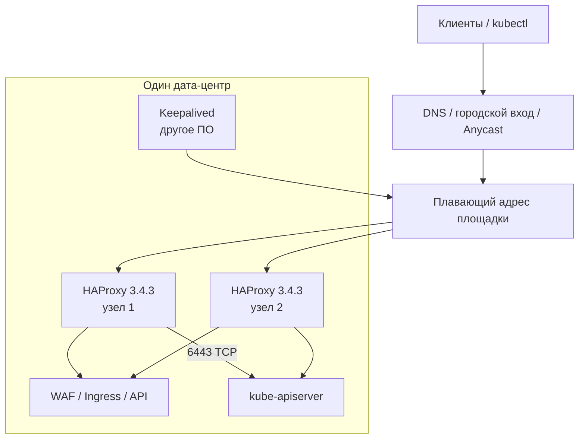

# HAProxy 3.4.3 — развёртывание и настройка

HAProxy — балансировщик TCP и HTTP: принимает соединения и раскидывает их на живые серверы. Этот документ про **community** версию **3.4.3** (патч линии 3.4 LTS, опубликован 29 июля 2026; на дату подготовки — последний стабильный патч текущей LTS). Это не HAProxy Enterprise и не Ingress-контроллер Kubernetes (другой репозиторий и **другая** линия движка).

Сайт: https://www.haproxy.org/  
Документация 3.4: введение https://docs.haproxy.org/3.4/intro.html · управление https://docs.haproxy.org/3.4/management.html · конфигурация https://docs.haproxy.org/3.4/configuration.html  
Образ: `haproxy:3.4.3` (теги `3.4`, `lts`; Alpine — `haproxy:3.4.3-alpine`).

Линия 3.4 — LTS: на haproxy.org поддержка **до Q2 2031**. Нечётные линии живут около года и по правилам проекта **не** кладут туда, откуда нельзя быстро откатиться. В бой берём **уже вышедший патч 3.4.3**, не `latest` и не `3.5-dev`.

Этот текст — не набор команд «скопируй конфиг», а правила, без которых система не будет одновременно устойчивой к сбоям, масштабируемой и безопасной. Пошаговая установка — в `HAProxy.install.md`.

HAProxy **не** замена WAF, **не** Ingress «из коробки Kubernetes» и **не** шина событий.

---

## Назначение системы

HAProxy нужен, чтобы **склеить несколько живых копий сервиса в один адрес** и **не отправлять клиентов на мёртвый сервер**. Клиент стучится в балансировщик; тот проверяет живость, при необходимости снимает TLS и пересылает.

Система **не хранит** эталон данных и **не** понимает протокол Kafka как «один вход на всех брокеров». Правильное место — **вход HTTP/TCP** площадки и **вход к API Kubernetes** (часто порт 6443). Если повесить HAProxy и отдать тот же сервис наружу в обход — балансировщик становится декорацией.

Плавающий адрес между двумя машинами HAProxy **сам не таскает**. Для этого рядом ставят Keepalived (другое ПО) или оставляют склейку DNS/сервису Kubernetes.

---

## Перечень функций

Что умеет community HAProxy 3.4:

1. **Слушать вход** (frontend): IP:порт, TLS или нет, HTTP или сырой TCP.
2. **Раскидывать на ферму** (backend): список серверов, алгоритм, проверки живости. Мёртвый сервер из балансировки **вычёркивается**.
3. **Держать запасной origin**: в игру, когда основные мертвы.
4. **Ограничивать число соединений** (глобально и на вход/ферму). Без потолка процесс съест дескрипторы и память.
5. **Масштабироваться потоками внутри одного процесса** (с 2.5 несколько worker-процессов `nbproc` **удалены**). По умолчанию — поток на каждое доступное ядро.
6. **Мягко менять конфиг**: новый процесс берёт порты, старый дожёвывает уже открытые сессии. Это **не** «ноль оборванных»: при высокой нагрузке часть **новых** соединений может отвалиться.
7. **Отдавать пульт по сокету**: снять сервер с фермы, посмотреть сессии, обновить ключи TLS. Это не веб-админка.
8. **Показывать HTML-статистику**. На тесте удобно. В интернет **не** выставляют.
9. **Отдавать метрики Prometheus**, если сборка с этим сервисом (в исходниках по умолчанию **выкл**; в официальном образе обычно есть — проверять `haproxy -vv`).
10. **Помнить в памяти** «этот клиент → тот сервер» и счётчики для ограничения частоты. Это **не** диск. Смена конфига без синхронизации таблиц **обнуляет** память.
11. **Копировать эти таблицы** между процессами (протокол peers) — иначе у каждого узла своя правда о лимитах.
12. **Терминировать TLS** или пробрасывать его не разбирая (выбор сервера по имени в ClientHello / по порту).
13. **HTTP/3 по UDP** — только если собрали с этой опцией. Введение по-прежнему пишет: HAProxy **не** балансировщик произвольных UDP-пакетов и не делает NAT/DSR.

Отдельного «кластера HAProxy» с голосованием, как у etcd, **нет**. Несколько процессов — несколько независимых прокси, которые вы склеиваете плавающим адресом, DNS, Anycast и/или копированием таблиц.

Чего система **не** делает и часто путают: не таскает VIP сама (это Keepalived/VRRP/BGP), не семантический WAF, не читает Ingress-объекты Kubernetes (это другой продукт, на дату документа latest контроллера собран с HAProxy **3.2**, не 3.4.3), не правит конфиг по REST из коробки (Data Plane API — отдельный процесс), не заменяет advertised listeners Kafka, не ГОСТ-криптография, не единое состояние на три дата-центра.

---

## Требования к развёртыванию

### Требования к ПО

| Что | Что ставить | Комментарий |
|---|---|---|
| **Формат поставки** | Пакет Linux **или** контейнер | Образ `haproxy:3.4.3`. На краю площадки чаще **виртуальные машины / hostNetwork**, не HPA «50 подов» |
| **Kubernetes** | Не штатный Ingress 3.4.3 | Бинарь 3.4.3 объекты Ingress сам не читает. Контроллер `haproxytech/kubernetes-ingress` **3.2.13** — другой продукт с движком **3.2**. Для API-сервера Kubernetes — отдельный listen TCP 6443 |
| **ОС** | Linux amd64/arm64 | Официальные пакеты и Docker — Linux. **Windows как хост балансировщика проектом не описывается** |
| **Ядро** | **≥ 3.9**, если нужен нормальный мягкий reload (`SO_REUSEPORT`) | Для образа 2.4+ ещё: ядро ≥ 4.11, если слушаете порты ниже 1024 не от root |
| **Плавающий адрес** | Keepalived / VRRP / BGP — **другое ПО** | Ставить только если VIP реален в этой сети (один широковещательный домен или продуманный unicast + маршруты) |
| **Часы** | NTP | TLS, журналы, копирование таблиц |
| **Лицензия** | Community | Enterprise / центральная консоль — другая линейка |

**Не swap.** Введение: машина **никогда** не должна уходить в swap; CPU нельзя искусственно душить «долей ядра» гипервизора на нагруженном прокси.

Системные лимиты дескрипторов согласовать с потолком соединений (каждое соединение ≈ несколько дескрипторов). Журнал (syslog или stdout) + ротация обязательны: без логов не отличите «бэкенд тупит» от «мы режем клиентов».

### Требования к ресурсам

Цифр «сколько ядер на ваш периметр» нет — нагрузки в исходном запросе не было. Ниже только ориентиры поставщика, не смета закупки.

| Что | Ориентир из документации | Комментарий |
|---|---|---|
| **CPU** | **Одного ядра хватает >99% установок** (введение) | Много потоков нужны в основном под TLS и каналы **> ~40 Гбит/с**. Первая реакция на странную скорость часто — **уменьшить** число CPU у процесса, чтобы не прыгать между сокетами разных физических процессоров |
| **Потоки** | Начать с ядер **одного сокета**, не «все 128 на двух сокетах» без замера | Межсокетный трафик введение называет тормозом |
| **Память / соединения** | Порядок из старого sizing — тысячи TLS-соединений на гигабайт | Железо той таблицы — линия **1.6**. У вас свой замер, не копировать 8000 как закон |
| **Диск** | Конфиг и журналы, не склад ответов | Кэш HAProxy — **оперативная память**, чтобы себе сэкономить, не CDN. Введение отсылает за дисковым кэшем к другому ПО |

Бенчмарки в том же разделе введения (Core i7, HAProxy **1.6**, ядро 3.10, 10GbE) — **порядок величины 2010-х**. Более свежий публичный бенчмарк вендора: HAProxy 2.4, 64 ядра, ~2 млн HTTPS запросов/с / 100 Гбит/с — чужое железо. Для вас оба набора — только «TLS дороже открытого текста», не план закупки.

«Терабайты озера» на размер HAProxy почти не влияют. Влияют: **новые TLS-сессии в секунду**, размер заголовков, keep-alive, длинные опросы интеграций.

Минимум размещения боя: **два** процесса на живую площадку. Это не ёмкость, это чтобы падение одной машины не гасило вход зала.

---

## Основные элементы системы и зависимости

Это **один** процесс `haproxy` плюс файлы конфигурации. Устойчивость входа — несколько таких процессов и механизм склейки адреса.

### Схема инстансов и потоков

Как читать схему:

1. Снаружи клиенты смотрят на **один адрес площадки**, не на физический IP балансировщика.
2. Keepalived (если VIP реален) держит этот адрес на живом узле. HAProxy **сам** адрес между машинами не двигает. Если процесс прокси уже мёртв, а VIP ещё на этой машине — классический простой: надо снимать VIP, когда HAProxy мёртв.
3. HTTP-вход и вход к API Kubernetes — **разные** listen. Смешивать интернет-443 и 6443 на одном сокете без списка доступа — плохая привычка.
4. Origin — **этот** зал. Тащить HTTP через город «на всякий случай» строит скрытую зависимость.
5. Между дата-центрами процессы HAProxy **не выбирают лидера**. Городской DNS/Anycast перестаёт слать на мёртвую площадку — или не перестаёт, если вы это не построили.

Рядом, но это уже другое ПО: Keepalived, WAF, Ingress-контроллер 3.2, Kubernetes. Kafka сюда обычно **не** ставят единственным TCP на все брокеры.

### Что входит в состав

| Роль | Зачем | Как масштабируется |
|---|---|---|
| **Процесс HAProxy** | Приём и раскладка соединений | Вертикаль: ядра под TLS, потолок соединений. Горизонталь: ещё узлы за VIP/DNS |
| **Файл конфигурации** | Входы, фермы, таймауты | Проверка `haproxy -c` **до** reload |
| **Сокет пульта** | Снять сервер, ключи TLS | Только unix / внутренняя сеть |
| **Таблица в памяти** | Липкость, лимиты частоты | Копирование между узлами **пары**, не «на город» |
| **Keepalived** | VIP | Другое ПО, свой выкат |

Утилита проверки конфига обязательна перед каждой сменой.

### Порты (контракт сети)

Конкретные порты задаёте вы. Типичный контракт платформы:

| Порт | Назначение | Кому открывать |
|---|---|---|
| **80 / 443** | HTTP(S) вход площадки | Клиенты / городской слой. Не stats, не пульт |
| **6443/TCP** | API Kubernetes | Только административные сети, не «как у сайта» |
| Сокет статистики / метрик | HTML или Prometheus | localhost / внутренний сборщик, не мир |
| Канал копирования таблиц | peers | Только узлы пары, не мир |

TLS на 443 **не** открывает отдельный «TLS-порт балансировщика»: это тот же bind с сертификатом. Пробрасывание TLS без разбора — режим TCP.

### Зависимости окружения

- PKI для сертификатов входа и (если нужно) повторного шифрования до origin.
- Keepalived — только если выбран VIP внутри одного домена маршрутизации.
- Origin должен принимать трафик **только** с адресов HAProxy (и WAF, если он следующий шаг). Иначе балансировщик обходят.

---

## Краткие вводные

### Как устроена отказоустойчивость

HAProxy **задуман без своего склада данных** (введение): перехват должен быть возможным без «восстановления базы балансировщика».

| Что падает | Что происходит |
|---|---|
| Один origin в ферме | Проверка снимает его, остальные получают трафик |
| Процесс HAProxy на узле | Этот VIP/под **мёртв**, пока не перезапустится или пока Keepalived/Kubernetes не перенесёт адрес |
| Один дата-центр | Узлы других залов **не** выбирают нового лидера HAProxy. Нужен городской механизм |
| Reload | Короткие окна потери **новых** соединений; старые сессии доживают на старом процессе |
| Таблица в памяти без копирования | После reload/падения узла липкость и лимит частоты **с нуля** |

Следствие: устойчивость входа = **минимум два живых HAProxy**, которые снаружи выглядят как один адрес, плюс проверка живости, плюс (если нужны лимиты/липкость) копирование таблиц. Один процесс на три зала устойчивости **не даёт**.

Keepalived решает «два сетевых интерфейса в одном домене делят VIP». Он **не** решает «три дата-центра», пока сеть не даёт Anycast/DNS/внешний балансировщик.

### Как устроено масштабирование

Два независимых рычага:

1. **Вертикально** — ядра под TLS, потолок соединений, очереди сетевой карты, **не swap**. Рукопожатие TLS жрёт CPU; keep-alive дешевле. Введение: порядок запросов в секунду падает примерно **в 10 раз** от TLS keep-alive к возобновлению сессии и ещё раз к полному рукопожатию с RSA.
2. **Горизонтально** — ещё узлы за VIP/DNS/Anycast. Каждый узел — свой процесс, свой потолок. Это умножает ёмкость **и** даёт запас.

HPA «50 реплик» в Kubernetes **без** стабильного IP и без копирования таблиц даёт 50 независимых лимитеров и ломает «прилипание» клиента.

### Безопасность самого HAProxy

Процесс на периметре в HTTP-режиме видит URL, заголовки, часто cookies, при снятии TLS — содержимое до origin. Сокет пульта и страница статистики — **полный пульт** фермы. Выставить статистику в интернет = отдать карту бэкендов и кнопки «сними с фермы».

После старта бинарь специально **не** ходит в файловую систему: компрометация процесса не равна «читает весь диск», но равна «видит трафик, который через него идёт».

---

## Допущения

Ниже то, чего не было в исходном запросе, но без чего нельзя нарисовать конкретную схему. Если допущение неверно — схему надо пересмотреть.

1. Берём **community 3.4.3**, не Enterprise.
2. Целевая роль боя — L4/L7 на выделенных Linux-машинах (или поды с сетью хоста) на краю площадки, плюс отдельный маленький listen для API Kubernetes, если control plane свой. Ingress-контроллер 3.2 — **запасной** путь «всё внутри Kubernetes», с движком **3.2**.
3. Перед фермой HAProxy (между залами) есть или будет механизм направления клиентов на живую площадку: DNS, городской балансировщик, Anycast. Сам HAProxy три зала в один VIP не склеит.
4. Внутри площадки для пары есть широковещательный домен или unicast VRRP + маршрутизируемый VIP. Если «только L3, VIP нельзя» — Keepalived бесполезен, нужен BGP или внешний вход.
5. Три дата-центра = три домена отказа. На каждый живой зал — свой вход (лучше пара). Один Keepalived на три зала не рассматривается.
6. Нагрузки HTTP/TLS нет — нет числа узлов и ядер «хватит для боя».
7. Формального круглосуточного договора нет. Схема «пара в зале + городской failover» переживает отказ 1 зала **по входу**, если DNS/Anycast это умеют.
8. HAProxy не ставится единственным `:9092` перед всеми брокерами Kafka.
9. Корпоративные сертификаты есть или будут. «Не проверять сертификат origin в бою» не считаем настройкой.
10. Шифрование канала — обычный TLS сборки OpenSSL. ГОСТ не озвучен.
11. Учебный стенд изолирован. На нём допустим HTTP и статистика на loopback. В бой это не копируем, но проверку конфига перед reload лучше включить сразу.
12. Camunda, озеро, интеграционное API — origin (или живут за Ingress/WAF). Их таймауты должны попасть в таймауты сервера и туннеля, иначе HAProxy рвёт легитимные долгие опросы.

---

## Критически важные условия, которых нет в исходном контексте

Их нужно закрыть **до** закупки VIP и «постановки в бой».

| Пробел | Почему это ломает решение |
|---|---|
| **Есть ли городской вход / Anycast / DNS между тремя залами** | Без этого три HAProxy — три острова. Keepalived внутри зала город не спасёт |
| **Можно ли VIP внутри зала** | Нет VIP и нет BGP — нет классической пары active-passive |
| **Задержка и потери между залами** | На проверку локального origin почти не влияет. Влияет на Anycast/DNS и на соблазн тащить HTTP origin «в чужой зал» |
| **Какой трафик реально идёт через HAProxy** | От этого зависят режим, таймауты, TLS vs проброс, нужен ли WAF |
| **Профиль нагрузки** (новые соединения/с, доля TLS, пик) | Без этого нельзя сказать ни потолок соединений, ни ядра |
| **Топология Kubernetes и где Ingress** | HAProxy перед Ingress, вместо Ingress или только 6443 — три разных схемы |
| **Где стоит WAF** | Порядок хопов меняет, кому верить про реальный IP клиента |
| **Требования ИБ: ГОСТ, персональные данные, запрет привилегированных подов** | Меняют TLS, сеть хоста, возможность Ingress-контроллера |
| **Нужна ли липкость / лимит частоты на периметре** | Тогда копирование таблиц внутри пары обязательно; иначе два узла = двойная квота атакующему |
| **Долгие интеграции (минуты ожидания ведомства)** | Заводские таймауты порядка секунд **убивают** сценарий. Замерить, не угадать |

---

## Краткое описание ключевых этапов и элементов развертывания

Общий каркас (и тест, и бой):

1. Зафиксировать **3.4.3** (`haproxy -v`), не `latest`. Проверить сборку: OpenSSL, метрики Prometheus, нужен ли HTTP/3.
2. Один главный файл конфигурации в git; применение только через проверку синтаксиса, затем reload.
3. Явные таймауты соединения, клиента, сервера (и туннеля для длинных сессий). Молчаливые заводы — источник ночных обрывов.
4. Проверка живости на каждый сервер; журналы HTTP или TCP; не копить логи в контейнере без ротации.
5. Сокет пульта только unix + права; статистика не с мира.
6. TLS: современные минимумы и шифры; редирект 80→443 осознанно (не ломая проверку живости внешнего входа).
7. Наблюдение: процесс жив, потолок соединений не упирается, статус ферм, задержка, ошибки reload.
8. Учение: выключить один origin, выключить один HAProxy, сделать reload под синтетикой.

Боевая схема на несколько дата-центров — в `HAProxy.install.md`. Ниже — только учебный стенд.

---

### 1 инстанс: тестовый стенд, 1 площадка, без нагрузки

**Цель стенда:** понять вход и ферму, научить приложения ходить на адрес балансировщика, отладить проверку живости и таймауты интеграций. **Не** цель: доказать отказ дата-центра и ёмкость TLS.

Одна машина или один под:

- образ `haproxy:3.4.3` **или** пакет той же линии;
- один вход HTTP на тестовый сервис;
- режим HTTP, по кругу, проверка живости;
- статистика только на loopback;
- без Keepalived, без копирования таблиц, без TLS (если сеть закрыта);
- режим master-worker лучше включить сразу: тот же путь reload, что в бою.

Для входа к API Kubernetes на тесте часто хватает одного TCP-listen на единственный api-сервер — это не запас, это «чтобы kubeconfig смотрел в одно место».

Community Ingress-контроллер на тесте допустим как эксперимент «как Ingress», но это **другая** версия движка; не смешивайте его конфиг с ручным 3.4.3.

#### Что сознательно упрощаем

| Параметр | На тесте | Почему можно |
|---|---|---|
| Один процесс | да | Некому делить VIP |
| Открытый HTTP | да, если сеть закрыта | Иначе утонете в сертификатах до маршрутов |
| Keepalived / копирование таблиц | нет | Нет второго узла |
| Жёсткий потолок соединений | мягкий запас | Нет нагрузки |
| HTML-статистика | можно на loopback | Учиться смотреть ферму |

#### Чего на тесте **не** стоит упрощать

- Всегда проверка синтаксиса перед reload.
- Реальные **таймауты** под долгие интеграции — иначе в бою «внезапно» начнут рваться опросы.
- Клиенты ходят **на адрес HAProxy**, не в обход на под.
- Хотя бы одна HTTP-проверка живости, а не только «порт 443 открыт» (TLS-порт может быть открыт, а приложение мертво).
- Версия образа зафиксирована, не `haproxy:latest`.

#### Сильные стороны такой схемы

- Поднимается за часы; совпадает с Docker Hub и введением («исполняемый файл + конфиг»).
- Достаточна, чтобы поймать ошибку режима и таймаутов до боя.

#### Слабые стороны (обязательно понимать)

- Падение машины = нет входа, если DNS указывает только сюда.
- Стенд **не** ловит: окна reload под нагрузкой, раздвоение VIP, копирование таблиц, CPU TLS.
- Успешный тест на одном процессе **не** является доказательством трёх площадок.

Практическая рекомендация: препрод = **пара HAProxy + Keepalived (или два пода + Service) + TLS** в **одном** дата-центре, даже без боевого потока. Иначе первый сюрприз — «после reload пропал лимит» или «VIP застрял на мёртвой машине».

---

## Сводка: что считать «экземпляр готов»

| Требование | Тест (1 площадка) | Бой |
|---|---|---|
| Отказоустойчивость | Не требуется | Пара на площадку + VIP или Service; проверка живости; origin локальный. Схема на 2–3 дата-центра — в `HAProxy.install.md` |
| Производительность / масштаб | Не требуется | Потолок соединений и дескрипторы по замеру; потоки без прыжков между сокетами процессоров; горизонталь = узлы, не слепой HPA; TLS отдельно от открытого текста; не swap |
| Безопасность | Статистика не в интернет; тестовый HTTP допустим | TLS 1.2+; пульт и peers закрыты; origin не в обход; пин 3.4.3; конфиг из git; реальный IP только от доверенных хопов |

**Не готов к бою**, если: один процесс на три зала; `haproxy:latest`; статистика с мира; нет проверки живости; Kafka через один TCP-вход на все брокеры; Keepalived без слежения за процессом прокси; лимит частоты «есть», а копирования таблиц нет; reload без проверки синтаксиса; origin публикуется напрямую; городской отказ зала не учений; Ingress-контроллер 3.2 выдают за «мы на 3.4.3»; ждут, что HAProxy заменит WAF и интеграционное API.

---

## Источники (чтобы не принимать на веру)

- Релизы и LTS 3.4 (Q2 2031), пакет 3.4.3: https://www.haproxy.org/
- Что HAProxy делает и не делает, VRRP, таблицы, sizing: https://docs.haproxy.org/3.4/intro.html
- Reload, ядро 3.9, master-worker: https://docs.haproxy.org/3.4/management.html
- Ключевые слова конфига: https://docs.haproxy.org/3.4/configuration.html
- Официальный образ: https://hub.docker.com/_/haproxy
- Ingress-контроллер 3.2.13 ≠ 3.4.3: https://github.com/haproxytech/kubernetes-ingress/releases
- Анонс линии 3.4: https://www.haproxy.com/blog/announcing-haproxy-3-4

Утверждения вида «N Гбит/с на нашу ферму» или «Keepalived сам склеит три дата-центра» в документации **отсутствуют**. Порог задержки, при котором копирование таблиц «на город» ещё можно, проектом **не задан**.
