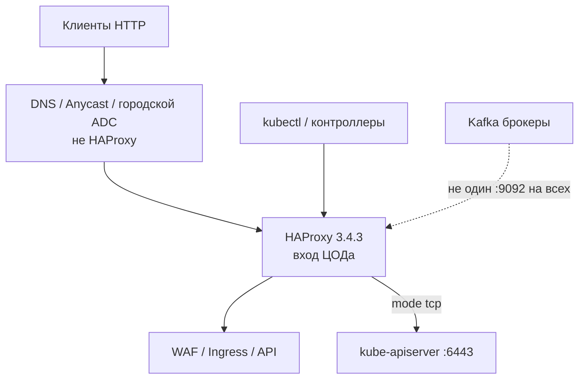
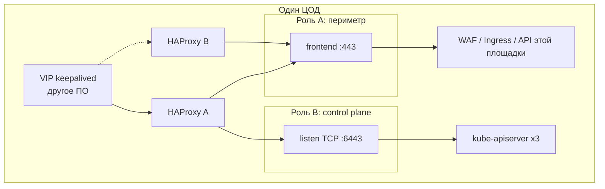
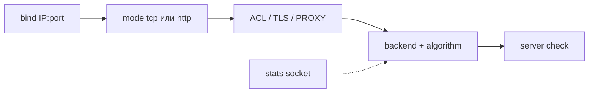
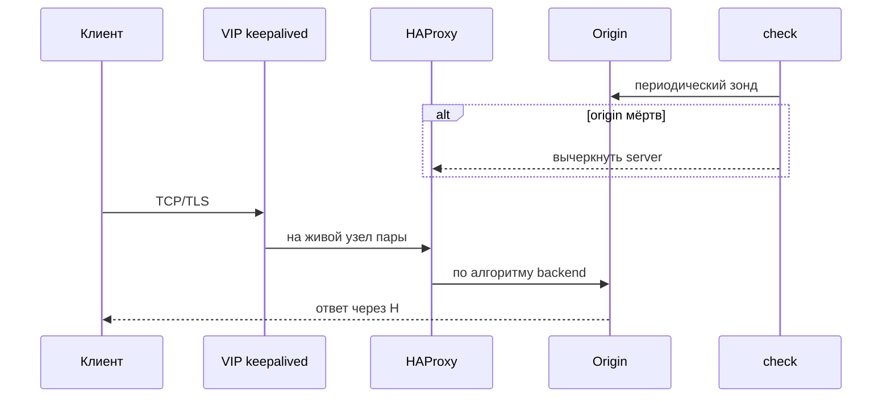
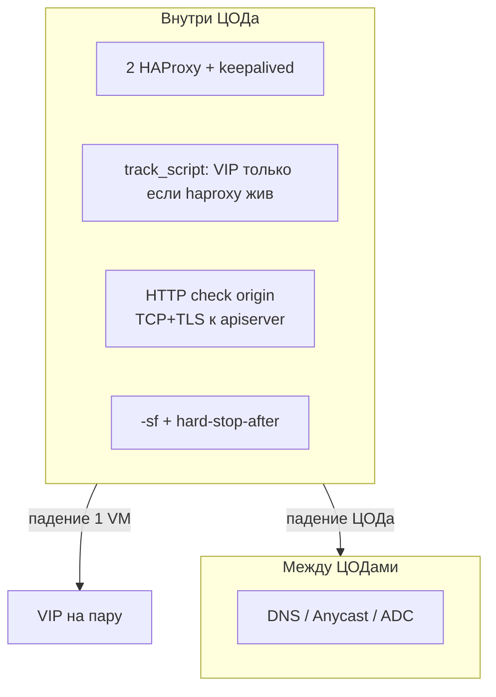
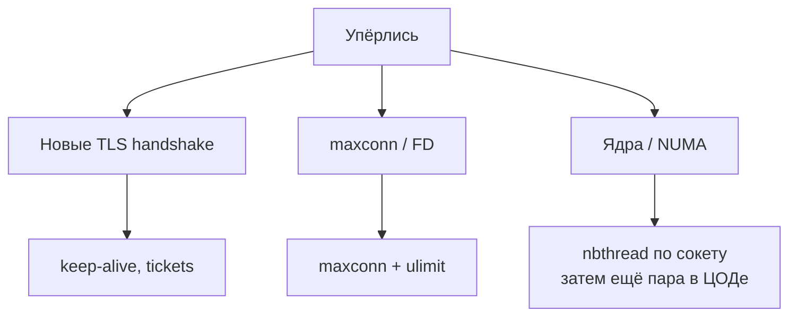
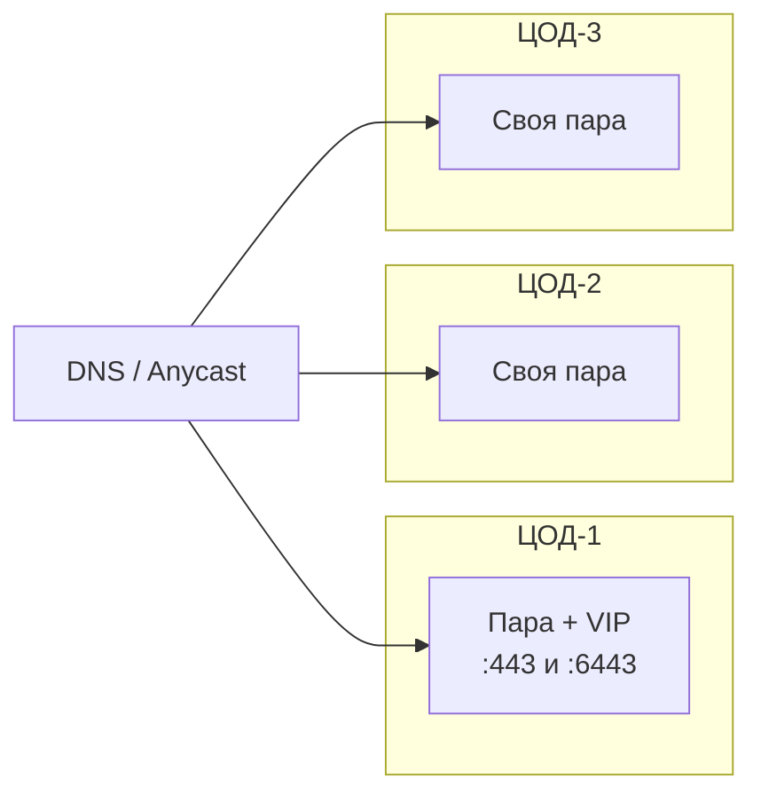

# HAProxy 3.4.3 — схемы устройства

Связанные документы: правила — `HAProxy.md`; установка — `HAProxy.install.md`.

C4 / «D4»: контекст → контейнеры → компоненты. Код ACL не рисуем.

Допущения: stretch «одного HAProxy на 2–3 ЦОДа» **нет**. В **каждом** ЦОДе — **пара** процессов + **keepalived** (VIP) внутри площадки; для kube-apiserver — listen **TCP 6443**. Anycast — **сеть**, не кластер HAProxy. Линия **3.4 LTS**, патч **3.4.3**. Нагрузки нет.

---

## 1. Контекст

HAProxy — **балансировщик TCP/HTTP** на краю ЦОДа и перед control plane. Не WAF, не Ingress «из коробки Kubernetes», не шина.

Клиенты Kafka ходят к **лидеру партиции**. Один TCP frontend «на все брокеры» ломает протокол так же, как HTTP-LB перед Kafka.

Ingress Controller `haproxytech/kubernetes-ingress` — **другой** репозиторий и на дату документа движок **3.2**, не 3.4.3. Data Plane API в бинарь **не** входит.

---

## 2. Контейнеры (два независимых процесса, не кворум)

Отдельного кластера HAProxy с Raft **нет**. Два процесса склеивает VIP / DNS / Anycast. Keepalived IP **сам** не таскает — это другой демон. Starter Guide: failover IP — VRRP/CARP, не Heartbeat.

Пара + keepalived — **внутри ЦОДа** (L2 или unicast VRRP + маршрутизируемый VIP). Один VRRP на три зала не растягиваем.

---

## 3. Компоненты конфига

| Компонент | Для чего настраивать |
|---|---|
| `mode tcp` | Байтовый тоннель: **6443**, gRPC без разбора, Postgres. Kafka сюда кладут только с честным дизайном advertised listeners |
| `mode http` | Заголовки, URL, cookies, XFF. Не для kube-apiserver |
| `check` | Мёртвый origin **вычёркивается**. TCP :443 врёт, если TLS жив, а приложение нет |
| stats socket | Runtime API: drain, сессии, TLS tickets. Пульт, не веб-админка |
| stick-table + peers | Липкость и rate-limit в RAM. Reload **без** peers обнуляет таблицу |
| `nbthread` | С 2.5 `nbproc` **удалён**. Масштаб CPU — потоки одного worker |

`haproxy -c` **до** reload. `master-worker` + `SIGUSR2` / `-sf`: старый worker дожёвывает сессии. Это **не** zero-drop: при высокой нагрузке часть **новых** коннектов может отвалиться.

---

## 4. Поток: клиент и health check

Падение процесса HAProxy: этот VIP мёртв, пока keepalived не уедет (и только если **track** видит, что прокси жив). Иначе VIP висит на машине без прокси — классический простой.

---

## 5. Отказоустойчивость — что настраивать

| Ручка | Если забыть |
|---|---|
| Пара, не один процесс | Падение VM = нет входа площадки |
| Keepalived track процесса | VIP на трупе HAProxy |
| Health check | Трафик на мёртвый origin |
| `hard-stop-after` | Старые worker живут часами на keep-alive |
| Peers, если есть stick-table | После reload лимиты с нуля; квота × число узлов |
| 6443 не с мира | Control plane рядом с сайтом |

Anycast: **один VIP анонсируется с нескольких ЦОДов** — это BGP/маршрутизация, не «кластер HAProxy». Узлы других площадок о мёртвом ЦОДе **не договариваются**. Peers **между** ЦОДами обычно не включают.

---

## 6. Масштабируемость — что настраивать

Starter Guide: **одного ядра хватает >99% установок**; много потоков — в основном TLS и очень широкие каналы. Первая реакция на странный перф часто — **уменьшить** CPU у процесса (не прыгать между сокетами). Цифры бенчмарков из гайда — чужое железо 2010-х / чужой Graviton, не ваша смета.

Не swap. HPA «50 реплик» без стабильного IP и без peers = 50 независимых лимитеров.

«Терабайты озера» на размер HAProxy почти не влияют.

---

## 7. 2–3 ЦОДа без stretch

Минимум размещения входа: 2 процесса × число живых ЦОДов. Это не ёмкость. Origin — **этой** площадки.

**Сильное:** отказ 1 VM закрывается keepalived; отказ 1 ЦОДа — городским слоем; модель stateless совпадает со Starter Guide.  
**Слабое:** Keepalived — свой split-brain; три копии `haproxy.cfg` без GitOps разъедутся; VRRP **не** склеивает три ЦОДа; reload не zero-drop.

---

## 8. Безопасность на той же картине

1. На мир: 80/443. Не stats, не runtime socket, не peers, не **6443**.
2. Stats page не в интернет; PROMEX с localhost. Socket — unix + права.
3. `user` не root после bind; `chroot` если понимаете пути сертификатов.
4. TLS 1.2+; tickets синхронизировать между узлами пары. Origin принимает трафик **только** с IP HAProxy (и WAF).
5. XFF / PROXY — только от доверенных hop. Pin **3.4.3**, не `latest`.

Источники: `HAProxy.md`. Утверждения «Keepalived сам склеит три ЦОДа» в документации **нет**.
