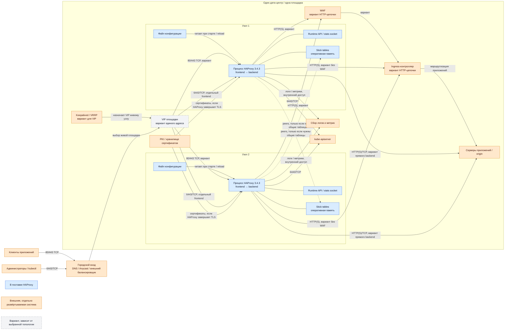

# HAProxy 3.4.3 — развёртывание и настройка

HAProxy — балансировщик TCP и HTTP: принимает соединения и раскидывает их на живые серверы. Этот документ про **community** версию **3.4.3** (патч линии 3.4 LTS, опубликован 29 июля 2026; на дату подготовки — последний стабильный патч текущей LTS). Это не HAProxy Enterprise и не Ingress-контроллер Kubernetes (другой репозиторий и **другая** линия движка).

Сайт: https://www.haproxy.org/  
Документация 3.4: введение https://docs.haproxy.org/3.4/intro.html · управление https://docs.haproxy.org/3.4/management.html · конфигурация https://docs.haproxy.org/3.4/configuration.html  
Образ: `haproxy:3.4.3` (теги `3.4`, `lts`; Alpine — `haproxy:3.4.3-alpine`).

Линия 3.4 — LTS: на haproxy.org поддержка **до Q2 2031**. Нечётные линии живут около года и по правилам проекта **не** кладут туда, откуда нельзя быстро откатиться. В бой берём **уже вышедший патч 3.4.3**, не `latest` и не `3.5-dev`.

Этот текст — не набор команд «скопируй конфиг», а правила, без которых система не будет одновременно устойчивой к сбоям, масштабируемой и безопасной. Пошаговая установка — в `HAProxy.install.md`.

HAProxy **не** замена WAF, **не** Ingress «из коробки Kubernetes» и **не** шина событий.

---

## Назначение системы

HAProxy нужен, чтобы **склеить несколько живых копий сервиса в один адрес** и **не отправлять клиентов на мёртвый сервер**. Клиент стучится в балансировщик; тот проверяет живость, при необходимости снимает TLS и пересылает.

Система **не хранит** эталон данных и **не** понимает протокол Kafka как «один вход на всех брокеров». Правильное место — **вход HTTP/TCP** площадки и **вход к API Kubernetes** (часто порт 6443). Если повесить HAProxy и отдать тот же сервис наружу в обход — балансировщик становится декорацией.

Плавающий адрес между двумя машинами HAProxy **сам не таскает**. Для этого рядом ставят Keepalived (другое ПО) или оставляют склейку DNS/сервису Kubernetes.

---

## Перечень функций

Что умеет community HAProxy 3.4:

1. **Слушать вход** (frontend): IP:порт, TLS или нет, HTTP или сырой TCP.
2. **Раскидывать на ферму** (backend): список серверов, алгоритм, проверки живости. Мёртвый сервер из балансировки **вычёркивается**.
3. **Держать запасной origin**: в игру, когда основные мертвы.
4. **Ограничивать число соединений** (глобально и на вход/ферму). Без потолка процесс съест дескрипторы и память.
5. **Масштабироваться потоками внутри одного процесса** (с 2.5 несколько worker-процессов `nbproc` **удалены**). По умолчанию — поток на каждое доступное ядро.
6. **Мягко менять конфиг**: новый процесс берёт порты, старый дожёвывает уже открытые сессии. Это **не** «ноль оборванных»: при высокой нагрузке часть **новых** соединений может отвалиться.
7. **Отдавать пульт по сокету**: снять сервер с фермы, посмотреть сессии, обновить ключи TLS. Это не веб-админка.
8. **Показывать HTML-статистику**. На тесте удобно. В интернет **не** выставляют.
9. **Отдавать метрики Prometheus**, если сборка с этим сервисом (в исходниках по умолчанию **выкл**; в официальном образе обычно есть — проверять `haproxy -vv`).
10. **Помнить в памяти** «этот клиент → тот сервер» и счётчики для ограничения частоты. Это **не** диск. Смена конфига без синхронизации таблиц **обнуляет** память.
11. **Копировать эти таблицы** между процессами (протокол peers) — иначе у каждого узла своя правда о лимитах.
12. **Терминировать TLS** или пробрасывать его не разбирая (выбор сервера по имени в ClientHello / по порту).
13. **HTTP/3 по UDP** — только если собрали с этой опцией. Введение по-прежнему пишет: HAProxy **не** балансировщик произвольных UDP-пакетов и не делает NAT/DSR.

Отдельного «кластера HAProxy» с голосованием, как у etcd, **нет**. Несколько процессов — несколько независимых прокси, которые вы склеиваете плавающим адресом, DNS, Anycast и/или копированием таблиц.

Чего система **не** делает и часто путают: не таскает VIP сама (это Keepalived/VRRP/BGP), не семантический WAF, не читает Ingress-объекты Kubernetes (это другой продукт, на дату документа latest контроллера собран с HAProxy **3.2**, не 3.4.3), не правит конфиг по REST из коробки (Data Plane API — отдельный процесс), не заменяет advertised listeners Kafka, не ГОСТ-криптография, не единое состояние на три дата-центра.

---

## Основные элементы системы и зависимости

Это **один** процесс `haproxy` плюс файлы конфигурации. Устойчивость входа — несколько таких процессов и механизм склейки адреса.

### Схема инстансов и потоков

Цвета — часть схемы: **синие блоки** входят в поставку и конфигурацию HAProxy; **оранжевые блоки** — внешние, отдельно развёртываемые системы с собственным жизненным циклом; **серый пунктирный блок** — топологический вариант, а не обязательный компонент. Пунктирные стрелки показывают необязательные связи. Надпись на стрелке задаёт протокол, порт или условие использования.

### Что входит в состав

#### Компоненты поставки HAProxy

1. **Процесс HAProxy 3.4.3.** Технология — community HAProxy: пакет Linux или официальный контейнер `haproxy:3.4.3`; это два варианта упаковки одного прокси, а не два обязательных слоя. Процесс принимает TCP/HTTP-соединения во `frontend`, выбирает живой сервер из `backend`, может завершать или прозрачно пропускать TLS. Граница поставки заканчивается на исходящем соединении к выбранному backend: HAProxy не устанавливает и не администрирует WAF, Ingress, Kubernetes или приложение.
2. **Файл конфигурации.** Текстовый файл HAProxy описывает входы, фермы, проверки живости, алгоритмы, таймауты и TLS. Перед reload его синтаксис проверяет бинарь `haproxy -c`. Сам репозиторий конфигурации, доставка файла и управление секретами — процессы эксплуатации платформы, не встроенная система управления HAProxy.
3. **Runtime API / stats socket.** Интерфейс работающего процесса позволяет читать состояние и выполнять ограниченные оперативные действия, например выводить сервер из балансировки. Основной вариант — Unix-сокет; TCP-доступ возможен конфигурационно, но тогда это внутренний защищённый интерфейс. Веб-консоль управления в community-поставку не входит.
4. **Stick tables.** Таблицы в оперативной памяти хранят привязку клиента, счётчики и данные для ограничения частоты. Они не являются дисковой базой. Протокол `peers` — **вариант**, необходимый только когда выбранные правила требуют общего состояния между процессами пары; распространение состояния между дата-центрами здесь не заявляется.

#### Внешние и отдельно развёртываемые компоненты

1. **Клиенты приложений и администраторы.** Это источники трафика. Пользовательский HTTP(S) и административный доступ к Kubernetes показаны отдельно, потому что у них разные порты и правила доступа. Они находятся вне поставки HAProxy.
2. **Городской вход.** DNS, Anycast или внешний балансировщик — **альтернативные варианты** выбора живой площадки. Какой вариант принят платформой, из исходных данных неизвестно. HAProxy не предоставляет общий VIP на три дата-центра и не выполняет межплощадочное голосование.
3. **VIP площадки.** Плавающий IP — **вариант** единого адреса внутри площадки. Он существует только при поддержке выбранной сетевой топологией. Сам адрес не является процессом HAProxy и не переносится им.
4. **Keepalived / VRRP.** Отдельное ПО, которое может назначать VIP живому узлу. Оно требуется только для варианта с VIP; альтернативами могут быть BGP, внешний балансировщик или Kubernetes Service. Проверка состояния HAProxy должна участвовать в решении о переносе адреса, иначе VIP может остаться на узле с неработающим прокси.
5. **PKI / хранилище сертификатов.** Внешний источник сертификатов и ключей. Зависимость возникает, только если HAProxy завершает TLS или повторно шифрует соединение к backend. При сквозном TCP-пробросе TLS сертификат сервиса может находиться на следующем узле цепочки.
6. **Сбор логов и метрик.** Внешний syslog/stdout-конвейер и, если сборка поддерживает сервис Prometheus, внутренний сборщик метрик. HAProxy формирует телеметрию, но её долговременное хранение и визуализация в поставку не входят.
7. **WAF.** Отдельный фильтр прикладного HTTP-трафика. Это **вариант** цепочки, если он предусмотрен архитектурой безопасности; HAProxy сам семантическим WAF не является. Положение WAF до или после HAProxy исходными данными не закреплено, поэтому схема показывает только один возможный порядок после балансировщика.
8. **Ingress-контроллер.** Отдельный компонент маршрутизации приложений Kubernetes и **вариант** следующего хопа. Бинарь HAProxy 3.4.3 сам не читает объекты Ingress; `haproxytech/kubernetes-ingress` — другой продукт и другая версия движка.
9. **kube-apiserver.** Внешний backend административного TCP-входа 6443. HAProxy проверяет доступность API-серверов и распределяет соединения, но не участвует в консенсусе control plane.
10. **Серверы приложений / origin.** Конечные backend-сервисы площадки. Они могут быть доступны напрямую из backend HAProxy либо через WAF/Ingress — это взаимоисключающие или комбинируемые варианты конкретной HTTP-цепочки. Состав приложений не является частью HAProxy.

### Как читать схему

1. Начинайте слева с типа клиента. Пользовательский поток идёт по 80/443 TCP, административный `kubectl` — по 6443/TCP. Эти потоки не означают общий `frontend`: для них нужны отдельные точки входа и разные правила доступа.
2. Блок «Городской вход» выбирает площадку. На схеме перечислены варианты технологии через косую черту; одновременное наличие DNS, Anycast и внешнего балансировщика не предполагается. Механизм и критерий переключения площадки должны быть определены отдельно.
3. Внутри выбранной площадки поток приходит на VIP только в варианте с плавающим адресом. Keepalived может держать VIP на одном из двух узлов, но HAProxy сам адрес не переносит. Если VIP в сети невозможен, этот блок и Keepalived заменяются выбранным внешним механизмом.
4. На каждом узле работает собственный процесс HAProxy со своим конфигурационным файлом, runtime-сокетом и таблицами в памяти. Это два независимых прокси, а не кластер с лидером и общим диском.
5. Сплошные внутренние связи с файлом, сокетом и таблицей показывают локальные элементы процесса. Пунктирные стрелки `peers` между узлами включаются только при необходимости синхронизировать выбранные stick tables; без такой настройки память узлов независима.
6. Для HTTP(S) после HAProxy показаны варианты: прямой backend приложения, Ingress либо цепочка через WAF и Ingress. Схема не утверждает, что все три маршрута должны существовать одновременно. Фактический порядок WAF/Ingress требуется утвердить отдельно.
7. Поток 6443/TCP идёт прямо к `kube-apiserver` как отдельному backend. Он не проходит через HTTP-цепочку приложений. Открывать этот вход следует административным сетям, а не всем клиентам сайта.
8. PKI связано с каждым процессом условной подписью: эта зависимость нужна при завершении TLS на HAProxy. Система наблюдения получает логи и метрики по внутреннему доступу; runtime-сокет и статистика не должны быть публичным входом.
9. Стрелки заканчиваются на локальных backend площадки. Между дата-центрами процессы HAProxy не выбирают лидера и не перенаправляют трафик сами; отказ площадки должен обработать городской вход.
10. Kafka на схеме отсутствует намеренно: HAProxy не следует ставить единственной TCP-точкой `:9092` перед всеми брокерами, потому что это не заменяет адреса, объявляемые клиентам самими брокерами.

### Порты (контракт сети)

Конкретные порты задаёте вы. Типичный контракт платформы:

| Порт | Назначение | Кому открывать |
|---|---|---|
| **80 / 443** | HTTP(S) вход площадки | Клиенты / городской слой. Не stats, не пульт |
| **6443/TCP** | API Kubernetes | Только административные сети, не «как у сайта» |
| Сокет статистики / метрик | HTML или Prometheus | localhost / внутренний сборщик, не мир |
| Канал копирования таблиц | peers | Только узлы пары, не мир |

TLS на 443 **не** открывает отдельный «TLS-порт балансировщика»: это тот же bind с сертификатом. Пробрасывание TLS без разбора — режим TCP.

### Зависимости окружения

- PKI для сертификатов входа и (если нужно) повторного шифрования до origin.
- Keepalived — только если выбран VIP внутри одного домена маршрутизации.
- Origin должен принимать трафик **только** с адресов HAProxy (и WAF, если он следующий шаг). Иначе балансировщик обходят.

Это зависимости выбранной топологии, а не автоматически устанавливаемые части HAProxy. Наличие городского входа, возможность VIP, положение WAF/Ingress, способ сбора телеметрии и необходимость `peers` должны быть подтверждены владельцами соответствующих систем.

### Специальная терминология

- **Frontend** — точка приёма HAProxy: адрес, порт, протокол и правила обработки входящего соединения.
- **Backend** — именованная группа серверов и правила выбора сервера, куда HAProxy передаёт соединение.
- **Origin** — конечный сервер приложения, который формирует ответ клиенту.
- **Health check** — проверка живости backend-сервера; неуспешно проверенный сервер временно исключается из балансировки.
- **VIP (Virtual IP)** — плавающий IP-адрес, который сеть или отдельное ПО назначает активному узлу.
- **VRRP** — сетевой протокол выбора владельца виртуального маршрутизатора; Keepalived может использовать его для VIP.
- **Anycast** — сетевой вариант, при котором один адрес анонсируется из нескольких точек, а маршрут выбирает сеть.
- **Runtime API / stats socket** — административный интерфейс работающего процесса HAProxy, обычно локальный Unix-сокет.
- **Stick table** — таблица HAProxy в оперативной памяти для привязок клиентов, счётчиков и ограничений частоты.
- **Peers** — протокол HAProxy для копирования выбранных stick tables между процессами.
- **TLS termination** — завершение шифрованного соединения на HAProxy с использованием сертификата; дальше трафик может идти открыто или быть зашифрован повторно.
- **TLS passthrough** — передача зашифрованного TCP-потока без расшифровки содержимого HAProxy.
- **Reload** — запуск нового процесса с новой конфигурацией при постепенном завершении старого; это не гарантия отсутствия обрывов новых соединений.
- **WAF** — отдельный межсетевой экран прикладного уровня, который анализирует HTTP-содержимое; обычная балансировка HAProxy его не заменяет.
- **Ingress-контроллер** — компонент Kubernetes, который читает объекты Ingress и настраивает маршрутизацию к сервисам; самостоятельный HAProxy 3.4.3 этого не делает.

---

## Краткие вводные

### Как устроена отказоустойчивость

HAProxy **задуман без своего склада данных** (введение): перехват должен быть возможным без «восстановления базы балансировщика».

| Что падает | Что происходит |
|---|---|
| Один origin в ферме | Проверка снимает его, остальные получают трафик |
| Процесс HAProxy на узле | Этот VIP/под **мёртв**, пока не перезапустится или пока Keepalived/Kubernetes не перенесёт адрес |
| Один дата-центр | Узлы других залов **не** выбирают нового лидера HAProxy. Нужен городской механизм |
| Reload | Короткие окна потери **новых** соединений; старые сессии доживают на старом процессе |
| Таблица в памяти без копирования | После reload/падения узла липкость и лимит частоты **с нуля** |

Следствие: устойчивость входа = **минимум два живых HAProxy**, которые снаружи выглядят как один адрес, плюс проверка живости, плюс (если нужны лимиты/липкость) копирование таблиц. Один процесс на три зала устойчивости **не даёт**.

Keepalived решает «два сетевых интерфейса в одном домене делят VIP». Он **не** решает «три дата-центра», пока сеть не даёт Anycast/DNS/внешний балансировщик.

### Как устроено масштабирование

Два независимых рычага:

1. **Вертикально** — ядра под TLS, потолок соединений, очереди сетевой карты, **не swap**. Рукопожатие TLS жрёт CPU; keep-alive дешевле. Введение: порядок запросов в секунду падает примерно **в 10 раз** от TLS keep-alive к возобновлению сессии и ещё раз к полному рукопожатию с RSA.
2. **Горизонтально** — ещё узлы за VIP/DNS/Anycast. Каждый узел — свой процесс, свой потолок. Это умножает ёмкость **и** даёт запас.

HPA «50 реплик» в Kubernetes **без** стабильного IP и без копирования таблиц даёт 50 независимых лимитеров и ломает «прилипание» клиента.

### Безопасность самого HAProxy

Процесс на периметре в HTTP-режиме видит URL, заголовки, часто cookies, при снятии TLS — содержимое до origin. Сокет пульта и страница статистики — **полный пульт** фермы. Выставить статистику в интернет = отдать карту бэкендов и кнопки «сними с фермы».

После старта бинарь специально **не** ходит в файловую систему: компрометация процесса не равна «читает весь диск», но равна «видит трафик, который через него идёт».

---

## Допущения

Ниже то, чего не было в исходном запросе, но без чего нельзя нарисовать конкретную схему. Если допущение неверно — схему надо пересмотреть.

1. Берём **community 3.4.3**, не Enterprise.
2. Целевая роль боя — L4/L7 на выделенных Linux-машинах (или поды с сетью хоста) на краю площадки, плюс отдельный маленький listen для API Kubernetes, если control plane свой. Ingress-контроллер 3.2 — **запасной** путь «всё внутри Kubernetes», с движком **3.2**.
3. Перед фермой HAProxy (между залами) есть или будет механизм направления клиентов на живую площадку: DNS, городской балансировщик, Anycast. Сам HAProxy три зала в один VIP не склеит.
4. Внутри площадки для пары есть широковещательный домен или unicast VRRP + маршрутизируемый VIP. Если «только L3, VIP нельзя» — Keepalived бесполезен, нужен BGP или внешний вход.
5. Три дата-центра = три домена отказа. На каждый живой зал — свой вход (лучше пара). Один Keepalived на три зала не рассматривается.
6. Нагрузки HTTP/TLS нет — нет числа узлов и ядер «хватит для боя».
7. Формального круглосуточного договора нет. Схема «пара в зале + городской failover» переживает отказ 1 зала **по входу**, если DNS/Anycast это умеют.
8. HAProxy не ставится единственным `:9092` перед всеми брокерами Kafka.
9. Корпоративные сертификаты есть или будут. «Не проверять сертификат origin в бою» не считаем настройкой.
10. Шифрование канала — обычный TLS сборки OpenSSL. ГОСТ не озвучен.
11. Учебный стенд изолирован. На нём допустим HTTP и статистика на loopback. В бой это не копируем, но проверку конфига перед reload лучше включить сразу.
12. Camunda, озеро, интеграционное API — origin (или живут за Ingress/WAF). Их таймауты должны попасть в таймауты сервера и туннеля, иначе HAProxy рвёт легитимные долгие опросы.

---

## Критически важные условия, которых нет в исходном контексте

Их нужно закрыть **до** закупки VIP и «постановки в бой».

| Пробел | Почему это ломает решение |
|---|---|
| **Есть ли городской вход / Anycast / DNS между тремя залами** | Без этого три HAProxy — три острова. Keepalived внутри зала город не спасёт |
| **Можно ли VIP внутри зала** | Нет VIP и нет BGP — нет классической пары active-passive |
| **Задержка и потери между залами** | На проверку локального origin почти не влияет. Влияет на Anycast/DNS и на соблазн тащить HTTP origin «в чужой зал» |
| **Какой трафик реально идёт через HAProxy** | От этого зависят режим, таймауты, TLS vs проброс, нужен ли WAF |
| **Профиль нагрузки** (новые соединения/с, доля TLS, пик) | Без этого нельзя сказать ни потолок соединений, ни ядра |
| **Топология Kubernetes и где Ingress** | HAProxy перед Ingress, вместо Ingress или только 6443 — три разных схемы |
| **Где стоит WAF** | Порядок хопов меняет, кому верить про реальный IP клиента |
| **Требования ИБ: ГОСТ, персональные данные, запрет привилегированных подов** | Меняют TLS, сеть хоста, возможность Ingress-контроллера |
| **Нужна ли липкость / лимит частоты на периметре** | Тогда копирование таблиц внутри пары обязательно; иначе два узла = двойная квота атакующему |
| **Долгие интеграции (минуты ожидания ведомства)** | Заводские таймауты порядка секунд **убивают** сценарий. Замерить, не угадать |

---

## Источники (чтобы не принимать на веру)

- Релизы и LTS 3.4 (Q2 2031), пакет 3.4.3: https://www.haproxy.org/
- Что HAProxy делает и не делает, VRRP, таблицы, sizing: https://docs.haproxy.org/3.4/intro.html
- Reload, ядро 3.9, master-worker: https://docs.haproxy.org/3.4/management.html
- Ключевые слова конфига: https://docs.haproxy.org/3.4/configuration.html
- Официальный образ: https://hub.docker.com/_/haproxy
- Ingress-контроллер 3.2.13 ≠ 3.4.3: https://github.com/haproxytech/kubernetes-ingress/releases
- Анонс линии 3.4: https://www.haproxy.com/blog/announcing-haproxy-3-4

Утверждения вида «N Гбит/с на нашу ферму» или «Keepalived сам склеит три дата-центра» в документации **отсутствуют**. Порог задержки, при котором копирование таблиц «на город» ещё можно, проектом **не задан**.
