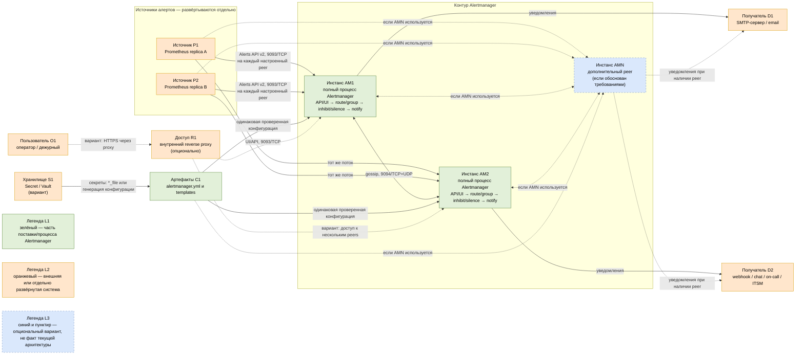

# Prometheus Alertmanager 0.34.0 — маршрутизация оповещений

В запросе продукт назван **AlterManager**. Официальное название — **Prometheus Alertmanager**. Это отдельная программа экосистемы Prometheus, которая принимает уже вычисленные алерты, группирует, дедуплицирует, подавляет и отправляет уведомления.

Документ фиксирует версию **0.34.0**, выпущенную 16 августа 2026. Образ: `quay.io/prometheus/alertmanager:v0.34.0`. Если Alertmanager ставится как часть зафиксированного `kube-prometheus-stack`, версия должна совпадать с проверенной матрицей чарта, а не заменяться отдельно «на latest».

Документация: https://prometheus.io/docs/alerting/latest/alertmanager/  
Релиз: https://github.com/prometheus/alertmanager/releases/tag/v0.34.0

---

## Назначение системы

Alertmanager превращает поток одинаковых срабатываний из Prometheus в управляемые уведомления дежурным. Он применяет дерево маршрутов, группирует похожие алерты, не отправляет повтор одного события с каждой реплики Prometheus, учитывает silence и inhibition и вызывает настроенные receivers.

Alertmanager **не вычисляет условия алертов** — это делает Prometheus по alerting rules. Он не хранит метрики, не заменяет систему управления инцидентами и не гарантирует доставку, если внешний SMTP/webhook/on-call сервис не принял сообщение.

---

## Перечень функций

1. **Принимать алерты** от Prometheus по HTTP API v2.
2. **Группировать** алерты по выбранным labels, чтобы одна авария не создавала сотни сообщений.
3. **Дедуплицировать** одинаковые алерты от HA-реплик Prometheus.
4. **Маршрутизировать** по дереву `route` в разные receivers, команды и окружения.
5. **Подавлять уведомления silence** на заданный срок и набор matchers.
6. **Применять inhibition**: например, не уведомлять о сервисах, если уже сработал алерт недоступности площадки.
7. **Повторять уведомления** по `repeat_interval`, пока алерт остаётся активным.
8. **Рендерить шаблоны** заголовков и текста уведомлений.
9. **Отправлять** в email, webhook и поддерживаемые on-call/chat интеграции.
10. **Работать HA-кластером** через gossip для обмена silences и координации уведомлений.
11. **Перезагружать конфигурацию** без полной остановки после её проверки.
12. **Отдавать UI, API и собственные Prometheus-метрики**.

Alertmanager работает по принципу fail-open: при разделении кластера возможны дубли уведомлений, чтобы не потерять критическое сообщение. Это не Raft-кворум и не гарантия «ровно один раз».

---

## Основные элементы системы и зависимости

### Схема инстансов и потоков

Схема показывает логические потоки, а не подтверждённую топологию конкретного стенда. Сплошная линия означает основной ожидаемый поток, пунктир — вариант, который требует решения и проверки. Цветовая легенда продублирована внутри схемы: зелёные блоки относятся к Alertmanager, оранжевые развёртываются отдельно, синим показан опциональный дополнительный peer. Reverse proxy остаётся внешней системой даже тогда, когда поставляется тем же Helm-стеком.

### Описание компонентов

#### Источник P1 / Источник P2

- **Что это:** независимые реплики Prometheus или другие совместимые клиенты Alerts API v2. Две реплики показаны как HA-вариант, а не как установленный факт.
- **Технологии и варианты:** Prometheus; совместимость иных клиентов должна проверяться по API. Число реплик зависит от фактического контура.
- **Назначение:** вычислять alerting rules и регулярно отправлять активные алерты напрямую на каждый настроенный Alertmanager.
- **Граница:** отдельная система; в продукт Alertmanager не входит. Между Prometheus и peers не следует ставить балансировщик, скрывающий адреса отдельных peers.

#### Инстанс AM1 / Инстанс AM2 / Инстанс AMN

- **Что это:** каждый блок — самостоятельный полный процесс Alertmanager 0.34.0, а не отдельный микросервис одной внутренней функции.
- **Технологии и варианты:** бинарный процесс или контейнер `quay.io/prometheus/alertmanager:v0.34.0`; возможна поставка через Prometheus Operator/kube-prometheus-stack после проверки матрицы совместимости. AM1 и AM2 иллюстрируют HA, AMN — только возможность дополнительного peer.
- **Назначение:** принять алерт через API, применить routing, grouping, silences и inhibition, сформировать уведомление и передать его receiver. Peers обмениваются silences и notification log через gossip.
- **Граница:** часть продукта Alertmanager. Требуемое число peers, размещение по узлам и площадкам без данных о SLA, нагрузке, RTT и потерях определить нельзя.

#### Артефакты C1

- **Что это:** `alertmanager.yml` и файлы Go templates, загружаемые процессом Alertmanager.
- **Технологии и варианты:** обычные файлы, Kubernetes ConfigMap/Secret либо результат генерации системой конфигурации; перед применением — `amtool check-config`.
- **Назначение:** задать route tree, receivers, inhibition rules, интервалы и формат сообщений. Все peers одного контура должны получать согласованную проверенную конфигурацию.
- **Граница:** конфигурация и шаблоны входят в состав поставки Alertmanager; ConfigMap, GitOps-контроллер или иной механизм доставки развёртывается отдельно.

#### Хранилище S1

- **Что это:** внешний источник чувствительных значений; на схеме показан как допустимый вариант, а не обязательный компонент.
- **Технологии и варианты:** Kubernetes Secret, Vault или другое корпоративное хранилище. Предпочтительны параметры `*_file`, если конкретная интеграция их поддерживает, либо безопасная генерация конфигурации.
- **Назначение:** не хранить SMTP passwords, webhook URL и API tokens в открытом Git или непосредственно в документации.
- **Граница:** отдельная система, не часть Alertmanager.

#### Пользователь O1

- **Что это:** оператор или дежурный, работающий с UI/API.
- **Технологии и варианты:** браузер, `amtool` или API-клиент с аутентификацией на разрешённом внутреннем пути.
- **Назначение:** просматривать группы алертов и управлять silences. Пользователь не является receiver: receiver — конфигурация интеграции.
- **Граница:** внешний участник, не часть продукта.

#### Доступ R1

- **Что это:** опциональный внутренний reverse proxy перед UI/API для пользовательского доступа.
- **Технологии и варианты:** ingress controller, корпоративный proxy или прямой доступ к 9093 в доверенной сети. Конкретная технология неизвестна.
- **Назначение:** завершать TLS, выполнять аутентификацию и ограничивать доступ. Этот путь не должен заменять прямую отправку алертов Prometheus на каждый peer.
- **Граница:** отдельная система, даже если установлена тем же Helm-релизом.

#### Получатель D1 / Получатель D2

- **Что это:** внешние точки доставки: SMTP/email и webhook, chat, on-call либо ITSM.
- **Технологии и варианты:** конкретные продукты и каналы в исходных данных не указаны; поддержка и параметры сверяются с конфигурацией Alertmanager 0.34.0.
- **Назначение:** принять сформированное уведомление и доставить его человеку или следующей системе. Их доступность, rate limits, retry-поведение и жизненный цикл инцидента проектируются отдельно.
- **Граница:** отдельные системы, не часть Alertmanager. Alertmanager не гарантирует доставку после границы внешнего сервиса.

#### Легенда L1 / L2 / L3

- **Что это и назначение:** поясняющие блоки без сетевых потоков. L1 отмечает элементы Alertmanager, L2 — внешние системы, L3 — неподтверждённые варианты.
- **Технологии и граница:** это элементы документации, а не развёртываемые компоненты.

### Как читать схему

1. Чтение начинается слева: P1/P2 вычисляют правила. Alertmanager условия алертов не вычисляет и метрики не хранит.
2. Каждая реплика Prometheus должна знать адреса отдельных peers и отправлять один и тот же поток **каждому** из них через 9093/TCP. Доступность UI или одного VIP не проверяет этот HA-путь.
3. Внутри каждого AM-блока перечислена последовательность логических стадий одного процесса. Это не отдельные сетевые сервисы и не доказательство конкретной внутренней реализации версии.
4. AM1/AM2 обмениваются кластерным состоянием по 9094/TCP+UDP. Если используется AMN, он должен иметь маршрутизируемый gossip-путь к остальным peers; публично 9094 не открывается.
5. Кластер не использует Raft-кворум и не обещает exactly-once. При partition возможны дубли уведомлений: fail-open выбран вместо риска полного молчания.
6. C1 поступает одинаково на все peers. Секреты из S1 не следует показывать в схеме значениями; стрелка отражает логическую поставку, а не обязательный прямой сетевой вызов Alertmanager к Vault.
7. Поток O1 → R1 → AM1/AM2 относится только к работе оператора с UI/API. R1 опционален, а его наличие не меняет требование отправки Prometheus на каждый peer.
8. Стрелки к D1/D2 показывают возможные классы receivers, но не закрепляют конкретный канал за конкретным peer: координация peers определяет отправителя группы во время работы.
9. Сплошные связи отражают базовый иллюстративный вариант из двух peers. Пунктирные связи и синие блоки требуют подтверждения по среде.
10. Для принятия архитектурного решения остаётся уточнить: стенд это или бой; число реплик Prometheus; число и расположение площадок; RTT/потери между ними; каналы доставки и их владельцев; SLA, нагрузку и требования к доступу UI.

### Термины и пояснения

- **Alert (алерт)** — набор labels, annotations, времени начала и других полей, который клиент передаёт Alertmanager после вычисления условия.
- **Alerting rule** — правило в Prometheus, которое вычисляет состояние pending/firing; не является функцией Alertmanager.
- **Annotation** — поясняющее поле алерта, например summary или description; не предназначено для идентификации группы и должно считаться недоверенными данными.
- **Label** — пара ключ-значение, идентифицирующая алерт и используемая для маршрутизации, группировки и сопоставления.
- **Matcher** — условие сравнения label, используемое в routes, silences и inhibition rules.
- **Route / route tree** — корневое правило и его дочерние правила, выбирающие receiver и параметры группировки по labels.
- **Receiver** — именованная конфигурация одной или нескольких интеграций уведомлений; это не обязательно человек и не сам внешний сервис.
- **Grouping** — объединение нескольких алертов с одинаковыми выбранными labels в одно уведомление.
- **Deduplication** — предотвращение повторной отправки одной и той же группы, в том числе когда алерт пришёл от HA-реплик Prometheus.
- **Silence** — созданное пользователем временное подавление уведомлений по matchers; не исправляет правило и первопричину.
- **Inhibition** — автоматическое подавление уведомления о целевом алерте при наличии другого активного алерта и совпадении настроенных labels.
- **Peer** — один самостоятельный процесс Alertmanager, участвующий в HA-кластере.
- **Gossip** — протокол обмена кластерным состоянием между peers по 9094/TCP+UDP без Raft-кворума.
- **Notification log** — реплицируемое состояние уже отправленных уведомлений, используемое для координации и дедупликации.
- **Partition / split-brain** — потеря связи между частями кластера, при которой части могут независимо отправить одинаковое уведомление.
- **Fail-open** — поведение, допускающее возможный дубль при неопределённости, чтобы снизить риск потери критического уведомления.
- **HA (high availability)** — схема с несколькими репликами/peers; сама по себе не означает exactly-once и требует проверки полного пути доставки.
- **Alerts API v2** — HTTP API Alertmanager на 9093/TCP, через который Prometheus отправляет алерты.
- **UI** — встроенный веб-интерфейс Alertmanager для просмотра алертов и silences; его доступность не доказывает работоспособность доставки.
- **Template** — Go template для формирования текста и полей уведомления.
- **Resolved-уведомление** — сообщение о завершении алерта, отправляемое только если это включено для интеграции.
- **Alert storm** — всплеск большого числа алертов/уведомлений; устраняется у источника и настройками grouping/routing, а не постоянными silences.

### Что входит в состав

| Элемент | Назначение | Масштабирование |
|---|---|---|
| Alertmanager process | API, маршруты, группы, уведомления | Число peers определяется SLA, нагрузкой и сетевой топологией |
| Configuration | Route tree, receivers, inhibition, интервалы | Одинаковая на всех peers |
| Templates | Текст уведомлений | Одинаковые файлы/ConfigMap |
| Gossip state | Silences и координация | Реплицируется между peers |
| Notification log | Дедупликация уведомлений | Обменивается кластером |

Prometheus, reverse proxy, SMTP и on-call платформа в состав не входят.

### Порты (контракт сети)

| Порт | Назначение | Кому открывать |
|---|---|---|
| **9093/TCP** | UI, API v2, приём алертов, `/metrics` | Prometheus и внутренний proxy |
| **9094/TCP+UDP** | Gossip между peers | Только Alertmanager peers |

При TLS транспорта gossip используется TCP. `--cluster.advertise-address` должен быть маршрутизируемым **IP:port**, не hostname. Порты 9093 и 9094 нельзя публиковать в интернет; для HA проверяется доступ Prometheus к 9093 каждого peer и двусторонняя связность peers по 9094.

---

## Краткие вводные

### Отказоустойчивость

Рекомендуемая схема одного контура — 2–3 peer. Prometheus знает адрес каждого peer и отправляет всем. Кластер Alertmanager не имеет кворума: даже один доступный peer продолжает отправку. При split-brain ждём дубли, а не тишину. В multi-DC неизвестный RTT и потери сначала измеряются; независимые контуры часто безопаснее растянутого gossip.

### Масштабирование

Alertmanager масштабируют не ради хранения метрик, а по числу активных групп, скорости уведомлений и доступности. Бесконтрольное увеличение peers повышает gossip-трафик и задержку согласования. Основные рычаги — корректные labels, grouping, интервалы и устранение alert storm у источника.

### Безопасность

- 9093 не публиковать в интернет; UI позволяет видеть инфраструктуру и создавать silences.
- Включить TLS и аутентификацию через `--web.config.file`/внутренний proxy.
- Для gossip через недоверенную сеть использовать mTLS.
- Пароли SMTP, webhook URL и токены хранить как Secret/Vault; применять варианты `*_file`, где доступны.
- Проверять шаблоны: labels/annotations из приложений могут содержать персональные данные и служебные URL.

---

## Допущения

1. Используется self-hosted Alertmanager **0.34.0**.
2. Alertmanager получает алерты прежде всего от Prometheus; прямые клиенты API — исключение.
3. В одном дата-центре запускаются 2–3 peers с одинаковой конфигурацией.
4. Для каждого receiver есть владелец, тестовый маршрут и понятная эскалация.
5. Секреты не хранятся в открытом git.
6. Совместимость с версией Prometheus Operator/kube-prometheus-stack проверяется отдельно.

---

## Источники

- Обзор Alertmanager: https://prometheus.io/docs/alerting/latest/alertmanager/
- Релиз 0.34.0: https://github.com/prometheus/alertmanager/releases/tag/v0.34.0
- Конфигурация: https://prometheus.io/docs/alerting/latest/configuration/
- High availability: https://prometheus.io/docs/alerting/latest/high_availability/
- HTTPS и authentication: https://prometheus.io/docs/alerting/latest/https/
- Alerts API v2: https://prometheus.io/docs/alerting/latest/alerts_api/
- Notification templates: https://prometheus.io/docs/alerting/latest/notifications/
- Клиенты и Alertmanager в Prometheus: https://prometheus.io/docs/prometheus/latest/configuration/configuration/#alertmanager_config
